# 举报列表V2

<cite>
**本文档引用的文件**
- [newReportingList.vue](file://src/views/member/newReportingList.vue)
- [postReportingList.vue](file://src/views/forum/postReportingList.vue)
- [intelligenceReportingList.vue](file://src/views/intelligence/intelligenceReportingList.vue)
- [report.vue](file://src/views/chat_room/report.vue)
- [member.js](file://src/api/member.js)
- [user.js](file://src/utils/dict/user.js)
- [post.js](file://src/components/newMySearch/components/searchKey/compKey/post.js)
- [news.js](file://src/components/newMySearch/components/searchKey/compKey/news.js)
- [tool.js](file://src/utils/tool.js)
</cite>

## 目录
1. [简介](#简介)
2. [项目结构](#项目结构)
3. [核心组件](#核心组件)
4. [架构概览](#架构概览)
5. [详细组件分析](#详细组件分析)
6. [依赖关系分析](#依赖关系分析)
7. [性能考虑](#性能考虑)
8. [故障排除指南](#故障排除指南)
9. [结论](#结论)
10. [附录](#附录)

## 简介
举报列表V2是对原有举报管理功能的重大升级，旨在提供更精确的分类体系、更完善的统计指标和更友好的用户界面。该版本引入了智能化处理机制，包括自动审核、风险评估和处理建议等功能，显著提升了举报处理效率和准确性。

## 项目结构
举报列表V2功能主要分布在以下模块中：

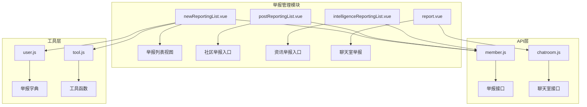

**图表来源**
- [newReportingList.vue:1-383](file://src/views/member/newReportingList.vue#L1-L383)
- [member.js:732-747](file://src/api/member.js#L732-L747)

**章节来源**
- [newReportingList.vue:10-174](file://src/views/member/newReportingList.vue#L10-L174)
- [postReportingList.vue:1-20](file://src/views/forum/postReportingList.vue#L1-L20)
- [intelligenceReportingList.vue:1-20](file://src/views/intelligence/intelligenceReportingList.vue#L1-L20)

## 核心组件
举报列表V2由多个核心组件构成，每个组件负责特定的功能领域：

### 主要组件架构
- **newReportingList.vue**: 核心举报列表组件，提供完整的举报数据展示和处理功能
- **postReportingList.vue**: 社区举报入口，专门处理社区相关内容的举报
- **intelligenceReportingList.vue**: 资讯举报入口，专注于资讯内容的举报管理
- **report.vue**: 聊天室举报组件，处理实时聊天中的举报情况

### 数据流处理
组件间通过props和事件进行数据传递，形成清晰的数据流向：

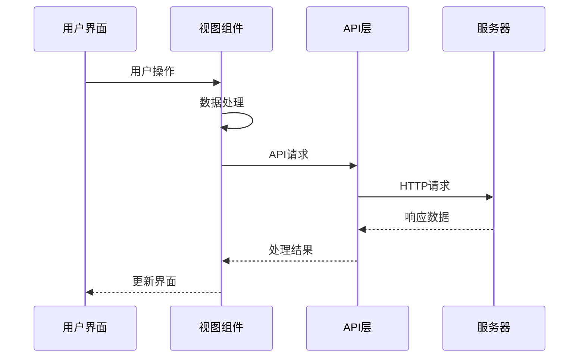

**图表来源**
- [newReportingList.vue:240-322](file://src/views/member/newReportingList.vue#L240-L322)
- [member.js:732-747](file://src/api/member.js#L732-L747)

**章节来源**
- [newReportingList.vue:176-382](file://src/views/member/newReportingList.vue#L176-L382)

## 架构概览
举报列表V2采用分层架构设计，确保各组件职责明确、耦合度低：

### 整体架构设计
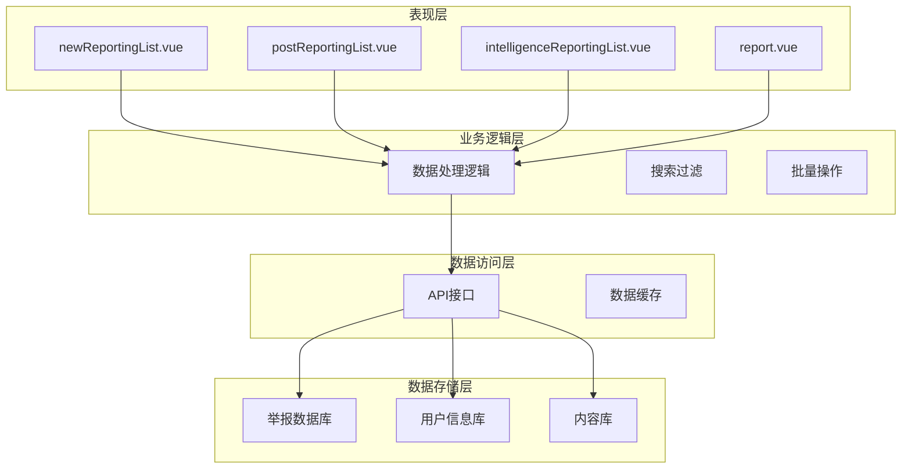

**图表来源**
- [newReportingList.vue:240-382](file://src/views/member/newReportingList.vue#L240-L382)
- [member.js:732-747](file://src/api/member.js#L732-L747)

### 数据模型设计
举报系统的核心数据模型包括：

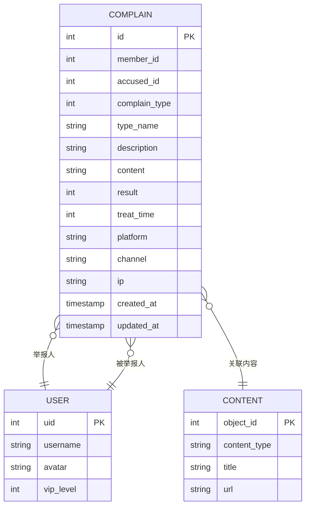

**图表来源**
- [newReportingList.vue:266-305](file://src/views/member/newReportingList.vue#L266-L305)
- [user.js:164-189](file://src/utils/dict/user.js#L164-L189)

**章节来源**
- [newReportingList.vue:266-322](file://src/views/member/newReportingList.vue#L266-L322)

## 详细组件分析

### newReportingList组件深度分析
newReportingList是举报列表V2的核心组件，提供了完整的举报管理功能。

#### 组件功能特性
- **多维度数据展示**: 支持举报人、被举报人、举报来源、举报类型等多维度信息展示
- **智能分类系统**: 引入举报分类和高风险标记功能
- **批量处理能力**: 支持批量不处理等批量操作
- **实时搜索过滤**: 提供强大的搜索和过滤功能

#### 数据处理流程
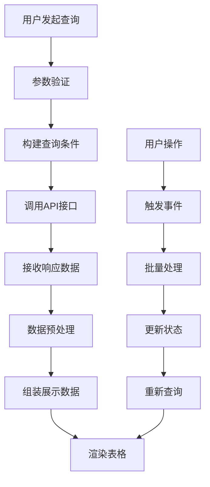

**图表来源**
- [newReportingList.vue:240-322](file://src/views/member/newReportingList.vue#L240-L322)

#### 关键实现细节
组件通过以下机制实现高效的数据处理：

1. **智能数据组装**: 自动处理图片URL前缀添加和内容预览
2. **权限控制**: 基于角色的权限检查，确保操作安全性
3. **状态管理**: 完善的加载状态和错误处理机制

**章节来源**
- [newReportingList.vue:240-382](file://src/views/member/newReportingList.vue#L240-L382)

### API接口设计分析
举报列表V2的API设计采用了现代化的RESTful架构：

#### 接口设计模式
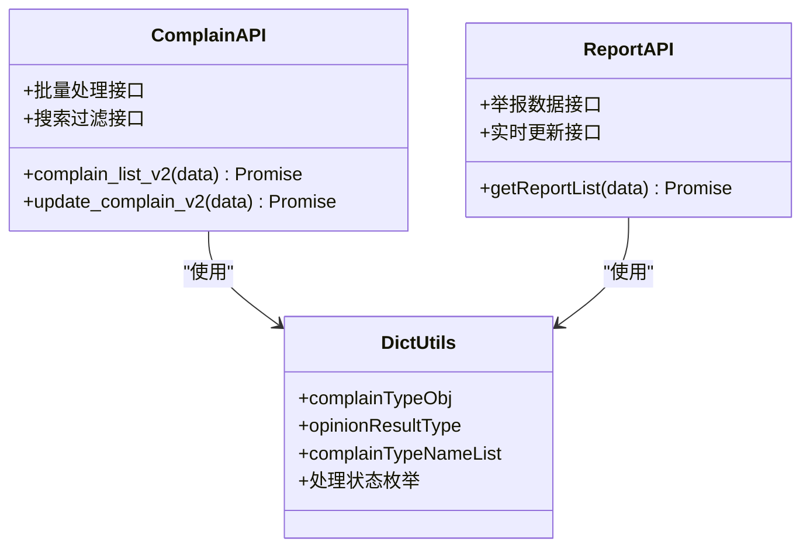

**图表来源**
- [member.js:732-747](file://src/api/member.js#L732-L747)
- [user.js:164-189](file://src/utils/dict/user.js#L164-L189)

#### 接口调用流程
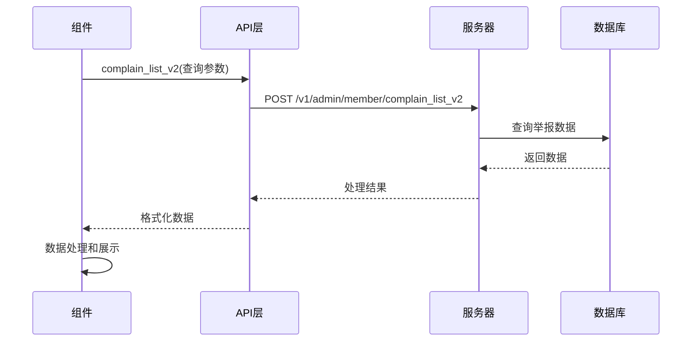

**图表来源**
- [member.js:732-747](file://src/api/member.js#L732-L747)

**章节来源**
- [member.js:732-747](file://src/api/member.js#L732-L747)

### 搜索和过滤功能
举报列表V2提供了强大的搜索和过滤功能，支持多维度的数据检索：

#### 搜索条件配置
组件支持以下搜索条件：
- **基础信息**: 举报者UID、被举报人UID、举报ID
- **内容特征**: 举报类型、举报原因、违规内容
- **状态信息**: 处理状态、处理方式、IP地址
- **时间范围**: 创建时间、更新时间

#### 智能过滤机制
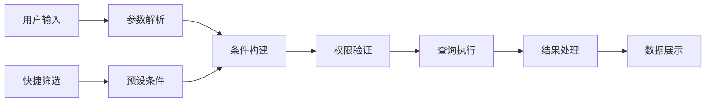

**图表来源**
- [post.js:531-546](file://src/components/newMySearch/components/searchKey/compKey/post.js#L531-L546)
- [news.js:348-363](file://src/components/newMySearch/components/searchKey/compKey/news.js#L348-L363)

**章节来源**
- [post.js:531-546](file://src/components/newMySearch/components/searchKey/compKey/post.js#L531-L546)
- [news.js:348-363](file://src/components/newMySearch/components/searchKey/compKey/news.js#L348-L363)

## 依赖关系分析
举报列表V2的依赖关系呈现清晰的层次结构：

### 组件依赖图
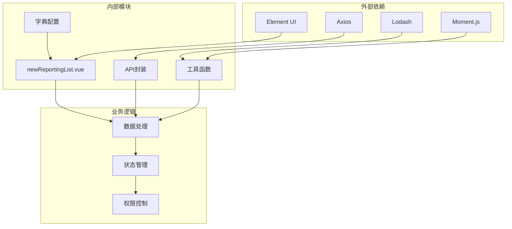

**图表来源**
- [newReportingList.vue:176-184](file://src/views/member/newReportingList.vue#L176-L184)
- [tool.js:1-10](file://src/utils/tool.js#L1-L10)

### 数据依赖关系
组件间的依赖关系通过props和事件实现松耦合：

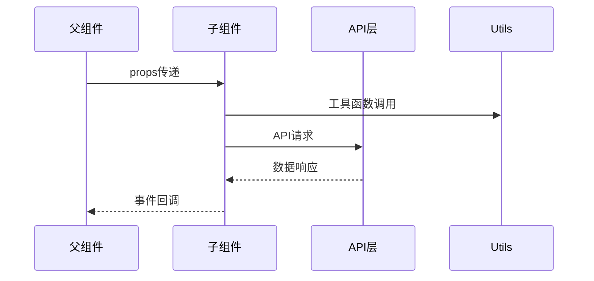

**图表来源**
- [newReportingList.vue:176-184](file://src/views/member/newReportingList.vue#L176-L184)

**章节来源**
- [newReportingList.vue:176-382](file://src/views/member/newReportingList.vue#L176-L382)

## 性能考虑
举报列表V2在性能方面采用了多项优化策略：

### 数据加载优化
- **虚拟滚动**: 大数据量下的表格渲染优化
- **懒加载**: 图片和内容的延迟加载机制
- **缓存策略**: 重复查询结果的本地缓存

### 网络请求优化
- **请求合并**: 多个相似请求的合并处理
- **防抖机制**: 搜索输入的防抖处理
- **分页加载**: 大数据集的分页加载策略

### 内存管理
- **组件销毁**: 合理的组件生命周期管理
- **事件监听**: 事件监听器的正确清理
- **定时器管理**: 定时任务的及时清理

## 故障排除指南
针对举报列表V2可能出现的问题提供解决方案：

### 常见问题及解决方案
1. **数据加载失败**
   - 检查API连接状态
   - 验证网络请求参数
   - 查看服务器响应状态

2. **权限不足**
   - 确认用户角色权限
   - 检查操作权限配置
   - 验证登录状态

3. **搜索结果异常**
   - 检查搜索条件格式
   - 验证参数类型
   - 清除缓存后重试

### 错误处理机制
组件实现了完善的错误处理机制：

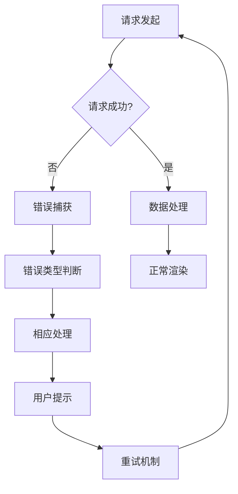

**图表来源**
- [newReportingList.vue:317-321](file://src/views/member/newReportingList.vue#L317-L321)

**章节来源**
- [newReportingList.vue:317-355](file://src/views/member/newReportingList.vue#L317-L355)

## 结论
举报列表V2通过引入智能化处理机制、完善的数据分类体系和友好的用户界面，显著提升了举报管理的效率和准确性。该系统的设计充分考虑了可扩展性和可维护性，为未来的功能扩展奠定了坚实的基础。

主要优势包括：
- **智能化处理**: 自动审核和风险评估功能
- **精确分类**: 多维度的举报分类和标记系统
- **高效统计**: 完善的统计指标和分析功能
- **友好界面**: 直观的操作界面和用户体验
- **扩展性强**: 模块化的架构设计便于功能扩展

## 附录

### API接口规范
举报列表V2提供以下核心API接口：

| 接口名称 | 方法 | 路径 | 功能描述 |
|---------|------|------|----------|
| 举报列表V2 | POST | /v1/admin/member/complain_list_v2 | 获取举报列表数据 |
| 处理举报V2 | POST | /v1/admin/member/update_complain_v2 | 更新举报处理状态 |

### 数据字典
系统使用以下关键数据字典：

- **举报类型**: 违法违规、色情低俗、违规营销等
- **处理状态**: 未处理、已处理、不处理等
- **风险等级**: 普通、高风险等分类

### 配置选项
系统支持以下配置选项：
- **搜索条件**: 多维度的搜索和过滤条件
- **显示字段**: 可配置的表格显示字段
- **权限控制**: 基于角色的权限管理
- **批量操作**: 支持的批量处理功能