# 内容报表统计

<cite>
**本文引用的文件**
- [src/views/forum/report_list.vue](file://src/views/forum/report_list.vue)
- [src/views/chat_room/report.vue](file://src/views/chat_room/report.vue)
- [src/views/forum/silent_list.vue](file://src/views/forum/silent_list.vue)
- [src/views/intelligence/operation_history.vue](file://src/views/intelligence/operation_history.vue)
- [src/views/system/operate_logs.vue](file://src/views/system/operate_logs.vue)
- [src/api/community.js](file://src/api/community.js)
- [src/components/exportExcel/index.vue](file://src/components/exportExcel/index.vue)
- [src/components/exportExcel/exportExcelHelpers.js](file://src/components/exportExcel/exportExcelHelpers.js)
- [src/components/Charts/MixChart.vue](file://src/components/Charts/MixChart.vue)
- [src/utils/echartsHelper.js](file://src/utils/echartsHelper.js)
- [src/components/leisu/reportBarChart.vue](file://src/components/leisu/reportBarChart.vue)
- [src/components/leisu/reportLineChart.vue](file://src/components/leisu/reportLineChart.vue)
- [src/views/chat_room/roomecharts.vue](file://src/views/chat_room/roomecharts.vue)
- [src/mixins/formatEchartData.vue](file://src/mixins/formatEchartData.vue)
- [src/router/children/contentSecurity.js](file://src/router/children/contentSecurity.js)
- [src/views/contentSecurity/machineAudit.vue](file://src/views/contentSecurity/machineAudit.vue)
- [src/api/contentSecurity.js](file://src/api/contentSecurity.js)
</cite>

## 目录
1. [简介](#简介)
2. [项目结构](#项目结构)
3. [核心组件](#核心组件)
4. [架构总览](#架构总览)
5. [详细组件分析](#详细组件分析)
6. [依赖关系分析](#依赖关系分析)
7. [性能考量](#性能考量)
8. [故障排查指南](#故障排查指南)
9. [结论](#结论)
10. [附录](#附录)

## 简介
本技术文档围绕内容报表统计系统展开，聚焦于以下统计主题：
- 帖子报表：社区举报统计、禁言记录、互动与交易趋势等
- 举报统计：按对象类型（帖子/评论/直播互动/资讯评论）的举报列表与明细
- 禁言记录：用户被封禁/解封的历史与原因
- 操作历史：内容与系统层面的操作日志与审计
- 统计图表：折线/柱状/混合图表的渲染与交互
- 导出能力：表格与图片资源的批量导出

文档将从系统架构、数据流、处理逻辑、集成点、错误处理与性能优化等方面进行深入解析，并提供最佳实践与可落地的配置建议。

## 项目结构
报表统计功能主要分布在以下模块：
- 视图层：论坛举报列表、聊天室举报列表、禁言记录、操作历史、系统操作日志等页面
- API 层：社区与内容安全相关接口封装
- 图表层：ECharts 封装与通用图表组件
- 导出层：Excel 导出组件与格式化工具
- 工具与混入：时间格式化、ECharts 辅助工具、图表数据组装混入

```mermaid
graph TB
subgraph "视图层"
V_forum_report["论坛举报列表<br/>src/views/forum/report_list.vue"]
V_chat_report["聊天室举报列表<br/>src/views/chat_room/report.vue"]
V_silent["禁言记录<br/>src/views/forum/silent_list.vue"]
V_op_hist_intel["情报操作历史<br/>src/views/intelligence/operation_history.vue"]
V_op_logs_sys["系统操作日志<br/>src/views/system/operate_logs.vue"]
end
subgraph "API 层"
A_community["社区接口<br/>src/api/community.js"]
A_content_security["内容安全接口<br/>src/api/contentSecurity.js"]
end
subgraph "图表层"
C_mixchart["混合图表组件<br/>src/components/Charts/MixChart.vue"]
U_echarts_helper["ECharts 辅助工具<br/>src/utils/echartsHelper.js"]
C_report_bar["举报柱状图<br/>src/components/leisu/reportBarChart.vue"]
C_report_line["举报折线图<br/>src/components/leisu/reportLineChart.vue"]
V_roomecharts["聊天室趋势图<br/>src/views/chat_room/roomecharts.vue"]
M_format_ec["图表数据混入<br/>src/mixins/formatEchartData.vue"]
end
subgraph "导出层"
E_index["导出组件入口<br/>src/components/exportExcel/index.vue"]
E_helpers["导出格式化工具<br/>src/components/exportExcel/exportExcelHelpers.js"]
end
V_forum_report --> A_community
V_chat_report --> A_community
V_silent --> A_community
V_op_hist_intel --> A_community
V_op_logs_sys --> A_community
V_forum_report --> C_mixchart
V_chat_report --> C_mixchart
V_silent --> C_mixchart
V_op_hist_intel --> C_mixchart
V_op_logs_sys --> C_mixchart
C_mixchart --> U_echarts_helper
C_report_bar --> U_echarts_helper
C_report_line --> U_echarts_helper
V_roomecharts --> M_format_ec
V_forum_report --> E_index
V_chat_report --> E_index
V_silent --> E_index
V_op_hist_intel --> E_index
V_op_logs_sys --> E_index
A_content_security --> V_content_maudit["机审/人审页面<br/>src/views/contentSecurity/machineAudit.vue"]
```

**图表来源**
- [src/views/forum/report_list.vue:1-208](file://src/views/forum/report_list.vue#L1-L208)
- [src/views/chat_room/report.vue:1-148](file://src/views/chat_room/report.vue#L1-L148)
- [src/views/forum/silent_list.vue:1-158](file://src/views/forum/silent_list.vue#L1-L158)
- [src/views/intelligence/operation_history.vue:1-252](file://src/views/intelligence/operation_history.vue#L1-L252)
- [src/views/system/operate_logs.vue:1-244](file://src/views/system/operate_logs.vue#L1-L244)
- [src/api/community.js:353-375](file://src/api/community.js#L353-L375)
- [src/components/Charts/MixChart.vue:1-272](file://src/components/Charts/MixChart.vue#L1-L272)
- [src/utils/echartsHelper.js:1-138](file://src/utils/echartsHelper.js#L1-L138)
- [src/components/leisu/reportBarChart.vue](file://src/components/leisu/reportBarChart.vue)
- [src/components/leisu/reportLineChart.vue](file://src/components/leisu/reportLineChart.vue)
- [src/views/chat_room/roomecharts.vue:93-130](file://src/views/chat_room/roomecharts.vue#L93-L130)
- [src/mixins/formatEchartData.vue:1-49](file://src/mixins/formatEchartData.vue#L1-L49)
- [src/components/exportExcel/index.vue:91-120](file://src/components/exportExcel/index.vue#L91-L120)
- [src/components/exportExcel/exportExcelHelpers.js:572-613](file://src/components/exportExcel/exportExcelHelpers.js#L572-L613)
- [src/views/contentSecurity/machineAudit.vue:43-86](file://src/views/contentSecurity/machineAudit.vue#L43-L86)
- [src/api/contentSecurity.js:63-115](file://src/api/contentSecurity.js#L63-L115)

**章节来源**
- [src/views/forum/report_list.vue:1-208](file://src/views/forum/report_list.vue#L1-L208)
- [src/views/chat_room/report.vue:1-148](file://src/views/chat_room/report.vue#L1-L148)
- [src/views/forum/silent_list.vue:1-158](file://src/views/forum/silent_list.vue#L1-L158)
- [src/views/intelligence/operation_history.vue:1-252](file://src/views/intelligence/operation_history.vue#L1-L252)
- [src/views/system/operate_logs.vue:1-244](file://src/views/system/operate_logs.vue#L1-L244)
- [src/api/community.js:353-375](file://src/api/community.js#L353-L375)
- [src/components/Charts/MixChart.vue:1-272](file://src/components/Charts/MixChart.vue#L1-L272)
- [src/utils/echartsHelper.js:1-138](file://src/utils/echartsHelper.js#L1-L138)
- [src/components/leisu/reportBarChart.vue](file://src/components/leisu/reportBarChart.vue)
- [src/components/leisu/reportLineChart.vue](file://src/components/leisu/reportLineChart.vue)
- [src/views/chat_room/roomecharts.vue:93-130](file://src/views/chat_room/roomecharts.vue#L93-L130)
- [src/mixins/formatEchartData.vue:1-49](file://src/mixins/formatEchartData.vue#L1-L49)
- [src/components/exportExcel/index.vue:91-120](file://src/components/exportExcel/index.vue#L91-L120)
- [src/components/exportExcel/exportExcelHelpers.js:572-613](file://src/components/exportExcel/exportExcelHelpers.js#L572-L613)
- [src/views/contentSecurity/machineAudit.vue:43-86](file://src/views/contentSecurity/machineAudit.vue#L43-L86)
- [src/api/contentSecurity.js:63-115](file://src/api/contentSecurity.js#L63-L115)

## 核心组件
- 举报统计
  - 论坛举报列表：支持按举报对象类型筛选，展示举报人、被举报人、提交时间、举报内容与附件等，支持排序与分页
  - 聊天室举报列表：支持按类型筛选，展示举报人、被举报人、提交时间、举报内容与举报人IP
- 禁言记录
  - 展示用户被封禁/解封的时间、操作人、备注等，支持按操作人类型过滤
- 操作历史
  - 情报操作历史：展示操作人、用户、操作类型、对象ID、内容摘要、图片、备注、持续时间、创建时间等
  - 系统操作日志：基于日志检索系统，支持时间范围、关键词查询与排序
- 统计图表
  - 混合图表组件：支持柱状/折线/堆叠等组合，内置缩放与提示
  - ECharts 辅助工具：动态调整 markArea 边框宽度以适配可视数据点密度
  - 举报折线/柱状图组件：面向举报趋势的专用图表
  - 聊天室趋势图：多系列折线展示消息量、用户数、房间数等
- 导出能力
  - 导出组件：统一导出配置、自动列宽、图片嵌入或链接模式
  - 导出格式化工具：对时间、标签、操作人等字段进行格式化，支持图片 URL 收集与 Base64 嵌入

**章节来源**
- [src/views/forum/report_list.vue:14-92](file://src/views/forum/report_list.vue#L14-L92)
- [src/views/chat_room/report.vue:18-61](file://src/views/chat_room/report.vue#L18-L61)
- [src/views/forum/silent_list.vue:16-51](file://src/views/forum/silent_list.vue#L16-L51)
- [src/views/intelligence/operation_history.vue:37-112](file://src/views/intelligence/operation_history.vue#L37-L112)
- [src/views/system/operate_logs.vue:25-95](file://src/views/system/operate_logs.vue#L25-L95)
- [src/components/Charts/MixChart.vue:44-268](file://src/components/Charts/MixChart.vue#L44-L268)
- [src/utils/echartsHelper.js:71-103](file://src/utils/echartsHelper.js#L71-L103)
- [src/components/leisu/reportBarChart.vue](file://src/components/leisu/reportBarChart.vue)
- [src/components/leisu/reportLineChart.vue](file://src/components/leisu/reportLineChart.vue)
- [src/views/chat_room/roomecharts.vue:93-130](file://src/views/chat_room/roomecharts.vue#L93-L130)
- [src/components/exportExcel/index.vue:91-120](file://src/components/exportExcel/index.vue#L91-L120)
- [src/components/exportExcel/exportExcelHelpers.js:572-613](file://src/components/exportExcel/exportExcelHelpers.js#L572-L613)

## 架构总览
报表统计系统采用“视图-接口-图表-导出”的分层设计：
- 视图层负责查询条件、表格展示与交互
- 接口层封装后端 REST API，提供统一的数据获取入口
- 图表层提供通用与专用图表组件，结合辅助工具实现动态交互
- 导出层提供统一的导出配置与格式化策略

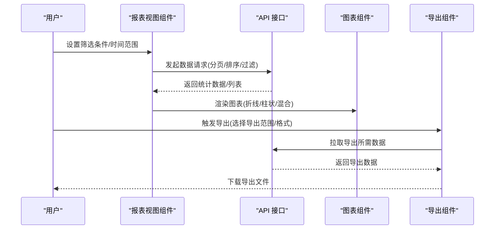

**图表来源**
- [src/views/forum/report_list.vue:143-186](file://src/views/forum/report_list.vue#L143-L186)
- [src/views/chat_room/report.vue:99-137](file://src/views/chat_room/report.vue#L99-L137)
- [src/views/forum/silent_list.vue:102-154](file://src/views/forum/silent_list.vue#L102-L154)
- [src/views/intelligence/operation_history.vue:191-211](file://src/views/intelligence/operation_history.vue#L191-L211)
- [src/views/system/operate_logs.vue:148-186](file://src/views/system/operate_logs.vue#L148-L186)
- [src/api/community.js:353-375](file://src/api/community.js#L353-L375)
- [src/components/exportExcel/index.vue:91-120](file://src/components/exportExcel/index.vue#L91-L120)

## 详细组件分析

### 论坛举报统计
- 功能要点
  - 支持按举报对象类型切换（帖子/评论/直播互动/资讯评论），动态更新列名与列宽
  - 展示举报人/被举报人、提交时间、标题/内容摘要、图片附件、额外信息（如价格/时间区间）
  - 支持排序与分页；点击对象ID可跳转到对应详情
- 数据来源
  - 使用社区举报列表接口，支持分页、排序条件与搜索条件合并
- 图表与导出
  - 可结合折线/柱状图展示举报趋势；导出时使用统一格式化工具处理字段

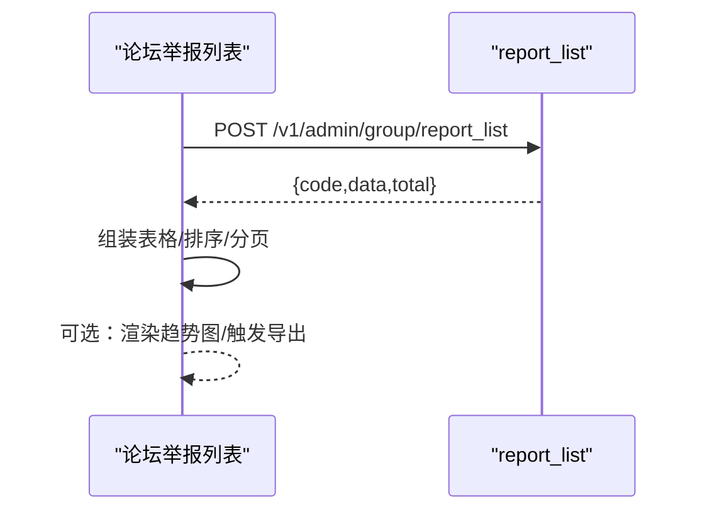

**图表来源**
- [src/views/forum/report_list.vue:143-186](file://src/views/forum/report_list.vue#L143-L186)
- [src/api/community.js:353-360](file://src/api/community.js#L353-L360)

**章节来源**
- [src/views/forum/report_list.vue:1-208](file://src/views/forum/report_list.vue#L1-L208)
- [src/api/community.js:353-360](file://src/api/community.js#L353-L360)

### 聊天室举报统计
- 功能要点
  - 展示举报类型、举报人/被举报人、提交时间、举报内容、举报人IP
  - 支持排序与分页；列表项高度自适应容器
- 数据来源
  - 使用聊天室举报列表接口，支持排序条件与搜索条件合并

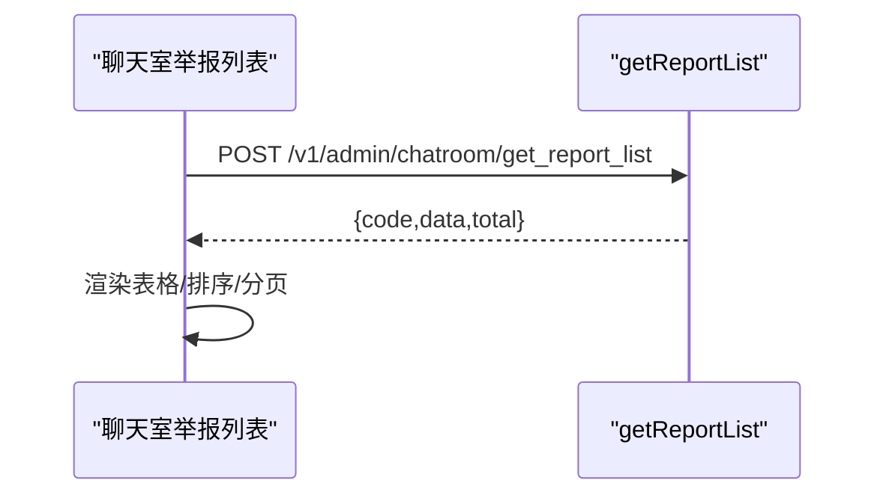

**图表来源**
- [src/views/chat_room/report.vue:99-137](file://src/views/chat_room/report.vue#L99-L137)
- [src/api/community.js:353-360](file://src/api/community.js#L353-L360)

**章节来源**
- [src/views/chat_room/report.vue:1-148](file://src/views/chat_room/report.vue#L1-L148)

### 禁言记录
- 功能要点
  - 展示用户、操作人、操作时间、解禁时间、备注等
  - 支持按操作人类型过滤（管理员/协管员/系统）
  - 圈子维度：在备注中补充圈子名称
- 数据来源
  - 使用禁言记录接口，支持排序条件与搜索条件合并

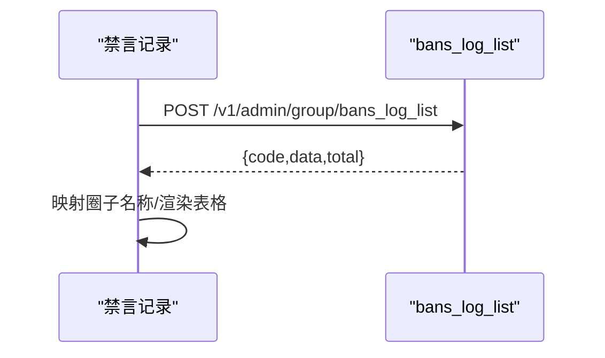

**图表来源**
- [src/views/forum/silent_list.vue:102-154](file://src/views/forum/silent_list.vue#L102-L154)
- [src/api/community.js:361-368](file://src/api/community.js#L361-L368)

**章节来源**
- [src/views/forum/silent_list.vue:1-158](file://src/views/forum/silent_list.vue#L1-L158)
- [src/api/community.js:361-368](file://src/api/community.js#L361-L368)

### 情报操作历史
- 功能要点
  - 展示操作人、用户、操作类型、对象ID、内容摘要、图片、备注、持续时间、对象创建时间、记录创建时间
  - 支持按操作类型筛选（删除/隐藏/全部），支持 UID 快速查询
- 数据来源
  - 使用删除日志列表接口，支持排序条件与搜索条件合并

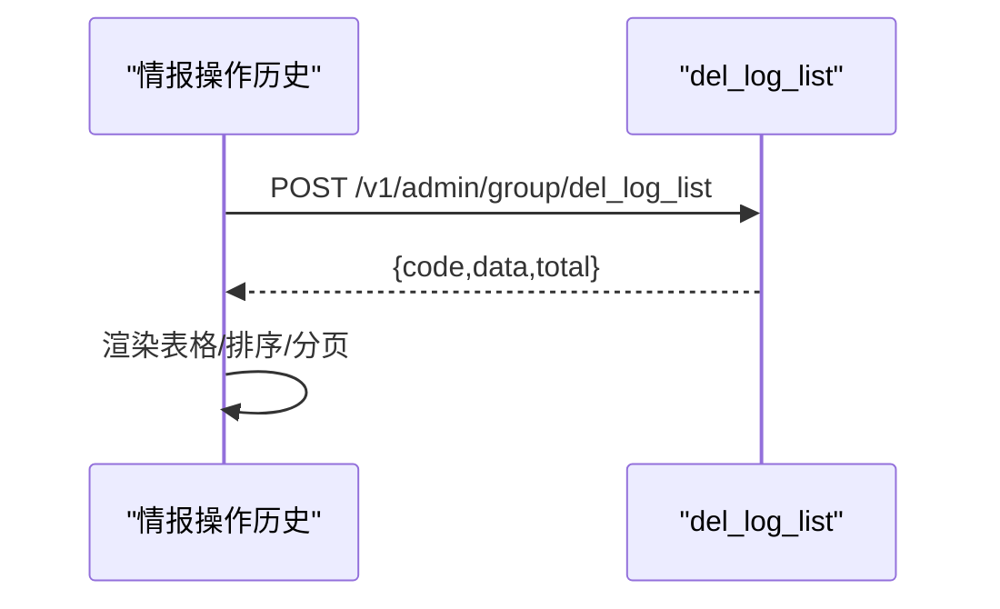

**图表来源**
- [src/views/intelligence/operation_history.vue:191-211](file://src/views/intelligence/operation_history.vue#L191-L211)
- [src/api/community.js:369-375](file://src/api/community.js#L369-L375)

**章节来源**
- [src/views/intelligence/operation_history.vue:1-252](file://src/views/intelligence/operation_history.vue#L1-L252)
- [src/api/community.js:369-375](file://src/api/community.js#L369-L375)

### 系统操作日志
- 功能要点
  - 基于日志检索系统，支持时间范围、关键词查询、排序与分页
  - 展示操作时间、操作人ID/IP/真实姓名、接口地址、操作描述、参数等
- 数据来源
  - 使用日志检索接口，支持查询语句、时间戳与排序

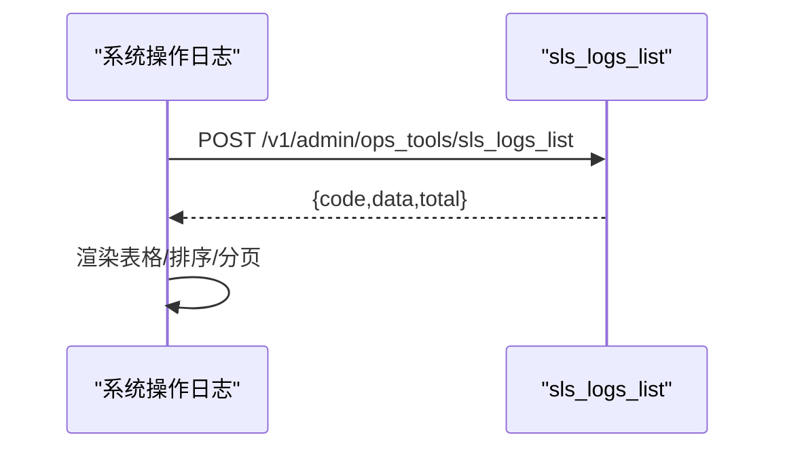

**图表来源**
- [src/views/system/operate_logs.vue:148-186](file://src/views/system/operate_logs.vue#L148-L186)
- [src/api/community.js:369-375](file://src/api/community.js#L369-L375)

**章节来源**
- [src/views/system/operate_logs.vue:1-244](file://src/views/system/operate_logs.vue#L1-L244)

### 统计图表与交互
- 混合图表组件
  - 支持柱状/折线/堆叠等组合，内置 dataZoom、提示框与网格布局
- ECharts 辅助工具
  - 动态根据可视数据点数量调整 markArea 边框宽度，提升大数据量下的可读性
- 举报折线/柱状图组件
  - 面向举报趋势的专用图表，支持多维度序列与区域样式
- 聊天室趋势图
  - 多系列折线展示消息总量、用户数、房间数等，支持滚动图例与提示格式化

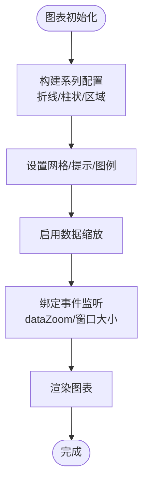

**图表来源**
- [src/components/Charts/MixChart.vue:44-268](file://src/components/Charts/MixChart.vue#L44-L268)
- [src/utils/echartsHelper.js:71-103](file://src/utils/echartsHelper.js#L71-L103)
- [src/components/leisu/reportBarChart.vue](file://src/components/leisu/reportBarChart.vue)
- [src/components/leisu/reportLineChart.vue](file://src/components/leisu/reportLineChart.vue)
- [src/views/chat_room/roomecharts.vue:93-130](file://src/views/chat_room/roomecharts.vue#L93-L130)
- [src/mixins/formatEchartData.vue:38-49](file://src/mixins/formatEchartData.vue#L38-L49)

**章节来源**
- [src/components/Charts/MixChart.vue:1-272](file://src/components/Charts/MixChart.vue#L1-L272)
- [src/utils/echartsHelper.js:1-138](file://src/utils/echartsHelper.js#L1-L138)
- [src/components/leisu/reportBarChart.vue](file://src/components/leisu/reportBarChart.vue)
- [src/components/leisu/reportLineChart.vue](file://src/components/leisu/reportLineChart.vue)
- [src/views/chat_room/roomecharts.vue:93-130](file://src/views/chat_room/roomecharts.vue#L93-L130)
- [src/mixins/formatEchartData.vue:1-49](file://src/mixins/formatEchartData.vue#L1-L49)

### 导出功能
- 组件入口
  - 统一导出配置、加载状态、弹窗控制、标题映射、导出参数与分页参数
- 格式化策略
  - 基础数据格式化：时间、标签、推送状态、操作人等
  - 带图与超链接格式化：收集图片 URL 并按模式嵌入 Base64 或保留链接
  - 截断策略：对超量选中项进行随机截断，避免导出过大
- 图片处理
  - 支持图片嵌入模式与链接模式，自动去重并转换为完整 URL

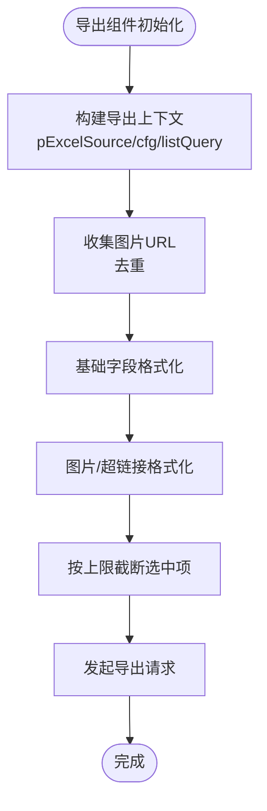

**图表来源**
- [src/components/exportExcel/index.vue:91-120](file://src/components/exportExcel/index.vue#L91-L120)
- [src/components/exportExcel/exportExcelHelpers.js:572-613](file://src/components/exportExcel/exportExcelHelpers.js#L572-L613)

**章节来源**
- [src/components/exportExcel/index.vue:91-120](file://src/components/exportExcel/index.vue#L91-L120)
- [src/components/exportExcel/exportExcelHelpers.js:552-613](file://src/components/exportExcel/exportExcelHelpers.js#L552-L613)

### 内容安全与审核报表
- 机审/人审队列
  - 展示不同类型审核任务的队列状态与头部统计，支持自动刷新与倒计时
- 审核接口
  - 提供处理二审、忽略误判、敏感词管理等接口

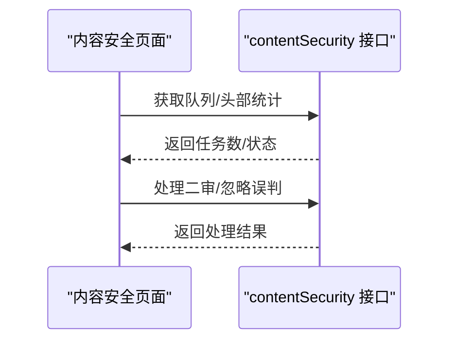

**图表来源**
- [src/views/contentSecurity/machineAudit.vue:63-86](file://src/views/contentSecurity/machineAudit.vue#L63-L86)
- [src/api/contentSecurity.js:63-115](file://src/api/contentSecurity.js#L63-L115)
- [src/router/children/contentSecurity.js:1-43](file://src/router/children/contentSecurity.js#L1-L43)

**章节来源**
- [src/views/contentSecurity/machineAudit.vue:43-86](file://src/views/contentSecurity/machineAudit.vue#L43-L86)
- [src/api/contentSecurity.js:63-115](file://src/api/contentSecurity.js#L63-L115)
- [src/router/children/contentSecurity.js:1-43](file://src/router/children/contentSecurity.js#L1-L43)

## 依赖关系分析
- 组件耦合
  - 视图组件通过 API 层与后端交互，耦合度低，便于扩展新的报表类型
  - 图表组件与辅助工具解耦，通过混入与工具函数注入能力
- 外部依赖
  - ECharts 作为图表渲染引擎，提供丰富的交互与样式能力
  - 日志检索系统提供系统操作日志的查询能力
- 潜在循环依赖
  - 导出工具与组件之间为单向依赖，无循环
- 接口契约
  - 所有报表接口遵循统一的分页/排序/过滤参数约定，便于前端一致化处理

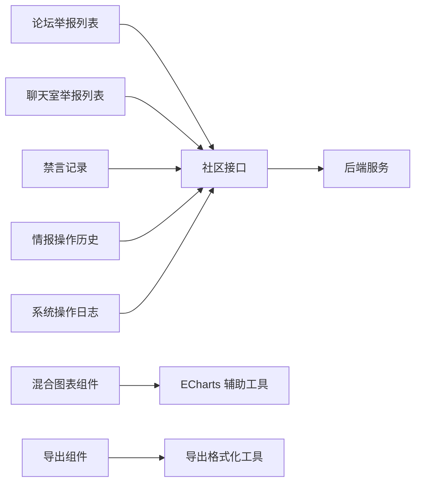

**图表来源**
- [src/views/forum/report_list.vue:95-104](file://src/views/forum/report_list.vue#L95-L104)
- [src/views/chat_room/report.vue:65-70](file://src/views/chat_room/report.vue#L65-L70)
- [src/views/forum/silent_list.vue:56-61](file://src/views/forum/silent_list.vue#L56-L61)
- [src/views/intelligence/operation_history.vue:132-140](file://src/views/intelligence/operation_history.vue#L132-L140)
- [src/views/system/operate_logs.vue:98-102](file://src/views/system/operate_logs.vue#L98-L102)
- [src/api/community.js:353-375](file://src/api/community.js#L353-L375)
- [src/components/Charts/MixChart.vue:6-7](file://src/components/Charts/MixChart.vue#L6-L7)
- [src/utils/echartsHelper.js:1-138](file://src/utils/echartsHelper.js#L1-L138)
- [src/components/exportExcel/index.vue:91-120](file://src/components/exportExcel/index.vue#L91-L120)
- [src/components/exportExcel/exportExcelHelpers.js:572-613](file://src/components/exportExcel/exportExcelHelpers.js#L572-L613)

**章节来源**
- [src/views/forum/report_list.vue:95-104](file://src/views/forum/report_list.vue#L95-L104)
- [src/views/chat_room/report.vue:65-70](file://src/views/chat_room/report.vue#L65-L70)
- [src/views/forum/silent_list.vue:56-61](file://src/views/forum/silent_list.vue#L56-L61)
- [src/views/intelligence/operation_history.vue:132-140](file://src/views/intelligence/operation_history.vue#L132-L140)
- [src/views/system/operate_logs.vue:98-102](file://src/views/system/operate_logs.vue#L98-L102)
- [src/api/community.js:353-375](file://src/api/community.js#L353-L375)
- [src/components/Charts/MixChart.vue:6-7](file://src/components/Charts/MixChart.vue#L6-L7)
- [src/utils/echartsHelper.js:1-138](file://src/utils/echartsHelper.js#L1-L138)
- [src/components/exportExcel/index.vue:91-120](file://src/components/exportExcel/index.vue#L91-L120)
- [src/components/exportExcel/exportExcelHelpers.js:572-613](file://src/components/exportExcel/exportExcelHelpers.js#L572-L613)

## 性能考量
- 数据聚合与分页
  - 前端统一使用分页参数，避免一次性拉取大量数据；对排序与搜索条件进行合并，减少无效请求
- 图表渲染优化
  - 使用 ECharts 辅助工具动态调整 markArea 边框宽度，降低大数据量下的视觉噪声
  - 混合图表组件内置 dataZoom，支持局部放大与缩放，提升长序列浏览体验
- 导出性能
  - 导出前对选中项进行随机截断，避免超大导出导致内存压力
  - 图片嵌入模式下先收集 URL 并去重，再按需转换为 Base64，减少重复处理
- 网络与缓存
  - 对高频查询（如举报列表、禁言记录）可考虑本地缓存与增量刷新策略（建议在业务层实现）

[本节为通用性能指导，无需特定文件引用]

## 故障排查指南
- 报表无数据或总数异常
  - 检查分页参数与排序条件是否正确传递至接口
  - 确认搜索条件合并逻辑（如举报类型、操作人类型过滤）是否生效
- 图表渲染异常或空白
  - 确认 ECharts 实例初始化与销毁流程，避免重复初始化
  - 检查 dataZoom 事件绑定与可视数据点数量计算
- 导出失败或文件过大
  - 检查导出格式化工具中的字段映射与图片 URL 收集逻辑
  - 确认导出上限截断策略是否触发
- 系统操作日志查询无结果
  - 校验时间范围与查询语句是否正确
  - 确认日志存储与索引是否可用

**章节来源**
- [src/views/forum/report_list.vue:143-186](file://src/views/forum/report_list.vue#L143-L186)
- [src/views/chat_room/report.vue:99-137](file://src/views/chat_room/report.vue#L99-L137)
- [src/views/forum/silent_list.vue:102-154](file://src/views/forum/silent_list.vue#L102-L154)
- [src/views/intelligence/operation_history.vue:191-211](file://src/views/intelligence/operation_history.vue#L191-L211)
- [src/views/system/operate_logs.vue:148-186](file://src/views/system/operate_logs.vue#L148-L186)
- [src/utils/echartsHelper.js:71-103](file://src/utils/echartsHelper.js#L71-L103)
- [src/components/exportExcel/exportExcelHelpers.js:552-558](file://src/components/exportExcel/exportExcelHelpers.js#L552-L558)

## 结论
本系统通过清晰的分层设计与标准化接口，实现了覆盖举报、禁言、操作历史与内容安全等多维度的报表统计能力。配合通用图表组件与导出工具，能够快速构建可视化与可审计的统计分析体系。建议在生产环境中进一步完善缓存与增量刷新机制，持续优化大数据量场景下的渲染与导出性能。

[本节为总结性内容，无需特定文件引用]

## 附录
- 报表维度与指标建议
  - 时间维度：日/周/月/自定义时间范围
  - 用户维度：举报人/被举报人/操作人/用户等级/VIP 类型
  - 内容维度：帖子/评论/直播互动/资讯评论/圈子
  - 行为维度：举报类型、操作类型、封禁时长、备注标签
- 配置选项参考
  - 统计周期：默认最近7天，支持自定义起止时间
  - 展示方式：表格/折线/柱状/混合图表，支持滚动图例与提示格式化
  - 导出格式：xlsx，支持自动列宽与图片嵌入/链接模式
- 最佳实践
  - 数据准确性：统一时间格式化与字段映射，确保跨模块一致性
  - 性能优化：合理分页与 dataZoom，避免一次性渲染过多数据点
  - 用户体验：提供快捷筛选、排序与导出，增强可发现性与可操作性

[本节为通用指导，无需特定文件引用]