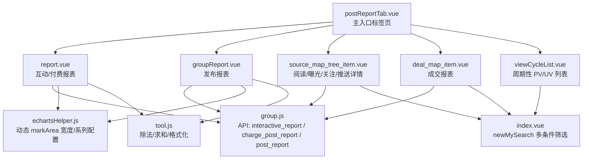
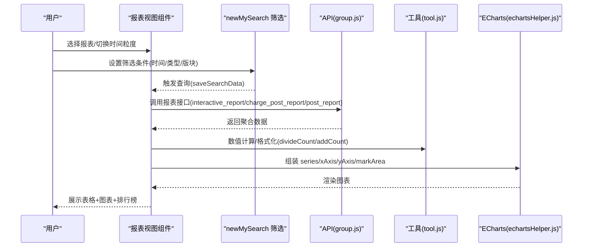
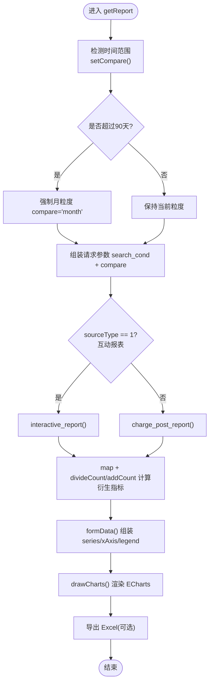
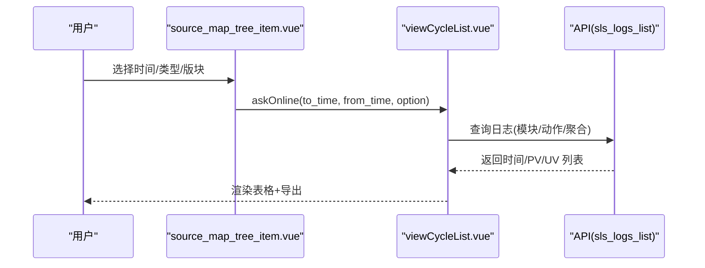
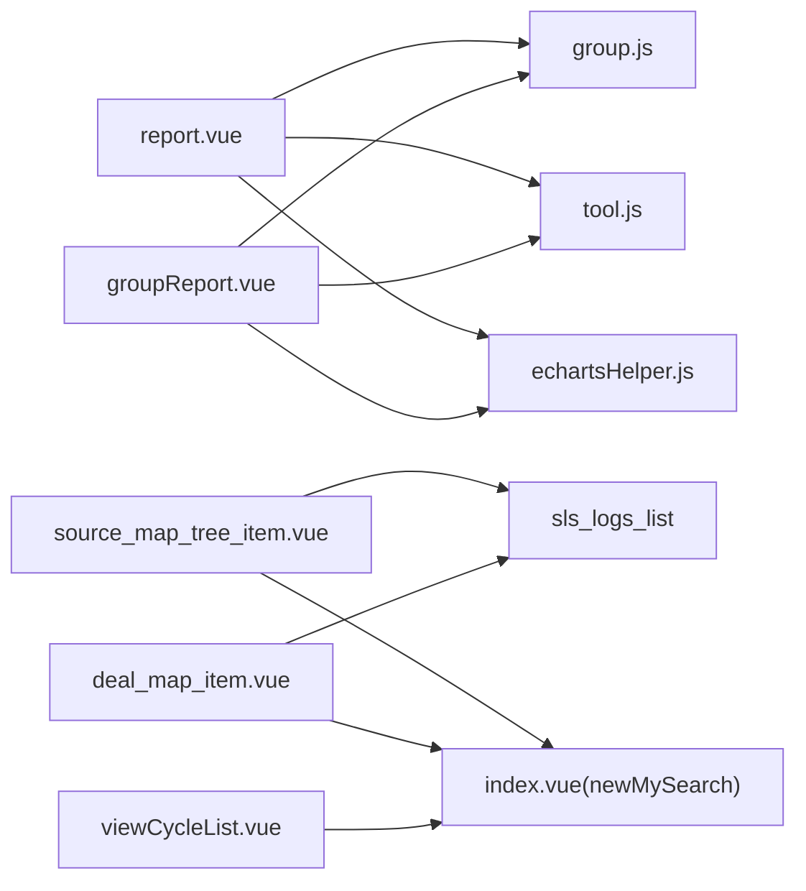

# 帖子报表

<cite>
**本文引用的文件**   
- [postReportTab.vue](file://src/views/forum/postReportTab.vue)
- [report.vue](file://src/views/forum/components/interactChargeReport/report.vue)
- [groupReport.vue](file://src/views/forum/components/interactChargeReport/groupReport.vue)
- [source_map_tree_item.vue](file://src/views/dashboard/components/tree/source_map_tree_item.vue)
- [deal_map_item.vue](file://src/views/dashboard/components/deal/deal_map_item.vue)
- [viewCycleList.vue](file://src/views/forum/components/interactChargeReport/viewCycleList.vue)
- [group.js](file://src/api/group.js)
- [echartsHelper.js](file://src/utils/echartsHelper.js)
- [tool.js](file://src/utils/tool.js)
- [formatEchartData.vue](file://src/mixins/formatEchartData.vue)
- [index.vue](file://src/components/newMySearch/index.vue)
</cite>

## 目录
1. [简介](#简介)
2. [项目结构](#项目结构)
3. [核心组件](#核心组件)
4. [架构总览](#架构总览)
5. [详细组件分析](#详细组件分析)
6. [依赖关系分析](#依赖关系分析)
7. [性能考虑](#性能考虑)
8. [故障排查指南](#故障排查指南)
9. [结论](#结论)
10. [附录](#附录)

## 简介
本技术文档围绕“帖子报表”功能展开，系统性阐述统计维度与指标、数据聚合算法、图表实现、筛选与查询参数、导出能力以及性能优化策略。该功能覆盖互动/付费报表、发布报表、阅读/曝光、成交、推手、圈子数据、社区流水等多个报表视图，支持按时间维度（日/周/月）、用户维度（发布者/买家/卖家/周卡持有者）、内容维度（帖子类型/版块）进行聚合与可视化。

## 项目结构
帖子报表由多个子报表视图组成，通过主入口标签页进行切换与权限控制，各子组件负责独立的数据查询、聚合与展示。

**图表来源**
- [postReportTab.vue:112-188](file://src/views/forum/postReportTab.vue#L112-L188)
- [report.vue:350-800](file://src/views/forum/components/interactChargeReport/report.vue#L350-L800)
- [groupReport.vue:113-443](file://src/views/forum/components/interactChargeReport/groupReport.vue#L113-L443)
- [source_map_tree_item.vue:62-232](file://src/views/dashboard/components/tree/source_map_tree_item.vue#L62-L232)
- [deal_map_item.vue:43-180](file://src/views/dashboard/components/deal/deal_map_item.vue#L43-L180)
- [viewCycleList.vue:35-192](file://src/views/forum/components/interactChargeReport/viewCycleList.vue#L35-L192)
- [group.js:466-488](file://src/api/group.js#L466-L488)
- [echartsHelper.js:118-138](file://src/utils/echartsHelper.js#L118-L138)
- [tool.js:494-510](file://src/utils/tool.js#L494-L510)
- [index.vue:322-800](file://src/components/newMySearch/index.vue#L322-L800)

**章节来源**
- [postReportTab.vue:112-188](file://src/views/forum/postReportTab.vue#L112-L188)

## 核心组件
- 主入口标签页：根据权限与场景动态选择子报表，支持抽屉模式与常规页面模式。
- 互动/付费报表：提供发布、购买、周卡等维度的统计与排行榜。
- 发布报表：聚焦“发布人数/发布篇数”的时间序列。
- 阅读/曝光/关注/推送详情：基于日志查询构建的周期性 PV/UV 列表。
- 成交报表：成交访问比、成交分布、来源分布、成交树图等。
- 筛选组件：newMySearch 提供多条件、历史/收藏、快捷时间等能力。

**章节来源**
- [report.vue:350-800](file://src/views/forum/components/interactChargeReport/report.vue#L350-L800)
- [groupReport.vue:113-443](file://src/views/forum/components/interactChargeReport/groupReport.vue#L113-L443)
- [source_map_tree_item.vue:62-232](file://src/views/dashboard/components/tree/source_map_tree_item.vue#L62-L232)
- [deal_map_item.vue:43-180](file://src/views/dashboard/components/deal/deal_map_item.vue#L43-L180)
- [viewCycleList.vue:35-192](file://src/views/forum/components/interactChargeReport/viewCycleList.vue#L35-L192)
- [index.vue:322-800](file://src/components/newMySearch/index.vue#L322-L800)

## 架构总览
帖子报表采用“视图组件 + API 调用 + 工具函数 + 图表辅助”的分层设计：
- 视图组件负责渲染表格、图表、筛选面板与导出。
- API 层封装交互接口，返回标准化的聚合数据。
- 工具函数提供数值计算、格式化与时间处理。
- 图表辅助模块提供 ECharts 的动态 markArea 宽度与系列配置。

**图表来源**
- [report.vue:537-611](file://src/views/forum/components/interactChargeReport/report.vue#L537-L611)
- [groupReport.vue:219-256](file://src/views/forum/components/interactChargeReport/groupReport.vue#L219-L256)
- [group.js:466-488](file://src/api/group.js#L466-L488)
- [tool.js:494-510](file://src/utils/tool.js#L494-L510)
- [echartsHelper.js:118-138](file://src/utils/echartsHelper.js#L118-L138)

## 详细组件分析

### 互动/付费报表（report.vue）
- 统计维度与指标
  - 发布：人数、发布人/次、发布篇数、发布总价、发布均价、有销量的人数、有销量的篇数、人均销量、篇均销量、单篇均价、阅读数、阅读人数。
  - 购买：单买人数、单买次数、单买人/次、单买金额、单买均价/人、单买均价/次。
  - 互动特有：周卡购买人数、周卡购买人次、周卡持有人数、周卡金额、周卡均价/人、购卡均价/次、互动档期总金额。
- 聚合算法
  - 通过 divideCount/addCount 等工具函数进行除法与加法运算，保证精度与边界处理。
  - 基于 compare（day/week/month）对时间维度进行聚合，超过90天自动切换为月粒度。
- 图表实现
  - 使用 createSeriesWithDynamicMarkArea 生成系列配置，启用动态 markArea 边框宽度，提升可视体验。
  - 多 Y 轴（数量/金额）并行展示，支持 dataZoom、legend 滚动与选择器。
- 导出
  - Excel 导出头与字段按需合并，支持互动特有列追加。

**图表来源**
- [report.vue:501-611](file://src/views/forum/components/interactChargeReport/report.vue#L501-L611)
- [report.vue:612-800](file://src/views/forum/components/interactChargeReport/report.vue#L612-L800)
- [tool.js:494-510](file://src/utils/tool.js#L494-L510)

**章节来源**
- [report.vue:350-800](file://src/views/forum/components/interactChargeReport/report.vue#L350-L800)
- [tool.js:472-510](file://src/utils/tool.js#L472-L510)
- [echartsHelper.js:118-138](file://src/utils/echartsHelper.js#L118-L138)

### 发布报表（groupReport.vue）
- 统计维度与指标
  - 发布人数、发布篇数（按日/周/月粒度）。
- 聚合算法
  - 直接使用 post_report 返回的 post_report 字段，不做二次派生计算。
- 图表实现
  - 单 Y 轴（数量），支持 dataZoom、tooltip、legend。
- 导出
  - 导出标题为“帖子发布报表”，包含时间、发布人数、发布篇数。

**章节来源**
- [groupReport.vue:113-443](file://src/views/forum/components/interactChargeReport/groupReport.vue#L113-L443)

### 阅读/曝光/关注/推送详情（source_map_tree_item.vue + viewCycleList.vue）
- 统计维度与指标
  - 周期性 PV/UV（按日聚合），支持按帖子类型/版块过滤。
- 数据来源
  - 通过 sls_logs_list 接口执行日志查询，返回时间、PV、UV。
- 图表实现
  - 表格展示，支持合计行与周末高亮。
- 导出
  - 导出标题根据 compSource/pBtnType 动态命名（如“帖子阅读(互动)”）。

**图表来源**
- [source_map_tree_item.vue:169-228](file://src/views/dashboard/components/tree/source_map_tree_item.vue#L169-L228)
- [viewCycleList.vue:162-192](file://src/views/forum/components/interactChargeReport/viewCycleList.vue#L162-L192)

**章节来源**
- [source_map_tree_item.vue:62-232](file://src/views/dashboard/components/tree/source_map_tree_item.vue#L62-L232)
- [viewCycleList.vue:35-192](file://src/views/forum/components/interactChargeReport/viewCycleList.vue#L35-L192)

### 成交报表（deal_map_item.vue + viewCycleList.vue）
- 统计维度与指标
  - 成交访问比、成交分布、来源分布、成交树图、成交-列表（PV/UV）。
- 数据来源
  - articleMap、articleMapLine、sourceMapTree、viewCycleList 分别承载不同维度的展示。
- 导出
  - 根据 pBtnType 动态标题（互动/付费/全部），导出 PV/UV 列表。

**章节来源**
- [deal_map_item.vue:43-180](file://src/views/dashboard/components/deal/deal_map_item.vue#L43-L180)
- [viewCycleList.vue:80-109](file://src/views/forum/components/interactChargeReport/viewCycleList.vue#L80-L109)

### 主入口标签页（postReportTab.vue）
- 功能
  - 根据权限与场景选择初始报表，支持抽屉模式下的受限视图。
  - 通过 keep-alive 缓存子组件，减少重复渲染。
- 权限与视图映射
  - 互动、付费、道具、发布、对比、推手、阅读、曝光、成交、版块详情、推送详情、关注、帖子池、发帖数据、圈子数据、社区流水等。

**章节来源**
- [postReportTab.vue:112-188](file://src/views/forum/postReportTab.vue#L112-L188)

## 依赖关系分析
- 视图组件依赖 API 层提供的报表接口，统一返回结构便于前端聚合。
- 工具函数提供数值计算与格式化，确保报表指标的准确性与一致性。
- 图表辅助模块提供 ECharts 的动态 markArea 宽度与系列配置，增强可视化体验。
- 筛选组件提供多条件、历史/收藏、快捷时间等能力，降低用户筛选成本。

**图表来源**
- [report.vue:350-356](file://src/views/forum/components/interactChargeReport/report.vue#L350-L356)
- [groupReport.vue:113-119](file://src/views/forum/components/interactChargeReport/groupReport.vue#L113-L119)
- [source_map_tree_item.vue:62-67](file://src/views/dashboard/components/tree/source_map_tree_item.vue#L62-L67)
- [deal_map_item.vue:43-47](file://src/views/dashboard/components/deal/deal_map_item.vue#L43-L47)
- [viewCycleList.vue:35](file://src/views/forum/components/interactChargeReport/viewCycleList.vue#L35)
- [index.vue:322-324](file://src/components/newMySearch/index.vue#L322-L324)

**章节来源**
- [group.js:466-488](file://src/api/group.js#L466-L488)
- [tool.js:494-510](file://src/utils/tool.js#L494-L510)
- [echartsHelper.js:118-138](file://src/utils/echartsHelper.js#L118-L138)
- [index.vue:322-324](file://src/components/newMySearch/index.vue#L322-L324)

## 性能考虑
- 数据缓存
  - 使用 keep-alive 缓存子报表组件，减少重复渲染与请求。
  - 通过 nextData 缓存最近一次查询条件，避免重复构造请求体。
- 分页与懒加载
  - 表格采用固定高度与滚动条，结合分页组件（Pagination）可进一步优化大数据集展示。
- 图表性能
  - 动态 markArea 宽度随 dataZoom 可见数据点数量自适应调整，避免过度绘制。
  - series 数据按需组装，减少不必要的 series 渲染。
- 请求优化
  - 筛选组件支持历史/收藏，减少重复输入与请求。
  - 对长时序数据自动切换月粒度，降低数据量与渲染压力。

[本节为通用指导，无需特定文件引用]

## 故障排查指南
- 导出无数据
  - 确认当前时间段内是否存在数据；检查导出前的数据加载状态与列表长度。
  - 参考：导出确认与提示逻辑。
- 图表空白或渲染异常
  - 检查 series/xAxis 数据是否为空；确认 ECharts 实例是否正确初始化与销毁。
  - 参考：drawCharts 初始化与 dispose 流程。
- 精度与边界问题
  - 使用 divideCount/addCount 等工具函数进行除法与加法，注意除数为 0 的保护。
  - 参考：数值计算工具函数。
- 筛选条件未生效
  - 确认 newMySearch 的 search_cond 是否正确传递至子组件；检查 outParameter 与 isCreatedSearch 的行为差异。
  - 参考：筛选组件与子组件的参数传递。

**章节来源**
- [report.vue:387-469](file://src/views/forum/components/interactChargeReport/report.vue#L387-L469)
- [report.vue:794-800](file://src/views/forum/components/interactChargeReport/report.vue#L794-L800)
- [tool.js:494-510](file://src/utils/tool.js#L494-L510)
- [index.vue:471-536](file://src/components/newMySearch/index.vue#L471-L536)

## 结论
帖子报表通过清晰的视图分层、统一的 API 接口与完善的工具链，实现了多维度、多粒度的统计与可视化。借助动态 markArea、数值计算与导出能力，满足运营与数据分析的多样化需求。建议在大数据量场景下结合分页与缓存策略，持续优化用户体验与系统性能。

[本节为总结性内容，无需特定文件引用]

## 附录

### 报表统计维度与指标概览
- 发布维度
  - 人数、发布人/次、发布篇数、发布总价、发布均价、有销量的人数、有销量的篇数、人均销量、篇均销量、单篇均价、阅读数、阅读人数。
- 购买维度
  - 单买人数、单买次数、单买人/次、单买金额、单买均价/人、单买均价/次。
- 互动特有
  - 周卡购买人数、周卡购买人次、周卡持有人数、周卡金额、周卡均价/人、购卡均价/次、互动档期总金额。
- 周期性指标
  - PV/UV（阅读/曝光/成交-列表），支持按日聚合与周末高亮。

[本节为概览性内容，无需特定文件引用]

### 筛选条件与查询参数
- 时间范围
  - created_at__range（秒级时间戳数组），支持快捷时间与自定义时间范围。
- 用户类型
  - member_id（发布报表可按用户过滤）。
- 内容分类
  - catalog_id__in（版块/分类过滤）。
- 其他
  - type（帖子类型/互动/付费区分）。
- 筛选组件能力
  - 历史记录/收藏、快捷时间、互斥条件、多选/精确/模糊等。

**章节来源**
- [index.vue:322-800](file://src/components/newMySearch/index.vue#L322-L800)
- [source_map_tree_item.vue:198-228](file://src/views/dashboard/components/tree/source_map_tree_item.vue#L198-L228)
- [deal_map_item.vue:150-176](file://src/views/dashboard/components/deal/deal_map_item.vue#L150-L176)

### 导出功能实现要点
- 互动/付费报表
  - 动态合并表头与字段，支持互动特有列追加。
- 发布报表
  - 固定表头（时间、发布人数、发布篇数）。
- 周期性 PV/UV 列表
  - 动态标题（如“帖子阅读(互动)”），导出 PV/UV。

**章节来源**
- [report.vue:387-469](file://src/views/forum/components/interactChargeReport/report.vue#L387-L469)
- [groupReport.vue:144-169](file://src/views/forum/components/interactChargeReport/groupReport.vue#L144-L169)
- [viewCycleList.vue:80-109](file://src/views/forum/components/interactChargeReport/viewCycleList.vue#L80-L109)