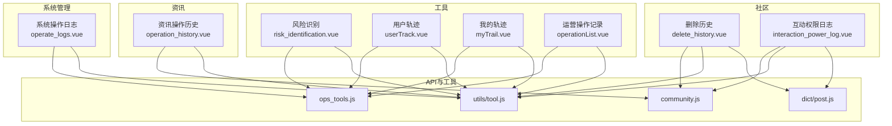
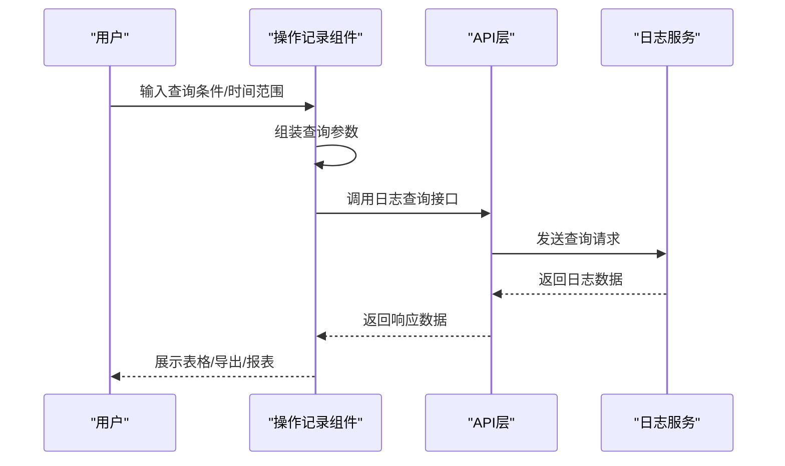
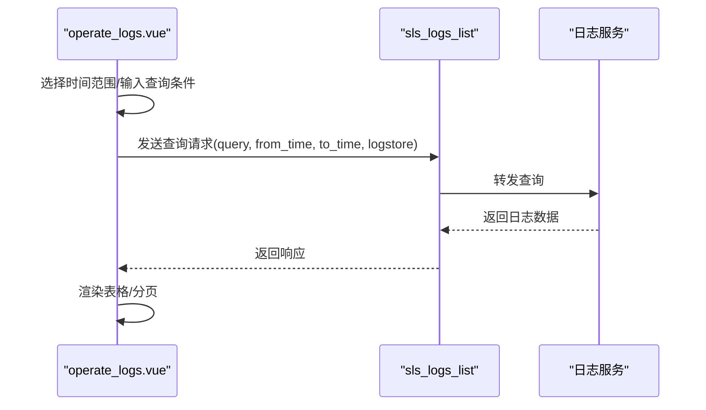
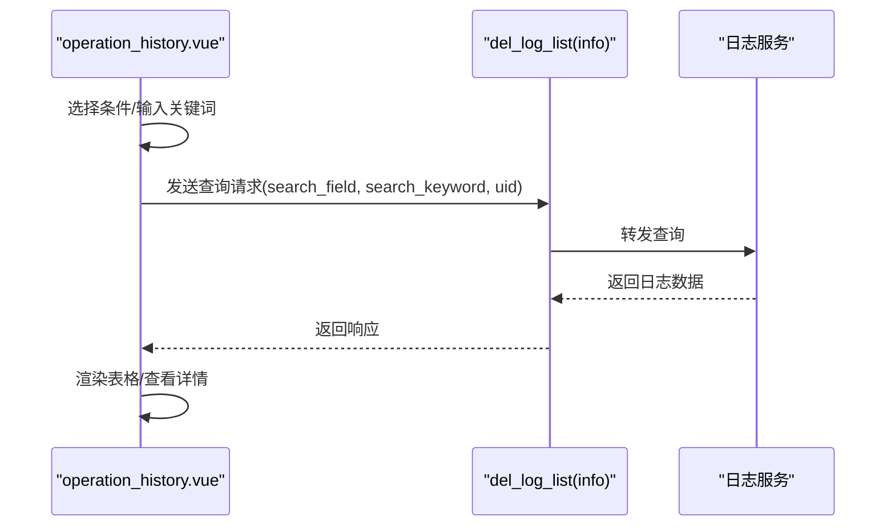
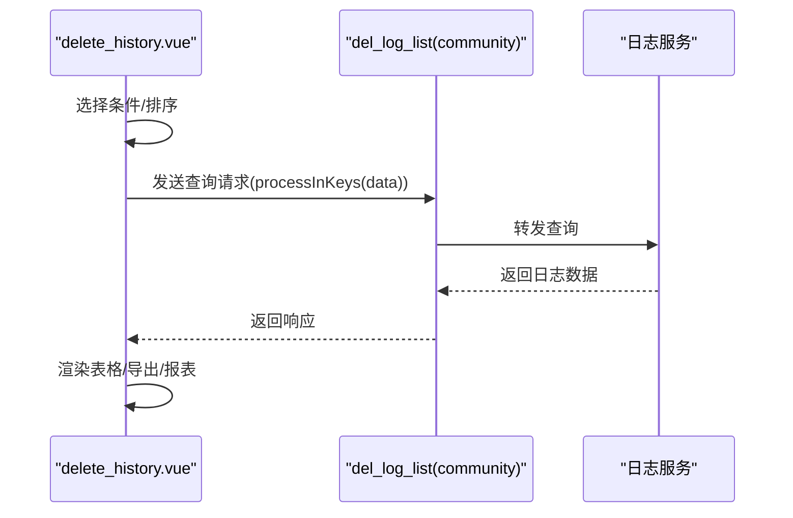
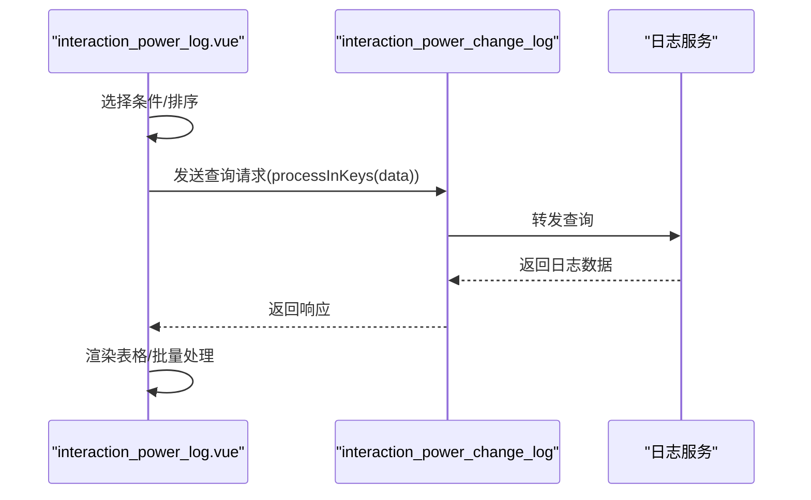
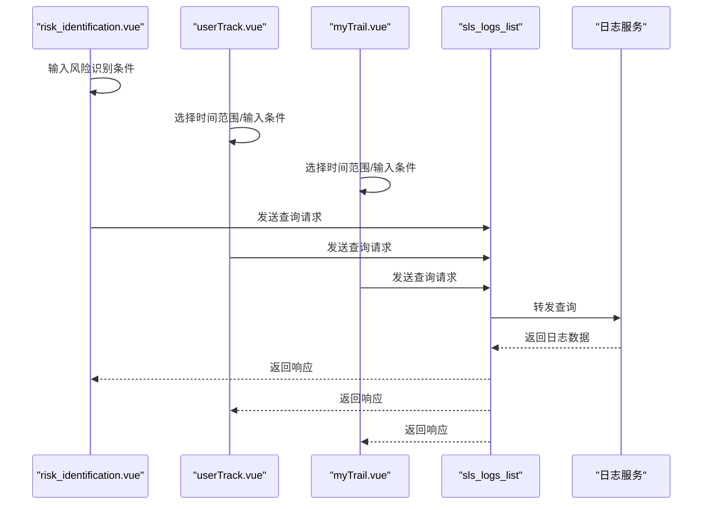
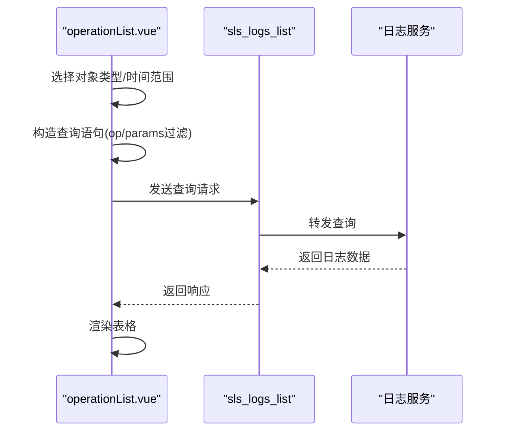
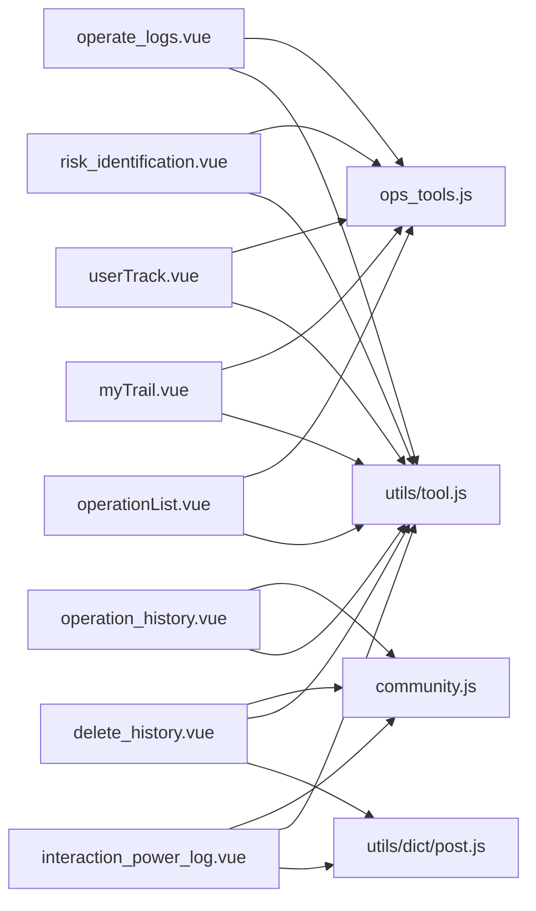

# 社区操作记录

<cite>
**本文档引用的文件**
- [src/views/system/operate_logs.vue](file://src/views/system/operate_logs.vue)
- [src/views/intelligence/operation_history.vue](file://src/views/intelligence/operation_history.vue)
- [src/views/forum/delete_history.vue](file://src/views/forum/delete_history.vue)
- [src/views/forum/interaction_power_log.vue](file://src/views/forum/interaction_power_log.vue)
- [src/api/ops_tools.js](file://src/api/ops_tools.js)
- [src/api/community.js](file://src/api/community.js)
- [src/utils/dict/post.js](file://src/utils/dict/post.js)
- [src/utils/tool.js](file://src/utils/tool.js)
- [src/views/ops_tools/risk_identification.vue](file://src/views/ops_tools/risk_identification.vue)
- [src/views/ops_tools/userTrack.vue](file://src/views/ops_tools/userTrack.vue)
- [src/components/leisu/peopleInfo/trail/components/myTrail.vue](file://src/components/leisu/peopleInfo/trail/components/myTrail.vue)
- [src/components/leisu/peopleInfo/group/components/operationList.vue](file://src/components/leisu/peopleInfo/group/components/operationList.vue)
</cite>

## 目录
1. [简介](#简介)
2. [项目结构](#项目结构)
3. [核心组件](#核心组件)
4. [架构总览](#架构总览)
5. [详细组件分析](#详细组件分析)
6. [依赖关系分析](#依赖关系分析)
7. [性能考虑](#性能考虑)
8. [故障排查指南](#故障排查指南)
9. [结论](#结论)
10. [附录](#附录)

## 简介
本技术文档围绕社区操作记录功能展开，系统性阐述日志采集与存储、字段设计、查询筛选、数据分析、审计与合规、导出与分析工具，以及安全保护策略。文档基于前端代码实现与API交互进行梳理，帮助开发者与运维人员快速理解与扩展该能力。

## 项目结构
社区操作记录相关功能主要分布在以下模块：
- 系统管理日志：系统管理员操作日志展示与检索
- 智能资讯日志：资讯相关操作记录
- 社区删除历史：帖子/评论删除、隐藏等操作记录
- 社区互动权限日志：权限申请与变更记录
- 风险识别与用户轨迹：风险识别与用户行为追踪
- 工具与API：日志查询API、通用工具方法

图表来源
- [src/views/system/operate_logs.vue:16-96](file://src/views/system/operate_logs.vue#L16-L96)
- [src/views/intelligence/operation_history.vue:18-129](file://src/views/intelligence/operation_history.vue#L18-L129)
- [src/views/forum/delete_history.vue:1-121](file://src/views/forum/delete_history.vue#L1-L121)
- [src/views/forum/interaction_power_log.vue:9-102](file://src/views/forum/interaction_power_log.vue#L9-L102)
- [src/views/ops_tools/risk_identification.vue:137-169](file://src/views/ops_tools/risk_identification.vue#L137-L169)
- [src/views/ops_tools/userTrack.vue:91-138](file://src/views/ops_tools/userTrack.vue#L91-L138)
- [src/components/leisu/peopleInfo/trail/components/myTrail.vue:90-125](file://src/components/leisu/peopleInfo/trail/components/myTrail.vue#L90-L125)
- [src/components/leisu/peopleInfo/group/components/operationList.vue:174-202](file://src/components/leisu/peopleInfo/group/components/operationList.vue#L174-L202)
- [src/api/ops_tools.js:3-9](file://src/api/ops_tools.js#L3-L9)
- [src/api/community.js:369-375](file://src/api/community.js#L369-L375)
- [src/utils/dict/post.js:192-204](file://src/utils/dict/post.js#L192-L204)
- [src/utils/tool.js:583-739](file://src/utils/tool.js#L583-L739)

章节来源
- [src/views/system/operate_logs.vue:16-96](file://src/views/system/operate_logs.vue#L16-L96)
- [src/views/intelligence/operation_history.vue:18-129](file://src/views/intelligence/operation_history.vue#L18-L129)
- [src/views/forum/delete_history.vue:1-121](file://src/views/forum/delete_history.vue#L1-L121)
- [src/views/forum/interaction_power_log.vue:9-102](file://src/views/forum/interaction_power_log.vue#L9-L102)
- [src/views/ops_tools/risk_identification.vue:137-169](file://src/views/ops_tools/risk_identification.vue#L137-L169)
- [src/views/ops_tools/userTrack.vue:91-138](file://src/views/ops_tools/userTrack.vue#L91-L138)
- [src/components/leisu/peopleInfo/trail/components/myTrail.vue:90-125](file://src/components/leisu/peopleInfo/trail/components/myTrail.vue#L90-L125)
- [src/components/leisu/peopleInfo/group/components/operationList.vue:174-202](file://src/components/leisu/peopleInfo/group/components/operationList.vue#L174-L202)
- [src/api/ops_tools.js:3-9](file://src/api/ops_tools.js#L3-L9)
- [src/api/community.js:369-375](file://src/api/community.js#L369-L375)
- [src/utils/dict/post.js:192-204](file://src/utils/dict/post.js#L192-L204)
- [src/utils/tool.js:583-739](file://src/utils/tool.js#L583-L739)

## 核心组件
- 系统操作日志组件：提供管理员操作日志的查询、筛选与分页展示，支持按操作人、IP、接口地址、操作描述、参数等维度检索。
- 资讯操作历史组件：展示资讯相关操作记录，支持按操作人、评论ID、用户ID等条件检索，提供持续时间、创建时间等字段。
- 社区删除历史组件：展示帖子/评论删除、隐藏、加精、换圈等操作记录，支持导出与报表生成。
- 社区互动权限日志组件：展示权限申请与变更记录，支持按状态、分类、额外信息等字段查看与批量处理。
- 风险识别与用户轨迹组件：提供风险识别、用户行为轨迹查询与趋势分析入口。
- API与工具：统一的日志查询API与通用时间格式化、排序、导出等工具方法。

章节来源
- [src/views/system/operate_logs.vue:104-242](file://src/views/system/operate_logs.vue#L104-L242)
- [src/views/intelligence/operation_history.vue:141-251](file://src/views/intelligence/operation_history.vue#L141-L251)
- [src/views/forum/delete_history.vue:137-252](file://src/views/forum/delete_history.vue#L137-L252)
- [src/views/forum/interaction_power_log.vue:115-293](file://src/views/forum/interaction_power_log.vue#L115-L293)
- [src/views/ops_tools/risk_identification.vue:158-169](file://src/views/ops_tools/risk_identification.vue#L158-L169)
- [src/views/ops_tools/userTrack.vue:91-138](file://src/views/ops_tools/userTrack.vue#L91-L138)
- [src/components/leisu/peopleInfo/trail/components/myTrail.vue:90-125](file://src/components/leisu/peopleInfo/trail/components/myTrail.vue#L90-L125)
- [src/api/ops_tools.js:3-9](file://src/api/ops_tools.js#L3-L9)
- [src/utils/tool.js:583-739](file://src/utils/tool.js#L583-L739)

## 架构总览
社区操作记录采用“前端组件 + API调用 + 工具方法”的分层架构：
- 前端组件负责UI渲染、查询条件构建、分页与排序
- API层封装日志查询接口，统一返回格式
- 工具层提供时间格式化、排序、导出等通用能力

图表来源
- [src/views/system/operate_logs.vue:148-186](file://src/views/system/operate_logs.vue#L148-L186)
- [src/views/intelligence/operation_history.vue:191-211](file://src/views/intelligence/operation_history.vue#L191-L211)
- [src/views/forum/delete_history.vue:217-231](file://src/views/forum/delete_history.vue#L217-L231)
- [src/api/ops_tools.js:3-9](file://src/api/ops_tools.js#L3-L9)

## 详细组件分析

### 系统操作日志组件
- 功能要点
  - 支持按操作人ID、IP、操作者、接口地址、操作描述、参数等字段检索
  - 支持时间范围选择与默认时间窗口
  - 展示操作时间、操作人、IP、操作者、接口地址、操作描述、参数等字段
  - 支持复制参数、美化JSON展示
- 查询流程
  - 组装查询语句与时间范围
  - 调用日志查询API，分页获取数据
  - 同步获取总数以支持分页控件

图表来源
- [src/views/system/operate_logs.vue:148-186](file://src/views/system/operate_logs.vue#L148-L186)
- [src/api/ops_tools.js:3-9](file://src/api/ops_tools.js#L3-L9)

章节来源
- [src/views/system/operate_logs.vue:104-242](file://src/views/system/operate_logs.vue#L104-L242)
- [src/api/ops_tools.js:3-9](file://src/api/ops_tools.js#L3-L9)

### 资讯操作历史组件
- 功能要点
  - 支持按操作人、评论ID、用户ID等条件检索
  - 展示操作人、用户、操作、资讯ID、评论ID、内容、图片、日志备注、持续时间、创建时间等字段
  - 支持查看评论详情、重置查询条件
- 查询流程
  - 组装查询参数（支持UID过滤）
  - 调用资讯日志列表API，分页获取数据

图表来源
- [src/views/intelligence/operation_history.vue:191-211](file://src/views/intelligence/operation_history.vue#L191-L211)
- [src/api/community.js:369-375](file://src/api/community.js#L369-L375)

章节来源
- [src/views/intelligence/operation_history.vue:141-251](file://src/views/intelligence/operation_history.vue#L141-L251)
- [src/api/community.js:369-375](file://src/api/community.js#L369-L375)

### 社区删除历史组件
- 功能要点
  - 展示帖子/评论删除、隐藏、加精、换圈等操作记录
  - 支持按操作人、用户、操作类型、帖子/评论ID、标题、内容、图片、日志备注、持续时间、创建时间等字段查看
  - 支持导出Excel、生成报表
- 查询流程
  - 组装查询参数（支持自定义操作人类型过滤）
  - 调用社区日志列表API，分页获取数据

图表来源
- [src/views/forum/delete_history.vue:217-231](file://src/views/forum/delete_history.vue#L217-L231)
- [src/api/community.js:369-375](file://src/api/community.js#L369-L375)
- [src/utils/dict/post.js:192-204](file://src/utils/dict/post.js#L192-L204)

章节来源
- [src/views/forum/delete_history.vue:137-252](file://src/views/forum/delete_history.vue#L137-L252)
- [src/utils/dict/post.js:192-204](file://src/utils/dict/post.js#L192-L204)
- [src/api/community.js:369-375](file://src/api/community.js#L369-L375)

### 社区互动权限日志组件
- 功能要点
  - 展示权限申请与变更记录（审核中、通过、拒绝等）
  - 支持按状态、分类、额外信息等字段查看
  - 支持批量通过/拒绝、打开授权对话框
- 查询流程
  - 组装查询参数（按分类与操作类型过滤）
  - 调用互动权限日志API，分页获取数据

图表来源
- [src/views/forum/interaction_power_log.vue:210-224](file://src/views/forum/interaction_power_log.vue#L210-L224)
- [src/api/community.js:105-106](file://src/api/community.js#L105-L106)

章节来源
- [src/views/forum/interaction_power_log.vue:115-293](file://src/views/forum/interaction_power_log.vue#L115-L293)
- [src/api/community.js:105-106](file://src/api/community.js#L105-L106)

### 风险识别与用户轨迹组件
- 功能要点
  - 风险识别：支持按uid、req_id、score、tags等条件检索
  - 用户轨迹：支持按平台、渠道、版本、模块、动作、IP、设备ID等条件检索
  - 我的轨迹：支持按时间范围与条件检索
- 查询流程
  - 组装查询参数（支持时间戳与查询语句）
  - 调用日志查询API，分页获取数据

图表来源
- [src/views/ops_tools/risk_identification.vue:158-169](file://src/views/ops_tools/risk_identification.vue#L158-L169)
- [src/views/ops_tools/userTrack.vue:137-138](file://src/views/ops_tools/userTrack.vue#L137-L138)
- [src/components/leisu/peopleInfo/trail/components/myTrail.vue:137-138](file://src/components/leisu/peopleInfo/trail/components/myTrail.vue#L137-L138)
- [src/api/ops_tools.js:3-9](file://src/api/ops_tools.js#L3-L9)

章节来源
- [src/views/ops_tools/risk_identification.vue:158-169](file://src/views/ops_tools/risk_identification.vue#L158-L169)
- [src/views/ops_tools/userTrack.vue:91-138](file://src/views/ops_tools/userTrack.vue#L91-L138)
- [src/components/leisu/peopleInfo/trail/components/myTrail.vue:90-125](file://src/components/leisu/peopleInfo/trail/components/myTrail.vue#L90-L125)
- [src/api/ops_tools.js:3-9](file://src/api/ops_tools.js#L3-L9)

### 运营操作记录（按对象类型）
- 功能要点
  - 支持按资讯、帖子、用户等对象类型检索
  - 支持按时间范围、操作类型、操作人、操作对象等多维条件检索
- 查询流程
  - 组装查询语句（根据对象类型构造不同查询条件）
  - 调用日志查询API，分页获取数据

图表来源
- [src/components/leisu/peopleInfo/group/components/operationList.vue:190-202](file://src/components/leisu/peopleInfo/group/components/operationList.vue#L190-L202)
- [src/api/ops_tools.js:3-9](file://src/api/ops_tools.js#L3-L9)

章节来源
- [src/components/leisu/peopleInfo/group/components/operationList.vue:174-202](file://src/components/leisu/peopleInfo/group/components/operationList.vue#L174-L202)
- [src/api/ops_tools.js:3-9](file://src/api/ops_tools.js#L3-L9)

## 依赖关系分析
- 组件与API
  - operate_logs.vue 依赖 ops_tools.js 的 sls_logs_list
  - operation_history.vue 依赖 community.js 的 del_log_list
  - delete_history.vue 依赖 community.js 的 del_log_list
  - interaction_power_log.vue 依赖 community.js 的 interaction_power_change_log
  - risk_identification.vue、userTrack.vue、myTrail.vue 依赖 ops_tools.js 的 sls_logs_list
- 组件与工具
  - 通用时间格式化、排序、导出等能力来自 utils/tool.js
- 字典与枚举
  - 社区操作类型、权限分类等来自 utils/dict/post.js

图表来源
- [src/views/system/operate_logs.vue:98-102](file://src/views/system/operate_logs.vue#L98-L102)
- [src/views/intelligence/operation_history.vue:132-139](file://src/views/intelligence/operation_history.vue#L132-L139)
- [src/views/forum/delete_history.vue:124-133](file://src/views/forum/delete_history.vue#L124-L133)
- [src/views/forum/interaction_power_log.vue:105-114](file://src/views/forum/interaction_power_log.vue#L105-L114)
- [src/views/ops_tools/risk_identification.vue:153-157](file://src/views/ops_tools/risk_identification.vue#L153-L157)
- [src/views/ops_tools/userTrack.vue:91-94](file://src/views/ops_tools/userTrack.vue#L91-L94)
- [src/components/leisu/peopleInfo/trail/components/myTrail.vue:90-94](file://src/components/leisu/peopleInfo/trail/components/myTrail.vue#L90-L94)
- [src/components/leisu/peopleInfo/group/components/operationList.vue:190-202](file://src/components/leisu/peopleInfo/group/components/operationList.vue#L190-L202)
- [src/api/ops_tools.js:3-9](file://src/api/ops_tools.js#L3-L9)
- [src/api/community.js:369-375](file://src/api/community.js#L369-L375)
- [src/utils/dict/post.js:192-204](file://src/utils/dict/post.js#L192-L204)
- [src/utils/tool.js:583-739](file://src/utils/tool.js#L583-L739)

章节来源
- [src/views/system/operate_logs.vue:98-102](file://src/views/system/operate_logs.vue#L98-L102)
- [src/views/intelligence/operation_history.vue:132-139](file://src/views/intelligence/operation_history.vue#L132-L139)
- [src/views/forum/delete_history.vue:124-133](file://src/views/forum/delete_history.vue#L124-L133)
- [src/views/forum/interaction_power_log.vue:105-114](file://src/views/forum/interaction_power_log.vue#L105-L114)
- [src/views/ops_tools/risk_identification.vue:153-157](file://src/views/ops_tools/risk_identification.vue#L153-L157)
- [src/views/ops_tools/userTrack.vue:91-94](file://src/views/ops_tools/userTrack.vue#L91-L94)
- [src/components/leisu/peopleInfo/trail/components/myTrail.vue:90-94](file://src/components/leisu/peopleInfo/trail/components/myTrail.vue#L90-L94)
- [src/components/leisu/peopleInfo/group/components/operationList.vue:190-202](file://src/components/leisu/peopleInfo/group/components/operationList.vue#L190-L202)
- [src/api/ops_tools.js:3-9](file://src/api/ops_tools.js#L3-L9)
- [src/api/community.js:369-375](file://src/api/community.js#L369-L375)
- [src/utils/dict/post.js:192-204](file://src/utils/dict/post.js#L192-L204)
- [src/utils/tool.js:583-739](file://src/utils/tool.js#L583-L739)

## 性能考虑
- 分页与总量查询：组件在获取数据时同步发起总量查询，避免一次性加载大量数据
- 查询条件优化：通过字段精确匹配与时间范围限制减少查询负载
- 数据格式化：使用工具方法进行时间格式化与JSON美化，避免重复计算
- 导出与报表：提供导出Excel与报表生成能力，便于离线分析与报告输出

## 故障排查指南
- 查询无结果
  - 检查时间范围是否正确
  - 确认查询字段与关键字是否匹配
  - 核对权限是否具备相应日志查看能力
- 数据异常
  - 检查API返回状态与错误信息
  - 确认日志服务可用性与索引状态
- 性能问题
  - 适当缩小时间范围与查询条件
  - 避免一次性请求过大页码或过多数据

章节来源
- [src/views/system/operate_logs.vue:160-182](file://src/views/system/operate_logs.vue#L160-L182)
- [src/views/intelligence/operation_history.vue:196-210](file://src/views/intelligence/operation_history.vue#L196-L210)
- [src/views/forum/delete_history.vue:217-231](file://src/views/forum/delete_history.vue#L217-L231)
- [src/views/forum/interaction_power_log.vue:210-224](file://src/views/forum/interaction_power_log.vue#L210-L224)

## 结论
社区操作记录功能通过统一的API与工具方法，实现了系统管理、资讯、社区、风险识别与用户轨迹等多维度的操作日志采集与展示。组件化设计提升了可维护性与扩展性，配合查询筛选、导出与报表能力，满足日常审计与分析需求。建议在生产环境中进一步完善日志存储与查询性能优化，并加强访问控制与数据脱敏以保障安全。

## 附录
- 字段设计建议
  - 操作类型：来源于字典定义，支持扩展
  - 操作时间：统一使用时间戳并格式化展示
  - 操作人信息：包含ID、名称、IP等
  - 操作对象：帖子/评论/资讯/用户等
  - 参数与备注：JSON结构化存储，支持美化展示
- 查询与筛选
  - 支持多字段组合查询与排序
  - 支持时间范围、操作类型、操作人员、操作对象等多维检索
- 数据分析与审计
  - 高频操作统计、趋势分析、异常检测可通过报表与导出实现
  - 审计追溯：通过操作时间、操作人、参数与备注实现责任认定与合规检查
- 安全保护
  - 访问控制：基于权限路由与按钮级权限
  - 数据脱敏：对敏感字段进行脱敏处理
  - 日志完整性：通过统一API与服务端校验保证数据一致性

章节来源
- [src/utils/dict/post.js:192-204](file://src/utils/dict/post.js#L192-L204)
- [src/utils/tool.js:583-739](file://src/utils/tool.js#L583-L739)
- [src/views/ops_tools/risk_identification.vue:158-169](file://src/views/ops_tools/risk_identification.vue#L158-L169)
- [src/views/ops_tools/userTrack.vue:91-138](file://src/views/ops_tools/userTrack.vue#L91-L138)
- [src/components/leisu/peopleInfo/trail/components/myTrail.vue:90-125](file://src/components/leisu/peopleInfo/trail/components/myTrail.vue#L90-L125)
- [src/components/leisu/peopleInfo/group/components/operationList.vue:174-202](file://src/components/leisu/peopleInfo/group/components/operationList.vue#L174-L202)