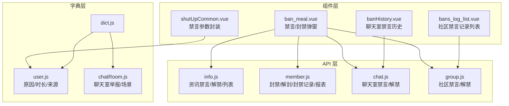
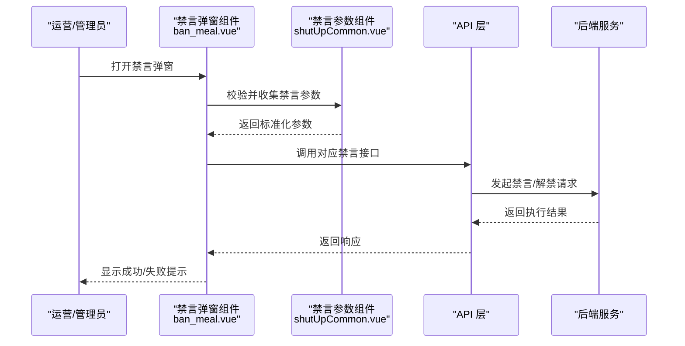
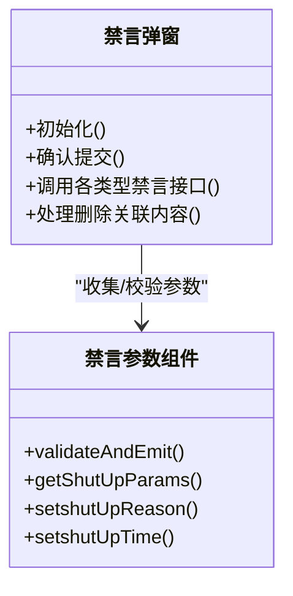
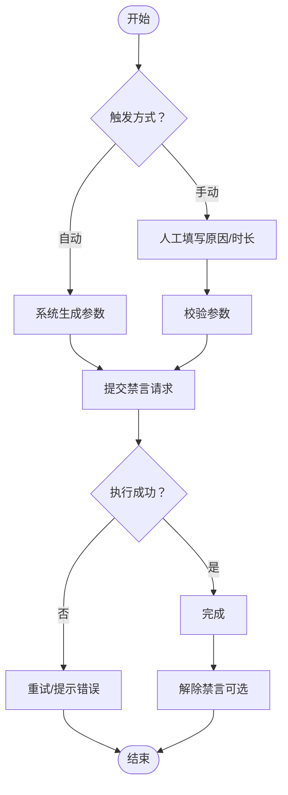
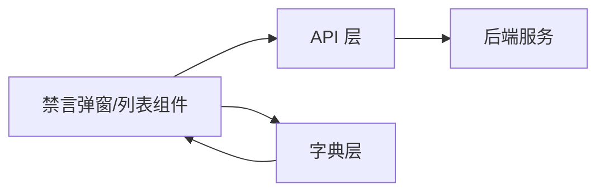

# 禁言记录

<cite>
**本文引用的文件**
- [src/api/info.js](file://src/api/info.js)
- [src/api/member.js](file://src/api/member.js)
- [src/api/chat.js](file://src/api/chat.js)
- [src/api/group.js](file://src/api/group.js)
- [src/components/leisu/ban_meal.vue](file://src/components/leisu/ban_meal.vue)
- [src/components/leisu/peopleInfo/member/component/banShutUpMeal/shutUpCommon.vue](file://src/components/leisu/peopleInfo/member/component/banShutUpMeal/shutUpCommon.vue)
- [src/components/leisu/peopleInfo/group/components/bans_log_list.vue](file://src/components/leisu/peopleInfo/group/components/bans_log_list.vue)
- [src/views/chat_room/banHistory.vue](file://src/views/chat_room/banHistory.vue)
- [src/utils/dict.js](file://src/utils/dict.js)
- [src/utils/dict/user.js](file://src/utils/dict/user.js)
- [src/utils/dict/chatRoom.js](file://src/utils/dict/chatRoom.js)
</cite>

## 目录
1. [简介](#简介)
2. [项目结构](#项目结构)
3. [核心组件](#核心组件)
4. [架构总览](#架构总览)
5. [详细组件分析](#详细组件分析)
6. [依赖关系分析](#依赖关系分析)
7. [性能考量](#性能考量)
8. [故障排查指南](#故障排查指南)
9. [结论](#结论)
10. [附录](#附录)

## 简介
本技术文档围绕禁言记录功能展开，系统化阐述禁言触发条件、禁言时长计算、禁言类型分类、查询与筛选、统计分析、流程控制、审计与合规等方面。文档以代码为依据，结合前端组件与后端 API 的协作关系，帮助开发者与运营人员理解禁言数据的采集、存储、展示与治理全链路。

## 项目结构
禁言记录相关能力主要分布在以下模块：
- API 层：提供资讯禁言、聊天室禁言、社区禁言、封禁记录查询与统计等接口
- 组件层：提供禁言弹窗、禁言参数选择、禁言记录列表等可视化组件
- 字典层：提供禁言原因、时长、来源等枚举与快捷配置
- 页面层：提供聊天室禁言历史、社区禁言记录等页面

图表来源
- [src/api/info.js](file://src/api/info.js)
- [src/api/member.js](file://src/api/member.js)
- [src/api/chat.js](file://src/api/chat.js)
- [src/api/group.js](file://src/api/group.js)
- [src/components/leisu/ban_meal.vue](file://src/components/leisu/ban_meal.vue)
- [src/components/leisu/peopleInfo/member/component/banShutUpMeal/shutUpCommon.vue](file://src/components/leisu/peopleInfo/member/component/banShutUpMeal/shutUpCommon.vue)
- [src/components/leisu/peopleInfo/group/components/bans_log_list.vue](file://src/components/leisu/peopleInfo/group/components/bans_log_list.vue)
- [src/views/chat_room/banHistory.vue](file://src/views/chat_room/banHistory.vue)
- [src/utils/dict.js](file://src/utils/dict.js)
- [src/utils/dict/user.js](file://src/utils/dict/user.js)
- [src/utils/dict/chatRoom.js](file://src/utils/dict/chatRoom.js)

章节来源
- [src/api/info.js](file://src/api/info.js)
- [src/api/member.js](file://src/api/member.js)
- [src/api/chat.js](file://src/api/chat.js)
- [src/api/group.js](file://src/api/group.js)
- [src/components/leisu/ban_meal.vue](file://src/components/leisu/ban_meal.vue)
- [src/components/leisu/peopleInfo/member/component/banShutUpMeal/shutUpCommon.vue](file://src/components/leisu/peopleInfo/member/component/banShutUpMeal/shutUpCommon.vue)
- [src/components/leisu/peopleInfo/group/components/bans_log_list.vue](file://src/components/leisu/peopleInfo/group/components/bans_log_list.vue)
- [src/views/chat_room/banHistory.vue](file://src/views/chat_room/banHistory.vue)
- [src/utils/dict.js](file://src/utils/dict.js)
- [src/utils/dict/user.js](file://src/utils/dict/user.js)
- [src/utils/dict/chatRoom.js](file://src/utils/dict/chatRoom.js)

## 核心组件
- 禁言弹窗与参数封装
  - 禁言弹窗容器负责聚合“封禁/永久封禁/社区禁言/聊天室禁言/资讯禁言”等标签页，并统一提交校验与调用对应接口
  - 禁言参数封装组件负责禁言原因、禁言时长、目标对象等参数的收集与封装，输出标准化请求体
- 记录列表组件
  - 社区禁言记录列表：支持按 UID、排序、分页查询
  - 聊天室禁言历史：支持按用户、操作人、时间、排序等条件查询
- 字典与原因
  - 提供禁言原因快捷标签、常用禁言时长、封禁来源等配置，便于快速选择与复用

章节来源
- [src/components/leisu/ban_meal.vue](file://src/components/leisu/ban_meal.vue)
- [src/components/leisu/peopleInfo/member/component/banShutUpMeal/shutUpCommon.vue](file://src/components/leisu/peopleInfo/member/component/banShutUpMeal/shutUpCommon.vue)
- [src/components/leisu/peopleInfo/group/components/bans_log_list.vue](file://src/components/leisu/peopleInfo/group/components/bans_log_list.vue)
- [src/views/chat_room/banHistory.vue](file://src/views/chat_room/banHistory.vue)
- [src/utils/dict/user.js](file://src/utils/dict/user.js)

## 架构总览
禁言记录的前后端协作遵循“组件发起请求 -> API 封装 -> 后端执行 -> 返回结果 -> 组件渲染”的闭环。

图表来源
- [src/components/leisu/ban_meal.vue](file://src/components/leisu/ban_meal.vue)
- [src/components/leisu/peopleInfo/member/component/banShutUpMeal/shutUpCommon.vue](file://src/components/leisu/peopleInfo/member/component/banShutUpMeal/shutUpCommon.vue)
- [src/api/info.js](file://src/api/info.js)
- [src/api/chat.js](file://src/api/chat.js)
- [src/api/group.js](file://src/api/group.js)

## 详细组件分析

### 禁言弹窗与参数封装
- 功能职责
  - 聚合多种禁言类型（社区/聊天室/资讯）与封禁类型（普通/永久），统一校验与提交
  - 将禁言原因、时长、目标用户等参数标准化，调用对应后端接口
- 参数封装要点
  - 时间统一转换为秒级时间戳
  - 根据禁言类型映射不同字段（社区/聊天室/资讯）
  - 支持快捷时长选择与自定义时间
- 错误处理
  - 校验必填项（原因、截止时间）
  - 捕获接口异常并提示

图表来源
- [src/components/leisu/ban_meal.vue](file://src/components/leisu/ban_meal.vue)
- [src/components/leisu/peopleInfo/member/component/banShutUpMeal/shutUpCommon.vue](file://src/components/leisu/peopleInfo/member/component/banShutUpMeal/shutUpCommon.vue)

章节来源
- [src/components/leisu/ban_meal.vue](file://src/components/leisu/ban_meal.vue)
- [src/components/leisu/peopleInfo/member/component/banShutUpMeal/shutUpCommon.vue](file://src/components/leisu/peopleInfo/member/component/banShutUpMeal/shutUpCommon.vue)

### 禁言触发条件与类型
- 触发条件
  - 违规内容检测（社区/资讯/聊天室）
  - 举报/投诉核实
  - 风险策略触发
- 类型与字段映射
  - 社区禁言：社区相关字段
  - 聊天室禁言：聊天室相关字段
  - 资讯禁言：资讯相关字段
- 禁言来源
  - 系统自动触发
  - 协管员/管理员手动触发
  - 其他来源（如外部审计）

章节来源
- [src/utils/dict/user.js](file://src/utils/dict/user.js)
- [src/api/group.js](file://src/api/group.js)
- [src/api/chat.js](file://src/api/chat.js)
- [src/api/info.js](file://src/api/info.js)

### 禁言时长计算
- 快捷时长：提供固定时长选项（如 3 小时、6 小时、12 小时、1 天、3 天、7 天、15 天、30 天）
- 自定义时长：基于当前时间加小时数，统一转换为秒级时间戳
- 结束时间：以“截止时间”形式存储，便于前端展示与对比

章节来源
- [src/components/leisu/peopleInfo/member/component/banShutUpMeal/shutUpCommon.vue](file://src/components/leisu/peopleInfo/member/component/banShutUpMeal/shutUpCommon.vue)
- [src/utils/dict/user.js](file://src/utils/dict/user.js)

### 查询与筛选
- 社区禁言记录
  - 支持按 UID、排序、分页查询
  - 列表加载与排序变更联动
- 聊天室禁言历史
  - 支持按用户、操作人、时间、排序等条件查询
  - 支持抽屉内嵌查询

章节来源
- [src/components/leisu/peopleInfo/group/components/bans_log_list.vue](file://src/components/leisu/peopleInfo/group/components/bans_log_list.vue)
- [src/views/chat_room/banHistory.vue](file://src/views/chat_room/banHistory.vue)

### 统计分析
- 封禁记录报表
  - 提供封禁记录报表接口，用于统计封禁趋势、封禁来源分布等
- 禁言趋势
  - 可结合时间维度进行趋势分析（按日/周/月）
- 违规类型分布
  - 结合禁言原因字典，统计违规类型占比
- 用户行为模式
  - 结合用户画像与封禁记录，识别高风险用户与高发时段

章节来源
- [src/api/member.js](file://src/api/member.js)
- [src/utils/dict/user.js](file://src/utils/dict/user.js)

### 流程控制
- 自动禁言
  - 通过风控策略或内容审核模型触发，参数由系统生成
- 手动禁言
  - 运营人员在弹窗中选择原因与时长，提交后执行
- 解除禁言
  - 提供统一的解除接口，支持单个或批量解除
- 关联处理
  - 可选删除违规内容或评论，避免重复违规

图表来源
- [src/components/leisu/ban_meal.vue](file://src/components/leisu/ban_meal.vue)
- [src/api/group.js](file://src/api/group.js)
- [src/api/chat.js](file://src/api/chat.js)
- [src/api/info.js](file://src/api/info.js)

### 审计与合规
- 操作日志
  - 记录操作人、操作时间、禁言类型、原因、时长、目标用户等关键信息
- 审批记录
  - 对高风险禁言（如永久封禁）建立审批流程
- 变更追踪
  - 记录每次禁言/解禁的完整生命周期
- 合规设计
  - 明确禁言阈值与例外规则，保障用户合法权益
  - 提供申诉入口与流程，确保可追溯与可复核

章节来源
- [src/views/chat_room/banHistory.vue](file://src/views/chat_room/banHistory.vue)
- [src/components/leisu/ban_meal.vue](file://src/components/leisu/ban_meal.vue)
- [src/utils/dict/user.js](file://src/utils/dict/user.js)

## 依赖关系分析
- 组件与 API
  - 禁言弹窗依赖资讯/聊天室/社区禁言接口与封禁记录接口
  - 记录列表依赖对应模块的查询接口
- 组件与字典
  - 禁言参数组件依赖原因与时长字典，提升用户体验与一致性
- 数据流向
  - 前端组件收集参数 -> API 层封装 -> 后端执行 -> 返回结果 -> 前端渲染

图表来源
- [src/components/leisu/ban_meal.vue](file://src/components/leisu/ban_meal.vue)
- [src/components/leisu/peopleInfo/group/components/bans_log_list.vue](file://src/components/leisu/peopleInfo/group/components/bans_log_list.vue)
- [src/views/chat_room/banHistory.vue](file://src/views/chat_room/banHistory.vue)
- [src/api/info.js](file://src/api/info.js)
- [src/api/chat.js](file://src/api/chat.js)
- [src/api/group.js](file://src/api/group.js)
- [src/utils/dict.js](file://src/utils/dict.js)

章节来源
- [src/components/leisu/ban_meal.vue](file://src/components/leisu/ban_meal.vue)
- [src/components/leisu/peopleInfo/group/components/bans_log_list.vue](file://src/components/leisu/peopleInfo/group/components/bans_log_list.vue)
- [src/views/chat_room/banHistory.vue](file://src/views/chat_room/banHistory.vue)
- [src/api/info.js](file://src/api/info.js)
- [src/api/chat.js](file://src/api/chat.js)
- [src/api/group.js](file://src/api/group.js)
- [src/utils/dict.js](file://src/utils/dict.js)

## 性能考量
- 分页与排序
  - 列表查询默认分页，支持排序变更，避免一次性加载大量数据
- 参数封装
  - 统一时间格式与字段映射，减少前端重复处理
- 批量操作
  - 支持批量禁言/解禁，降低重复请求次数
- 渲染优化
  - 使用虚拟滚动与懒加载，提升大数据量表格的渲染性能

## 故障排查指南
- 常见问题
  - 禁言原因为空：检查禁言参数组件的必填校验
  - 截止时间未选择：确认时间选择器是否正确赋值
  - 接口返回失败：查看弹窗中的错误提示，确认后端返回码与消息
- 日志与定位
  - 查看聊天室禁言历史与社区禁言记录，核对操作人、时间、原因
  - 结合封禁记录报表，定位异常趋势与高发时段

章节来源
- [src/components/leisu/ban_meal.vue](file://src/components/leisu/ban_meal.vue)
- [src/views/chat_room/banHistory.vue](file://src/views/chat_room/banHistory.vue)
- [src/components/leisu/peopleInfo/group/components/bans_log_list.vue](file://src/components/leisu/peopleInfo/group/components/bans_log_list.vue)

## 结论
禁言记录功能通过“弹窗参数封装 + 多类型禁言接口 + 记录查询与统计”的架构设计，实现了从触发、执行到审计的全流程闭环。配合字典化的禁言原因与时长，提升了运营效率与一致性；通过报表与趋势分析，辅助策略迭代与风险控制。建议在后续版本中进一步完善审批流程与合规校验，确保平台规则与法律法规的严格执行。

## 附录
- 关键接口一览
  - 资讯禁言/解禁/列表：见资讯模块 API
  - 聊天室禁言/解禁：见聊天室模块 API
  - 社区禁言/解禁：见社区模块 API
  - 封禁记录/报表：见成员模块 API
- 字典参考
  - 禁言原因、时长、来源：见用户字典
  - 聊天室举报/场景：见聊天室字典

章节来源
- [src/api/info.js](file://src/api/info.js)
- [src/api/chat.js](file://src/api/chat.js)
- [src/api/group.js](file://src/api/group.js)
- [src/api/member.js](file://src/api/member.js)
- [src/utils/dict/user.js](file://src/utils/dict/user.js)
- [src/utils/dict/chatRoom.js](file://src/utils/dict/chatRoom.js)