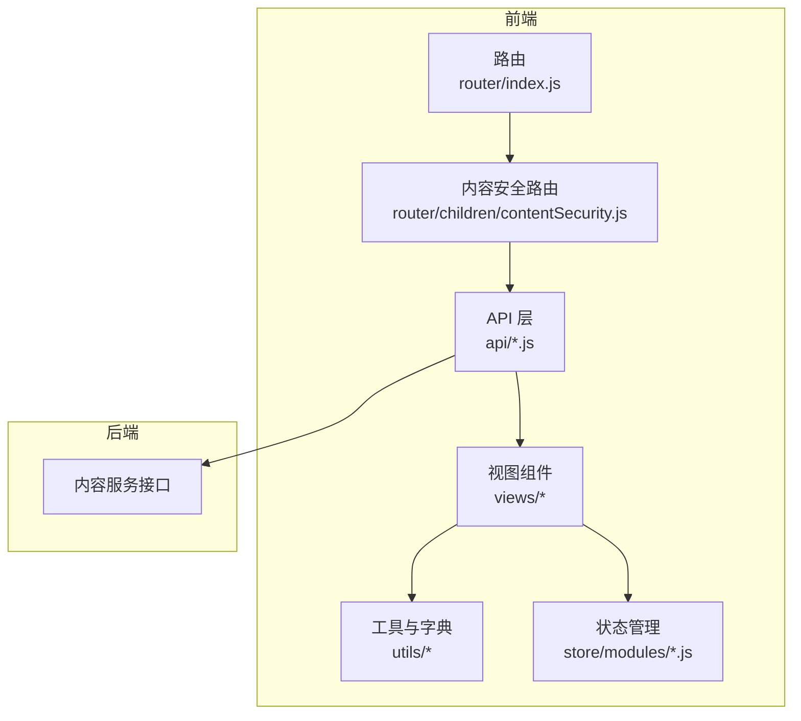
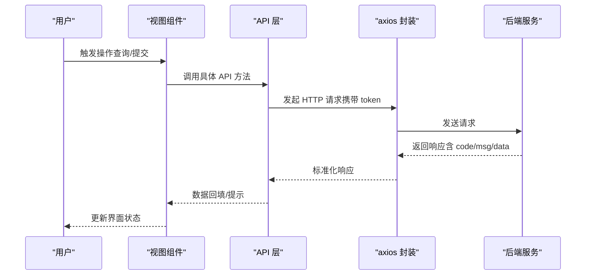
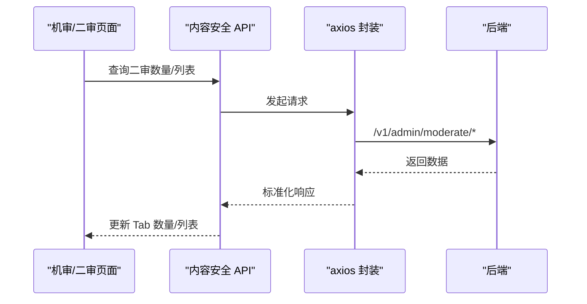
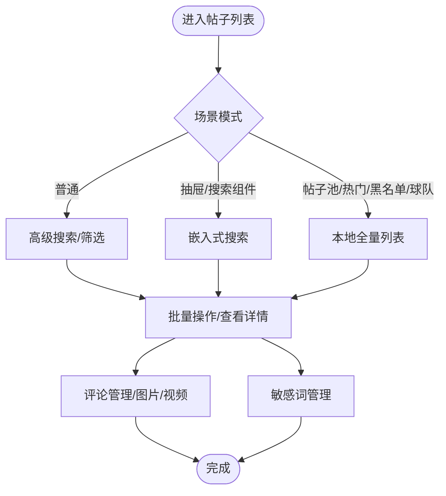
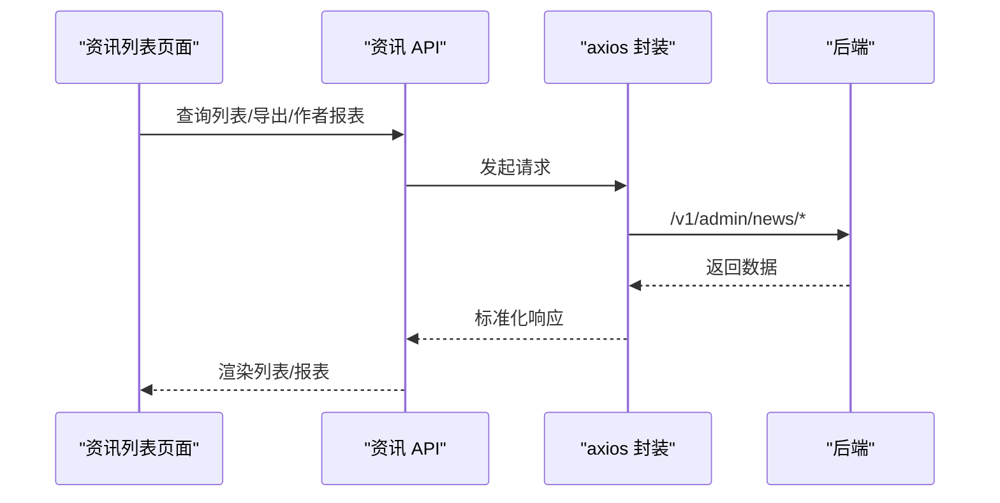
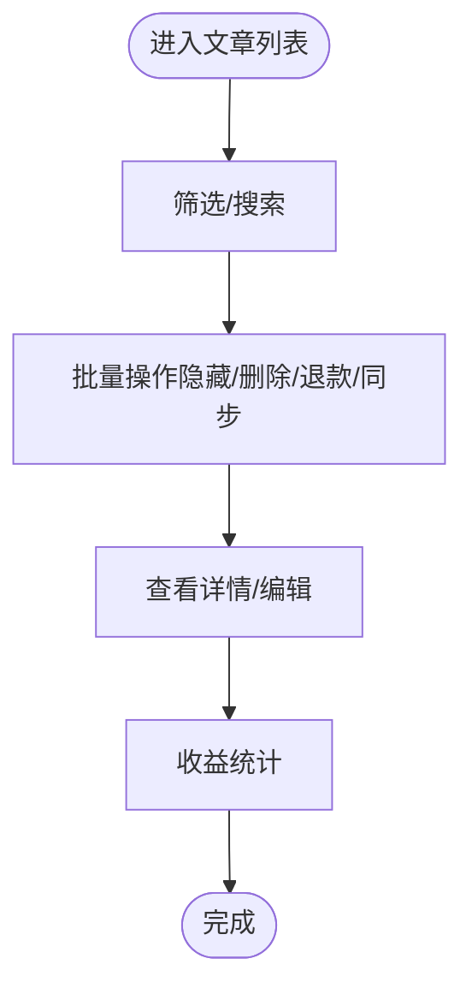
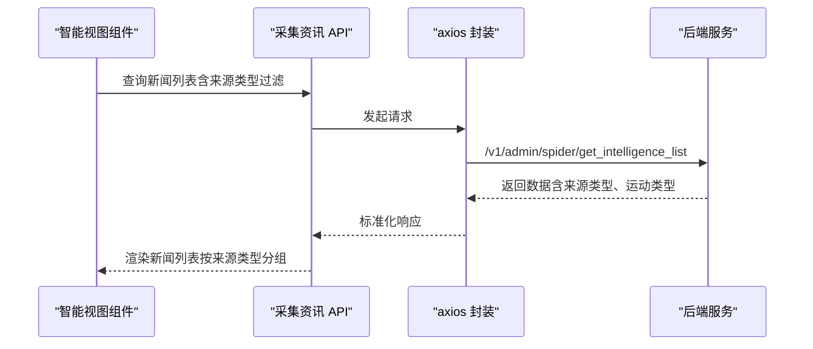
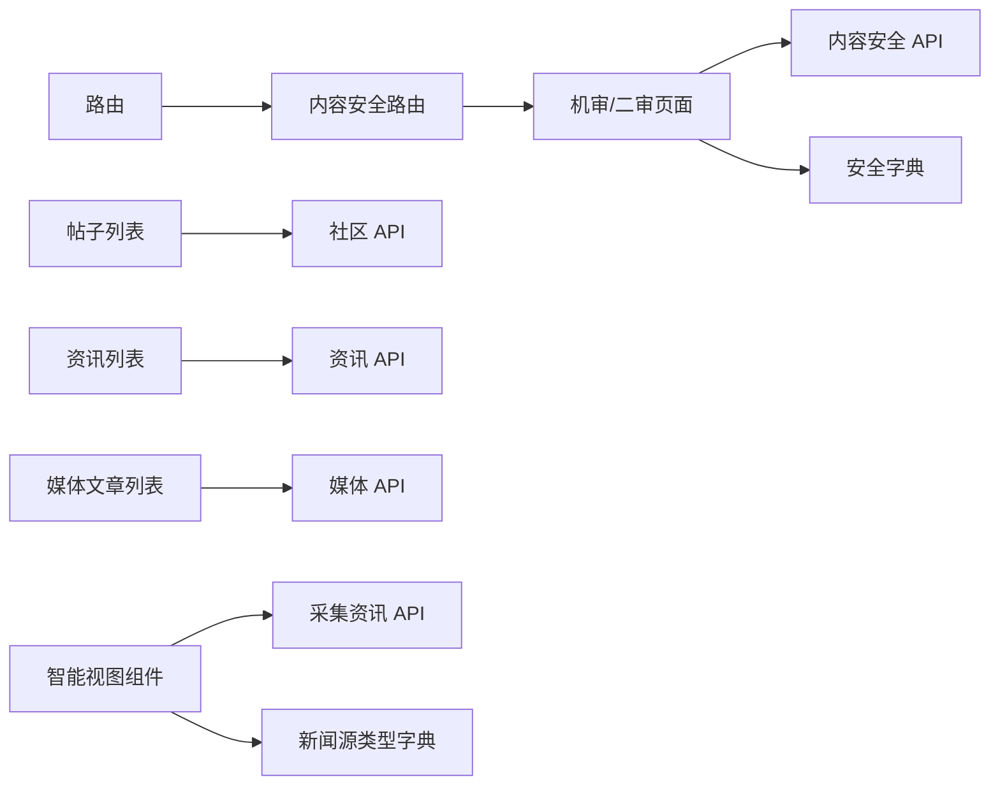

# 内容管理模块

<cite>
**本文引用的文件**   
- [src/router/index.js](file://src/router/index.js)
- [src/router/children/contentSecurity.js](file://src/router/children/contentSecurity.js)
- [src/api/contentSecurity.js](file://src/api/contentSecurity.js)
- [src/views/contentSecurity/machineAudit.vue](file://src/views/contentSecurity/machineAudit.vue)
- [src/views/contentSecurity/moderate_sensitive_word_list.vue](file://src/views/contentSecurity/moderate_sensitive_word_list.vue)
- [src/utils/dict/security.js](file://src/utils/dict/security.js)
- [src/api/community.js](file://src/api/community.js)
- [src/views/forum/postList.vue](file://src/views/forum/postList.vue)
- [src/views/forum/sensitive_word_list.vue](file://src/views/forum/sensitive_word_list.vue)
- [src/api/info.js](file://src/api/info.js)
- [src/views/intelligence/intelligence.vue](file://src/views/intelligence/intelligence.vue)
- [src/api/media.js](file://src/api/media.js)
- [src/views/media/MediaArticleList.vue](file://src/views/media/MediaArticleList.vue)
- [src/utils/dict/post.js](file://src/utils/dict/post.js)
- [src/utils/request.js](file://src/utils/request.js)
- [src/store/modules/news.js](file://src/store/modules/news.js)
- [src/utils/dict/news.js](file://src/utils/dict/news.js)
- [src/components/newMySearch/components/searchKey/compKey/news.js](file://src/components/newMySearch/components/searchKey/compKey/news.js)
- [src/views/intelligence/globo.vue](file://src/views/intelligence/globo.vue)
- [src/views/intelligence/newsGlobo.vue](file://src/views/intelligence/newsGlobo.vue)
- [src/utils/dict/common.json](file://src/utils/dict/common.json)
- [src/api/spider.js](file://src/api/spider.js)
- [mock/article.js](file://mock/article.js)
</cite>

## 更新摘要
**变更内容**   
- 新增新闻过滤系统的增强功能，包括语法错误修复、新闻源类型过滤选项扩展
- 新增自动足球源类型支持，完善智能视图组件中的体育特定源过滤条件逻辑
- 扩展新闻源类型字典，支持更精细的内容分类和过滤

## 目录
1. [简介](#简介)
2. [项目结构](#项目结构)
3. [核心组件](#核心组件)
4. [架构总览](#架构总览)
5. [详细组件分析](#详细组件分析)
6. [依赖关系分析](#依赖关系分析)
7. [性能考虑](#性能考虑)
8. [故障排查指南](#故障排查指南)
9. [结论](#结论)
10. [附录](#附录)

## 简介
本技术文档围绕内容管理模块展开，覆盖社区内容管理、资讯内容管理、内容安全审核、敏感词管理等核心能力。文档从系统架构、业务流程、数据模型、安全管控、API 设计、前端组件到最佳实践进行全面阐述，帮助开发者快速理解并扩展功能。

**更新** 本次更新重点增强了新闻过滤系统的功能，包括修复语法错误、扩展新闻源类型过滤选项、新增自动足球源类型支持等。

## 项目结构
内容管理模块由"路由 + API 层 + 视图组件 + 工具与字典"构成，采用前后端分离设计，统一通过 axios 封装的请求模块对接后端服务。

**图表来源**
- [src/router/index.js:1-177](file://src/router/index.js#L1-L177)
- [src/router/children/contentSecurity.js:1-43](file://src/router/children/contentSecurity.js#L1-L43)
- [src/api/contentSecurity.js:1-115](file://src/api/contentSecurity.js#L1-L115)
- [src/views/contentSecurity/machineAudit.vue:1-164](file://src/views/contentSecurity/machineAudit.vue#L1-L164)
- [src/utils/request.js:1-130](file://src/utils/request.js#L1-L130)
- [src/store/modules/news.js:1-112](file://src/store/modules/news.js#L1-L112)

**章节来源**
- [src/router/index.js:1-177](file://src/router/index.js#L1-L177)
- [src/router/children/contentSecurity.js:1-43](file://src/router/children/contentSecurity.js#L1-L43)
- [src/utils/request.js:1-130](file://src/utils/request.js#L1-L130)

## 核心组件
- 内容安全审核
  - 机审队列与二审队列：通过内容安全路由与 API 实现审核任务的展示与处理。
  - 敏感词管理：统一入口管理不同业务域的敏感词。
- 社区内容管理
  - 帖子列表：支持筛选、排序、批量操作、评论管理、图片/视频展示等。
  - 敏感词管理：社区域敏感词的增删查。
- 资讯内容管理
  - 资讯列表：支持导出、作者报表、评论管理、置顶、推送等。
  - 敏感词管理：资讯域敏感词的增删查。
- 媒体内容管理
  - 雷速号文章列表：支持隐藏/删除、退款、同步阿里、批量操作等。
  - 敏感词管理：媒体域敏感词的增删查。
- **新闻过滤系统**（新增）
  - 智能视图组件：支持来源类型过滤、运动类型筛选、自动足球源类型支持。
  - 新闻源类型字典：扩展资讯分类和标签体系。
  - 采集资讯管理：支持中台资讯和自动采集资讯的统一管理。

**章节来源**
- [src/router/children/contentSecurity.js:1-43](file://src/router/children/contentSecurity.js#L1-L43)
- [src/api/contentSecurity.js:1-115](file://src/api/contentSecurity.js#L1-L115)
- [src/views/contentSecurity/machineAudit.vue:1-164](file://src/views/contentSecurity/machineAudit.vue#L1-L164)
- [src/views/forum/postList.vue:1-800](file://src/views/forum/postList.vue#L1-L800)
- [src/views/forum/sensitive_word_list.vue:1-243](file://src/views/forum/sensitive_word_list.vue#L1-L243)
- [src/views/intelligence/intelligence.vue:1-800](file://src/views/intelligence/intelligence.vue#L1-L800)
- [src/views/media/MediaArticleList.vue:1-800](file://src/views/media/MediaArticleList.vue#L1-L800)
- [src/store/modules/news.js:1-112](file://src/store/modules/news.js#L1-L112)
- [src/utils/dict/news.js:1-99](file://src/utils/dict/news.js#L1-L99)
- [src/components/newMySearch/components/searchKey/compKey/news.js:373-378](file://src/components/newMySearch/components/searchKey/compKey/news.js#L373-L378)
- [src/views/intelligence/globo.vue:197-215](file://src/views/intelligence/globo.vue#L197-L215)

## 架构总览
内容管理模块遵循"路由驱动 + API 调用 + 视图渲染"的三层结构。请求通过统一的 axios 封装，自动注入 token 并处理错误与登录态失效。

**图表来源**
- [src/utils/request.js:1-130](file://src/utils/request.js#L1-L130)
- [src/api/contentSecurity.js:1-115](file://src/api/contentSecurity.js#L1-L115)
- [src/api/community.js:1-676](file://src/api/community.js#L1-L676)
- [src/api/info.js:1-760](file://src/api/info.js#L1-L760)
- [src/api/media.js:1-200](file://src/api/media.js#L1-L200)

## 详细组件分析

### 内容安全审核
- 机审与二审队列
  - 机审队列：按审核类型（帖子/评论/聊天室/资讯评论等）分页展示，支持自动刷新与数量同步。
  - 二审队列：根据审核类型切换标签页，调用二审接口完成处理或忽略。
- 敏感词管理
  - 统一入口管理内容安全域敏感词，配合敏感词标签页组件实现跨模块复用。

**图表来源**
- [src/views/contentSecurity/machineAudit.vue:133-160](file://src/views/contentSecurity/machineAudit.vue#L133-L160)
- [src/api/contentSecurity.js:38-70](file://src/api/contentSecurity.js#L38-L70)
- [src/utils/dict/security.js:1-23](file://src/utils/dict/security.js#L1-L23)

**章节来源**
- [src/views/contentSecurity/machineAudit.vue:1-164](file://src/views/contentSecurity/machineAudit.vue#L1-L164)
- [src/api/contentSecurity.js:1-115](file://src/api/contentSecurity.js#L1-L115)
- [src/utils/dict/security.js:1-23](file://src/utils/dict/security.js#L1-L23)

### 社区内容管理
- 帖子列表
  - 支持多种场景：普通检索、抽屉、搜索组件、帖子池、热门推荐、推荐黑名单、球队关联帖。
  - 功能点：筛选、排序、批量操作（精选/隐藏/锁定/删除）、评论管理、图片/视频展示、购买记录等。
- 敏感词管理
  - 支持精确/模糊搜索、分页、批量删除、添加敏感词。

**图表来源**
- [src/views/forum/postList.vue:669-800](file://src/views/forum/postList.vue#L669-L800)
- [src/views/forum/sensitive_word_list.vue:114-243](file://src/views/forum/sensitive_word_list.vue#L114-L243)
- [src/api/community.js:1-676](file://src/api/community.js#L1-L676)

**章节来源**
- [src/views/forum/postList.vue:1-800](file://src/views/forum/postList.vue#L1-L800)
- [src/views/forum/sensitive_word_list.vue:1-243](file://src/views/forum/sensitive_word_list.vue#L1-L243)
- [src/api/community.js:1-676](file://src/api/community.js#L1-L676)
- [src/utils/dict/post.js:1-204](file://src/utils/dict/post.js#L1-L204)

### 资讯内容管理
- 资讯列表
  - 支持导出、作者报表、评论管理、置顶、推送、黑名单/人工推荐/召回池等场景。
  - 字段丰富：阅读数、评论数、点赞/分享、推荐曝光、状态、备注等。
- 敏感词管理
  - 资讯域敏感词的增删查。

**图表来源**
- [src/views/intelligence/intelligence.vue:420-800](file://src/views/intelligence/intelligence.vue#L420-L800)
- [src/api/info.js:1-760](file://src/api/info.js#L1-L760)

**章节来源**
- [src/views/intelligence/intelligence.vue:1-800](file://src/views/intelligence/intelligence.vue#L1-L800)
- [src/api/info.js:1-760](file://src/api/info.js#L1-L760)

### 媒体内容管理
- 雷速号文章列表
  - 支持隐藏/删除、退款、同步阿里、批量操作、收益统计等。
- 敏感词管理
  - 媒体域敏感词的增删查。

**图表来源**
- [src/views/media/MediaArticleList.vue:447-800](file://src/views/media/MediaArticleList.vue#L447-L800)
- [src/api/media.js:1-200](file://src/api/media.js#L1-L200)

**章节来源**
- [src/views/media/MediaArticleList.vue:1-800](file://src/views/media/MediaArticleList.vue#L1-L800)
- [src/api/media.js:1-200](file://src/api/media.js#L1-L200)

### 新闻过滤系统（新增）

**更新** 新增完整的新闻过滤系统，支持智能视图组件中的来源类型过滤和体育特定源过滤条件逻辑。

- **智能视图组件**
  - 支持来源类型过滤：中台资讯、自动足球、自动篮球三种来源类型。
  - 体育特定源过滤：根据运动类型（足球/篮球）自动过滤相应源。
  - 采用状态管理：支持资讯采用和未采用状态的可视化展示。
- **新闻源类型字典**
  - 扩展资讯类型定义，支持图文、视频、跳转等多种内容类型。
  - 完善标签体系，涵盖深度、前瞻、战报、伤病、转会等丰富标签。
  - 新增体育频道支持，包括热门、足球、NBA、CBA等频道分类。
- **采集资讯管理**
  - 统一管理中台资讯和自动采集资讯。
  - 支持资讯内容的复制、编辑和采用操作。
  - 集成运动类型标识，便于内容分类和过滤。

**图表来源**
- [src/views/intelligence/globo.vue:187-240](file://src/views/intelligence/globo.vue#L187-L240)
- [src/api/spider.js:39-44](file://src/api/spider.js#L39-L44)
- [src/components/newMySearch/components/searchKey/compKey/news.js:373-378](file://src/components/newMySearch/components/searchKey/compKey/news.js#L373-L378)

**章节来源**
- [src/store/modules/news.js:1-112](file://src/store/modules/news.js#L1-L112)
- [src/utils/dict/news.js:1-99](file://src/utils/dict/news.js#L1-L99)
- [src/components/newMySearch/components/searchKey/compKey/news.js:373-378](file://src/components/newMySearch/components/searchKey/compKey/news.js#L373-L378)
- [src/views/intelligence/globo.vue:197-215](file://src/views/intelligence/globo.vue#L197-L215)
- [src/views/intelligence/newsGlobo.vue:1-22](file://src/views/intelligence/newsGlobo.vue#L1-L22)
- [src/utils/dict/common.json:1851-1902](file://src/utils/dict/common.json#L1851-L1902)

### 数据模型与内容类型
- 帖子类型
  - 普通、互动、付费、视频、付费视频等，用于列表展示与权限控制。
- 帖子内容
  - 富文本、图片、视频、语音红包等多媒体内容，支持在帖子详情与评论中展示。
- 资讯类型
  - 标题、封面、分类、标签、阅读/评论/点赞/分享、推荐曝光等。
- 媒体文章
  - 标题、内容、玩法、比赛信息、收益统计、退款标记等。
- **新闻过滤数据模型**（新增）
  - 来源类型：中台资讯（source__not=-1）、自动采集（source=-1）。
  - 运动类型：足球（source_sport_id=1）、篮球（source_sport_id=2）。
  - 体育源账户：包含咪咕体育、宁波职业足球俱乐部等丰富体育源。
  - 采集状态：采用/未采用状态管理。

**章节来源**
- [src/utils/dict/post.js:28-37](file://src/utils/dict/post.js#L28-L37)
- [src/views/forum/postList.vue:323-341](file://src/views/forum/postList.vue#L323-L341)
- [src/views/intelligence/intelligence.vue:198-332](file://src/views/intelligence/intelligence.vue#L198-L332)
- [src/views/media/MediaArticleList.vue:158-298](file://src/views/media/MediaArticleList.vue#L158-L298)
- [src/utils/dict/news.js:2-7](file://src/utils/dict/news.js#L2-L7)
- [src/utils/dict/news.js:93-98](file://src/utils/dict/news.js#L93-L98)
- [src/utils/dict/common.json:1851-1902](file://src/utils/dict/common.json#L1851-L1902)

### 审核机制与安全管控
- 自动审核
  - 机审队列按类型展示待处理项，支持自动刷新与数量同步。
- 人工审核
  - 二审队列支持处理与忽略，结合敏感词过滤与风险评估。
- 敏感词过滤
  - 社区/资讯/媒体/推送等多域敏感词管理，支持精确/模糊搜索与批量操作。
- 风险评估
  - 结合审核类型与权限映射，控制删除/隐藏等操作来源。

**章节来源**
- [src/views/contentSecurity/machineAudit.vue:72-160](file://src/views/contentSecurity/machineAudit.vue#L72-L160)
- [src/utils/dict/security.js:12-23](file://src/utils/dict/security.js#L12-L23)
- [src/views/forum/sensitive_word_list.vue:114-243](file://src/views/forum/sensitive_word_list.vue#L114-L243)
- [src/views/contentSecurity/moderate_sensitive_word_list.vue:1-23](file://src/views/contentSecurity/moderate_sensitive_word_list.vue#L1-L23)

### API 设计与调用
- 统一请求封装
  - 自动注入 token，集中处理错误与登录态失效。
- 内容安全 API
  - 审核列表、二审数量、处理/忽略、敏感词增删查等。
- 社区 API
  - 帖子/评论/话题/投票/直播/打赏/举报/榜单等。
- 资讯 API
  - 列表、保存、删除、隐藏、评论、专题、频道、作者报表、敏感词等。
- 媒体 API
  - 文章列表、隐藏/删除、退款、同步阿里、收益统计等。
- **采集资讯 API**（新增）
  - get_intelligence_list：获取智能视图资讯列表。
  - intelligence_trans：情报翻译功能。
  - intelligence_consume：情报消费状态管理。

**章节来源**
- [src/utils/request.js:1-130](file://src/utils/request.js#L1-L130)
- [src/api/contentSecurity.js:1-115](file://src/api/contentSecurity.js#L1-L115)
- [src/api/community.js:1-676](file://src/api/community.js#L1-L676)
- [src/api/info.js:1-760](file://src/api/info.js#L1-L760)
- [src/api/media.js:1-200](file://src/api/media.js#L1-L200)
- [src/api/spider.js:39-61](file://src/api/spider.js#L39-L61)

## 依赖关系分析
- 路由依赖
  - 内容安全模块路由作为独立菜单项，子路由分别指向机审/二审/敏感词/日志等页面。
- 组件依赖
  - 机审页面依赖内容安全 API 与安全字典；帖子列表依赖社区 API；资讯列表依赖资讯 API；媒体文章列表依赖媒体 API。
  - **智能视图组件依赖采集资讯 API 和新闻源类型字典**。
- 工具与字典
  - 审核类型、权限映射、帖子类型、平台图标等字典贯穿各模块。
  - **新闻源类型、运动类型、体育频道等字典支撑新闻过滤功能**。

**图表来源**
- [src/router/children/contentSecurity.js:1-43](file://src/router/children/contentSecurity.js#L1-L43)
- [src/views/contentSecurity/machineAudit.vue:44-52](file://src/views/contentSecurity/machineAudit.vue#L44-L52)
- [src/utils/dict/security.js:1-23](file://src/utils/dict/security.js#L1-L23)
- [src/api/community.js:1-676](file://src/api/community.js#L1-L676)
- [src/api/info.js:1-760](file://src/api/info.js#L1-L760)
- [src/api/media.js:1-200](file://src/api/media.js#L1-L200)
- [src/api/spider.js:39-44](file://src/api/spider.js#L39-L44)
- [src/utils/dict/news.js:1-99](file://src/utils/dict/news.js#L1-L99)

**章节来源**
- [src/router/children/contentSecurity.js:1-43](file://src/router/children/contentSecurity.js#L1-L43)
- [src/views/contentSecurity/machineAudit.vue:43-52](file://src/views/contentSecurity/machineAudit.vue#L43-L52)
- [src/utils/dict/security.js:1-23](file://src/utils/dict/security.js#L1-L23)

## 性能考虑
- 列表分页与懒加载
  - 服务端分页减少一次性传输量；本地全量模式（帖子池/热门/黑名单/球队帖）配合分页组件提升交互体验。
  - **智能视图组件采用虚拟滚动和分页加载，支持大量新闻数据的高效展示**。
- 自动刷新与节流
  - 机审页面支持自动刷新，内置倒计时与定时器清理，避免频繁请求。
  - **新闻过滤组件支持智能刷新，避免重复请求相同过滤条件的数据**。
- 图片/视频展示
  - 采用缩略图与懒加载策略，减少首屏压力；视频组件按需渲染。
- 缓存与 CDN
  - 建议静态资源与图片走 CDN；接口响应可结合浏览器缓存策略（如 Last-Modified/Etag）。
  - **新闻源类型字典采用本地缓存，减少重复请求**。
- 导出与报表
  - 导出 Excel 时建议服务端分批生成并提供进度反馈，避免阻塞主线程。

## 故障排查指南
- 登录态失效
  - 当后端返回特定 code 时，前端会清除 token 并跳转登录页；检查 token 注入与拦截器逻辑。
- 接口错误
  - axios 拦截器统一处理 4xx/5xx 与业务错误，消息提示包含状态码与 msg；定位具体接口与参数。
- 审核队列无数据
  - 检查二审数量接口返回与 Tab 同步逻辑；确认自动刷新定时器状态。
- 敏感词管理异常
  - 确认来源域（社区/资讯/媒体/推送）与权限；检查批量删除/添加接口返回。
- **新闻过滤异常**（新增）
  - 检查来源类型过滤条件（newSource）是否正确传递到 API 请求。
  - 确认运动类型过滤逻辑（source_sport_id）与搜索条件的映射关系。
  - 验证智能视图组件的搜索条件转换逻辑，特别是 newSource 到具体过滤字段的映射。

**章节来源**
- [src/utils/request.js:46-127](file://src/utils/request.js#L46-L127)
- [src/views/contentSecurity/machineAudit.vue:107-112](file://src/views/contentSecurity/machineAudit.vue#L107-L112)
- [src/views/forum/sensitive_word_list.vue:166-191](file://src/views/forum/sensitive_word_list.vue#L166-L191)
- [src/views/intelligence/globo.vue:197-215](file://src/views/intelligence/globo.vue#L197-L215)

## 结论
内容管理模块以清晰的路由与 API 分层、丰富的视图组件与完善的工具字典，构建了覆盖社区、资讯、媒体与内容安全的统一内容管理体系。通过自动/人工审核、敏感词过滤与风险评估，保障内容质量与合规性；通过分页、缓存与 CDN 等手段提升性能与稳定性。

**更新** 新增的新闻过滤系统进一步完善了内容管理能力，通过智能视图组件和体育特定源过滤逻辑，实现了对新闻内容的精细化管理和高效检索。该系统支持多种来源类型的新闻内容，包括中台资讯和自动采集资讯，并提供了完善的运动类型过滤功能。

建议在扩展新功能时遵循现有分层与命名规范，确保一致的开发体验与维护成本。

## 附录
- 示例与配置
  - 请求封装与环境变量：参考请求模块与环境变量注入逻辑。
  - Mock 数据：可参考文章 Mock 文件了解接口返回结构与字段。
  - **新闻源类型配置**：参考 news.js 中的 newTypeObj 和 newsStatusType 定义。
  - **智能视图组件配置**：参考 newsGlobo.vue 中的来源类型过滤逻辑。

**章节来源**
- [src/utils/request.js:10-26](file://src/utils/request.js#L10-L26)
- [mock/article.js:1-117](file://mock/article.js#L1-L117)
- [src/utils/dict/news.js:1-99](file://src/utils/dict/news.js#L1-L99)
- [src/views/intelligence/newsGlobo.vue:1-22](file://src/views/intelligence/newsGlobo.vue#L1-L22)