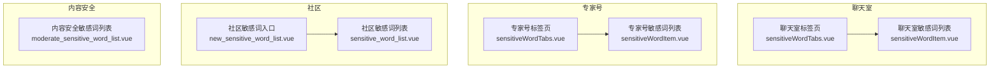
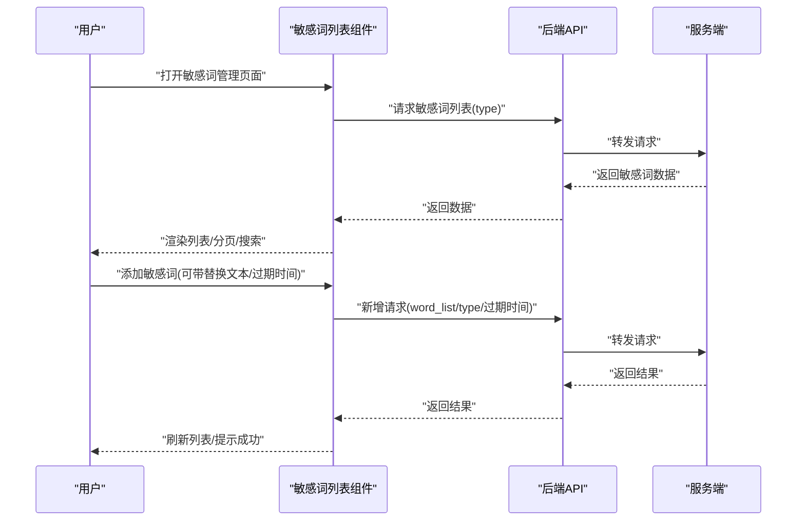
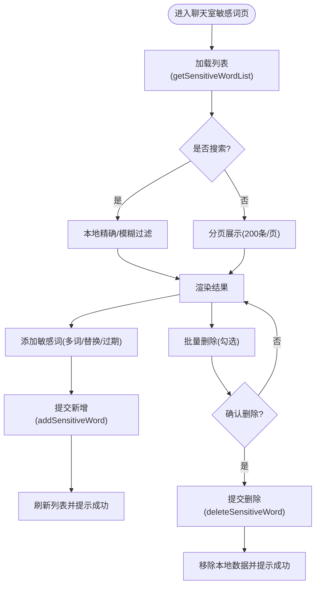
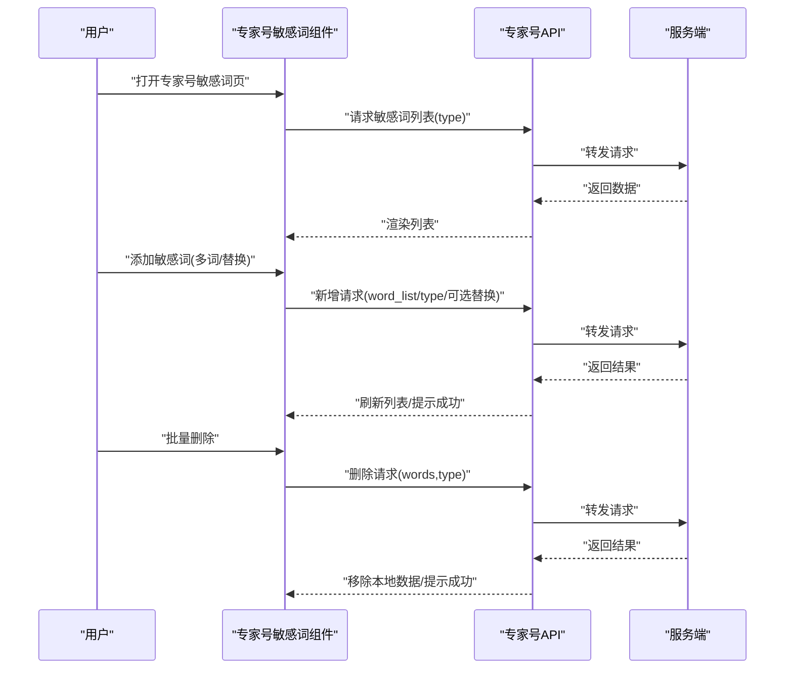
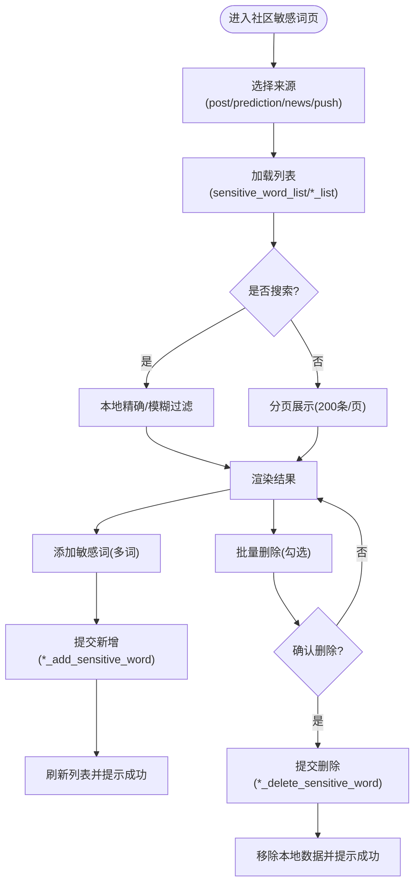
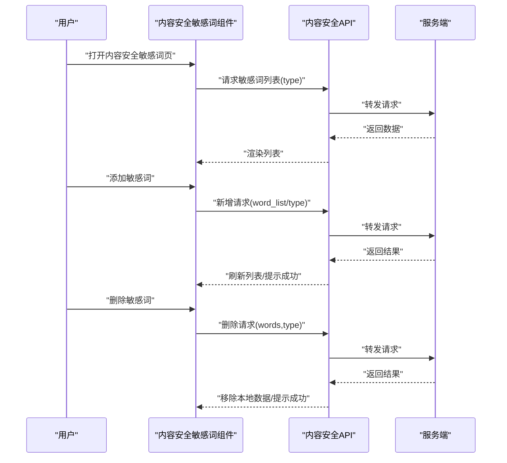
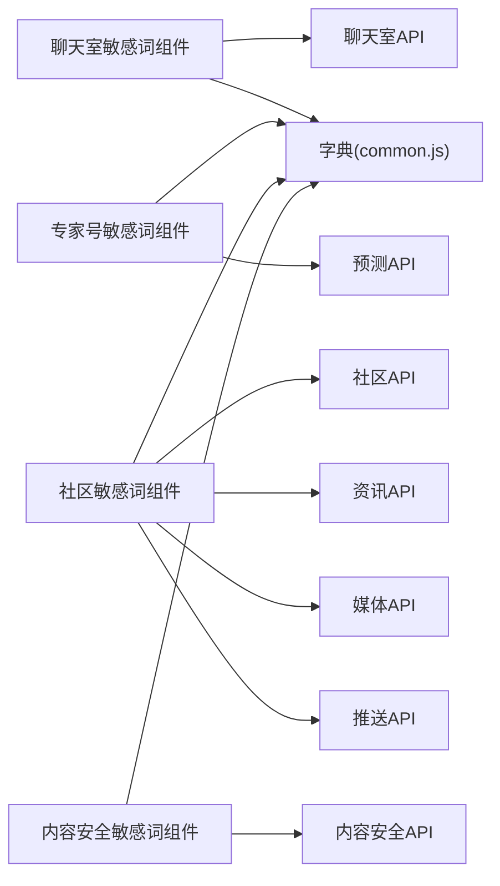

# 敏感词管理

<cite>
**本文引用的文件**
- [src/views/chat_room/sensitiveWordTabs.vue](file://src/views/chat_room/sensitiveWordTabs.vue)
- [src/views/chat_room/sensitiveWordItem.vue](file://src/views/chat_room/sensitiveWordItem.vue)
- [src/views/forum/sensitive_word_list.vue](file://src/views/forum/sensitive_word_list.vue)
- [src/views/forum/new_sensitive_word_list.vue](file://src/views/forum/new_sensitive_word_list.vue)
- [src/views/contentSecurity/moderate_sensitive_word_list.vue](file://src/views/contentSecurity/moderate_sensitive_word_list.vue)
- [src/api/chatroom.js](file://src/api/chatroom.js)
- [src/api/contentSecurity.js](file://src/api/contentSecurity.js)
- [src/utils/dict.js](file://src/utils/dict.js)
- [src/utils/dict/common.js](file://src/utils/dict/common.js)
- [src/utils/dict/security.js](file://src/utils/dict/security.js)
</cite>

## 目录
1. [简介](#简介)
2. [项目结构](#项目结构)
3. [核心组件](#核心组件)
4. [架构总览](#架构总览)
5. [详细组件分析](#详细组件分析)
6. [依赖关系分析](#依赖关系分析)
7. [性能考量](#性能考量)
8. [故障排查指南](#故障排查指南)
9. [结论](#结论)
10. [附录](#附录)

## 简介
本技术文档围绕敏感词管理系统展开，覆盖以下方面：
- 敏感词分类与管理：聊天室、专家号、社区、内容安全等多场景分类与策略（不可见、封禁、替换、标题禁发、进审敏感词等）。
- 批量导入导出：前端支持多词批量添加；后端接口定义清晰，便于扩展导入导出能力。
- 动态过滤规则：基于不同场景的策略差异，结合替换文本、过期时间等参数。
- 数据模型与字段：敏感词类别、触发条件、处理策略、有效期等。
- 过滤实现思路：正则匹配、模糊匹配、词典树等可选算法，结合前端本地分页与后端接口。
- 操作流程：添加、编辑、删除、启用/禁用、批量操作、精确/模糊搜索。
- 配置项：过滤级别、替换字符、日志记录、权限控制等。
- 最佳实践：词库维护、误判处理、性能优化、安全与合规。

## 项目结构
敏感词管理功能由多个视图组件协同实现，按业务域划分：
- 聊天室敏感词：聊天室发言场景的敏感词管理，支持“不可见”“封禁”“替换”“特殊”等策略。
- 专家号敏感词：专家号文章发布场景，支持“禁发”“替换”“标题禁发”等策略。
- 社区敏感词：社区发帖/评论等场景，支持“星号”等策略。
- 内容安全敏感词：进入审核流程的敏感词，统一管理。

图表来源
- [src/views/chat_room/sensitiveWordTabs.vue:1-50](file://src/views/chat_room/sensitiveWordTabs.vue#L1-L50)
- [src/views/chat_room/sensitiveWordItem.vue:1-324](file://src/views/chat_room/sensitiveWordItem.vue#L1-L324)
- [src/views/forum/sensitive_word_list.vue:1-243](file://src/views/forum/sensitive_word_list.vue#L1-L243)
- [src/views/forum/new_sensitive_word_list.vue:1-22](file://src/views/forum/new_sensitive_word_list.vue#L1-L22)
- [src/views/contentSecurity/moderate_sensitive_word_list.vue:1-22](file://src/views/contentSecurity/moderate_sensitive_word_list.vue#L1-L22)

章节来源
- [src/views/chat_room/sensitiveWordTabs.vue:1-50](file://src/views/chat_room/sensitiveWordTabs.vue#L1-L50)
- [src/views/chat_room/sensitiveWordItem.vue:1-324](file://src/views/chat_room/sensitiveWordItem.vue#L1-L324)
- [src/views/forum/sensitive_word_list.vue:1-243](file://src/views/forum/sensitive_word_list.vue#L1-L243)
- [src/views/forum/new_sensitive_word_list.vue:1-22](file://src/views/forum/new_sensitive_word_list.vue#L1-L22)
- [src/views/contentSecurity/moderate_sensitive_word_list.vue:1-22](file://src/views/contentSecurity/moderate_sensitive_word_list.vue#L1-L22)

## 核心组件
- 聊天室敏感词组件
  - 支持精确/模糊搜索、分页（每页200条）、全选/批量删除、添加敏感词（支持替换文本与过期时间）。
  - 根据策略类型区分“不可见/封禁/替换/特殊”，并提供对应的提示说明。
- 专家号敏感词组件
  - 支持“禁发/替换/标题禁发”策略，添加时可设置替换文本与过期时间。
- 社区敏感词组件
  - 支持多场景（帖子、预测、新闻、推送）的敏感词管理，批量添加与删除。
- 内容安全敏感词组件
  - 用于进入审核流程的敏感词管理，统一入口与策略。

章节来源
- [src/views/chat_room/sensitiveWordItem.vue:35-98](file://src/views/chat_room/sensitiveWordItem.vue#L35-L98)
- [src/views/forum/sensitive_word_list.vue:25-61](file://src/views/forum/sensitive_word_list.vue#L25-L61)
- [src/views/contentSecurity/moderate_sensitive_word_list.vue:3-8](file://src/views/contentSecurity/moderate_sensitive_word_list.vue#L3-L8)

## 架构总览
前端采用组件化设计，通过标签页切换不同场景的敏感词管理；每个场景对应独立的列表组件，负责本地搜索、分页、批量操作与调用后端API。

图表来源
- [src/views/chat_room/sensitiveWordItem.vue:299-320](file://src/views/chat_room/sensitiveWordItem.vue#L299-L320)
- [src/api/chatroom.js:6-25](file://src/api/chatroom.js#L6-L25)
- [src/views/forum/sensitive_word_list.vue:220-239](file://src/views/forum/sensitive_word_list.vue#L220-L239)
- [src/api/contentSecurity.js:82-105](file://src/api/contentSecurity.js#L82-L105)

## 详细组件分析

### 聊天室敏感词组件
- 功能要点
  - 策略类型：不可见、封禁、替换、特殊。
  - 搜索：精确/模糊本地搜索，关闭搜索恢复分页。
  - 分页：每页200条，支持全选与批量删除。
  - 添加：支持多词逗号分隔；替换场景需填写替换文本；可设置过期时间。
  - 删除：单个/批量删除，删除成功后刷新本地数据。
- 关键交互流程

图表来源
- [src/views/chat_room/sensitiveWordItem.vue:174-189](file://src/views/chat_room/sensitiveWordItem.vue#L174-L189)
- [src/views/chat_room/sensitiveWordItem.vue:225-249](file://src/views/chat_room/sensitiveWordItem.vue#L225-L249)
- [src/views/chat_room/sensitiveWordItem.vue:250-292](file://src/views/chat_room/sensitiveWordItem.vue#L250-L292)
- [src/api/chatroom.js:6-25](file://src/api/chatroom.js#L6-L25)

章节来源
- [src/views/chat_room/sensitiveWordTabs.vue:23-28](file://src/views/chat_room/sensitiveWordTabs.vue#L23-L28)
- [src/views/chat_room/sensitiveWordItem.vue:174-292](file://src/views/chat_room/sensitiveWordItem.vue#L174-L292)
- [src/api/chatroom.js:6-25](file://src/api/chatroom.js#L6-L25)

### 专家号敏感词组件
- 功能要点
  - 策略类型：禁发、替换、标题禁发。
  - 添加：支持多词逗号分隔；替换场景需填写替换文本。
  - 删除：单个/批量删除。
- 关键交互流程

图表来源
- [src/views/chat_room/sensitiveWordItem.vue:300-310](file://src/views/chat_room/sensitiveWordItem.vue#L300-L310)
- [src/views/chat_room/sensitiveWordItem.vue:225-249](file://src/views/chat_room/sensitiveWordItem.vue#L225-L249)
- [src/views/chat_room/sensitiveWordItem.vue:250-292](file://src/views/chat_room/sensitiveWordItem.vue#L250-L292)

章节来源
- [src/views/chat_room/sensitiveWordTabs.vue:25-26](file://src/views/chat_room/sensitiveWordTabs.vue#L25-L26)
- [src/views/chat_room/sensitiveWordItem.vue:300-310](file://src/views/chat_room/sensitiveWordItem.vue#L300-L310)
- [src/views/chat_room/sensitiveWordItem.vue:225-292](file://src/views/chat_room/sensitiveWordItem.vue#L225-L292)

### 社区敏感词组件
- 功能要点
  - 支持多来源：帖子、预测、新闻、推送。
  - 批量添加/删除，本地分页与搜索。
- 关键交互流程

图表来源
- [src/views/forum/sensitive_word_list.vue:115-134](file://src/views/forum/sensitive_word_list.vue#L115-L134)
- [src/views/forum/sensitive_word_list.vue:166-191](file://src/views/forum/sensitive_word_list.vue#L166-L191)
- [src/views/forum/sensitive_word_list.vue:192-215](file://src/views/forum/sensitive_word_list.vue#L192-L215)
- [src/views/forum/sensitive_word_list.vue:220-239](file://src/views/forum/sensitive_word_list.vue#L220-L239)

章节来源
- [src/views/forum/sensitive_word_list.vue:64-243](file://src/views/forum/sensitive_word_list.vue#L64-L243)
- [src/views/forum/new_sensitive_word_list.vue:3-7](file://src/views/forum/new_sensitive_word_list.vue#L3-L7)

### 内容安全敏感词组件
- 功能要点
  - 用于进入审核流程的敏感词管理。
  - 提供列表、新增、删除接口。
- 关键交互流程

图表来源
- [src/views/contentSecurity/moderate_sensitive_word_list.vue:3-8](file://src/views/contentSecurity/moderate_sensitive_word_list.vue#L3-L8)
- [src/api/contentSecurity.js:82-105](file://src/api/contentSecurity.js#L82-L105)

章节来源
- [src/views/contentSecurity/moderate_sensitive_word_list.vue:1-22](file://src/views/contentSecurity/moderate_sensitive_word_list.vue#L1-L22)
- [src/api/contentSecurity.js:82-105](file://src/api/contentSecurity.js#L82-L105)

## 依赖关系分析
- 视图组件依赖
  - 聊天室/专家号：依赖聊天室API与预测API。
  - 社区：依赖社区API与资讯/媒体/推送API。
  - 内容安全：依赖内容安全API。
- 工具与字典
  - 敏感词使用场景提示、策略说明来自字典文件。
  - 权限控制通过计算属性与hasPwer判断。

图表来源
- [src/views/chat_room/sensitiveWordItem.vue:101-106](file://src/views/chat_room/sensitiveWordItem.vue#L101-L106)
- [src/views/forum/sensitive_word_list.vue:64-68](file://src/views/forum/sensitive_word_list.vue#L64-L68)
- [src/views/contentSecurity/moderate_sensitive_word_list.vue:10-17](file://src/views/contentSecurity/moderate_sensitive_word_list.vue#L10-L17)
- [src/utils/dict/common.js:606-621](file://src/utils/dict/common.js#L606-L621)

章节来源
- [src/views/chat_room/sensitiveWordItem.vue:101-106](file://src/views/chat_room/sensitiveWordItem.vue#L101-L106)
- [src/views/forum/sensitive_word_list.vue:64-68](file://src/views/forum/sensitive_word_list.vue#L64-L68)
- [src/views/contentSecurity/moderate_sensitive_word_list.vue:10-17](file://src/views/contentSecurity/moderate_sensitive_word_list.vue#L10-L17)
- [src/utils/dict/common.js:606-621](file://src/utils/dict/common.js#L606-L621)

## 性能考量
- 前端分页与本地搜索
  - 每页200条，减少DOM渲染压力；本地过滤避免频繁网络请求。
- 批量操作
  - 批量删除与全选提升管理效率，减少重复请求。
- 替换策略
  - 对于替换场景，建议在服务端进行高效替换，前端仅做标记与预览。
- 可扩展性
  - 词典树/正则匹配等算法可在服务端实现，前端通过策略类型与参数驱动。

[本节为通用指导，无需列出具体文件来源]

## 故障排查指南
- 添加失败
  - 检查替换文本是否为空（替换场景）；检查是否包含非法字符。
  - 查看接口返回与提示信息，确认type与参数是否正确。
- 删除异常
  - 确认勾选项与接口参数一致；检查权限是否具备删除能力。
- 列表不刷新
  - 新增/删除后主动刷新列表；确认分页索引与本地数据同步。
- 权限不足
  - 使用计算属性中的权限判断逻辑，确认当前角色具备相应权限。

章节来源
- [src/views/chat_room/sensitiveWordItem.vue:250-292](file://src/views/chat_room/sensitiveWordItem.vue#L250-L292)
- [src/views/forum/sensitive_word_list.vue:166-191](file://src/views/forum/sensitive_word_list.vue#L166-L191)

## 结论
敏感词管理通过多场景标签页与统一的列表组件，实现了对聊天室、专家号、社区与内容安全等领域的精细化治理。前端提供本地搜索、分页与批量操作，后端API定义清晰，便于扩展导入导出与算法优化。结合替换策略、过期时间与权限控制，可满足不同业务的安全与合规需求。

[本节为总结性内容，无需列出具体文件来源]

## 附录

### 数据模型与字段
- 敏感词类别
  - 聊天室：不可见、封禁、替换、特殊。
  - 专家号：禁发、替换、标题禁发。
  - 社区：星号等。
  - 内容安全：进审敏感词。
- 字段说明
  - word_list：敏感词数组（逗号分隔）。
  - type：策略类型。
  - due_time：过期时间（秒）。
  - 替换文本：替换场景必填且不含特定字符。
- 策略说明
  - 不可见：命中仅自己可见。
  - 封禁：命中封号/禁言。
  - 替换：命中替换为指定文本。
  - 标题禁发：仅针对标题禁发。
  - 进审敏感词：进入审核流程。

章节来源
- [src/views/chat_room/sensitiveWordTabs.vue:23-28](file://src/views/chat_room/sensitiveWordTabs.vue#L23-L28)
- [src/views/chat_room/sensitiveWordItem.vue:250-292](file://src/views/chat_room/sensitiveWordItem.vue#L250-L292)
- [src/utils/dict/common.js:606-621](file://src/utils/dict/common.js#L606-L621)

### 过滤实现思路
- 正则匹配
  - 适用于复杂模式与边界控制，建议在服务端实现，前端传参控制。
- 模糊匹配
  - 前端本地过滤，适合快速检索与预览。
- 词典树
  - 高效前缀匹配，适合大规模敏感词库的快速判定，建议在服务端实现。

[本节为概念性说明，无需列出具体文件来源]

### 操作流程
- 添加
  - 填写敏感词（多词逗号分隔），选择策略，填写替换文本与过期时间（可选），提交新增。
- 编辑
  - 当前版本以批量删除+重新添加为主；若需精细编辑，建议后端支持单项更新。
- 删除
  - 单个删除或批量删除，确认后提交删除请求。
- 启用/禁用
  - 通过策略类型与过期时间控制；过期后自动失效。
- 导入/导出
  - 前端支持多词批量添加；后端接口定义明确，便于扩展导入导出。

章节来源
- [src/views/chat_room/sensitiveWordItem.vue:174-189](file://src/views/chat_room/sensitiveWordItem.vue#L174-L189)
- [src/views/chat_room/sensitiveWordItem.vue:225-292](file://src/views/chat_room/sensitiveWordItem.vue#L225-L292)
- [src/views/forum/sensitive_word_list.vue:115-134](file://src/views/forum/sensitive_word_list.vue#L115-L134)
- [src/views/forum/sensitive_word_list.vue:166-215](file://src/views/forum/sensitive_word_list.vue#L166-L215)

### 配置选项
- 过滤级别
  - 通过策略类型控制（不可见/封禁/替换/禁发/标题禁发/进审）。
- 替换字符
  - 替换场景必填，且不得包含特定字符。
- 日志记录
  - 建议在服务端记录敏感词命中与处理日志，前端展示提示信息。
- 权限控制
  - 通过计算属性与权限判断，确保仅具备权限的用户可进行新增/删除操作。

章节来源
- [src/views/chat_room/sensitiveWordItem.vue:144-154](file://src/views/chat_room/sensitiveWordItem.vue#L144-L154)
- [src/views/forum/sensitive_word_list.vue:100-112](file://src/views/forum/sensitive_word_list.vue#L100-L112)

### 最佳实践
- 词库维护
  - 定期清理过期敏感词；建立灰名单与白名单机制。
- 误判处理
  - 提供申诉与忽略通道；记录误判数据用于模型优化。
- 性能优化
  - 服务端实现高效匹配算法（词典树/正则），前端仅做轻量过滤与展示。
- 安全与合规
  - 明确策略边界与合规要求；定期审计敏感词策略与命中日志。

[本节为通用指导，无需列出具体文件来源]