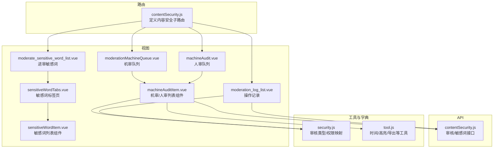
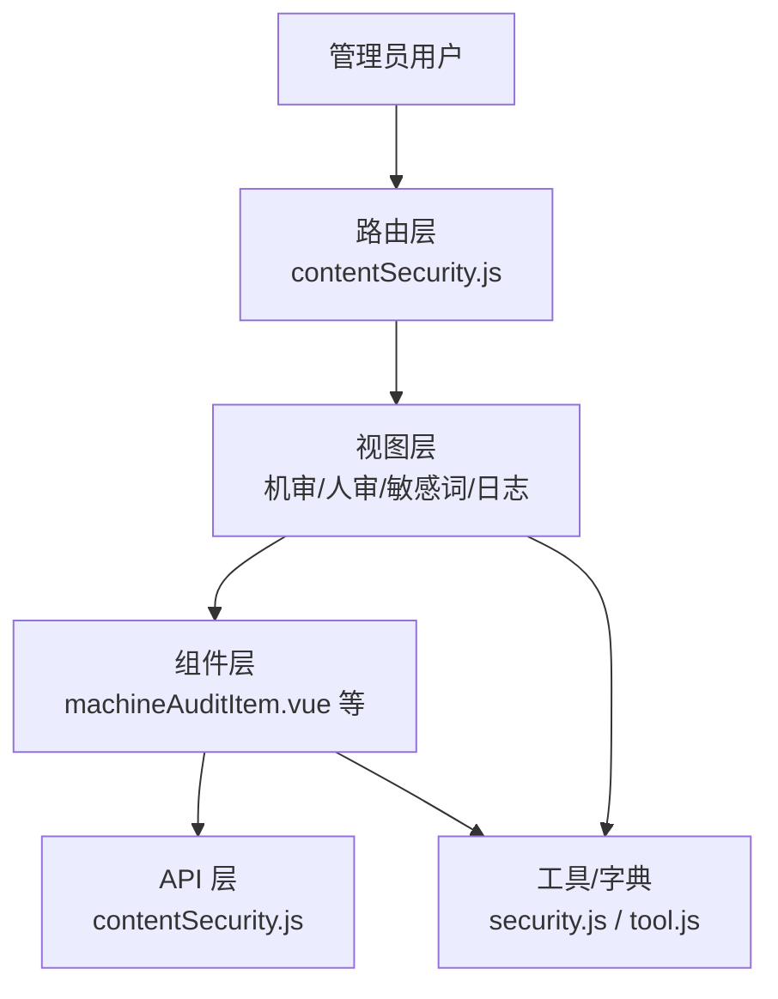
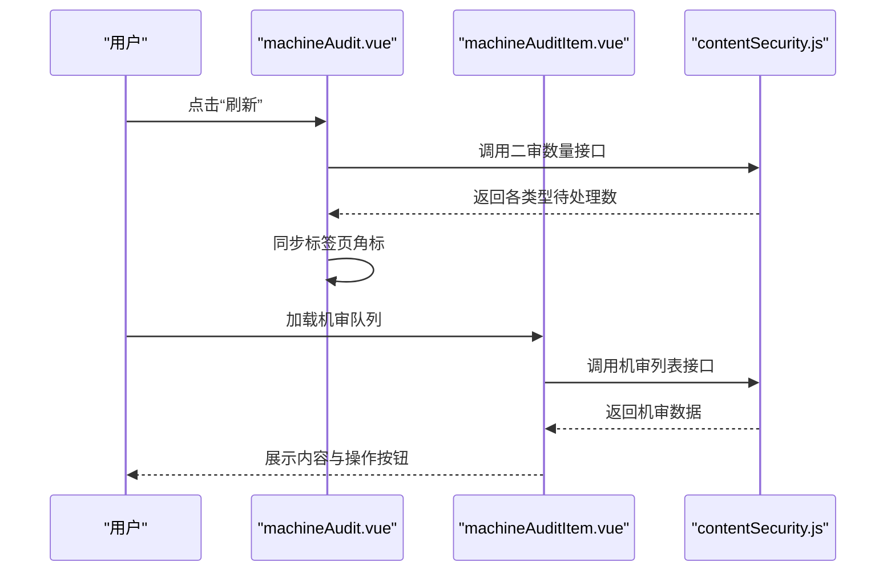
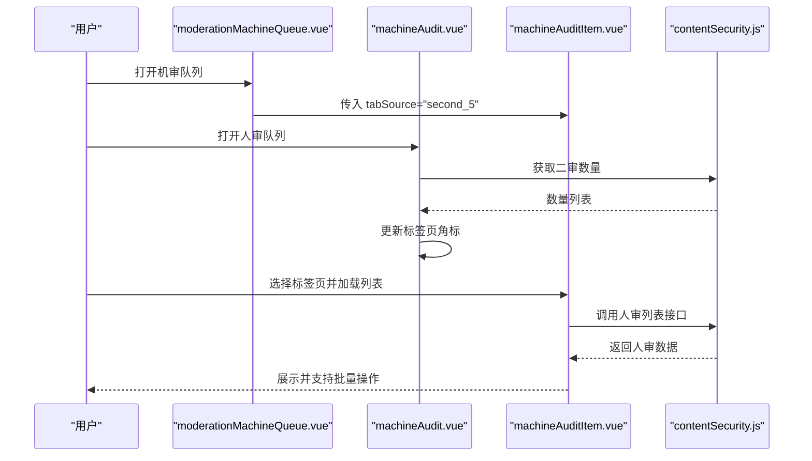
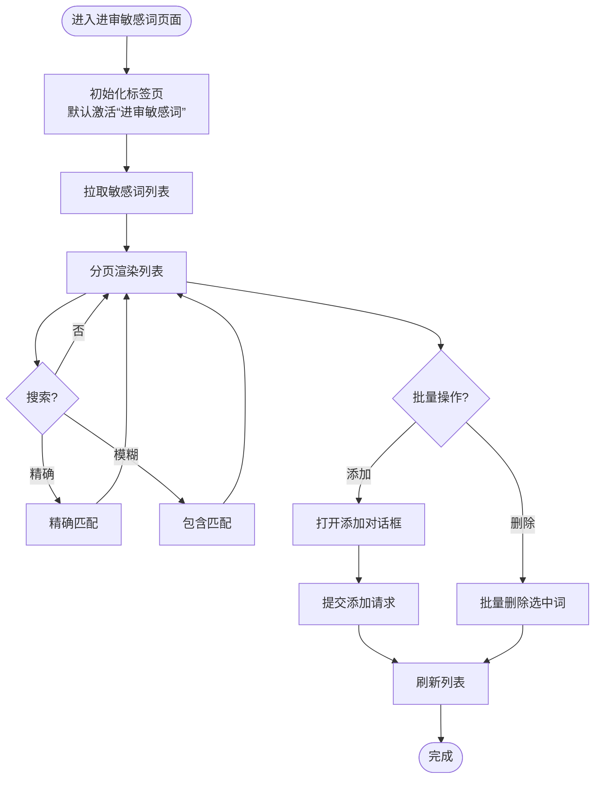
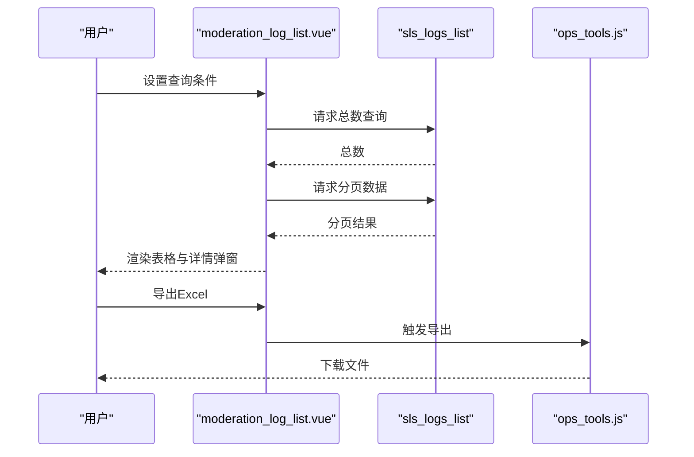
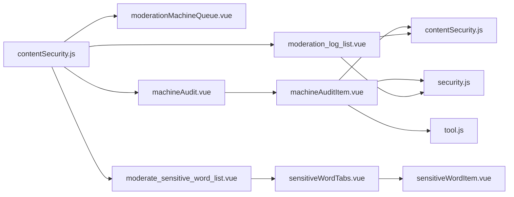

# 内容安全与审核

<cite>
**本文引用的文件**   
- [src/api/contentSecurity.js](file://src/api/contentSecurity.js)
- [src/router/children/contentSecurity.js](file://src/router/children/contentSecurity.js)
- [src/views/contentSecurity/machineAudit.vue](file://src/views/contentSecurity/machineAudit.vue)
- [src/views/contentSecurity/moderationMachineQueue.vue](file://src/views/contentSecurity/moderationMachineQueue.vue)
- [src/views/contentSecurity/moderation_log_list.vue](file://src/views/contentSecurity/moderation_log_list.vue)
- [src/views/contentSecurity/moderate_sensitive_word_list.vue](file://src/views/contentSecurity/moderate_sensitive_word_list.vue)
- [src/views/contentSecurity/components/machineAudit/machineAuditItem.vue](file://src/views/contentSecurity/components/machineAudit/machineAuditItem.vue)
- [src/views/chat_room/sensitiveWordTabs.vue](file://src/views/chat_room/sensitiveWordTabs.vue)
- [src/views/chat_room/sensitiveWordItem.vue](file://src/views/chat_room/sensitiveWordItem.vue)
- [src/utils/dict/security.js](file://src/utils/dict/security.js)
- [src/utils/tool.js](file://src/utils/tool.js)
</cite>

## 目录
1. [简介](#简介)
2. [项目结构](#项目结构)
3. [核心组件](#核心组件)
4. [架构总览](#架构总览)
5. [详细组件分析](#详细组件分析)
6. [依赖关系分析](#依赖关系分析)
7. [性能考量](#性能考量)
8. [故障排查指南](#故障排查指南)
9. [结论](#结论)
10. [附录](#附录)

## 简介
本技术文档围绕内容安全与审核功能，系统性梳理了机器审核、人工审核、敏感词管理、内容监控与日志审计等模块的设计与实现。重点覆盖：
- 机器审核配置与使用：AI审核算法接入、审核规则与阈值、二审队列联动
- 敏感词管理：敏感词库维护、关键词匹配与替换、自动屏蔽机制
- 内容监控：社区、自媒体、直播间等场景的监控策略
- 人工审核流程：任务分配、处理标准、质量评估与报表
- 最佳实践：风险识别、预防与应急处置策略
- 代码级示例路径与配置说明，帮助快速搭建多层次内容安全防护体系

## 项目结构
内容安全相关功能主要分布在以下位置：
- API 层：统一封装审核与敏感词相关接口
- 路由层：定义“内容安全”菜单及子页面入口
- 视图层：机审队列、人审队列、敏感词管理、操作日志等页面
- 工具与字典：审核类型映射、时间与高亮工具方法

**图表来源**
- [src/router/children/contentSecurity.js:1-44](file://src/router/children/contentSecurity.js#L1-L44)
- [src/views/contentSecurity/moderationMachineQueue.vue:1-21](file://src/views/contentSecurity/moderationMachineQueue.vue#L1-L21)
- [src/views/contentSecurity/machineAudit.vue:1-164](file://src/views/contentSecurity/machineAudit.vue#L1-L164)
- [src/views/contentSecurity/moderate_sensitive_word_list.vue:1-23](file://src/views/contentSecurity/moderate_sensitive_word_list.vue#L1-L23)
- [src/views/contentSecurity/moderation_log_list.vue:1-371](file://src/views/contentSecurity/moderation_log_list.vue#L1-L371)
- [src/views/contentSecurity/components/machineAudit/machineAuditItem.vue:1-608](file://src/views/contentSecurity/components/machineAudit/machineAuditItem.vue#L1-L608)
- [src/views/chat_room/sensitiveWordTabs.vue:1-50](file://src/views/chat_room/sensitiveWordTabs.vue#L1-L50)
- [src/views/chat_room/sensitiveWordItem.vue:1-324](file://src/views/chat_room/sensitiveWordItem.vue#L1-L324)
- [src/api/contentSecurity.js:1-115](file://src/api/contentSecurity.js#L1-L115)
- [src/utils/dict/security.js:1-23](file://src/utils/dict/security.js#L1-L23)
- [src/utils/tool.js:1-200](file://src/utils/tool.js#L1-L200)

**章节来源**
- [src/router/children/contentSecurity.js:1-44](file://src/router/children/contentSecurity.js#L1-L44)
- [src/views/contentSecurity/machineAudit.vue:1-164](file://src/views/contentSecurity/machineAudit.vue#L1-L164)
- [src/views/contentSecurity/moderationMachineQueue.vue:1-21](file://src/views/contentSecurity/moderationMachineQueue.vue#L1-L21)
- [src/views/contentSecurity/moderate_sensitive_word_list.vue:1-23](file://src/views/contentSecurity/moderate_sensitive_word_list.vue#L1-L23)
- [src/views/contentSecurity/moderation_log_list.vue:1-371](file://src/views/contentSecurity/moderation_log_list.vue#L1-L371)
- [src/views/contentSecurity/components/machineAudit/machineAuditItem.vue:1-608](file://src/views/contentSecurity/components/machineAudit/machineAuditItem.vue#L1-L608)
- [src/views/chat_room/sensitiveWordTabs.vue:1-50](file://src/views/chat_room/sensitiveWordTabs.vue#L1-L50)
- [src/views/chat_room/sensitiveWordItem.vue:1-324](file://src/views/chat_room/sensitiveWordItem.vue#L1-L324)
- [src/api/contentSecurity.js:1-115](file://src/api/contentSecurity.js#L1-L115)
- [src/utils/dict/security.js:1-23](file://src/utils/dict/security.js#L1-L23)
- [src/utils/tool.js:1-200](file://src/utils/tool.js#L1-L200)

## 核心组件
- 机审队列：展示待机审内容，支持刷新与自动刷新，面向“机审”角色
- 人审队列：按审核类型分页签展示待人审内容，支持批量/单项通过与处理，面向“人审”角色
- 敏感词管理（进审）：集中维护“进审敏感词”，支持精确/模糊搜索、批量删除、添加替换词
- 操作记录：基于日志检索的审核报表，支持导出、查看详情、风险提示高亮

**章节来源**
- [src/views/contentSecurity/moderationMachineQueue.vue:1-21](file://src/views/contentSecurity/moderationMachineQueue.vue#L1-L21)
- [src/views/contentSecurity/machineAudit.vue:1-164](file://src/views/contentSecurity/machineAudit.vue#L1-L164)
- [src/views/contentSecurity/moderate_sensitive_word_list.vue:1-23](file://src/views/contentSecurity/moderate_sensitive_word_list.vue#L1-L23)
- [src/views/contentSecurity/moderation_log_list.vue:1-371](file://src/views/contentSecurity/moderation_log_list.vue#L1-L371)

## 架构总览
内容安全系统采用“前端路由+视图组件+API封装+工具/字典”的分层设计：
- 路由层负责导航与权限控制
- 视图层负责业务交互与数据展示
- API 层封装后端接口，统一错误与成功处理
- 工具与字典提供通用能力与枚举映射

**图表来源**
- [src/router/children/contentSecurity.js:1-44](file://src/router/children/contentSecurity.js#L1-L44)
- [src/views/contentSecurity/components/machineAudit/machineAuditItem.vue:1-608](file://src/views/contentSecurity/components/machineAudit/machineAuditItem.vue#L1-L608)
- [src/api/contentSecurity.js:1-115](file://src/api/contentSecurity.js#L1-L115)
- [src/utils/dict/security.js:1-23](file://src/utils/dict/security.js#L1-L23)
- [src/utils/tool.js:1-200](file://src/utils/tool.js#L1-L200)

## 详细组件分析

### 机审队列（machineAudit.vue）
- 功能要点
  - 自动刷新：开启/关闭定时刷新，倒计时更新待处理数
  - 分类统计：读取二审各类数据数量，动态更新标签页角标
  - 列表加载：调用机审接口，渲染内容ID、用户信息、标题/内容、附件/视频、风险提示、额外数据、操作按钮
  - 批量导出：支持导出当前选中项到 Excel
- 关键流程
  - 初始化标签页与默认选中
  - 获取二审数量并同步到标签页
  - 列表分页与本地渲染
  - 操作回调触发父组件刷新

**图表来源**
- [src/views/contentSecurity/machineAudit.vue:133-160](file://src/views/contentSecurity/machineAudit.vue#L133-L160)
- [src/views/contentSecurity/components/machineAudit/machineAuditItem.vue:553-604](file://src/views/contentSecurity/components/machineAudit/machineAuditItem.vue#L553-L604)
- [src/api/contentSecurity.js:38-44](file://src/api/contentSecurity.js#L38-L44)

**章节来源**
- [src/views/contentSecurity/machineAudit.vue:1-164](file://src/views/contentSecurity/machineAudit.vue#L1-L164)
- [src/views/contentSecurity/components/machineAudit/machineAuditItem.vue:1-608](file://src/views/contentSecurity/components/machineAudit/machineAuditItem.vue#L1-L608)
- [src/api/contentSecurity.js:1-115](file://src/api/contentSecurity.js#L1-L115)

### 人审队列（moderationMachineQueue.vue + machineAudit.vue）
- 功能要点
  - 人审队列页面承载机审专用的列表组件
  - 人审页面支持按审核类型分页签切换，动态读取二审数量
  - 支持批量通过/处理、批量有效/误判、导出 Excel
- 关键流程
  - 页面初始化后加载默认标签页
  - 定时刷新二审数量并同步到标签页
  - 列表组件根据 tabSource 切换接口与字段映射

**图表来源**
- [src/views/contentSecurity/moderationMachineQueue.vue:1-21](file://src/views/contentSecurity/moderationMachineQueue.vue#L1-L21)
- [src/views/contentSecurity/machineAudit.vue:63-86](file://src/views/contentSecurity/machineAudit.vue#L63-L86)
- [src/views/contentSecurity/components/machineAudit/machineAuditItem.vue:553-604](file://src/views/contentSecurity/components/machineAudit/machineAuditItem.vue#L553-L604)
- [src/api/contentSecurity.js:46-52](file://src/api/contentSecurity.js#L46-L52)

**章节来源**
- [src/views/contentSecurity/moderationMachineQueue.vue:1-21](file://src/views/contentSecurity/moderationMachineQueue.vue#L1-L21)
- [src/views/contentSecurity/machineAudit.vue:1-164](file://src/views/contentSecurity/machineAudit.vue#L1-L164)
- [src/views/contentSecurity/components/machineAudit/machineAuditItem.vue:1-608](file://src/views/contentSecurity/components/machineAudit/machineAuditItem.vue#L1-L608)
- [src/api/contentSecurity.js:1-115](file://src/api/contentSecurity.js#L1-L115)

### 敏感词管理（进审敏感词）
- 功能要点
  - 标签页切换：进审敏感词、不可见、封禁、替换、特殊等类型
  - 列表展示：支持精确/模糊搜索、全选/反选、批量删除
  - 添加敏感词：支持多词输入（逗号分隔）、替换词（特定类型）、过期时间设置
  - 数据来源：调用 contentSecurity 的敏感词接口
- 关键流程
  - 初始化标签页与默认激活类型
  - 拉取敏感词列表并分页渲染
  - 添加/删除操作后刷新列表

**图表来源**
- [src/views/contentSecurity/moderate_sensitive_word_list.vue:1-23](file://src/views/contentSecurity/moderate_sensitive_word_list.vue#L1-L23)
- [src/views/chat_room/sensitiveWordTabs.vue:1-50](file://src/views/chat_room/sensitiveWordTabs.vue#L1-L50)
- [src/views/chat_room/sensitiveWordItem.vue:195-320](file://src/views/chat_room/sensitiveWordItem.vue#L195-L320)
- [src/api/contentSecurity.js:82-105](file://src/api/contentSecurity.js#L82-L105)

**章节来源**
- [src/views/contentSecurity/moderate_sensitive_word_list.vue:1-23](file://src/views/contentSecurity/moderate_sensitive_word_list.vue#L1-L23)
- [src/views/chat_room/sensitiveWordTabs.vue:1-50](file://src/views/chat_room/sensitiveWordTabs.vue#L1-L50)
- [src/views/chat_room/sensitiveWordItem.vue:1-324](file://src/views/chat_room/sensitiveWordItem.vue#L1-L324)
- [src/api/contentSecurity.js:1-115](file://src/api/contentSecurity.js#L1-L115)

### 操作记录（moderation_log_list.vue）
- 功能要点
  - 基于日志检索的审核报表，支持时间范围、UID、内容关键字、模型名、object_id 等条件
  - 展示操作时间、操作人、审核延迟、UID、内容ID、标题/内容、图片、审核结果、处理方式、分类、处理理由、风险提示、额外数据
  - 支持导出 Excel、查看用户详情、跳转到对应内容详情
- 关键流程
  - 组装查询条件与 SLS 查询语句
  - 分别请求总数与分页数据
  - 渲染表格并支持查看详情弹窗

**图表来源**
- [src/views/contentSecurity/moderation_log_list.vue:272-367](file://src/views/contentSecurity/moderation_log_list.vue#L272-L367)
- [src/utils/tool.js:155-200](file://src/utils/tool.js#L155-L200)

**章节来源**
- [src/views/contentSecurity/moderation_log_list.vue:1-371](file://src/views/contentSecurity/moderation_log_list.vue#L1-L371)
- [src/utils/tool.js:1-200](file://src/utils/tool.js#L1-L200)

### 审核类型与权限映射（security.js）
- 审核类型：帖子（彩民圈/其他）、评论（彩民圈/其他）、聊天室、资讯评论、评分评论、集锦视频评论
- 二审权限映射：不同审核类型对应封禁来源与删除/隐藏权限

**章节来源**
- [src/utils/dict/security.js:1-23](file://src/utils/dict/security.js#L1-L23)

## 依赖关系分析
- 路由依赖：contentSecurity.js 定义子路由与权限标识，确保仅具备相应角色可访问
- 视图依赖：机审/人审页面依赖 machineAuditItem.vue 组件；敏感词页面依赖 chat_room 的敏感词组件
- API 依赖：所有审核与敏感词操作均通过 contentSecurity.js 封装的接口进行
- 工具依赖：时间格式化、高亮关键词、导出 Excel 等工具方法在多个组件中复用

**图表来源**
- [src/router/children/contentSecurity.js:1-44](file://src/router/children/contentSecurity.js#L1-L44)
- [src/views/contentSecurity/moderationMachineQueue.vue:1-21](file://src/views/contentSecurity/moderationMachineQueue.vue#L1-L21)
- [src/views/contentSecurity/machineAudit.vue:1-164](file://src/views/contentSecurity/machineAudit.vue#L1-L164)
- [src/views/contentSecurity/moderate_sensitive_word_list.vue:1-23](file://src/views/contentSecurity/moderate_sensitive_word_list.vue#L1-L23)
- [src/views/contentSecurity/moderation_log_list.vue:1-371](file://src/views/contentSecurity/moderation_log_list.vue#L1-L371)
- [src/views/contentSecurity/components/machineAudit/machineAuditItem.vue:1-608](file://src/views/contentSecurity/components/machineAudit/machineAuditItem.vue#L1-L608)
- [src/views/chat_room/sensitiveWordTabs.vue:1-50](file://src/views/chat_room/sensitiveWordTabs.vue#L1-L50)
- [src/views/chat_room/sensitiveWordItem.vue:1-324](file://src/views/chat_room/sensitiveWordItem.vue#L1-L324)
- [src/api/contentSecurity.js:1-115](file://src/api/contentSecurity.js#L1-L115)
- [src/utils/dict/security.js:1-23](file://src/utils/dict/security.js#L1-L23)
- [src/utils/tool.js:1-200](file://src/utils/tool.js#L1-L200)

**章节来源**
- [src/router/children/contentSecurity.js:1-44](file://src/router/children/contentSecurity.js#L1-L44)
- [src/views/contentSecurity/components/machineAudit/machineAuditItem.vue:1-608](file://src/views/contentSecurity/components/machineAudit/machineAuditItem.vue#L1-L608)
- [src/views/chat_room/sensitiveWordItem.vue:1-324](file://src/views/chat_room/sensitiveWordItem.vue#L1-L324)
- [src/api/contentSecurity.js:1-115](file://src/api/contentSecurity.js#L1-L115)
- [src/utils/dict/security.js:1-23](file://src/utils/dict/security.js#L1-L23)
- [src/utils/tool.js:1-200](file://src/utils/tool.js#L1-L200)

## 性能考量
- 列表渲染优化
  - 机审/人审列表采用本地分页，避免频繁请求接口，提升响应速度
  - 使用高亮关键词与图片/视频预览时注意虚拟滚动与懒加载（若后续扩展）
- 刷新策略
  - 人审页面支持定时刷新，建议根据业务峰值调整刷新周期，避免接口压力过大
- 导出与大列表
  - 导出 Excel 建议限制单次导出条数，或采用分批导出策略
- 日志检索
  - 操作记录基于 SLS 查询，建议合理设置时间范围与过滤条件，减少查询负载

[本节为通用指导，无需具体文件分析]

## 故障排查指南
- 机审/人审列表无数据
  - 检查接口返回状态与错误消息，确认网络与鉴权正常
  - 确认 tabSource 与 data_type 参数正确传递
- 标签页角标不更新
  - 确认二审数量接口返回格式一致，检查同步逻辑
- 敏感词添加失败
  - 检查替换词必填与特殊字符限制，确认过期时间格式
- 操作记录为空
  - 检查查询条件与时间范围，确认日志存储与索引可用

**章节来源**
- [src/views/contentSecurity/components/machineAudit/machineAuditItem.vue:414-465](file://src/views/contentSecurity/components/machineAudit/machineAuditItem.vue#L414-L465)
- [src/views/chat_room/sensitiveWordItem.vue:250-292](file://src/views/chat_room/sensitiveWordItem.vue#L250-L292)
- [src/views/contentSecurity/moderation_log_list.vue:272-367](file://src/views/contentSecurity/moderation_log_list.vue#L272-L367)

## 结论
本内容安全与审核体系通过清晰的路由与视图分层、完善的机审/人审流程、可维护的敏感词库以及可追溯的操作日志，形成了从“检测—处理—监督—改进”的闭环。结合本文提供的最佳实践与排障建议，可在保证效率的同时持续提升内容治理水平。

[本节为总结性内容，无需具体文件分析]

## 附录

### 接口与配置说明（代码示例路径）
- 机审/人审列表与二审数量
  - [机审列表接口:29-35](file://src/api/contentSecurity.js#L29-L35)
  - [二审数量接口:38-44](file://src/api/contentSecurity.js#L38-L44)
  - [人审列表接口:46-52](file://src/api/contentSecurity.js#L46-L52)
- 机审/人审操作
  - [忽略机审:73-79](file://src/api/contentSecurity.js#L73-L79)
  - [忽略二审:55-61](file://src/api/contentSecurity.js#L55-L61)
  - [处理二审:64-70](file://src/api/contentSecurity.js#L64-L70)
- 敏感词管理
  - [进审敏感词列表:82-87](file://src/api/contentSecurity.js#L82-L87)
  - [添加进审敏感词:90-96](file://src/api/contentSecurity.js#L90-L96)
  - [删除进审敏感词:99-105](file://src/api/contentSecurity.js#L99-L105)
- 操作记录（日志检索）
  - [日志查询接口:320-332](file://src/views/contentSecurity/moderation_log_list.vue#L320-L332)

**章节来源**
- [src/api/contentSecurity.js:1-115](file://src/api/contentSecurity.js#L1-L115)
- [src/views/contentSecurity/moderation_log_list.vue:272-367](file://src/views/contentSecurity/moderation_log_list.vue#L272-L367)

### 审核类型与权限映射（代码示例路径）
- [审核类型字典:2-11](file://src/utils/dict/security.js#L2-L11)
- [二审权限映射:13-22](file://src/utils/dict/security.js#L13-L22)

**章节来源**
- [src/utils/dict/security.js:1-23](file://src/utils/dict/security.js#L1-L23)

### 工具方法（代码示例路径）
- [时间格式化与高亮工具:155-200](file://src/utils/tool.js#L155-L200)
- [导出 Excel（机审组件）:296-345](file://src/views/contentSecurity/components/machineAudit/machineAuditItem.vue#L296-L345)

**章节来源**
- [src/utils/tool.js:1-200](file://src/utils/tool.js#L1-L200)
- [src/views/contentSecurity/components/machineAudit/machineAuditItem.vue:296-345](file://src/views/contentSecurity/components/machineAudit/machineAuditItem.vue#L296-L345)