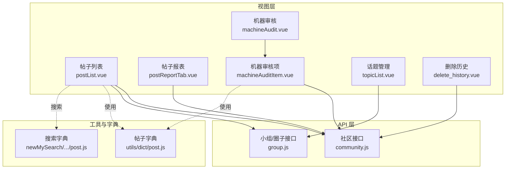
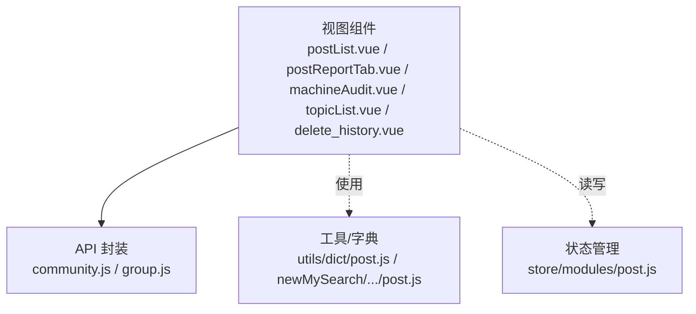
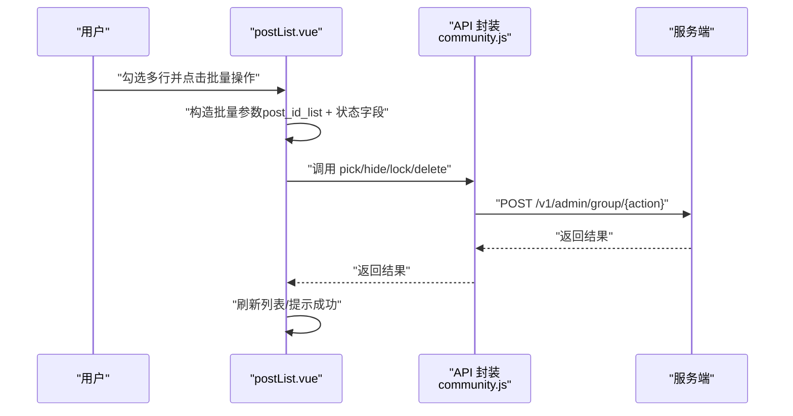
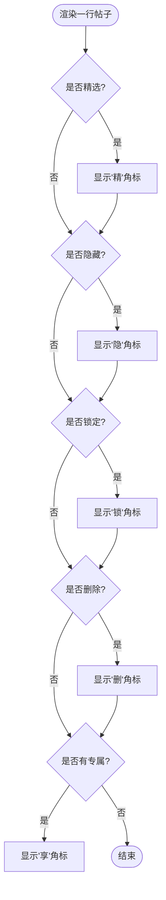
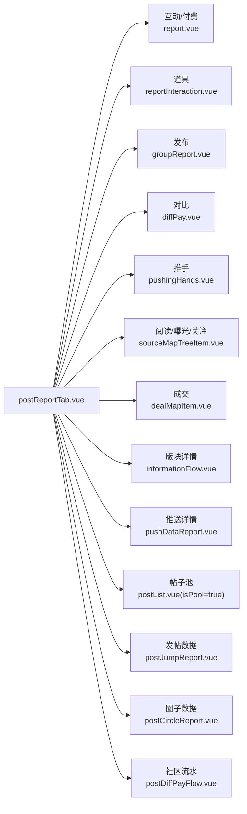
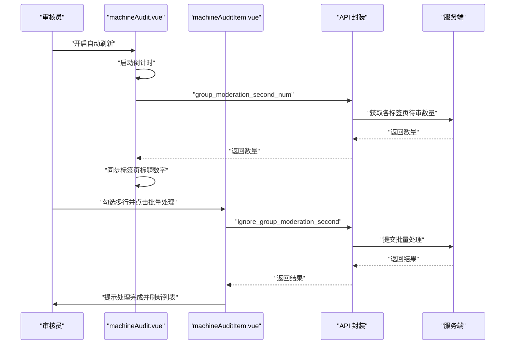
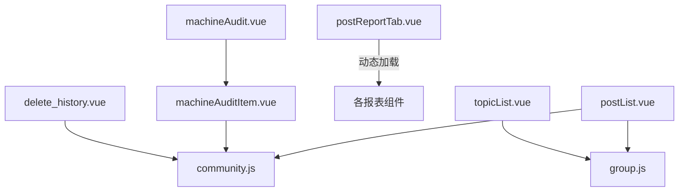

# 帖子管理

<cite>
**本文引用的文件**
- [postList.vue](file://src/views/forum/postList.vue)
- [community.js](file://src/api/community.js)
- [post.js](file://src/utils/dict/post.js)
- [postStatus.vue](file://src/views/forum/components/postStatus.vue)
- [postReportTab.vue](file://src/views/forum/postReportTab.vue)
- [machineAudit.vue](file://src/views/forum/machineAudit.vue)
- [machineAuditItem.vue](file://src/views/forum/components/machineAudit/machineAuditItem.vue)
- [group.js](file://src/api/group.js)
- [topicList.vue](file://src/views/forum/topicList.vue)
- [post.js（字典）](file://src/utils/dict/post.js)
- [post.js（搜索字典）](file://src/components/newMySearch/components/searchTopKey/topKeyItem/post.js)
- [delete_history.vue](file://src/views/forum/delete_history.vue)
- [appControl.vue](file://src/views/app_set/appControl.vue)
- [post.js（store）](file://src/store/modules/post.js)
- [monitor_group.vue](file://src/views/forum/monitor_group.vue)
</cite>

## 目录
1. [简介](#简介)
2. [项目结构](#项目结构)
3. [核心组件](#核心组件)
4. [架构总览](#架构总览)
5. [详细组件分析](#详细组件分析)
6. [依赖关系分析](#依赖关系分析)
7. [性能考量](#性能考量)
8. [故障排查指南](#故障排查指南)
9. [结论](#结论)
10. [附录](#附录)

## 简介
本技术文档围绕“帖子管理”功能进行系统化梳理，覆盖帖子列表展示与管理、增删改查与批量操作、搜索与筛选、报表统计、审核流程（人工/机器）、分类与标签体系、置顶/加精/屏蔽等能力，并给出最佳实践建议与配置说明，帮助读者快速理解并高效使用该模块完成帖子的全生命周期管理。

## 项目结构
帖子管理相关能力主要分布在以下层次：
- 视图层：帖子列表、报表、机器审核、人工审核、话题管理、删除历史等页面组件
- API 层：统一通过社区与小组相关的接口封装，提供帖子列表、详情、状态变更、报表、审核等能力
- 工具与字典：帖子类型、圈子类型、报表类型、权限与操作类型等常量与映射
- 状态管理：本地存储帖子点击历史、敏感词轻量列表等

图表来源
- [postList.vue:1-800](file://src/views/forum/postList.vue#L1-L800)
- [community.js:1-676](file://src/api/community.js#L1-L676)
- [group.js:136-176](file://src/api/group.js#L136-L176)
- [postReportTab.vue:1-190](file://src/views/forum/postReportTab.vue#L1-L190)
- [machineAudit.vue:1-199](file://src/views/forum/machineAudit.vue#L1-L199)
- [machineAuditItem.vue:1-498](file://src/views/forum/components/machineAudit/machineAuditItem.vue#L1-L498)
- [topicList.vue:249-264](file://src/views/forum/topicList.vue#L249-L264)
- [delete_history.vue:52-121](file://src/views/forum/delete_history.vue#L52-L121)
- [post.js（字典）:28-204](file://src/utils/dict/post.js#L28-L204)
- [post.js（搜索字典）:15-29](file://src/components/newMySearch/components/searchTopKey/topKeyItem/post.js#L15-L29)

章节来源
- [postList.vue:1-800](file://src/views/forum/postList.vue#L1-L800)
- [community.js:1-676](file://src/api/community.js#L1-L676)
- [group.js:136-176](file://src/api/group.js#L136-L176)
- [postReportTab.vue:1-190](file://src/views/forum/postReportTab.vue#L1-L190)
- [machineAudit.vue:1-199](file://src/views/forum/machineAudit.vue#L1-L199)
- [machineAuditItem.vue:1-498](file://src/views/forum/components/machineAudit/machineAuditItem.vue#L1-L498)
- [topicList.vue:249-264](file://src/views/forum/topicList.vue#L249-L264)
- [delete_history.vue:52-121](file://src/views/forum/delete_history.vue#L52-L121)
- [post.js（字典）:28-204](file://src/utils/dict/post.js#L28-L204)
- [post.js（搜索字典）:15-29](file://src/components/newMySearch/components/searchTopKey/topKeyItem/post.js#L15-L29)

## 核心组件
- 帖子列表组件：支持多种场景（普通检索、抽屉、搜索组件、帖子池、热门推荐、推荐黑名单、球队关联帖），提供分页、排序、批量操作、导出、评论与购买记录查看、特殊内容展示等能力
- 帖子状态展示组件：以角标形式直观呈现精选、隐藏、锁定、删除、专属等状态
- 帖子报表组件：聚合互动、付费、道具、发布、对比、推手、阅读、曝光、成交、版块详情、推送详情、关注、帖子池、发帖数据、圈子数据、社区流水等维度
- 机器审核组件：支持自动刷新、多标签页（审核、帖子/评论-彩民圈、帖子/评论-其他）、批量处理、导出、报表
- 话题管理组件：支持话题状态（未上架/上架中/已下架）与时间筛选
- 删除历史组件：记录删除/隐藏等操作的历史明细
- 字典与权限：统一定义帖子类型、圈子类型、报表类型、操作类型、权限点等

章节来源
- [postList.vue:518-720](file://src/views/forum/postList.vue#L518-L720)
- [postStatus.vue:1-74](file://src/views/forum/components/postStatus.vue#L1-L74)
- [postReportTab.vue:112-187](file://src/views/forum/postReportTab.vue#L112-L187)
- [machineAudit.vue:52-196](file://src/views/forum/machineAudit.vue#L52-L196)
- [machineAuditItem.vue:178-498](file://src/views/forum/components/machineAudit/machineAuditItem.vue#L178-L498)
- [topicList.vue:249-264](file://src/views/forum/topicList.vue#L249-L264)
- [delete_history.vue:52-121](file://src/views/forum/delete_history.vue#L52-L121)
- [post.js（字典）:28-204](file://src/utils/dict/post.js#L28-L204)

## 架构总览
帖子管理采用“视图组件 + API 封装 + 工具/字典 + 状态管理”的分层设计，视图组件负责交互与展示，API 封装提供统一的数据访问入口，工具/字典提供类型与权限映射，状态管理负责本地缓存与轻量数据。

图表来源
- [postList.vue:482-555](file://src/views/forum/postList.vue#L482-L555)
- [community.js:10-161](file://src/api/community.js#L10-L161)
- [group.js:136-176](file://src/api/group.js#L136-L176)
- [post.js（字典）:28-204](file://src/utils/dict/post.js#L28-L204)
- [post.js（搜索字典）:15-29](file://src/components/newMySearch/components/searchTopKey/topKeyItem/post.js#L15-L29)
- [post.js（store）:1-113](file://src/store/modules/post.js#L1-L113)

## 详细组件分析

### 帖子列表组件（postList.vue）
- 功能要点
  - 多场景复用：普通检索、抽屉、搜索组件、帖子池、热门推荐、推荐黑名单、球队关联帖
  - 列表字段：用户、类型、特殊内容（富文本/音频/视频/红包/专属）、标题、内容、图片/视频、评论数、浏览/曝光/点赞、归属地、渠道、创建时间、操作
  - 批量操作：精选、隐藏、锁定、删除、取消、批量退款、换圈、加入话题、推荐黑名单
  - 搜索与筛选：支持时间范围、类型、圈子、用户等多维条件；支持导出 Excel
  - 特殊能力：热门推荐（IP/地区联动）、帖子池（级联选择+本地全量）、推荐黑名单、球队关联帖
- 数据流
  - 服务端分页：postListV2；本地全量：tablePoolList（帖子池/黑名单/热门/球队帖）
  - 排序：支持本地全量排序与服务端排序切换
  - 状态变更：pick_post、hide_post、locked_post、delete_post
- 关键实现位置
  - 列表渲染与列定义：[postList.vue:178-442](file://src/views/forum/postList.vue#L178-L442)
  - 批量操作入口与按钮组：[postList.vue:155-176](file://src/views/forum/postList.vue#L155-L176)
  - 热门推荐与帖子池逻辑：[postList.vue:764-800](file://src/views/forum/postList.vue#L764-L800)
  - API 调用封装：[community.js:10-44](file://src/api/community.js#L10-L44)

图表来源
- [postList.vue:155-176](file://src/views/forum/postList.vue#L155-L176)
- [community.js:17-44](file://src/api/community.js#L17-L44)

章节来源
- [postList.vue:178-442](file://src/views/forum/postList.vue#L178-L442)
- [postList.vue:155-176](file://src/views/forum/postList.vue#L155-L176)
- [postList.vue:764-800](file://src/views/forum/postList.vue#L764-L800)
- [community.js:10-44](file://src/api/community.js#L10-L44)

### 帖子状态展示组件（postStatus.vue）
- 功能要点
  - 以角标形式展示精选（精）、隐藏（隐）、锁定（锁）、删除（删）、专属（享）等状态
- 使用位置
  - 帖子列表右侧状态区：[postList.vue:412-420](file://src/views/forum/postList.vue#L412-L420)

图表来源
- [postStatus.vue:60-66](file://src/views/forum/components/postStatus.vue#L60-L66)
- [postList.vue:412-420](file://src/views/forum/postList.vue#L412-L420)

章节来源
- [postStatus.vue:1-74](file://src/views/forum/components/postStatus.vue#L1-L74)
- [postList.vue:412-420](file://src/views/forum/postList.vue#L412-L420)

### 帖子报表组件（postReportTab.vue）
- 功能要点
  - 支持互动、付费、道具、发布、对比、推手、阅读、曝光、成交、版块详情、推送详情、关注、帖子池、发帖数据、圈子数据、社区流水等报表类型
  - 根据权限动态显示报表标签页
- 使用位置
  - 报表容器与标签页切换：[postReportTab.vue:52-92](file://src/views/forum/postReportTab.vue#L52-L92)
  - 报表组件注册与懒加载：[postReportTab.vue:96-108](file://src/views/forum/postReportTab.vue#L96-L108)

图表来源
- [postReportTab.vue:52-92](file://src/views/forum/postReportTab.vue#L52-L92)
- [postReportTab.vue:96-108](file://src/views/forum/postReportTab.vue#L96-L108)

章节来源
- [postReportTab.vue:52-92](file://src/views/forum/postReportTab.vue#L52-L92)
- [postReportTab.vue:96-108](file://src/views/forum/postReportTab.vue#L96-L108)

### 机器审核组件（machineAudit.vue / machineAuditItem.vue）
- 功能要点
  - 多标签页：审核、帖子（彩民圈/其他）、评论（彩民圈/其他）
  - 自动刷新：支持倒计时刷新，避免离开页面后定时器继续运行
  - 批量处理：有效/误判、不处理、导出 Excel
  - 二审联动：根据类型映射到帖子/评论/资讯/聊天室/文章等处理组件
- 关键实现位置
  - 标签页配置与默认页：[machineAudit.vue:82-97](file://src/views/forum/machineAudit.vue#L82-L97)
  - 自动刷新与计时器：[machineAudit.vue:100-132](file://src/views/forum/machineAudit.vue#L100-L132)
  - 标题数字同步：[machineAudit.vue:134-158](file://src/views/forum/machineAudit.vue#L134-L158)
  - 机器审核项列表与操作：[machineAuditItem.vue:26-141](file://src/views/forum/components/machineAudit/machineAuditItem.vue#L26-L141)
  - 类型映射与批量处理：[machineAuditItem.vue:201-210](file://src/views/forum/components/machineAudit/machineAuditItem.vue#L201-L210)
  - 二审处理与导出：[machineAuditItem.vue:366-418](file://src/views/forum/components/machineAudit/machineAuditItem.vue#L366-L418)

图表来源
- [machineAudit.vue:100-132](file://src/views/forum/machineAudit.vue#L100-L132)
- [machineAudit.vue:160-194](file://src/views/forum/machineAudit.vue#L160-L194)
- [machineAuditItem.vue:366-418](file://src/views/forum/components/machineAudit/machineAuditItem.vue#L366-L418)

章节来源
- [machineAudit.vue:82-97](file://src/views/forum/machineAudit.vue#L82-L97)
- [machineAudit.vue:100-132](file://src/views/forum/machineAudit.vue#L100-L132)
- [machineAudit.vue:134-158](file://src/views/forum/machineAudit.vue#L134-L158)
- [machineAudit.vue:160-194](file://src/views/forum/machineAudit.vue#L160-L194)
- [machineAuditItem.vue:26-141](file://src/views/forum/components/machineAudit/machineAuditItem.vue#L26-L141)
- [machineAuditItem.vue:201-210](file://src/views/forum/components/machineAudit/machineAuditItem.vue#L201-L210)
- [machineAuditItem.vue:366-418](file://src/views/forum/components/machineAudit/machineAuditItem.vue#L366-L418)

### 话题管理组件（topicList.vue）
- 功能要点
  - 话题状态筛选：未上架、上架中、已下架
  - 时间维度：根据状态动态转换 start_time/end_time 查询条件
- 关键实现位置
  - 状态到时间条件映射：[topicList.vue:256-264](file://src/views/forum/topicList.vue#L256-L264)

章节来源
- [topicList.vue:256-264](file://src/views/forum/topicList.vue#L256-L264)

### 删除历史组件（delete_history.vue）
- 功能要点
  - 展示删除/隐藏等操作的历史记录，支持按对象类型跳转到帖子/评论详情
- 关键实现位置
  - 历史记录表头与跳转逻辑：[delete_history.vue:52-121](file://src/views/forum/delete_history.vue#L52-L121)

章节来源
- [delete_history.vue:52-121](file://src/views/forum/delete_history.vue#L52-L121)

### 字典与权限（utils/dict/post.js）
- 功能要点
  - 帖子类型、圈子类型、报表类型、权限点、操作类型等统一定义
- 关键实现位置
  - 帖子类型映射：[post.js（字典）:28-37](file://src/utils/dict/post.js#L28-L37)
  - 圈子类型与置顶类型：[post.js（字典）:168-178](file://src/utils/dict/post.js#L168-L178)
  - 操作类型（删除/隐藏/加精/换圈/推荐黑名单等）：[post.js（字典）:193-203](file://src/utils/dict/post.js#L193-L203)

章节来源
- [post.js（字典）:28-37](file://src/utils/dict/post.js#L28-L37)
- [post.js（字典）:168-178](file://src/utils/dict/post.js#L168-L178)
- [post.js（字典）:193-203](file://src/utils/dict/post.js#L193-L203)

### 搜索与默认字段（newMySearch/.../post.js）
- 功能要点
  - 定义帖子相关搜索默认字段与排序字段，确保搜索组件默认可用
- 关键实现位置
  - 默认字段映射：[post.js（搜索字典）:15-29](file://src/components/newMySearch/components/searchTopKey/topKeyItem/post.js#L15-L29)

章节来源
- [post.js（搜索字典）:15-29](file://src/components/newMySearch/components/searchTopKey/topKeyItem/post.js#L15-L29)

### 应用配置（appControl.vue）
- 功能要点
  - 社区内容审核相关开关与阈值：如内容检查开关、互动审核开关、最小等级、打赏限制等
- 关键实现位置
  - 配置项示例：[appControl.vue:71-99](file://src/views/app_set/appControl.vue#L71-L99)

章节来源
- [appControl.vue:71-99](file://src/views/app_set/appControl.vue#L71-L99)

### 状态管理（store/modules/post.js）
- 功能要点
  - 本地存储帖子点击历史、敏感词轻量列表等
- 关键实现位置
  - 本地存储与加载：[post.js（store）:74-85](file://src/store/modules/post.js#L74-L85)
  - 敏感词列表加载：[post.js（store）:92-104](file://src/store/modules/post.js#L92-L104)

章节来源
- [post.js（store）:74-85](file://src/store/modules/post.js#L74-L85)
- [post.js（store）:92-104](file://src/store/modules/post.js#L92-L104)

## 依赖关系分析
- 组件耦合
  - 帖子列表与社区接口强耦合，通过 postListV2 实现分页与排序
  - 机器审核与小组接口强耦合，涉及审核数量与批量处理
  - 报表组件与多个报表子组件解耦，通过标签页动态加载
- 外部依赖
  - Element UI 表格、分页、对话框等组件库
  - 富文本编辑器、视频播放器、导出 Excel 插件等第三方能力
- 权限与安全
  - 多处使用 hasPwer 进行权限校验，避免越权操作
  - 审核与报表均基于权限点控制可见性与可操作性

图表来源
- [postList.vue:482-555](file://src/views/forum/postList.vue#L482-L555)
- [community.js:10-161](file://src/api/community.js#L10-L161)
- [group.js:136-176](file://src/api/group.js#L136-L176)
- [machineAudit.vue:52-196](file://src/views/forum/machineAudit.vue#L52-L196)
- [machineAuditItem.vue:178-498](file://src/views/forum/components/machineAudit/machineAuditItem.vue#L178-L498)
- [postReportTab.vue:96-108](file://src/views/forum/postReportTab.vue#L96-L108)
- [topicList.vue:249-264](file://src/views/forum/topicList.vue#L249-L264)
- [delete_history.vue:52-121](file://src/views/forum/delete_history.vue#L52-L121)

章节来源
- [postList.vue:482-555](file://src/views/forum/postList.vue#L482-L555)
- [community.js:10-161](file://src/api/community.js#L10-L161)
- [group.js:136-176](file://src/api/group.js#L136-L176)
- [machineAudit.vue:52-196](file://src/views/forum/machineAudit.vue#L52-L196)
- [machineAuditItem.vue:178-498](file://src/views/forum/components/machineAudit/machineAuditItem.vue#L178-L498)
- [postReportTab.vue:96-108](file://src/views/forum/postReportTab.vue#L96-L108)
- [topicList.vue:249-264](file://src/views/forum/topicList.vue#L249-L264)
- [delete_history.vue:52-121](file://src/views/forum/delete_history.vue#L52-L121)

## 性能考量
- 列表渲染优化
  - 使用虚拟滚动与固定列减少 DOM 压力
  - 对富文本/视频/图片等复杂内容采用懒加载与缩略图
- 分页与排序
  - 优先使用服务端分页与排序，避免一次性加载全量数据
  - 本地全量场景（帖子池/黑名单/热门/球队帖）需配合本地排序与分页函数
- 审核与报表
  - 自动刷新需谨慎使用，避免频繁请求造成压力
  - 批量操作建议限制单次批量数量，防止接口超时
- 缓存与本地存储
  - 利用本地存储缓存帖子点击历史与敏感词列表，降低重复请求

## 故障排查指南
- 列表无数据或排序异常
  - 检查排序字段与服务端支持情况，必要时切换为本地全量排序
  - 确认分页参数 page/limit/orderby_cond 是否正确传递
- 批量操作失败
  - 核对权限点是否具备（如 group_save_post、group_interact_refund）
  - 查看接口返回码与消息，定位具体失败原因
- 审核任务未刷新
  - 确认自动刷新开关与倒计时是否正常
  - 检查定时器是否被清理（beforeDestroy 生命周期）
- 报表数据不一致
  - 确认报表类型与权限点匹配
  - 检查时间范围与筛选条件是否正确

章节来源
- [postList.vue:731-752](file://src/views/forum/postList.vue#L731-L752)
- [machineAudit.vue:77-79](file://src/views/forum/machineAudit.vue#L77-L79)
- [machineAudit.vue:100-132](file://src/views/forum/machineAudit.vue#L100-L132)

## 结论
帖子管理模块通过清晰的分层设计与完善的工具/字典支撑，实现了从列表展示、批量操作、搜索筛选到报表统计与审核流程的全链路能力。结合权限控制与本地缓存策略，既能满足日常运营需求，也能在高负载场景下保持稳定与高效。建议在实际使用中遵循最佳实践，合理配置审核策略与报表口径，持续优化用户体验与社区生态。

## 附录
- 最佳实践
  - 内容质量控制：启用内容检查与互动审核，设置合理的最小等级与打赏限制
  - 用户行为监控：利用报表组件定期分析互动、付费、阅读、曝光等指标
  - 社区氛围维护：通过加精、屏蔽、推荐黑名单等手段维持健康社区环境
  - 审核流程：结合机器审核与人工审核，建立分级处理与复核机制
- 配置说明
  - 社区应用配置：在应用控制面板中调整内容检查、互动审核、最小等级、打赏限制等参数
  - 权限点：确保相关权限点（如 group_save_post、group_moderation、group_report_*）已授权

章节来源
- [appControl.vue:71-99](file://src/views/app_set/appControl.vue#L71-L99)
- [monitor_group.vue:656-671](file://src/views/forum/monitor_group.vue#L656-L671)