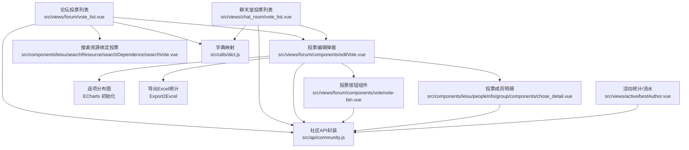
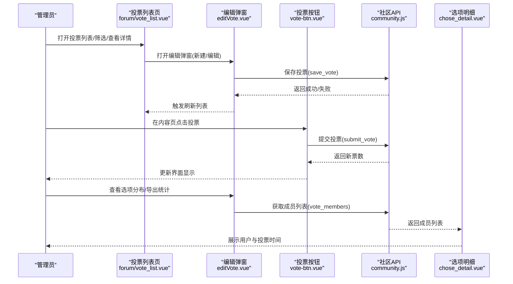
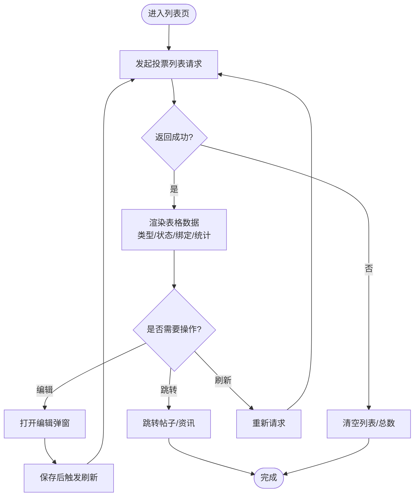
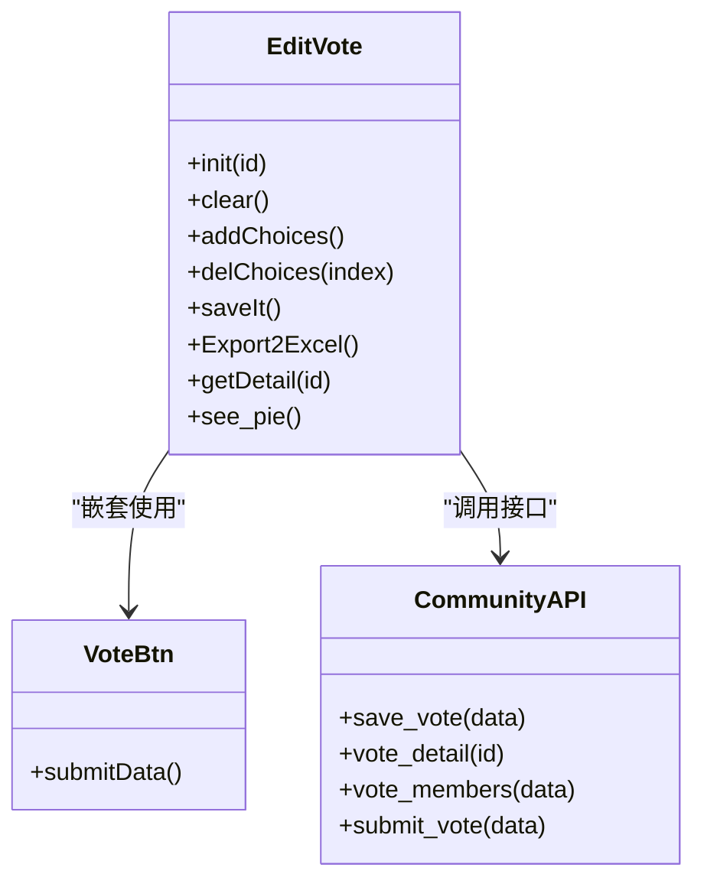
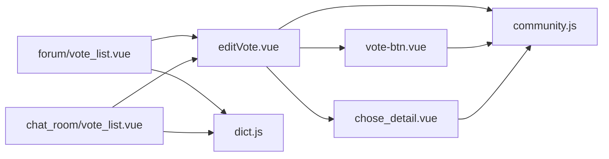

# 投票管理

<cite>
**本文引用的文件**
- [src/views/forum/vote_list.vue](file://src/views/forum/vote_list.vue)
- [src/views/chat_room/vote_list.vue](file://src/views/chat_room/vote_list.vue)
- [src/views/forum/components/editVote.vue](file://src/views/forum/components/editVote.vue)
- [src/views/forum/components/vote/vote-btn.vue](file://src/views/forum/components/vote/vote-btn.vue)
- [src/components/leisu/peopleInfo/group/components/chose_detail.vue](file://src/components/leisu/peopleInfo/group/components/chose_detail.vue)
- [src/components/leisu/searchResource/searchDependence/searchVote.vue](file://src/components/leisu/searchResource/searchDependence/searchVote.vue)
- [src/api/community.js](file://src/api/community.js)
- [src/utils/dict.js](file://src/utils/dict.js)
- [src/views/active/bestAuthor.vue](file://src/views/active/bestAuthor.vue)
</cite>

## 目录
1. [引言](#引言)
2. [项目结构](#项目结构)
3. [核心组件](#核心组件)
4. [架构总览](#架构总览)
5. [详细组件分析](#详细组件分析)
6. [依赖关系分析](#依赖关系分析)
7. [性能考量](#性能考量)
8. [故障排查指南](#故障排查指南)
9. [结论](#结论)
10. [附录](#附录)

## 引言
本技术文档围绕“投票管理”功能展开，系统梳理投票列表展示与管理、投票创建/编辑/删除、投票统计与分析、投票类型与规则、审核与监控机制、最佳实践与配置说明。文档以代码级分析为基础，结合可视化图表与流程图，帮助开发者与运营人员快速理解并高效使用投票管理能力。

## 项目结构
投票管理相关模块主要分布在以下位置：
- 列表页与筛选：论坛投票列表、聊天室投票列表
- 投票编辑与发布：投票编辑弹窗、投票按钮组件
- 统计与明细：选项分布图、投票成员明细
- API 接口：社区与通用接口封装
- 字典与枚举：投票类型、公布类型等配置映射
- 统计报表：活动/专家类页面中的投票统计与流水查询

**图表来源**
- [src/views/forum/vote_list.vue:14-102](file://src/views/forum/vote_list.vue#L14-L102)
- [src/views/chat_room/vote_list.vue:137-135](file://src/views/chat_room/vote_list.vue#L137-L135)
- [src/views/forum/components/editVote.vue:29-108](file://src/views/forum/components/editVote.vue#L29-L108)
- [src/views/forum/components/vote/vote-btn.vue:12-69](file://src/views/forum/components/vote/vote-btn.vue#L12-L69)
- [src/components/leisu/peopleInfo/group/components/chose_detail.vue:3-29](file://src/components/leisu/peopleInfo/group/components/chose_detail.vue#L3-L29)
- [src/components/leisu/searchResource/searchDependence/searchVote.vue:70-122](file://src/components/leisu/searchResource/searchDependence/searchVote.vue#L70-L122)
- [src/api/community.js:399-431](file://src/api/community.js#L399-L431)
- [src/utils/dict.js:1-11](file://src/utils/dict.js#L1-L11)
- [src/views/active/bestAuthor.vue:290-306](file://src/views/active/bestAuthor.vue#L290-L306)

**章节来源**
- [src/views/forum/vote_list.vue:14-183](file://src/views/forum/vote_list.vue#L14-L183)
- [src/views/chat_room/vote_list.vue:137-202](file://src/views/chat_room/vote_list.vue#L137-L202)
- [src/views/forum/components/editVote.vue:29-415](file://src/views/forum/components/editVote.vue#L29-L415)
- [src/views/forum/components/vote/vote-btn.vue:12-118](file://src/views/forum/components/vote/vote-btn.vue#L12-L118)
- [src/components/leisu/peopleInfo/group/components/chose_detail.vue:3-84](file://src/components/leisu/peopleInfo/group/components/chose_detail.vue#L3-L84)
- [src/components/leisu/searchResource/searchDependence/searchVote.vue:70-223](file://src/components/leisu/searchResource/searchDependence/searchVote.vue#L70-L223)
- [src/api/community.js:399-676](file://src/api/community.js#L399-L676)
- [src/utils/dict.js:1-11](file://src/utils/dict.js#L1-L11)
- [src/views/active/bestAuthor.vue:290-811](file://src/views/active/bestAuthor.vue#L290-L811)

## 核心组件
- 论坛投票列表页：提供投票列表、筛选、状态展示、绑定信息、操作入口（编辑、跳转帖子/资讯）。
- 聊天室投票列表页：提供投票列表、删除操作、统计字段（总票数、持续时间、截止时间）。
- 投票编辑弹窗：支持投票类型（单选/多选）、公布类型（不公布/即时/到期）、话题、选项、结束时间、红包配置；支持导出统计、查看选项分布。
- 投票按钮组件：提交投票、加载态、成功后更新选项票数。
- 选项明细弹窗：按选项查看投票用户列表、投票时间。
- 搜索资源绑定投票：在帖子/资讯编辑场景中绑定或解绑投票。
- API 封装：投票列表、保存、详情、成员、提交、统计、记录等接口。
- 字典映射：投票类型、公布类型等枚举值的前端展示映射。
- 统计与流水：活动/专家类页面中的投票统计与流水查询。

**章节来源**
- [src/views/forum/vote_list.vue:117-183](file://src/views/forum/vote_list.vue#L117-L183)
- [src/views/chat_room/vote_list.vue:145-202](file://src/views/chat_room/vote_list.vue#L145-L202)
- [src/views/forum/components/editVote.vue:117-415](file://src/views/forum/components/editVote.vue#L117-L415)
- [src/views/forum/components/vote/vote-btn.vue:12-118](file://src/views/forum/components/vote/vote-btn.vue#L12-L118)
- [src/components/leisu/peopleInfo/group/components/chose_detail.vue:32-84](file://src/components/leisu/peopleInfo/group/components/chose_detail.vue#L32-L84)
- [src/components/leisu/searchResource/searchDependence/searchVote.vue:70-223](file://src/components/leisu/searchResource/searchDependence/searchVote.vue#L70-L223)
- [src/api/community.js:399-676](file://src/api/community.js#L399-L676)
- [src/utils/dict.js:1-11](file://src/utils/dict.js#L1-L11)
- [src/views/active/bestAuthor.vue:290-811](file://src/views/active/bestAuthor.vue#L290-L811)

## 架构总览
投票管理从前端到后端的关键交互如下：

**图表来源**
- [src/views/forum/vote_list.vue:145-183](file://src/views/forum/vote_list.vue#L145-L183)
- [src/views/forum/components/editVote.vue:191-285](file://src/views/forum/components/editVote.vue#L191-L285)
- [src/views/forum/components/vote/vote-btn.vue:48-67](file://src/views/forum/components/vote/vote-btn.vue#L48-L67)
- [src/api/community.js:407-431](file://src/api/community.js#L407-L431)
- [src/components/leisu/peopleInfo/group/components/chose_detail.vue:72-80](file://src/components/leisu/peopleInfo/group/components/chose_detail.vue#L72-L80)

## 详细组件分析

### 投票列表页（论坛）
- 功能要点
  - 支持分页、筛选、排序
  - 展示投票类型、公布类型、红包、绑定信息（帖子/资讯）、话题、选项、状态、参与人数
  - 支持进入编辑弹窗、跳转帖子/资讯详情
- 关键实现
  - 列表请求：调用社区投票列表接口
  - 数据格式化：使用字典映射展示类型与状态
  - 操作入口：编辑、跳转、刷新

**图表来源**
- [src/views/forum/vote_list.vue:145-183](file://src/views/forum/vote_list.vue#L145-L183)
- [src/api/community.js:399-406](file://src/api/community.js#L399-L406)
- [src/utils/dict.js:1-11](file://src/utils/dict.js#L1-L11)

**章节来源**
- [src/views/forum/vote_list.vue:117-183](file://src/views/forum/vote_list.vue#L117-L183)
- [src/api/community.js:399-406](file://src/api/community.js#L399-L406)
- [src/utils/dict.js:1-11](file://src/utils/dict.js#L1-L11)

### 投票列表页（聊天室）
- 功能要点
  - 展示总票数、持续时间、截止时间
  - 支持删除投票
- 关键实现
  - 列表请求：调用聊天室投票列表接口
  - 删除操作：调用删除接口并刷新

**章节来源**
- [src/views/chat_room/vote_list.vue:145-202](file://src/views/chat_room/vote_list.vue#L145-L202)
- [src/api/community.js:399-406](file://src/api/community.js#L399-L406)

### 投票编辑弹窗
- 功能要点
  - 投票类型：单选/多选
  - 公布类型：不公布/即时/到期
  - 话题、选项、结束时间
  - 红包配置（金币/雷速币、标题、数量、总金额）
  - 导出统计（按选项导出成员列表）
  - 查看选项分布（饼图）
- 关键实现
  - 表单校验与保存：调用保存接口
  - 成员导出：逐项拉取成员并合并导出
  - 分布图：基于 ECharts 渲染

**图表来源**
- [src/views/forum/components/editVote.vue:117-415](file://src/views/forum/components/editVote.vue#L117-L415)
- [src/views/forum/components/vote/vote-btn.vue:12-118](file://src/views/forum/components/vote/vote-btn.vue#L12-L118)
- [src/api/community.js:407-431](file://src/api/community.js#L407-L431)

**章节来源**
- [src/views/forum/components/editVote.vue:117-415](file://src/views/forum/components/editVote.vue#L117-L415)
- [src/views/forum/components/vote/vote-btn.vue:12-118](file://src/views/forum/components/vote/vote-btn.vue#L12-L118)
- [src/api/community.js:407-431](file://src/api/community.js#L407-L431)

### 投票按钮组件
- 功能要点
  - 提交单个选项投票
  - 加载态与错误提示
  - 成功后更新选项票数
- 关键实现
  - 参数组装：投票ID、选项ID
  - 接口调用：提交投票
  - 结果回填：更新本地票数

**章节来源**
- [src/views/forum/components/vote/vote-btn.vue:12-118](file://src/views/forum/components/vote/vote-btn.vue#L12-L118)
- [src/api/community.js:544-551](file://src/api/community.js#L544-L551)

### 选项明细弹窗
- 功能要点
  - 按选项查看投票用户列表
  - 展示用户信息与投票时间
  - 分页加载
- 关键实现
  - 请求参数：投票ID、选项ID、分页
  - 接口调用：获取成员列表

**章节来源**
- [src/components/leisu/peopleInfo/group/components/chose_detail.vue:32-84](file://src/components/leisu/peopleInfo/group/components/chose_detail.vue#L32-L84)
- [src/api/community.js:424-431](file://src/api/community.js#L424-L431)

### 搜索资源绑定投票
- 功能要点
  - 在帖子/资讯编辑场景中绑定/解绑投票
  - 禁止对已绑定资源进行二次绑定
- 关键实现
  - 表格列控制：根据绑定状态禁用/启用操作
  - 解绑提示：引导先解除绑定再操作

**章节来源**
- [src/components/leisu/searchResource/searchDependence/searchVote.vue:70-122](file://src/components/leisu/searchResource/searchDependence/searchVote.vue#L70-L122)
- [src/components/leisu/searchResource/searchDependence/searchVote.vue:186-191](file://src/components/leisu/searchResource/searchDependence/searchVote.vue#L186-L191)

### 统计与分析
- 投票统计接口：用于活动/专家类页面的统计与流水查询
- 投票记录接口：支持按阶段/轮次/UID/费用等条件查询
- 投票成员接口：按选项导出投票用户明细

**章节来源**
- [src/api/community.js:586-588](file://src/api/community.js#L586-L588)
- [src/api/community.js:577-584](file://src/api/community.js#L577-L584)
- [src/api/community.js:424-431](file://src/api/community.js#L424-L431)
- [src/views/active/bestAuthor.vue:290-811](file://src/views/active/bestAuthor.vue#L290-L811)

## 依赖关系分析
- 组件耦合
  - 列表页依赖编辑弹窗与字典映射
  - 编辑弹窗依赖按钮组件、成员明细、API 封装
  - 选项明细依赖 API 封装与分页组件
- 外部依赖
  - ECharts 用于选项分布图
  - Excel 导出工具用于统计导出
- 可能的循环依赖
  - 当前结构清晰，组件间为单向依赖，未见循环

**图表来源**
- [src/views/forum/vote_list.vue:106-115](file://src/views/forum/vote_list.vue#L106-L115)
- [src/views/chat_room/vote_list.vue:138-143](file://src/views/chat_room/vote_list.vue#L138-L143)
- [src/views/forum/components/editVote.vue:112-120](file://src/views/forum/components/editVote.vue#L112-L120)
- [src/views/forum/components/vote/vote-btn.vue:13](file://src/views/forum/components/vote/vote-btn.vue#L13)
- [src/components/leisu/peopleInfo/group/components/chose_detail.vue:32-39](file://src/components/leisu/peopleInfo/group/components/chose_detail.vue#L32-L39)
- [src/api/community.js:399-431](file://src/api/community.js#L399-L431)
- [src/utils/dict.js:1-11](file://src/utils/dict.js#L1-L11)

**章节来源**
- [src/views/forum/vote_list.vue:106-115](file://src/views/forum/vote_list.vue#L106-L115)
- [src/views/chat_room/vote_list.vue:138-143](file://src/views/chat_room/vote_list.vue#L138-L143)
- [src/views/forum/components/editVote.vue:112-120](file://src/views/forum/components/editVote.vue#L112-L120)
- [src/views/forum/components/vote/vote-btn.vue:13](file://src/views/forum/components/vote/vote-btn.vue#L13)
- [src/components/leisu/peopleInfo/group/components/chose_detail.vue:32-39](file://src/components/leisu/peopleInfo/group/components/chose_detail.vue#L32-L39)
- [src/api/community.js:399-431](file://src/api/community.js#L399-L431)
- [src/utils/dict.js:1-11](file://src/utils/dict.js#L1-L11)

## 性能考量
- 列表分页与筛选：通过分页参数减少一次性数据量，避免长列表渲染压力。
- 成员导出：按选项并发请求并聚合，注意并发数量与网络抖动处理。
- 图表渲染：饼图仅在打开弹窗时初始化，避免重复渲染。
- 提交投票：按钮增加加载态，防止重复提交造成请求积压。

[本节为通用建议，无需特定文件引用]

## 故障排查指南
- 提交投票失败
  - 检查接口返回码与消息提示
  - 确认投票是否已结束、是否满足规则（如多选/单选）
- 成员导出为空
  - 确认选项是否有投票记录
  - 检查并发请求是否全部成功
- 列表无数据
  - 检查筛选条件与分页参数
  - 确认接口返回码与 total
- 绑定冲突
  - 已绑定帖子/资讯时禁止二次绑定，需先解绑

**章节来源**
- [src/views/forum/components/vote/vote-btn.vue:56-66](file://src/views/forum/components/vote/vote-btn.vue#L56-L66)
- [src/views/forum/components/editVote.vue:220-284](file://src/views/forum/components/editVote.vue#L220-L284)
- [src/views/forum/vote_list.vue:145-183](file://src/views/forum/vote_list.vue#L145-L183)
- [src/components/leisu/searchResource/searchDependence/searchVote.vue:78-101](file://src/components/leisu/searchResource/searchDependence/searchVote.vue#L78-L101)

## 结论
投票管理模块以“列表-编辑-提交-统计-导出”为主线，覆盖了从创建到分析的完整生命周期。通过清晰的组件边界与 API 封装，实现了良好的可维护性与扩展性。建议在实际使用中结合业务规则完善审核与风控策略，并利用统计与导出能力持续优化投票活动效果。

[本节为总结性内容，无需特定文件引用]

## 附录

### 投票类型与规则
- 投票类型
  - 单选：仅允许选择一个选项
  - 多选：允许选择多个选项
- 公布类型
  - 不公布：不公开实时票数
  - 即时公布：实时显示票数
  - 到期公布：截止后统一公布
- 时间限制
  - 结束时间：超过时间不可投票
- 参与人数限制
  - 可结合业务在前端提示或后端校验

**章节来源**
- [src/views/forum/components/editVote.vue:44-56](file://src/views/forum/components/editVote.vue#L44-L56)
- [src/views/forum/vote_list.vue:33-41](file://src/views/forum/vote_list.vue#L33-L41)
- [src/utils/dict.js:1-11](file://src/utils/dict.js#L1-L11)

### 审核与监控机制
- 刷票检测与异常行为识别
  - 可结合“投票记录/流水查询”接口进行异常行为分析
  - 建议关注短时间内高频投票、同一设备/账号异常集中等特征
- 违规处理
  - 对异常投票进行封禁、回滚、统计修正等操作

**章节来源**
- [src/api/community.js:577-584](file://src/api/community.js#L577-L584)
- [src/views/active/bestAuthor.vue:290-811](file://src/views/active/bestAuthor.vue#L290-L811)

### 最佳实践
- 活动策划
  - 明确投票类型与公布策略，提升透明度与参与感
  - 合理设置结束时间，避免过短导致刷票风险
- 用户参与度
  - 使用红包激励、话题引导等方式提升互动
- 公平性保障
  - 强化风控策略，结合历史数据与实时监控识别异常
- 生命周期管理
  - 从创建、发布、监控到归档，建立标准化流程与责任分工

[本节为通用建议，无需特定文件引用]