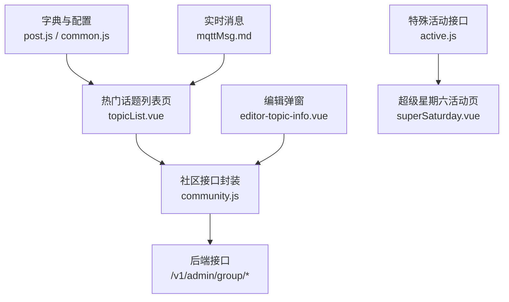
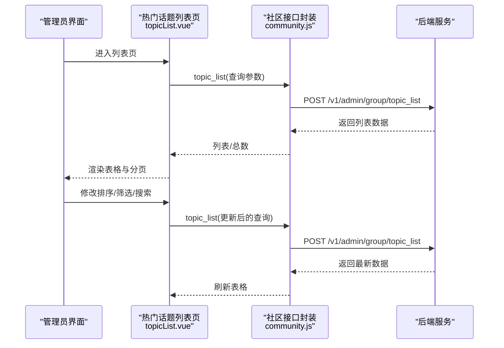
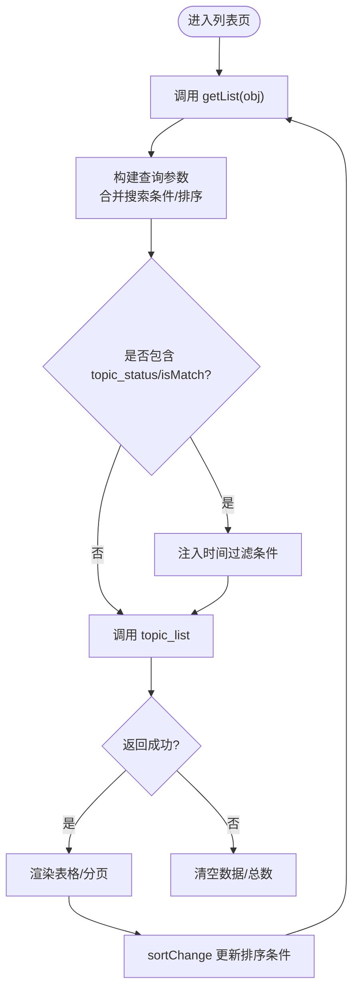
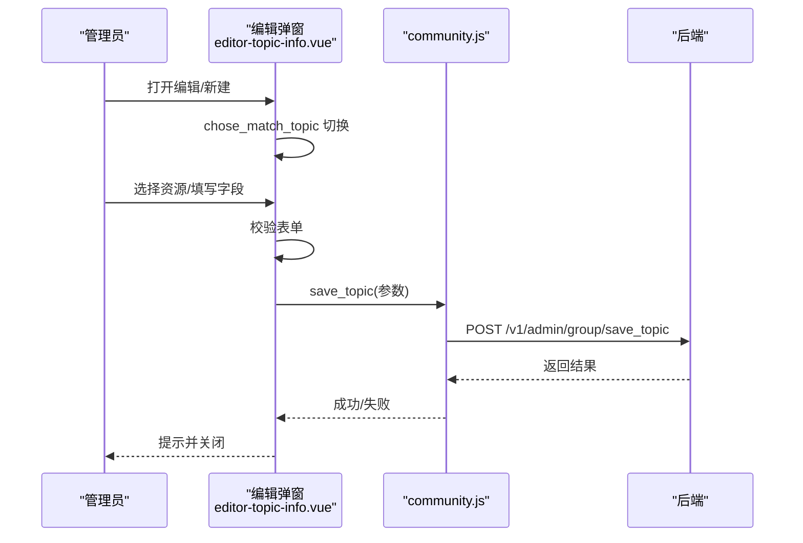
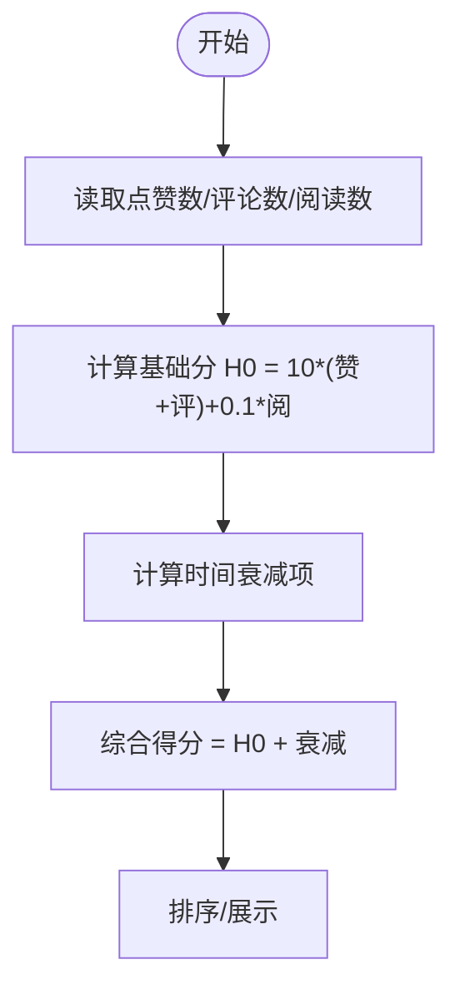
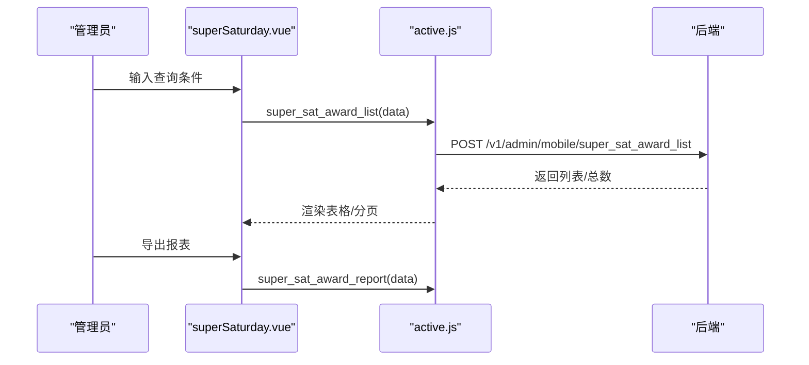
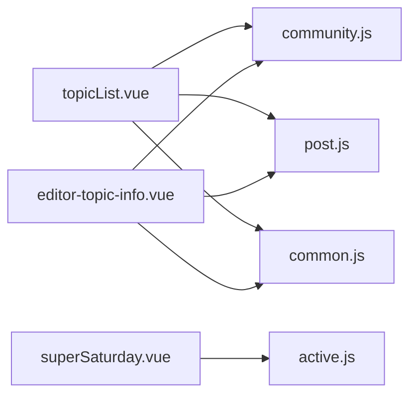

# 热门话题管理

<cite>
**本文引用的文件**
- [topicList.vue](file://src/views/forum/topicList.vue)
- [community.js](file://src/api/community.js)
- [editor-topic-info.vue](file://src/views/forum/components/topic-list/editor-topic-info.vue)
- [post.js](file://src/utils/dict/post.js)
- [common.js](file://src/utils/dict/common.js)
- [active.js](file://src/api/active.js)
- [superSaturday.vue](file://src/views/active/superSaturday.vue)
- [intelligence.vue](file://src/views/intelligence/intelligence.vue)
- [active.js（论坛路由）](file://src/router/children/forum/active.js)
- [public/mqttMsg.md](file://public/mqttMsg.md)
</cite>

## 目录
1. [简介](#简介)
2. [项目结构](#项目结构)
3. [核心组件](#核心组件)
4. [架构总览](#架构总览)
5. [详细组件分析](#详细组件分析)
6. [依赖关系分析](#依赖关系分析)
7. [性能考量](#性能考量)
8. [故障排查指南](#故障排查指南)
9. [结论](#结论)
10. [附录](#附录)

## 简介
本技术文档围绕“热门话题管理”功能展开，覆盖热门话题的创建、编辑、删除与展示；解释热度计算与排序机制；梳理话题的分类与标签体系；说明置顶、推荐、屏蔽等运营能力；并结合“超级星期六”等特殊活动，给出最佳实践与运维建议。文档同时提供代码级流程图与配置说明，帮助开发者快速落地“智能推荐与热度排序”。

## 项目结构
热门话题管理主要由以下模块构成：
- 视图层：热门话题列表页与编辑弹窗
- API 层：社区相关接口（列表、详情、保存、排序）
- 字典与配置：话题状态、置顶类型、来源映射等
- 特殊活动：超级星期六活动页与接口
- 实时消息：话题相关 MQTT 主题

图表来源
- [topicList.vue:150-156](file://src/views/forum/topicList.vue#L150-L156)
- [community.js:455-494](file://src/api/community.js#L455-L494)
- [editor-topic-info.vue:167-169](file://src/views/forum/components/topic-list/editor-topic-info.vue#L167-L169)
- [post.js:144-148](file://src/utils/dict/post.js#L144-L148)
- [common.js:664-670](file://src/utils/dict/common.js#L664-L670)
- [active.js:1-49](file://src/api/active.js#L1-L49)
- [superSaturday.vue:67-72](file://src/views/active/superSaturday.vue#L67-L72)
- [public/mqttMsg.md:75-76](file://public/mqttMsg.md#L75-L76)

章节来源
- [topicList.vue:150-156](file://src/views/forum/topicList.vue#L150-L156)
- [community.js:455-494](file://src/api/community.js#L455-L494)
- [editor-topic-info.vue:167-169](file://src/views/forum/components/topic-list/editor-topic-info.vue#L167-L169)
- [post.js:144-148](file://src/utils/dict/post.js#L144-L148)
- [common.js:664-670](file://src/utils/dict/common.js#L664-L670)
- [active.js:1-49](file://src/api/active.js#L1-L49)
- [superSaturday.vue:67-72](file://src/views/active/superSaturday.vue#L67-L72)
- [public/mqttMsg.md:75-76](file://public/mqttMsg.md#L75-L76)

## 核心组件
- 热门话题列表页：支持按状态、是否为比赛话题、时间范围等筛选，支持排序变更与批量操作。
- 编辑弹窗：支持新增/编辑比赛类或非比赛类话题，配置颜色、排序、上下架时间、关联资源等。
- 社区接口封装：提供列表、详情、保存、排序、评论列表等接口。
- 字典与配置：话题状态、置顶类型、来源映射、跳转类型等。

章节来源
- [topicList.vue:175-307](file://src/views/forum/topicList.vue#L175-L307)
- [editor-topic-info.vue:174-451](file://src/views/forum/components/topic-list/editor-topic-info.vue#L174-L451)
- [community.js:455-494](file://src/api/community.js#L455-L494)
- [post.js:144-148](file://src/utils/dict/post.js#L144-L148)
- [common.js:664-670](file://src/utils/dict/common.js#L664-L670)

## 架构总览
下图展示了热门话题管理的前后端交互与关键数据流：

图表来源
- [topicList.vue:226-307](file://src/views/forum/topicList.vue#L226-L307)
- [community.js:455-461](file://src/api/community.js#L455-L461)

章节来源
- [topicList.vue:226-307](file://src/views/forum/topicList.vue#L226-L307)
- [community.js:455-461](file://src/api/community.js#L455-L461)

## 详细组件分析

### 热门话题列表页（topicList.vue）
- 功能要点
  - 支持通过 newMySearch 传递搜索条件，自动处理 sport_id/game_id、topic_status、isMatch 等字段映射。
  - 支持排序变更（sort-change），并持久化排序条件。
  - 支持编辑话题排序（update_topic_order）。
  - 展示字段：ID、主题色、标题、帖子数量、上下架时间、额外信息（比赛/非比赛）、排序。
- 关键逻辑
  - 列表加载：getList(obj) 统一处理来自搜索组件的数据，并调用 topic_list。
  - 状态筛选：根据 topic_status 自动注入 start_time__gt/end_time__lt 等条件。
  - 排序：sortChange 与 tableOrderbyCond 组合，更新查询参数并刷新。
  - 排序变更：topicOrderChange 调用 update_topic_order 并提示结果。

图表来源
- [topicList.vue:226-316](file://src/views/forum/topicList.vue#L226-L316)
- [community.js:455-461](file://src/api/community.js#L455-L461)

章节来源
- [topicList.vue:226-316](file://src/views/forum/topicList.vue#L226-L316)
- [community.js:455-461](file://src/api/community.js#L455-L461)

### 编辑弹窗（editor-topic-info.vue）
- 功能要点
  - 新增/编辑两种模式，支持比赛类与非比赛类话题。
  - 比赛类：选择运动类型、电竞类型、比赛，自动填充队伍、赛事、颜色等。
  - 非比赛类：填写标题、概述、LOGO、分享标题/概述/LOGO，绑定圈子。
  - 时间选择：上架/下架时间，统一转换为秒级时间戳。
  - 保存：调用 save_topic，区分比赛/非比赛字段。
- 关键逻辑
  - chose_match_topic 控制表单字段显隐。
  - setData 设置选择的资源（比赛或圈子）。
  - confirm 校验表单，构造参数并调用 save_topic。

图表来源
- [editor-topic-info.vue:228-286](file://src/views/forum/components/topic-list/editor-topic-info.vue#L228-L286)
- [community.js:488-494](file://src/api/community.js#L488-L494)

章节来源
- [editor-topic-info.vue:228-286](file://src/views/forum/components/topic-list/editor-topic-info.vue#L228-L286)
- [community.js:488-494](file://src/api/community.js#L488-L494)

### 热度计算与排序机制
- 热度计算（来自智能内容模块）
  - 热榜公式：H0 = 10 × (点赞数 + 评论数) + 0.1 × 阅读数
  - 计算步骤：以发布时间为基准，计算时间衰减项，最终得到综合分数
- 排序与展示
  - 列表页支持排序变更（sort-change），并持久化排序条件
  - 编辑页支持手动调整排序值（order），用于人工干预

图表来源
- [intelligence.vue:1134-1143](file://src/views/intelligence/intelligence.vue#L1134-L1143)

章节来源
- [intelligence.vue:1134-1143](file://src/views/intelligence/intelligence.vue#L1134-L1143)

### 分类与标签系统
- 话题状态
  - 未上架、上架中、已下架（postHotTopicType）
- 圈子置顶类型
  - 帖子、热门话题、专题（groupCircleTopType）
- 来源映射
  - 热门话题来源映射（speechRecordSource）

章节来源
- [post.js:144-148](file://src/utils/dict/post.js#L144-L148)
- [post.js:174-178](file://src/utils/dict/post.js#L174-L178)
- [common.js:664-670](file://src/utils/dict/common.js#L664-L670)

### 置顶、推荐、屏蔽
- 置顶类型
  - 圈子置顶类型包含“热门话题”，可用于首页或频道置顶
- 推荐
  - 可通过编辑弹窗设置话题的排序 order，实现人工推荐
- 屏蔽
  - 举报来源映射包含“热门话题”，便于后续封禁/屏蔽处理

章节来源
- [post.js:174-178](file://src/utils/dict/post.js#L174-L178)
- [common.js:664-670](file://src/utils/dict/common.js#L664-L670)
- [common.js:672-681](file://src/utils/dict/common.js#L672-L681)

### 特殊活动：超级星期六
- 活动页
  - 支持按时间范围、用户ID、奖品ID、期号等条件检索中奖记录
  - 支持导出报表与重置查询
- 接口
  - super_sat_award_list：查询中奖记录
  - super_sat_award_report：导出报表

图表来源
- [superSaturday.vue:133-149](file://src/views/active/superSaturday.vue#L133-L149)
- [active.js:4-18](file://src/api/active.js#L4-L18)

章节来源
- [superSaturday.vue:133-149](file://src/views/active/superSaturday.vue#L133-L149)
- [active.js:4-18](file://src/api/active.js#L4-L18)

### 实时消息与话题联动
- 话题相关 MQTT 主题
  - group/topic/{topic_id}：话题发言
  - news/topic/{topic_id}：资讯专题发言
- 应用场景
  - 实时监控话题讨论热度与异常发言
  - 与内容安全/举报联动，触发屏蔽/封禁

章节来源
- [public/mqttMsg.md:75-76](file://public/mqttMsg.md#L75-L76)

## 依赖关系分析
- 组件耦合
  - topicList.vue 依赖 community.js 的 topic_list/update_topic_order
  - editor-topic-info.vue 依赖 community.js 的 save_topic
  - 字典模块（post.js、common.js）被列表与编辑组件共同引用
- 外部依赖
  - 后端接口：/v1/admin/group/*
  - 特殊活动接口：/v1/admin/mobile/*

图表来源
- [topicList.vue:150-156](file://src/views/forum/topicList.vue#L150-L156)
- [editor-topic-info.vue:167-169](file://src/views/forum/components/topic-list/editor-topic-info.vue#L167-L169)
- [post.js:144-148](file://src/utils/dict/post.js#L144-L148)
- [common.js:664-670](file://src/utils/dict/common.js#L664-L670)
- [superSaturday.vue:67-72](file://src/views/active/superSaturday.vue#L67-L72)
- [active.js:1-49](file://src/api/active.js#L1-L49)

章节来源
- [topicList.vue:150-156](file://src/views/forum/topicList.vue#L150-L156)
- [editor-topic-info.vue:167-169](file://src/views/forum/components/topic-list/editor-topic-info.vue#L167-L169)
- [post.js:144-148](file://src/utils/dict/post.js#L144-L148)
- [common.js:664-670](file://src/utils/dict/common.js#L664-L670)
- [superSaturday.vue:67-72](file://src/views/active/superSaturday.vue#L67-L72)
- [active.js:1-49](file://src/api/active.js#L1-L49)

## 性能考量
- 列表查询优化
  - 使用分页参数 limit/page 控制数据量
  - 合理使用排序条件，避免重复请求
- 排序与缓存
  - 对热点话题可考虑本地缓存排序结果，减少重复请求
- 实时监控
  - 结合 MQTT 主题进行增量更新，降低轮询成本

## 故障排查指南
- 列表为空或总数为 0
  - 检查查询条件是否包含 topic_status/isMatch 的时间过滤
  - 确认后端接口返回码与数据结构
- 排序无效
  - 确认 sortChange 是否正确更新 orderby_cond
  - 检查后端是否支持该排序字段
- 保存失败
  - 检查表单校验与字段映射（比赛/非比赛）
  - 确认时间戳转换与必填字段

章节来源
- [topicList.vue:256-276](file://src/views/forum/topicList.vue#L256-L276)
- [editor-topic-info.vue:228-286](file://src/views/forum/components/topic-list/editor-topic-info.vue#L228-L286)

## 结论
热门话题管理通过“列表页 + 编辑弹窗 + 社区接口封装”的清晰分层，实现了从创建、编辑、排序到展示的完整闭环。结合热度计算与排序机制，可有效提升用户参与度与内容传播效率。配合置顶、推荐与屏蔽等运营能力，以及“超级星期六”等特殊活动，能够形成完整的运营策略体系。建议在实际部署中关注查询性能、排序一致性与实时监控联动，确保系统稳定与体验流畅。

## 附录
- 热门话题状态枚举（postHotTopicType）
  - 未上架、上架中、已下架
- 圈子置顶类型（groupCircleTopType）
  - 帖子、热门话题、专题
- 来源映射（speechRecordSource）
  - 热门话题来源标识，便于审计与封禁

章节来源
- [post.js:144-148](file://src/utils/dict/post.js#L144-L148)
- [post.js:174-178](file://src/utils/dict/post.js#L174-L178)
- [common.js:664-670](file://src/utils/dict/common.js#L664-L670)