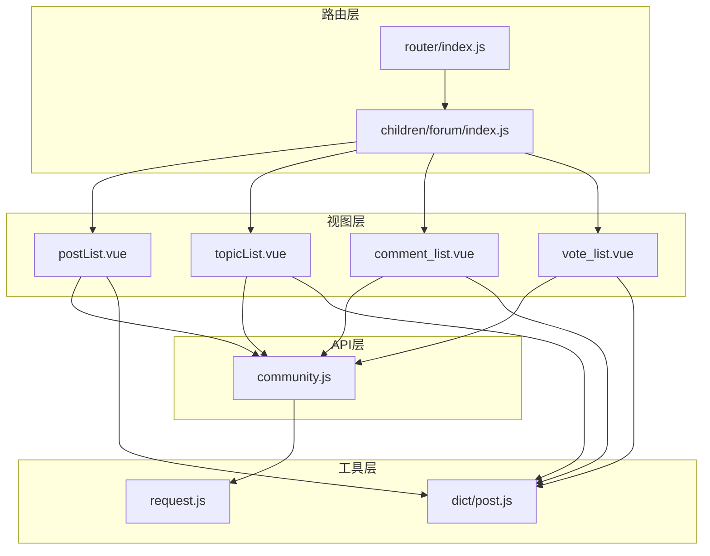
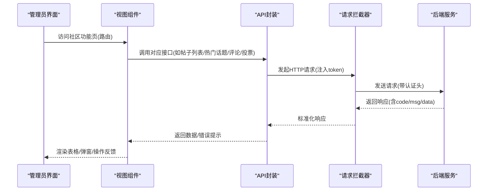
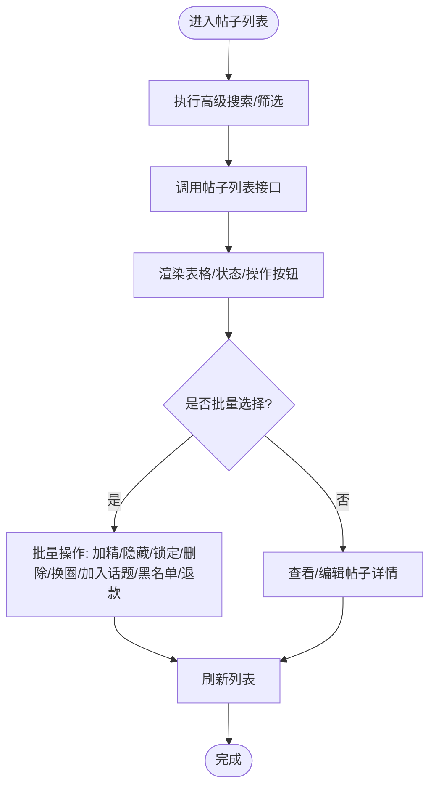
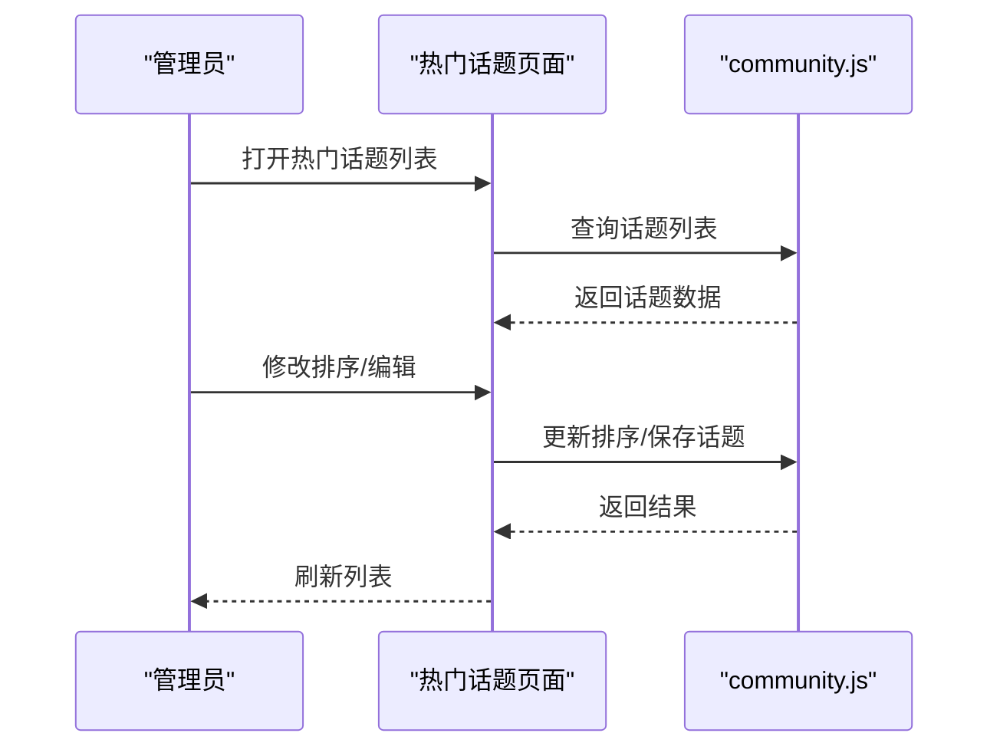
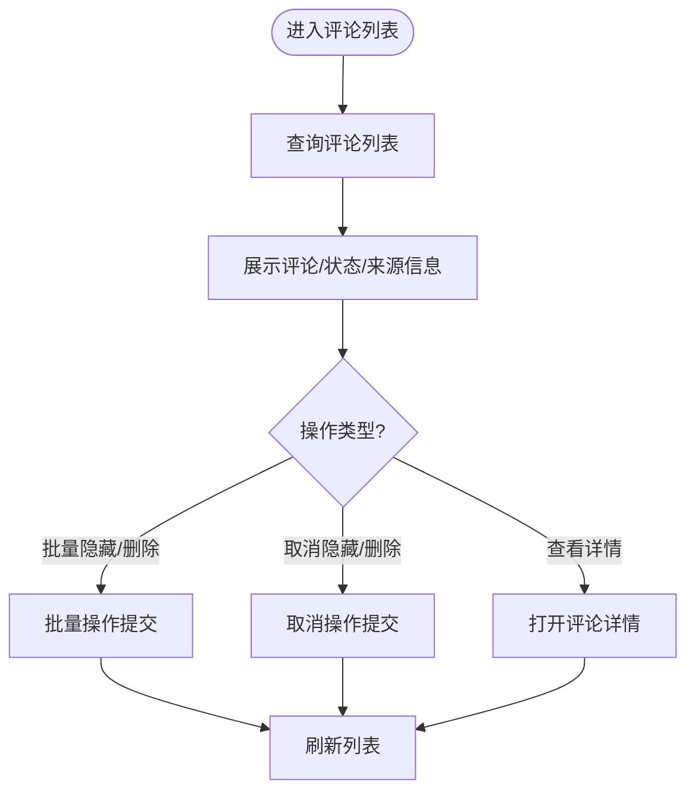
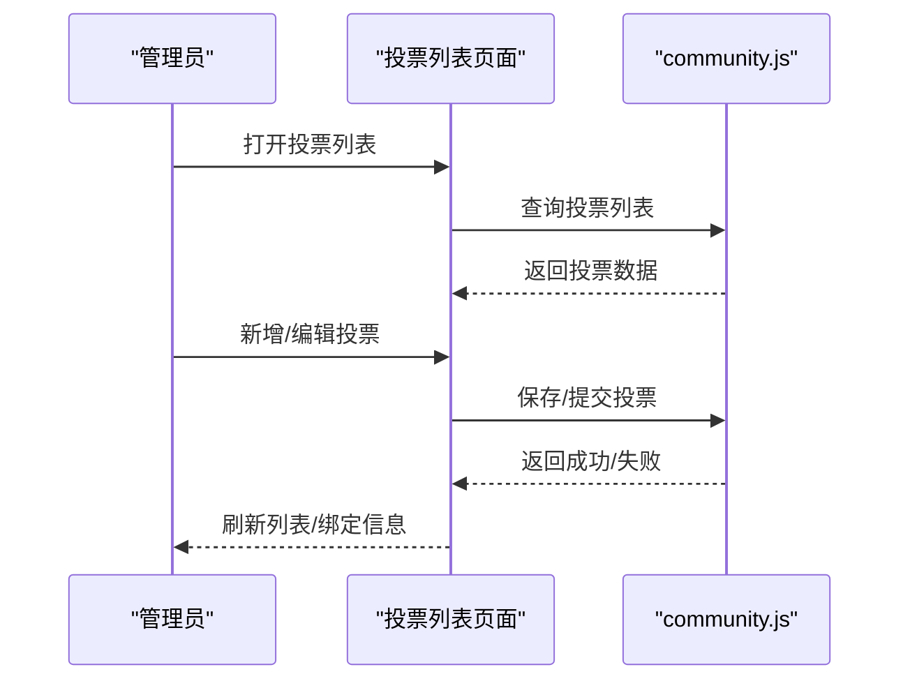
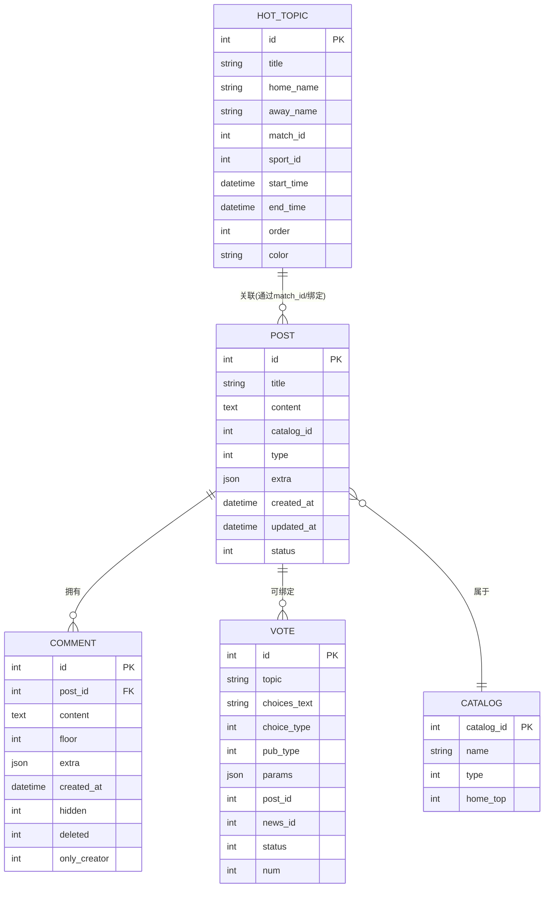
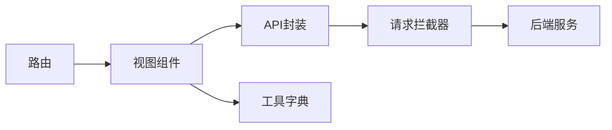

# 社区内容管理

<cite>
**本文引用的文件**
- [community.js](file://src/api/community.js)
- [request.js](file://src/utils/request.js)
- [post.js](file://src/store/modules/post.js)
- [forum/index.js](file://src/router/children/forum/index.js)
- [router/index.js](file://src/router/index.js)
- [postList.vue](file://src/views/forum/postList.vue)
- [topicList.vue](file://src/views/forum/topicList.vue)
- [comment_list.vue](file://src/views/forum/comment_list.vue)
- [vote_list.vue](file://src/views/forum/vote_list.vue)
- [post.js(dict)](file://src/utils/dict/post.js)
</cite>

## 目录
1. [引言](#引言)
2. [项目结构](#项目结构)
3. [核心组件](#核心组件)
4. [架构总览](#架构总览)
5. [详细组件分析](#详细组件分析)
6. [依赖分析](#依赖分析)
7. [性能考虑](#性能考虑)
8. [故障排查指南](#故障排查指南)
9. [结论](#结论)
10. [附录](#附录)

## 引言
本技术文档围绕社区内容管理功能，系统梳理帖子列表管理、热门话题管理、评论管理、投票管理等核心模块，阐述数据模型与业务流程，覆盖发布流程、分类机制、标签系统、权限控制、搜索与筛选、以及最佳实践与运维建议。文档以仓库现有实现为依据，结合前端路由、API 定义、视图组件与工具字典，帮助读者快速理解与落地。

## 项目结构
社区内容管理相关能力由“路由-视图-API-工具”四层构成：
- 路由层：定义社区模块入口与各功能页面的访问权限与角色标识
- 视图层：提供帖子列表、热门话题、评论、投票等页面的交互与数据展示
- API 层：封装与后端交互的统一方法，涵盖帖子、评论、投票、话题、权限、报表等接口
- 工具层：提供字典、搜索配置、格式化工具等支撑能力

图表来源
- [router/index.js:1-177](file://src/router/index.js#L1-L177)
- [forum/index.js:1-230](file://src/router/children/forum/index.js#L1-L230)
- [postList.vue:1-200](file://src/views/forum/postList.vue#L1-L200)
- [topicList.vue:1-200](file://src/views/forum/topicList.vue#L1-L200)
- [comment_list.vue:1-200](file://src/views/forum/comment_list.vue#L1-L200)
- [vote_list.vue:1-183](file://src/views/forum/vote_list.vue#L1-L183)
- [community.js:1-676](file://src/api/community.js#L1-L676)
- [request.js:1-130](file://src/utils/request.js#L1-L130)
- [post.js(dict):1-200](file://src/utils/dict/post.js#L1-L200)

章节来源
- [router/index.js:1-177](file://src/router/index.js#L1-L177)
- [forum/index.js:1-230](file://src/router/children/forum/index.js#L1-L230)

## 核心组件
- 路由与权限
  - 社区模块路由集中于 forum 子路由，每个页面通过 meta.roles 指定所需权限点，如帖子列表、热门话题、评论列表、投票列表、敏感词、举报、禁言、周卡等
  - 根路由将 forum 作为侧边栏菜单项，统一挂载
- API 与接口
  - 统一通过 community.js 导出的函数封装请求，涵盖帖子列表/详情、加精/隐藏/锁定/删除、评论列表/新增/删除/隐藏、投票列表/详情/成员、话题列表/详情/评论/排序、圈子/分类/首页置顶、周卡报表等
  - 请求通过 request.js 统一拦截器处理 token 注入、错误提示与异常响应
- 视图组件
  - 帖子列表：支持高级搜索、批量操作、导出、排序、换圈、加入话题、推荐黑名单、退款等
  - 热门话题：支持排序调整、编辑、匹配信息展示
  - 评论列表：支持批量隐藏/删除、查看详情、跳转帖子
  - 投票列表：支持查看投票详情、绑定帖子/资讯、红包信息、状态与参与人数

章节来源
- [forum/index.js:1-230](file://src/router/children/forum/index.js#L1-L230)
- [community.js:1-676](file://src/api/community.js#L1-L676)
- [request.js:1-130](file://src/utils/request.js#L1-L130)
- [postList.vue:1-200](file://src/views/forum/postList.vue#L1-L200)
- [topicList.vue:1-200](file://src/views/forum/topicList.vue#L1-L200)
- [comment_list.vue:1-200](file://src/views/forum/comment_list.vue#L1-L200)
- [vote_list.vue:1-183](file://src/views/forum/vote_list.vue#L1-L183)

## 架构总览
社区内容管理采用“前端路由 + 统一 API 封装 + 视图组件”的分层设计，配合工具字典与全局请求拦截器，形成清晰的职责边界与扩展路径。

图表来源
- [router/index.js:1-177](file://src/router/index.js#L1-L177)
- [forum/index.js:1-230](file://src/router/children/forum/index.js#L1-L230)
- [community.js:1-676](file://src/api/community.js#L1-L676)
- [request.js:1-130](file://src/utils/request.js#L1-L130)

## 详细组件分析

### 帖子列表管理
- 功能要点
  - 高级搜索：支持关键词、UID、版块、类型、时间范围、平台等多维筛选
  - 批量操作：加精、隐藏、锁定、删除、取消、换圈、加入话题、推荐黑名单、批量退款
  - 数据展示：帖子ID、作者、版块、标题、内容摘要、图片、发布时间、状态、来源地、渠道等
  - 导出与报表：支持导出 Excel、查看粉丝趋势等
- 关键实现
  - 路由权限：meta.roles 包含 group_post_list 等
  - API 调用：使用帖子列表、详情、加精/隐藏/锁定/删除、换圈、加入话题、退款等接口
  - 工具字典：版块映射、帖子类型、周卡相关枚举用于渲染与筛选
- 处理流程

图表来源
- [postList.vue:1-200](file://src/views/forum/postList.vue#L1-L200)
- [forum/index.js:1-230](file://src/router/children/forum/index.js#L1-L230)
- [community.js:1-676](file://src/api/community.js#L1-L676)
- [post.js(dict):1-200](file://src/utils/dict/post.js#L1-L200)

章节来源
- [postList.vue:1-200](file://src/views/forum/postList.vue#L1-L200)
- [forum/index.js:1-230](file://src/router/children/forum/index.js#L1-L230)
- [community.js:1-676](file://src/api/community.js#L1-L676)
- [post.js(dict):1-200](file://src/utils/dict/post.js#L1-L200)

### 热门话题管理
- 功能要点
  - 列表展示：ID、主题色、标题、帖子数量、上下架时间、额外信息（比赛/专题）、排序
  - 排序调整：支持按 order 字段调整热门话题顺序
  - 编辑与绑定：支持新增/编辑、绑定至帖子或专题
- 关键实现
  - 路由权限：meta.roles 包含 group_topic_list
  - API 调用：话题列表、详情、评论、排序更新、保存
- 处理流程

图表来源
- [topicList.vue:1-200](file://src/views/forum/topicList.vue#L1-L200)
- [community.js:454-494](file://src/api/community.js#L454-L494)

章节来源
- [topicList.vue:1-200](file://src/views/forum/topicList.vue#L1-L200)
- [community.js:454-494](file://src/api/community.js#L454-L494)

### 评论管理
- 功能要点
  - 评论列表：支持批量隐藏/删除、取消隐藏/删除、查看详情、跳转帖子
  - 评论状态：隐藏/删除/正常三种状态可视化标记
  - 归属地与渠道：IP、位置、平台图标、渠道信息
- 关键实现
  - 路由权限：meta.roles 包含 group_comment_list
  - API 调用：评论列表、保存评论、删除/隐藏评论、评论详情
- 处理流程

图表来源
- [comment_list.vue:1-200](file://src/views/forum/comment_list.vue#L1-L200)
- [community.js:81-141](file://src/api/community.js#L81-L141)

章节来源
- [comment_list.vue:1-200](file://src/views/forum/comment_list.vue#L1-L200)
- [community.js:81-141](file://src/api/community.js#L81-L141)

### 投票管理
- 功能要点
  - 投票列表：展示投票ID、创建时间、类型、公布类型、红包、绑定帖子/资讯、话题内容、选项、状态、参与人数
  - 编辑与绑定：支持新增/编辑投票、绑定帖子/资讯、查看红包信息
- 关键实现
  - 路由权限：meta.roles 包含 group_vote_list
  - API 调用：投票列表、详情、成员、保存/提交投票、更新票数、统计/记录
  - 字典：投票类型、公布类型、选项与展示
- 处理流程

图表来源
- [vote_list.vue:1-183](file://src/views/forum/vote_list.vue#L1-L183)
- [community.js:399-431](file://src/api/community.js#L399-L431)
- [post.js(dict):149-159](file://src/utils/dict/post.js#L149-L159)

章节来源
- [vote_list.vue:1-183](file://src/views/forum/vote_list.vue#L1-L183)
- [community.js:399-431](file://src/api/community.js#L399-L431)
- [post.js(dict):149-159](file://src/utils/dict/post.js#L149-L159)

### 数据模型与关系
- 实体与字段概览
  - 帖子(Post)
    - 关键字段：id、title、content、catalog_id、type、extra、created_at、updated_at、status
    - 关联：作者、版块、投票、评论、周卡/付费贴等
  - 评论(Comment)
    - 关键字段：id、post_id、content、floor、extra、created_at、hidden、deleted、only_creator
    - 关联：帖子、作者、版块
  - 投票(Vote)
    - 关键字段：id、topic、choices_text、choice_type、pub_type、params、post_id、news_id、status、num
    - 关联：帖子、资讯、红包
  - 热门话题(Hot Topic)
    - 关键字段：id、title、home_name、away_name、match_id、sport_id、start_time、end_time、order、color
    - 关联：比赛信息、帖子
  - 版块/圈子(Catalog)
    - 关键字段：catalog_id、name、type、home_top
    - 关联：帖子、热门话题、首页置顶
- 关系示意

图表来源
- [community.js:1-676](file://src/api/community.js#L1-L676)
- [post.js(dict):167-178](file://src/utils/dict/post.js#L167-L178)

章节来源
- [community.js:1-676](file://src/api/community.js#L1-L676)
- [post.js(dict):167-178](file://src/utils/dict/post.js#L167-L178)

### 权限控制与角色
- 路由级权限
  - 社区模块统一声明多个角色点，如 group_post_list、group_comment_list、group_vote_list、group_topic_list、group_sensitive_word_list、group_report_list、group_bans_log_list、group_interactive_user_list、group_tipping_user_list、group_interact_week_card_purchase_list 等
  - 页面 meta.roles 对应具体功能的最小权限集合
- 操作级权限
  - 视图组件根据 hasPwer(...) 判断按钮显隐与可用性，如批量加精/隐藏/锁定/删除、换圈、加入话题、编辑敏感词、导出等

章节来源
- [forum/index.js:1-230](file://src/router/children/forum/index.js#L1-L230)
- [postList.vue:155-175](file://src/views/forum/postList.vue#L155-L175)
- [comment_list.vue:78-83](file://src/views/forum/comment_list.vue#L78-L83)
- [vote_list.vue:144-179](file://src/views/forum/vote_list.vue#L144-L179)

### 搜索与筛选
- 搜索组件
  - 使用 newMySearch 组件提供统一的搜索入口，支持历史记录、自定义参数透传、默认数据与重置
- 帖子列表搜索
  - 支持帖子ID、UID、版块、类型、标题/内容关键词、平台、时间范围等
- 评论列表搜索
  - 支持评论ID、帖子ID、用户、内容、时间范围、平台等
- 投票列表搜索
  - 支持投票ID、创建时间、类型、公布类型、红包、绑定状态、参与人数等
- 工具字典
  - 版块映射、帖子类型、投票类型/公布类型、周卡场景/状态/方式等

章节来源
- [postList.vue:114-154](file://src/views/forum/postList.vue#L114-L154)
- [comment_list.vue:66-84](file://src/views/forum/comment_list.vue#L66-L84)
- [vote_list.vue:16-20](file://src/views/forum/vote_list.vue#L16-L20)
- [post.js(dict):54-114](file://src/utils/dict/post.js#L54-L114)

### 发布流程与分类机制
- 发布流程
  - 作者在客户端发布帖子 → 帖子进入待审/直接上线 → 管理员通过帖子列表进行加精/隐藏/锁定/删除/换圈/加入话题等操作
- 分类机制
  - 版块/圈子类型：球队、彩民、兴趣；首页置顶类型：帖子、热门话题、专题
  - 版块映射：通过字典 getCatalogs() 生成 catalog_id -> 名称/类型/颜色 的映射，用于渲染与筛选
- 标签系统
  - 帖子类型：普通、互动、付费、视频、付费视频等；周卡/付费贴价格与分成策略由字典提供

章节来源
- [forum/index.js:165-229](file://src/router/children/forum/index.js#L165-L229)
- [post.js(dict):167-178](file://src/utils/dict/post.js#L167-L178)
- [post.js(dict):28-89](file://src/utils/dict/post.js#L28-L89)

### 最佳实践
- 内容质量控制
  - 使用敏感词管理与机器审核功能，结合举报与禁言记录，建立闭环
  - 对违规内容采取隐藏/删除/禁言等措施，并记录操作日志
- 用户行为监控
  - 通过互动权限、打赏权限、周卡消费等维度观察用户行为，识别高价值/高风险用户
- 社区氛围维护
  - 合理使用加精、热门话题、换圈等手段引导优质内容曝光
  - 定期清理违规与低质内容，保持版块健康生态

章节来源
- [forum/index.js:77-162](file://src/router/children/forum/index.js#L77-L162)
- [community.js:286-308](file://src/api/community.js#L286-L308)
- [community.js:353-375](file://src/api/community.js#L353-L375)

## 依赖分析
- 组件耦合
  - 视图组件依赖 API 封装与工具字典，API 封装依赖请求拦截器
  - 路由层通过 meta.roles 与视图组件形成松耦合的权限控制
- 外部依赖
  - axios 作为 HTTP 客户端，request.js 提供统一拦截器与错误提示
- 潜在风险
  - 批量操作需谨慎，建议增加二次确认与操作日志
  - 搜索参数需严格校验，避免无效请求导致性能问题

图表来源
- [community.js:1-676](file://src/api/community.js#L1-L676)
- [request.js:1-130](file://src/utils/request.js#L1-L130)
- [post.js(dict):1-200](file://src/utils/dict/post.js#L1-L200)
- [router/index.js:1-177](file://src/router/index.js#L1-L177)

章节来源
- [community.js:1-676](file://src/api/community.js#L1-L676)
- [request.js:1-130](file://src/utils/request.js#L1-L130)
- [post.js(dict):1-200](file://src/utils/dict/post.js#L1-L200)
- [router/index.js:1-177](file://src/router/index.js#L1-L177)

## 性能考虑
- 列表加载
  - 合理设置分页大小与排序字段，避免一次性拉取过多数据
  - 使用 loading 状态与骨架屏提升用户体验
- 搜索优化
  - 对关键词与时间范围进行必要校验，减少无效请求
  - 使用缓存与本地存储（如版块映射）降低重复计算
- 批量操作
  - 批量隐藏/删除前进行二次确认，避免误操作
  - 对长列表进行虚拟滚动或分页加载

## 故障排查指南
- 常见错误与定位
  - 401 未授权：检查 token 是否注入与过期，确认登录状态
  - 403 拒绝访问：核对 meta.roles 与用户角色权限
  - 404 接口不存在：核对 API 路径与后端接口是否存在
  - 500/502/504：服务异常或网关超时，检查后端日志与网络连通性
- 统一提示
  - request.js 已内置错误消息提示与状态码映射，便于快速定位问题

章节来源
- [request.js:46-127](file://src/utils/request.js#L46-L127)

## 结论
本项目围绕社区内容管理构建了完善的前端能力体系：清晰的路由与权限控制、统一的 API 封装、丰富的视图组件与工具字典，覆盖帖子、评论、投票、热门话题、权限与报表等核心场景。通过合理的搜索与筛选、批量操作与日志记录，能够有效保障内容质量与社区氛围。建议在后续迭代中进一步完善权限审计、操作回滚与自动化监控，持续提升运营效率与稳定性。

## 附录
- 常用接口清单（节选）
  - 帖子：列表、详情、加精/隐藏/锁定/删除、换圈、加入话题、退款
  - 评论：列表、保存、删除/隐藏、详情
  - 投票：列表、详情、成员、保存/提交、更新票数、统计/记录
  - 热门话题：列表、详情、评论、排序更新、保存
  - 圈子/分类/首页置顶：列表、详情、保存、首页置顶、保存首页置顶
- 常用字典（节选）
  - 版块映射、帖子类型、投票类型/公布类型、周卡场景/状态/方式、举报类型、圈子类型/置顶类型等

章节来源
- [community.js:1-676](file://src/api/community.js#L1-L676)
- [post.js(dict):1-200](file://src/utils/dict/post.js#L1-L200)