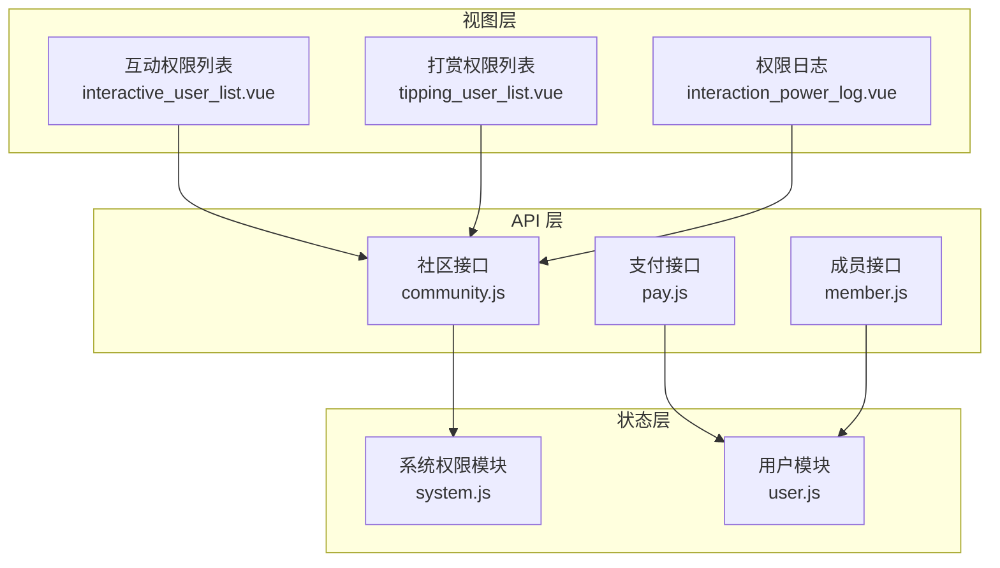
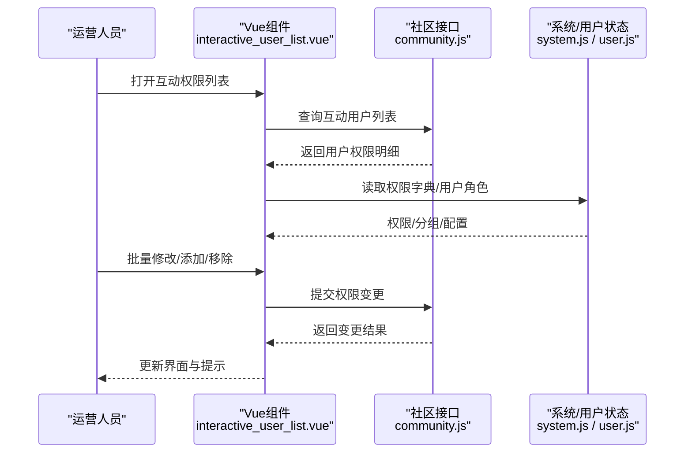
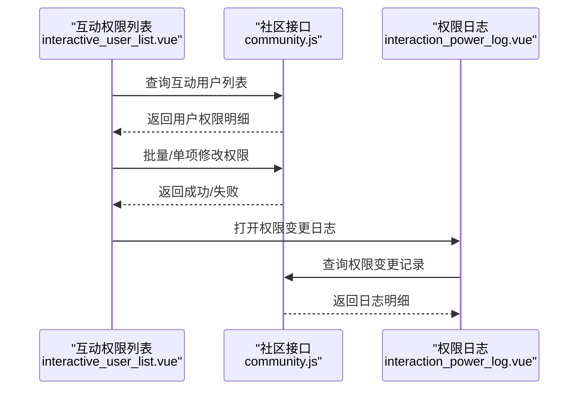
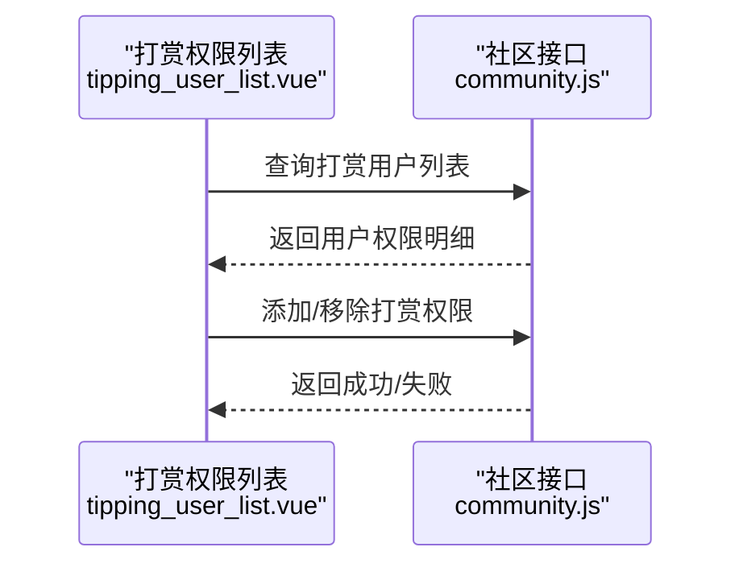
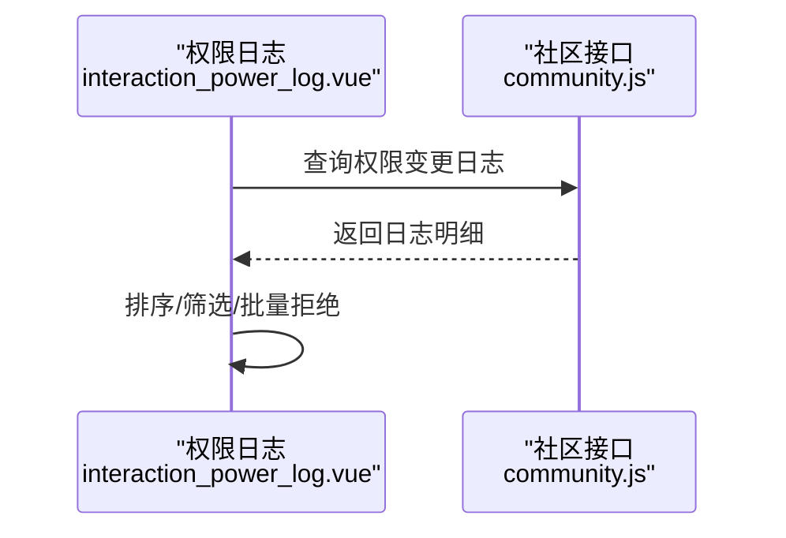
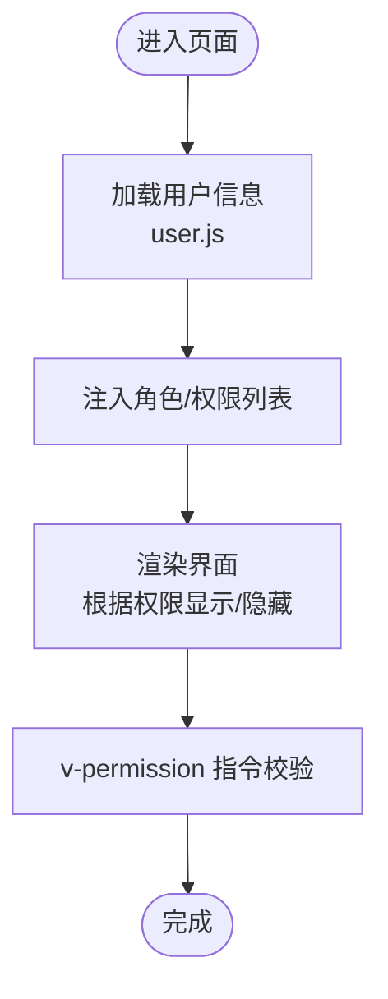
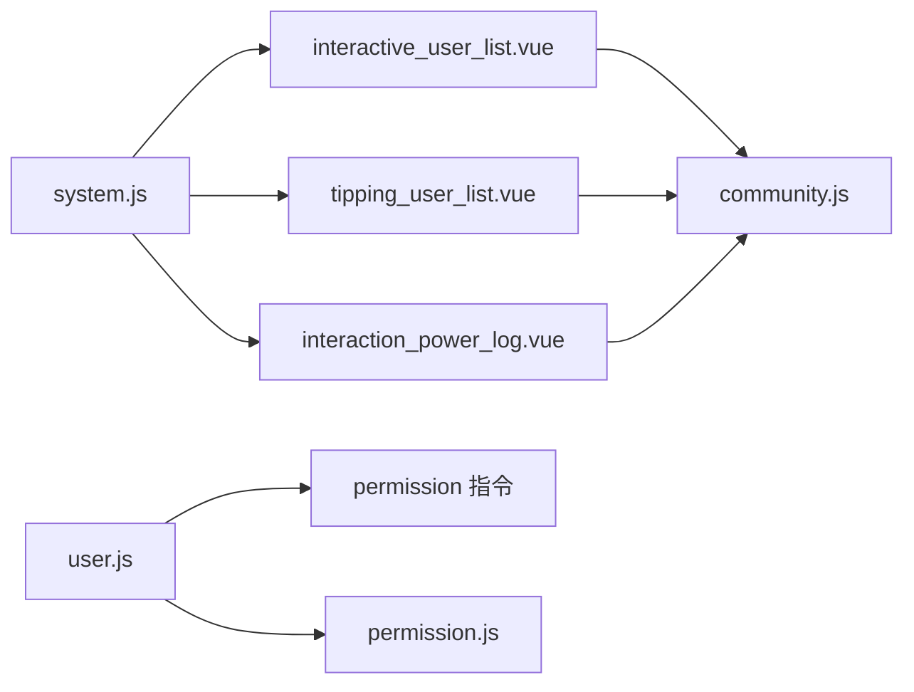

# 社区权限管理

<cite>
**本文引用的文件**
- [community.js](file://src/api/community.js)
- [pay.js](file://src/api/pay.js)
- [member.js](file://src/api/member.js)
- [system.js](file://src/store/modules/system.js)
- [user.js](file://src/store/modules/user.js)
- [interaction_power_log.vue](file://src/views/forum/interaction_power_log.vue)
- [interactive_user_list.vue](file://src/views/forum/interactive_user_list.vue)
- [tipping_user_list.vue](file://src/views/forum/tipping_user_list.vue)
- [permission.js](file://src/utils/permission.js)
- [permission 指令](file://src/directive/permission/permission.js)
- [工具函数](file://src/utils/tool.js)
- [字典-通用](file://src/utils/dict/common.js)
- [字典-帖子](file://src/utils/dict/post.js)
- [字典-用户](file://src/utils/dict/user.js)
</cite>

## 目录
1. [简介](#简介)
2. [项目结构](#项目结构)
3. [核心组件](#核心组件)
4. [架构总览](#架构总览)
5. [详细组件分析](#详细组件分析)
6. [依赖关系分析](#依赖关系分析)
7. [性能考量](#性能考量)
8. [故障排查指南](#故障排查指南)
9. [结论](#结论)
10. [附录](#附录)

## 简介
本技术文档围绕社区权限管理体系展开，重点覆盖以下方面：
- 互动权限管理：用户互动能力授权、权限等级与有效期、批量与单项配置、日志审计与可视化。
- 付费权限系统：付费帖、视频帖、付费评论等付费能力的配置与生效。
- 打赏权限：打赏功能开关、金额限制、收益分配与权限下发。
- 权限日志：权限变更历史、操作审计、异常行为监控与报表。
- 最佳实践：权限分级设计、用户体验优化、安全风险控制策略。

文档以代码为依据，结合前端组件、API 接口与状态管理模块，给出架构图、流程图与最佳实践建议，帮助读者快速理解并落地灵活可控的社区权限体系。

## 项目结构
社区权限管理由三层构成：
- 视图层（Vue 组件）：负责交互与数据展示，如互动权限列表、打赏权限列表、权限日志等。
- API 层（接口封装）：统一管理社区、支付、成员等模块的后端接口。
- 状态层（Vuex Store）：维护权限集合、用户角色、用户组与全局配置。

图表来源
- [interactive_user_list.vue:1-559](file://src/views/forum/interactive_user_list.vue#L1-L559)
- [tipping_user_list.vue:1-270](file://src/views/forum/tipping_user_list.vue#L1-L270)
- [interaction_power_log.vue:1-294](file://src/views/forum/interaction_power_log.vue#L1-L294)
- [community.js:1-676](file://src/api/community.js#L1-L676)
- [pay.js:1-532](file://src/api/pay.js#L1-L532)
- [member.js:1-814](file://src/api/member.js#L1-L814)
- [system.js:1-186](file://src/store/modules/system.js#L1-L186)
- [user.js:1-545](file://src/store/modules/user.js#L1-L545)

章节来源
- [community.js:1-676](file://src/api/community.js#L1-L676)
- [pay.js:1-532](file://src/api/pay.js#L1-L532)
- [member.js:1-814](file://src/api/member.js#L1-L814)
- [system.js:1-186](file://src/store/modules/system.js#L1-L186)
- [user.js:1-545](file://src/store/modules/user.js#L1-L545)

## 核心组件
- 互动权限管理
  - 列表与批量配置：[interactive_user_list.vue:1-559](file://src/views/forum/interactive_user_list.vue#L1-L559)
  - 权限日志与审批：[interaction_power_log.vue:1-294](file://src/views/forum/interaction_power_log.vue#L1-L294)
  - 社区接口：[community.js:198-237](file://src/api/community.js#L198-L237)、[community.js:239-262](file://src/api/community.js#L239-L262)
- 打赏权限管理
  - 列表与移除/添加：[tipping_user_list.vue:1-270](file://src/views/forum/tipping_user_list.vue#L1-L270)
  - 社区接口：[community.js:239-262](file://src/api/community.js#L239-L262)
- 权限日志与审计
  - 权限变更日志：[interaction_power_log.vue:1-294](file://src/views/forum/interaction_power_log.vue#L1-L294)
  - 社区接口：[community.js:1-676](file://src/api/community.js#L1-L676)
- 权限系统与用户态
  - 系统权限集合与过滤：[system.js:1-186](file://src/store/modules/system.js#L1-L186)
  - 用户角色与权限注入：[user.js:1-545](file://src/store/modules/user.js#L1-L545)
  - 权限指令与校验：[permission 指令:1-23](file://src/directive/permission/permission.js#L1-L23)、[permission.js:1-26](file://src/utils/permission.js#L1-L26)
- 字典与配置
  - 帖子/周卡/权限分类等字典：[字典-帖子:1-200](file://src/utils/dict/post.js#L1-L200)、[字典-通用:1-200](file://src/utils/dict/common.js#L1-L200)、[字典-用户:1-200](file://src/utils/dict/user.js#L1-L200)

章节来源
- [interactive_user_list.vue:1-559](file://src/views/forum/interactive_user_list.vue#L1-L559)
- [tipping_user_list.vue:1-270](file://src/views/forum/tipping_user_list.vue#L1-L270)
- [interaction_power_log.vue:1-294](file://src/views/forum/interaction_power_log.vue#L1-L294)
- [community.js:198-262](file://src/api/community.js#L198-L262)
- [system.js:1-186](file://src/store/modules/system.js#L1-L186)
- [user.js:1-545](file://src/store/modules/user.js#L1-L545)
- [permission 指令:1-23](file://src/directive/permission/permission.js#L1-L23)
- [permission.js:1-26](file://src/utils/permission.js#L1-L26)
- [字典-帖子:1-200](file://src/utils/dict/post.js#L1-L200)
- [字典-通用:1-200](file://src/utils/dict/common.js#L1-L200)
- [字典-用户:1-200](file://src/utils/dict/user.js#L1-L200)

## 架构总览
社区权限管理采用“视图-接口-状态”分层，配合权限指令与字典配置，形成可扩展的权限控制闭环。

图表来源
- [interactive_user_list.vue:392-422](file://src/views/forum/interactive_user_list.vue#L392-L422)
- [community.js:198-237](file://src/api/community.js#L198-L237)
- [system.js:1-186](file://src/store/modules/system.js#L1-L186)
- [user.js:1-545](file://src/store/modules/user.js#L1-L545)

## 详细组件分析

### 互动权限管理
- 功能要点
  - 用户互动能力授权：支持按用户维度授予互动权限，包含发布次数、价格档位、运动类型、分成比例、周卡价格等。
  - 批量与单项配置：支持批量设置发布数、价格、运动类型、周卡等；支持单项编辑与删除。
  - 权限日志与审批：提供权限变更日志查看，支持批量拒绝与操作审计。
- 关键接口
  - 查询互动用户列表：[community.js:198-204](file://src/api/community.js#L198-L204)
  - 添加/删除/修改互动用户：[community.js:214-237](file://src/api/community.js#L214-L237)
  - 权限变更日志：[community.js:1-676](file://src/api/community.js#L1-L676)
- 视图组件
  - 互动用户列表与批量操作：[interactive_user_list.vue:1-559](file://src/views/forum/interactive_user_list.vue#L1-L559)
  - 权限日志与审批弹窗：[interaction_power_log.vue:1-294](file://src/views/forum/interaction_power_log.vue#L1-L294)

图表来源
- [interactive_user_list.vue:392-422](file://src/views/forum/interactive_user_list.vue#L392-L422)
- [community.js:198-237](file://src/api/community.js#L198-L237)
- [interaction_power_log.vue:186-225](file://src/views/forum/interaction_power_log.vue#L186-L225)

章节来源
- [interactive_user_list.vue:1-559](file://src/views/forum/interactive_user_list.vue#L1-L559)
- [interaction_power_log.vue:1-294](file://src/views/forum/interaction_power_log.vue#L1-L294)
- [community.js:198-237](file://src/api/community.js#L198-L237)

### 打赏权限管理
- 功能要点
  - 打赏权限开关：支持为指定用户添加/移除打赏权限。
  - 数据维度：包含用户基础信息、粉丝数、权限获得时间等。
- 关键接口
  - 查询打赏用户列表：[community.js:239-245](file://src/api/community.js#L239-L245)
  - 添加/删除打赏权限：[community.js:255-261](file://src/api/community.js#L255-L261)
- 视图组件
  - 打赏权限列表与操作：[tipping_user_list.vue:1-270](file://src/views/forum/tipping_user_list.vue#L1-L270)

图表来源
- [tipping_user_list.vue:181-198](file://src/views/forum/tipping_user_list.vue#L181-L198)
- [community.js:239-261](file://src/api/community.js#L239-L261)

章节来源
- [tipping_user_list.vue:1-270](file://src/views/forum/tipping_user_list.vue#L1-L270)
- [community.js:239-261](file://src/api/community.js#L239-L261)

### 权限日志与审计
- 功能要点
  - 权限变更历史：记录申请、通过、拒绝、后台编辑/添加/删除等操作。
  - 操作审计：支持排序、筛选、批量拒绝与操作者追踪。
- 关键接口
  - 权限变更日志：[community.js:1-676](file://src/api/community.js#L1-L676)
- 视图组件
  - 权限日志列表与弹窗：[interaction_power_log.vue:1-294](file://src/views/forum/interaction_power_log.vue#L1-L294)

图表来源
- [interaction_power_log.vue:186-231](file://src/views/forum/interaction_power_log.vue#L186-L231)
- [community.js:1-676](file://src/api/community.js#L1-L676)

章节来源
- [interaction_power_log.vue:1-294](file://src/views/forum/interaction_power_log.vue#L1-L294)
- [community.js:1-676](file://src/api/community.js#L1-L676)

### 权限系统与用户态
- 系统权限模块
  - 加载与过滤权限组、用户组，供界面渲染与权限校验使用：[system.js:1-186](file://src/store/modules/system.js#L1-L186)
- 用户模块
  - 注入角色、权限列表、渠道、商品列表等，支撑权限指令与页面渲染：[user.js:1-545](file://src/store/modules/user.js#L1-L545)
- 权限指令
  - v-permission 指令基于用户角色进行 DOM 层级的显隐控制：[permission 指令:1-23](file://src/directive/permission/permission.js#L1-L23)、[permission.js:1-26](file://src/utils/permission.js#L1-L26)

图表来源
- [user.js:175-338](file://src/store/modules/user.js#L175-L338)
- [system.js:21-133](file://src/store/modules/system.js#L21-L133)
- [permission 指令:1-23](file://src/directive/permission/permission.js#L1-L23)
- [permission.js:1-26](file://src/utils/permission.js#L1-L26)

章节来源
- [system.js:1-186](file://src/store/modules/system.js#L1-L186)
- [user.js:1-545](file://src/store/modules/user.js#L1-L545)
- [permission 指令:1-23](file://src/directive/permission/permission.js#L1-L23)
- [permission.js:1-26](file://src/utils/permission.js#L1-L26)

### 字典与配置
- 帖子/周卡/权限分类等字典用于界面渲染与逻辑判断：
  - 周卡购买方式/状态/来源：[字典-帖子:1-200](file://src/utils/dict/post.js#L1-L200)
  - 帖子类型与价格档位：[字典-帖子:74-120](file://src/utils/dict/post.js#L74-L120)
  - 权限分类与操作类型：[字典-帖子:121-142](file://src/utils/dict/post.js#L121-L142)
  - 用户分组与封禁状态：[字典-用户:1-200](file://src/utils/dict/user.js#L1-L200)
  - 通用图标与目录映射：[字典-通用:1-200](file://src/utils/dict/common.js#L1-L200)

章节来源
- [字典-帖子:1-200](file://src/utils/dict/post.js#L1-L200)
- [字典-用户:1-200](file://src/utils/dict/user.js#L1-L200)
- [字典-通用:1-200](file://src/utils/dict/common.js#L1-L200)

## 依赖关系分析
- 组件到接口
  - 互动权限列表依赖社区接口查询与变更：[interactive_user_list.vue:392-422](file://src/views/forum/interactive_user_list.vue#L392-L422) → [community.js:198-237](file://src/api/community.js#L198-L237)
  - 打赏权限列表依赖社区接口查询与变更：[tipping_user_list.vue:181-198](file://src/views/forum/tipping_user_list.vue#L181-L198) → [community.js:239-261](file://src/api/community.js#L239-L261)
  - 权限日志依赖社区接口查询：[interaction_power_log.vue:186-225](file://src/views/forum/interaction_power_log.vue#L186-L225) → [community.js:1-676](file://src/api/community.js#L1-L676)
- 状态到接口
  - 系统模块加载权限组与用户组，供权限指令与页面渲染使用：[system.js:21-133](file://src/store/modules/system.js#L21-L133)
  - 用户模块注入角色与权限列表，驱动 v-permission 指令：[user.js:175-338](file://src/store/modules/user.js#L175-L338)
- 指令到状态
  - 权限指令读取 store 中的角色集合进行判定：[permission 指令:1-23](file://src/directive/permission/permission.js#L1-L23)、[permission.js:1-26](file://src/utils/permission.js#L1-L26)

图表来源
- [interactive_user_list.vue:392-422](file://src/views/forum/interactive_user_list.vue#L392-L422)
- [tipping_user_list.vue:181-198](file://src/views/forum/tipping_user_list.vue#L181-L198)
- [interaction_power_log.vue:186-225](file://src/views/forum/interaction_power_log.vue#L186-L225)
- [community.js:198-261](file://src/api/community.js#L198-L261)
- [system.js:21-133](file://src/store/modules/system.js#L21-L133)
- [user.js:175-338](file://src/store/modules/user.js#L175-L338)
- [permission 指令:1-23](file://src/directive/permission/permission.js#L1-L23)
- [permission.js:1-26](file://src/utils/permission.js#L1-L26)

章节来源
- [interactive_user_list.vue:392-422](file://src/views/forum/interactive_user_list.vue#L392-L422)
- [tipping_user_list.vue:181-198](file://src/views/forum/tipping_user_list.vue#L181-L198)
- [interaction_power_log.vue:186-225](file://src/views/forum/interaction_power_log.vue#L186-L225)
- [community.js:198-261](file://src/api/community.js#L198-L261)
- [system.js:21-133](file://src/store/modules/system.js#L21-L133)
- [user.js:175-338](file://src/store/modules/user.js#L175-L338)
- [permission 指令:1-23](file://src/directive/permission/permission.js#L1-L23)
- [permission.js:1-26](file://src/utils/permission.js#L1-L26)

## 性能考量
- 列表分页与排序
  - 通过分页参数与排序条件减少一次性传输的数据量，提升首屏渲染速度：[interactive_user_list.vue:392-422](file://src/views/forum/interactive_user_list.vue#L392-L422)、[interaction_power_log.vue:227-231](file://src/views/forum/interaction_power_log.vue#L227-L231)
- 状态缓存与本地存储
  - 圈子目录、渠道、商品列表等在登录后写入本地存储，降低重复请求成本：[user.js:264-322](file://src/store/modules/user.js#L264-L322)
- 权限指令裁剪
  - v-permission 在 DOM 层直接移除无权限元素，避免无效渲染：[permission 指令:1-23](file://src/directive/permission/permission.js#L1-L23)

## 故障排查指南
- 权限指令不生效
  - 检查用户角色是否正确注入与包含目标权限：[user.js:175-259](file://src/store/modules/user.js#L175-L259)、[permission.js:1-26](file://src/utils/permission.js#L1-L26)
- 互动/打赏权限列表为空
  - 确认查询参数与筛选条件是否正确，检查接口返回与分页参数：[interactive_user_list.vue:392-422](file://src/views/forum/interactive_user_list.vue#L392-L422)、[tipping_user_list.vue:181-198](file://src/views/forum/tipping_user_list.vue#L181-L198)
- 权限日志缺失
  - 确认日志查询条件与排序字段是否设置，检查接口返回总数与数据体：[interaction_power_log.vue:186-225](file://src/views/forum/interaction_power_log.vue#L186-L225)
- 权限变更未生效
  - 核对提交参数（如 uid_list、price_list、pub_limit 等）与后端接口签名/鉴权：[community.js:198-237](file://src/api/community.js#L198-L237)

章节来源
- [user.js:175-259](file://src/store/modules/user.js#L175-L259)
- [permission.js:1-26](file://src/utils/permission.js#L1-L26)
- [interactive_user_list.vue:392-422](file://src/views/forum/interactive_user_list.vue#L392-L422)
- [tipping_user_list.vue:181-198](file://src/views/forum/tipping_user_list.vue#L181-L198)
- [interaction_power_log.vue:186-225](file://src/views/forum/interaction_power_log.vue#L186-L225)
- [community.js:198-237](file://src/api/community.js#L198-L237)

## 结论
本社区权限管理方案通过清晰的三层架构与完善的日志审计，实现了对互动、付费与打赏三大权限域的精细化控制。结合权限指令与字典配置，既能保障安全合规，又能优化用户体验。建议在生产环境中持续完善权限分级策略、强化异常监控与自动化审计，确保权限体系的可持续演进。

## 附录
- 代码示例与配置说明（以路径代替具体代码）
  - 互动权限列表查询与分页：[interactive_user_list.vue:392-422](file://src/views/forum/interactive_user_list.vue#L392-L422)
  - 互动权限批量修改入口：[interactive_user_list.vue:424-469](file://src/views/forum/interactive_user_list.vue#L424-L469)
  - 互动权限添加/删除入口：[interactive_user_list.vue:476-501](file://src/views/forum/interactive_user_list.vue#L476-L501)
  - 打赏权限添加/删除入口：[tipping_user_list.vue:233-262](file://src/views/forum/tipping_user_list.vue#L233-L262)
  - 权限日志查询与排序：[interaction_power_log.vue:186-231](file://src/views/forum/interaction_power_log.vue#L186-L231)
  - 权限指令使用示例（DOM 层显隐控制）：[permission 指令:1-23](file://src/directive/permission/permission.js#L1-L23)
  - 字典配置参考（帖子类型/周卡/权限分类）：[字典-帖子:28-142](file://src/utils/dict/post.js#L28-L142)