# 评论管理

<cite>
**本文引用的文件**
- [comment_list.vue](file://src/views/forum/comment_list.vue)
- [comment_detail.vue](file://src/components/leisu/comment_detail.vue)
- [report_list.vue](file://src/views/forum/report_list.vue)
- [sensitive_word_list.vue](file://src/views/forum/sensitive_word_list.vue)
- [community.js](file://src/api/community.js)
- [machineAudit.vue](file://src/views/forum/machineAudit.vue)
- [silent_list.vue](file://src/views/forum/silent_list.vue)
- [monitor_interact.vue](file://src/views/forum/monitor_interact.vue)
- [monitor_article.vue](file://src/views/forum/monitor_article.vue)
- [monitor_group.vue](file://src/views/forum/monitor_group.vue)
</cite>

## 目录
1. [引言](#引言)
2. [项目结构](#项目结构)
3. [核心组件](#核心组件)
4. [架构总览](#架构总览)
5. [详细组件分析](#详细组件分析)
6. [依赖关系分析](#依赖关系分析)
7. [性能考量](#性能考量)
8. [故障排查指南](#故障排查指南)
9. [结论](#结论)
10. [附录](#附录)

## 引言
本技术文档围绕“评论管理”功能展开，覆盖评论列表展示与管理、审核与删除、屏蔽与恢复、回复机制（二级评论、@回复、楼层）、举报与处理流程、敏感词治理、统计分析与智能审核等能力。文档同时提供最佳实践建议与可落地的配置说明，帮助运营与开发团队高效维护社区评论生态。

## 项目结构
评论管理相关前端模块主要分布在论坛（forum）与社区（community）两大维度：
- 列表与管理：评论列表、评论详情编辑、举报列表、敏感词管理、禁言记录、智能审核、互动监控等
- 接口封装：统一在社区 API 模块中定义评论相关接口（如评论列表、删除、隐藏、详情、举报列表、敏感词等）

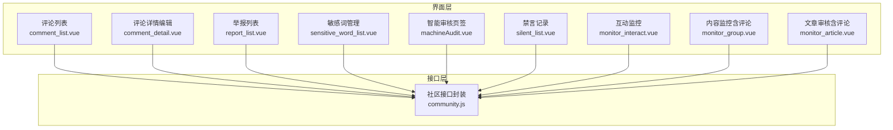

图表来源
- [comment_list.vue:1-466](file://src/views/forum/comment_list.vue#L1-L466)
- [comment_detail.vue:1-478](file://src/components/leisu/comment_detail.vue#L1-L478)
- [report_list.vue:1-208](file://src/views/forum/report_list.vue#L1-L208)
- [sensitive_word_list.vue:1-243](file://src/views/forum/sensitive_word_list.vue#L1-L243)
- [machineAudit.vue:1-199](file://src/views/forum/machineAudit.vue#L1-L199)
- [silent_list.vue:1-158](file://src/views/forum/silent_list.vue#L1-L158)
- [monitor_interact.vue:1-749](file://src/views/forum/monitor_interact.vue#L1-L749)
- [monitor_group.vue:1-800](file://src/views/forum/monitor_group.vue#L1-L800)
- [monitor_article.vue:1-689](file://src/views/forum/monitor_article.vue#L1-L689)
- [community.js:1-676](file://src/api/community.js#L1-L676)

章节来源
- [comment_list.vue:1-466](file://src/views/forum/comment_list.vue#L1-L466)
- [community.js:1-676](file://src/api/community.js#L1-L676)

## 核心组件
- 评论列表与批量管理：支持按条件筛选、排序、批量隐藏/取消隐藏、批量删除/取消删除、导出 Excel、查看评论所在帖子与楼层、快速操作等
- 评论详情编辑：支持富文本编辑、附件上传、保存、隐藏/删除、来源适配（帖子/资讯/视频/评分）
- 举报列表：支持按举报对象类型筛选（帖子/评论/直播房间/资讯评论），查看举报人、被举报人、举报内容、图片附件、额外信息等
- 敏感词管理：支持按来源（帖子/预测/新闻/推送）切换，精确/模糊搜索，添加/删除敏感词，分页浏览
- 智能审核：多标签页聚合审核任务，支持自动刷新与红点计数
- 禁言记录：查看封禁/解封记录、操作人、备注、封禁时间等
- 互动监控：直播互动消息流监控，支持删除、禁言、主题色设置、MQTT 实时订阅
- 内容监控（含评论）：聚合帖子/评论/消息等多源内容，支持标记、删除、封禁等操作
- 文章审核（含评论）：针对文章与评论的审核流程，支持批量通过/拒绝（隐藏/删除/封号）

章节来源
- [comment_list.vue:1-466](file://src/views/forum/comment_list.vue#L1-L466)
- [comment_detail.vue:1-478](file://src/components/leisu/comment_detail.vue#L1-L478)
- [report_list.vue:1-208](file://src/views/forum/report_list.vue#L1-L208)
- [sensitive_word_list.vue:1-243](file://src/views/forum/sensitive_word_list.vue#L1-L243)
- [machineAudit.vue:1-199](file://src/views/forum/machineAudit.vue#L1-L199)
- [silent_list.vue:1-158](file://src/views/forum/silent_list.vue#L1-L158)
- [monitor_interact.vue:1-749](file://src/views/forum/monitor_interact.vue#L1-L749)
- [monitor_group.vue:1-800](file://src/views/forum/monitor_group.vue#L1-L800)
- [monitor_article.vue:1-689](file://src/views/forum/monitor_article.vue#L1-L689)

## 架构总览
评论管理从前端到后端的交互链路如下：
- 前端界面通过社区 API 模块发起请求，调用后端接口完成评论列表、详情、删除、隐藏、举报列表、敏感词管理、禁言记录等操作
- 智能审核与互动监控通过 MQTT 实时订阅消息，实现评论与互动内容的即时呈现与处理
- 统计分析与报表通过各监控页签与报表组件实现，辅助运营决策

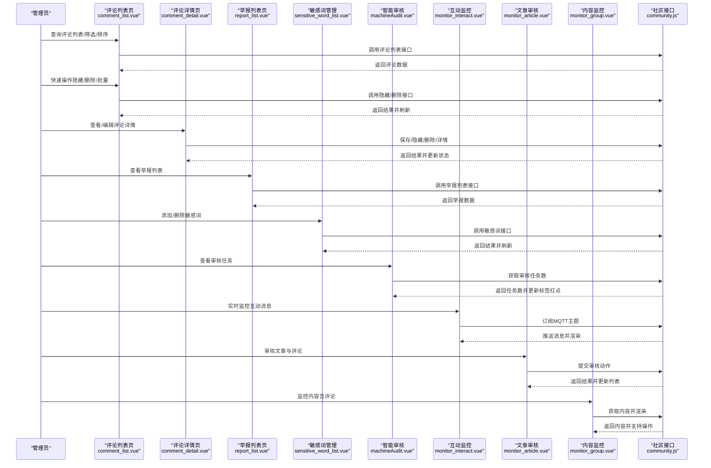

图表来源
- [comment_list.vue:1-466](file://src/views/forum/comment_list.vue#L1-L466)
- [comment_detail.vue:1-478](file://src/components/leisu/comment_detail.vue#L1-L478)
- [report_list.vue:1-208](file://src/views/forum/report_list.vue#L1-L208)
- [sensitive_word_list.vue:1-243](file://src/views/forum/sensitive_word_list.vue#L1-L243)
- [machineAudit.vue:1-199](file://src/views/forum/machineAudit.vue#L1-L199)
- [monitor_interact.vue:1-749](file://src/views/forum/monitor_interact.vue#L1-L749)
- [monitor_article.vue:1-689](file://src/views/forum/monitor_article.vue#L1-L689)
- [monitor_group.vue:1-800](file://src/views/forum/monitor_group.vue#L1-L800)
- [community.js:1-676](file://src/api/community.js#L1-L676)

## 详细组件分析

### 评论列表与批量管理
- 功能要点
  - 条件筛选、排序、分页
  - 批量隐藏/取消隐藏、批量删除/取消删除
  - 导出 Excel、查看评论所在帖子与楼层
  - 快速操作下拉菜单（隐藏/删除/关联帖子）
- 关键接口
  - 评论列表：community.js 中的评论列表接口
  - 删除/隐藏：community.js 中的删除/隐藏接口
  - 评论详情：community.js 中的评论详情接口
- 交互流程

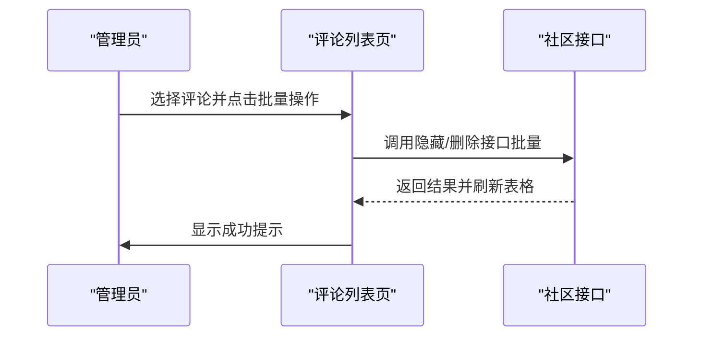

图表来源
- [comment_list.vue:382-447](file://src/views/forum/comment_list.vue#L382-L447)
- [community.js:90-133](file://src/api/community.js#L90-L133)

章节来源
- [comment_list.vue:1-466](file://src/views/forum/comment_list.vue#L1-L466)
- [community.js:90-133](file://src/api/community.js#L90-L133)

### 评论详情编辑与来源适配
- 功能要点
  - 富文本编辑器、附件上传（图片/视频等）
  - 保存、隐藏/取消隐藏、删除/取消删除
  - 来源适配：帖子评论、资讯评论、视频评论、评分评论
- 关键接口
  - 保存评论：community.js 中的保存评论接口
  - 删除/隐藏：对应来源的删除/隐藏接口
  - 详情：对应来源的详情接口
- 交互流程

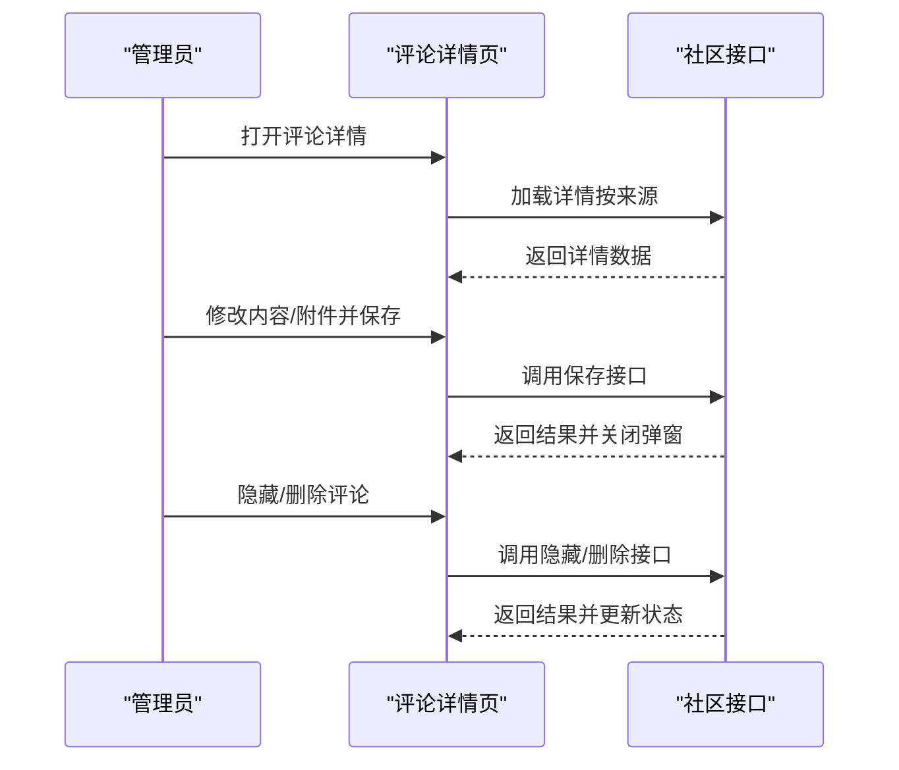

图表来源
- [comment_detail.vue:249-434](file://src/components/leisu/comment_detail.vue#L249-L434)
- [community.js:271-285](file://src/api/community.js#L271-L285)

章节来源
- [comment_detail.vue:1-478](file://src/components/leisu/comment_detail.vue#L1-L478)
- [community.js:271-285](file://src/api/community.js#L271-L285)

### 举报列表与处理
- 功能要点
  - 按举报对象类型筛选（帖子/评论/直播房间/资讯评论）
  - 查看举报人、被举报人、举报内容、图片附件、额外信息
  - 快速跳转至被举报对象与帖子详情
- 关键接口
  - 举报列表：community.js 中的举报列表接口
- 交互流程

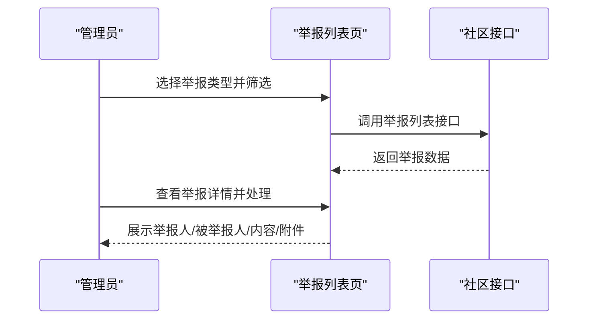

图表来源
- [report_list.vue:143-204](file://src/views/forum/report_list.vue#L143-L204)
- [community.js:353-360](file://src/api/community.js#L353-L360)

章节来源
- [report_list.vue:1-208](file://src/views/forum/report_list.vue#L1-L208)
- [community.js:353-360](file://src/api/community.js#L353-L360)

### 敏感词管理
- 功能要点
  - 按来源切换（帖子/预测/新闻/推送）
  - 精确/模糊搜索、分页浏览
  - 添加/删除敏感词，批量删除
- 关键接口
  - 社区敏感词列表/添加/删除
  - 新闻/预测/推送敏感词列表/添加/删除
- 交互流程

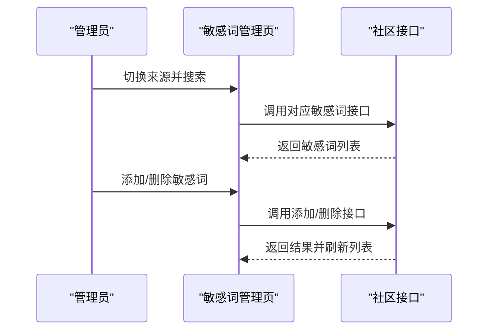

图表来源
- [sensitive_word_list.vue:220-240](file://src/views/forum/sensitive_word_list.vue#L220-L240)
- [community.js:286-308](file://src/api/community.js#L286-L308)

章节来源
- [sensitive_word_list.vue:1-243](file://src/views/forum/sensitive_word_list.vue#L1-L243)
- [community.js:286-308](file://src/api/community.js#L286-L308)

### 智能审核
- 功能要点
  - 多标签页聚合审核任务（审核/帖子/评论/其他）
  - 自动刷新与红点计数
  - 任务数来自后端接口
- 交互流程

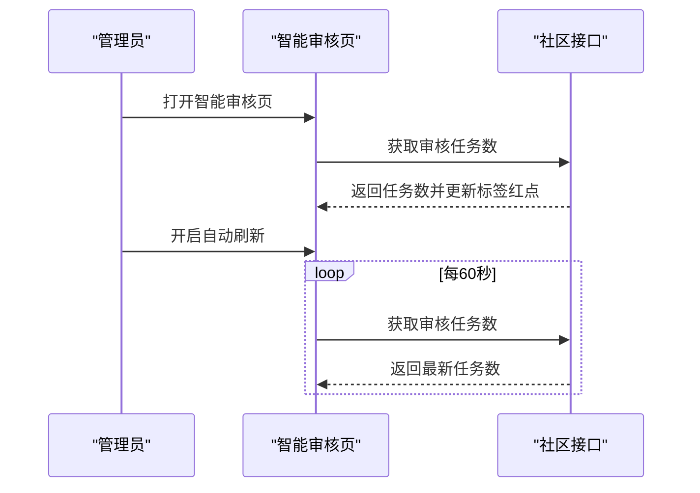

图表来源
- [machineAudit.vue:160-194](file://src/views/forum/machineAudit.vue#L160-L194)
- [community.js:1-676](file://src/api/community.js#L1-L676)

章节来源
- [machineAudit.vue:1-199](file://src/views/forum/machineAudit.vue#L1-L199)
- [community.js:1-676](file://src/api/community.js#L1-L676)

### 禁言记录
- 功能要点
  - 查看封禁/解封记录、操作人、备注、封禁时间
  - 支持按操作类型筛选（管理员/协管员/系统）
- 关键接口
  - 禁言记录：community.js 中的禁言记录接口
- 交互流程

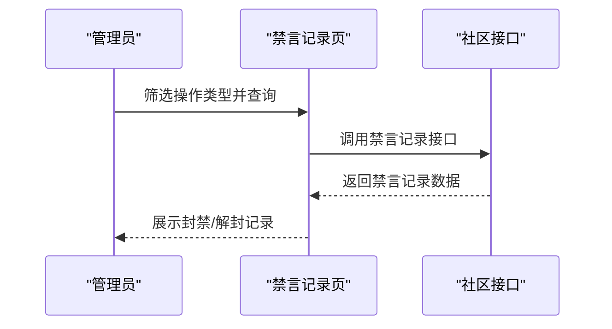

图表来源
- [silent_list.vue:102-154](file://src/views/forum/silent_list.vue#L102-L154)
- [community.js:361-368](file://src/api/community.js#L361-L368)

章节来源
- [silent_list.vue:1-158](file://src/views/forum/silent_list.vue#L1-L158)
- [community.js:361-368](file://src/api/community.js#L361-L368)

### 互动监控（实时评论与互动）
- 功能要点
  - 实时订阅 MQTT 主题，渲染互动消息流
  - 支持删除互动消息、禁言用户、主题色设置
- 关键接口
  - 删除互动消息：community.js 中的删除互动消息接口
- 交互流程

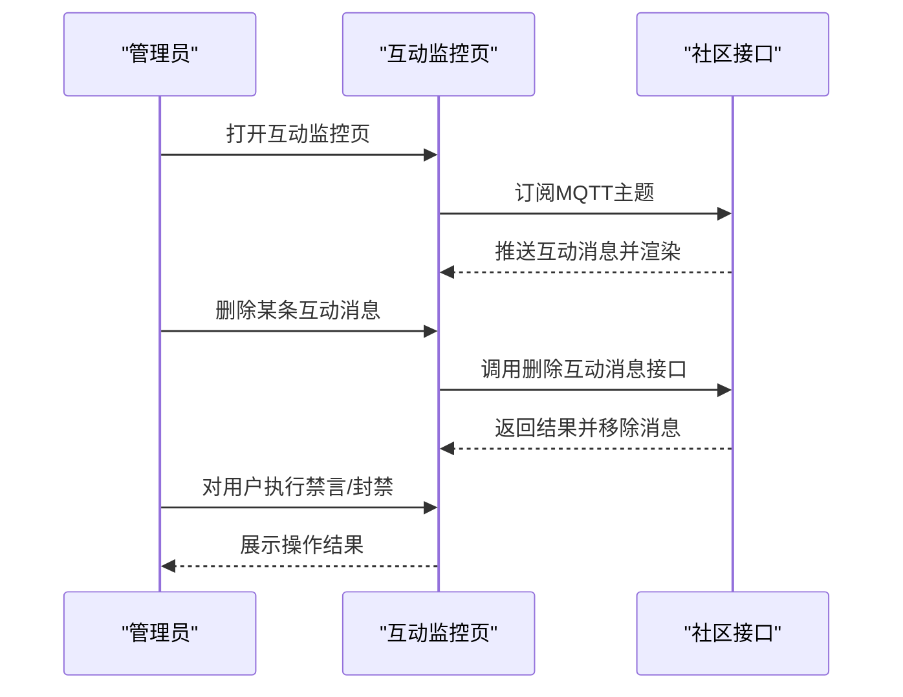

图表来源
- [monitor_interact.vue:462-677](file://src/views/forum/monitor_interact.vue#L462-L677)
- [community.js:170-176](file://src/api/community.js#L170-L176)

章节来源
- [monitor_interact.vue:1-749](file://src/views/forum/monitor_interact.vue#L1-L749)
- [community.js:170-176](file://src/api/community.js#L170-L176)

### 内容监控（含评论）
- 功能要点
  - 聚合帖子/评论/消息等多源内容
  - 支持标记、删除、封禁等操作
- 交互流程

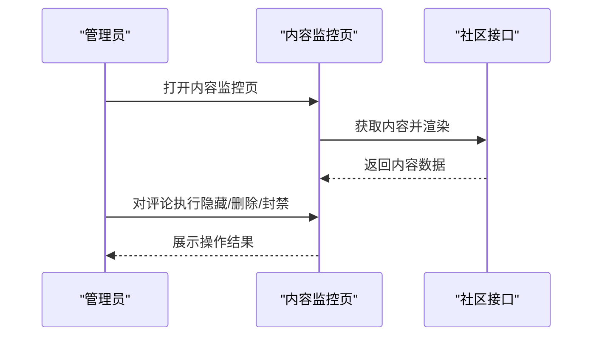

图表来源
- [monitor_group.vue:528-800](file://src/views/forum/monitor_group.vue#L528-L800)
- [community.js:1-676](file://src/api/community.js#L1-L676)

章节来源
- [monitor_group.vue:1-800](file://src/views/forum/monitor_group.vue#L1-L800)
- [community.js:1-676](file://src/api/community.js#L1-L676)

### 文章审核（含评论）
- 功能要点
  - 针对文章与评论的审核流程
  - 支持批量通过/拒绝（隐藏/删除/封号）
- 交互流程

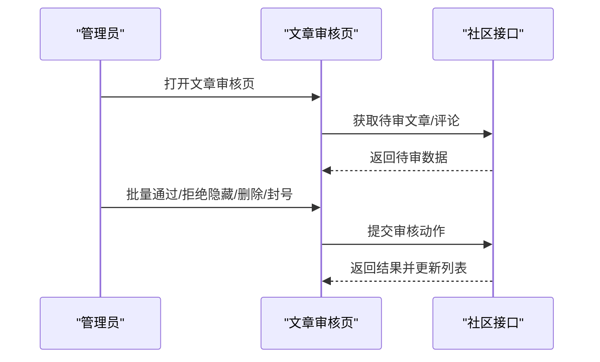

图表来源
- [monitor_article.vue:589-686](file://src/views/forum/monitor_article.vue#L589-L686)
- [community.js:295-297](file://src/api/community.js#L295-L297)

章节来源
- [monitor_article.vue:1-689](file://src/views/forum/monitor_article.vue#L1-L689)
- [community.js:295-297](file://src/api/community.js#L295-L297)

## 依赖关系分析
- 组件耦合
  - 评论列表与评论详情编辑紧密耦合，均依赖社区接口模块
  - 举报列表与敏感词管理独立于评论列表，但共享社区接口模块
  - 智能审核、互动监控、内容监控、文章审核均依赖社区接口模块
- 外部依赖
  - MQTT 实时订阅用于互动监控的消息推送
  - 富文本编辑器与附件上传组件用于评论详情编辑
- 循环依赖
  - 当前模块未发现循环依赖，接口层与界面层职责清晰

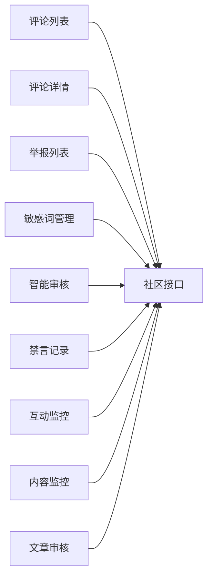

图表来源
- [comment_list.vue:1-466](file://src/views/forum/comment_list.vue#L1-L466)
- [comment_detail.vue:1-478](file://src/components/leisu/comment_detail.vue#L1-L478)
- [report_list.vue:1-208](file://src/views/forum/report_list.vue#L1-L208)
- [sensitive_word_list.vue:1-243](file://src/views/forum/sensitive_word_list.vue#L1-L243)
- [machineAudit.vue:1-199](file://src/views/forum/machineAudit.vue#L1-L199)
- [silent_list.vue:1-158](file://src/views/forum/silent_list.vue#L1-L158)
- [monitor_interact.vue:1-749](file://src/views/forum/monitor_interact.vue#L1-L749)
- [monitor_group.vue:1-800](file://src/views/forum/monitor_group.vue#L1-L800)
- [monitor_article.vue:1-689](file://src/views/forum/monitor_article.vue#L1-L689)
- [community.js:1-676](file://src/api/community.js#L1-L676)

章节来源
- [community.js:1-676](file://src/api/community.js#L1-L676)

## 性能考量
- 列表加载优化
  - 使用分页与排序减少一次性传输数据量
  - 批量操作采用批量接口，避免多次往返
- 实时监控
  - MQTT 订阅需注意连接复用与断线重连策略，避免频繁重建连接
- 图片与附件
  - 附件上传采用缩略图与懒加载策略，提升渲染性能
- 敏感词与审核
  - 敏感词列表分页加载，避免一次性渲染过多标签
  - 智能审核页自动刷新间隔合理设置，避免频繁请求

## 故障排查指南
- 评论列表无数据或加载缓慢
  - 检查筛选条件与排序参数是否正确传递
  - 确认网络请求是否成功返回
- 批量操作失败
  - 确认所选评论 ID 列表是否为空
  - 检查接口返回错误码与提示信息
- 评论详情保存失败
  - 检查富文本内容与附件格式是否符合要求
  - 确认来源类型与对应接口是否匹配
- 举报列表筛选无效
  - 确认举报类型参数是否正确
  - 检查额外字段（如帖子 ID、资讯评论 ID）是否完整
- 敏感词管理无法添加/删除
  - 检查来源切换是否正确
  - 确认输入格式与接口参数是否符合要求
- 智能审核任务数不更新
  - 检查自动刷新开关与倒计时逻辑
  - 确认后端接口返回数据是否正确
- 互动监控消息不显示
  - 检查 MQTT 连接状态与订阅主题
  - 确认消息解密与渲染逻辑是否正常
- 禁言记录筛选异常
  - 检查操作类型筛选参数转换逻辑
  - 确认接口返回数据结构是否一致

章节来源
- [comment_list.vue:382-447](file://src/views/forum/comment_list.vue#L382-L447)
- [comment_detail.vue:312-402](file://src/components/leisu/comment_detail.vue#L312-L402)
- [report_list.vue:143-186](file://src/views/forum/report_list.vue#L143-L186)
- [sensitive_word_list.vue:166-214](file://src/views/forum/sensitive_word_list.vue#L166-L214)
- [machineAudit.vue:100-132](file://src/views/forum/machineAudit.vue#L100-L132)
- [monitor_interact.vue:462-677](file://src/views/forum/monitor_interact.vue#L462-L677)
- [silent_list.vue:102-154](file://src/views/forum/silent_list.vue#L102-L154)

## 结论
评论管理模块通过统一的社区接口封装，实现了评论列表、详情编辑、举报处理、敏感词治理、智能审核、禁言记录、互动监控与内容监控等核心能力。界面层采用模块化设计，职责清晰、扩展性强；接口层提供稳定的数据通道与实时订阅能力，满足运营与审核的多样化需求。结合本文提供的最佳实践与故障排查建议，可有效提升评论区的治理效率与用户体验。

## 附录
- 最佳实践
  - 评论区氛围维护：建立明确的社区规则与分级阈值，结合敏感词与智能审核降低违规内容传播
  - 用户互动引导：通过富文本与附件能力提升内容质量，鼓励高质量讨论
  - 内容质量控制：利用举报列表与内容监控双轨制，形成“人工+智能”的审核闭环
  - 实时管理与智能审核：合理配置自动刷新与任务数提醒，确保审核响应及时
- 配置说明
  - 敏感词来源切换：在敏感词管理页根据业务域切换来源（帖子/预测/新闻/推送）
  - 智能审核自动刷新：在智能审核页开启自动刷新，并设置合理的倒计时周期
  - 互动监控主题色：在互动监控页设置主题色，提升视觉辨识度与操作体验
  - 评论列表筛选与排序：在评论列表页使用筛选与排序功能，快速定位目标评论