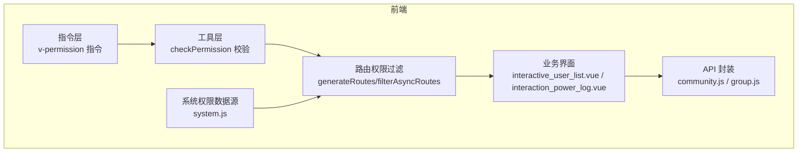
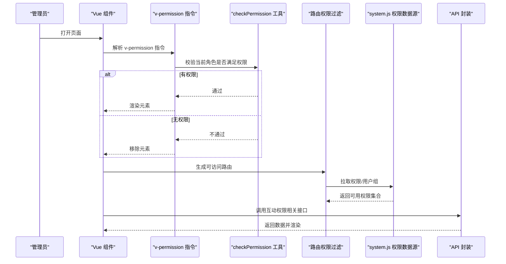
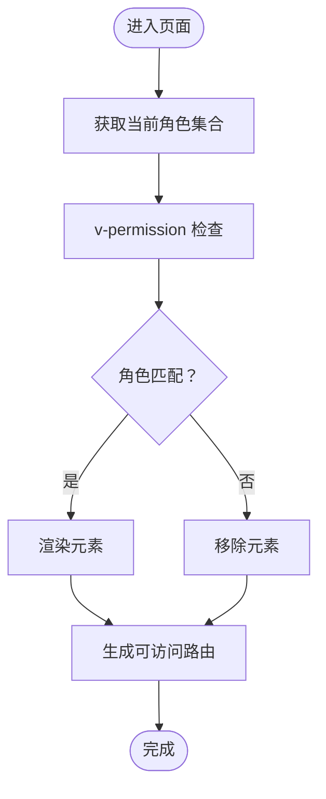
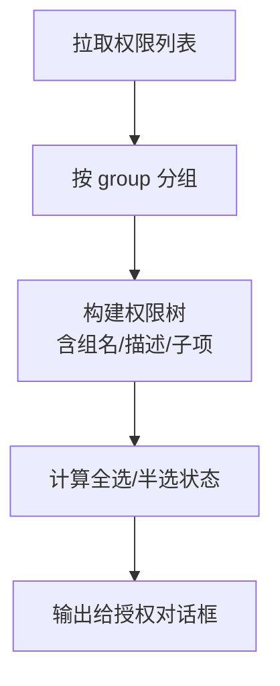
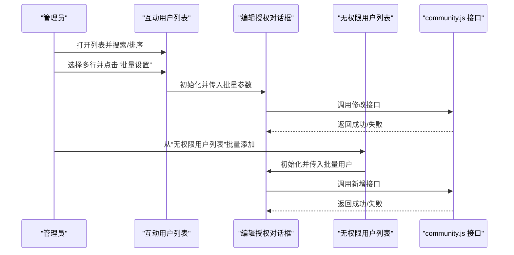
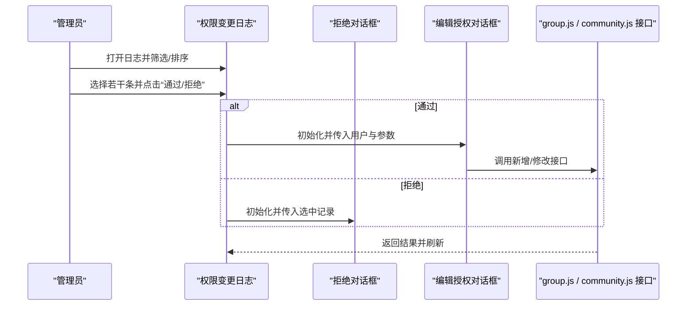
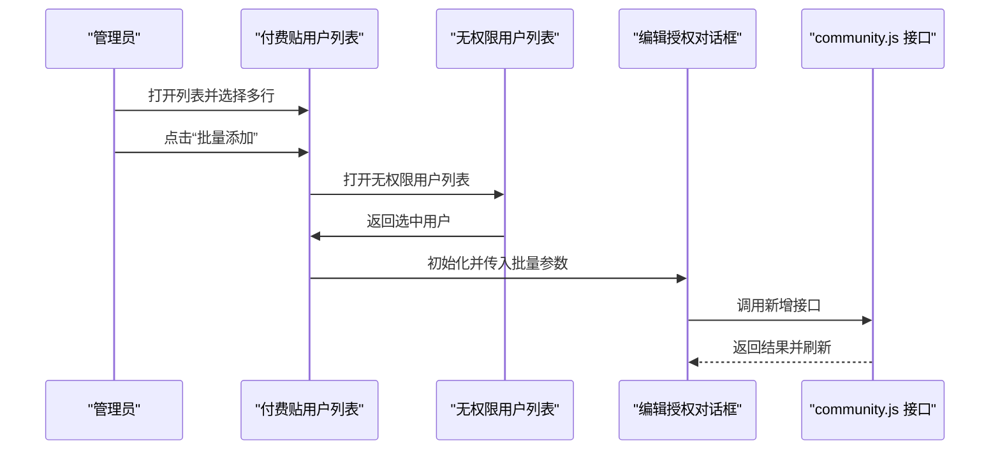
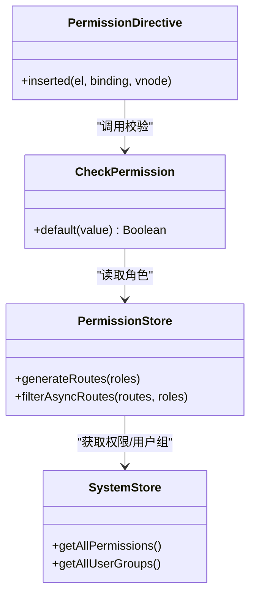
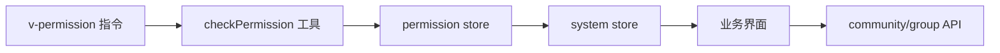

# 互动权限管理

<cite>
**本文引用的文件**
- [directive/permission/index.js](file://src/directive/permission/index.js)
- [directive/permission/permission.js](file://src/directive/permission/permission.js)
- [utils/permission.js](file://src/utils/permission.js)
- [store/modules/permission.js](file://src/store/modules/permission.js)
- [store/modules/system.js](file://src/store/modules/system.js)
- [api/group.js](file://src/api/group.js)
- [api/community.js](file://src/api/community.js)
- [views/forum/interactive_user_list.vue](file://src/views/forum/interactive_user_list.vue)
- [views/forum/interaction_power_log.vue](file://src/views/forum/interaction_power_log.vue)
- [views/forum/components/editAuthorizedDialog.vue](file://src/views/forum/components/editAuthorizedDialog.vue)
- [views/forum/components/userUnauthorizedList.vue](file://src/views/forum/components/userUnauthorizedList.vue)
- [views/forum/components/interaction_log_reject_tc.vue](file://src/views/forum/components/interaction_log_reject_tc.vue)
- [views/forum/components/operationTc.vue](file://src/views/forum/components/operationTc.vue)
- [views/forum/charge_list.vue](file://src/views/forum/charge_list.vue)
- [components/leisu/peopleInfo/authentication/authentication.vue](file://src/components/leisu/peopleInfo/authentication/authentication.vue)
- [views/member/authentication.vue](file://src/views/member/authentication.vue)
- [views/member/userApplyList.vue](file://src/views/member/userApplyList.vue)
</cite>

## 目录
1. [简介](#简介)
2. [项目结构](#项目结构)
3. [核心组件](#核心组件)
4. [架构总览](#架构总览)
5. [详细组件分析](#详细组件分析)
6. [依赖分析](#依赖分析)
7. [性能考虑](#性能考虑)
8. [故障排查指南](#故障排查指南)
9. [结论](#结论)
10. [附录](#附录)

## 简介
本技术文档围绕“互动权限管理系统”展开，目标是为管理员提供一套完整的互动权限配置与管理能力，覆盖用户权限分配、功能开关控制、等级权限设置、权限验证与继承、动态权限调整、权限日志记录与分析、可视化界面与批量操作、以及权限安全最佳实践。文档基于仓库现有实现进行梳理与总结，并结合前端权限指令、路由权限过滤、系统权限数据源、社区互动权限 API 与交互界面，形成从架构到落地的完整说明。

## 项目结构
该系统以 Vue 前端为主，采用模块化组织方式：
- 权限指令与工具：在指令层实现 DOM 层面的权限控制，在工具层实现通用权限校验。
- 路由权限过滤：根据角色动态生成可访问路由表，确保导航与页面级权限一致。
- 系统权限数据源：从后端拉取权限与用户组列表，用于权限树与批量授权。
- 业务界面：互动用户列表、权限变更日志、无权限用户列表、编辑授权对话框等。
- API 层：封装社区互动权限、组权限、日志查询等接口。

图表来源
- [directive/permission/index.js:1-14](file://src/directive/permission/index.js#L1-L14)
- [directive/permission/permission.js:1-23](file://src/directive/permission/permission.js#L1-L23)
- [utils/permission.js:1-26](file://src/utils/permission.js#L1-L26)
- [store/modules/permission.js:1-66](file://src/store/modules/permission.js#L1-L66)
- [store/modules/system.js:1-149](file://src/store/modules/system.js#L1-L149)
- [views/forum/interactive_user_list.vue:1-559](file://src/views/forum/interactive_user_list.vue#L1-L559)
- [views/forum/interaction_power_log.vue:1-294](file://src/views/forum/interaction_power_log.vue#L1-L294)
- [api/community.js:1-676](file://src/api/community.js#L1-L676)
- [api/group.js:1-642](file://src/api/group.js#L1-L642)

章节来源
- [directive/permission/index.js:1-14](file://src/directive/permission/index.js#L1-L14)
- [directive/permission/permission.js:1-23](file://src/directive/permission/permission.js#L1-L23)
- [utils/permission.js:1-26](file://src/utils/permission.js#L1-L26)
- [store/modules/permission.js:1-66](file://src/store/modules/permission.js#L1-L66)
- [store/modules/system.js:1-149](file://src/store/modules/system.js#L1-L149)
- [views/forum/interactive_user_list.vue:1-559](file://src/views/forum/interactive_user_list.vue#L1-L559)
- [views/forum/interaction_power_log.vue:1-294](file://src/views/forum/interaction_power_log.vue#L1-L294)
- [api/community.js:1-676](file://src/api/community.js#L1-L676)
- [api/group.js:1-642](file://src/api/group.js#L1-L642)

## 核心组件
- 权限指令与校验
  - v-permission 指令：在 DOM 渲染阶段根据用户角色决定元素是否显示。
  - checkPermission 工具：在业务逻辑中进行权限判断。
- 路由权限过滤
  - generateRoutes/filterAsyncRoutes：依据角色筛选可访问路由，避免越权访问。
- 系统权限数据源
  - system.js：拉取权限与用户组，构建权限树与批量授权选项。
- 业务界面
  - 互动用户列表：查看/编辑/移除互动权限；批量设置；发放道具卡。
  - 权限变更日志：查看互动权限变更记录，支持批量通过/拒绝。
  - 无权限用户列表：从“未授权”用户中批量添加互动权限。
  - 编辑授权对话框：统一的授权编辑入口（互动/付费/周卡）。
- API 封装
  - community.js：互动用户列表、新增/修改/删除互动用户、互动聊天/推荐列表等。
  - group.js：互动权限变更日志、周卡权限、组合购等。

章节来源
- [directive/permission/permission.js:1-23](file://src/directive/permission/permission.js#L1-L23)
- [utils/permission.js:1-26](file://src/utils/permission.js#L1-L26)
- [store/modules/permission.js:1-66](file://src/store/modules/permission.js#L1-L66)
- [store/modules/system.js:1-149](file://src/store/modules/system.js#L1-L149)
- [views/forum/interactive_user_list.vue:1-559](file://src/views/forum/interactive_user_list.vue#L1-L559)
- [views/forum/interaction_power_log.vue:1-294](file://src/views/forum/interaction_power_log.vue#L1-L294)
- [views/forum/components/editAuthorizedDialog.vue](file://src/views/forum/components/editAuthorizedDialog.vue)
- [views/forum/components/userUnauthorizedList.vue](file://src/views/forum/components/userUnauthorizedList.vue)
- [api/community.js:1-676](file://src/api/community.js#L1-L676)
- [api/group.js:1-642](file://src/api/group.js#L1-L642)

## 架构总览
系统采用“指令 + 工具 + 路由过滤 + 数据源 + 界面 + API”的分层架构，实现前端侧的权限控制闭环。

图表来源
- [directive/permission/permission.js:1-23](file://src/directive/permission/permission.js#L1-L23)
- [utils/permission.js:1-26](file://src/utils/permission.js#L1-L26)
- [store/modules/permission.js:1-66](file://src/store/modules/permission.js#L1-L66)
- [store/modules/system.js:1-149](file://src/store/modules/system.js#L1-L149)
- [api/community.js:1-676](file://src/api/community.js#L1-L676)
- [api/group.js:1-642](file://src/api/group.js#L1-L642)

## 详细组件分析

### 权限指令与校验
- v-permission 指令
  - 在插入时读取绑定值（权限数组），与当前用户角色比对，若不匹配则移除 DOM。
  - 适合按钮、菜单项等细粒度控制。
- checkPermission 工具
  - 在业务逻辑中调用，返回布尔值，用于条件渲染或流程控制。
- 路由权限过滤
  - generateRoutes 递归过滤路由表，仅保留当前角色可访问的路由，避免直接访问未授权页面。

图表来源
- [directive/permission/permission.js:1-23](file://src/directive/permission/permission.js#L1-L23)
- [utils/permission.js:1-26](file://src/utils/permission.js#L1-L26)
- [store/modules/permission.js:1-66](file://src/store/modules/permission.js#L1-L66)

章节来源
- [directive/permission/index.js:1-14](file://src/directive/permission/index.js#L1-L14)
- [directive/permission/permission.js:1-23](file://src/directive/permission/permission.js#L1-L23)
- [utils/permission.js:1-26](file://src/utils/permission.js#L1-L26)
- [store/modules/permission.js:1-66](file://src/store/modules/permission.js#L1-L66)

### 系统权限数据源与权限树
- system.js
  - 提供权限列表与用户组列表的拉取与缓存。
  - 将权限按“组”聚合，形成权限树结构，便于批量勾选与授权。
- 权限树构建
  - 将权限按 group 分组，记录每组的描述与子项，计算“全选/半选”状态，输出可用于授权对话框的数据结构。

图表来源
- [store/modules/system.js:1-149](file://src/store/modules/system.js#L1-L149)
- [utils/tool.js:27-68](file://src/utils/tool.js#L27-L68)

章节来源
- [store/modules/system.js:1-149](file://src/store/modules/system.js#L1-L149)
- [utils/tool.js:27-68](file://src/utils/tool.js#L27-L68)

### 互动用户列表与批量权限设置
- 功能概览
  - 查看拥有互动权限的用户列表，支持按条件搜索、排序、分页。
  - 支持批量选择用户，进行“修改发布数/价格/球类/周卡”等批量设置。
  - 支持移除权限（需填写原因）、发放道具卡。
  - 支持从“无权限用户列表”批量添加互动权限。
- 关键流程
  - 列表加载：调用互动用户列表接口，返回数据并渲染。
  - 批量设置：收集选中用户 UID，组装参数，调用编辑接口。
  - 移除权限：弹窗输入原因，调用删除接口。
  - 发放道具卡：选择场景与数量，调用创建接口。

图表来源
- [views/forum/interactive_user_list.vue:392-559](file://src/views/forum/interactive_user_list.vue#L392-L559)
- [views/forum/components/editAuthorizedDialog.vue](file://src/views/forum/components/editAuthorizedDialog.vue)
- [views/forum/components/userUnauthorizedList.vue](file://src/views/forum/components/userUnauthorizedList.vue)
- [api/community.js:198-237](file://src/api/community.js#L198-L237)

章节来源
- [views/forum/interactive_user_list.vue:1-559](file://src/views/forum/interactive_user_list.vue#L1-L559)
- [views/forum/components/editAuthorizedDialog.vue](file://src/views/forum/components/editAuthorizedDialog.vue)
- [views/forum/components/userUnauthorizedList.vue](file://src/views/forum/components/userUnauthorizedList.vue)
- [api/community.js:198-237](file://src/api/community.js#L198-L237)

### 权限变更日志与批量审批
- 功能概览
  - 查看互动权限变更日志，支持排序、筛选、分页。
  - 支持批量通过/拒绝，或打开“公众号”操作面板。
  - 对于“分类=3（周卡）”的记录，可自动回填当前用户的授权参数，便于快速编辑。
- 关键流程
  - 日志加载：调用互动权限变更日志接口，返回列表与总数。
  - 批量审批：选择多条记录，打开拒绝对话框或编辑对话框。
  - 自动回填：当分类为周卡且存在有效授权时，自动填充参数。

图表来源
- [views/forum/interaction_power_log.vue:186-294](file://src/views/forum/interaction_power_log.vue#L186-L294)
- [views/forum/components/interaction_log_reject_tc.vue](file://src/views/forum/components/interaction_log_reject_tc.vue)
- [views/forum/components/operationTc.vue](file://src/views/forum/components/operationTc.vue)
- [api/group.js:26-32](file://src/api/group.js#L26-L32)
- [api/community.js:198-237](file://src/api/community.js#L198-L237)

章节来源
- [views/forum/interaction_power_log.vue:1-294](file://src/views/forum/interaction_power_log.vue#L1-L294)
- [views/forum/components/interaction_log_reject_tc.vue](file://src/views/forum/components/interaction_log_reject_tc.vue)
- [views/forum/components/operationTc.vue](file://src/views/forum/components/operationTc.vue)
- [api/group.js:26-32](file://src/api/group.js#L26-L32)
- [api/community.js:198-237](file://src/api/community.js#L198-L237)

### 付费贴与互动贴的权限联动
- 功能概览
  - 付费贴用户列表支持从“无权限用户列表”批量添加，兼容付费贴的授权参数。
  - 互动贴与付费贴的授权参数（如分成比例、发布限制、价格列表、周卡价格等）在编辑对话框中统一维护。
- 关键流程
  - 批量添加：收集 UID 列表，组装参数，调用新增接口。
  - 参数回填：根据当前用户已授权状态，自动填充默认值。

图表来源
- [views/forum/charge_list.vue:239-263](file://src/views/forum/charge_list.vue#L239-L263)
- [views/forum/components/userUnauthorizedList.vue](file://src/views/forum/components/userUnauthorizedList.vue)
- [views/forum/components/editAuthorizedDialog.vue](file://src/views/forum/components/editAuthorizedDialog.vue)
- [api/community.js:222-229](file://src/api/community.js#L222-L229)

章节来源
- [views/forum/charge_list.vue:1-263](file://src/views/forum/charge_list.vue#L1-L263)
- [views/forum/components/userUnauthorizedList.vue](file://src/views/forum/components/userUnauthorizedList.vue)
- [views/forum/components/editAuthorizedDialog.vue](file://src/views/forum/components/editAuthorizedDialog.vue)
- [api/community.js:222-229](file://src/api/community.js#L222-L229)

### 权限验证机制与继承关系
- 验证机制
  - 指令层：v-permission 在 DOM 插入时即时校验，保证不可见即不可点。
  - 工具层：checkPermission 在业务逻辑中进行二次校验，避免绕过指令的路径。
  - 路由层：generateRoutes 依据角色过滤路由，防止直接访问未授权页面。
- 权限继承
  - 系统权限数据源会将“用户组”转换为可分配的权限项，形成“组-权限”的继承关系，便于批量授权与审计。

图表来源
- [directive/permission/permission.js:1-23](file://src/directive/permission/permission.js#L1-L23)
- [utils/permission.js:1-26](file://src/utils/permission.js#L1-L26)
- [store/modules/permission.js:1-66](file://src/store/modules/permission.js#L1-L66)
- [store/modules/system.js:1-149](file://src/store/modules/system.js#L1-L149)

章节来源
- [directive/permission/permission.js:1-23](file://src/directive/permission/permission.js#L1-L23)
- [utils/permission.js:1-26](file://src/utils/permission.js#L1-L26)
- [store/modules/permission.js:1-66](file://src/store/modules/permission.js#L1-L66)
- [store/modules/system.js:1-149](file://src/store/modules/system.js#L1-L149)

### 动态权限调整与可视化界面
- 动态调整
  - 通过编辑授权对话框，实时修改用户的互动权限参数（发布次数、价格列表、球类、分成比例、周卡价格等）。
  - 支持批量设置，减少重复操作。
- 可视化界面
  - 权限树：按组聚合的权限树，支持全选/半选状态展示。
  - 批量操作：列表页支持批量勾选与批量设置。
  - 审计报告：日志页支持排序、筛选与导出（由后端接口支持）。

章节来源
- [views/forum/interactive_user_list.vue:424-469](file://src/views/forum/interactive_user_list.vue#L424-L469)
- [views/forum/interaction_power_log.vue:227-231](file://src/views/forum/interaction_power_log.vue#L227-L231)
- [views/forum/components/editAuthorizedDialog.vue](file://src/views/forum/components/editAuthorizedDialog.vue)
- [store/modules/system.js:64-133](file://src/store/modules/system.js#L64-L133)

### 权限日志记录与分析
- 日志接口
  - 互动权限变更日志：记录用户权限的申请、通过、拒绝、修改等事件。
  - 互动用户列表：记录用户当前授权状态与参数。
- 日志分析
  - 支持按时间、状态、分类排序，支持批量审批。
  - 对于周卡类记录，可自动回填当前授权参数，便于快速复核。

章节来源
- [api/group.js:26-32](file://src/api/group.js#L26-L32)
- [api/community.js:198-205](file://src/api/community.js#L198-L205)
- [views/forum/interaction_power_log.vue:186-294](file://src/views/forum/interaction_power_log.vue#L186-L294)

### 权限安全最佳实践
- 最小权限原则
  - 仅授予完成任务所需的最小权限，避免“超级权限”。
- 权限分离
  - 将“审批”“执行”“审计”职责分离，避免同一人同时拥有。
- 审计留痕
  - 所有权限变更均应记录日志，包含操作者、时间、原因、前后状态。
- 输入校验
  - 对批量操作与授权参数进行严格校验，防止越界或非法值。
- 定期复核
  - 定期对权限树与批量授权进行复核，清理长期未使用的权限。

## 依赖分析
- 组件耦合
  - 权限指令与工具解耦于路由过滤与系统数据源，降低耦合度。
  - 业务界面通过统一的 API 封装与对话框组件进行交互，提升复用性。
- 外部依赖
  - 后端接口提供权限列表、用户组、互动权限日志、互动用户列表等数据。
- 潜在风险
  - 若权限树构建逻辑与后端字段不一致，可能导致授权失败或显示异常。
  - 批量操作缺少二次确认，可能引发误操作。

图表来源
- [directive/permission/permission.js:1-23](file://src/directive/permission/permission.js#L1-L23)
- [utils/permission.js:1-26](file://src/utils/permission.js#L1-L26)
- [store/modules/permission.js:1-66](file://src/store/modules/permission.js#L1-L66)
- [store/modules/system.js:1-149](file://src/store/modules/system.js#L1-L149)
- [views/forum/interactive_user_list.vue:1-559](file://src/views/forum/interactive_user_list.vue#L1-L559)
- [views/forum/interaction_power_log.vue:1-294](file://src/views/forum/interaction_power_log.vue#L1-L294)
- [api/community.js:1-676](file://src/api/community.js#L1-L676)
- [api/group.js:1-642](file://src/api/group.js#L1-L642)

章节来源
- [store/modules/permission.js:1-66](file://src/store/modules/permission.js#L1-L66)
- [store/modules/system.js:1-149](file://src/store/modules/system.js#L1-L149)
- [views/forum/interactive_user_list.vue:1-559](file://src/views/forum/interactive_user_list.vue#L1-L559)
- [views/forum/interaction_power_log.vue:1-294](file://src/views/forum/interaction_power_log.vue#L1-L294)
- [api/community.js:1-676](file://src/api/community.js#L1-L676)
- [api/group.js:1-642](file://src/api/group.js#L1-L642)

## 性能考虑
- 列表分页与懒加载
  - 使用分页参数控制请求规模，避免一次性加载过多数据。
- 权限树构建
  - 权限树在系统数据源处一次性构建，后续复用，减少重复计算。
- 批量操作
  - 批量设置时尽量合并请求，减少多次网络往返。
- 指令与工具
  - 指令在插入时校验，避免在运行时频繁计算，提高渲染效率。

## 故障排查指南
- 页面元素不显示
  - 检查当前角色是否包含所需权限，确认 v-permission 绑定值格式正确。
- 路由无法访问
  - 检查 generateRoutes 是否正确过滤，确认角色集合是否已更新。
- 权限树不显示或不全选
  - 检查系统权限数据源返回的权限列表与用户组是否正确，确认分组字段一致。
- 批量设置无效
  - 检查选中用户 UID 列表与参数组装是否正确，确认接口返回状态码与消息。
- 日志为空或排序异常
  - 检查日志接口参数（分页、排序、筛选）是否正确传递。

章节来源
- [directive/permission/permission.js:1-23](file://src/directive/permission/permission.js#L1-L23)
- [utils/permission.js:1-26](file://src/utils/permission.js#L1-L26)
- [store/modules/permission.js:1-66](file://src/store/modules/permission.js#L1-L66)
- [store/modules/system.js:1-149](file://src/store/modules/system.js#L1-L149)
- [views/forum/interactive_user_list.vue:392-559](file://src/views/forum/interactive_user_list.vue#L392-L559)
- [views/forum/interaction_power_log.vue:186-294](file://src/views/forum/interaction_power_log.vue#L186-L294)

## 结论
本系统通过“指令 + 工具 + 路由过滤 + 数据源 + 界面 + API”的分层设计，实现了从前端到后端的完整权限控制闭环。结合权限树、批量操作与日志审计，能够满足互动权限的精细化管理需求。建议在后续迭代中进一步完善权限树字段一致性校验、批量操作二次确认与更丰富的审计报表，持续提升系统的安全性与可运维性。

## 附录
- 权限配置示例（路径）
  - 批量设置互动权限：[views/forum/interactive_user_list.vue:424-469](file://src/views/forum/interactive_user_list.vue#L424-L469)
  - 批量添加付费贴用户：[views/forum/charge_list.vue:239-263](file://src/views/forum/charge_list.vue#L239-L263)
  - 查看权限变更日志：[views/forum/interaction_power_log.vue:186-294](file://src/views/forum/interaction_power_log.vue#L186-L294)
  - 编辑授权对话框初始化：[views/forum/components/editAuthorizedDialog.vue](file://src/views/forum/components/editAuthorizedDialog.vue)
  - 无权限用户列表：[views/forum/components/userUnauthorizedList.vue](file://src/views/forum/components/userUnauthorizedList.vue)
- 安全检查清单
  - 审核权限变更日志，确保操作可追溯。
  - 定期复核权限树，清理长期未使用的权限。
  - 对批量操作增加二次确认与操作原因必填。
  - 限制超级权限的授予范围，遵循最小权限原则。