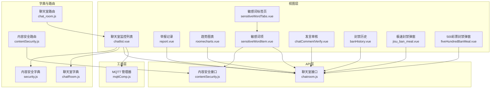
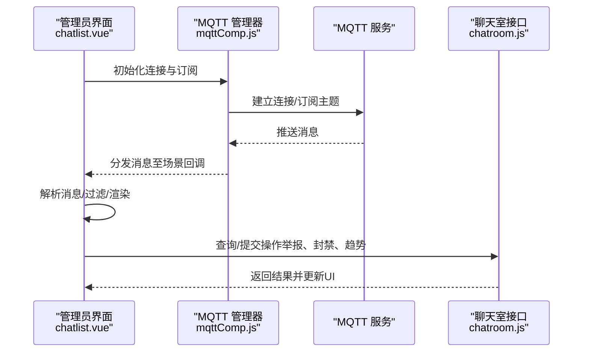
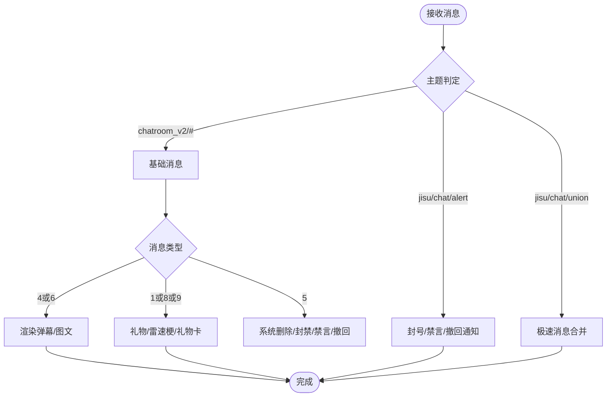
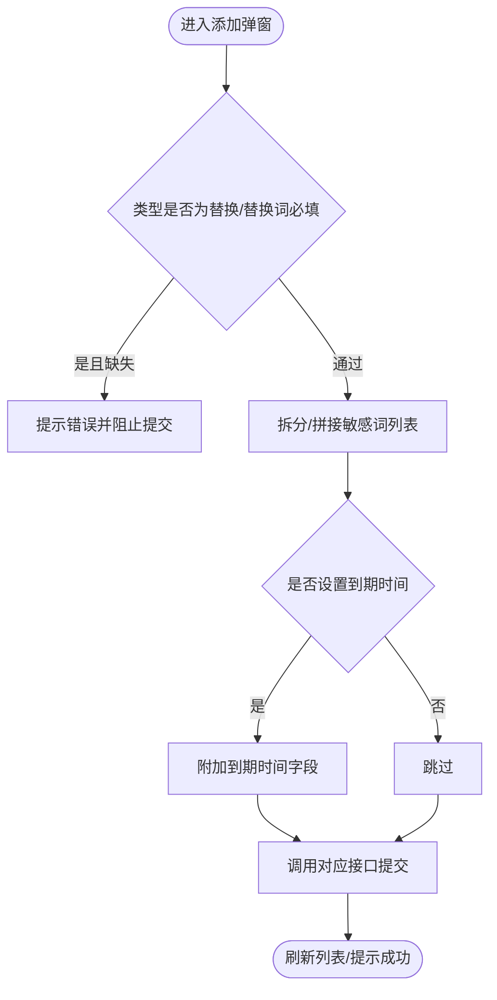
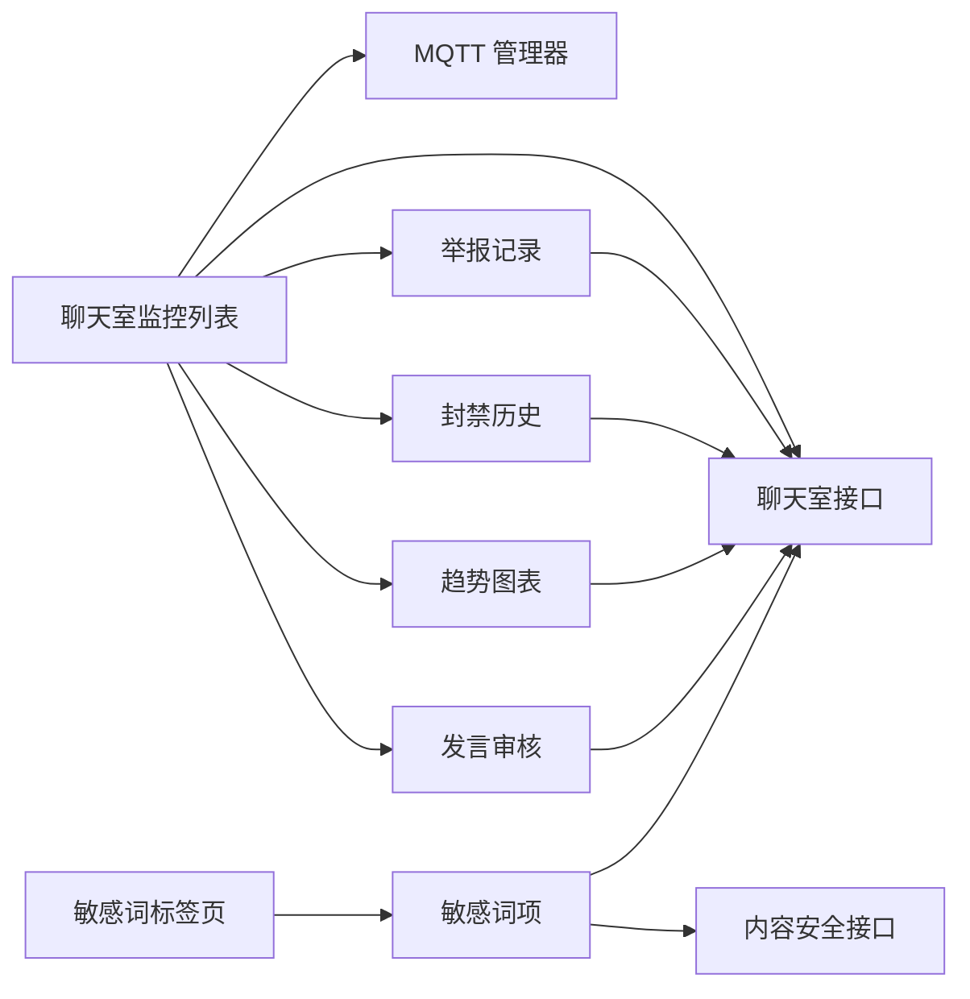

# 直播间监控

<cite>
**本文引用的文件**
- [chatlist.vue](file://src/views/chat_room/chatlist.vue)
- [report.vue](file://src/views/chat_room/report.vue)
- [roomecharts.vue](file://src/views/chat_room/roomecharts.vue)
- [sensitiveWordTabs.vue](file://src/views/chat_room/sensitiveWordTabs.vue)
- [sensitiveWordItem.vue](file://src/views/chat_room/sensitiveWordItem.vue)
- [chatCommentVerify.vue](file://src/views/chat_room/components/chatCommentVerify.vue)
- [banHistory.vue](file://src/views/chat_room/banHistory.vue)
- [jisu_ban_meal.vue](file://src/views/chat_room/components/jisu_ban_meal.vue)
- [fiveHundredBanMeal.vue](file://src/views/chat_room/components/fiveHundredBanMeal.vue)
- [mqttComp.js](file://src/utils/mqttComp.js)
- [chatroom.js](file://src/api/chatroom.js)
- [contentSecurity.js](file://src/api/contentSecurity.js)
- [chatRoom.js](file://src/utils/dict/chatRoom.js)
- [security.js](file://src/utils/dict/security.js)
- [chat_room.js](file://src/router/children/chat_room.js)
- [contentSecurity.js](file://src/router/children/contentSecurity.js)
</cite>

## 目录
1. [简介](#简介)
2. [项目结构](#项目结构)
3. [核心组件](#核心组件)
4. [架构总览](#架构总览)
5. [详细组件分析](#详细组件分析)
6. [依赖关系分析](#依赖关系分析)
7. [性能考量](#性能考量)
8. [故障排查指南](#故障排查指南)
9. [结论](#结论)
10. [附录](#附录)

## 简介
本技术文档面向“直播间监控系统”的建设与运维，聚焦于直播间的实时监控能力，包括直播内容监测、观众互动分析、违规行为识别与处置、异常流量与行为检测、以及直播数据的实时展示与运营策略。系统通过 MQTT 实时订阅聊天室消息，结合敏感词管理、举报记录、封禁历史、趋势图表与人工审核流程，形成“采集-过滤-分析-处置-可视化”的闭环。

## 项目结构
围绕“聊天室监控”主题，前端采用 Vue 组件化组织，关键模块如下：
- 视图层：聊天室监控列表、举报记录、趋势图表、敏感词管理、发言审核、封禁历史等
- 工具层：MQTT 管理器（连接池、场景化订阅/取消订阅、通配符匹配）
- API 层：聊天室相关接口、内容安全接口
- 字典与路由：举报类型、礼物卡样式、路由权限

**图表来源**
- [chatlist.vue](file://src/views/chat_room/chatlist.vue)
- [report.vue](file://src/views/chat_room/report.vue)
- [roomecharts.vue](file://src/views/chat_room/roomecharts.vue)
- [sensitiveWordTabs.vue](file://src/views/chat_room/sensitiveWordTabs.vue)
- [sensitiveWordItem.vue](file://src/views/chat_room/sensitiveWordItem.vue)
- [chatCommentVerify.vue](file://src/views/chat_room/components/chatCommentVerify.vue)
- [banHistory.vue](file://src/views/chat_room/banHistory.vue)
- [jisu_ban_meal.vue](file://src/views/chat_room/components/jisu_ban_meal.vue)
- [fiveHundredBanMeal.vue](file://src/views/chat_room/components/fiveHundredBanMeal.vue)
- [mqttComp.js](file://src/utils/mqttComp.js)
- [chatroom.js](file://src/api/chatroom.js)
- [contentSecurity.js](file://src/api/contentSecurity.js)
- [chatRoom.js](file://src/utils/dict/chatRoom.js)
- [security.js](file://src/utils/dict/security.js)
- [chat_room.js](file://src/router/children/chat_room.js)
- [contentSecurity.js](file://src/router/children/contentSecurity.js)

**章节来源**
- [chatlist.vue](file://src/views/chat_room/chatlist.vue)
- [mqttComp.js](file://src/utils/mqttComp.js)
- [chatroom.js](file://src/api/chatroom.js)
- [contentSecurity.js](file://src/api/contentSecurity.js)
- [chatRoom.js](file://src/utils/dict/chatRoom.js)
- [security.js](file://src/utils/dict/security.js)
- [chat_room.js](file://src/router/children/chat_room.js)
- [contentSecurity.js](file://src/router/children/contentSecurity.js)

## 核心组件
- 实时消息采集与展示：聊天室监控列表通过 MQTT 接收消息并渲染，支持过滤、分页、主题色设置、礼物统计与趋势图表
- 敏感词管理：多源敏感词列表（聊天室、预测、社区、内容安全），支持增删改、分页、精确/模糊搜索、批量操作
- 举报与封禁：举报记录列表、封禁历史查询、人工审核、跨平台封禁弹窗（极速、500彩票）
- 趋势分析：按时间粒度统计消息数、用户数、房间数及机器人指标，支持时间范围选择与图表交互
- 内容安全：机审队列、人审队列、敏感词管理入口，配合举报与封禁形成闭环

**章节来源**
- [chatlist.vue](file://src/views/chat_room/chatlist.vue)
- [sensitiveWordTabs.vue](file://src/views/chat_room/sensitiveWordTabs.vue)
- [sensitiveWordItem.vue](file://src/views/chat_room/sensitiveWordItem.vue)
- [report.vue](file://src/views/chat_room/report.vue)
- [banHistory.vue](file://src/views/chat_room/banHistory.vue)
- [chatCommentVerify.vue](file://src/views/chat_room/components/chatCommentVerify.vue)
- [roomecharts.vue](file://src/views/chat_room/roomecharts.vue)
- [jisu_ban_meal.vue](file://src/views/chat_room/components/jisu_ban_meal.vue)
- [fiveHundredBanMeal.vue](file://src/views/chat_room/components/fiveHundredBanMeal.vue)

## 架构总览
系统采用“MQTT 实时订阅 + 前端渲染 + 后端 API + 字典与路由”的分层架构。MQTT 管理器负责连接复用、场景化订阅、通配符匹配与消息分发；聊天室监控列表作为主入口，串联敏感词、举报、封禁、趋势等子功能；内容安全模块提供机审/人审与敏感词管理。

**图表来源**
- [chatlist.vue](file://src/views/chat_room/chatlist.vue)
- [mqttComp.js](file://src/utils/mqttComp.js)
- [chatroom.js](file://src/api/chatroom.js)

**章节来源**
- [chatlist.vue](file://src/views/chat_room/chatlist.vue)
- [mqttComp.js](file://src/utils/mqttComp.js)
- [chatroom.js](file://src/api/chatroom.js)

## 详细组件分析

### 组件A：聊天室监控列表（实时消息采集与展示）
- 功能要点
  - MQTT 初始化与订阅：支持基础 MQTT 与极速推送，统一通过 MQTT 管理器进行连接与订阅
  - 消息处理：根据消息类型分流（礼物、弹幕、系统删除提醒、封禁/禁言/撤回等），并进行过滤与渲染
  - 过滤与搜索：支持等级、长度、IP、房间类型等条件组合，支持“满足其一/全部满足”
  - 礼物统计：聚合礼物发送列表，支持清空与查看
  - 趋势图表：一键打开按周统计的图表对话框
  - 主题设置：动态切换背景/字体颜色，持久化应用到页面元素
  - 白名单/先审后发：支持黑白名单与“先审后发”开关
  - 封禁弹窗：支持临时/永久封禁、禁言时长选择
- 关键流程（消息处理）

**图表来源**
- [chatlist.vue](file://src/views/chat_room/chatlist.vue)

**章节来源**
- [chatlist.vue](file://src/views/chat_room/chatlist.vue)
- [mqttComp.js](file://src/utils/mqttComp.js)

### 组件B：敏感词管理（聊天室/预测/社区/内容安全）
- 功能要点
  - 多源标签页：聊天室、预测、社区、内容安全四类敏感词
  - 操作权限：根据权限控制“添加/删除/批量删除/全选”
  - 搜索与分页：支持精确/模糊搜索、分页展示
  - 替换词：支持“替换”类型的敏感词配置
  - 过期时间：对“不可见/封禁”类敏感词可设置到期时间
- 关键流程（添加敏感词）

**图表来源**
- [sensitiveWordItem.vue](file://src/views/chat_room/sensitiveWordItem.vue)

**章节来源**
- [sensitiveWordTabs.vue](file://src/views/chat_room/sensitiveWordTabs.vue)
- [sensitiveWordItem.vue](file://src/views/chat_room/sensitiveWordItem.vue)
- [chatroom.js](file://src/api/chatroom.js)
- [contentSecurity.js](file://src/api/contentSecurity.js)

### 组件C：举报记录与封禁历史
- 举报记录：支持按类型、用户、时间排序、分页，展示举报人、被举报人、IP、内容摘要
- 封禁历史：支持按操作人、时间、解禁状态排序，展示额外信息（备注）

**章节来源**
- [report.vue](file://src/views/chat_room/report.vue)
- [banHistory.vue](file://src/views/chat_room/banHistory.vue)
- [chatRoom.js](file://src/utils/dict/chatRoom.js)

### 组件D：趋势图表（消息/用户/房间与机器人指标）
- 功能要点
  - 时间范围选择：默认近一周，支持自定义起止日期
  - 多指标折线：消息数、用户数、房间数、机器人消息/用户/房间数
  - 图表交互：图例选择、缩放、悬浮提示
- 数据来源：聊天室报表接口

**章节来源**
- [roomecharts.vue](file://src/views/chat_room/roomecharts.vue)
- [chatroom.js](file://src/api/chatroom.js)

### 组件E：发言审核（先审后发）
- 功能要点
  - 列表加载：定时刷新，空闲时倒计时
  - 批量/单项审核：支持批量通过、批量拒绝、全部通过
  - 交互体验：内容过长可展开查看

**章节来源**
- [chatCommentVerify.vue](file://src/views/chat_room/components/chatCommentVerify.vue)
- [chatroom.js](file://src/api/chatroom.js)

### 组件F：跨平台封禁弹窗（极速/500彩票）
- 功能要点
  - 极速封禁：支持永久封禁与禁言时长选择
  - 500彩票：支持封禁、禁言、撤回三种操作，禁言需选择截止时间
- 数据提交：统一携带操作员信息与消息上下文

**章节来源**
- [jisu_ban_meal.vue](file://src/views/chat_room/components/jisu_ban_meal.vue)
- [fiveHundredBanMeal.vue](file://src/views/chat_room/components/fiveHundredBanMeal.vue)
- [chatroom.js](file://src/api/chatroom.js)

## 依赖关系分析
- 组件耦合
  - 聊天室监控列表高度依赖 MQTT 管理器与聊天室 API，同时与举报、封禁、趋势等子组件存在横向协作
  - 敏感词管理在不同源之间共享通用逻辑，但接口来源不同（聊天室/预测/社区/内容安全）
- 外部依赖
  - MQTT 服务：用于实时消息推送
  - 后端接口：聊天室消息、举报、封禁、趋势、敏感词、内容安全等
- 权限与路由
  - 路由为各模块配置角色权限，确保合规访问

**图表来源**
- [chatlist.vue](file://src/views/chat_room/chatlist.vue)
- [sensitiveWordTabs.vue](file://src/views/chat_room/sensitiveWordTabs.vue)
- [sensitiveWordItem.vue](file://src/views/chat_room/sensitiveWordItem.vue)
- [report.vue](file://src/views/chat_room/report.vue)
- [banHistory.vue](file://src/views/chat_room/banHistory.vue)
- [roomecharts.vue](file://src/views/chat_room/roomecharts.vue)
- [chatCommentVerify.vue](file://src/views/chat_room/components/chatCommentVerify.vue)
- [chatroom.js](file://src/api/chatroom.js)
- [contentSecurity.js](file://src/api/contentSecurity.js)

**章节来源**
- [chatlist.vue](file://src/views/chat_room/chatlist.vue)
- [sensitiveWordTabs.vue](file://src/views/chat_room/sensitiveWordTabs.vue)
- [sensitiveWordItem.vue](file://src/views/chat_room/sensitiveWordItem.vue)
- [report.vue](file://src/views/chat_room/report.vue)
- [banHistory.vue](file://src/views/chat_room/banHistory.vue)
- [roomecharts.vue](file://src/views/chat_room/roomecharts.vue)
- [chatCommentVerify.vue](file://src/views/chat_room/components/chatCommentVerify.vue)
- [chatroom.js](file://src/api/chatroom.js)
- [contentSecurity.js](file://src/api/contentSecurity.js)

## 性能考量
- MQTT 连接池与场景化订阅
  - 连接复用：同一 URL 复用连接，避免重复握手
  - 场景化订阅：按场景（如 chat_room）维护订阅集合，支持通配符与非通配符混合，减少重复订阅
  - 全局订阅更新：仅在新增/取消场景时增量更新，降低服务器压力
- 前端渲染优化
  - 消息列表截断：限制最大长度，避免 DOM 过大
  - 分页与懒加载：敏感词分页、表格分页，减少一次性渲染压力
  - 图表按需加载：图表对话框打开时再请求数据与初始化
- 网络与错误处理
  - 连接错误与关闭事件记录，便于定位问题
  - 请求失败兜底与加载态提示，提升用户体验

**章节来源**
- [mqttComp.js](file://src/utils/mqttComp.js)
- [chatlist.vue](file://src/views/chat_room/chatlist.vue)
- [roomecharts.vue](file://src/views/chat_room/roomecharts.vue)
- [sensitiveWordItem.vue](file://src/views/chat_room/sensitiveWordItem.vue)

## 故障排查指南
- MQTT 无法连接/消息不达
  - 检查连接池状态与订阅集合，确认 URL、clientId、用户名密码正确
  - 使用调试接口输出完整状态，核对场景订阅与回调绑定情况
  - 关注连接关闭与错误事件日志
- 消息类型未渲染
  - 核对消息类型分支与过滤逻辑（如机器人消息屏蔽）
  - 确认“先审后发”模式下已审核消息不应显示
- 敏感词操作失败
  - 检查权限与接口返回，替换词类型需填写替换文本
  - 分页/搜索状态下注意当前页数据与原始数据一致性
- 举报/封禁/趋势数据异常
  - 核对时间范围与排序参数
  - 检查接口返回码与数据结构

**章节来源**
- [mqttComp.js](file://src/utils/mqttComp.js)
- [chatlist.vue](file://src/views/chat_room/chatlist.vue)
- [sensitiveWordItem.vue](file://src/views/chat_room/sensitiveWordItem.vue)
- [report.vue](file://src/views/chat_room/report.vue)
- [banHistory.vue](file://src/views/chat_room/banHistory.vue)
- [roomecharts.vue](file://src/views/chat_room/roomecharts.vue)

## 结论
本直播监控系统通过 MQTT 实时消息采集、多源敏感词管理、举报与封禁闭环、趋势可视化与人工审核，实现了对直播间的全面监控。系统具备良好的扩展性与可维护性，建议持续完善异常检测算法（如异常流量识别、违规内容自动屏蔽、主播行为监控）与自动化处置流程，进一步提升直播生态治理效率。

## 附录
- 最佳实践
  - 敏感词策略：定期评估与迭代，结合人工审核与机器审核
  - 举报与封禁：建立分级处置机制，明确时效与证据要求
  - 趋势分析：结合业务目标设定阈值与预警，辅助资源调度
  - 运维保障：完善日志与告警，定期演练与复盘