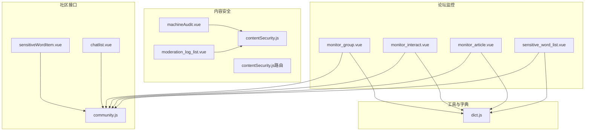
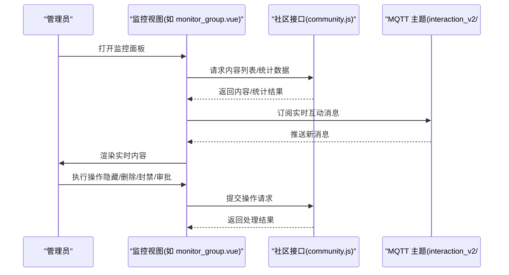
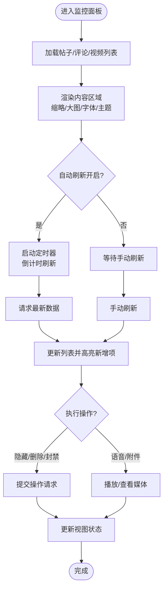
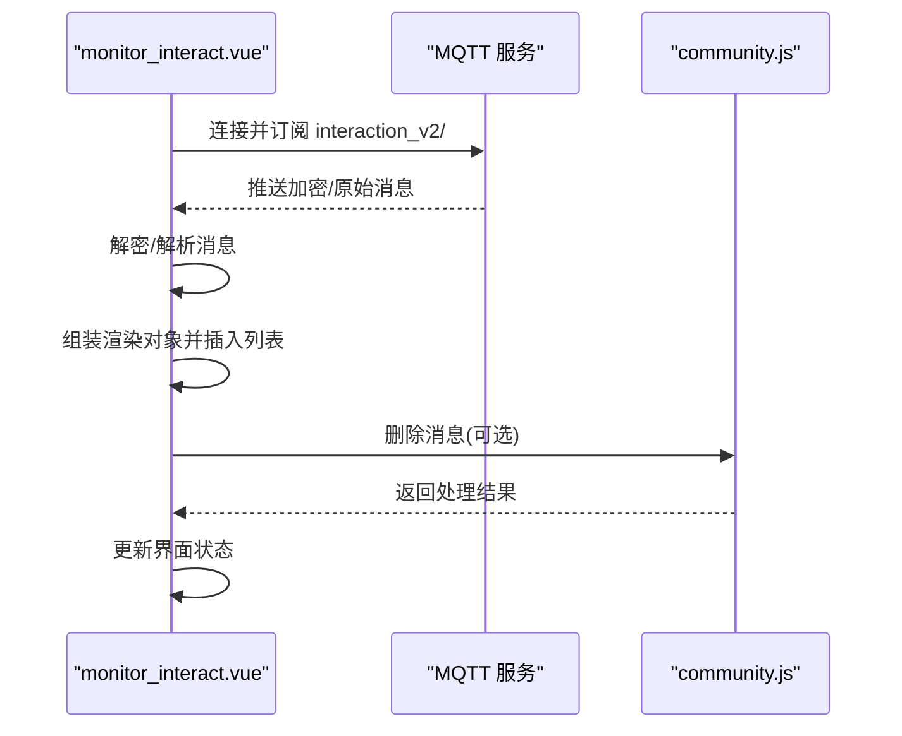
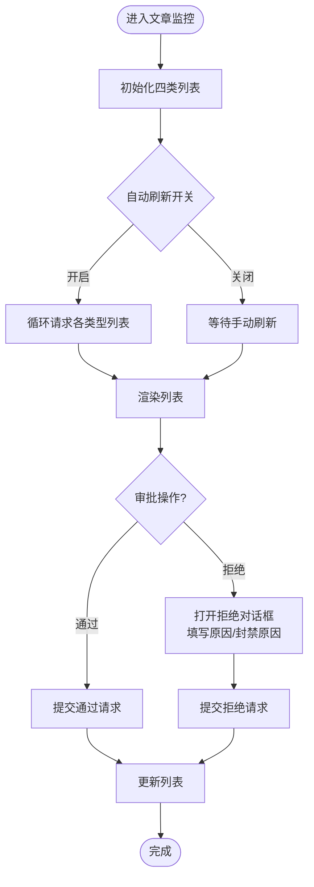
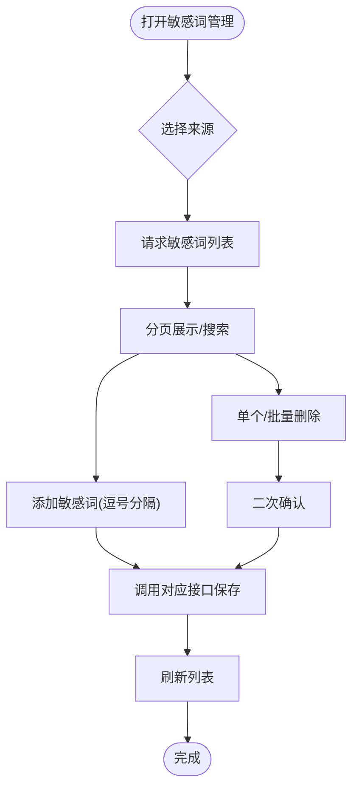
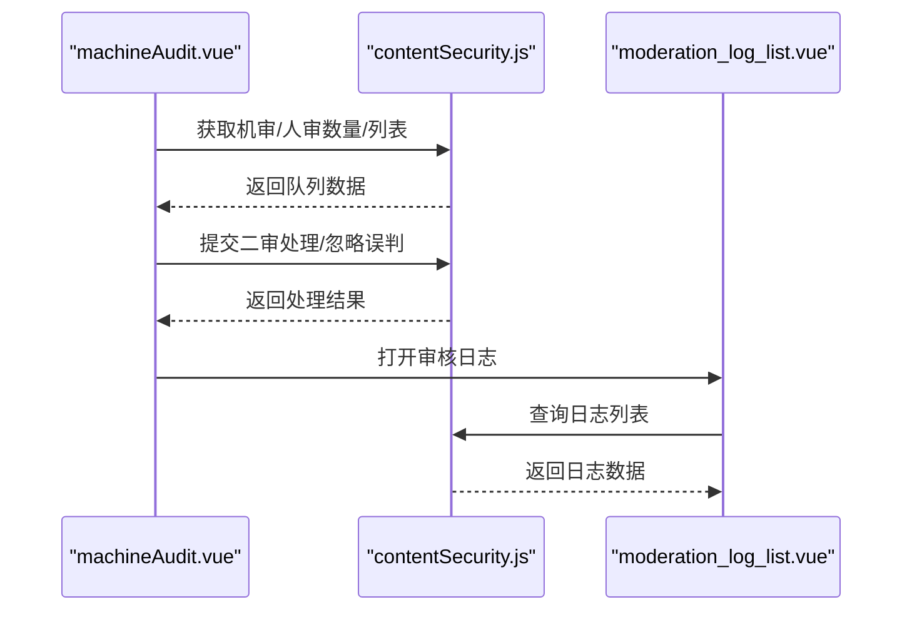
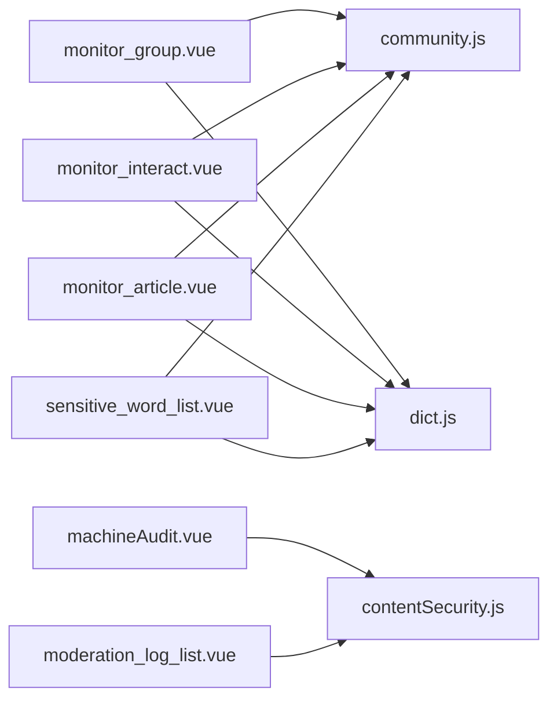

# 社区内容监控

<cite>
**本文引用的文件**
- [monitor_group.vue](file://src/views/forum/monitor_group.vue)
- [monitor_interact.vue](file://src/views/forum/monitor_interact.vue)
- [monitor_article.vue](file://src/views/forum/monitor_article.vue)
- [sensitive_word_list.vue](file://src/views/forum/sensitive_word_list.vue)
- [community.js](file://src/api/community.js)
- [contentSecurity.js](file://src/api/contentSecurity.js)
- [contentSecurity.js（路由）](file://src/router/children/contentSecurity.js)
- [dict.js](file://src/utils/dict.js)
- [sensitiveWordItem.vue](file://src/views/chat_room/sensitiveWordItem.vue)
- [chatlist.vue](file://src/views/chat_room/chatlist.vue)
- [machineAudit.vue](file://src/views/contentSecurity/machineAudit.vue)
- [moderation_log_list.vue](file://src/views/contentSecurity/moderation_log_list.vue)
- [monitor_group（第801行以后）](file://src/views/forum/monitor_group.vue)
- [monitor_group（第1067行以后）](file://src/views/forum/monitor_group.vue)
</cite>

## 目录
1. [引言](#引言)
2. [项目结构](#项目结构)
3. [核心组件](#核心组件)
4. [架构总览](#架构总览)
5. [详细组件分析](#详细组件分析)
6. [依赖关系分析](#依赖关系分析)
7. [性能考量](#性能考量)
8. [故障排查指南](#故障排查指南)
9. [结论](#结论)
10. [附录](#附录)

## 引言
本技术文档围绕“社区内容监控”能力进行系统化梳理，覆盖内容异常检测、违规内容识别、社区活跃度监控等核心功能，并结合现有前端实现，说明数据采集机制（实时内容抓取、用户行为追踪、社区动态分析）、监控规则配置与管理（关键词过滤、内容分类、风险评估）、监控数据可视化（实时监控面板、趋势分析图表、统计报表），以及如何将监控能力集成到现有系统中。同时提供最佳实践建议，帮助开发者优化监控效果与性能。

## 项目结构
社区内容监控功能主要分布在以下模块：
- 论坛监控视图：帖子/评论/直播互动监控
- 内容安全视图：机审/人审队列、敏感词管理、审核日志
- API 接口：社区内容、内容安全相关接口
- 工具与字典：权限、类型、敏感词提示等

**图表来源**
- [monitor_group.vue](file://src/views/forum/monitor_group.vue)
- [monitor_interact.vue](file://src/views/forum/monitor_interact.vue)
- [monitor_article.vue](file://src/views/forum/monitor_article.vue)
- [sensitive_word_list.vue](file://src/views/forum/sensitive_word_list.vue)
- [community.js](file://src/api/community.js)
- [contentSecurity.js](file://src/api/contentSecurity.js)
- [contentSecurity.js（路由）](file://src/router/children/contentSecurity.js)
- [sensitiveWordItem.vue](file://src/views/chat_room/sensitiveWordItem.vue)
- [chatlist.vue](file://src/views/chat_room/chatlist.vue)
- [dict.js](file://src/utils/dict.js)

**章节来源**
- [monitor_group.vue](file://src/views/forum/monitor_group.vue)
- [monitor_interact.vue](file://src/views/forum/monitor_interact.vue)
- [monitor_article.vue](file://src/views/forum/monitor_article.vue)
- [sensitive_word_list.vue](file://src/views/forum/sensitive_word_list.vue)
- [community.js](file://src/api/community.js)
- [contentSecurity.js](file://src/api/contentSecurity.js)
- [contentSecurity.js（路由）](file://src/router/children/contentSecurity.js)
- [dict.js](file://src/utils/dict.js)

## 核心组件
- 帖子/评论/视频监控面板：用于实时查看与处置异常内容，支持批量/单项操作、隐藏/删除/封禁、语音/图片附件查看、匹配关联内容等。
- 直播互动监控：订阅 MQTT 主题，实时接收并渲染互动消息，支持删除、禁言、红包详情等操作。
- 文章监控：按类型（单关/串关/预测/足彩）分栏展示，支持自动刷新、批量审批、拒绝与封禁。
- 敏感词管理：支持多源敏感词（社区、预测、资讯、推送）的增删查改与分页浏览。
- 内容安全：机审队列、人审队列、敏感词列表、审核日志，支撑违规内容识别与审计。

**章节来源**
- [monitor_group.vue](file://src/views/forum/monitor_group.vue)
- [monitor_interact.vue](file://src/views/forum/monitor_interact.vue)
- [monitor_article.vue](file://src/views/forum/monitor_article.vue)
- [sensitive_word_list.vue](file://src/views/forum/sensitive_word_list.vue)
- [community.js](file://src/api/community.js)
- [contentSecurity.js](file://src/api/contentSecurity.js)

## 架构总览
监控系统采用“前端视图 + API 接口 + MQTT 实时订阅”的架构：
- 前端视图负责展示与交互（帖子/评论/直播/文章/敏感词/内容安全）。
- API 接口提供内容列表、操作（隐藏/删除/封禁/审批）、统计与日志。
- MQTT 实时订阅用于直播互动消息的即时展示与处理。

**图表来源**
- [monitor_group.vue](file://src/views/forum/monitor_group.vue)
- [monitor_interact.vue](file://src/views/forum/monitor_interact.vue)
- [community.js](file://src/api/community.js)

## 详细组件分析

### 组件一：帖子/评论/视频监控面板（monitor_group）
- 功能要点
  - 分区域展示帖子、评论、待审核视频三类内容，支持缩略/大图模式切换、字体大小调整、主题色设置。
  - 实时高亮新增内容、等待删除/编辑标记，便于快速定位异常。
  - 支持批量/单项操作：隐藏、删除、封禁、封+删、查看详情、语音播放、附件查看。
  - 自动刷新开关与倒计时，提升监控效率。
- 数据流
  - 列表数据来源于社区接口，包含内容详情、用户信息、IP/位置、平台标识、附件与付费内容等。
  - 操作通过统一接口提交，返回后更新视图状态。
- 关键交互
  - 字体/模式切换、主题色设置、批量勾选、自动刷新、语音播放、附件查看、封禁/删除/隐藏等。

**图表来源**
- [monitor_group.vue](file://src/views/forum/monitor_group.vue)
- [community.js](file://src/api/community.js)

**章节来源**
- [monitor_group.vue](file://src/views/forum/monitor_group.vue)
- [monitor_group（第801行以后）](file://src/views/forum/monitor_group.vue)
- [monitor_group（第1067行以后）](file://src/views/forum/monitor_group.vue)

### 组件二：直播互动监控（monitor_interact）
- 功能要点
  - 通过 MQTT 订阅互动主题，实时接收并渲染消息（含红包、系统消息、普通文本等）。
  - 支持删除、禁言、红包详情查看、用户信息查看、主题色自定义。
  - 提供清空列表、字号切换、自动刷新等便捷操作。
- 数据流
  - 初始化时建立 MQTT 连接并订阅主题；收到消息后解密/解析，组装渲染对象并插入列表顶部。
  - 删除操作调用社区接口，删除后在界面上做视觉反馈与清理。

**图表来源**
- [monitor_interact.vue](file://src/views/forum/monitor_interact.vue)
- [community.js](file://src/api/community.js)

**章节来源**
- [monitor_interact.vue](file://src/views/forum/monitor_interact.vue)
- [chatlist.vue](file://src/views/chat_room/chatlist.vue)

### 组件三：文章监控（monitor_article）
- 功能要点
  - 按类型分栏展示（单关、串关、预测、足彩），支持自动刷新、批量审批、拒绝并隐藏/删除/封禁。
  - 提供文章详情查看、IP/位置信息、平台标识、匹配信息等辅助信息。
- 数据流
  - 各类型独立请求列表，支持独立开关自动刷新与倒计时。
  - 审批操作统一走检查接口，封禁操作根据类型调用不同接口。

**图表来源**
- [monitor_article.vue](file://src/views/forum/monitor_article.vue)

**章节来源**
- [monitor_article.vue](file://src/views/forum/monitor_article.vue)

### 组件四：敏感词管理（sensitive_word_list）
- 功能要点
  - 支持多源敏感词（社区、预测、资讯、推送），提供添加、删除、批量删除、精确/模糊搜索、分页浏览。
  - 依据权限控制操作按钮可见性。
- 数据流
  - 根据来源调用对应接口获取/添加/删除敏感词，接口返回后刷新本地列表。

**图表来源**
- [sensitive_word_list.vue](file://src/views/forum/sensitive_word_list.vue)
- [community.js](file://src/api/community.js)
- [sensitiveWordItem.vue](file://src/views/chat_room/sensitiveWordItem.vue)

**章节来源**
- [sensitive_word_list.vue](file://src/views/forum/sensitive_word_list.vue)
- [sensitiveWordItem.vue](file://src/views/chat_room/sensitiveWordItem.vue)

### 组件五：内容安全（机审/人审/日志）
- 机审队列：展示各类内容类型的待机审数量，支持自动刷新。
- 人审队列：按审核类型分页展示，支持二审处理、忽略误判等。
- 审核日志：展示操作记录与响应数据，支持导出与查看详情。

**图表来源**
- [machineAudit.vue](file://src/views/contentSecurity/machineAudit.vue)
- [moderation_log_list.vue](file://src/views/contentSecurity/moderation_log_list.vue)
- [contentSecurity.js](file://src/api/contentSecurity.js)

**章节来源**
- [machineAudit.vue](file://src/views/contentSecurity/machineAudit.vue)
- [moderation_log_list.vue](file://src/views/contentSecurity/moderation_log_list.vue)
- [contentSecurity.js](file://src/api/contentSecurity.js)
- [contentSecurity.js（路由）](file://src/router/children/contentSecurity.js)

## 依赖关系分析
- 视图与接口
  - monitor_group/monitor_interact/monitor_article/sensitive_word_list 均依赖 community.js 提供的内容与操作接口。
  - 内容安全视图依赖 contentSecurity.js 提供的机审/人审/日志接口。
- 实时数据
  - monitor_interact 通过 MQTT 订阅实时消息，与社区接口配合实现互动监控。
- 权限与字典
  - 视图通过权限控制按钮可见性，使用字典（如类型、平台图标、敏感词提示）提升用户体验。

**图表来源**
- [monitor_group.vue](file://src/views/forum/monitor_group.vue)
- [monitor_interact.vue](file://src/views/forum/monitor_interact.vue)
- [monitor_article.vue](file://src/views/forum/monitor_article.vue)
- [sensitive_word_list.vue](file://src/views/forum/sensitive_word_list.vue)
- [community.js](file://src/api/community.js)
- [contentSecurity.js](file://src/api/contentSecurity.js)
- [dict.js](file://src/utils/dict.js)

**章节来源**
- [monitor_group.vue](file://src/views/forum/monitor_group.vue)
- [monitor_interact.vue](file://src/views/forum/monitor_interact.vue)
- [monitor_article.vue](file://src/views/forum/monitor_article.vue)
- [sensitive_word_list.vue](file://src/views/forum/sensitive_word_list.vue)
- [community.js](file://src/api/community.js)
- [contentSecurity.js](file://src/api/contentSecurity.js)
- [dict.js](file://src/utils/dict.js)

## 性能考量
- 列表截断与滚动优化
  - 互动监控列表在长度超过阈值时进行截断，避免 DOM 过大影响性能。
- 自动刷新与倒计时
  - 通过定时器与倒计时减少不必要的轮询频率，降低接口压力。
- 媒体资源加载
  - 图片/视频/语音采用懒加载与查看器组件，减少初始渲染负担。
- MQTT 消息处理
  - 对消息进行解密与解析后再渲染，避免重复计算；删除/隐藏操作后及时更新界面状态，保持列表简洁。

**章节来源**
- [monitor_interact.vue](file://src/views/forum/monitor_interact.vue)
- [monitor_group.vue](file://src/views/forum/monitor_group.vue)

## 故障排查指南
- MQTT 连接失败
  - 检查 MQTT 服务器地址与订阅主题；确认连接初始化流程与错误处理逻辑。
  - 在销毁钩子中确保取消订阅，避免内存泄漏。
- 敏感词操作失败
  - 核对来源参数与对应接口；确认权限校验与二次确认流程。
- 审核日志为空
  - 检查查询参数与分页配置；确认接口返回码与数据结构。
- 列表卡顿
  - 检查自动刷新开关与倒计时逻辑；适当调整列表截断策略与渲染粒度。

**章节来源**
- [monitor_interact.vue](file://src/views/forum/monitor_interact.vue)
- [sensitive_word_list.vue](file://src/views/forum/sensitive_word_list.vue)
- [moderation_log_list.vue](file://src/views/contentSecurity/moderation_log_list.vue)

## 结论
本项目已形成较为完善的社区内容监控体系：实时互动监控、帖子/评论/文章内容监控、敏感词管理与内容安全审核。通过 API 接口与 MQTT 实时订阅，实现了高效的内容采集与处置；通过权限与字典增强，提升了可维护性与可用性。建议在后续迭代中进一步完善风险评估算法、扩展可视化维度（趋势分析、热力图等），并持续优化性能与稳定性。

## 附录
- 集成建议
  - 在现有路由中增加监控入口，统一接入权限校验。
  - 将敏感词管理与内容安全模块作为独立子系统，便于扩展与维护。
  - 对关键操作增加二次确认与审计日志，保障合规性。