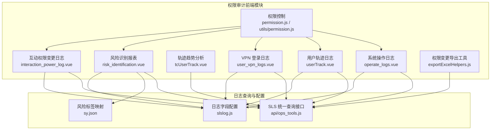
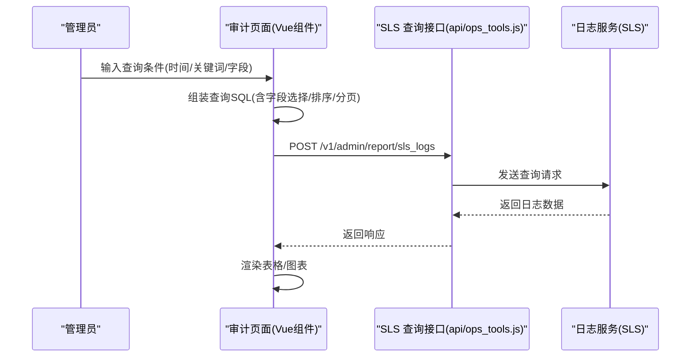
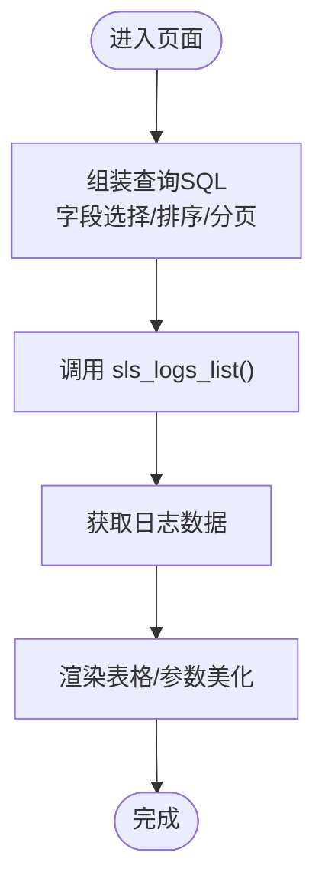
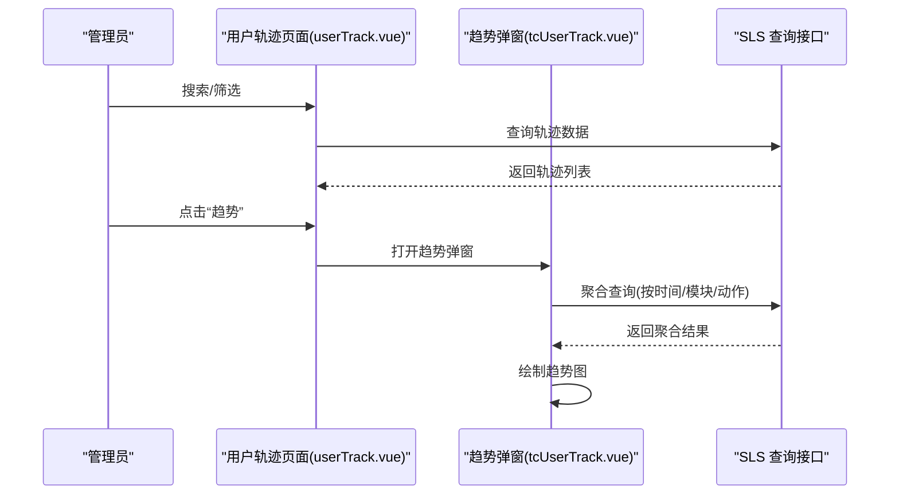
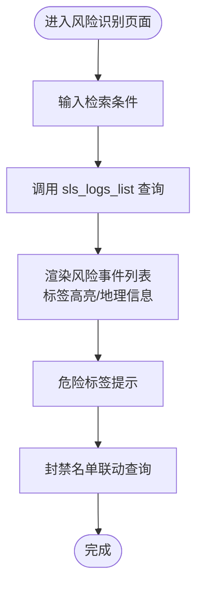
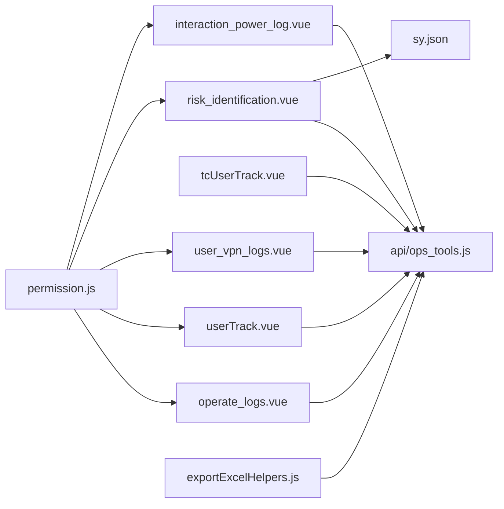

# 社区权限审计

<cite>
**本文引用的文件**   
- [src/views/system/operate_logs.vue](file://src/views/system/operate_logs.vue)
- [src/views/ops_tools/userTrack.vue](file://src/views/ops_tools/userTrack.vue)
- [src/views/ops_tools/tcUserTrack.vue](file://src/views/ops_tools/tcUserTrack.vue)
- [src/views/system/user_vpn_logs.vue](file://src/views/system/user_vpn_logs.vue)
- [src/views/ops_tools/risk_identification.vue](file://src/views/ops_tools/risk_identification.vue)
- [src/views/ops_tools/sy.json](file://src/views/ops_tools/sy.json)
- [src/views/ops_tools/collapse_logs.vue](file://src/views/ops_tools/collapse_logs.vue)
- [src/views/ops_tools/android_logs.vue](file://src/views/ops_tools/android_logs.vue)
- [src/views/ops_tools/slslog.js](file://src/components/newMySearch/components/searchTopKey/topKeyItem/slslog.js)
- [src/api/ops_tools.js](file://src/api/ops_tools.js)
- [src/store/modules/permission.js](file://src/store/modules/permission.js)
- [src/utils/permission.js](file://src/utils/permission.js)
- [src/views/forum/interaction_power_log.vue](file://src/views/forum/interaction_power_log.vue)
- [src/views/forum/interactive_user_list.vue](file://src/views/forum/interactive_user_list.vue)
- [src/views/member/equipmentLogin.vue](file://src/views/member/equipmentLogin.vue)
- [src/components/exportExcel/exportExcelHelpers.js](file://src/components/exportExcel/exportExcelHelpers.js)
</cite>

## 目录
1. [引言](#引言)
2. [项目结构](#项目结构)
3. [核心组件](#核心组件)
4. [架构总览](#架构总览)
5. [详细组件分析](#详细组件分析)
6. [依赖关系分析](#依赖关系分析)
7. [性能考量](#性能考量)
8. [故障排查指南](#故障排查指南)
9. [结论](#结论)
10. [附录](#附录)

## 引言
本技术文档围绕社区权限审计系统展开，聚焦于权限操作记录、权限变更追踪、权限使用分析与可视化展示。系统通过统一的日志查询接口对接多个日志库（如运营审计、用户轨迹、VPN 登录、风险识别、移动日志、崩溃日志等），实现权限相关事件的采集、检索、统计与可视化。文档同时提供审计配置示例与安全治理最佳实践，帮助构建完善的权限审计体系。

## 项目结构
围绕权限审计的关键前端模块与文件如下：
- 系统级审计日志：系统操作日志、VPN 登录日志
- 用户行为轨迹：用户轨迹日志、轨迹趋势分析
- 风险识别与封禁：风险识别报表、封禁名单联动
- 权限变更记录：互动权限变更日志、用户授权列表
- 日志查询与导出：统一 SLS 查询接口、导出工具
- 权限控制：前端路由与指令级权限校验

**图表来源**
- [src/views/system/operate_logs.vue](file://src/views/system/operate_logs.vue)
- [src/views/ops_tools/userTrack.vue](file://src/views/ops_tools/userTrack.vue)
- [src/views/ops_tools/tcUserTrack.vue](file://src/views/ops_tools/tcUserTrack.vue)
- [src/views/system/user_vpn_logs.vue](file://src/views/system/user_vpn_logs.vue)
- [src/views/ops_tools/risk_identification.vue](file://src/views/ops_tools/risk_identification.vue)
- [src/views/ops_tools/sy.json](file://src/views/ops_tools/sy.json)
- [src/components/exportExcel/exportExcelHelpers.js](file://src/components/exportExcel/exportExcelHelpers.js)
- [src/api/ops_tools.js](file://src/api/ops_tools.js)
- [src/components/newMySearch/components/searchTopKey/topKeyItem/slslog.js](file://src/components/newMySearch/components/searchTopKey/topKeyItem/slslog.js)
- [src/store/modules/permission.js](file://src/store/modules/permission.js)
- [src/utils/permission.js](file://src/utils/permission.js)

**章节来源**
- [src/views/system/operate_logs.vue](file://src/views/system/operate_logs.vue)
- [src/views/ops_tools/userTrack.vue](file://src/views/ops_tools/userTrack.vue)
- [src/views/ops_tools/tcUserTrack.vue](file://src/views/ops_tools/tcUserTrack.vue)
- [src/views/system/user_vpn_logs.vue](file://src/views/system/user_vpn_logs.vue)
- [src/views/ops_tools/risk_identification.vue](file://src/views/ops_tools/risk_identification.vue)
- [src/views/ops_tools/sy.json](file://src/views/ops_tools/sy.json)
- [src/components/exportExcel/exportExcelHelpers.js](file://src/components/exportExcel/exportExcelHelpers.js)
- [src/api/ops_tools.js](file://src/api/ops_tools.js)
- [src/components/newMySearch/components/searchTopKey/topKeyItem/slslog.js](file://src/components/newMySearch/components/searchTopKey/topKeyItem/slslog.js)
- [src/store/modules/permission.js](file://src/store/modules/permission.js)
- [src/utils/permission.js](file://src/utils/permission.js)

## 核心组件
- 统一日志查询接口：封装 SLS 查询请求，支持按时间范围、关键词、字段过滤与排序。
- 权限控制：基于角色的路由与指令级权限校验，确保用户只能访问具备权限的功能模块。
- 审计报表：系统操作日志、用户轨迹日志、VPN 登录日志、风险识别报表等。
- 权限变更追踪：互动权限变更日志与用户授权列表联动，支持批量审批与拒绝。
- 可视化与趋势：用户轨迹趋势分析，按模块/动作聚合统计并绘制折线图。
- 导出与分析：导出工具支持构建 SLS 查询体与计数查询，便于离线分析。

**章节来源**
- [src/api/ops_tools.js](file://src/api/ops_tools.js)
- [src/store/modules/permission.js](file://src/store/modules/permission.js)
- [src/utils/permission.js](file://src/utils/permission.js)
- [src/views/system/operate_logs.vue](file://src/views/system/operate_logs.vue)
- [src/views/ops_tools/userTrack.vue](file://src/views/ops_tools/userTrack.vue)
- [src/views/ops_tools/tcUserTrack.vue](file://src/views/ops_tools/tcUserTrack.vue)
- [src/views/system/user_vpn_logs.vue](file://src/views/system/user_vpn_logs.vue)
- [src/views/ops_tools/risk_identification.vue](file://src/views/ops_tools/risk_identification.vue)
- [src/views/forum/interaction_power_log.vue](file://src/views/forum/interaction_power_log.vue)
- [src/components/exportExcel/exportExcelHelpers.js](file://src/components/exportExcel/exportExcelHelpers.js)

## 架构总览
系统采用“前端查询 + 后端 SLS”架构，所有审计数据通过统一接口查询，前端负责筛选、排序、分页与可视化。

**图表来源**
- [src/views/system/operate_logs.vue](file://src/views/system/operate_logs.vue)
- [src/views/ops_tools/userTrack.vue](file://src/views/ops_tools/userTrack.vue)
- [src/views/system/user_vpn_logs.vue](file://src/views/system/user_vpn_logs.vue)
- [src/views/ops_tools/risk_identification.vue](file://src/views/ops_tools/risk_identification.vue)
- [src/api/ops_tools.js](file://src/api/ops_tools.js)

## 详细组件分析

### 系统操作日志（admin_log）
- 功能概述：展示后台用户的操作行为，包括操作人ID、IP、接口路径、操作描述与参数。
- 关键特性：
  - 支持按用户ID、IP、接口路径、操作描述、参数等字段检索。
  - 时间范围默认近7天，支持自定义时间区间。
  - 字段选择与排序，支持参数内容美化展示。
- 数据来源：logstore=admin_log，字段键列表由配置文件维护。

**图表来源**
- [src/views/system/operate_logs.vue](file://src/views/system/operate_logs.vue)
- [src/api/ops_tools.js](file://src/api/ops_tools.js)
- [src/components/newMySearch/components/searchTopKey/topKeyItem/slslog.js](file://src/components/newMySearch/components/searchTopKey/topKeyItem/slslog.js)

**章节来源**
- [src/views/system/operate_logs.vue](file://src/views/system/operate_logs.vue)
- [src/api/ops_tools.js](file://src/api/ops_tools.js)
- [src/components/newMySearch/components/searchTopKey/topKeyItem/slslog.js](file://src/components/newMySearch/components/searchTopKey/topKeyItem/slslog.js)

### 用户轨迹日志（track_log）
- 功能概述：记录用户在各模块的动作轨迹，支持按 UID、平台、渠道、版本、模块、动作、IP、设备ID 等检索。
- 关键特性：
  - 地理位置解析显示（运营商/省市区）。
  - 支持按时间排序与分页。
  - 提供“趋势”弹窗，按时间粒度聚合模块/动作并绘制趋势图。
- 数据来源：logstore=track_log。

**图表来源**
- [src/views/ops_tools/userTrack.vue](file://src/views/ops_tools/userTrack.vue)
- [src/views/ops_tools/tcUserTrack.vue](file://src/views/ops_tools/tcUserTrack.vue)
- [src/api/ops_tools.js](file://src/api/ops_tools.js)

**章节来源**
- [src/views/ops_tools/userTrack.vue](file://src/views/ops_tools/userTrack.vue)
- [src/views/ops_tools/tcUserTrack.vue](file://src/views/ops_tools/tcUserTrack.vue)
- [src/api/ops_tools.js](file://src/api/ops_tools.js)

### VPN 登录日志（vpn_log）
- 功能概述：展示用户通过 VPN 的登录/登出事件，包含内外网 IP、时长、上下行流量与数据包数。
- 关键特性：
  - 支持按时间、用户、内外网 IP、登录状态等检索。
  - 原始日志字段展示，便于溯源分析。
- 数据来源：logstore=vpn_log。

**章节来源**
- [src/views/system/user_vpn_logs.vue](file://src/views/system/user_vpn_logs.vue)
- [src/api/ops_tools.js](file://src/api/ops_tools.js)

### 风险识别报表（saf_log）
- 功能概述：展示风险识别事件，包含 req_id、实例 ID、来源、昵称、UID、分数、省份(IP)、标签等。
- 关键特性：
  - 标签高亮与危险标签提示，结合 sy.json 映射展示风险说明。
  - 支持按 UID、req_id、分数、tags、IP、手机号、来源等检索。
  - 提供封禁 IP/UID 列表联动查询。
- 数据来源：logstore=saf_log。

**图表来源**
- [src/views/ops_tools/risk_identification.vue](file://src/views/ops_tools/risk_identification.vue)
- [src/views/ops_tools/sy.json](file://src/views/ops_tools/sy.json)
- [src/api/ops_tools.js](file://src/api/ops_tools.js)

**章节来源**
- [src/views/ops_tools/risk_identification.vue](file://src/views/ops_tools/risk_identification.vue)
- [src/views/ops_tools/sy.json](file://src/views/ops_tools/sy.json)
- [src/api/ops_tools.js](file://src/api/ops_tools.js)

### 互动权限变更日志（community/interaction）
- 功能概述：记录用户互动权限的申请、通过、拒绝等变更，支持批量审批与拒绝。
- 关键特性：
  - 分类与状态标签展示，额外信息字段用于审计证据。
  - 与用户授权列表联动，支持查看与编辑授权。
- 数据来源：交互式查询与社区接口组合。

**章节来源**
- [src/views/forum/interaction_power_log.vue](file://src/views/forum/interaction_power_log.vue)
- [src/views/forum/interactive_user_list.vue](file://src/views/forum/interactive_user_list.vue)

### 设备登录日志（android_log / mobile_log）
- 功能概述：展示设备登录事件，支持按登录动作、时间、设备信息等检索。
- 关键特性：
  - 地理位置解析与分页排序。
  - 多日志库支持（android_log、mobile_log）。

**章节来源**
- [src/views/member/equipmentLogin.vue](file://src/views/member/equipmentLogin.vue)
- [src/views/ops_tools/android_logs.vue](file://src/views/ops_tools/android_logs.vue)
- [src/views/ops_tools/collapse_logs.vue](file://src/views/ops_tools/collapse_logs.vue)

### 权限控制与安全治理
- 路由级权限：根据角色动态生成可访问路由，未授权角色不可见对应菜单。
- 指令级权限：v-permission 指令控制按钮/组件可见性，避免越权操作。
- 最佳实践：
  - 严格最小权限原则，按角色分配审计模块访问权限。
  - 定期审查权限分配，清理长期未使用的账号。
  - 对高风险操作（封禁、批量审批）设置二次确认与审批链路。
  - 审计日志保留周期与合规要求一致，定期备份与归档。

**章节来源**
- [src/store/modules/permission.js](file://src/store/modules/permission.js)
- [src/utils/permission.js](file://src/utils/permission.js)

## 依赖关系分析

**图表来源**
- [src/views/system/operate_logs.vue](file://src/views/system/operate_logs.vue)
- [src/views/ops_tools/userTrack.vue](file://src/views/ops_tools/userTrack.vue)
- [src/views/ops_tools/tcUserTrack.vue](file://src/views/ops_tools/tcUserTrack.vue)
- [src/views/system/user_vpn_logs.vue](file://src/views/system/user_vpn_logs.vue)
- [src/views/ops_tools/risk_identification.vue](file://src/views/ops_tools/risk_identification.vue)
- [src/views/ops_tools/sy.json](file://src/views/ops_tools/sy.json)
- [src/views/forum/interaction_power_log.vue](file://src/views/forum/interaction_power_log.vue)
- [src/components/exportExcel/exportExcelHelpers.js](file://src/components/exportExcel/exportExcelHelpers.js)
- [src/api/ops_tools.js](file://src/api/ops_tools.js)
- [src/store/modules/permission.js](file://src/store/modules/permission.js)

**章节来源**
- [src/views/system/operate_logs.vue](file://src/views/system/operate_logs.vue)
- [src/views/ops_tools/userTrack.vue](file://src/views/ops_tools/userTrack.vue)
- [src/views/ops_tools/tcUserTrack.vue](file://src/views/ops_tools/tcUserTrack.vue)
- [src/views/system/user_vpn_logs.vue](file://src/views/system/user_vpn_logs.vue)
- [src/views/ops_tools/risk_identification.vue](file://src/views/ops_tools/risk_identification.vue)
- [src/views/ops_tools/sy.json](file://src/views/ops_tools/sy.json)
- [src/views/forum/interaction_power_log.vue](file://src/views/forum/interaction_power_log.vue)
- [src/components/exportExcel/exportExcelHelpers.js](file://src/components/exportExcel/exportExcelHelpers.js)
- [src/api/ops_tools.js](file://src/api/ops_tools.js)
- [src/store/modules/permission.js](file://src/store/modules/permission.js)

## 性能考量
- 查询优化
  - 使用字段选择与排序限制，减少传输与渲染压力。
  - 合理设置时间范围，避免全量扫描。
  - 先执行计数查询获取总量，再分页拉取明细。
- 可视化优化
  - 趋势图按时间粒度聚合，避免过多点位导致渲染卡顿。
  - 图表初始化与销毁需注意内存释放。
- 前端分页与懒加载
  - 表格组件支持高度自适应与滚动定位，提升大数据量体验。
- 导出与分析
  - 导出工具支持构建 SLS 查询体与计数查询，便于离线分析与报表生成。

[本节为通用指导，无需特定文件引用]

## 故障排查指南
- 无法查询到数据
  - 检查时间范围是否合理，确认 logstore 是否正确。
  - 确认检索关键词与字段是否匹配日志字段配置。
- 字段缺失或显示异常
  - 核对 slslog.js 中字段清单，确认字段是否存在。
  - 检查地理解析函数（如 ip_to_province）是否可用。
- 趋势图不显示
  - 确认聚合 SQL 是否正确，时间粒度是否与数据跨度匹配。
  - 检查图表初始化与容器尺寸。
- 权限不足
  - 确认角色是否具备相应菜单与指令权限。
  - 检查路由生成逻辑与指令绑定。

**章节来源**
- [src/views/system/operate_logs.vue](file://src/views/system/operate_logs.vue)
- [src/views/ops_tools/userTrack.vue](file://src/views/ops_tools/userTrack.vue)
- [src/views/ops_tools/tcUserTrack.vue](file://src/views/ops_tools/tcUserTrack.vue)
- [src/views/system/user_vpn_logs.vue](file://src/views/system/user_vpn_logs.vue)
- [src/views/ops_tools/risk_identification.vue](file://src/views/ops_tools/risk_identification.vue)
- [src/components/newMySearch/components/searchTopKey/topKeyItem/slslog.js](file://src/components/newMySearch/components/searchTopKey/topKeyItem/slslog.js)
- [src/store/modules/permission.js](file://src/store/modules/permission.js)
- [src/utils/permission.js](file://src/utils/permission.js)

## 结论
本系统通过统一的 SLS 查询接口与丰富的前端组件，实现了权限操作记录、权限变更追踪与使用分析的闭环。配合权限控制与风险识别能力，能够满足社区权限审计的合规与安全需求。建议持续完善字段配置、优化查询性能，并结合业务实际制定审计策略与处置流程。

[本节为总结，无需特定文件引用]

## 附录

### 审计配置示例（字段与查询）
- 系统操作日志（admin_log）
  - 字段清单参考：[slslog.js](file://src/components/newMySearch/components/searchTopKey/topKeyItem/slslog.js)
  - 查询要点：限定字段、排序、分页；参数字段美化展示。
- 用户轨迹日志（track_log）
  - 字段清单参考：[slslog.js](file://src/components/newMySearch/components/searchTopKey/topKeyItem/slslog.js)
  - 查询要点：地理位置解析、模块/动作聚合、时间粒度选择。
- VPN 登录日志（vpn_log）
  - 字段清单参考：[slslog.js](file://src/components/newMySearch/components/searchTopKey/topKeyItem/slslog.js)
  - 查询要点：内外网 IP、登录状态、流量统计。
- 风险识别报表（saf_log）
  - 字段清单参考：[slslog.js](file://src/components/newMySearch/components/searchTopKey/topKeyItem/slslog.js)
  - 查询要点：标签高亮、危险标签提示、封禁名单联动。
- 互动权限变更日志（community）
  - 查询要点：分类与状态标签、额外信息字段、授权列表联动。
- 设备登录日志（android_log / mobile_log）
  - 查询要点：登录动作、设备信息、地理位置解析。

**章节来源**
- [src/components/newMySearch/components/searchTopKey/topKeyItem/slslog.js](file://src/components/newMySearch/components/searchTopKey/topKeyItem/slslog.js)
- [src/views/system/operate_logs.vue](file://src/views/system/operate_logs.vue)
- [src/views/ops_tools/userTrack.vue](file://src/views/ops_tools/userTrack.vue)
- [src/views/system/user_vpn_logs.vue](file://src/views/system/user_vpn_logs.vue)
- [src/views/ops_tools/risk_identification.vue](file://src/views/ops_tools/risk_identification.vue)
- [src/views/forum/interaction_power_log.vue](file://src/views/forum/interaction_power_log.vue)
- [src/views/member/equipmentLogin.vue](file://src/views/member/equipmentLogin.vue)

### 审计数据分析与可视化
- 权限使用趋势
  - 使用用户轨迹趋势组件按模块/动作聚合统计，绘制折线图。
- 异常操作检测
  - 风险识别报表结合 sy.json 映射与危险标签提示，辅助识别高风险事件。
- 统计图表
  - 表格列头支持排序与固定列，便于横向对比与纵向追踪。

**章节来源**
- [src/views/ops_tools/tcUserTrack.vue](file://src/views/ops_tools/tcUserTrack.vue)
- [src/views/ops_tools/risk_identification.vue](file://src/views/ops_tools/risk_identification.vue)

### 权限安全治理最佳实践
- 最小权限原则：仅授予必要功能与数据访问权限。
- 审批与复核：对高风险操作设置审批链路与二次确认。
- 定期审计：定期检查权限分配与操作日志，识别异常行为。
- 合规保留：遵循法规要求设定日志保留周期与归档策略。
- 培训与意识：加强管理员与运营人员的安全意识与操作规范。

[本节为通用指导，无需特定文件引用]