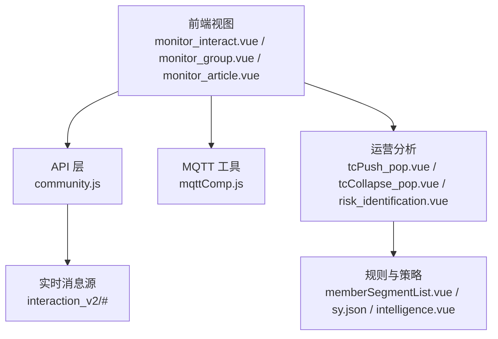
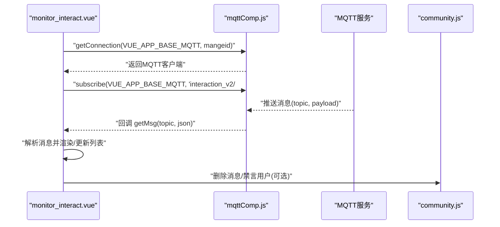
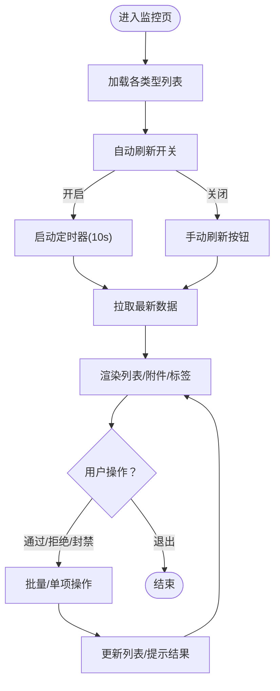
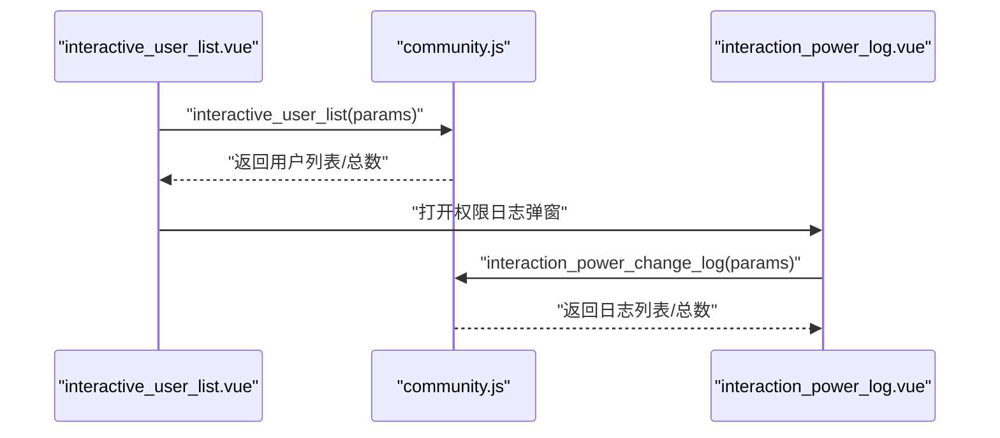
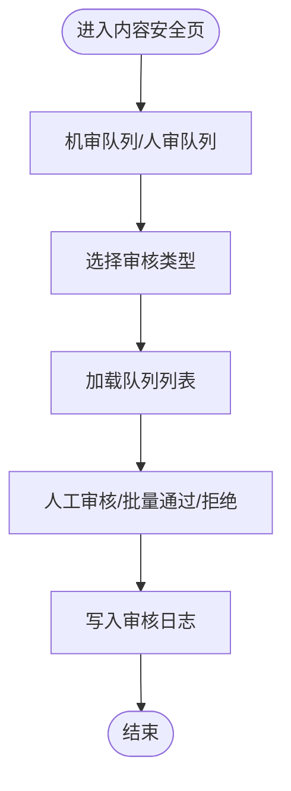
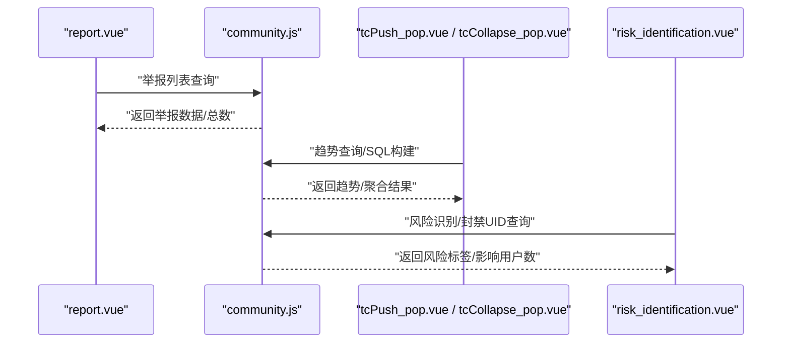
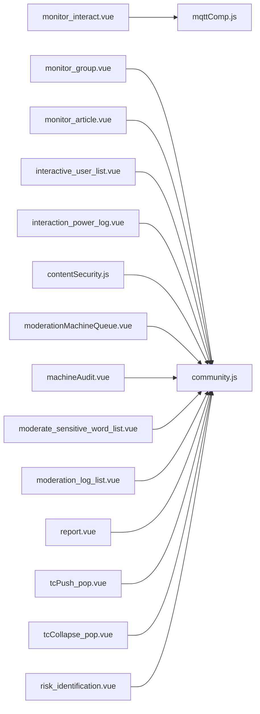

# 社区监控

<cite>
**本文引用的文件**   
- [monitor_interact.vue](file://src/views/forum/monitor_interact.vue)
- [monitor_article.vue](file://src/views/forum/monitor_article.vue)
- [monitor_group.vue](file://src/views/forum/monitor_group.vue)
- [community.js](file://src/api/community.js)
- [mqttComp.js](file://src/utils/mqttComp.js)
- [report.vue](file://src/views/chat_room/report.vue)
- [interactive_user_list.vue](file://src/views/forum/interactive_user_list.vue)
- [interaction_power_log.vue](file://src/views/forum/interaction_power_log.vue)
- [contentSecurity.js](file://src/router/children/contentSecurity.js)
- [moderationMachineQueue.vue](file://src/views/contentSecurity/moderationMachineQueue.vue)
- [machineAudit.vue](file://src/views/contentSecurity/machineAudit.vue)
- [moderate_sensitive_word_list.vue](file://src/views/contentSecurity/moderate_sensitive_word_list.vue)
- [moderation_log_list.vue](file://src/views/contentSecurity/moderation_log_list.vue)
- [tcPush_pop.vue](file://src/views/ops_tools/tcPush_pop.vue)
- [tcCollapse_pop.vue](file://src/views/ops_tools/tcCollapse_pop.vue)
- [risk_identification.vue](file://src/views/ops_tools/risk_identification.vue)
- [sy.json](file://src/views/ops_tools/sy.json)
- [memberSegmentList.vue](file://src/views/member/memberSegmentList.vue)
- [intelligence.vue](file://src/views/intelligence/intelligence.vue)
</cite>

## 目录
1. [引言](#引言)
2. [项目结构](#项目结构)
3. [核心组件](#核心组件)
4. [架构总览](#架构总览)
5. [详细组件分析](#详细组件分析)
6. [依赖分析](#依赖分析)
7. [性能考虑](#性能考虑)
8. [故障排查指南](#故障排查指南)
9. [结论](#结论)
10. [附录](#附录)

## 引言
本技术文档围绕社区监控系统展开，覆盖社区内容监控、自媒体审核、直播间监控、互动权限管理与举报处理等关键能力。文档从系统架构、数据流、异常检测与告警机制、规则配置、可视化展示以及最佳实践等方面进行深入说明，并提供可直接定位到源码路径的参考，帮助开发者快速实现与扩展监控功能。

## 项目结构
社区监控相关模块主要分布在以下目录与文件：
- 论坛监控视图：帖子/评论/文章监控、直播互动监控、互动权限与日志
- 内容安全：机审/人审队列、敏感词管理、审核日志
- 实时通信：MQTT 工具类封装，统一连接、订阅、消息分发
- 运营工具：推送/崩溃趋势分析、风险识别、规则与策略配置
- API 接口：统一封装社区、聊天室、内容安全等监控相关接口

```mermaid
graph TB
subgraph "论坛监控"
F1["monitor_group.vue<br/>帖子/评论监控"]
F2["monitor_article.vue<br/>文章监控"]
F3["monitor_interact.vue<br/>直播互动监控"]
F4["interactive_user_list.vue<br/>直播用户列表"]
F5["interaction_power_log.vue<br/>互动权限日志"]
F6["report.vue<br/>聊天室举报列表"]
end
subgraph "内容安全"
C1["contentSecurity.js<br/>路由入口"]
C2["moderationMachineQueue.vue<br/>机审队列"]
C3["machineAudit.vue<br/>人审队列"]
C4["moderate_sensitive_word_list.vue<br/>进审敏感词"]
C5["moderation_log_list.vue<br/>审核日志"]
end
subgraph "实时通信"
M1["mqttComp.js<br/>MQTT连接池/订阅/分发"]
end
subgraph "运营工具"
O1["tcPush_pop.vue<br/>推送趋势分析"]
O2["tcCollapse_pop.vue<br/>崩溃趋势分析"]
O3["risk_identification.vue<br/>风险识别"]
O4["sy.json<br/>规则说明"]
O5["memberSegmentList.vue<br/>规则/标签配置"]
O6["intelligence.vue<br/>时间衰减规则示例"]
end
subgraph "API"
A1["community.js<br/>社区监控接口"]
end
F3 --> M1
F1 --> A1
F2 --> A1
F4 --> A1
F5 --> A1
F6 --> A1
C2 --> A1
C3 --> A1
C4 --> A1
C5 --> A1
O1 --> A1
O2 --> A1
O3 --> A1
O5 --> A1
O6 --> A1
```

图表来源
- [monitor_interact.vue:1-749](file://src/views/forum/monitor_interact.vue#L1-L749)
- [monitor_group.vue:1-800](file://src/views/forum/monitor_group.vue#L1-L800)
- [monitor_article.vue:1-689](file://src/views/forum/monitor_article.vue#L1-L689)
- [interactive_user_list.vue:386-517](file://src/views/forum/interactive_user_list.vue#L386-L517)
- [interaction_power_log.vue:104-247](file://src/views/forum/interaction_power_log.vue#L104-L247)
- [report.vue:1-148](file://src/views/chat_room/report.vue#L1-L148)
- [contentSecurity.js:1-43](file://src/router/children/contentSecurity.js#L1-L43)
- [moderationMachineQueue.vue:1-20](file://src/views/contentSecurity/moderationMachineQueue.vue#L1-L20)
- [machineAudit.vue:43-86](file://src/views/contentSecurity/machineAudit.vue#L43-L86)
- [moderate_sensitive_word_list.vue:1-22](file://src/views/contentSecurity/moderate_sensitive_word_list.vue#L1-L22)
- [moderation_log_list.vue:1-200](file://src/views/contentSecurity/moderation_log_list.vue#L1-L200)
- [mqttComp.js:1-564](file://src/utils/mqttComp.js#L1-L564)
- [community.js:1-676](file://src/api/community.js#L1-L676)
- [tcPush_pop.vue:105-128](file://src/views/ops_tools/tcPush_pop.vue#L105-L128)
- [tcCollapse_pop.vue:124-164](file://src/views/ops_tools/tcCollapse_pop.vue#L124-L164)
- [risk_identification.vue:137-169](file://src/views/ops_tools/risk_identification.vue#L137-L169)
- [sy.json:52-81](file://src/views/ops_tools/sy.json#L52-L81)
- [memberSegmentList.vue:69-95](file://src/views/member/memberSegmentList.vue#L69-L95)
- [intelligence.vue:1206-1223](file://src/views/intelligence/intelligence.vue#L1206-L1223)

章节来源
- [monitor_interact.vue:1-749](file://src/views/forum/monitor_interact.vue#L1-L749)
- [monitor_group.vue:1-800](file://src/views/forum/monitor_group.vue#L1-L800)
- [monitor_article.vue:1-689](file://src/views/forum/monitor_article.vue#L1-L689)
- [interactive_user_list.vue:386-517](file://src/views/forum/interactive_user_list.vue#L386-L517)
- [interaction_power_log.vue:104-247](file://src/views/forum/interaction_power_log.vue#L104-L247)
- [report.vue:1-148](file://src/views/chat_room/report.vue#L1-L148)
- [contentSecurity.js:1-43](file://src/router/children/contentSecurity.js#L1-L43)
- [moderationMachineQueue.vue:1-20](file://src/views/contentSecurity/moderationMachineQueue.vue#L1-L20)
- [machineAudit.vue:43-86](file://src/views/contentSecurity/machineAudit.vue#L43-L86)
- [moderate_sensitive_word_list.vue:1-22](file://src/views/contentSecurity/moderate_sensitive_word_list.vue#L1-L22)
- [moderation_log_list.vue:1-200](file://src/views/contentSecurity/moderation_log_list.vue#L1-L200)
- [mqttComp.js:1-564](file://src/utils/mqttComp.js#L1-L564)
- [community.js:1-676](file://src/api/community.js#L1-L676)
- [tcPush_pop.vue:105-128](file://src/views/ops_tools/tcPush_pop.vue#L105-L128)
- [tcCollapse_pop.vue:124-164](file://src/views/ops_tools/tcCollapse_pop.vue#L124-L164)
- [risk_identification.vue:137-169](file://src/views/ops_tools/risk_identification.vue#L137-L169)
- [sy.json:52-81](file://src/views/ops_tools/sy.json#L52-L81)
- [memberSegmentList.vue:69-95](file://src/views/member/memberSegmentList.vue#L69-L95)
- [intelligence.vue:1206-1223](file://src/views/intelligence/intelligence.vue#L1206-L1223)

## 核心组件
- 实时监控面板（直播互动）
  - 通过 MQTT 接收交互消息，动态渲染弹幕、红包、系统消息等，支持删除、禁言、主题色切换等操作。
  - 关键实现参考：[monitor_interact.vue:388-749](file://src/views/forum/monitor_interact.vue#L388-L749)，[mqttComp.js:14-97](file://src/utils/mqttComp.js#L14-L97)

- 帖子/评论/文章监控
  - 帖子/评论监控：按类型分栏展示，支持隐藏/删除/封禁、批量操作、自动刷新、IP/位置信息展示。
  - 文章监控：按文章类型（单关/串关/预测/足彩）分栏，支持审批、拒绝并隐藏/删除/封禁。
  - 关键实现参考：[monitor_group.vue:527-800](file://src/views/forum/monitor_group.vue#L527-L800)，[monitor_article.vue:149-689](file://src/views/forum/monitor_article.vue#L149-L689)

- 互动权限管理与日志
  - 互动用户列表：查询有直播权限的用户，支持增删权限、批量操作、导出日志。
  - 权限变更日志：记录权限申请、变更、拒绝等操作，支持排序与筛选。
  - 关键实现参考：[interactive_user_list.vue:386-517](file://src/views/forum/interactive_user_list.vue#L386-L517)，[interaction_power_log.vue:104-247](file://src/views/forum/interaction_power_log.vue#L104-L247)

- 内容安全与敏感词
  - 机审队列/人审队列：按审核类型分页展示，支持自动刷新与角标统计。
  - 进审敏感词：敏感词管理与审核联动。
  - 审核日志：记录审核操作与结果。
  - 关键实现参考：[contentSecurity.js:1-43](file://src/router/children/contentSecurity.js#L1-L43)，[moderationMachineQueue.vue:1-20](file://src/views/contentSecurity/moderationMachineQueue.vue#L1-L20)，[machineAudit.vue:43-86](file://src/views/contentSecurity/machineAudit.vue#L43-L86)，[moderate_sensitive_word_list.vue:1-22](file://src/views/contentSecurity/moderate_sensitive_word_list.vue#L1-L22)，[moderation_log_list.vue:1-200](file://src/views/contentSecurity/moderation_log_list.vue#L1-L200)

- 举报与风控
  - 聊天室举报列表：按类型、举报人、被举报人、IP 等维度展示。
  - 风险识别与趋势分析：推送/崩溃趋势、风险标签、影响用户数统计。
  - 关键实现参考：[report.vue:1-148](file://src/views/chat_room/report.vue#L1-L148)，[tcPush_pop.vue:105-128](file://src/views/ops_tools/tcPush_pop.vue#L105-L128)，[tcCollapse_pop.vue:124-164](file://src/views/ops_tools/tcCollapse_pop.vue#L124-L164)，[risk_identification.vue:137-169](file://src/views/ops_tools/risk_identification.vue#L137-L169)

章节来源
- [monitor_interact.vue:388-749](file://src/views/forum/monitor_interact.vue#L388-L749)
- [monitor_group.vue:527-800](file://src/views/forum/monitor_group.vue#L527-L800)
- [monitor_article.vue:149-689](file://src/views/forum/monitor_article.vue#L149-L689)
- [interactive_user_list.vue:386-517](file://src/views/forum/interactive_user_list.vue#L386-L517)
- [interaction_power_log.vue:104-247](file://src/views/forum/interaction_power_log.vue#L104-L247)
- [contentSecurity.js:1-43](file://src/router/children/contentSecurity.js#L1-L43)
- [moderationMachineQueue.vue:1-20](file://src/views/contentSecurity/moderationMachineQueue.vue#L1-L20)
- [machineAudit.vue:43-86](file://src/views/contentSecurity/machineAudit.vue#L43-L86)
- [moderate_sensitive_word_list.vue:1-22](file://src/views/contentSecurity/moderate_sensitive_word_list.vue#L1-L22)
- [moderation_log_list.vue:1-200](file://src/views/contentSecurity/moderation_log_list.vue#L1-L200)
- [report.vue:1-148](file://src/views/chat_room/report.vue#L1-L148)
- [tcPush_pop.vue:105-128](file://src/views/ops_tools/tcPush_pop.vue#L105-L128)
- [tcCollapse_pop.vue:124-164](file://src/views/ops_tools/tcCollapse_pop.vue#L124-L164)
- [risk_identification.vue:137-169](file://src/views/ops_tools/risk_identification.vue#L137-L169)

## 架构总览
系统采用“前端视图 + 统一API + 实时MQTT + 运营分析”的分层架构：
- 前端视图层：Vue 组件负责展示与交互（监控面板、列表、表格、弹窗等）
- API 层：封装社区、内容安全、聊天室、运营工具等接口
- 实时层：MQTT 工具类统一管理连接、订阅、消息分发
- 分析层：SLA/趋势分析组件与规则配置页面

图表来源
- [monitor_interact.vue:388-749](file://src/views/forum/monitor_interact.vue#L388-L749)
- [monitor_group.vue:527-800](file://src/views/forum/monitor_group.vue#L527-L800)
- [monitor_article.vue:149-689](file://src/views/forum/monitor_article.vue#L149-L689)
- [community.js:1-676](file://src/api/community.js#L1-L676)
- [mqttComp.js:1-564](file://src/utils/mqttComp.js#L1-L564)
- [tcPush_pop.vue:105-128](file://src/views/ops_tools/tcPush_pop.vue#L105-L128)
- [tcCollapse_pop.vue:124-164](file://src/views/ops_tools/tcCollapse_pop.vue#L124-L164)
- [risk_identification.vue:137-169](file://src/views/ops_tools/risk_identification.vue#L137-L169)
- [memberSegmentList.vue:69-95](file://src/views/member/memberSegmentList.vue#L69-L95)
- [sy.json:52-81](file://src/views/ops_tools/sy.json#L52-L81)
- [intelligence.vue:1206-1223](file://src/views/intelligence/intelligence.vue#L1206-L1223)

## 详细组件分析

### 直播间互动监控（实时）
- 功能要点
  - 通过 MQTT 订阅 interaction_v2/#，接收弹幕、红包、系统消息等
  - 支持删除消息、禁言用户、查看用户详情、红包明细
  - 支持字号切换、主题色自定义、清空列表
- 关键流程（序列图）

图表来源
- [monitor_interact.vue:462-472](file://src/views/forum/monitor_interact.vue#L462-L472)
- [mqttComp.js:115-166](file://src/utils/mqttComp.js#L115-L166)
- [community.js:170-176](file://src/api/community.js#L170-L176)

章节来源
- [monitor_interact.vue:388-749](file://src/views/forum/monitor_interact.vue#L388-L749)
- [mqttComp.js:115-166](file://src/utils/mqttComp.js#L115-L166)
- [community.js:170-176](file://src/api/community.js#L170-L176)

### 帖子/评论/文章监控（批处理与审批）
- 功能要点
  - 分栏展示不同类型内容，支持勾选、批量审批/拒绝/封禁
  - 自动刷新定时器与倒计时控制
  - IP/位置信息、平台图标、类型标签、附件/图片预览
- 流程（流程图）

图表来源
- [monitor_group.vue:527-800](file://src/views/forum/monitor_group.vue#L527-L800)
- [monitor_article.vue:149-689](file://src/views/forum/monitor_article.vue#L149-L689)

章节来源
- [monitor_group.vue:527-800](file://src/views/forum/monitor_group.vue#L527-L800)
- [monitor_article.vue:149-689](file://src/views/forum/monitor_article.vue#L149-L689)

### 互动权限管理与日志
- 功能要点
  - 查询有直播权限的用户，支持增删权限、批量操作
  - 权限变更日志：记录 UID、分类、操作类型、时间、原因等
- 流程（序列图）

图表来源
- [interactive_user_list.vue:386-517](file://src/views/forum/interactive_user_list.vue#L386-L517)
- [interaction_power_log.vue:104-247](file://src/views/forum/interaction_power_log.vue#L104-L247)
- [community.js:198-205](file://src/api/community.js#L198-L205)

章节来源
- [interactive_user_list.vue:386-517](file://src/views/forum/interactive_user_list.vue#L386-L517)
- [interaction_power_log.vue:104-247](file://src/views/forum/interaction_power_log.vue#L104-L247)
- [community.js:198-205](file://src/api/community.js#L198-L205)

### 内容安全与敏感词
- 功能要点
  - 机审/人审队列：按审核类型分页，支持角标与自动刷新
  - 敏感词管理：进审敏感词列表与操作
  - 审核日志：记录审核动作与结果
- 流程（流程图）

图表来源
- [contentSecurity.js:1-43](file://src/router/children/contentSecurity.js#L1-L43)
- [moderationMachineQueue.vue:1-20](file://src/views/contentSecurity/moderationMachineQueue.vue#L1-L20)
- [machineAudit.vue:43-86](file://src/views/contentSecurity/machineAudit.vue#L43-L86)
- [moderate_sensitive_word_list.vue:1-22](file://src/views/contentSecurity/moderate_sensitive_word_list.vue#L1-L22)
- [moderation_log_list.vue:1-200](file://src/views/contentSecurity/moderation_log_list.vue#L1-L200)

章节来源
- [contentSecurity.js:1-43](file://src/router/children/contentSecurity.js#L1-L43)
- [moderationMachineQueue.vue:1-20](file://src/views/contentSecurity/moderationMachineQueue.vue#L1-L20)
- [machineAudit.vue:43-86](file://src/views/contentSecurity/machineAudit.vue#L43-L86)
- [moderate_sensitive_word_list.vue:1-22](file://src/views/contentSecurity/moderate_sensitive_word_list.vue#L1-L22)
- [moderation_log_list.vue:1-200](file://src/views/contentSecurity/moderation_log_list.vue#L1-L200)

### 举报与风控分析
- 功能要点
  - 聊天室举报列表：按类型、举报人、被举报人、IP 等维度展示
  - 风险识别：推送/崩溃趋势、风险标签、影响用户数统计
- 流程（序列图）

图表来源
- [report.vue:1-148](file://src/views/chat_room/report.vue#L1-L148)
- [community.js:353-368](file://src/api/community.js#L353-L368)
- [tcPush_pop.vue:105-128](file://src/views/ops_tools/tcPush_pop.vue#L105-L128)
- [tcCollapse_pop.vue:124-164](file://src/views/ops_tools/tcCollapse_pop.vue#L124-L164)
- [risk_identification.vue:137-169](file://src/views/ops_tools/risk_identification.vue#L137-L169)

章节来源
- [report.vue:1-148](file://src/views/chat_room/report.vue#L1-L148)
- [community.js:353-368](file://src/api/community.js#L353-L368)
- [tcPush_pop.vue:105-128](file://src/views/ops_tools/tcPush_pop.vue#L105-L128)
- [tcCollapse_pop.vue:124-164](file://src/views/ops_tools/tcCollapse_pop.vue#L124-L164)
- [risk_identification.vue:137-169](file://src/views/ops_tools/risk_identification.vue#L137-L169)

## 依赖分析
- 组件耦合
  - monitor_interact.vue 依赖 mqttComp.js 提供的统一 MQTT 管理
  - 各监控列表组件依赖 community.js 的统一 API 封装
  - 运营分析组件依赖各自 API 与 SLA 查询接口
- 外部依赖
  - MQTT 服务：用于实时消息订阅与分发
  - 后端接口：统一的社区、内容安全、举报、权限等接口

图表来源
- [monitor_interact.vue:388-749](file://src/views/forum/monitor_interact.vue#L388-L749)
- [monitor_group.vue:527-800](file://src/views/forum/monitor_group.vue#L527-L800)
- [monitor_article.vue:149-689](file://src/views/forum/monitor_article.vue#L149-L689)
- [interactive_user_list.vue:386-517](file://src/views/forum/interactive_user_list.vue#L386-L517)
- [interaction_power_log.vue:104-247](file://src/views/forum/interaction_power_log.vue#L104-L247)
- [contentSecurity.js:1-43](file://src/router/children/contentSecurity.js#L1-L43)
- [moderationMachineQueue.vue:1-20](file://src/views/contentSecurity/moderationMachineQueue.vue#L1-L20)
- [machineAudit.vue:43-86](file://src/views/contentSecurity/machineAudit.vue#L43-L86)
- [moderate_sensitive_word_list.vue:1-22](file://src/views/contentSecurity/moderate_sensitive_word_list.vue#L1-L22)
- [moderation_log_list.vue:1-200](file://src/views/contentSecurity/moderation_log_list.vue#L1-L200)
- [report.vue:1-148](file://src/views/chat_room/report.vue#L1-L148)
- [tcPush_pop.vue:105-128](file://src/views/ops_tools/tcPush_pop.vue#L105-L128)
- [tcCollapse_pop.vue:124-164](file://src/views/ops_tools/tcCollapse_pop.vue#L124-L164)
- [risk_identification.vue:137-169](file://src/views/ops_tools/risk_identification.vue#L137-L169)
- [community.js:1-676](file://src/api/community.js#L1-L676)

章节来源
- [monitor_interact.vue:388-749](file://src/views/forum/monitor_interact.vue#L388-L749)
- [monitor_group.vue:527-800](file://src/views/forum/monitor_group.vue#L527-L800)
- [monitor_article.vue:149-689](file://src/views/forum/monitor_article.vue#L149-L689)
- [interactive_user_list.vue:386-517](file://src/views/forum/interactive_user_list.vue#L386-L517)
- [interaction_power_log.vue:104-247](file://src/views/forum/interaction_power_log.vue#L104-L247)
- [contentSecurity.js:1-43](file://src/router/children/contentSecurity.js#L1-L43)
- [moderationMachineQueue.vue:1-20](file://src/views/contentSecurity/moderationMachineQueue.vue#L1-L20)
- [machineAudit.vue:43-86](file://src/views/contentSecurity/machineAudit.vue#L43-L86)
- [moderate_sensitive_word_list.vue:1-22](file://src/views/contentSecurity/moderate_sensitive_word_list.vue#L1-L22)
- [moderation_log_list.vue:1-200](file://src/views/contentSecurity/moderation_log_list.vue#L1-L200)
- [report.vue:1-148](file://src/views/chat_room/report.vue#L1-L148)
- [tcPush_pop.vue:105-128](file://src/views/ops_tools/tcPush_pop.vue#L105-L128)
- [tcCollapse_pop.vue:124-164](file://src/views/ops_tools/tcCollapse_pop.vue#L124-L164)
- [risk_identification.vue:137-169](file://src/views/ops_tools/risk_identification.vue#L137-L169)
- [community.js:1-676](file://src/api/community.js#L1-L676)

## 性能考虑
- 实时订阅优化
  - 使用 MQTT 连接池与场景化订阅，避免重复订阅与全局风暴
  - 通配符订阅优先，减少服务器压力
- 列表渲染优化
  - 滚动容器高度动态计算，避免全量渲染
  - 图片/附件懒加载与缩略图展示
- 刷新策略
  - 自动刷新定时器与倒计时，降低频繁请求
- 数据缓存
  - 对热点数据（如举报列表、趋势数据）进行本地缓存与增量更新

## 故障排查指南
- MQTT 连接问题
  - 检查连接池状态与订阅状态，必要时销毁连接并重建
  - 参考：[mqttComp.js:335-358](file://src/utils/mqttComp.js#L335-L358)
- 实时消息未到达
  - 校验主题匹配与场景回调绑定，确认消息分发链路
  - 参考：[mqttComp.js:417-468](file://src/utils/mqttComp.js#L417-L468)
- 列表无数据或刷新异常
  - 检查自动刷新开关与定时器状态，确认接口返回与分页参数
  - 参考：[monitor_article.vue:542-588](file://src/views/forum/monitor_article.vue#L542-L588)，[monitor_group.vue:527-800](file://src/views/forum/monitor_group.vue#L527-L800)
- 举报/趋势数据异常
  - 校验查询参数与时间范围，确认 SQL 构建与接口返回
  - 参考：[report.vue:99-137](file://src/views/chat_room/report.vue#L99-L137)，[tcPush_pop.vue:105-128](file://src/views/ops_tools/tcPush_pop.vue#L105-L128)，[tcCollapse_pop.vue:124-164](file://src/views/ops_tools/tcCollapse_pop.vue#L124-L164)

章节来源
- [mqttComp.js:335-358](file://src/utils/mqttComp.js#L335-L358)
- [mqttComp.js:417-468](file://src/utils/mqttComp.js#L417-L468)
- [monitor_article.vue:542-588](file://src/views/forum/monitor_article.vue#L542-L588)
- [monitor_group.vue:527-800](file://src/views/forum/monitor_group.vue#L527-L800)
- [report.vue:99-137](file://src/views/chat_room/report.vue#L99-L137)
- [tcPush_pop.vue:105-128](file://src/views/ops_tools/tcPush_pop.vue#L105-L128)
- [tcCollapse_pop.vue:124-164](file://src/views/ops_tools/tcCollapse_pop.vue#L124-L164)

## 结论
本社区监控系统以 Vue 组件为核心，结合统一 API 与 MQTT 实时通道，实现了对直播互动、帖子/评论/文章、互动权限与举报的全链路监控。通过机审/人审队列与敏感词管理，配合运营分析与规则配置，形成“采集-处理-决策-可视化”的闭环。建议在生产环境中进一步完善异常检测算法、告警策略与响应流程，持续优化实时订阅与列表渲染性能。

## 附录
- 监控指标与告警策略（建议）
  - 实时指标：消息到达延迟、订阅主题数、回调执行耗时
  - 业务指标：审核通过率、拒绝率、封禁用户数、举报量趋势
  - 告警策略：阈值触发（如消息延迟超过 X 秒）、异常波动（环比增长 Y%）、权限变更异常（短时间大量封禁）
- 规则配置示例
  - 规则/标签配置：参考 [memberSegmentList.vue:69-95](file://src/views/member/memberSegmentList.vue#L69-L95)
  - 时间衰减规则：参考 [intelligence.vue:1206-1223](file://src/views/intelligence/intelligence.vue#L1206-L1223)
  - 风险规则说明：参考 [sy.json:52-81](file://src/views/ops_tools/sy.json#L52-L81)

章节来源
- [memberSegmentList.vue:69-95](file://src/views/member/memberSegmentList.vue#L69-L95)
- [intelligence.vue:1206-1223](file://src/views/intelligence/intelligence.vue#L1206-L1223)
- [sy.json:52-81](file://src/views/ops_tools/sy.json#L52-L81)