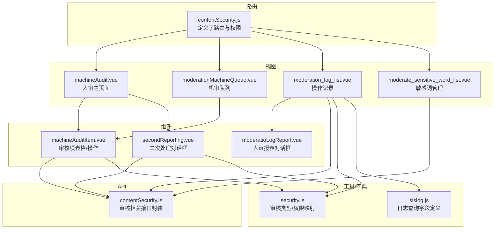
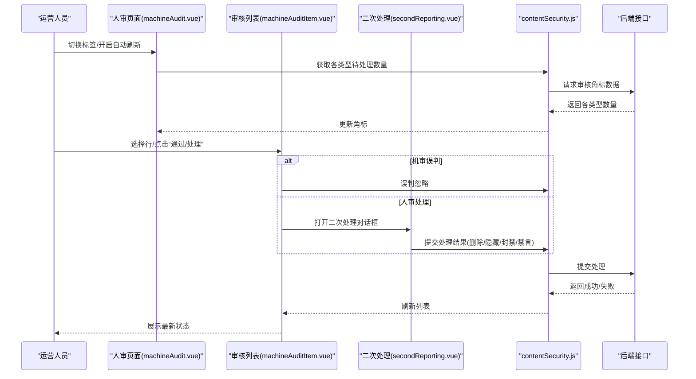
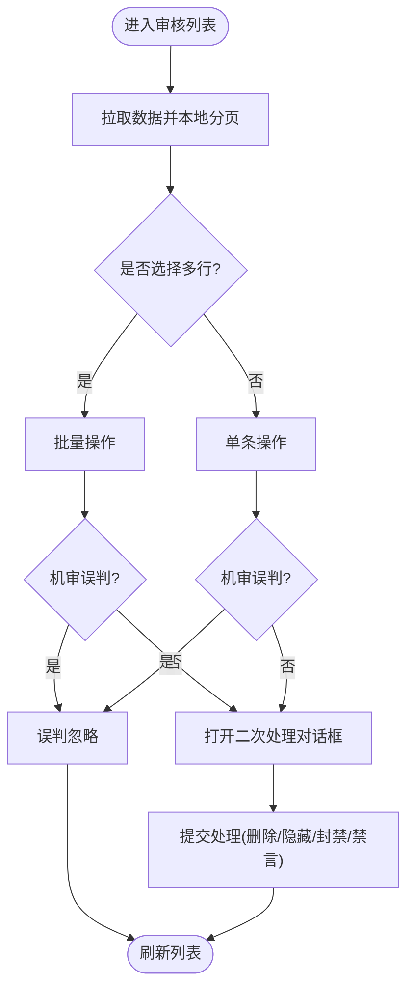
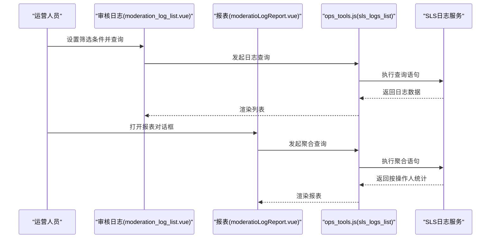
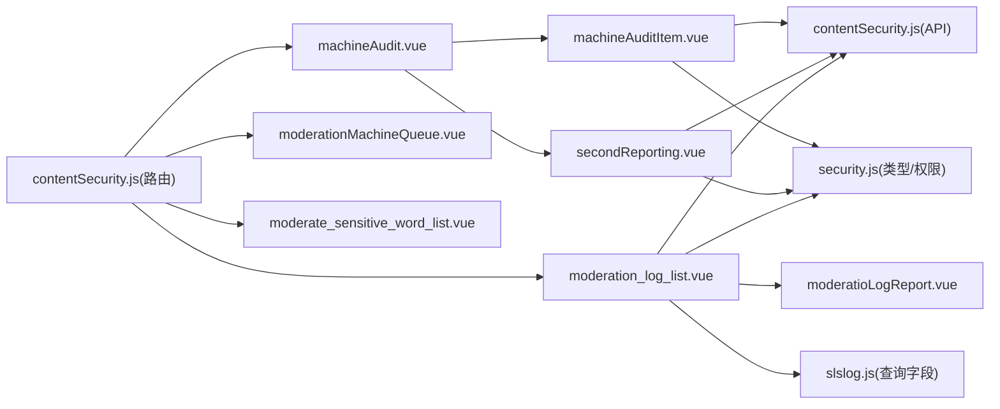

# 自媒体审核监控

<cite>
**本文引用的文件**
- [contentSecurity.js](file://src/router/children/contentSecurity.js)
- [contentSecurity.js](file://src/api/contentSecurity.js)
- [machineAudit.vue](file://src/views/contentSecurity/machineAudit.vue)
- [moderationMachineQueue.vue](file://src/views/contentSecurity/moderationMachineQueue.vue)
- [machineAuditItem.vue](file://src/views/contentSecurity/components/machineAudit/machineAuditItem.vue)
- [secondReporting.vue](file://src/views/contentSecurity/components/machineAudit/secondReporting.vue)
- [moderate_sensitive_word_list.vue](file://src/views/contentSecurity/moderate_sensitive_word_list.vue)
- [moderation_log_list.vue](file://src/views/contentSecurity/moderation_log_list.vue)
- [security.js](file://src/utils/dict/security.js)
- [moderatioLogReport.vue](file://src/views/contentSecurity/components/moderatioLogReport.vue)
- [slslog.js](file://src/components/newMySearch/components/searchKey/compKey/slslog.js)
</cite>

## 目录
1. [简介](#简介)
2. [项目结构](#项目结构)
3. [核心组件](#核心组件)
4. [架构总览](#架构总览)
5. [详细组件分析](#详细组件分析)
6. [依赖关系分析](#依赖关系分析)
7. [性能与可扩展性](#性能与可扩展性)
8. [故障排查指南](#故障排查指南)
9. [结论](#结论)
10. [附录](#附录)

## 简介
本技术文档面向“自媒体审核监控系统”，围绕内容质量评估、违规检测、合规性检查、AI内容识别、人工复核、审核结果反馈、规则与评分配置、统计分析与报表等主题，系统梳理前端实现与交互流程，并给出优化建议与最佳实践。文档以代码为依据，结合路由、API、视图组件与工具字典，帮助开发者快速理解与迭代该系统。

## 项目结构
内容安全相关功能主要分布在以下位置：
- 路由层：定义“机审队列”“人审队列”“进审敏感词”“操作记录”等入口
- 视图层：提供机审/人审列表、敏感词管理、审核日志与报表
- 组件层：通用审核项表格、二次处理对话框、敏感词标签页等
- 工具与字典：审核类型、权限映射、搜索条件等

图表来源
- [contentSecurity.js:1-44](file://src/router/children/contentSecurity.js#L1-L44)
- [machineAudit.vue:1-86](file://src/views/contentSecurity/machineAudit.vue#L1-L86)
- [moderationMachineQueue.vue:1-20](file://src/views/contentSecurity/moderationMachineQueue.vue#L1-L20)
- [machineAuditItem.vue:1-608](file://src/views/contentSecurity/components/machineAudit/machineAuditItem.vue#L1-L608)
- [secondReporting.vue:1-232](file://src/views/contentSecurity/components/machineAudit/secondReporting.vue#L1-L232)
- [moderation_log_list.vue:1-371](file://src/views/contentSecurity/moderation_log_list.vue#L1-L371)
- [moderate_sensitive_word_list.vue:1-23](file://src/views/contentSecurity/moderate_sensitive_word_list.vue#L1-L23)
- [contentSecurity.js:1-115](file://src/api/contentSecurity.js#L1-L115)
- [security.js:1-23](file://src/utils/dict/security.js#L1-L23)
- [slslog.js:1-24](file://src/components/newMySearch/components/searchKey/compKey/slslog.js#L1-L24)

章节来源
- [contentSecurity.js:1-44](file://src/router/children/contentSecurity.js#L1-L44)
- [contentSecurity.js:1-115](file://src/api/contentSecurity.js#L1-L115)

## 核心组件
- 人审主页面（machineAudit.vue）：多标签页切换不同审核类型，支持自动刷新、角标计数、批量操作与导出
- 机审队列（moderationMachineQueue.vue）：展示机审待处理项，占位使用
- 审核项表格（machineAuditItem.vue）：统一的审核列表，支持高亮关键词、附件/视频预览、二次处理、批量/单条操作、导出
- 二次处理对话框（secondReporting.vue）：内容处理（删除/隐藏/不处理）、用户处理（封禁/禁言/不处理），并校验权限
- 审核日志（moderation_log_list.vue）：基于SLS的日志查询与展示，支持导出与报表
- 敏感词管理（moderate_sensitive_word_list.vue）：基于敏感词标签页进行维护
- 审核报表（moderatioLogReport.vue）：按操作人维度统计“通过/处理/平均审核延时”

章节来源
- [machineAudit.vue:1-86](file://src/views/contentSecurity/machineAudit.vue#L1-L86)
- [moderationMachineQueue.vue:1-20](file://src/views/contentSecurity/moderationMachineQueue.vue#L1-L20)
- [machineAuditItem.vue:1-608](file://src/views/contentSecurity/components/machineAudit/machineAuditItem.vue#L1-L608)
- [secondReporting.vue:1-232](file://src/views/contentSecurity/components/machineAudit/secondReporting.vue#L1-L232)
- [moderation_log_list.vue:1-371](file://src/views/contentSecurity/moderation_log_list.vue#L1-L371)
- [moderate_sensitive_word_list.vue:1-23](file://src/views/contentSecurity/moderate_sensitive_word_list.vue#L1-L23)
- [moderatioLogReport.vue:1-135](file://src/views/contentSecurity/components/moderatioLogReport.vue#L1-L135)

## 架构总览
系统采用“路由 -> 视图 -> 组件 -> API -> 后端服务”的分层设计，前端负责：
- 路由与权限控制
- 数据拉取与本地分页
- 用户交互与批量操作
- 日志检索与报表生成

图表来源
- [machineAudit.vue:133-163](file://src/views/contentSecurity/machineAudit.vue#L133-L163)
- [machineAuditItem.vue:466-530](file://src/views/contentSecurity/components/machineAudit/machineAuditItem.vue#L466-L530)
- [secondReporting.vue:181-224](file://src/views/contentSecurity/components/machineAudit/secondReporting.vue#L181-L224)
- [contentSecurity.js:38-105](file://src/api/contentSecurity.js#L38-L105)

## 详细组件分析

### 人审主页面（machineAudit.vue）
- 功能要点
  - 初始化审核类型标签（过滤掉机审类型）
  - 默认选中第一个标签
  - 定时轮询获取各类型待处理数量并更新角标
  - 支持手动刷新与倒计时自动刷新
- 关键交互
  - 切换标签时加载对应子组件
  - 子组件触发事件更新头部角标
- 性能与体验
  - 自动刷新时可选择不显示遮罩，避免打断用户操作

章节来源
- [machineAudit.vue:1-86](file://src/views/contentSecurity/machineAudit.vue#L1-L86)
- [machineAudit.vue:133-163](file://src/views/contentSecurity/machineAudit.vue#L133-L163)

### 机审队列（moderationMachineQueue.vue）
- 功能要点
  - 占位使用，调用同一审核项组件，但不展示人审角标
- 使用场景
  - 作为机审入口，后续可接入机审任务队列

章节来源
- [moderationMachineQueue.vue:1-20](file://src/views/contentSecurity/moderationMachineQueue.vue#L1-L20)

### 审核项表格（machineAuditItem.vue）
- 功能要点
  - 统一的数据结构映射（typeMapping），支持多种内容类型（帖子/评论/聊天室/资讯/评分/视频评论等）
  - 高亮敏感词、附件/视频预览、风险提示、发布时间、额外数据
  - 机审误判/有效批量处理、人审“通过/处理”、导出Excel
  - 本地分页，避免频繁请求
- 交互细节
  - 机审误判：调用误判忽略接口
  - 人审处理：打开二次处理对话框，提交删除/隐藏/封禁/禁言等组合处理
  - 查看详情：根据类型打开不同详情组件（帖子/评论/资讯/评分/聊天室）

图表来源
- [machineAuditItem.vue:286-604](file://src/views/contentSecurity/components/machineAudit/machineAuditItem.vue#L286-L604)
- [secondReporting.vue:181-224](file://src/views/contentSecurity/components/machineAudit/secondReporting.vue#L181-L224)

章节来源
- [machineAuditItem.vue:1-608](file://src/views/contentSecurity/components/machineAudit/machineAuditItem.vue#L1-L608)

### 二次处理对话框（secondReporting.vue）
- 功能要点
  - 内容处理：删除/隐藏/不处理
  - 用户处理：封禁/禁言/不处理
  - 权限校验：根据内容类型映射到具体权限点
  - 参数组装：将内容/用户处理参数合并后提交
- 关键逻辑
  - 校验至少选择一项处理（内容或用户）
  - 根据tabSource附加data_type
  - 提交后通知父组件刷新

章节来源
- [secondReporting.vue:1-232](file://src/views/contentSecurity/components/machineAudit/secondReporting.vue#L1-L232)
- [security.js:12-22](file://src/utils/dict/security.js#L12-L22)

### 审核日志与报表（moderation_log_list.vue 与 moderatioLogReport.vue）
- 审核日志
  - 基于SLS日志查询，支持时间范围、UID、内容、模型、object_id、操作人、请求ID等筛选
  - 展示标题/内容高亮敏感词、图片、审核结果、处理方式、分类、风险提示、额外数据
  - 支持导出Excel与查看详情
- 人审报表
  - 按操作人统计“合计/通过/处理/平均审核延时”，并提供汇总行

图表来源
- [moderation_log_list.vue:272-367](file://src/views/contentSecurity/moderation_log_list.vue#L272-L367)
- [moderatioLogReport.vue:83-131](file://src/views/contentSecurity/components/moderatioLogReport.vue#L83-L131)
- [slslog.js:1-24](file://src/components/newMySearch/components/searchKey/compKey/slslog.js#L1-L24)

章节来源
- [moderation_log_list.vue:1-371](file://src/views/contentSecurity/moderation_log_list.vue#L1-L371)
- [moderatioLogReport.vue:1-135](file://src/views/contentSecurity/components/moderatioLogReport.vue#L1-L135)
- [slslog.js:1-24](file://src/components/newMySearch/components/searchKey/compKey/slslog.js#L1-L24)

### 敏感词管理（moderate_sensitive_word_list.vue）
- 功能要点
  - 基于敏感词标签页进行维护，统一入口管理
- 适用场景
  - 机审/人审联动的敏感词库维护

章节来源
- [moderate_sensitive_word_list.vue:1-23](file://src/views/contentSecurity/moderate_sensitive_word_list.vue#L1-L23)

## 依赖关系分析
- 路由与权限
  - 路由定义了“内容安全”菜单及子页面入口，并声明角色权限
- 审核类型与权限映射
  - 审核类型字典用于标签页与权限判断
  - 二次处理权限映射用于控制删除/隐藏/封禁/禁言按钮可用性
- API封装
  - 审核列表、角标、误判忽略、二次处理、敏感词增删查等接口统一封装
- 日志查询
  - 新搜索组件提供SLS查询字段定义，支撑日志与报表

图表来源
- [contentSecurity.js:1-44](file://src/router/children/contentSecurity.js#L1-L44)
- [machineAudit.vue:1-86](file://src/views/contentSecurity/machineAudit.vue#L1-L86)
- [moderationMachineQueue.vue:1-20](file://src/views/contentSecurity/moderationMachineQueue.vue#L1-L20)
- [moderation_log_list.vue:1-371](file://src/views/contentSecurity/moderation_log_list.vue#L1-L371)
- [moderate_sensitive_word_list.vue:1-23](file://src/views/contentSecurity/moderate_sensitive_word_list.vue#L1-L23)
- [machineAuditItem.vue:1-608](file://src/views/contentSecurity/components/machineAudit/machineAuditItem.vue#L1-L608)
- [secondReporting.vue:1-232](file://src/views/contentSecurity/components/machineAudit/secondReporting.vue#L1-L232)
- [moderatioLogReport.vue:1-135](file://src/views/contentSecurity/components/moderatioLogReport.vue#L1-L135)
- [contentSecurity.js:1-115](file://src/api/contentSecurity.js#L1-L115)
- [security.js:1-23](file://src/utils/dict/security.js#L1-L23)
- [slslog.js:1-24](file://src/components/newMySearch/components/searchKey/compKey/slslog.js#L1-L24)

章节来源
- [contentSecurity.js:1-44](file://src/router/children/contentSecurity.js#L1-L44)
- [security.js:1-23](file://src/utils/dict/security.js#L1-L23)
- [contentSecurity.js:1-115](file://src/api/contentSecurity.js#L1-L115)

## 性能与可扩展性
- 性能优化建议
  - 列表本地分页：减少网络请求频率，提高响应速度
  - 自动刷新节流：在高频刷新场景下，避免频繁请求导致抖动
  - 图片/视频懒加载：对附件/视频组件启用懒加载，降低首屏压力
  - 高亮敏感词：对长文本高亮时限制长度或采用虚拟滚动
- 可扩展性建议
  - 新增审核类型：在类型字典中新增条目，组件内按typeMapping映射即可
  - 新增处理动作：在二次处理对话框中扩展处理选项，并完善权限映射
  - 日志查询：通过搜索组件字段定义扩展更多筛选维度

[本节为通用建议，无需特定文件引用]

## 故障排查指南
- 无法看到人审角标
  - 检查角标接口返回与标签名匹配逻辑
  - 确认自动刷新开关状态与定时器
- 二次处理提交失败
  - 校验至少选择一项处理（内容或用户）
  - 检查权限映射是否满足删除/隐藏/封禁/禁言
- 导出异常
  - 确认选中数据与导出字段映射
  - 检查Excel导出依赖是否正确引入
- 日志查询无结果
  - 校验时间范围、字段拼接与SLS语法
  - 确认日志store与字段是否存在

章节来源
- [machineAudit.vue:133-163](file://src/views/contentSecurity/machineAudit.vue#L133-L163)
- [secondReporting.vue:181-224](file://src/views/contentSecurity/components/machineAudit/secondReporting.vue#L181-L224)
- [moderation_log_list.vue:272-367](file://src/views/contentSecurity/moderation_log_list.vue#L272-L367)

## 结论
该系统以清晰的路由与视图分层、统一的审核组件与API封装、完善的日志与报表能力，实现了从AI初筛到人工复核再到处理反馈的闭环。通过类型字典与权限映射，系统具备良好的可扩展性；通过本地分页与自动刷新策略，兼顾了性能与实时性。建议在后续迭代中进一步完善机审漏审上报、评分体系与权重配置、以及更细粒度的统计指标。

[本节为总结，无需特定文件引用]

## 附录

### 审核流程与角色权限
- 机审队列：机审误判/有效标记
- 人审队列：二次处理（删除/隐藏/封禁/禁言）
- 敏感词管理：统一维护敏感词库
- 操作记录：基于SLS日志回溯与统计

章节来源
- [contentSecurity.js:1-44](file://src/router/children/contentSecurity.js#L1-L44)
- [moderate_sensitive_word_list.vue:1-23](file://src/views/contentSecurity/moderate_sensitive_word_list.vue#L1-L23)
- [moderation_log_list.vue:1-371](file://src/views/contentSecurity/moderation_log_list.vue#L1-L371)