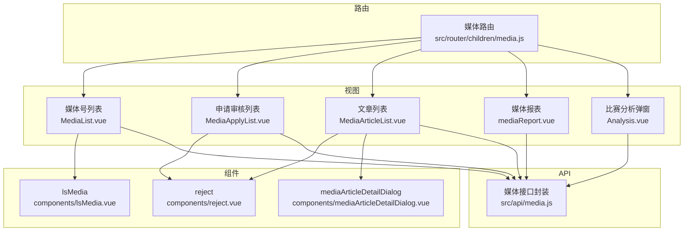
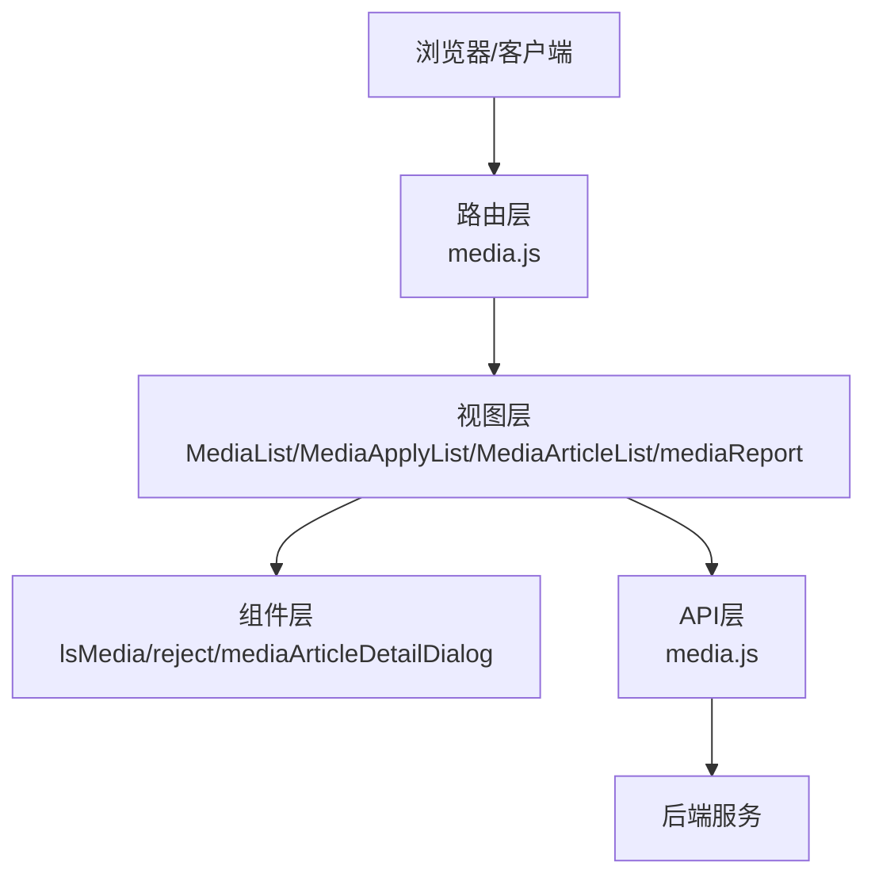
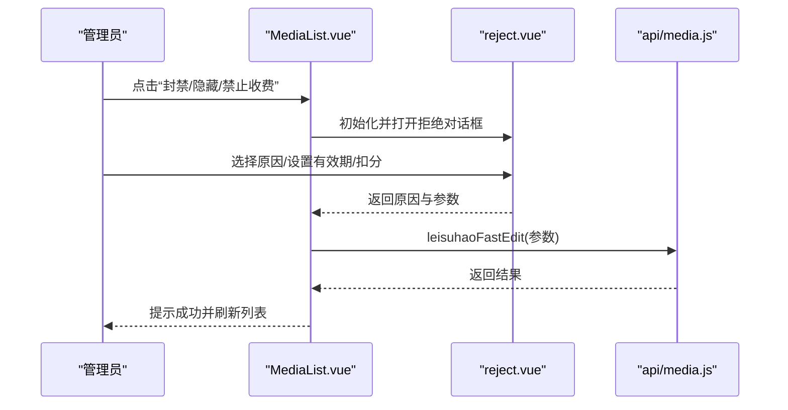
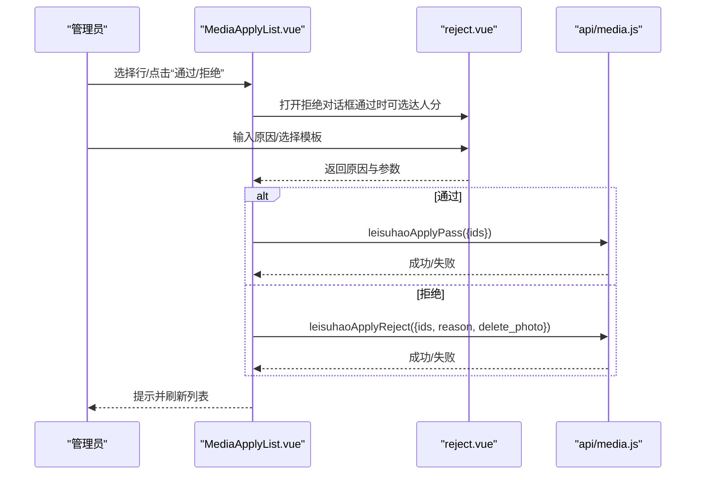
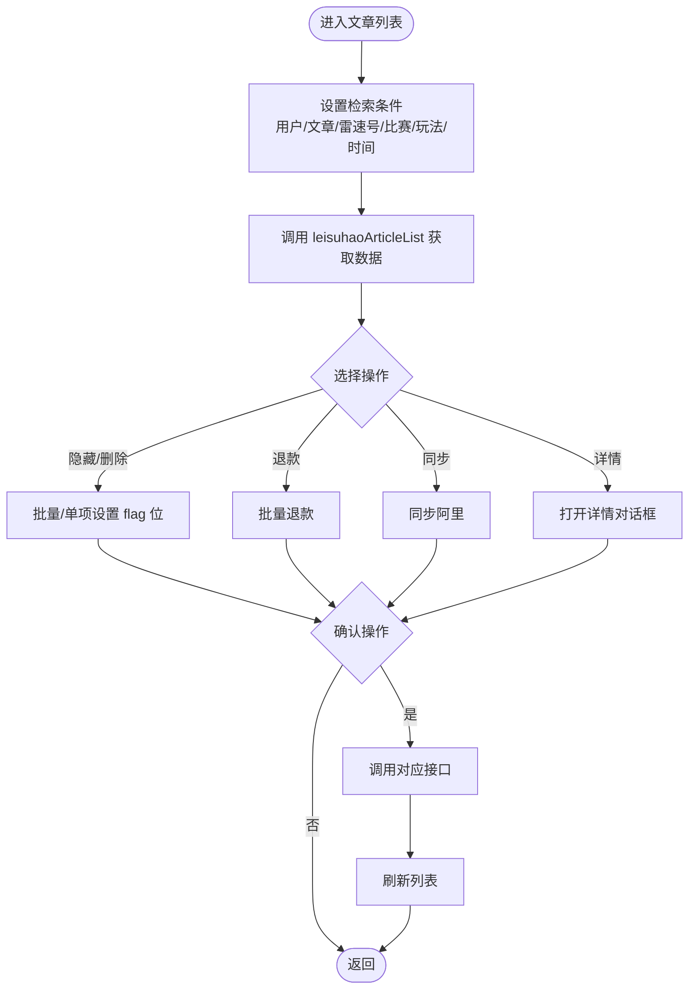
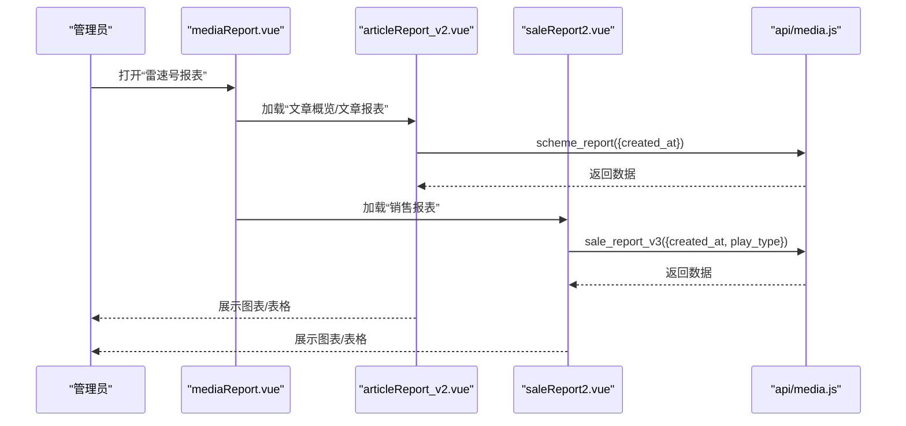
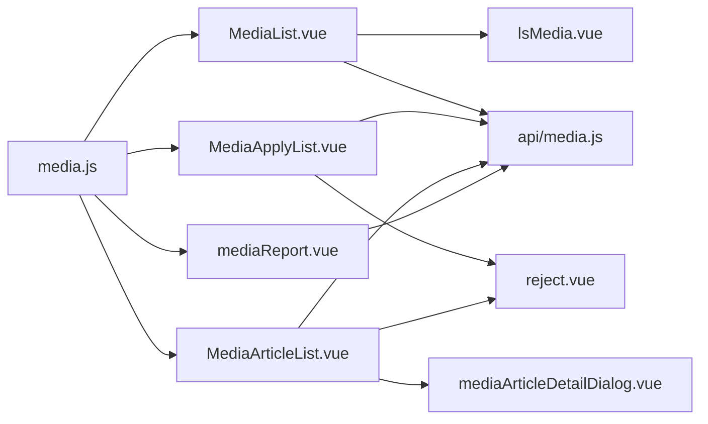

# 媒体管理模块

<cite>
**本文引用的文件**
- [src/router/children/media.js](file://src/router/children/media.js)
- [src/api/media.js](file://src/api/media.js)
- [src/views/media/MediaList.vue](file://src/views/media/MediaList.vue)
- [src/views/media/MediaApplyList.vue](file://src/views/media/MediaApplyList.vue)
- [src/views/media/MediaArticleList.vue](file://src/views/media/MediaArticleList.vue)
- [src/views/media/mediaReport.vue](file://src/views/media/mediaReport.vue)
- [src/views/media/components/lsMedia.vue](file://src/views/media/components/lsMedia.vue)
- [src/views/media/components/reject.vue](file://src/views/media/components/reject.vue)
- [src/views/media/components/mediaArticleDetailDialog.vue](file://src/views/media/components/mediaArticleDetailDialog.vue)
- [src/views/media/components/articleReport_v2.vue](file://src/views/media/components/articleReport_v2.vue)
- [src/views/media/components/saleReport2.vue](file://src/views/media/components/saleReport2.vue)
- [src/views/media/components/Analysis.vue](file://src/views/media/components/Analysis.vue)
</cite>

## 目录
1. [引言](#引言)
2. [项目结构](#项目结构)
3. [核心组件](#核心组件)
4. [架构总览](#架构总览)
5. [详细组件分析](#详细组件分析)
6. [依赖关系分析](#依赖关系分析)
7. [性能考量](#性能考量)
8. [故障排查指南](#故障排查指南)
9. [结论](#结论)
10. [附录](#附录)

## 引言
本技术文档围绕媒体管理模块展开，系统性阐述媒体号管理、媒体内容审核、媒体统计分析等核心功能。文档覆盖媒体认证流程（申请审核、资质验证、等级管理）、内容管理机制（文章发布、审核流程、内容质量控制、违规处理）、收益统计与分析（阅读量统计、收入计算、趋势分析），并给出架构设计思路（内容分发、数据存储、性能优化）、最佳实践（内容审核策略、用户体验设计、数据安全保障）以及可直接定位到源码路径的示例与配置说明，帮助开发者快速理解与扩展媒体管理能力。

## 项目结构
媒体管理模块位于前端工程的视图与路由配置中，主要由以下层次构成：
- 路由层：定义媒体管理子菜单与权限点，统一挂载在“雷速号”导航下
- 视图层：包含媒体号列表、申请审核、变更审核、文章列表、报表、异常比赛、天梯赛季等页面
- 组件层：通用组件（如 lsMedia、reject、mediaArticleDetailDialog）复用性强
- API 层：封装媒体相关接口，统一调用后端服务

图表来源
- [src/router/children/media.js:1-128](file://src/router/children/media.js#L1-L128)
- [src/views/media/MediaList.vue:1-432](file://src/views/media/MediaList.vue#L1-L432)
- [src/views/media/MediaApplyList.vue:1-482](file://src/views/media/MediaApplyList.vue#L1-L482)
- [src/views/media/MediaArticleList.vue:1-868](file://src/views/media/MediaArticleList.vue#L1-L868)
- [src/views/media/mediaReport.vue:1-89](file://src/views/media/mediaReport.vue#L1-L89)
- [src/views/media/components/lsMedia.vue:1-139](file://src/views/media/components/lsMedia.vue#L1-L139)
- [src/views/media/components/reject.vue:1-189](file://src/views/media/components/reject.vue#L1-L189)
- [src/views/media/components/mediaArticleDetailDialog.vue:1-40](file://src/views/media/components/mediaArticleDetailDialog.vue#L1-L40)
- [src/api/media.js:1-857](file://src/api/media.js#L1-L857)

章节来源
- [src/router/children/media.js:1-128](file://src/router/children/media.js#L1-L128)

## 核心组件
- 媒体号列表页：支持筛选、排序、封禁/解封、隐藏/取消隐藏、禁止收费等快捷操作；集成敏感词高亮、禁收名单、专家添加等功能
- 申请审核页：支持批量/单项通过/拒绝、图片大图查看、敏感词高亮、拒绝原因模板
- 文章列表页：支持按时间、玩法、用户/雷速号/比赛/赛事/队伍等多维检索；批量隐藏/删除、同步阿里、退款、详情查看
- 报表页：聚合多种统计维度（文章概览、销售、消费、比赛/赛事报表等）
- 通用组件：lsMedia（媒体信息展示+侧边栏用户信息）、reject（统一拒绝/封禁对话框）、mediaArticleDetailDialog（文章详情与购买记录）

章节来源
- [src/views/media/MediaList.vue:1-432](file://src/views/media/MediaList.vue#L1-L432)
- [src/views/media/MediaApplyList.vue:1-482](file://src/views/media/MediaApplyList.vue#L1-L482)
- [src/views/media/MediaArticleList.vue:1-868](file://src/views/media/MediaArticleList.vue#L1-L868)
- [src/views/media/mediaReport.vue:1-89](file://src/views/media/mediaReport.vue#L1-L89)
- [src/views/media/components/lsMedia.vue:1-139](file://src/views/media/components/lsMedia.vue#L1-L139)
- [src/views/media/components/reject.vue:1-189](file://src/views/media/components/reject.vue#L1-L189)
- [src/views/media/components/mediaArticleDetailDialog.vue:1-40](file://src/views/media/components/mediaArticleDetailDialog.vue#L1-L40)

## 架构总览
媒体管理模块遵循“路由-视图-组件-API”的分层设计：
- 路由层：集中定义媒体管理入口与权限点，统一挂载至“雷速号”菜单
- 视图层：各业务页面负责数据拉取、交互与展示
- 组件层：通用组件提升复用度与一致性
- API 层：统一封装媒体相关接口，便于维护与扩展

图表来源
- [src/router/children/media.js:1-128](file://src/router/children/media.js#L1-L128)
- [src/api/media.js:1-857](file://src/api/media.js#L1-L857)

## 详细组件分析

### 媒体号管理（列表、封禁/隐藏/禁止收费）
- 功能要点
  - 支持按用户ID、粉丝数、创建时间、分组等条件筛选
  - 支持排序与批量操作
  - 快捷操作：封禁/解封、隐藏/取消隐藏、禁止收费（带有效期）
  - 集成敏感词高亮、禁收名单、专家添加
- 关键实现
  - 列表查询与分页：调用 leisuhaoList
  - 快捷修改字段：leisuhaoFastEdit
  - 封禁/隐藏/禁收原因模板：reject 组件
  - 分组与权限控制：根据角色动态渲染操作按钮

图表来源
- [src/views/media/MediaList.vue:279-422](file://src/views/media/MediaList.vue#L279-L422)
- [src/views/media/components/reject.vue:121-185](file://src/views/media/components/reject.vue#L121-L185)
- [src/api/media.js:79-85](file://src/api/media.js#L79-L85)

章节来源
- [src/views/media/MediaList.vue:153-432](file://src/views/media/MediaList.vue#L153-L432)
- [src/views/media/components/reject.vue:65-189](file://src/views/media/components/reject.vue#L65-L189)
- [src/api/media.js:5-85](file://src/api/media.js#L5-L85)

### 媒体认证流程（申请审核、资质验证、等级管理）
- 功能要点
  - 申请列表：支持按状态筛选（审核中/通过/未通过）、批量通过/拒绝
  - 图片展示：支持小图/大图切换，附件图片预览
  - 敏感词高亮：对名称、简介等字段进行敏感词高亮
  - 通过/拒绝：统一通过 reject 组件收集原因与参数
- 关键实现
  - 申请列表：leisuhaoApplyList
  - 通过：leisuhaoApplyPass
  - 拒绝：leisuhaoApplyReject
  - 敏感词：store 中 lightSensitiveWordList

图表来源
- [src/views/media/MediaApplyList.vue:404-463](file://src/views/media/MediaApplyList.vue#L404-L463)
- [src/views/media/components/reject.vue:133-165](file://src/views/media/components/reject.vue#L133-L165)
- [src/api/media.js:13-36](file://src/api/media.js#L13-L36)

章节来源
- [src/views/media/MediaApplyList.vue:222-482](file://src/views/media/MediaApplyList.vue#L222-L482)
- [src/api/media.js:13-36](file://src/api/media.js#L13-L36)

### 媒体内容管理（文章发布、审核、质量控制、违规处理）
- 功能要点
  - 多维检索：用户ID、文章ID、雷速号ID、比赛/赛事/队伍ID、玩法、时间范围
  - 批量操作：隐藏/取消隐藏、删除/取消删除、批量退款
  - 同步阿里：一键同步文章
  - 详情查看：文章详情与购买记录
- 关键实现
  - 文章列表：leisuhaoArticleList
  - 隐藏/删除：hidden_article/delete_article
  - 退款：refund
  - 同步：syncArticle
  - 详情：mediaArticleDetailDialog

图表来源
- [src/views/media/MediaArticleList.vue:448-736](file://src/views/media/MediaArticleList.vue#L448-L736)
- [src/views/media/components/mediaArticleDetailDialog.vue:29-38](file://src/views/media/components/mediaArticleDetailDialog.vue#L29-L38)
- [src/api/media.js:89-103](file://src/api/media.js#L89-L103)
- [src/api/media.js:133-139](file://src/api/media.js#L133-L139)
- [src/api/media.js:332-338](file://src/api/media.js#L332-L338)
- [src/api/media.js:97-103](file://src/api/media.js#L97-L103)

章节来源
- [src/views/media/MediaArticleList.vue:321-868](file://src/views/media/MediaArticleList.vue#L321-L868)
- [src/views/media/components/mediaArticleDetailDialog.vue:14-40](file://src/views/media/components/mediaArticleDetailDialog.vue#L14-L40)
- [src/api/media.js:89-139](file://src/api/media.js#L89-L139)
- [src/api/media.js:332-338](file://src/api/media.js#L332-L338)
- [src/api/media.js:97-103](file://src/api/media.js#L97-L103)

### 媒体收益统计与分析（阅读量、收入、趋势）
- 功能要点
  - 文章概览报表：按日期统计文章数、免费/收费分布、命中率
  - 销售报表：按玩法/价格维度统计销量、客单价、金额
  - 报表聚合：在 mediaReport.vue 中按权限动态选择面板
- 关键实现
  - 文章报表：scheme_report
  - 销售报表：sale_report_v3
  - 比赛/赛事报表：match_report/comp_report
  - 首购/消费/收益对比：diff_pay/diff_income/income_report_v3

图表来源
- [src/views/media/mediaReport.vue:49-89](file://src/views/media/mediaReport.vue#L49-L89)
- [src/views/media/components/articleReport_v2.vue:232-298](file://src/views/media/components/articleReport_v2.vue#L232-L298)
- [src/views/media/components/saleReport2.vue:251-305](file://src/views/media/components/saleReport2.vue#L251-L305)
- [src/api/media.js:289-321](file://src/api/media.js#L289-L321)
- [src/api/media.js:388-394](file://src/api/media.js#L388-L394)

章节来源
- [src/views/media/mediaReport.vue:49-89](file://src/views/media/mediaReport.vue#L49-L89)
- [src/views/media/components/articleReport_v2.vue:232-354](file://src/views/media/components/articleReport_v2.vue#L232-L354)
- [src/views/media/components/saleReport2.vue:251-422](file://src/views/media/components/saleReport2.vue#L251-L422)
- [src/api/media.js:289-394](file://src/api/media.js#L289-L394)

### 媒体号详情与用户信息联动（lsMedia 与侧边栏）
- 功能要点
  - lsMedia：展示头像、名称、分组标签、状态徽章，并可跳转侧边栏用户信息
  - 侧边栏：根据 module/xxkName 参数加载预测模块相关信息
- 关键实现
  - lsMedia.vue 调用 people 侧边栏组件
  - 通过 askIt(moduleName, xxkName) 携带上下文

章节来源
- [src/views/media/components/lsMedia.vue:99-139](file://src/views/media/components/lsMedia.vue#L99-L139)

### 比赛分析弹窗（Analysis.vue）
- 功能要点
  - 展示精选方案列表、方案选项比例（胜平负/让球/大小/北单/胜负等）
  - 文章列表、命中率、购买记录、串关/足彩文章列表
- 关键实现
  - matchStrategyRatio/matchStrategy 获取方案与比例
  - 通过 mediaArticleDetailDialog 打开文章详情

章节来源
- [src/views/media/components/Analysis.vue:153-302](file://src/views/media/components/Analysis.vue#L153-L302)
- [src/api/media.js:202-217](file://src/api/media.js#L202-L217)
- [src/api/media.js:149-171](file://src/api/media.js#L149-L171)

## 依赖关系分析
- 路由依赖：媒体路由集中定义，统一挂载“雷速号”菜单与权限点
- 视图依赖：各页面依赖通用组件与 API 封装
- 组件依赖：lsMedia/reject/mediaArticleDetailDialog 在多个页面复用
- API 依赖：所有业务接口集中在 api/media.js，便于统一维护

图表来源
- [src/router/children/media.js:1-128](file://src/router/children/media.js#L1-L128)
- [src/views/media/MediaList.vue:153-432](file://src/views/media/MediaList.vue#L153-L432)
- [src/views/media/MediaApplyList.vue:222-482](file://src/views/media/MediaApplyList.vue#L222-L482)
- [src/views/media/MediaArticleList.vue:321-868](file://src/views/media/MediaArticleList.vue#L321-L868)
- [src/views/media/mediaReport.vue:49-89](file://src/views/media/mediaReport.vue#L49-L89)
- [src/views/media/components/lsMedia.vue:99-139](file://src/views/media/components/lsMedia.vue#L99-L139)
- [src/views/media/components/reject.vue:121-185](file://src/views/media/components/reject.vue#L121-L185)
- [src/views/media/components/mediaArticleDetailDialog.vue:29-38](file://src/views/media/components/mediaArticleDetailDialog.vue#L29-L38)
- [src/api/media.js:1-857](file://src/api/media.js#L1-L857)

章节来源
- [src/router/children/media.js:1-128](file://src/router/children/media.js#L1-L128)
- [src/api/media.js:1-857](file://src/api/media.js#L1-L857)

## 性能考量
- 列表分页与懒加载：使用分页组件与 v-loading 控制渲染压力
- 表格列宽与溢出：通过样式与 tooltip 优化长文本展示
- 批量操作：仅在选中行存在时显示批量按钮，避免不必要的渲染
- 对话框按需加载：keep-alive 与 v-if 控制报表组件的实例化
- 时间范围查询：统一格式化时间戳，减少后端解析成本

## 故障排查指南
- 申请审核失败
  - 检查 leisuhaoApplyPass/leisuhaoApplyReject 的参数是否正确
  - 参考路径：[src/views/media/MediaApplyList.vue:404-463](file://src/views/media/MediaApplyList.vue#L404-L463)
- 快捷封禁/隐藏/禁收无效
  - 确认 leisuhaoFastEdit 请求是否成功返回
  - 参考路径：[src/views/media/MediaList.vue:279-422](file://src/views/media/MediaList.vue#L279-L422)
- 文章批量隐藏/删除/退款异常
  - 检查 hidden_article/delete_article/refund 的调用与返回
  - 参考路径：[src/api/media.js:133-139](file://src/api/media.js#L133-L139), [src/api/media.js:332-338](file://src/api/media.js#L332-L338)
- 报表数据为空
  - 核对 created_at 时间范围与 play_type 参数
  - 参考路径：[src/views/media/components/articleReport_v2.vue:277-298](file://src/views/media/components/articleReport_v2.vue#L277-L298), [src/views/media/components/saleReport2.vue:284-305](file://src/views/media/components/saleReport2.vue#L284-L305)

章节来源
- [src/views/media/MediaApplyList.vue:404-463](file://src/views/media/MediaApplyList.vue#L404-L463)
- [src/views/media/MediaList.vue:279-422](file://src/views/media/MediaList.vue#L279-L422)
- [src/api/media.js:133-139](file://src/api/media.js#L133-L139)
- [src/api/media.js:332-338](file://src/api/media.js#L332-L338)
- [src/views/media/components/articleReport_v2.vue:277-298](file://src/views/media/components/articleReport_v2.vue#L277-L298)
- [src/views/media/components/saleReport2.vue:284-305](file://src/views/media/components/saleReport2.vue#L284-L305)

## 结论
媒体管理模块以清晰的路由与视图分层、可复用的通用组件、统一的 API 封装为基础，实现了媒体号全生命周期管理与内容收益分析。通过权限点控制与批量操作，提升了运营效率；通过报表体系与分析弹窗，增强了数据驱动决策的能力。建议在后续迭代中进一步完善自动化审核与风控策略、增强审计日志与回溯能力，并持续优化前端性能与用户体验。

## 附录
- 路由配置参考：[src/router/children/media.js:1-128](file://src/router/children/media.js#L1-L128)
- API 接口参考：[src/api/media.js:1-857](file://src/api/media.js#L1-L857)
- 媒体号列表：[src/views/media/MediaList.vue:153-432](file://src/views/media/MediaList.vue#L153-L432)
- 申请审核：[src/views/media/MediaApplyList.vue:222-482](file://src/views/media/MediaApplyList.vue#L222-L482)
- 文章列表：[src/views/media/MediaArticleList.vue:321-868](file://src/views/media/MediaArticleList.vue#L321-L868)
- 报表聚合：[src/views/media/mediaReport.vue:49-89](file://src/views/media/mediaReport.vue#L49-L89)
- 通用组件：lsMedia [src/views/media/components/lsMedia.vue:99-139](file://src/views/media/components/lsMedia.vue#L99-L139), reject [src/views/media/components/reject.vue:121-185](file://src/views/media/components/reject.vue#L121-L185), 详情对话框 [src/views/media/components/mediaArticleDetailDialog.vue:29-38](file://src/views/media/components/mediaArticleDetailDialog.vue#L29-L38)
- 统计报表组件：文章报表 [src/views/media/components/articleReport_v2.vue:232-354](file://src/views/media/components/articleReport_v2.vue#L232-L354), 销售报表 [src/views/media/components/saleReport2.vue:251-422](file://src/views/media/components/saleReport2.vue#L251-L422), 比赛分析弹窗 [src/views/media/components/Analysis.vue:153-302](file://src/views/media/components/Analysis.vue#L153-L302)