# 支付管理模块

<cite>
**本文引用的文件**
- [pay.js](file://src/api/pay.js)
- [pay.js](file://src/utils/dict/pay.js)
- [dict.js](file://src/utils/dict.js)
- [pay.js](file://src/store/modules/pay.js)
- [pay.js](file://src/router/children/pay.js)
- [transactionlist.vue](file://src/views/pay/transactionlist.vue)
- [trade_list.vue](file://src/views/pay/trade_list.vue)
- [iapNotifyTab.vue](file://src/views/pay/iapNotifyTab.vue)
- [iapNotify.vue](file://src/components/leisu/peopleInfo/shopping/components/oders/iapNotify.vue)
- [iapBlack.vue](file://src/components/leisu/peopleInfo/shopping/components/oders/iapBlack.vue)
- [withdraw_list.vue](file://src/views/pay/withdraw_list.vue)
- [leisu_coupon.vue](file://src/views/pay/leisu_coupon.vue)
- [addCoupon.vue](file://src/views/pay/components/addCoupon.vue)
- [addCouponBatch.vue](file://src/views/pay/components/addCouponBatch.vue)
- [request.js](file://src/utils/request.js)
</cite>

## 更新摘要
**变更内容**
- 新增二级卡产品映射系统，支持尝鲜卡、精选卡、黄金卡、至尊卡四种产品类型
- 增强优惠券创建过程中的产品选择验证逻辑
- 完善次卡商品映射与使用限制管理
- 优化优惠券发放组件的用户体验和数据验证

## 目录
1. [简介](#简介)
2. [项目结构](#项目结构)
3. [核心组件](#核心组件)
4. [架构总览](#架构总览)
5. [详细组件分析](#详细组件分析)
6. [优惠券系统增强](#优惠券系统增强)
7. [依赖关系分析](#依赖关系分析)
8. [性能考量](#性能考量)
9. [故障排查指南](#故障排查指南)
10. [结论](#结论)
11. [附录](#附录)

## 简介
本技术文档围绕支付管理模块，系统性梳理交易记录管理、退款处理、苹果内购管理、支付统计分析、支付流程设计、数据模型、安全机制、架构设计与最佳实践。文档以仓库现有前端实现为依据，结合接口定义与组件交互，特别关注最新的优惠券系统改进，帮助开发者快速理解与扩展支付相关功能。

## 项目结构
支付模块由"路由配置 → 视图组件 → 接口封装 → 字典与状态管理"构成，采用按功能域划分的组织方式：
- 路由层：集中定义支付相关页面入口与权限角色
- 视图层：交易记录、内购记录、苹果内购、提现、优惠券管理等页面
- 接口层：统一在 API 模块中导出各业务接口
- 工具层：字典映射、状态管理、网络请求拦截

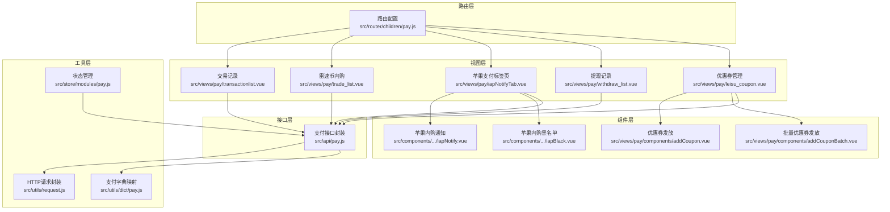

**图表来源**
- [pay.js:1-101](file://src/router/children/pay.js#L1-L101)
- [transactionlist.vue:1-307](file://src/views/pay/transactionlist.vue#L1-L307)
- [trade_list.vue:1-268](file://src/views/pay/trade_list.vue#L1-L268)
- [iapNotifyTab.vue:1-37](file://src/views/pay/iapNotifyTab.vue#L1-L37)
- [iapNotify.vue:1-192](file://src/components/leisu/peopleInfo/shopping/components/oders/iapNotify.vue#L1-L192)
- [iapBlack.vue:1-210](file://src/components/leisu/peopleInfo/shopping/components/oders/iapBlack.vue#L1-L210)
- [withdraw_list.vue:1-530](file://src/views/pay/withdraw_list.vue#L1-L530)
- [leisu_coupon.vue:1-400](file://src/views/pay/leisu_coupon.vue#L1-L400)
- [addCoupon.vue:1-368](file://src/views/pay/components/addCoupon.vue#L1-L368)
- [addCouponBatch.vue:1-475](file://src/views/pay/components/addCouponBatch.vue#L1-L475)
- [pay.js:1-532](file://src/api/pay.js#L1-L532)
- [pay.js:1-122](file://src/utils/dict/pay.js#L1-L122)
- [dict.js:1-11](file://src/utils/dict.js#L1-L11)
- [pay.js:1-33](file://src/store/modules/pay.js#L1-L33)
- [request.js:1-130](file://src/utils/request.js#L1-L130)

**章节来源**
- [pay.js:1-101](file://src/router/children/pay.js#L1-L101)
- [pay.js:1-532](file://src/api/pay.js#L1-L532)
- [pay.js:1-122](file://src/utils/dict/pay.js#L1-L122)
- [dict.js:1-11](file://src/utils/dict.js#L1-L11)
- [pay.js:1-33](file://src/store/modules/pay.js#L1-L33)
- [request.js:1-130](file://src/utils/request.js#L1-L130)

## 核心组件
- 交易记录管理：提供订单列表、支付详情、退款、手动到账等功能
- 雷速币内购：展示内购订单、商品信息、状态、通知结果与VIP回收
- 苹果内购：内购通知、用户/IP/设备黑名单、异常充值
- 提现管理：提现记录、渠道批次、批量签约、批量修改渠道
- **优惠券管理**：支持多种类型的优惠券发放、批量发放、状态管理与报表分析

**章节来源**
- [transactionlist.vue:1-307](file://src/views/pay/transactionlist.vue#L1-L307)
- [trade_list.vue:1-268](file://src/views/pay/trade_list.vue#L1-L268)
- [iapNotifyTab.vue:1-37](file://src/views/pay/iapNotifyTab.vue#L1-L37)
- [iapNotify.vue:1-192](file://src/components/leisu/peopleInfo/shopping/components/oders/iapNotify.vue#L1-L192)
- [iapBlack.vue:1-210](file://src/components/leisu/peopleInfo/shopping/components/oders/iapBlack.vue#L1-L210)
- [withdraw_list.vue:1-530](file://src/views/pay/withdraw_list.vue#L1-L530)
- [leisu_coupon.vue:1-400](file://src/views/pay/leisu_coupon.vue#L1-L400)

## 架构总览
支付模块遵循"路由 → 组件 → API → 工具"的分层设计：
- 路由层负责页面入口与权限控制
- 组件层负责数据展示、查询与交互
- API 层统一管理后端接口
- 工具层提供字典映射、状态管理与网络请求

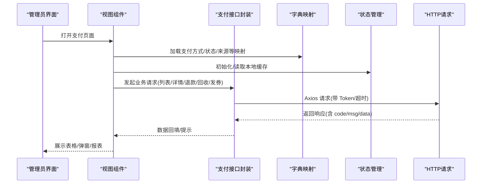

**图表来源**
- [pay.js:138-304](file://src/views/pay/transactionlist.vue#L138-L304)
- [pay.js:131-243](file://src/views/pay/trade_list.vue#L131-L243)
- [pay.js:1-37](file://src/views/pay/iapNotifyTab.vue#L1-L37)
- [pay.js:271-527](file://src/views/pay/withdraw_list.vue#L271-L527)
- [pay.js:1-532](file://src/api/pay.js#L1-L532)
- [pay.js:1-122](file://src/utils/dict/pay.js#L1-L122)
- [pay.js:1-33](file://src/store/modules/pay.js#L1-L33)
- [request.js:22-127](file://src/utils/request.js#L22-L127)

## 详细组件分析

### 交易记录管理
- 功能要点
  - 列表查询：支持分页、排序、多维搜索
  - 支付详情：查看额外信息与支付通道详情
  - 退款处理：针对支付宝与易宝通道发起退款
  - 手动到账：对未完成订单执行手动处理
  - 报表联动：支持打开流水报表与报告面板

- 关键流程（退款）
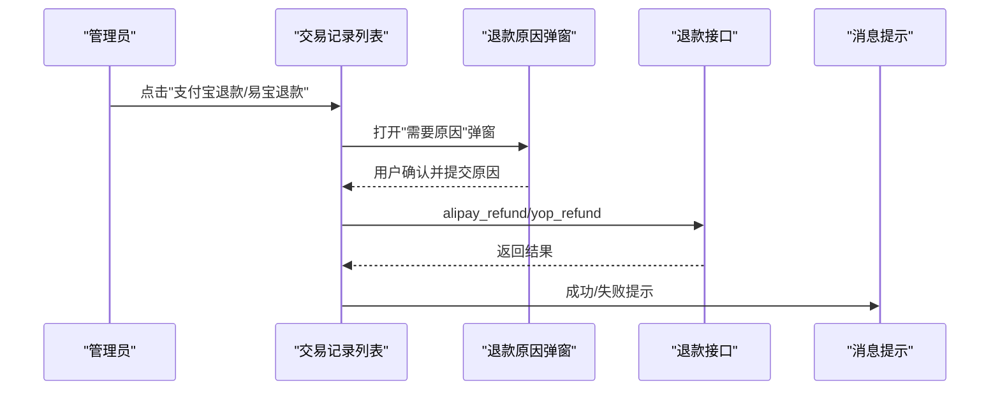

**图表来源**
- [transactionlist.vue:199-303](file://src/views/pay/transactionlist.vue#L199-L303)
- [pay.js:431-467](file://src/api/pay.js#L431-L467)

**章节来源**
- [transactionlist.vue:1-307](file://src/views/pay/transactionlist.vue#L1-L307)
- [pay.js:1-532](file://src/api/pay.js#L1-L532)

### 雷速币内购管理
- 功能要点
  - 内购订单列表：展示订单号、用户、商品、金额、状态、通知结果
  - 商品来源展示：根据来源映射显示来源标签
  - VIP 回收：对符合条件的 VIP 商品订单执行回收
  - 报表：提供内购相关报表入口

- 关键流程（VIP 回收）
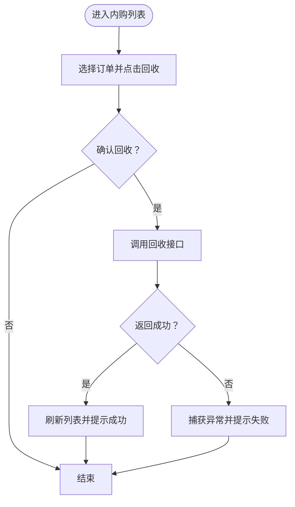

**图表来源**
- [trade_list.vue:183-199](file://src/views/pay/trade_list.vue#L183-L199)
- [pay.js:517-523](file://src/api/pay.js#L517-L523)

**章节来源**
- [trade_list.vue:1-268](file://src/views/pay/trade_list.vue#L1-L268)
- [pay.js:1-532](file://src/api/pay.js#L1-L532)

### 苹果内购管理
- 功能要点
  - 内购通知：按通知类型筛选、查看交易信息与其他信息
  - 黑名单管理：支持 UID/IP/设备三种维度的黑名单维护
  - 异常充值：查看异常充值记录并辅助定位风险

- 关键流程（内购通知筛选）
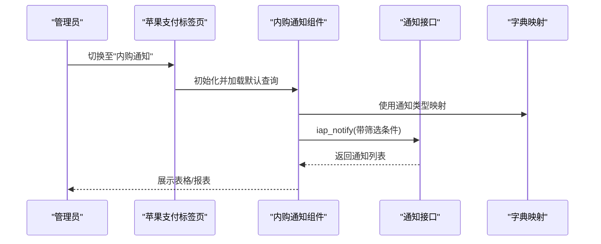

**图表来源**
- [iapNotifyTab.vue:1-37](file://src/views/pay/iapNotifyTab.vue#L1-L37)
- [iapNotify.vue:1-192](file://src/components/leisu/peopleInfo/shopping/components/oders/iapNotify.vue#L1-L192)
- [pay.js:468-483](file://src/api/pay.js#L468-L483)
- [pay.js:1-22](file://src/utils/dict/pay.js#L1-L22)

**章节来源**
- [iapNotifyTab.vue:1-37](file://src/views/pay/iapNotifyTab.vue#L1-L37)
- [iapNotify.vue:1-192](file://src/components/leisu/peopleInfo/shopping/components/oders/iapNotify.vue#L1-L192)
- [iapBlack.vue:1-210](file://src/components/leisu/peopleInfo/shopping/components/oders/iapBlack.vue#L1-L210)
- [pay.js:1-532](file://src/api/pay.js#L1-L532)
- [pay.js:1-122](file://src/utils/dict/pay.js#L1-L122)

### 提现管理
- 功能要点
  - 提现列表：展示用户、金额、手续费、应付金额、银行信息、处理状态
  - 批量操作：批量签约、批量修改渠道、汇总、提现
  - 认证与状态：展示身边云认证状态、个人服务费与到账金额

- 关键流程（批量提现）
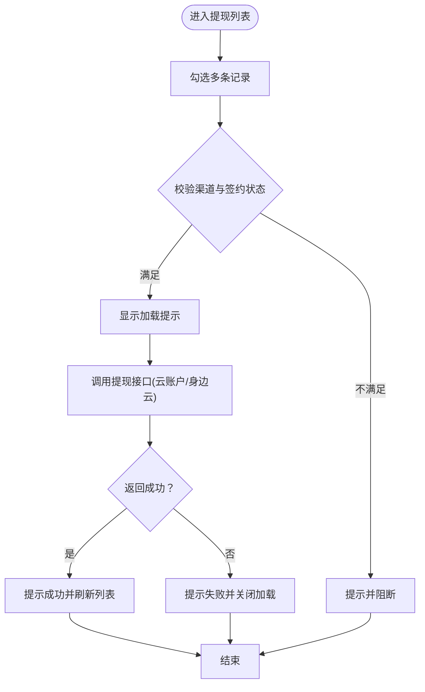

**图表来源**
- [withdraw_list.vue:467-526](file://src/views/pay/withdraw_list.vue#L467-L526)
- [pay.js:275-318](file://src/api/pay.js#L275-L318)

**章节来源**
- [withdraw_list.vue:1-530](file://src/views/pay/withdraw_list.vue#L1-L530)
- [pay.js:1-532](file://src/api/pay.js#L1-L532)

## 优惠券系统增强

### 二级卡产品映射系统
**新增** 支付管理模块引入了完整的二级卡产品映射系统，支持四种不同级别的次卡产品：

- **尝鲜卡** (`times_card_product_001`)
  - 价格：299元
  - 次数：5次
  - 使用限制：只能购买198元及以下专家号单关方案

- **精选卡** (`times_card_product_002`)
  - 价格：799元
  - 次数：10次
  - 使用限制：只能购买198元及以下专家号单关方案

- **黄金卡** (`times_card_product_003`)
  - 价格：1299元
  - 次数：15次

- **至尊卡** (`times_card_product_004`)
  - 价格：2299元
  - 次数：30次

### 优惠券创建验证逻辑
**更新** 优化了优惠券创建过程中的产品选择验证逻辑：

- 次卡类型必须绑定专家号
- 次卡类型必须选择对应的商品
- 金额和折扣只能二选一（专家号场景）
- 折扣值必须在1到9.9之间
- 金额必须大于0

### 优惠券发放组件
**增强** 优惠券发放组件提供了更丰富的功能：

- **单个优惠券发放** (`addCoupon.vue`)
  - 支持用户搜索与选择
  - 实时验证输入数据
  - 自动计算有效期

- **批量优惠券发放** (`addCouponBatch.vue`)
  - 支持多个用户同时发放
  - 动态添加优惠券模板
  - 批量验证与提交

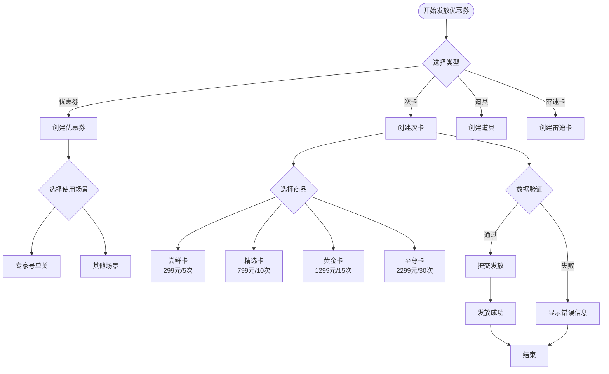

**图表来源**
- [addCoupon.vue:103-368](file://src/views/pay/components/addCoupon.vue#L103-L368)
- [addCouponBatch.vue:181-475](file://src/views/pay/components/addCouponBatch.vue#L181-L475)
- [pay.js:114-121](file://src/utils/dict/pay.js#L114-L121)

**章节来源**
- [leisu_coupon.vue:1-400](file://src/views/pay/leisu_coupon.vue#L1-L400)
- [addCoupon.vue:1-368](file://src/views/pay/components/addCoupon.vue#L1-L368)
- [addCouponBatch.vue:1-475](file://src/views/pay/components/addCouponBatch.vue#L1-L475)
- [pay.js:1-532](file://src/api/pay.js#L1-L532)
- [pay.js:1-122](file://src/utils/dict/pay.js#L1-L122)

## 依赖关系分析
- 组件与接口
  - 交易记录：依赖交易列表、交易详情、退款、手动到账等接口
  - 内购列表：依赖内购列表、VIP 回收接口
  - 苹果内购：依赖通知、黑名单、异常充值接口
  - 提现：依赖提现列表、批量签约、批量修改渠道、提现接口
  - **优惠券系统**：依赖优惠券列表、优惠券发放、优惠券类型映射接口

- 工具与字典
  - 支付方式、状态、来源、银行渠道等字典映射用于渲染与筛选
  - **二级卡产品映射**：提供次卡商品的详细信息与使用限制
  - 状态管理模块缓存卡券类型映射，减少重复请求

- 网络层
  - Axios 统一拦截器处理 Token 注入、错误提示与超时处理

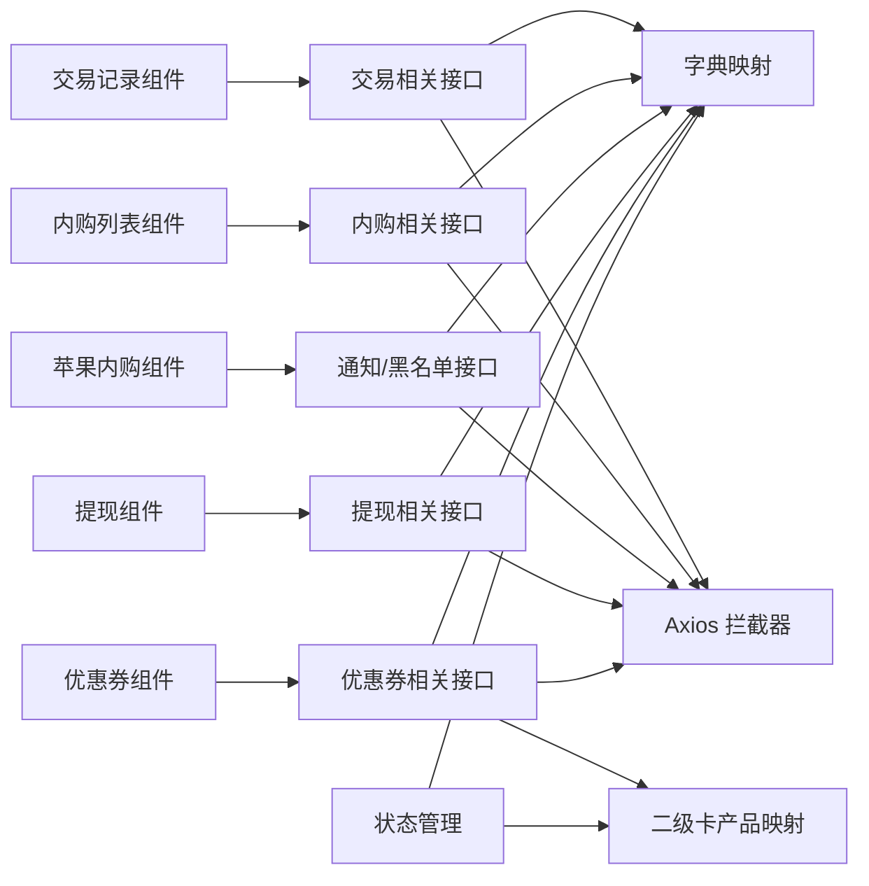

**图表来源**
- [transactionlist.vue:138-304](file://src/views/pay/transactionlist.vue#L138-L304)
- [trade_list.vue:131-243](file://src/views/pay/trade_list.vue#L131-L243)
- [iapNotifyTab.vue:1-37](file://src/views/pay/iapNotifyTab.vue#L1-L37)
- [withdraw_list.vue:271-527](file://src/views/pay/withdraw_list.vue#L271-L527)
- [leisu_coupon.vue:197-400](file://src/views/pay/leisu_coupon.vue#L197-L400)
- [pay.js:1-532](file://src/api/pay.js#L1-L532)
- [pay.js:1-122](file://src/utils/dict/pay.js#L1-L122)
- [pay.js:1-33](file://src/store/modules/pay.js#L1-L33)
- [request.js:22-127](file://src/utils/request.js#L22-L127)

**章节来源**
- [pay.js:1-532](file://src/api/pay.js#L1-L532)
- [pay.js:1-122](file://src/utils/dict/pay.js#L1-L122)
- [pay.js:1-33](file://src/store/modules/pay.js#L1-L33)
- [request.js:1-130](file://src/utils/request.js#L1-L130)

## 性能考量
- 列表查询优化
  - 合理设置分页大小与排序条件，避免一次性拉取过多数据
  - 对搜索关键词进行必要校验与清理，减少无效请求
- 图表与弹窗
  - 按需加载报表组件，避免不必要的渲染
  - 对大字段（如额外信息）采用懒展开或弹窗展示
- 网络层
  - 统一超时时间与错误提示，提升用户体验
  - 对批量操作增加前置校验，减少无效请求
- **优惠券系统优化**
  - 二级卡产品映射缓存，避免重复请求
  - 实时数据验证，减少服务器压力
  - 批量操作的并发控制

## 故障排查指南
- 常见问题
  - 登录态失效：接口返回特定 code 时触发登出并跳转首页
  - 接口不存在/超时：根据状态码提示具体错误信息
  - 退款失败：检查支付方式与订单状态，确认退款原因必填
  - 提现失败：核对渠道与签约状态，确保用户满足条件
  - **优惠券发放失败**：检查次卡商品选择、专家号绑定、数据验证规则

- 排查步骤
  - 查看网络面板与接口返回，确认 code 与 msg
  - 在组件中定位错误分支，结合字典映射核对状态值
  - 对批量操作增加日志输出，便于定位失败项
  - **验证优惠券类型映射与使用限制**

**章节来源**
- [request.js:46-127](file://src/utils/request.js#L46-L127)
- [transactionlist.vue:287-303](file://src/views/pay/transactionlist.vue#L287-L303)
- [withdraw_list.vue:467-526](file://src/views/pay/withdraw_list.vue#L467-L526)
- [addCoupon.vue:250-307](file://src/views/pay/components/addCoupon.vue#L250-L307)
- [addCouponBatch.vue:374-452](file://src/views/pay/components/addCouponBatch.vue#L374-L452)

## 结论
支付管理模块以清晰的分层设计与完善的接口封装支撑了交易、内购、苹果内购、提现与优惠券管理等核心场景。通过字典映射与状态管理提升可维护性，借助统一的网络层保证稳定性。最新的优惠券系统改进显著增强了次卡产品的管理能力，提供了更严格的数据验证和更好的用户体验。建议在后续迭代中进一步完善回调处理与对账机制，并持续优化查询与渲染性能。

## 附录
- 支付流程设计（概念示意）
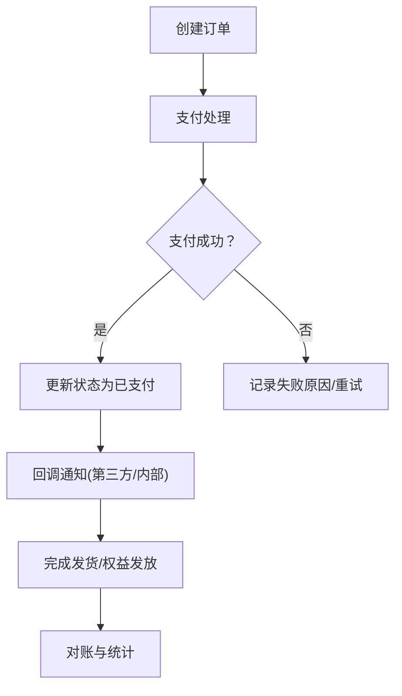

- 数据模型（概念示意）
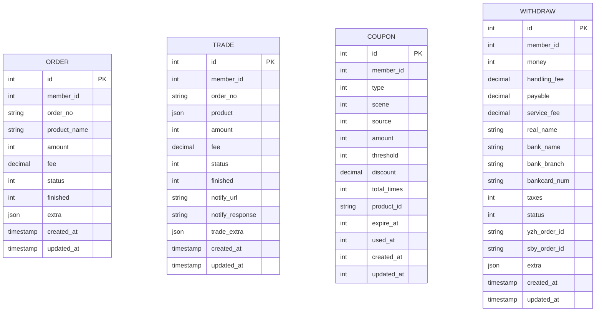

- **二级卡产品映射**
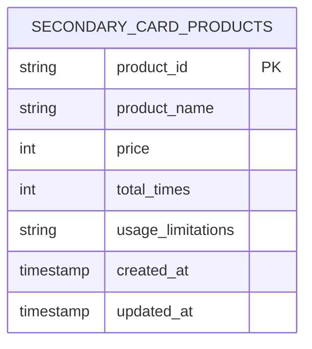