# 核心功能模块

<cite>
**本文引用的文件**
- [src/router/index.js](file://src/router/index.js)
- [src/router/children/member.js](file://src/router/children/member.js)
- [src/router/children/forum/index.js](file://src/router/children/forum/index.js)
- [src/router/children/media.js](file://src/router/children/media.js)
- [src/router/children/expert.js](file://src/router/children/expert.js)
- [src/router/children/predictor.js](file://src/router/children/predictor.js)
- [src/router/children/chat_room.js](file://src/router/children/chat_room.js)
- [src/router/children/contentSecurity.js](file://src/router/children/contentSecurity.js)
- [src/router/children/push.js](file://src/router/children/push.js)
- [src/router/children/match/index.js](file://src/router/children/match/index.js)
- [src/router/children/intelligence.js](file://src/router/children/intelligence.js)
- [src/router/children/pay.js](file://src/router/children/pay.js)
- [src/router/children/game.js](file://src/router/children/game.js)
- [src/router/children/app_set.js](file://src/router/children/app_set.js)
- [src/router/children/system.js](file://src/router/children/system.js)
- [src/router/children/ops_tools.js](file://src/router/children/ops_tools.js)
- [src/store/index.js](file://src/store/index.js)
- [src/main.js](file://src/main.js)
- [package.json](file://package.json)
</cite>

## 目录
1. [引言](#引言)
2. [项目结构](#项目结构)
3. [核心组件](#核心组件)
4. [架构总览](#架构总览)
5. [详细组件分析](#详细组件分析)
6. [依赖分析](#依赖分析)
7. [性能考虑](#性能考虑)
8. [故障排查指南](#故障排查指南)
9. [结论](#结论)
10. [附录](#附录)

## 引言
本文件面向 Leisu Admin 项目的“核心功能模块”，系统梳理并阐述以下八大模块的业务目标、核心功能、用户价值与技术实现，并解释模块间依赖关系、数据流转、权限控制、事件通信、扩展性设计、最佳实践、集成测试策略与部署注意事项。八大模块包括：用户管理、内容管理、体育数据管理、支付管理、专家系统、媒体管理、运营工具、系统配置。

## 项目结构
- 路由层通过主路由与子路由组织各功能域，子路由以“模块”为单位划分权限与菜单入口。
- 状态层采用 Vuex 自动加载 modules 目录下的模块，便于按功能域拆分状态。
- 应用入口集中注入全局过滤器、指令、组件、事件总线与运行环境判断，形成统一能力平台。

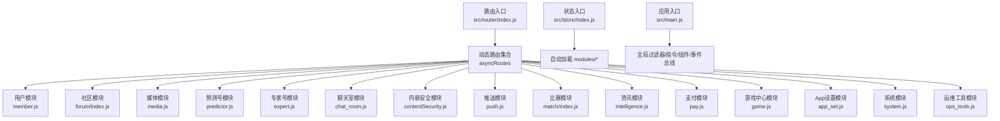

图表来源
- [src/router/index.js:74-160](file://src/router/index.js#L74-L160)
- [src/store/index.js:8-23](file://src/store/index.js#L8-L23)
- [src/main.js:28-518](file://src/main.js#L28-L518)

章节来源
- [src/router/index.js:74-160](file://src/router/index.js#L74-L160)
- [src/store/index.js:8-23](file://src/store/index.js#L8-L23)
- [src/main.js:28-518](file://src/main.js#L28-L518)

## 核心组件
- 路由与权限：通过 meta.roles 定义模块级权限点，结合前端指令与守卫实现菜单与页面访问控制。
- 状态管理：Vuex 模块化拆分，按域隔离状态，支持 getters 统一查询。
- 全局能力：事件总线、全局过滤器、指令、组件注册，统一对外提供通用能力。

章节来源
- [src/router/children/member.js:131-164](file://src/router/children/member.js#L131-L164)
- [src/router/children/forum/index.js:165-229](file://src/router/children/forum/index.js#L165-L229)
- [src/store/index.js:8-23](file://src/store/index.js#L8-L23)
- [src/main.js:492-518](file://src/main.js#L492-L518)

## 架构总览
下图展示模块在路由与权限上的总体布局，以及与状态层的关系：

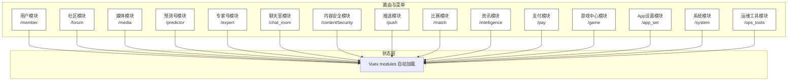

图表来源
- [src/router/index.js:74-160](file://src/router/index.js#L74-L160)
- [src/store/index.js:8-23](file://src/store/index.js#L8-L23)

## 详细组件分析

### 用户管理模块
- 业务目标：统一管理用户基础信息、实名认证、封禁与申诉、设备登录/注册、消息与反馈、用户分群与运营备注等。
- 核心功能：
  - 用户列表、分组记录、实名认证、封禁记录、协管员列表、申诉记录、调研与反馈、站内信、注销记录、荣誉挂件、手动发短信、手动校验实名、设备登录/注册、审核列表、运营备注、消息列表、用户站内信、人群包列表。
- 用户价值：提升用户生命周期管理效率，保障合规与风控。
- 技术实现：路由按角色点聚合；页面组件按职责拆分；权限通过 meta.roles 与指令控制。
- 数据流转：用户数据经 API 层获取，状态层按模块拆分存储，UI 通过统一过滤器与组件渲染。
- 依赖关系：与系统模块（用户组、操作日志）存在关联；与内容安全（敏感词、举报）存在交互。

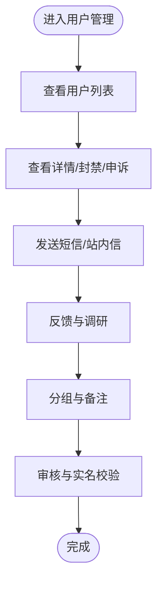

图表来源
- [src/router/children/member.js:3-164](file://src/router/children/member.js#L3-L164)

章节来源
- [src/router/children/member.js:3-164](file://src/router/children/member.js#L3-L164)

### 内容管理模块
- 业务目标：对社区、资讯、聊天室等内容进行审核、监控、敏感词治理与运营。
- 核心功能：
  - 社区：帖子/圈子/话题/评论/投票/敏感词/监控/自媒体审核/互动权限/周卡/付费/视频/打赏/举报/禁言/操作记录/中台帖子。
  - 资讯：资讯列表、作者与草稿管理、公告、评论、机审、敏感词、评论操作记录、评论员、专题、分类、频道、纠错、打赏、禁言、举报、问答、中台资讯。
  - 聊天室：聊天室监控、举报、敏感词、机器人文案、禁言记录、表情包、礼物/卡/雷速梗、投票。
- 用户价值：保障内容生态健康，提升内容质量与用户参与度。
- 技术实现：多子路由聚合，权限点覆盖审核、监控、运营、推送等维度。
- 数据流转：内容数据经 API 获取，状态层按模块拆分，UI 通过统一组件与指令渲染。

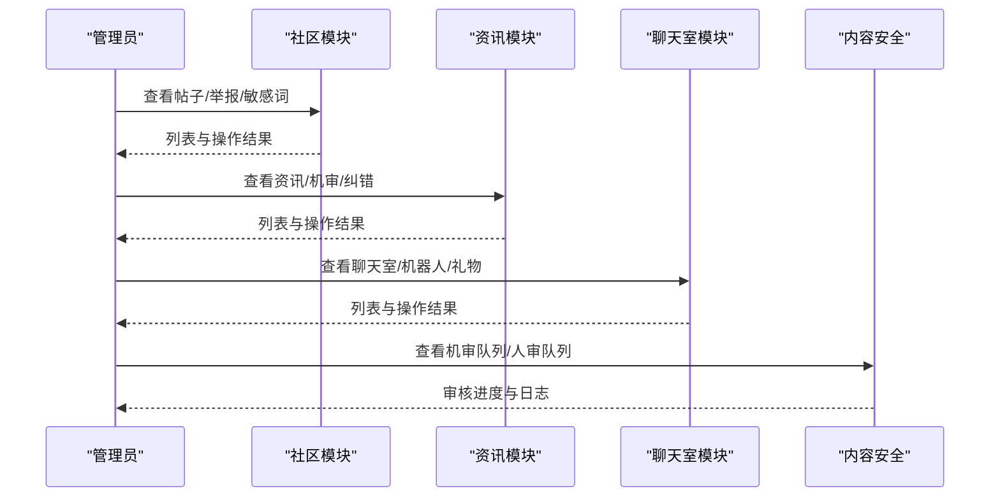

图表来源
- [src/router/children/forum/index.js:3-229](file://src/router/children/forum/index.js#L3-L229)
- [src/router/children/intelligence.js:4-191](file://src/router/children/intelligence.js#L4-L191)
- [src/router/children/chat_room.js:3-89](file://src/router/children/chat_room.js#L3-L89)
- [src/router/children/contentSecurity.js:3-43](file://src/router/children/contentSecurity.js#L3-L43)

章节来源
- [src/router/children/forum/index.js:3-229](file://src/router/children/forum/index.js#L3-L229)
- [src/router/children/intelligence.js:4-191](file://src/router/children/intelligence.js#L4-L191)
- [src/router/children/chat_room.js:3-89](file://src/router/children/chat_room.js#L3-L89)
- [src/router/children/contentSecurity.js:3-43](file://src/router/children/contentSecurity.js#L3-L43)

### 体育数据管理模块
- 业务目标：统一管理各类体育比赛数据，覆盖多球类与电竞，支撑分析、视频、情报、销售等场景。
- 核心功能：
  - 分析、屏蔽、球员评分、销售、视频、足球/篮球/网球/排球/棒球/橄榄球/冰球/板球/斯诺克/羽毛球/乒乓球、LOL/CSGO/DOTA/KOG 等。
- 用户价值：为分析师、运营与内容团队提供统一的数据视图与操作入口。
- 技术实现：按球类/游戏拆分子路由，权限点覆盖列表、情报、视频、销售、屏蔽等。
- 数据流转：数据来源于后端 API，前端通过统一组件与指令渲染，状态层按模块拆分。

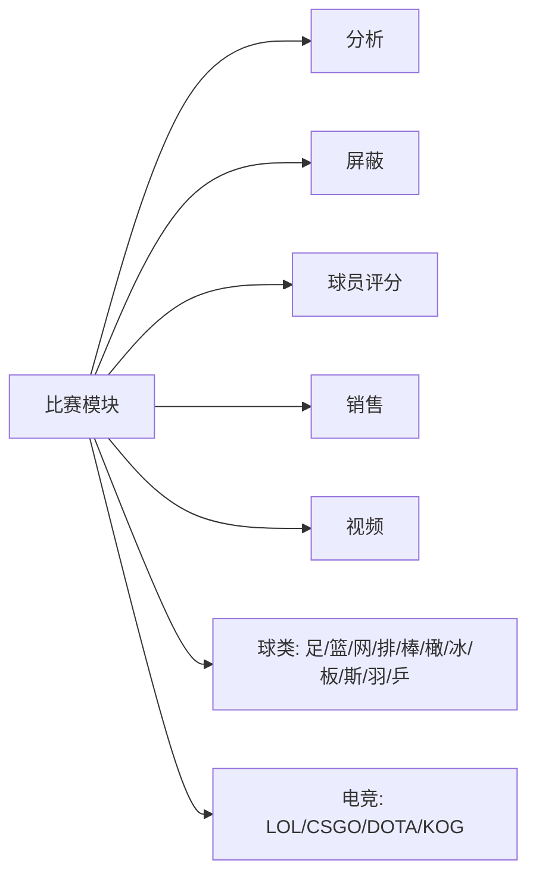

图表来源
- [src/router/children/match/index.js:25-276](file://src/router/children/match/index.js#L25-L276)

章节来源
- [src/router/children/match/index.js:25-276](file://src/router/children/match/index.js#L25-L276)

### 支付管理模块
- 业务目标：统一管理交易、提现、卡券、厂商与第三方支付，保障资金流安全与可追溯。
- 核心功能：交易记录、第三方支付订单、卡券、雷速币内购、手动订单、提现记录/申请、银行信息、厂商列表、苹果支付、咪咕订单。
- 用户价值：提升财务对账效率与风控能力。
- 技术实现：路由按业务维度拆分，权限点覆盖交易、提现、卡券、厂商等。
- 数据流转：支付数据经 API 获取，状态层按模块拆分，UI 通过统一组件渲染。

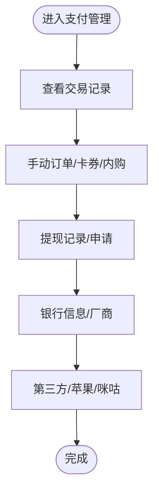

图表来源
- [src/router/children/pay.js:3-100](file://src/router/children/pay.js#L3-L100)

章节来源
- [src/router/children/pay.js:3-100](file://src/router/children/pay.js#L3-L100)

### 专家系统模块
- 业务目标：管理专家号、预测号、AI分析与销售、异常比赛、天梯赛季等，支撑预测内容生态。
- 核心功能：
  - 专家号：列表、申请/变更/申诉、操作记录、比赛/文章/赛事/报表、站内信、异常比赛、AI分析、AI销售、分布购买、天梯赛季。
  - 预测号：列表、申请/变更/申诉、比赛/赛事/榜单/单关/串关/足彩/文章购买记录、敏感词、AI分析、AI销售、分布购买、天梯赛季、异常比赛、报表、评分抽样、推荐推送、禁收禁发、操作历史。
- 用户价值：提升预测内容质量与销售转化，完善风控与报表体系。
- 技术实现：两套子路由分别覆盖专家号与预测号，权限点覆盖列表、审核、报表、AI、销售、异常等。
- 数据流转：预测数据经 API 获取，状态层按模块拆分，UI 通过统一组件渲染。

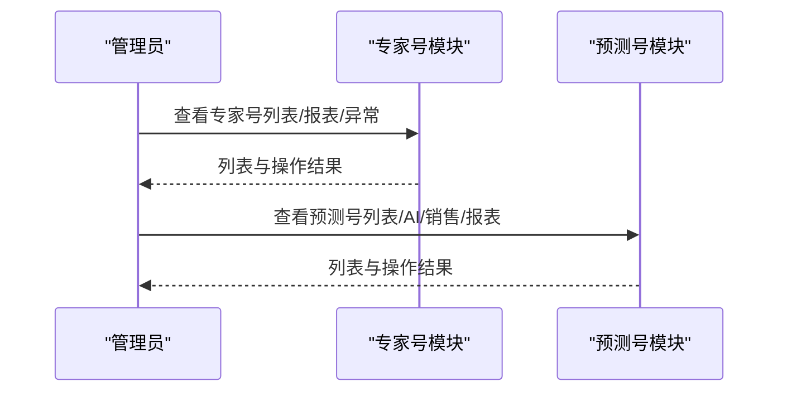

图表来源
- [src/router/children/expert.js:3-122](file://src/router/children/expert.js#L3-L122)
- [src/router/children/predictor.js:2-177](file://src/router/children/predictor.js#L2-L177)

章节来源
- [src/router/children/expert.js:3-122](file://src/router/children/expert.js#L3-L122)
- [src/router/children/predictor.js:2-177](file://src/router/children/predictor.js#L2-L177)

### 媒体管理模块
- 业务目标：管理“雷速号”内容与运营，覆盖文章、比赛、报表与异常监控。
- 核心功能：雷速号列表、申请/变更/申诉审核、敏感词、单关/串关/足彩文章、比赛列表、报表、操作记录、站内信、异常比赛、天梯赛季。
- 用户价值：规范自媒体内容生产与分发，提升内容质量与收益。
- 技术实现：路由按业务维度拆分，权限点覆盖列表、审核、报表、异常等。
- 数据流转：媒体数据经 API 获取，状态层按模块拆分，UI 通过统一组件渲染。

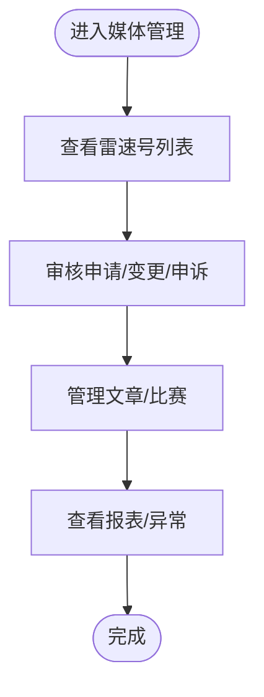

图表来源
- [src/router/children/media.js:3-127](file://src/router/children/media.js#L3-L127)

章节来源
- [src/router/children/media.js:3-127](file://src/router/children/media.js#L3-L127)

### 运营工具模块
- 业务目标：提供后台运维与采集工具，保障系统稳定性与数据同步。
- 核心功能：缓存刷新、任务/推送/APP/调试日志、用户轨迹、风险识别、同步纳米、MQTT/足球比分发送、采集（虎扑/直播吧/新闻）。
- 用户价值：提升运维效率与问题定位速度。
- 技术实现：子路由覆盖日志、工具、采集等，权限点覆盖对应功能。
- 数据流转：日志与工具数据经 API 获取，状态层按模块拆分，UI 通过统一组件渲染。

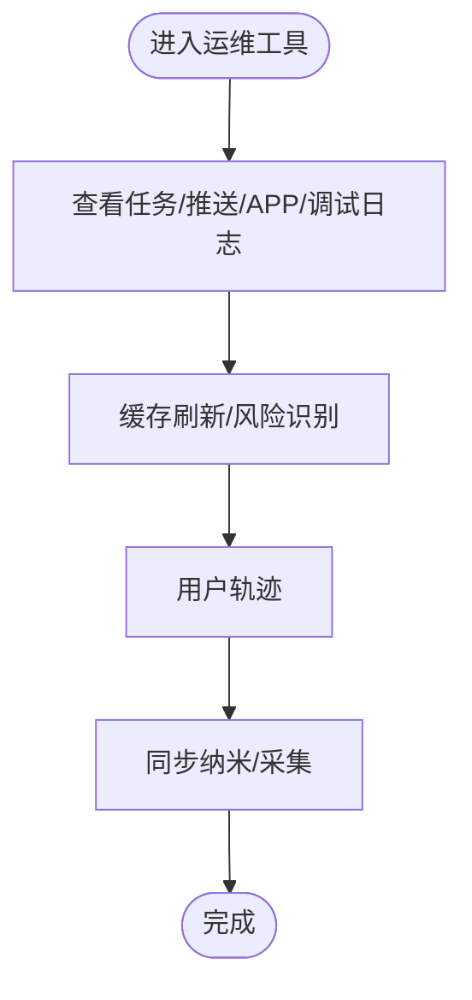

图表来源
- [src/router/children/ops_tools.js:3-127](file://src/router/children/ops_tools.js#L3-L127)

章节来源
- [src/router/children/ops_tools.js:3-127](file://src/router/children/ops_tools.js#L3-L127)

### 系统配置模块
- 业务目标：管理后台用户、用户组与操作日志，保障系统安全与审计。
- 核心功能：系统用户列表、用户组列表、后台操作记录、VPN 记录。
- 用户价值：强化权限治理与审计能力。
- 技术实现：路由按功能拆分，权限点覆盖用户、组、日志等。
- 数据流转：系统数据经 API 获取，状态层按模块拆分，UI 通过统一组件渲染。

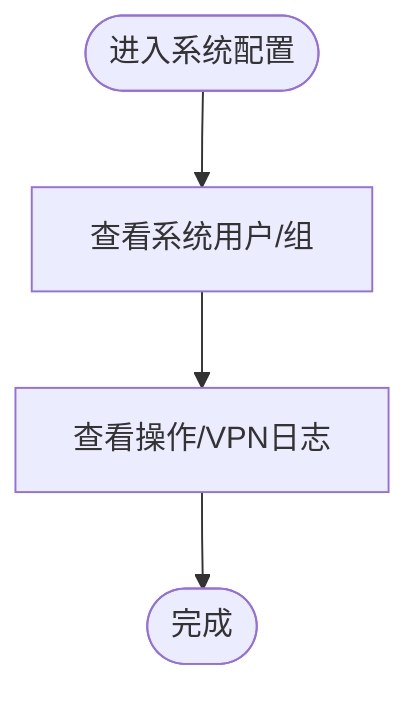

图表来源
- [src/router/children/system.js:3-39](file://src/router/children/system.js#L3-L39)

章节来源
- [src/router/children/system.js:3-39](file://src/router/children/system.js#L3-L39)

### App 设置模块
- 业务目标：管理移动端 Banner、广告、版本、协议、功能开关、个人页背景、社区版块与友链。
- 核心功能：Banner 设置、雷速广告、版本管理、协议配置、App 功能设置、个人页背景列表、社区版块设置、友情链接。
- 用户价值：提升移动端用户体验与运营灵活性。
- 技术实现：路由按配置维度拆分，权限点覆盖对应配置项。
- 数据流转：配置数据经 API 获取，状态层按模块拆分，UI 通过统一组件渲染。

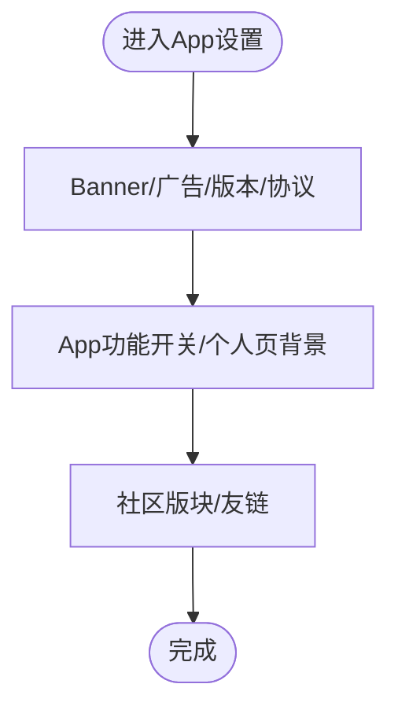

图表来源
- [src/router/children/app_set.js:3-73](file://src/router/children/app_set.js#L3-L73)

章节来源
- [src/router/children/app_set.js:3-73](file://src/router/children/app_set.js#L3-L73)

### 游戏中心模块
- 业务目标：管理游戏概览、预约、游戏列表、公司列表、首页、充值记录。
- 核心功能：游戏概览、预约列表、游戏列表、公司列表、游戏首页、游戏充值。
- 用户价值：完善游戏生态运营与数据可视化。
- 技术实现：路由按业务维度拆分，权限点覆盖概览、列表、首页、充值等。
- 数据流转：游戏数据经 API 获取，状态层按模块拆分，UI 通过统一组件渲染。

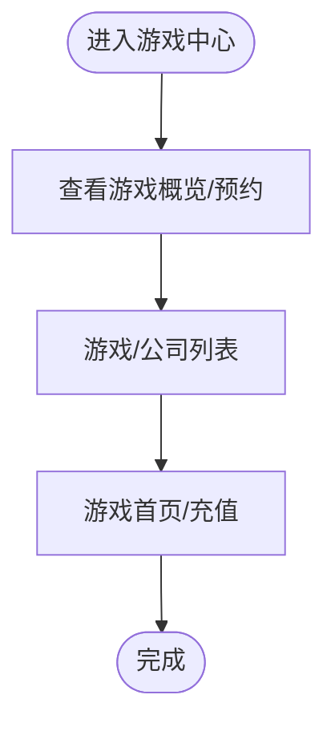

图表来源
- [src/router/children/game.js:3-51](file://src/router/children/game.js#L3-L51)

章节来源
- [src/router/children/game.js:3-51](file://src/router/children/game.js#L3-L51)

### 推送模块
- 业务目标：管理广播、单推与后台敏感词，保障消息触达与内容安全。
- 核心功能：广播列表、单推列表、后台敏感词。
- 用户价值：提升消息运营效率与内容合规。
- 技术实现：路由按功能拆分，权限点覆盖广播、单推、敏感词等。
- 数据流转：推送数据经 API 获取，状态层按模块拆分，UI 通过统一组件渲染。

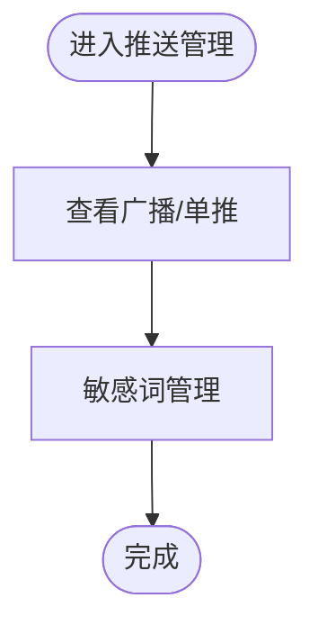

图表来源
- [src/router/children/push.js:3-31](file://src/router/children/push.js#L3-L31)

章节来源
- [src/router/children/push.js:3-31](file://src/router/children/push.js#L3-L31)

## 依赖分析
- 路由依赖：主路由集中导入各子路由，子路由通过 meta.roles 定义权限点，形成“模块-权限点”映射。
- 状态依赖：Vuex 自动扫描 modules 目录，模块间通过 getters 与 actions 解耦，避免直接耦合。
- 全局依赖：main.js 注入全局过滤器、指令、组件与事件总线，统一对外提供能力。

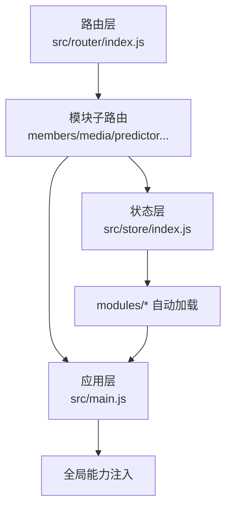

图表来源
- [src/router/index.js:74-160](file://src/router/index.js#L74-L160)
- [src/store/index.js:8-23](file://src/store/index.js#L8-L23)
- [src/main.js:28-518](file://src/main.js#L28-L518)

章节来源
- [src/router/index.js:74-160](file://src/router/index.js#L74-L160)
- [src/store/index.js:8-23](file://src/store/index.js#L8-L23)
- [src/main.js:28-518](file://src/main.js#L28-L518)

## 性能考虑
- 路由懒加载：子路由使用动态导入，减少首屏体积。
- 组件按需注册：大量通用组件在 main.js 中按需注册，避免全局污染。
- 状态拆分：Vuex 模块化拆分，降低状态更新范围与复杂度。
- 过滤器与指令：统一在入口注入，减少重复计算与逻辑分散。
- 图片与资源：提供 CDN 前缀工具函数，统一资源路径处理。

章节来源
- [src/router/index.js:92-160](file://src/router/index.js#L92-L160)
- [src/main.js:372-441](file://src/main.js#L372-L441)
- [src/store/index.js:8-23](file://src/store/index.js#L8-L23)

## 故障排查指南
- 权限相关
  - 现象：菜单不可见或页面无法访问。
  - 排查：检查 meta.roles 是否包含当前用户角色；检查指令 v-has 是否生效；检查路由是否正确挂载到 asyncRoutes。
- 日志与运维
  - 现象：任务/推送/APP/调试日志异常。
  - 排查：进入运维工具模块查看对应日志；检查缓存刷新、风险识别、用户轨迹等功能是否正常。
- 事件通信
  - 现象：跨组件通信失效。
  - 排查：确认事件总线初始化与组件注册；检查事件命名与参数传递。
- 资源路径
  - 现象：图片/资源路径异常。
  - 排查：使用 addPrefix/removePrefix 工具函数统一处理；确认 CDN 配置与域名前缀规则。

章节来源
- [src/router/children/ops_tools.js:3-127](file://src/router/children/ops_tools.js#L3-L127)
- [src/main.js:515-518](file://src/main.js#L515-L518)
- [src/main.js:423-441](file://src/main.js#L423-L441)

## 结论
Leisu Admin 通过“路由-权限-状态-全局能力”的清晰分层，将八大功能模块有机整合，既满足了业务的精细化运营需求，又保证了系统的可维护性与扩展性。建议在新增模块时遵循现有模式：定义子路由与权限点、拆分 Vuex 模块、复用全局能力与组件，确保一致性与可演进性。

## 附录
- 开发与构建
  - 本地/开发/生产构建脚本与预览命令见 package.json scripts。
  - 测试：单元测试与 ESLint 规则已配置，建议在新增模块时补充单元测试与规范检查。
- 部署建议
  - 使用构建产物进行静态部署；确保 CDN 资源可用；关注路由模式与服务端支持情况。

章节来源
- [package.json:7-20](file://package.json#L7-L20)