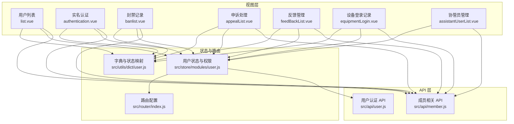
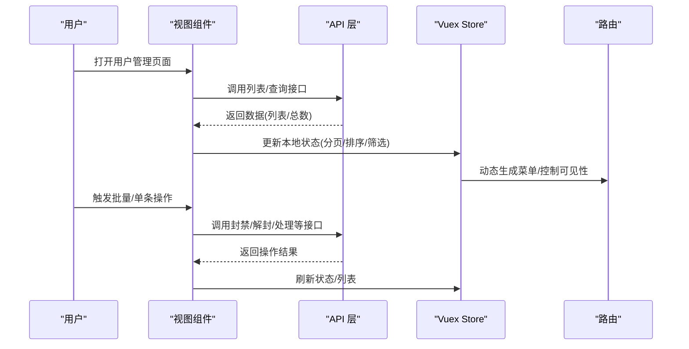
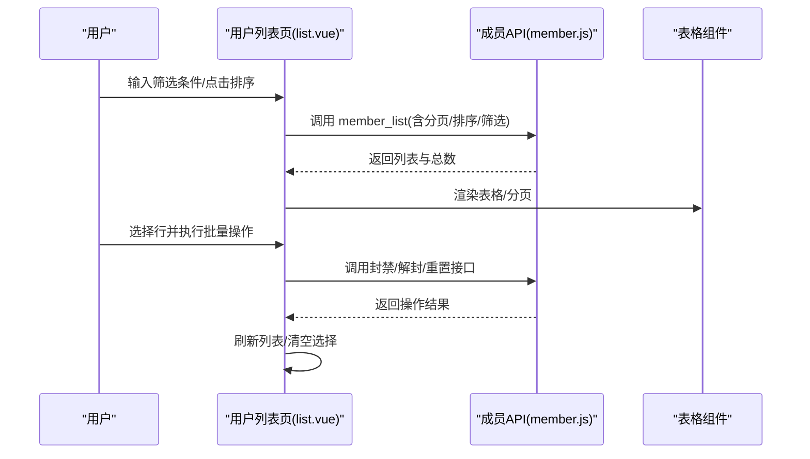
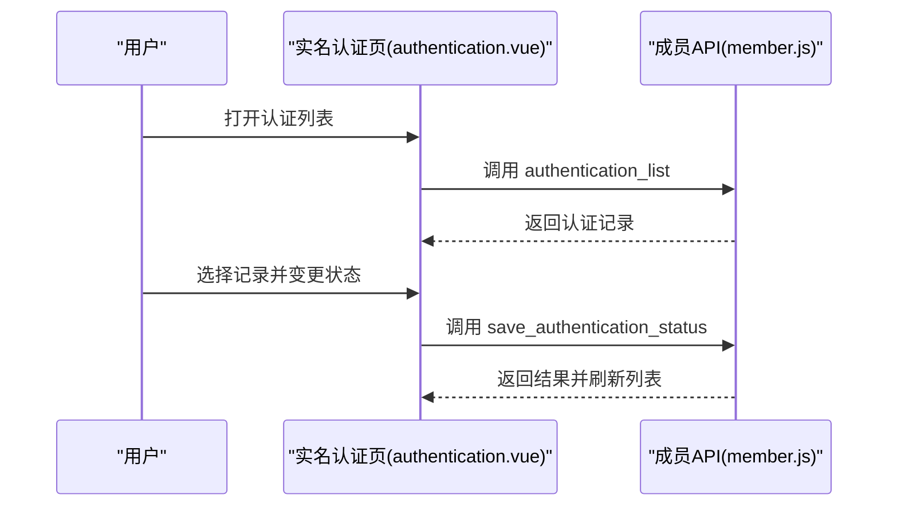
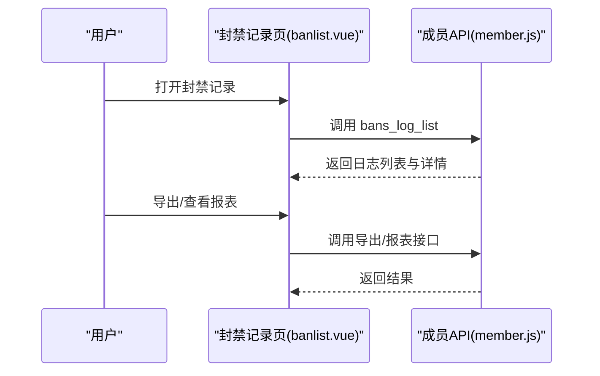
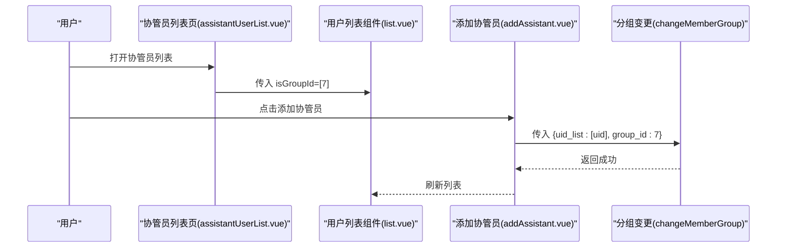
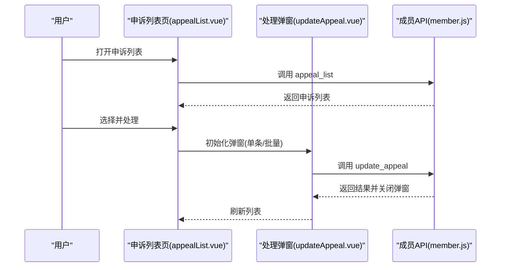
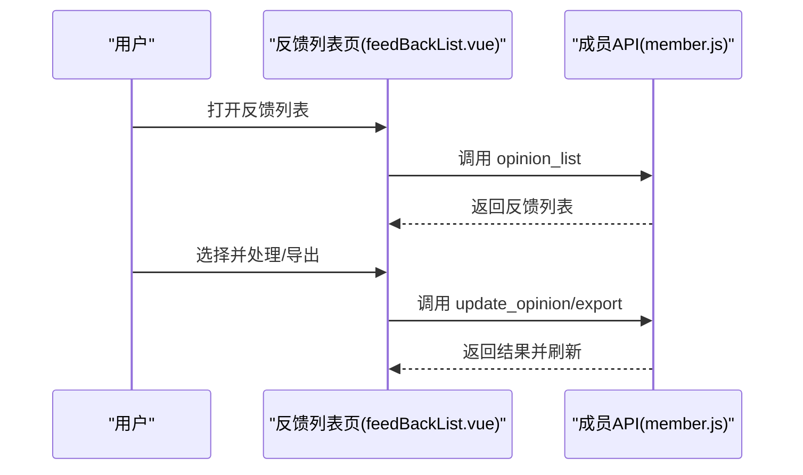
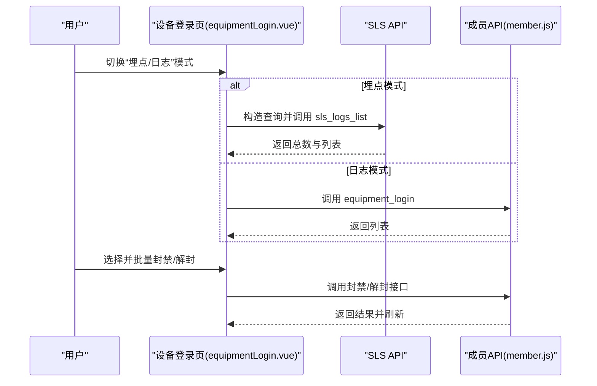
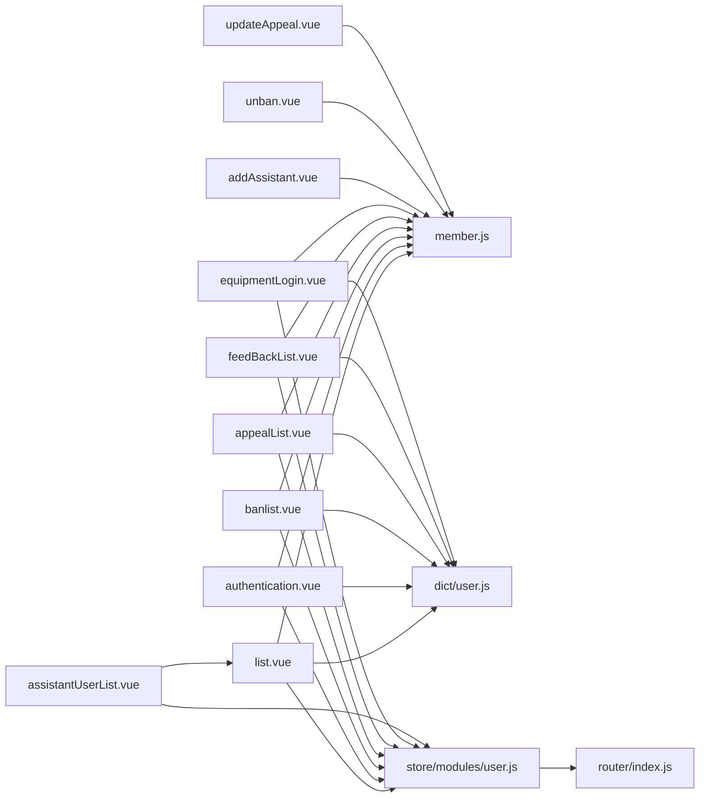

# 用户管理模块

<cite>
**本文档引用的文件**
- [src/api/user.js](file://src/api/user.js)
- [src/store/modules/user.js](file://src/store/modules/user.js)
- [src/router/index.js](file://src/router/index.js)
- [src/views/member/list.vue](file://src/views/member/list.vue)
- [src/views/member/authentication.vue](file://src/views/member/authentication.vue)
- [src/views/member/banlist.vue](file://src/views/member/banlist.vue)
- [src/views/member/appealList.vue](file://src/views/member/appealList.vue)
- [src/views/member/feedBackList.vue](file://src/views/member/feedBackList.vue)
- [src/views/member/equipmentLogin.vue](file://src/views/member/equipmentLogin.vue)
- [src/views/member/assistantUserList.vue](file://src/views/member/assistantUserList.vue)
- [src/views/member/components/addAssistant.vue](file://src/views/member/components/addAssistant.vue)
- [src/views/member/components/unban.vue](file://src/views/member/components/unban.vue)
- [src/views/member/components/updateAppeal.vue](file://src/views/member/components/updateAppeal.vue)
- [src/api/member.js](file://src/api/member.js)
- [src/utils/dict/user.js](file://src/utils/dict/user.js)
</cite>

## 目录
1. [简介](#简介)
2. [项目结构](#项目结构)
3. [核心组件](#核心组件)
4. [架构总览](#架构总览)
5. [详细组件分析](#详细组件分析)
6. [依赖关系分析](#依赖关系分析)
7. [性能考虑](#性能考虑)
8. [故障排查指南](#故障排查指南)
9. [结论](#结论)
10. [附录](#附录)

## 简介
本技术文档面向用户管理模块，系统性阐述用户列表管理、实名认证审核、封禁记录管理、协管员管理、申诉处理、反馈管理、设备登录记录等核心功能。文档覆盖业务流程、数据模型、API 设计与前端实现，并解释权限控制机制（角色分配、权限验证、菜单控制）、数据增删改查（批量操作、搜索筛选、分页处理），同时给出最佳实践（数据安全、性能优化、用户体验）以及具体代码示例路径与配置说明，帮助开发者快速理解与扩展功能。

## 项目结构
用户管理模块位于前端工程的 views/member 目录下，围绕“用户列表”“实名认证”“封禁记录”“申诉处理”“反馈管理”“设备登录记录”“协管员管理”等页面展开；API 层集中于 src/api/member.js；权限与用户信息存储于 src/store/modules/user.js；路由配置位于 src/router/index.js；字典与状态映射位于 src/utils/dict/user.js。

图表来源
- [src/views/member/list.vue](file://src/views/member/list.vue)
- [src/views/member/authentication.vue](file://src/views/member/authentication.vue)
- [src/views/member/banlist.vue](file://src/views/member/banlist.vue)
- [src/views/member/appealList.vue](file://src/views/member/appealList.vue)
- [src/views/member/feedBackList.vue](file://src/views/member/feedBackList.vue)
- [src/views/member/equipmentLogin.vue](file://src/views/member/equipmentLogin.vue)
- [src/views/member/assistantUserList.vue](file://src/views/member/assistantUserList.vue)
- [src/api/member.js](file://src/api/member.js)
- [src/api/user.js](file://src/api/user.js)
- [src/store/modules/user.js](file://src/store/modules/user.js)
- [src/router/index.js](file://src/router/index.js)
- [src/utils/dict/user.js](file://src/utils/dict/user.js)

章节来源
- [src/views/member/list.vue](file://src/views/member/list.vue)
- [src/views/member/authentication.vue](file://src/views/member/authentication.vue)
- [src/views/member/banlist.vue](file://src/views/member/banlist.vue)
- [src/views/member/appealList.vue](file://src/views/member/appealList.vue)
- [src/views/member/feedBackList.vue](file://src/views/member/feedBackList.vue)
- [src/views/member/equipmentLogin.vue](file://src/views/member/equipmentLogin.vue)
- [src/views/member/assistantUserList.vue](file://src/views/member/assistantUserList.vue)
- [src/api/member.js](file://src/api/member.js)
- [src/api/user.js](file://src/api/user.js)
- [src/store/modules/user.js](file://src/store/modules/user.js)
- [src/router/index.js](file://src/router/index.js)
- [src/utils/dict/user.js](file://src/utils/dict/user.js)

## 核心组件
- 用户列表管理：支持分页、排序、筛选、批量操作（封禁、拉黑、昵称违规重置）、查看用户详情、发放道具等。
- 实名认证审核：展示认证状态、证件类型、人脸认证状态、附加信息，支持批量封禁与报表查看。
- 封禁记录管理：展示封禁来源、类型、操作人、持续时间、消息条数、额外信息，支持导出与报表。
- 协管员管理：以“用户分组=7”的形式展示协管员列表，支持添加协管员与移除协管员。
- 申诉处理：支持批量/单条处理、设置短期封禁时长、设置申诉间隔、快捷回复模板、动作联动。
- 反馈管理：支持批量处理、导出、按类型/平台/版本/渠道等维度查看与处理。
- 设备登录记录：支持“埋点/日志”双模式，展示设备 ID、UserAgent、IP 地址、渠道、版本、地址等，支持批量封禁/解封与用户信息关联。

章节来源
- [src/views/member/list.vue](file://src/views/member/list.vue)
- [src/views/member/authentication.vue](file://src/views/member/authentication.vue)
- [src/views/member/banlist.vue](file://src/views/member/banlist.vue)
- [src/views/member/appealList.vue](file://src/views/member/appealList.vue)
- [src/views/member/feedBackList.vue](file://src/views/member/feedBackList.vue)
- [src/views/member/equipmentLogin.vue](file://src/views/member/equipmentLogin.vue)
- [src/views/member/assistantUserList.vue](file://src/views/member/assistantUserList.vue)

## 架构总览
用户管理模块采用典型的前端三层架构：
- 视图层：各功能页面负责交互与展示，使用 Element UI 组件与自定义混入、工具函数。
- API 层：封装对后端接口的调用，统一错误处理与数据转换。
- 状态与路由层：Vuex 管理用户信息、角色权限、产品列表、渠道信息等；路由根据权限动态生成菜单。

图表来源
- [src/views/member/list.vue](file://src/views/member/list.vue)
- [src/api/member.js](file://src/api/member.js)
- [src/store/modules/user.js](file://src/store/modules/user.js)
- [src/router/index.js](file://src/router/index.js)

## 详细组件分析

### 用户列表管理
- 功能要点
  - 分页与排序：支持列排序与自定义排序字段。
  - 筛选与搜索：通过 newMySearch 组件集成历史/自定义搜索条件。
  - 批量操作：批量封禁（短期/永久）、批量拉黑、批量昵称违规重置、批量发放道具。
  - 权限控制：根据权限显示列与按钮（如“可提现/不可提现”）。
  - 用户详情：点击 UID 或昵称打开侧边抽屉查看用户基础信息。
- 数据模型
  - 列表字段包含 UID、昵称、头像、第三方绑定、等级、状态/权限、金币、可提现/不可提现、渠道、VIP 到期时间、注册时间/平台等。
- API 接口
  - 成员列表：member_list
  - 批量昵称违规重置：set_name
  - 封禁/解封：ban、unban、permanent_ban、permanent_unban
  - 设备标签：devices_tag
  - 用户详情：get_detail
- 前端实现
  - 使用 Pagination 组件进行分页；使用工具函数处理排序与时间格式化；通过 hasPwer 权限判断控制列与按钮显示。

图表来源
- [src/views/member/list.vue](file://src/views/member/list.vue)
- [src/api/member.js](file://src/api/member.js)

章节来源
- [src/views/member/list.vue](file://src/views/member/list.vue)
- [src/api/member.js](file://src/api/member.js)

### 实名认证审核
- 功能要点
  - 展示用户实名状态、证件类型、人脸认证状态、附加信息与认证图片。
  - 支持变更状态（通过/拒绝）与批量封禁。
  - 报表查看入口。
- 数据模型
  - 字段包含 uid、real_name、id_type、id_num、face_imgs、face_verified_at、submitted_at、created_at、extra、reason 等。
- API 接口
  - 认证列表：authentication_list
  - 保存认证状态：save_authentication_status
- 前端实现
  - 使用字典映射认证状态与证件类型；通过 changeStatusTemp 弹窗处理状态变更；支持报表弹窗。

图表来源
- [src/views/member/authentication.vue](file://src/views/member/authentication.vue)
- [src/api/member.js](file://src/api/member.js)

章节来源
- [src/views/member/authentication.vue](file://src/views/member/authentication.vue)
- [src/api/member.js](file://src/api/member.js)
- [src/utils/dict/user.js](file://src/utils/dict/user.js)

### 封禁记录管理
- 功能要点
  - 展示封禁来源、类型、操作人、持续时间、消息条数、额外信息。
  - 支持导出与报表查看。
- 数据模型
  - 字段包含 id、uid、message、detail.content、detail.attachment、source、type、operate_member/operate_name、persist_time、message_num、extra 等。
- API 接口
  - 封禁日志列表：bans_log_list
  - 导出：ban_log_export
- 前端实现
  - 使用字典映射来源与类型；支持排序与导出 Excel。

图表来源
- [src/views/member/banlist.vue](file://src/views/member/banlist.vue)
- [src/api/member.js](file://src/api/member.js)

章节来源
- [src/views/member/banlist.vue](file://src/views/member/banlist.vue)
- [src/api/member.js](file://src/api/member.js)
- [src/utils/dict/user.js](file://src/utils/dict/user.js)

### 协管员管理
- 功能要点
  - 以“用户分组=7”展示协管员列表。
  - 支持添加协管员与移除协管员。
- 前端实现
  - assistantUserList.vue 直接复用用户列表组件并传入 isGroupId=[7]。
  - 添加协管员通过 addAssistant.vue 弹窗选择用户并调用 changeMemberGroup 完成分组变更。

图表来源
- [src/views/member/assistantUserList.vue](file://src/views/member/assistantUserList.vue)
- [src/views/member/list.vue](file://src/views/member/list.vue)
- [src/views/member/components/addAssistant.vue](file://src/views/member/components/addAssistant.vue)

章节来源
- [src/views/member/assistantUserList.vue](file://src/views/member/assistantUserList.vue)
- [src/views/member/list.vue](file://src/views/member/list.vue)
- [src/views/member/components/addAssistant.vue](file://src/views/member/components/addAssistant.vue)

### 申诉处理
- 功能要点
  - 支持批量/单条处理，设置短期封禁时长或申诉间隔，快捷回复模板，动作联动（如异地登录联动“踢下线+禁言2周”）。
- 数据模型
  - 字段包含 id、uid、ban_message、ban_time、ban_operate_member、reason、reply、timed_execution、result、expedited、treat_time、created_at、updated_at、operate_id、operate_name、extra 等。
- API 接口
  - 申诉列表：appeal_list
  - 处理申诉：update_appeal
- 前端实现
  - updateAppeal.vue 提供弹窗与快捷回复；appealList.vue 控制表格列与操作按钮。

图表来源
- [src/views/member/appealList.vue](file://src/views/member/appealList.vue)
- [src/views/member/components/updateAppeal.vue](file://src/views/member/components/updateAppeal.vue)
- [src/api/member.js](file://src/api/member.js)

章节来源
- [src/views/member/appealList.vue](file://src/views/member/appealList.vue)
- [src/views/member/components/updateAppeal.vue](file://src/views/member/components/updateAppeal.vue)
- [src/api/member.js](file://src/api/member.js)
- [src/utils/dict/user.js](file://src/utils/dict/user.js)

### 反馈管理
- 功能要点
  - 支持批量处理、导出、按类型/平台/版本/渠道等维度查看与处理。
- 数据模型
  - 字段包含 created_at、treat_time、uid、operate_name、operate_id、session_id/intelligence_id、type_name、content、contact_info、images、result、platform、version、channel、model_info、extra_data、remark、ip、address 等。
- API 接口
  - 反馈列表：opinion_list
  - 处理反馈：update_opinion
- 前端实现
  - feedBackList.vue 支持导出 Excel 与快捷回复；根据 source 切换不同搜索条件。

图表来源
- [src/views/member/feedBackList.vue](file://src/views/member/feedBackList.vue)
- [src/api/member.js](file://src/api/member.js)

章节来源
- [src/views/member/feedBackList.vue](file://src/views/member/feedBackList.vue)
- [src/api/member.js](file://src/api/member.js)
- [src/utils/dict/user.js](file://src/utils/dict/user.js)

### 设备登录记录
- 功能要点
  - “埋点/日志”双模式：埋点模式基于 SLS 查询，日志模式基于常规接口。
  - 展示设备 ID、UserAgent、IP 地址、渠道、版本、地址、详情等。
  - 支持批量封禁/解封与用户信息关联。
- 数据模型
  - 埋点模式：ctime、device_id、platform、idfa/android_id、uuid/android_sn、channel、ver、province、extra 等。
  - 日志模式：uid、platform_name、login_method、device_id、user_agent、ip、ver、create_time 等。
- API 接口
  - 设备登录日志：equipment_login
  - 设备注册日志：equipment_register
  - SLS 日志：sls_logs_list
- 前端实现
  - equipmentLogin.vue 根据版本切换查询策略；支持排序与用户信息关联查询。

图表来源
- [src/views/member/equipmentLogin.vue](file://src/views/member/equipmentLogin.vue)
- [src/api/member.js](file://src/api/member.js)

章节来源
- [src/views/member/equipmentLogin.vue](file://src/views/member/equipmentLogin.vue)
- [src/api/member.js](file://src/api/member.js)

## 依赖关系分析
- 组件耦合
  - 各功能页均依赖 src/api/member.js 与通用工具函数（排序、时间格式化、字典映射）。
  - 用户列表页与协管员管理页共享用户列表组件，通过 isGroupId 参数控制分组。
  - 申诉与反馈页依赖各自弹窗组件完成批量处理与快捷回复。
- 状态与路由
  - Vuex store 中的用户信息、角色权限、产品列表、渠道信息等用于动态生成菜单与控制界面元素显示。
  - 路由根据权限动态注入日志页面等子路由。

图表来源
- [src/views/member/list.vue](file://src/views/member/list.vue)
- [src/views/member/authentication.vue](file://src/views/member/authentication.vue)
- [src/views/member/banlist.vue](file://src/views/member/banlist.vue)
- [src/views/member/appealList.vue](file://src/views/member/appealList.vue)
- [src/views/member/feedBackList.vue](file://src/views/member/feedBackList.vue)
- [src/views/member/equipmentLogin.vue](file://src/views/member/equipmentLogin.vue)
- [src/views/member/assistantUserList.vue](file://src/views/member/assistantUserList.vue)
- [src/views/member/components/addAssistant.vue](file://src/views/member/components/addAssistant.vue)
- [src/views/member/components/unban.vue](file://src/views/member/components/unban.vue)
- [src/views/member/components/updateAppeal.vue](file://src/views/member/components/updateAppeal.vue)
- [src/api/member.js](file://src/api/member.js)
- [src/utils/dict/user.js](file://src/utils/dict/user.js)
- [src/store/modules/user.js](file://src/store/modules/user.js)
- [src/router/index.js](file://src/router/index.js)

章节来源
- [src/views/member/list.vue](file://src/views/member/list.vue)
- [src/views/member/assistantUserList.vue](file://src/views/member/assistantUserList.vue)
- [src/api/member.js](file://src/api/member.js)
- [src/store/modules/user.js](file://src/store/modules/user.js)
- [src/router/index.js](file://src/router/index.js)
- [src/utils/dict/user.js](file://src/utils/dict/user.js)

## 性能考虑
- 列表加载优化
  - 使用虚拟滚动与固定高度减少 DOM 渲染压力；合理设置分页大小与懒加载。
  - 对排序与筛选参数进行去抖与合并，避免频繁请求。
- 图片与附件
  - 对图片列表使用缩略图与懒加载；对大附件采用分页或延迟加载。
- 缓存策略
  - 利用 Vuex 缓存产品列表、渠道信息、字典映射，减少重复请求。
- 请求合并
  - 批量操作前先校验权限与参数，合并请求体，减少网络往返。
- 交互体验
  - 加载状态与骨架屏提升感知速度；错误提示与重试机制增强可用性。

## 故障排查指南
- 登录与权限
  - 若出现“权限不足”或“角色为空”，检查 getInfo 流程中的权限列表与角色校验逻辑。
- 列表为空或异常
  - 检查 search_cond 参数是否正确转换（如时间范围、operate_customize 映射）；确认分页参数与排序字段。
- 批量操作失败
  - 核对 uid_list 与必填字段（如申诉处理的 reason）；查看接口返回码与提示信息。
- 设备登录模式切换
  - 埋点模式需确保 SLS 查询构造正确；日志模式需过滤掉埋点专用字段。
- 导出与报表
  - 确认导出接口参数与当前筛选条件一致；检查浏览器插件与跨域配置。

章节来源
- [src/store/modules/user.js](file://src/store/modules/user.js)
- [src/views/member/appealList.vue](file://src/views/member/appealList.vue)
- [src/views/member/equipmentLogin.vue](file://src/views/member/equipmentLogin.vue)
- [src/api/member.js](file://src/api/member.js)

## 结论
用户管理模块通过清晰的视图-接口-状态-路由分层，实现了用户列表、实名认证、封禁记录、协管员、申诉、反馈、设备登录等核心能力。结合权限控制与字典映射，前端具备良好的可维护性与扩展性。建议在后续迭代中进一步完善埋点模式的数据准确性、批量操作的原子性与一致性，以及报表与导出的性能优化。

## 附录
- 权限控制机制
  - 角色分配：后端返回 roles.permission_list，前端据此控制菜单与按钮显示。
  - 菜单控制：根据权限动态注入路由与子路由。
  - 按钮控制：hasPwer 方法判断具体操作权限。
- 数据安全
  - 对敏感字段（如可提现/不可提现）在无权限时进行遮罩处理。
  - 批量操作前进行二次确认与参数校验。
- 最佳实践
  - 使用工具函数统一处理排序、时间格式化与字典映射。
  - 对高频接口进行缓存与去抖处理。
  - 在弹窗组件中提供快捷回复模板与动作联动，提升处理效率。