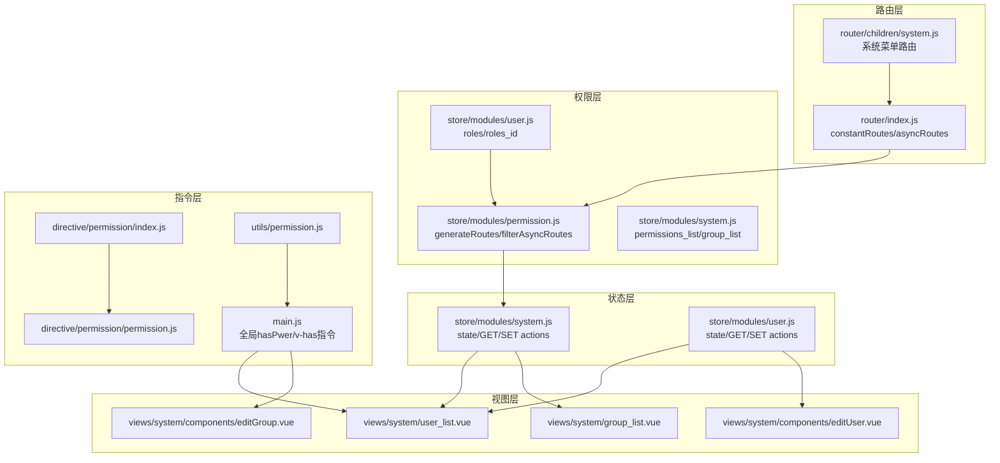
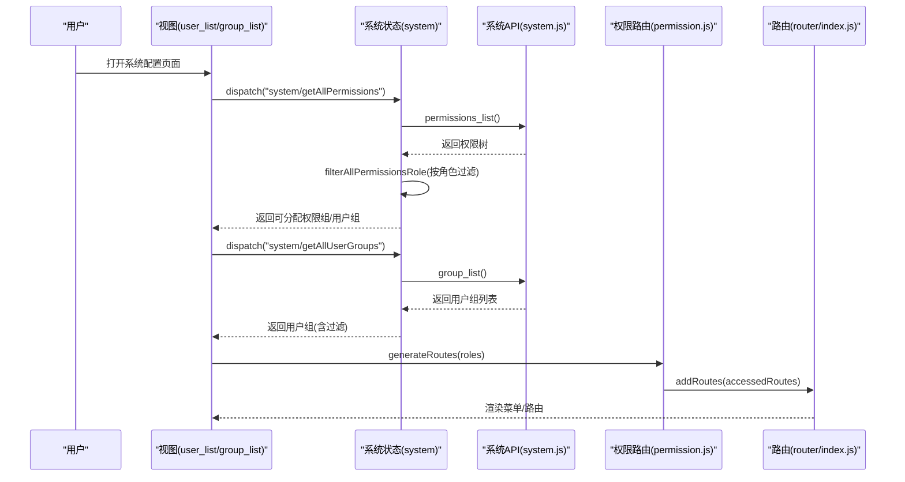
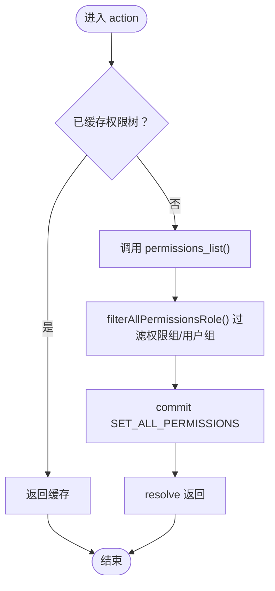
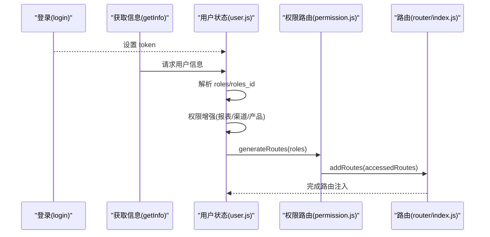
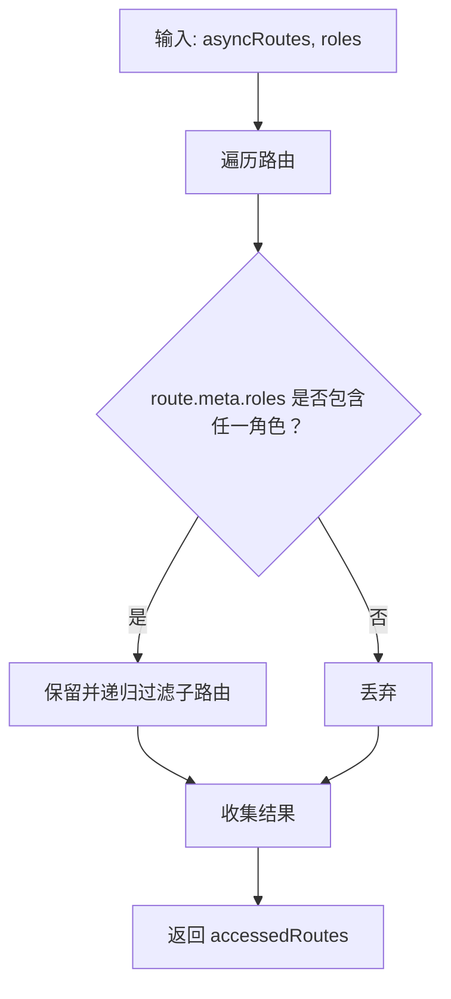
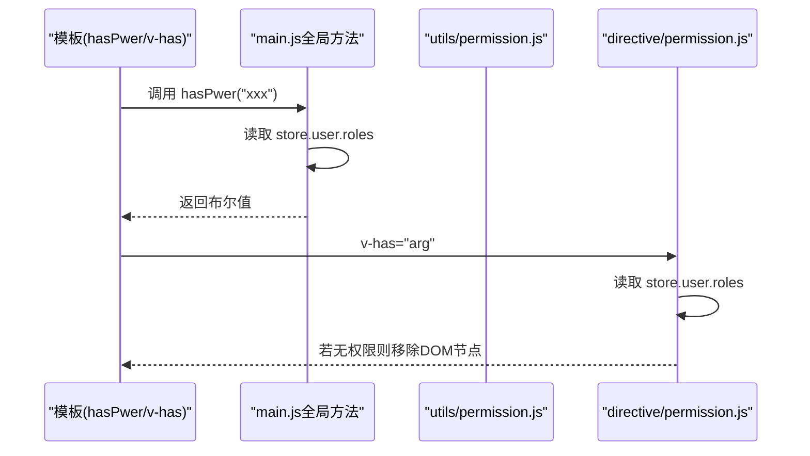
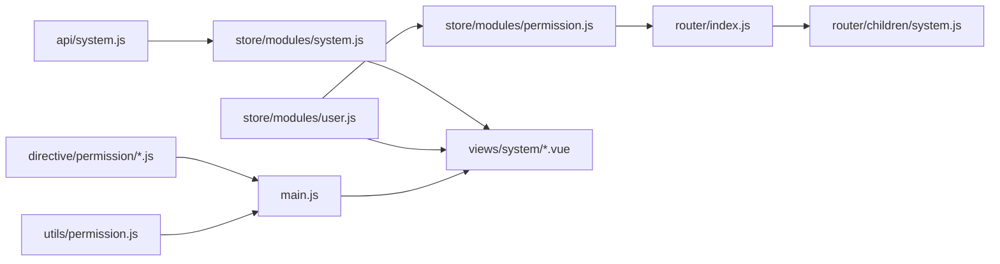

# 系统配置模块

<cite>
**本文引用的文件**
- [src/store/modules/system.js](file://src/store/modules/system.js)
- [src/store/modules/user.js](file://src/store/modules/user.js)
- [src/store/modules/permission.js](file://src/store/modules/permission.js)
- [src/api/system.js](file://src/api/system.js)
- [src/views/system/user_list.vue](file://src/views/system/user_list.vue)
- [src/views/system/group_list.vue](file://src/views/system/group_list.vue)
- [src/views/system/components/editGroup.vue](file://src/views/system/components/editGroup.vue)
- [src/views/system/components/editUser.vue](file://src/views/system/components/editUser.vue)
- [src/router/children/system.js](file://src/router/children/system.js)
- [src/router/index.js](file://src/router/index.js)
- [src/directive/permission/index.js](file://src/directive/permission/index.js)
- [src/directive/permission/permission.js](file://src/directive/permission/permission.js)
- [src/utils/permission.js](file://src/utils/permission.js)
- [src/main.js](file://src/main.js)
</cite>

## 目录
1. [简介](#简介)
2. [项目结构](#项目结构)
3. [核心组件](#核心组件)
4. [架构总览](#架构总览)
5. [详细组件分析](#详细组件分析)
6. [依赖关系分析](#依赖关系分析)
7. [性能考量](#性能考量)
8. [故障排查指南](#故障排查指南)
9. [结论](#结论)
10. [附录](#附录)

## 简介
本技术文档围绕系统配置模块展开，重点覆盖以下方面：
- 系统参数设置与权限模型：基于角色的权限管理（RBAC），权限来源、过滤与路由生成。
- 用户权限管理与角色管理：用户组、用户列表、权限授权与按钮级控制。
- 菜单配置与权限控制：菜单项的权限元数据、动态路由生成与渲染。
- 权限控制机制：前端指令级按钮权限、路由级菜单权限、用户组与权限组联动。
- 架构设计：配置中心（权限与用户组）、权限模型（角色/权限/用户组）、数据同步（Store 与 API）。
- 最佳实践：权限设计原则、配置管理策略、安全防护建议。
- 扩展机制：自定义权限、动态菜单、插件化能力。

## 项目结构
系统配置模块由“路由-权限-状态-视图-指令”五层协同构成：
- 路由层：定义系统模块的菜单与权限入口。
- 权限层：根据用户角色过滤路由并注入动态路由。
- 状态层：集中管理权限、用户组、用户信息等。
- 视图层：用户列表、用户组列表、编辑弹窗等界面。
- 指令层：按钮级权限控制。

**图表来源**
- [src/router/index.js:1-177](file://src/router/index.js#L1-L177)
- [src/router/children/system.js:1-39](file://src/router/children/system.js#L1-L39)
- [src/store/modules/permission.js:1-66](file://src/store/modules/permission.js#L1-L66)
- [src/store/modules/system.js:1-186](file://src/store/modules/system.js#L1-L186)
- [src/store/modules/user.js:1-542](file://src/store/modules/user.js#L1-L542)
- [src/views/system/user_list.vue:1-245](file://src/views/system/user_list.vue#L1-L245)
- [src/views/system/group_list.vue:1-151](file://src/views/system/group_list.vue#L1-L151)
- [src/views/system/components/editGroup.vue:1-207](file://src/views/system/components/editGroup.vue#L1-L207)
- [src/views/system/components/editUser.vue:1-73](file://src/views/system/components/editUser.vue#L1-L73)
- [src/directive/permission/index.js:1-14](file://src/directive/permission/index.js#L1-L14)
- [src/directive/permission/permission.js:1-23](file://src/directive/permission/permission.js#L1-L23)
- [src/utils/permission.js:1-26](file://src/utils/permission.js#L1-L26)
- [src/main.js:179-192](file://src/main.js#L179-L192)

**章节来源**
- [src/router/index.js:1-177](file://src/router/index.js#L1-L177)
- [src/router/children/system.js:1-39](file://src/router/children/system.js#L1-L39)
- [src/store/modules/permission.js:1-66](file://src/store/modules/permission.js#L1-L66)
- [src/store/modules/system.js:1-186](file://src/store/modules/system.js#L1-L186)
- [src/store/modules/user.js:1-542](file://src/store/modules/user.js#L1-L542)

## 核心组件
- 系统权限状态模块：负责加载与缓存权限树、用户组列表，并根据当前用户角色过滤可分配的权限组与用户组。
- 用户状态模块：负责登录、获取用户信息、角色集合、动态注入路由与报表权限增强。
- 权限路由模块：根据用户角色递归过滤异步路由，生成可访问路由表。
- 系统API模块：提供用户、用户组、权限、操作日志等后端接口封装。
- 视图组件：用户列表、用户组列表、编辑用户组、编辑用户等。
- 权限指令：v-permission、v-has、全局hasPwer方法，实现按钮级权限控制。

**章节来源**
- [src/store/modules/system.js:1-186](file://src/store/modules/system.js#L1-L186)
- [src/store/modules/user.js:1-542](file://src/store/modules/user.js#L1-L542)
- [src/store/modules/permission.js:1-66](file://src/store/modules/permission.js#L1-L66)
- [src/api/system.js:1-73](file://src/api/system.js#L1-L73)
- [src/views/system/user_list.vue:1-245](file://src/views/system/user_list.vue#L1-L245)
- [src/views/system/group_list.vue:1-151](file://src/views/system/group_list.vue#L1-L151)
- [src/views/system/components/editGroup.vue:1-207](file://src/views/system/components/editGroup.vue#L1-L207)
- [src/views/system/components/editUser.vue:1-73](file://src/views/system/components/editUser.vue#L1-L73)
- [src/directive/permission/index.js:1-14](file://src/directive/permission/index.js#L1-L14)
- [src/directive/permission/permission.js:1-23](file://src/directive/permission/permission.js#L1-L23)
- [src/utils/permission.js:1-26](file://src/utils/permission.js#L1-L26)
- [src/main.js:179-192](file://src/main.js#L179-L192)

## 架构总览
系统配置模块采用“前端RBAC + 动态路由 + 指令控制”的整体架构：
- 权限来源：后端返回权限树与用户组列表，前端在首次登录或切换角色时拉取并缓存。
- 权限过滤：根据当前用户的角色ID与角色列表，过滤可分配的权限组与用户组。
- 路由生成：将过滤后的权限映射为路由元信息，结合用户角色生成可访问路由。
- 视图渲染：菜单根据路由自动渲染；按钮通过指令与全局方法进行权限判断。
- 数据同步：Store 中的状态变化驱动视图更新，API 层负责与后端交互。

**图表来源**
- [src/views/system/user_list.vue:159-198](file://src/views/system/user_list.vue#L159-L198)
- [src/views/system/group_list.vue:96-114](file://src/views/system/group_list.vue#L96-L114)
- [src/store/modules/system.js:38-61](file://src/store/modules/system.js#L38-L61)
- [src/store/modules/system.js:142-165](file://src/store/modules/system.js#L142-L165)
- [src/store/modules/permission.js:50-57](file://src/store/modules/permission.js#L50-L57)
- [src/router/index.js:74-160](file://src/router/index.js#L74-L160)

## 详细组件分析

### 组件A：系统权限状态模块（system.js）
职责与流程：
- 加载权限树：首次从后端拉取权限列表，过滤可分配的权限组与用户组，写入状态。
- 用户组管理：加载用户组列表，支持按当前用户可分配范围过滤。
- 状态同步：提供更新接口，确保视图与状态一致。

关键点：
- 权限组过滤逻辑：依据当前用户角色中的“roleGroup_xxx”前缀，决定哪些权限组可被分配。
- 用户组过滤逻辑：非超级管理员仅能看到其具备“userGroupRole_xxx”权限的用户组。
- 缓存策略：优先使用已缓存数据，减少重复请求。

**图表来源**
- [src/store/modules/system.js:38-61](file://src/store/modules/system.js#L38-L61)
- [src/store/modules/system.js:64-133](file://src/store/modules/system.js#L64-L133)

**章节来源**
- [src/store/modules/system.js:1-186](file://src/store/modules/system.js#L1-L186)

### 组件B：用户状态模块（user.js）
职责与流程：
- 登录与信息获取：登录成功后拉取用户信息，解析角色与权限列表。
- 权限增强：根据特定权限组合，自动追加报表类权限，保证功能完整性。
- 动态路由：根据角色生成可访问路由并注入到路由表。
- 其他：渠道、产品、标签等辅助数据的拉取与缓存。

关键点：
- 角色ID与角色列表：roles_id用于区分超级管理员与普通管理员；roles为权限字符串数组。
- 报表权限增强：媒体、预测号、社区流水等权限组合自动补齐。
- 动态路由注入：resetRouter 后重新生成路由，确保权限变更生效。

**图表来源**
- [src/store/modules/user.js:140-336](file://src/store/modules/user.js#L140-L336)
- [src/store/modules/permission.js:50-57](file://src/store/modules/permission.js#L50-L57)
- [src/router/index.js:171-174](file://src/router/index.js#L171-L174)

**章节来源**
- [src/store/modules/user.js:1-542](file://src/store/modules/user.js#L1-L542)

### 组件C：权限路由模块（permission.js）
职责与流程：
- hasPermission：根据路由 meta.roles 与用户角色数组判断是否可见。
- filterAsyncRoutes：递归过滤异步路由，生成可访问路由集合。
- generateRoutes：对外暴露的入口，返回可注入的路由表。

关键点：
- 路由元信息：meta.roles 数组用于声明该路由需要的角色集合。
- 递归过滤：支持多级子路由的权限继承与过滤。

**图表来源**
- [src/store/modules/permission.js:8-35](file://src/store/modules/permission.js#L8-L35)

**章节来源**
- [src/store/modules/permission.js:1-66](file://src/store/modules/permission.js#L1-L66)

### 组件D：系统API模块（system.js）
职责与流程：
- 用户相关：获取用户详情、用户列表、保存用户、删除用户。
- 用户组相关：获取用户组列表、保存用户组、删除用户组。
- 权限相关：获取权限列表、按权限查询拥有该权限的用户组。
- 操作日志：获取后台操作记录。

关键点：
- 所有接口以 Promise 形式返回，便于在视图层统一处理。
- 与系统状态模块配合，完成权限树与用户组的加载与更新。

**章节来源**
- [src/api/system.js:1-73](file://src/api/system.js#L1-L73)

### 组件E：用户列表视图（user_list.vue）
职责与流程：
- 列表展示：分页、排序、搜索条件传递至后端。
- 用户组编辑：点击用户组名称，打开编辑弹窗，支持复制/编辑/删除。
- 删除用户：二次确认后调用删除接口。
- 数据来源：通过系统状态模块获取用户组列表与权限树，控制搜索条件与可见性。

关键点：
- 搜索条件拼装：自动注入当前用户可查看的用户组ID集合，避免越权查询。
- 权限控制：表格列中使用按钮权限方法控制“编辑/删除”按钮的显示。

**章节来源**
- [src/views/system/user_list.vue:1-245](file://src/views/system/user_list.vue#L1-L245)

### 组件F：用户组列表视图（group_list.vue）
职责与流程：
- 列表展示：用户组名称、描述、状态。
- 编辑/复制/删除：打开编辑弹窗，支持复制现有用户组配置。
- 数据来源：通过系统状态模块获取用户组列表，支持刷新与更新。

关键点：
- 超级管理员可见“添加用户组”按钮；其他角色受“userGroupRole_xxx”权限约束。
- 编辑弹窗中展示权限树，支持全选/反选与部分勾选。

**章节来源**
- [src/views/system/group_list.vue:1-151](file://src/views/system/group_list.vue#L1-L151)

### 组件G：编辑用户组组件（editGroup.vue）
职责与流程：
- 权限树展示：将权限树按权限组分组，支持全选/反选与部分勾选。
- 保存用户组：将勾选的权限集合提交至后端保存。
- 查看权限组：点击权限项可查看拥有该权限的用户组列表。

关键点：
- 权限树格式化：通过工具函数将扁平权限树转换为“权限组-权限项”的二维结构。
- 行隐藏逻辑：根据当前用户可分配的权限组，隐藏不可见的权限组行。

**章节来源**
- [src/views/system/components/editGroup.vue:1-207](file://src/views/system/components/editGroup.vue#L1-L207)

### 组件H：编辑用户组件（editUser.vue）
职责与流程：
- 初始化：根据当前用户信息填充表单。
- 用户组选择：下拉框展示当前用户可分配的用户组。
- 保存用户：提交用户信息（含用户组、禁用状态、状态）。

关键点：
- 用户组来源：通过系统状态模块获取用户组列表，确保权限一致性。
- 保存后回调：触发父组件刷新列表。

**章节来源**
- [src/views/system/components/editUser.vue:1-73](file://src/views/system/components/editUser.vue#L1-L73)

### 组件I：权限指令与按钮控制（directive/permission、utils/permission、main.js）
职责与流程：
- v-permission：在插入 DOM 时检查元素绑定的权限数组，若无权限则移除节点。
- v-has：全局指令，按权限键移除节点。
- hasPwer：全局方法，用于按钮级权限判断（如模板中 v-if）。

关键点：
- 指令与方法均从 Store 中读取当前用户的角色数组。
- 指令抛出明确错误信息，便于开发调试。

**图表来源**
- [src/main.js:179-192](file://src/main.js#L179-L192)
- [src/utils/permission.js:8-25](file://src/utils/permission.js#L8-L25)
- [src/directive/permission/permission.js:4-21](file://src/directive/permission/permission.js#L4-L21)

**章节来源**
- [src/directive/permission/index.js:1-14](file://src/directive/permission/index.js#L1-L14)
- [src/directive/permission/permission.js:1-23](file://src/directive/permission/permission.js#L1-L23)
- [src/utils/permission.js:1-26](file://src/utils/permission.js#L1-L26)
- [src/main.js:179-192](file://src/main.js#L179-L192)

## 依赖关系分析
- 路由依赖：系统模块路由依赖于常量路由与布局组件；动态路由由权限路由模块生成。
- 权限依赖：权限路由模块依赖用户角色；系统状态模块依赖后端API。
- 视图依赖：用户列表与用户组列表依赖系统状态模块；编辑弹窗依赖API与工具函数。
- 指令依赖：指令与全局方法依赖 Store 中的用户角色。

**图表来源**
- [src/api/system.js:1-73](file://src/api/system.js#L1-L73)
- [src/store/modules/system.js:1-186](file://src/store/modules/system.js#L1-L186)
- [src/store/modules/user.js:1-542](file://src/store/modules/user.js#L1-L542)
- [src/store/modules/permission.js:1-66](file://src/store/modules/permission.js#L1-L66)
- [src/router/index.js:1-177](file://src/router/index.js#L1-L177)
- [src/router/children/system.js:1-39](file://src/router/children/system.js#L1-L39)
- [src/directive/permission/index.js:1-14](file://src/directive/permission/index.js#L1-L14)
- [src/directive/permission/permission.js:1-23](file://src/directive/permission/permission.js#L1-L23)
- [src/utils/permission.js:1-26](file://src/utils/permission.js#L1-L26)
- [src/main.js:179-192](file://src/main.js#L179-L192)

**章节来源**
- [src/router/index.js:1-177](file://src/router/index.js#L1-L177)
- [src/router/children/system.js:1-39](file://src/router/children/system.js#L1-L39)
- [src/store/modules/permission.js:1-66](file://src/store/modules/permission.js#L1-L66)
- [src/store/modules/system.js:1-186](file://src/store/modules/system.js#L1-L186)
- [src/store/modules/user.js:1-542](file://src/store/modules/user.js#L1-L542)
- [src/api/system.js:1-73](file://src/api/system.js#L1-L73)
- [src/directive/permission/index.js:1-14](file://src/directive/permission/index.js#L1-L14)
- [src/directive/permission/permission.js:1-23](file://src/directive/permission/permission.js#L1-L23)
- [src/utils/permission.js:1-26](file://src/utils/permission.js#L1-L26)
- [src/main.js:179-192](file://src/main.js#L179-L192)

## 性能考量
- 缓存策略：系统状态模块对权限树与用户组列表进行缓存，避免重复请求。
- 按需加载：用户组列表在进入页面时才拉取，减少初始负载。
- 路由懒加载：系统模块路由采用异步组件，降低首屏体积。
- 指令优化：v-permission 在插入时一次性判断，避免频繁重绘。
- 建议：权限树过大时可考虑分页或分组懒加载；用户组过多时可在列表中增加虚拟滚动。

## 故障排查指南
常见问题与定位思路：
- 页面无菜单/按钮：检查路由元信息 meta.roles 与用户角色是否匹配；确认权限路由模块已执行。
- 用户组不可见：检查当前用户角色是否包含“userGroupRole_xxx”；确认系统状态模块的用户组过滤逻辑。
- 编辑用户组无效：检查权限树格式化与勾选逻辑；确认保存接口返回码与消息。
- 按钮始终不显示：检查 v-has 或 hasPwer 的权限键是否正确；确认 Store 中的角色数组是否为空。
- 登录后权限未生效：确认 getInfo 后已调用 generateRoutes 并注入路由；检查 resetRouter 与 addRoutes 的顺序。

**章节来源**
- [src/store/modules/permission.js:8-35](file://src/store/modules/permission.js#L8-L35)
- [src/store/modules/system.js:64-133](file://src/store/modules/system.js#L64-L133)
- [src/views/system/components/editGroup.vue:150-170](file://src/views/system/components/editGroup.vue#L150-L170)
- [src/main.js:179-192](file://src/main.js#L179-L192)
- [src/store/modules/user.js:370-392](file://src/store/modules/user.js#L370-L392)

## 结论
系统配置模块通过“前端RBAC + 动态路由 + 指令控制”的方式，实现了灵活且可控的权限体系。系统状态模块负责权限与用户组的数据管理，用户状态模块负责角色与路由的注入，视图组件负责业务操作，指令层负责细粒度的按钮控制。整体架构清晰、职责分离，具备良好的扩展性与维护性。

## 附录

### 权限设计最佳实践
- 权限最小化：仅授予完成任务所需的最小权限集合。
- 权限分层：将通用权限与业务权限分离，便于复用与审计。
- 角色继承：通过角色组合实现权限继承，减少重复配置。
- 审计留痕：对权限变更与用户操作进行日志记录。

### 配置管理策略
- 权限树版本化：权限树变更时引入版本字段，避免前后端不一致。
- 用户组模板：提供常用用户组模板，减少重复配置工作量。
- 动态刷新：提供手动刷新权限与用户组的入口，确保配置即时生效。

### 安全防护措施
- 前端校验：指令与按钮级权限双重校验，防止越权操作。
- 后端校验：所有写操作必须经过后端鉴权与参数校验。
- 日志监控：对敏感操作与异常行为进行告警与追踪。

### 扩展机制
- 自定义权限：新增权限键时，需同步更新路由元信息与指令校验。
- 动态菜单：通过后端返回的菜单配置，动态生成路由与菜单项。
- 插件系统：将模块化功能封装为插件，按需加载与卸载，保持主框架稳定。