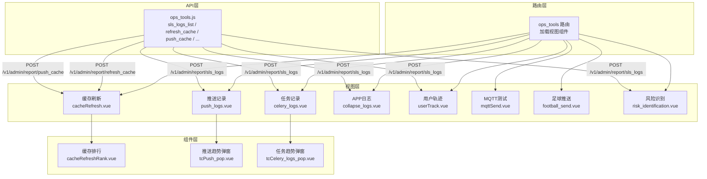
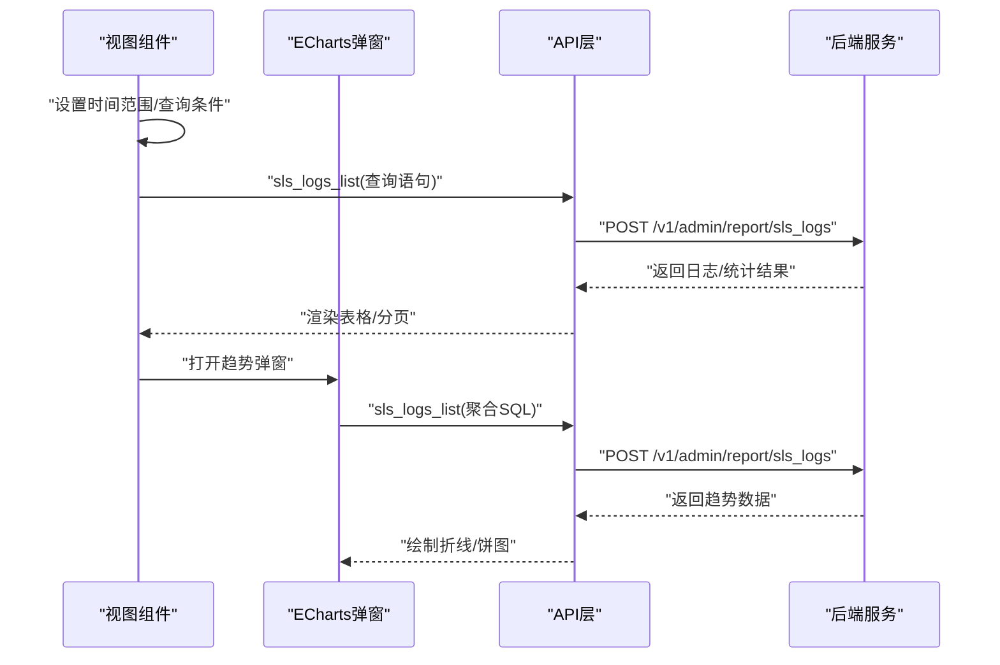
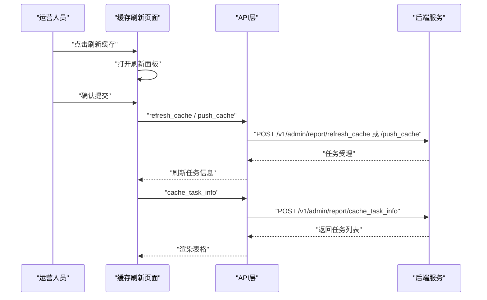
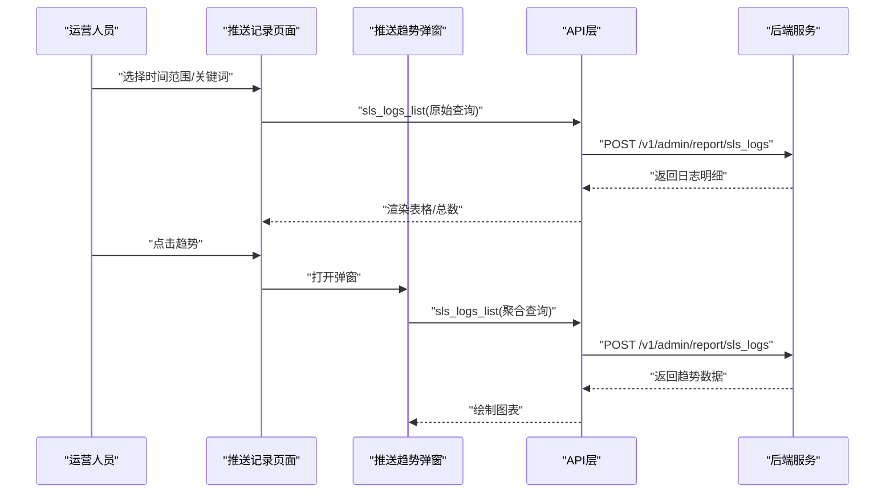
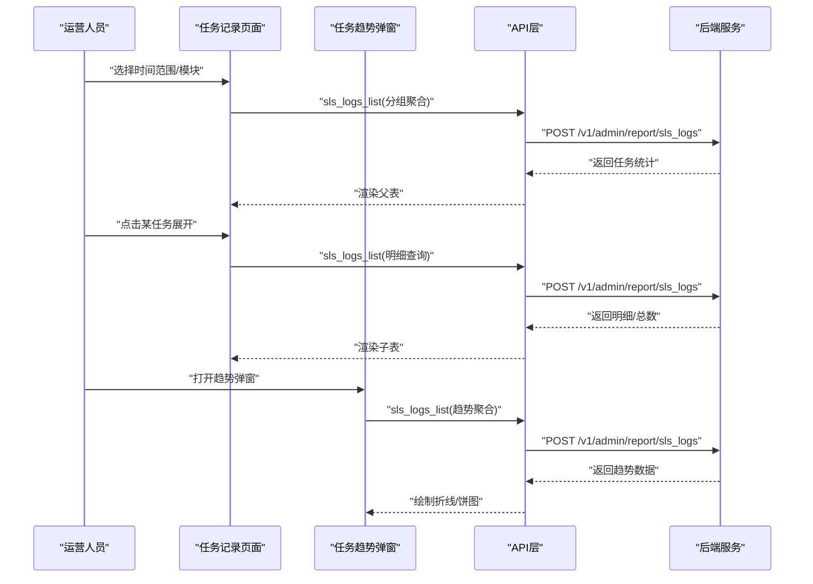
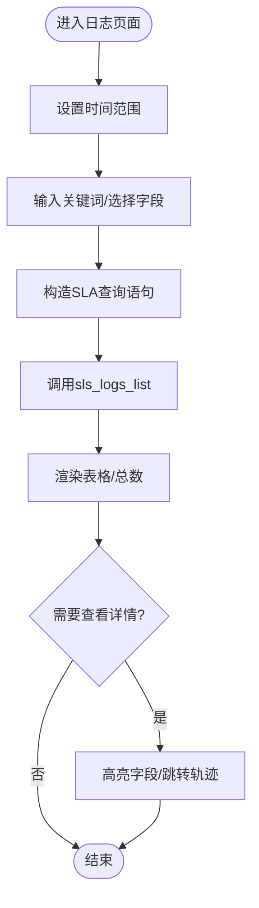
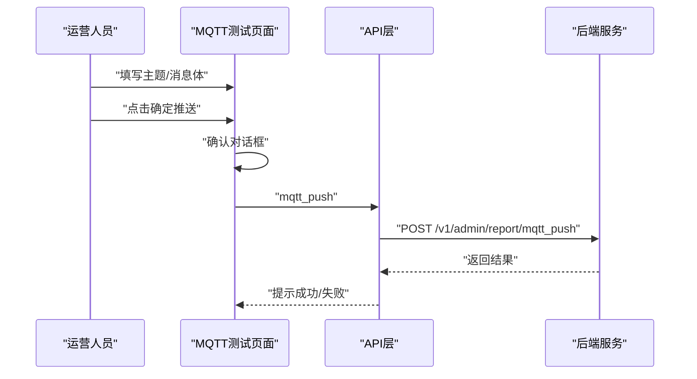
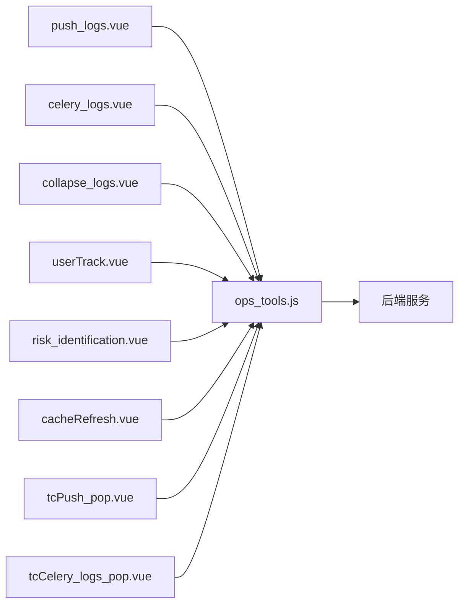

# 运营工具模块

<cite>
**本文引用的文件**
- [src/router/children/ops_tools.js](file://src/router/children/ops_tools.js)
- [src/views/ops_tools/cacheRefresh.vue](file://src/views/ops_tools/cacheRefresh.vue)
- [src/views/ops_tools/push_logs.vue](file://src/views/ops_tools/push_logs.vue)
- [src/views/ops_tools/celery_logs.vue](file://src/views/ops_tools/celery_logs.vue)
- [src/views/ops_tools/collapse_logs.vue](file://src/views/ops_tools/collapse_logs.vue)
- [src/views/ops_tools/userTrack.vue](file://src/views/ops_tools/userTrack.vue)
- [src/views/ops_tools/mqttSend.vue](file://src/views/ops_tools/mqttSend.vue)
- [src/views/ops_tools/football_send.vue](file://src/views/ops_tools/football_send.vue)
- [src/views/ops_tools/risk_identification.vue](file://src/views/ops_tools/risk_identification.vue)
- [src/views/ops_tools/components/cacheRefreshRank.vue](file://src/views/ops_tools/components/cacheRefreshRank.vue)
- [src/views/ops_tools/tcPush_pop.vue](file://src/views/ops_tools/tcPush_pop.vue)
- [src/views/ops_tools/tcCelery_logs_pop.vue](file://src/views/ops_tools/tcCelery_logs_pop.vue)
- [src/api/ops_tools.js](file://src/api/ops_tools.js)
</cite>

## 目录
1. [简介](#简介)
2. [项目结构](#项目结构)
3. [核心组件](#核心组件)
4. [架构总览](#架构总览)
5. [详细组件分析](#详细组件分析)
6. [依赖关系分析](#依赖关系分析)
7. [性能考量](#性能考量)
8. [故障排查指南](#故障排查指南)
9. [结论](#结论)
10. [附录](#附录)

## 简介
本技术文档面向“运营工具模块”，系统性阐述日志监控、缓存管理、推送测试与性能监控等运营支撑能力。内容覆盖：
- 日志收集与分析：系统日志、业务日志、错误日志、用户行为轨迹、风控日志等
- 缓存管理：缓存刷新、预热、监控与排行
- 推送测试：MQTT 测试、足球比分推送、推送趋势分析
- 性能监控：任务执行统计、耗时分布、图表化趋势
- 架构设计：前端组件、API 调用、SLA 查询、弹窗图表组件
- 使用指南：常见问题排查、性能调优、故障处理

## 项目结构
运营工具模块位于前端 views/ops_tools 下，通过路由集中挂载，统一由布局容器承载。各功能页面通过 API 层对接后端服务，使用 SLA 查询接口进行日志检索与统计。

**图表来源**
- [src/router/children/ops_tools.js:1-128](file://src/router/children/ops_tools.js#L1-L128)
- [src/views/ops_tools/cacheRefresh.vue:1-199](file://src/views/ops_tools/cacheRefresh.vue#L1-L199)
- [src/views/ops_tools/push_logs.vue:1-301](file://src/views/ops_tools/push_logs.vue#L1-L301)
- [src/views/ops_tools/celery_logs.vue:1-800](file://src/views/ops_tools/celery_logs.vue#L1-L800)
- [src/views/ops_tools/collapse_logs.vue:1-283](file://src/views/ops_tools/collapse_logs.vue#L1-L283)
- [src/views/ops_tools/userTrack.vue:1-257](file://src/views/ops_tools/userTrack.vue#L1-L257)
- [src/views/ops_tools/mqttSend.vue:1-173](file://src/views/ops_tools/mqttSend.vue#L1-L173)
- [src/views/ops_tools/football_send.vue:1-86](file://src/views/ops_tools/football_send.vue#L1-L86)
- [src/views/ops_tools/risk_identification.vue:1-404](file://src/views/ops_tools/risk_identification.vue#L1-L404)
- [src/views/ops_tools/components/cacheRefreshRank.vue:1-87](file://src/views/ops_tools/components/cacheRefreshRank.vue#L1-L87)
- [src/views/ops_tools/tcPush_pop.vue:1-245](file://src/views/ops_tools/tcPush_pop.vue#L1-L245)
- [src/views/ops_tools/tcCelery_logs_pop.vue:1-411](file://src/views/ops_tools/tcCelery_logs_pop.vue#L1-L411)
- [src/api/ops_tools.js:1-174](file://src/api/ops_tools.js#L1-L174)

**章节来源**
- [src/router/children/ops_tools.js:1-128](file://src/router/children/ops_tools.js#L1-L128)

## 核心组件
- 缓存刷新：支持刷新任务列表、刷新对象类型与状态展示、IP 黑白名单、缓存刷新排行弹窗
- 推送记录：基于 SLA 的推送日志检索、字段高亮、UID 查询、推送趋势弹窗
- 任务记录：Celery 任务统计、按名称/状态/运行时排序、失败任务定位、任务/Worker 趋势弹窗
- APP 日志：崩溃类日志检索、SDK/平台维度筛选、内容高亮
- 用户轨迹：用户行为轨迹检索、地域解析、详情高亮、趋势弹窗
- MQTT 测试：主题与消息体编辑、快捷模板、Markdown 规则说明、发送确认
- 足球推送：批量输入比分并推送至指定主题
- 风险识别：风控日志检索、标签高危标记、封禁 IP/UID 列表、趋势弹窗

**章节来源**
- [src/views/ops_tools/cacheRefresh.vue:1-199](file://src/views/ops_tools/cacheRefresh.vue#L1-L199)
- [src/views/ops_tools/push_logs.vue:1-301](file://src/views/ops_tools/push_logs.vue#L1-L301)
- [src/views/ops_tools/celery_logs.vue:1-800](file://src/views/ops_tools/celery_logs.vue#L1-L800)
- [src/views/ops_tools/collapse_logs.vue:1-283](file://src/views/ops_tools/collapse_logs.vue#L1-L283)
- [src/views/ops_tools/userTrack.vue:1-257](file://src/views/ops_tools/userTrack.vue#L1-L257)
- [src/views/ops_tools/mqttSend.vue:1-173](file://src/views/ops_tools/mqttSend.vue#L1-L173)
- [src/views/ops_tools/football_send.vue:1-86](file://src/views/ops_tools/football_send.vue#L1-L86)
- [src/views/ops_tools/risk_identification.vue:1-404](file://src/views/ops_tools/risk_identification.vue#L1-L404)

## 架构总览
前端采用“视图组件 + 弹窗图表组件 + API 模块”的分层设计：
- 视图组件负责页面交互与数据展示（搜索、分页、排序）
- 弹窗图表组件负责趋势可视化（ECharts）与多维筛选
- API 模块封装后端接口，统一 SLA 查询入口

**图表来源**
- [src/views/ops_tools/push_logs.vue:177-221](file://src/views/ops_tools/push_logs.vue#L177-L221)
- [src/views/ops_tools/tcPush_pop.vue:163-182](file://src/views/ops_tools/tcPush_pop.vue#L163-L182)
- [src/views/ops_tools/celery_logs.vue:693-779](file://src/views/ops_tools/celery_logs.vue#L693-L779)
- [src/views/ops_tools/tcCelery_logs_pop.vue:238-275](file://src/views/ops_tools/tcCelery_logs_pop.vue#L238-L275)
- [src/api/ops_tools.js:3-9](file://src/api/ops_tools.js#L3-L9)

## 详细组件分析

### 缓存管理
- 功能点
  - 刷新任务列表：按类型（单文件/目录/预热/正则/去参数）与状态（完成/刷新中/失败/等待）展示
  - 刷新操作：弹出刷新面板，提交刷新/预热任务
  - IP 管理：黑名单、白名单、封禁网段、查看剩余配额
  - 刷新排行：按刷新对象路径统计 Top N
- 关键流程
  - 列表查询：调用获取任务信息接口，分页展示
  - 刷新/预热：调用刷新/预热接口
  - 排行弹窗：按当日 SQL 聚合，分页展示

**图表来源**
- [src/views/ops_tools/cacheRefresh.vue:115-164](file://src/views/ops_tools/cacheRefresh.vue#L115-L164)
- [src/views/ops_tools/components/cacheRefreshRank.vue:70-83](file://src/views/ops_tools/components/cacheRefreshRank.vue#L70-L83)
- [src/api/ops_tools.js:51-87](file://src/api/ops_tools.js#L51-L87)

**章节来源**
- [src/views/ops_tools/cacheRefresh.vue:1-199](file://src/views/ops_tools/cacheRefresh.vue#L1-L199)
- [src/views/ops_tools/components/cacheRefreshRank.vue:1-87](file://src/views/ops_tools/components/cacheRefreshRank.vue#L1-L87)
- [src/api/ops_tools.js:50-87](file://src/api/ops_tools.js#L50-L87)

### 推送测试与分析
- 功能点
  - 推送记录：按 op/scene/alert/audience/msg_id 等字段检索，支持排序与分页
  - 推送报表：点击 MsgId 查看推送效果详情
  - 推送趋势：按时间粒度聚合，支持按 op/scene 分组
- 关键流程
  - 列表查询：构造 SLA 查询语句，调用 sls_logs_list
  - 趋势弹窗：根据时间范围与分组字段生成聚合 SQL，渲染折线图

**图表来源**
- [src/views/ops_tools/push_logs.vue:177-221](file://src/views/ops_tools/push_logs.vue#L177-L221)
- [src/views/ops_tools/tcPush_pop.vue:163-182](file://src/views/ops_tools/tcPush_pop.vue#L163-L182)
- [src/api/ops_tools.js:3-9](file://src/api/ops_tools.js#L3-L9)

**章节来源**
- [src/views/ops_tools/push_logs.vue:1-301](file://src/views/ops_tools/push_logs.vue#L1-L301)
- [src/views/ops_tools/tcPush_pop.vue:1-245](file://src/views/ops_tools/tcPush_pop.vue#L1-L245)
- [src/api/ops_tools.js:3-9](file://src/api/ops_tools.js#L3-L9)

### 任务记录与性能监控
- 功能点
  - 任务统计：按任务名分组统计数量、成功率、失败数、重试数、平均耗时、最后执行时间
  - 子表详情：按名称展开，支持按状态、运行时、Worker、Args/Kwargs/Result/Traceback 等字段检索
  - 趋势弹窗：按分钟/小时/日聚合，支持多维度筛选（worker 等）
- 关键流程
  - 父表聚合：构造分组聚合 SQL，获取任务维度指标
  - 子表查询：在父表基础上追加筛选条件，分页返回明细
  - 趋势图：根据时间窗口自动选择粒度，渲染折线图与 Worker 饼图

**图表来源**
- [src/views/ops_tools/celery_logs.vue:610-692](file://src/views/ops_tools/celery_logs.vue#L610-L692)
- [src/views/ops_tools/celery_logs.vue:693-779](file://src/views/ops_tools/celery_logs.vue#L693-L779)
- [src/views/ops_tools/tcCelery_logs_pop.vue:238-275](file://src/views/ops_tools/tcCelery_logs_pop.vue#L238-L275)
- [src/api/ops_tools.js:3-9](file://src/api/ops_tools.js#L3-L9)

**章节来源**
- [src/views/ops_tools/celery_logs.vue:1-800](file://src/views/ops_tools/celery_logs.vue#L1-L800)
- [src/views/ops_tools/tcCelery_logs_pop.vue:1-411](file://src/views/ops_tools/tcCelery_logs_pop.vue#L1-L411)
- [src/api/ops_tools.js:3-9](file://src/api/ops_tools.js#L3-L9)

### 日志监控与分析
- APP 日志（崩溃/SDK/广告等）
  - 支持按 scene/uid/platform/version/brand/model/os 等字段检索
  - 内容高亮显示，支持 UID 轨迹跳转
- 用户轨迹
  - 支持按 uid/platform/channel/ver/module/action/ip/device_id 等检索
  - 地域解析展示，详情 JSON 高亮
- 风险识别
  - 风控日志检索，标签高危标记，封禁 IP/UID 列表，趋势弹窗

**图表来源**
- [src/views/ops_tools/collapse_logs.vue:167-205](file://src/views/ops_tools/collapse_logs.vue#L167-L205)
- [src/views/ops_tools/userTrack.vue:151-207](file://src/views/ops_tools/userTrack.vue#L151-L207)
- [src/views/ops_tools/risk_identification.vue:230-282](file://src/views/ops_tools/risk_identification.vue#L230-L282)
- [src/api/ops_tools.js:3-9](file://src/api/ops_tools.js#L3-L9)

**章节来源**
- [src/views/ops_tools/collapse_logs.vue:1-283](file://src/views/ops_tools/collapse_logs.vue#L1-L283)
- [src/views/ops_tools/userTrack.vue:1-257](file://src/views/ops_tools/userTrack.vue#L1-L257)
- [src/views/ops_tools/risk_identification.vue:1-404](file://src/views/ops_tools/risk_identification.vue#L1-L404)
- [src/api/ops_tools.js:3-9](file://src/api/ops_tools.js#L3-L9)

### MQTT 推送测试
- 功能点
  - 主题与消息体编辑，快捷模板填充
  - Markdown 规则说明渲染，发送前二次确认
  - 足球比分推送：批量输入比赛与比分，统一打包推送
- 关键流程
  - 表单校验 → 构造数据 → 调用 MQTT 推送接口 → 成功提示

**图表来源**
- [src/views/ops_tools/mqttSend.vue:139-165](file://src/views/ops_tools/mqttSend.vue#L139-L165)
- [src/views/ops_tools/football_send.vue:61-81](file://src/views/ops_tools/football_send.vue#L61-L81)
- [src/api/ops_tools.js:155-161](file://src/api/ops_tools.js#L155-L161)

**章节来源**
- [src/views/ops_tools/mqttSend.vue:1-173](file://src/views/ops_tools/mqttSend.vue#L1-L173)
- [src/views/ops_tools/football_send.vue:1-86](file://src/views/ops_tools/football_send.vue#L1-L86)
- [src/api/ops_tools.js:155-161](file://src/api/ops_tools.js#L155-L161)

## 依赖关系分析
- 组件耦合
  - 视图组件依赖 API 层统一的 sls_logs_list 接口
  - 弹窗图表组件复用 ECharts 渲染与格式化混入
  - 风险识别页面依赖危险标签接口与封禁列表接口
- 数据流
  - 页面通过时间范围与查询条件拼装 SLA 语句
  - 后端返回明细与聚合结果，前端渲染表格与图表
- 外部依赖
  - ECharts 图表库
  - marked/highlight.js 文档渲染与语法高亮

**图表来源**
- [src/views/ops_tools/push_logs.vue:1-301](file://src/views/ops_tools/push_logs.vue#L1-L301)
- [src/views/ops_tools/celery_logs.vue:1-800](file://src/views/ops_tools/celery_logs.vue#L1-L800)
- [src/views/ops_tools/collapse_logs.vue:1-283](file://src/views/ops_tools/collapse_logs.vue#L1-L283)
- [src/views/ops_tools/userTrack.vue:1-257](file://src/views/ops_tools/userTrack.vue#L1-L257)
- [src/views/ops_tools/risk_identification.vue:1-404](file://src/views/ops_tools/risk_identification.vue#L1-L404)
- [src/views/ops_tools/cacheRefresh.vue:1-199](file://src/views/ops_tools/cacheRefresh.vue#L1-L199)
- [src/views/ops_tools/tcPush_pop.vue:1-245](file://src/views/ops_tools/tcPush_pop.vue#L1-L245)
- [src/views/ops_tools/tcCelery_logs_pop.vue:1-411](file://src/views/ops_tools/tcCelery_logs_pop.vue#L1-L411)
- [src/api/ops_tools.js:1-174](file://src/api/ops_tools.js#L1-L174)

**章节来源**
- [src/api/ops_tools.js:1-174](file://src/api/ops_tools.js#L1-L174)

## 性能考量
- 查询优化
  - 合理使用时间范围与字段过滤，避免全量扫描
  - 聚合查询优先，明细查询分页加载
- 图表渲染
  - 自动选择时间粒度（分钟/小时/日），减少大数据量渲染压力
  - 按需加载弹窗图表，避免重复初始化
- 前端分页
  - 明细与总数分离查询，降低网络与渲染开销
- 缓存刷新
  - 控制刷新对象数量，优先热点资源
  - 使用预热提升命中率，减少线上突发流量

## 故障排查指南
- 推送记录无法加载
  - 检查时间范围是否合理，字段过滤是否正确
  - 确认 SLA 查询语法，逐步缩小关键词
  - 参考：[推送记录查询逻辑:177-221](file://src/views/ops_tools/push_logs.vue#L177-L221)
- 任务记录无数据
  - 确认 logstore 是否为 celery_log，时间范围是否覆盖任务执行期
  - 参考：[任务记录查询逻辑:610-692](file://src/views/ops_tools/celery_logs.vue#L610-L692)
- APP 日志内容过长
  - 使用高亮组件查看关键字段，必要时缩小时间范围
  - 参考：[APP 日志查询逻辑:167-205](file://src/views/ops_tools/collapse_logs.vue#L167-L205)
- 用户轨迹地域显示异常
  - 检查 IP 解析字段是否正确，确认字段映射
  - 参考：[用户轨迹查询逻辑:151-207](file://src/views/ops_tools/userTrack.vue#L151-L207)
- 风险识别标签未高危
  - 确认危险标签接口返回，检查本地缓存
  - 参考：[风险识别标签加载:386-400](file://src/views/ops_tools/risk_identification.vue#L386-L400)
- MQTT 推送失败
  - 检查主题与消息体格式，确认发送接口返回
  - 参考：[MQTT 推送接口:155-161](file://src/api/ops_tools.js#L155-L161)

**章节来源**
- [src/views/ops_tools/push_logs.vue:177-221](file://src/views/ops_tools/push_logs.vue#L177-L221)
- [src/views/ops_tools/celery_logs.vue:610-692](file://src/views/ops_tools/celery_logs.vue#L610-L692)
- [src/views/ops_tools/collapse_logs.vue:167-205](file://src/views/ops_tools/collapse_logs.vue#L167-L205)
- [src/views/ops_tools/userTrack.vue:151-207](file://src/views/ops_tools/userTrack.vue#L151-L207)
- [src/views/ops_tools/risk_identification.vue:386-400](file://src/views/ops_tools/risk_identification.vue#L386-L400)
- [src/api/ops_tools.js:155-161](file://src/api/ops_tools.js#L155-L161)

## 结论
运营工具模块通过统一的 SLA 查询接口与丰富的弹窗图表组件，实现了日志检索、缓存管理、推送测试与性能监控的闭环。建议在实际使用中：
- 明确时间范围与字段过滤，提高查询效率
- 合理使用趋势弹窗与高亮组件，快速定位问题
- 对缓存刷新与预热策略进行灰度验证，避免大范围影响
- 定期回顾任务耗时与失败率，持续优化后台任务链路

## 附录
- 常用接口清单
  - SLA 查询：/v1/admin/report/sls_logs
  - 缓存刷新：/v1/admin/report/refresh_cache
  - 缓存预热：/v1/admin/report/push_cache
  - 缓存任务信息：/v1/admin/report/cache_task_info
  - MQTT 推送：/v1/admin/report/mqtt_push
- 配置与权限
  - 路由权限角色：tools_push_logs、tools_celery_logs、tools_collapse_logs、tools_track_logs、tools_refresh_cache、tools_saf_logs、tools_nami_table 等
  - 参考：[路由与权限定义:107-127](file://src/router/children/ops_tools.js#L107-L127)

**章节来源**
- [src/api/ops_tools.js:1-174](file://src/api/ops_tools.js#L1-L174)
- [src/router/children/ops_tools.js:107-127](file://src/router/children/ops_tools.js#L107-L127)