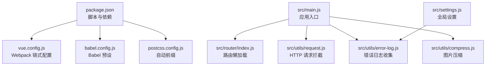
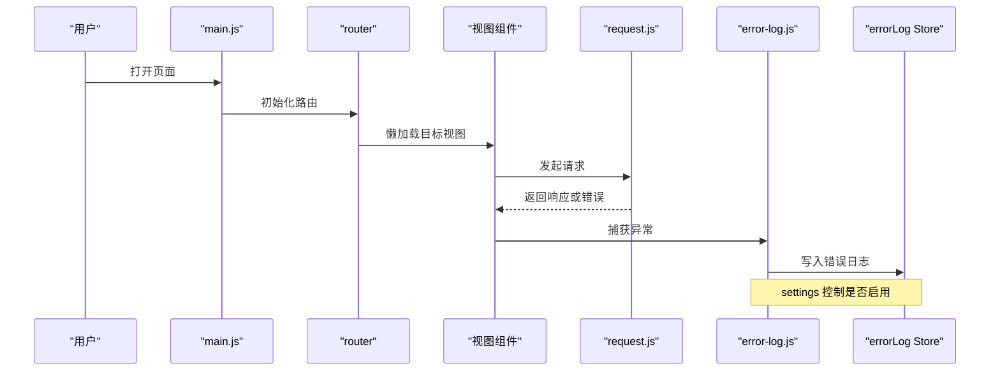
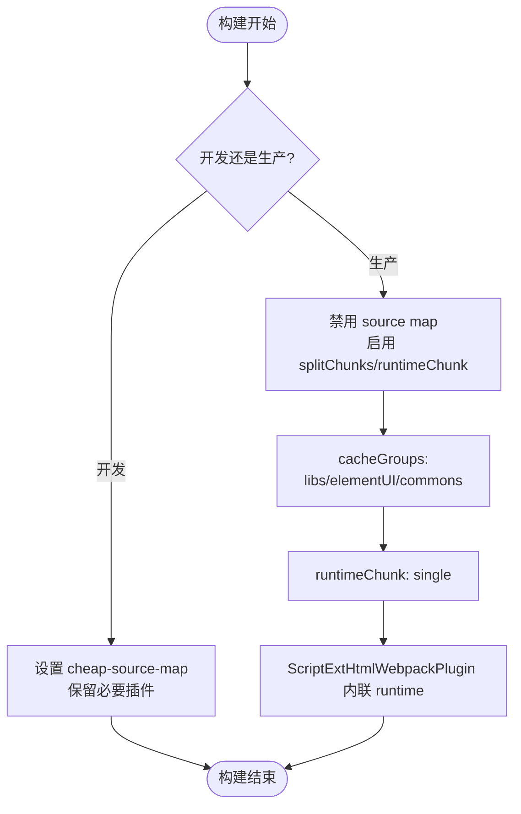
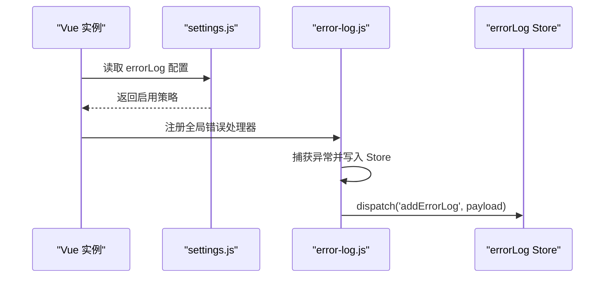
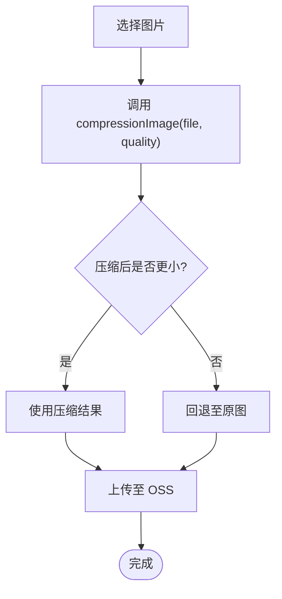
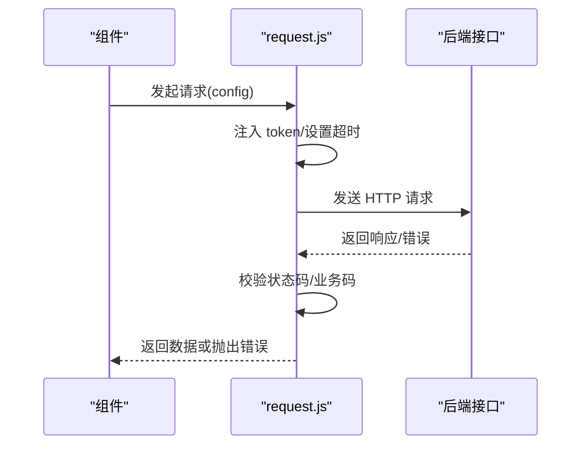
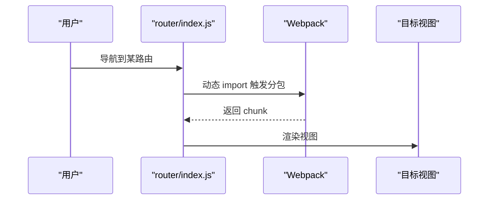
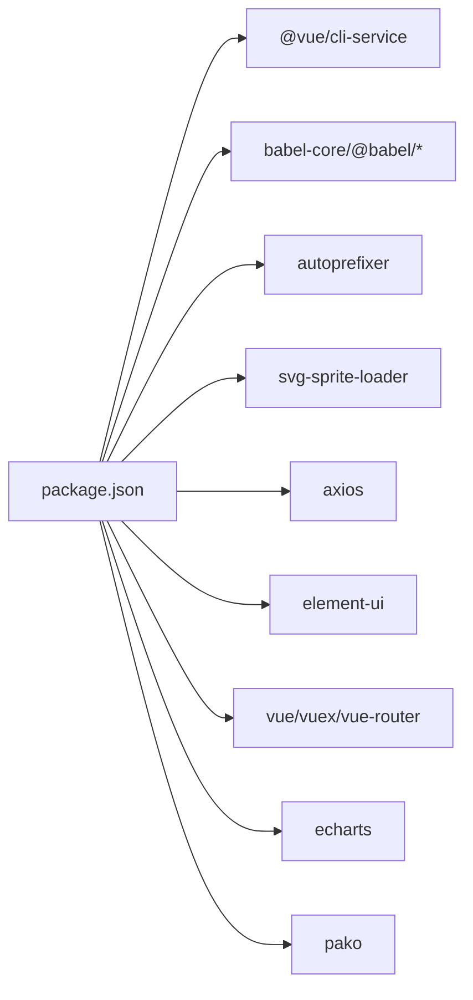

# 性能监控与优化

<cite>
**本文引用的文件**
- [package.json](file://package.json)
- [vue.config.js](file://vue.config.js)
- [babel.config.js](file://babel.config.js)
- [postcss.config.js](file://postcss.config.js)
- [src/main.js](file://src/main.js)
- [src/settings.js](file://src/settings.js)
- [src/utils/error-log.js](file://src/utils/error-log.js)
- [src/store/modules/errorLog.js](file://src/store/modules/errorLog.js)
- [src/utils/compress.js](file://src/utils/compress.js)
- [src/utils/request.js](file://src/utils/request.js)
- [src/router/index.js](file://src/router/index.js)
</cite>

## 目录
1. [简介](#简介)
2. [项目结构](#项目结构)
3. [核心组件](#核心组件)
4. [架构总览](#架构总览)
5. [详细组件分析](#详细组件分析)
6. [依赖分析](#依赖分析)
7. [性能考量](#性能考量)
8. [故障排查指南](#故障排查指南)
9. [结论](#结论)
10. [附录](#附录)

## 简介
本文件面向 Leisu Admin 项目的前端性能监控与优化，围绕以下目标展开：
- 前端性能监控体系：页面加载时间、资源加载性能、用户交互响应时间等关键指标的监控方法
- Webpack 构建优化策略：代码分割、懒加载、Tree Shaking、压缩优化等
- 静态资源优化：图片压缩、CSS 优化、JavaScript 压缩、缓存策略
- 运行时性能监控：错误日志收集、性能数据上报、用户体验监控
- 性能分析工具使用：Chrome DevTools、Webpack Bundle Analyzer 等
- 性能基准测试与回归测试方法
- 最佳实践与常见问题解决方案

## 项目结构
本项目采用 Vue CLI 3.x 生成的工程化结构，关键配置集中在根目录的构建与脚本配置文件中，业务代码位于 src 目录，静态资源位于 public 与 src/assets 中。

**图表来源**
- [package.json:1-139](file://package.json#L1-L139)
- [vue.config.js:1-155](file://vue.config.js#L1-L155)
- [babel.config.js:1-6](file://babel.config.js#L1-L6)
- [postcss.config.js:1-6](file://postcss.config.js#L1-L6)
- [src/main.js:1-526](file://src/main.js#L1-L526)
- [src/router/index.js:1-177](file://src/router/index.js#L1-L177)
- [src/utils/request.js:1-130](file://src/utils/request.js#L1-L130)
- [src/utils/error-log.js:1-36](file://src/utils/error-log.js#L1-L36)
- [src/utils/compress.js:1-73](file://src/utils/compress.js#L1-L73)
- [src/settings.js:1-36](file://src/settings.js#L1-L36)

**章节来源**
- [package.json:1-139](file://package.json#L1-L139)
- [vue.config.js:18-154](file://vue.config.js#L18-L154)
- [src/main.js:1-526](file://src/main.js#L1-L526)

## 核心组件
- 构建与打包配置：通过 vue.config.js 的链式配置实现代码分割、运行时块提取、SVG Sprite Loader、开发/生产差异化优化等
- 错误日志系统：在 settings 中按环境开关，main.js 注入错误处理器，Store 持有日志并可上报
- 图片压缩工具：封装 js-image-compressor，在上传前进行客户端压缩
- HTTP 请求拦截：统一设置 baseURL、超时、错误提示与 Token 注入
- 路由懒加载：路由按需加载，结合 Webpack 代码分割减少首屏体积
- CSS 自动前缀：PostCSS autoprefixer 统一处理兼容性

**章节来源**
- [vue.config.js:77-152](file://vue.config.js#L77-L152)
- [src/settings.js:29-35](file://src/settings.js#L29-L35)
- [src/utils/error-log.js:10-35](file://src/utils/error-log.js#L10-L35)
- [src/store/modules/errorLog.js:1-29](file://src/store/modules/errorLog.js#L1-L29)
- [src/utils/compress.js:8-71](file://src/utils/compress.js#L8-L71)
- [src/utils/request.js:22-127](file://src/utils/request.js#L22-L127)
- [src/router/index.js:31-177](file://src/router/index.js#L31-L177)
- [postcss.config.js:1-6](file://postcss.config.js#L1-L6)

## 架构总览
下图展示从入口到构建、运行时监控的关键流程：

**图表来源**
- [src/main.js:24-25](file://src/main.js#L24-L25)
- [src/router/index.js:31-177](file://src/router/index.js#L31-L177)
- [src/utils/request.js:22-127](file://src/utils/request.js#L22-L127)
- [src/utils/error-log.js:21-35](file://src/utils/error-log.js#L21-L35)
- [src/store/modules/errorLog.js:14-21](file://src/store/modules/errorLog.js#L14-L21)
- [src/settings.js:29-35](file://src/settings.js#L29-L35)

## 详细组件分析

### Webpack 构建优化
- 代码分割与缓存组
  - 将第三方库、Element UI、通用组件分别拆分为独立 chunk，提升缓存命中率
  - 使用 runtimeChunk 单独提取运行时，配合 ScriptExtHtmlWebpackPlugin 内联运行时脚本，减少额外请求
- SVG Sprite Loader
  - 将图标资源以 sprite 方式加载，减少请求数量
- 开发/生产差异化
  - 生产环境关闭 source map，开启 splitChunks 与 runtimeChunk；开发环境使用 cheap-source-map 提升调试体验
- Babel 与 PostCSS
  - Babel 预设用于语法转换；PostCSS 自动添加浏览器前缀，减少手写兼容代码

**图表来源**
- [vue.config.js:115-152](file://vue.config.js#L115-L152)
- [vue.config.js:127-150](file://vue.config.js#L127-L150)
- [babel.config.js:1-6](file://babel.config.js#L1-L6)
- [postcss.config.js:1-6](file://postcss.config.js#L1-L6)

**章节来源**
- [vue.config.js:77-152](file://vue.config.js#L77-L152)
- [babel.config.js:1-6](file://babel.config.js#L1-L6)
- [postcss.config.js:1-6](file://postcss.config.js#L1-L6)

### 错误日志与运行时监控
- 设置项控制
  - settings 中通过 errorLog 字段控制是否在特定环境下启用错误日志组件
- 入口注入
  - main.js 中引入 error-log，注册 Vue errorHandler，并在捕获异常后写入 Store
- 日志存储
  - errorLog Store 提供 add/clear 动作，便于后续上报或本地持久化

**图表来源**
- [src/settings.js:29-35](file://src/settings.js#L29-L35)
- [src/utils/error-log.js:10-35](file://src/utils/error-log.js#L10-L35)
- [src/store/modules/errorLog.js:14-21](file://src/store/modules/errorLog.js#L14-L21)

**章节来源**
- [src/settings.js:29-35](file://src/settings.js#L29-L35)
- [src/utils/error-log.js:10-35](file://src/utils/error-log.js#L10-L35)
- [src/store/modules/errorLog.js:1-29](file://src/store/modules/errorLog.js#L1-L29)

### 图片压缩与静态资源优化
- 压缩策略
  - 使用 js-image-compressor 对上传图片进行质量压缩与格式优化，避免过大图片进入 OSS
  - 压缩前回调可用于统计与可视化，成功回调决定是否回退至原图
- CDN 与路径处理
  - 提供 addPrefix/removePrefix 方法统一处理图片路径与 CDN 前缀，保证跨域与缓存一致性

**图表来源**
- [src/utils/compress.js:8-71](file://src/utils/compress.js#L8-L71)

**章节来源**
- [src/utils/compress.js:1-73](file://src/utils/compress.js#L1-L73)

### HTTP 请求与超时控制
- 环境区分
  - 根据当前域名动态设置 baseURL 与 MQTT 地址，确保不同环境正确路由
- 请求拦截
  - 自动注入 token，统一设置超时时间
- 响应拦截
  - 统一处理状态码与错误信息，对非 200 或业务错误进行提示与异常抛出

**图表来源**
- [src/utils/request.js:22-127](file://src/utils/request.js#L22-L127)

**章节来源**
- [src/utils/request.js:1-130](file://src/utils/request.js#L1-L130)

### 路由懒加载与代码分割
- 路由定义
  - 使用动态 import 实现视图组件的懒加载，结合 Webpack 分包策略减少首屏体积
- 运行时行为
  - 首次访问对应路由时才加载对应模块，提升首屏渲染速度

**图表来源**
- [src/router/index.js:31-177](file://src/router/index.js#L31-L177)

**章节来源**
- [src/router/index.js:31-177](file://src/router/index.js#L31-L177)

## 依赖分析
- 构建工具链
  - @vue/cli-service、babel、autoprefixer、svg-sprite-loader 等
- 运行时依赖
  - axios、element-ui、vue、vuex、vue-router、echarts、pako 等
- 开发依赖
  - eslint、jest、svgo、typescript 等

**图表来源**
- [package.json:97-129](file://package.json#L97-L129)
- [package.json:37-96](file://package.json#L37-L96)

**章节来源**
- [package.json:1-139](file://package.json#L1-139)

## 性能考量
- 页面加载时间
  - 通过路由懒加载与代码分割降低首屏 JS 体积；生产环境 runtimeChunk 单独提取并内联，减少二次请求
  - 关闭生产环境 source map，避免额外体积与解析成本
- 资源加载性能
  - SVG 图标使用 sprite 减少请求数；CSS 使用 autoprefixer 统一前缀，避免重复工作
  - 图片上传前进行客户端压缩，降低带宽与 OSS 成本
- 用户交互响应时间
  - 合理设置请求超时与错误提示，避免长时间无响应
  - 对高频交互组件（如波纹效果）注意 DOM 操作频率，避免过度重排重绘
- 缓存策略
  - 通过 runtimeChunk 与 splitChunks 提升缓存命中；CDN 前缀统一便于长缓存
- Tree Shaking 与压缩
  - 生产构建默认启用压缩；建议配合按需引入与最小化依赖进一步瘦身

[本节为通用性能指导，无需具体文件分析]

## 故障排查指南
- 错误日志未上报
  - 检查 settings 中 errorLog 配置是否包含当前环境
  - 确认 main.js 已引入 error-log，且 errorHandler 注册成功
  - 查看 Store 中 logs 是否增长
- 图片上传体积过大
  - 确认 compressionImage 调用与 quality 参数设置
  - 检查 success 回调逻辑，确保压缩后文件被使用
- 请求超时或频繁报错
  - 检查 request.js 中 baseURL 与超时设置
  - 关注响应拦截中的状态码分支与提示文案
- 构建产物过大
  - 检查 vue.config.js 的 splitChunks 配置与 cacheGroups
  - 使用分析工具查看 bundle 结构，定位大体积模块

**章节来源**
- [src/settings.js:29-35](file://src/settings.js#L29-L35)
- [src/utils/error-log.js:10-35](file://src/utils/error-log.js#L10-L35)
- [src/store/modules/errorLog.js:14-21](file://src/store/modules/errorLog.js#L14-L21)
- [src/utils/compress.js:8-71](file://src/utils/compress.js#L8-L71)
- [src/utils/request.js:22-127](file://src/utils/request.js#L22-L127)
- [vue.config.js:127-150](file://vue.config.js#L127-L150)

## 结论
本项目已具备较为完善的前端性能监控与优化基础：通过 Webpack 代码分割与运行时优化、路由懒加载、SVG Sprite、自动前缀与客户端图片压缩等手段，有效降低了首屏体积与加载时间；通过错误日志与请求拦截机制，提升了运行时可观测性。建议在现有基础上持续引入性能分析工具与基准测试流程，形成闭环的性能治理体系。

[本节为总结性内容，无需具体文件分析]

## 附录
- 性能分析工具使用建议
  - Chrome DevTools：Network 面板观察资源加载与瀑布图；Performance 面板记录交互耗时；Memory 面板检测内存泄漏
  - Webpack Bundle Analyzer：在生产构建后生成报告，定位大体积模块与重复依赖
- 基准测试与回归测试
  - 使用 Lighthouse 或 WebPageTest 建立页面加载指标基线（First Contentful Paint、Largest Contentful Paint、Cumulative Layout Shift 等）
  - 在 CI 中集成性能回归检测，设定阈值告警
- 最佳实践清单
  - 优先使用按需引入与 Tree Shaking
  - 合理划分 chunk，避免过细或过粗
  - 对静态资源启用长期缓存与版本化
  - 对第三方库进行独立分包，提升复用率
  - 对图片进行压缩与格式优化，必要时使用 WebP
  - 对动画与高频交互组件进行节流/防抖

[本节为通用指导，无需具体文件分析]