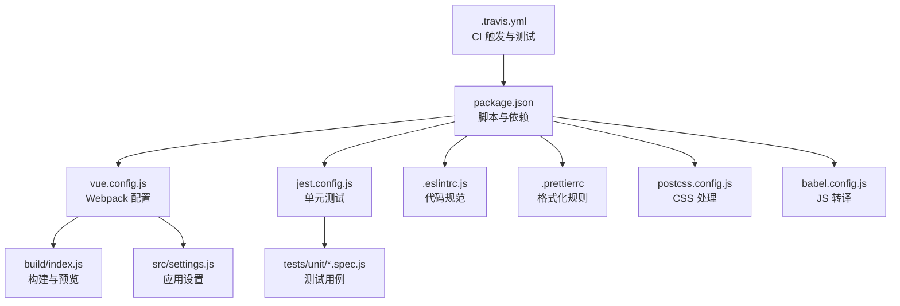
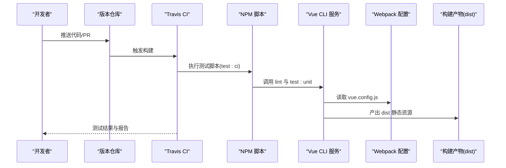
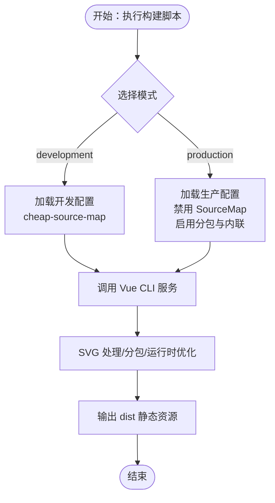
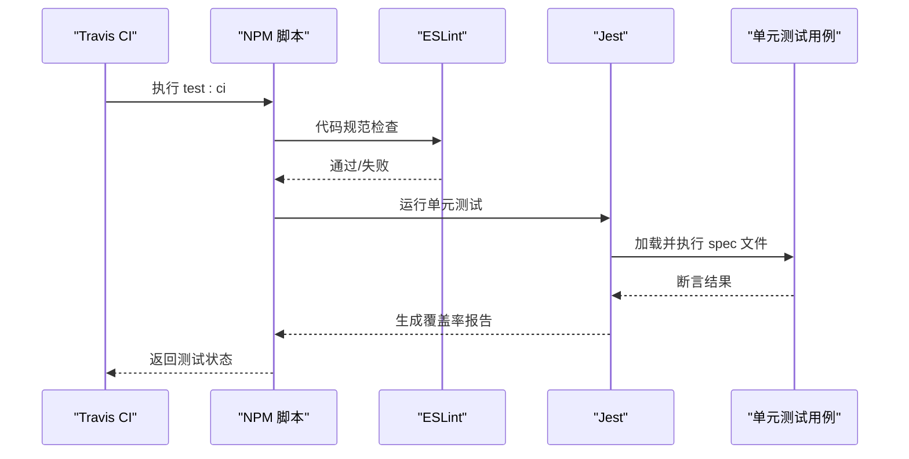
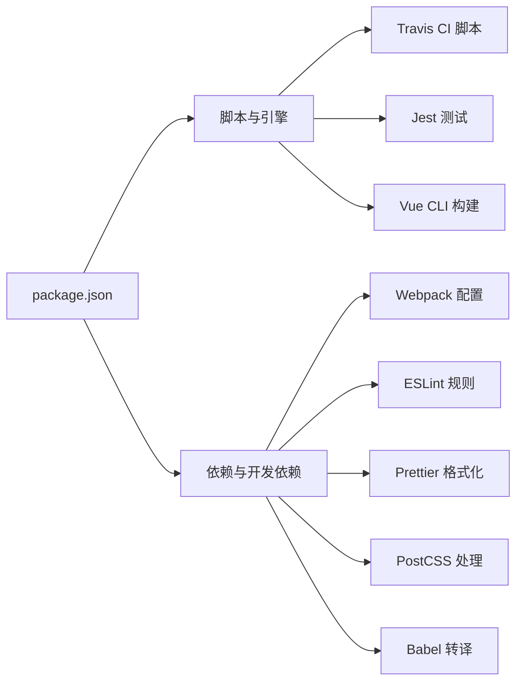

# 持续集成与部署

<cite>
**本文引用的文件**
- [.travis.yml](file://.travis.yml)
- [package.json](file://package.json)
- [vue.config.js](file://vue.config.js)
- [jest.config.js](file://jest.config.js)
- [build/index.js](file://build/index.js)
- [.eslintrc.js](file://.eslintrc.js)
- [.prettierrc](file://.prettierrc)
- [postcss.config.js](file://postcss.config.js)
- [babel.config.js](file://babel.config.js)
- [src/settings.js](file://src/settings.js)
- [tests/unit/components/Hamburger.spec.js](file://tests/unit/components/Hamburger.spec.js)
</cite>

## 目录
1. [简介](#简介)
2. [项目结构](#项目结构)
3. [核心组件](#核心组件)
4. [架构总览](#架构总览)
5. [详细组件分析](#详细组件分析)
6. [依赖分析](#依赖分析)
7. [性能考虑](#性能考虑)
8. [故障排查指南](#故障排查指南)
9. [结论](#结论)
10. [附录](#附录)

## 简介
本文件面向运维与开发团队，系统化梳理 Leisu Admin 项目的 CI/CD 流水线设计与实践，重点覆盖以下方面：
- Travis CI 配置与使用：构建触发条件、环境变量、测试执行流程
- 自动化构建过程：代码编译、资源打包、静态文件优化
- 多环境部署策略：开发、测试、生产差异配置与部署流程
- 版本与发布管理：语义化版本、发布标签、变更日志建议
- 部署脚本与配置：Webpack/Vite 相关配置、构建优化、CDN 资源处理
- 部署监控与回滚：可靠性与可恢复性保障
- 运维操作手册与故障排查

## 项目结构
本项目基于 Vue CLI 3.x，采用模块化组织方式，关键目录与文件职责如下：
- 构建与打包：vue.config.js（Webpack 链式配置）、build/index.js（本地预览与构建入口）
- 测试：jest.config.js（单元测试配置）、tests/unit（单元测试用例）
- 规范与格式化：.eslintrc.js（ESLint 规则）、.prettierrc（Prettier 格式化）、postcss.config.js（CSS 后处理器）
- CI：.travis.yml（Travis CI 配置）
- 依赖与脚本：package.json（脚本、依赖、引擎要求）

图表来源
- [.travis.yml:1-6](file://.travis.yml#L1-L6)
- [package.json:7-20](file://package.json#L7-L20)
- [vue.config.js:18-154](file://vue.config.js#L18-L154)
- [build/index.js:1-36](file://build/index.js#L1-L36)
- [jest.config.js:1-25](file://jest.config.js#L1-L25)
- [.eslintrc.js:1-268](file://.eslintrc.js#L1-L268)
- [.prettierrc:1-13](file://.prettierrc#L1-L13)
- [postcss.config.js:1-6](file://postcss.config.js#L1-L6)
- [babel.config.js:1-6](file://babel.config.js#L1-L6)
- [src/settings.js:1-36](file://src/settings.js#L1-L36)

章节来源
- [.travis.yml:1-6](file://.travis.yml#L1-L6)
- [package.json:1-139](file://package.json#L1-L139)
- [vue.config.js:1-155](file://vue.config.js#L1-L155)
- [build/index.js:1-36](file://build/index.js#L1-L36)
- [jest.config.js:1-25](file://jest.config.js#L1-L25)
- [.eslintrc.js:1-268](file://.eslintrc.js#L1-L268)
- [.prettierrc:1-13](file://.prettierrc#L1-L13)
- [postcss.config.js:1-6](file://postcss.config.js#L1-L6)
- [babel.config.js:1-6](file://babel.config.js#L1-L6)
- [src/settings.js:1-36](file://src/settings.js#L1-L36)

## 核心组件
- CI/CD 引擎与触发
  - 使用 Travis CI，语言环境为 Node.js 10，执行测试脚本，关闭邮件通知
  - 参考路径：[.travis.yml:1-6](file://.travis.yml#L1-L6)
- 构建与打包
  - 通过 Vue CLI 服务执行构建，支持多模式（localhost、development、production）
  - 参考路径：[package.json:7-20](file://package.json#L7-L20)、[vue.config.js:18-154](file://vue.config.js#L18-L154)
- 单元测试
  - Jest 配置与用例，覆盖率输出到 tests/unit/coverage
  - 参考路径：[jest.config.js:1-25](file://jest.config.js#L1-L25)、[tests/unit/components/Hamburger.spec.js:1-19](file://tests/unit/components/Hamburger.spec.js#L1-L19)
- 代码质量与格式化
  - ESLint 规则、Prettier 格式化、PostCSS 自动前缀
  - 参考路径：[.eslintrc.js:1-268](file://.eslintrc.js#L1-L268)、[.prettierrc:1-13](file://.prettierrc#L1-L13)、[postcss.config.js:1-6](file://postcss.config.js#L1-L6)
- 本地预览与构建入口
  - build/index.js 支持 --preview 参数进行本地预览
  - 参考路径：[build/index.js:1-36](file://build/index.js#L1-L36)

章节来源
- [.travis.yml:1-6](file://.travis.yml#L1-L6)
- [package.json:7-20](file://package.json#L7-L20)
- [vue.config.js:18-154](file://vue.config.js#L18-L154)
- [jest.config.js:1-25](file://jest.config.js#L1-L25)
- [build/index.js:1-36](file://build/index.js#L1-L36)
- [.eslintrc.js:1-268](file://.eslintrc.js#L1-L268)
- [.prettierrc:1-13](file://.prettierrc#L1-L13)
- [postcss.config.js:1-6](file://postcss.config.js#L1-L6)
- [tests/unit/components/Hamburger.spec.js:1-19](file://tests/unit/components/Hamburger.spec.js#L1-L19)

## 架构总览
下图展示从代码提交到构建产物产出的关键路径，以及 CI 执行与构建配置之间的关系。

图表来源
- [.travis.yml:1-6](file://.travis.yml#L1-L6)
- [package.json:7-20](file://package.json#L7-L20)
- [jest.config.js:1-25](file://jest.config.js#L1-L25)
- [vue.config.js:18-154](file://vue.config.js#L18-L154)

## 详细组件分析

### Travis CI 配置与使用
- 基础信息
  - 语言：node_js
  - Node 版本：10
  - 测试命令：npm run test（对应 package.json 中 test:ci 脚本）
  - 通知：关闭邮件通知
- 建议增强
  - 添加构建缓存以提升速度
  - 在 PR/MR 场景中区分触发条件（如仅对特定分支或标签）
  - 将构建产物上传至制品库或 CDN，便于预览与回滚
- 关键参考
  - [.travis.yml:1-6](file://.travis.yml#L1-L6)
  - [package.json:7-20](file://package.json#L7-L20)

章节来源
- [.travis.yml:1-6](file://.travis.yml#L1-L6)
- [package.json:7-20](file://package.json#L7-L20)

### 自动化构建流程（编译、打包、优化）
- 构建入口与模式
  - 开发：npm run dev（--mode development）
  - 生产：npm run prod（--mode production）
  - 本地预览：npm run preview（通过 build/index.js）
  - 构建脚本：npm run build:dev / build:prod / build:localhost
  - 参考路径：[package.json:7-20](file://package.json#L7-L20)、[build/index.js:1-36](file://build/index.js#L1-L36)
- Webpack 配置要点
  - publicPath 来自环境变量 VUE_APP_BASE_PATH
  - 输出目录 outputDir 为 dist，静态资源目录 assetsDir 为 static
  - 生产环境禁用 Source Map，启用分包与运行时内联
  - SVG 图标使用 svg-sprite-loader，保留 Vue 组件空白符
  - 参考路径：[vue.config.js:18-154](file://vue.config.js#L18-L154)
- 构建优化
  - 分包策略：libs、elementUI、commons 缓存组
  - 运行时独立 chunk，减少重复打包
  - 参考路径：[vue.config.js:127-151](file://vue.config.js#L127-L151)
- 本地预览
  - 支持 --preview 参数，内置静态服务器预览 dist
  - 参考路径：[build/index.js:7-32](file://build/index.js#L7-L32)

图表来源
- [vue.config.js:18-154](file://vue.config.js#L18-L154)
- [build/index.js:1-36](file://build/index.js#L1-L36)

章节来源
- [package.json:7-20](file://package.json#L7-L20)
- [vue.config.js:18-154](file://vue.config.js#L18-L154)
- [build/index.js:1-36](file://build/index.js#L1-L36)

### 测试执行流程（Jest + Vue Test Utils）
- 测试配置
  - 转换器：vue-jest、babel-jest、jest-transform-stub
  - 模块映射：@/ 映射到 src
  - 覆盖率：收集 src/utils 与 src/components，输出 tests/unit/coverage
  - 参考路径：[jest.config.js:1-25](file://jest.config.js#L1-L25)
- 示例用例
  - Hamburger 组件交互与属性断言
  - 参考路径：[tests/unit/components/Hamburger.spec.js:1-19](file://tests/unit/components/Hamburger.spec.js#L1-L19)
- CI 集成
  - Travis 使用 npm run test（即 test:ci），会先执行 lint 再执行 test:unit
  - 参考路径：[package.json:16-17](file://package.json#L16-L17)、[.travis.yml:3-3](file://.travis.yml#L3-L3)

图表来源
- [.travis.yml:3-3](file://.travis.yml#L3-L3)
- [package.json:16-17](file://package.json#L16-L17)
- [jest.config.js:1-25](file://jest.config.js#L1-L25)
- [tests/unit/components/Hamburger.spec.js:1-19](file://tests/unit/components/Hamburger.spec.js#L1-L19)

章节来源
- [.travis.yml:3-3](file://.travis.yml#L3-L3)
- [package.json:16-17](file://package.json#L16-L17)
- [jest.config.js:1-25](file://jest.config.js#L1-L25)
- [tests/unit/components/Hamburger.spec.js:1-19](file://tests/unit/components/Hamburger.spec.js#L1-L19)

### 多环境部署策略
- 环境变量与模式
  - 通过 --mode 指定开发/生产/localhost 等模式
  - publicPath 由 VUE_APP_BASE_PATH 控制，适配子路径部署与 CDN
  - 参考路径：[package.json:7-20](file://package.json#L7-L20)、[vue.config.js:26-26](file://vue.config.js#L26-L26)
- 应用设置
  - 标题、是否显示设置面板、固定头部、侧边栏 Logo、错误日志开关等
  - 参考路径：[src/settings.js:1-36](file://src/settings.js#L1-L36)
- 部署建议
  - 开发：本地 serve，publicPath 设为 /
  - 测试：子路径部署，publicPath 指向测试域名或路径
  - 生产：CDN 加速，开启分包与运行时内联，关闭 SourceMap
  - 参考路径：[vue.config.js:18-154](file://vue.config.js#L18-L154)

章节来源
- [package.json:7-20](file://package.json#L7-L20)
- [vue.config.js:18-154](file://vue.config.js#L18-L154)
- [src/settings.js:1-36](file://src/settings.js#L1-L36)

### 版本管理与发布流程
- 语义化版本
  - 使用语义化版本号（主.次.补丁），遵循变更影响面决定版本位
- 发布标签
  - 通过 Git 标签标记发布版本，命名建议 vMAJOR.MINOR.PATCH
- 变更日志
  - 建议在每次发布前生成变更日志，记录新增、修复、破坏性变更
- CI/CD 集成建议
  - 在成功构建后自动打标签并推送
  - 将构建产物上传至制品库或 CDN，便于快速回滚

[本节为通用实践说明，不直接分析具体文件，故无“章节来源”]

### 部署脚本与配置详解
- Webpack/Vite 相关
  - 本项目使用 Vue CLI 服务，默认基于 webpack-chain；未发现 Vite 配置文件
  - 参考路径：[vue.config.js:18-154](file://vue.config.js#L18-L154)
- 构建优化
  - 分包策略、运行时独立 chunk、SVG 图标处理、保留空白符
  - 参考路径：[vue.config.js:127-151](file://vue.config.js#L127-L151)
- CDN 资源处理
  - publicPath 由环境变量控制，适合指向 CDN 或子路径
  - 参考路径：[vue.config.js:26-26](file://vue.config.js#L26-L26)
- 本地预览
  - 通过 build/index.js 提供 --preview 预览能力
  - 参考路径：[build/index.js:7-32](file://build/index.js#L7-L32)

章节来源
- [vue.config.js:18-154](file://vue.config.js#L18-L154)
- [build/index.js:7-32](file://build/index.js#L7-L32)

### 部署监控与回滚机制
- 监控建议
  - 静态资源健康检查（404/5xx）与首屏加载时间
  - 错误日志上报（根据 src/settings.js 的 errorLog 设置）
- 回滚策略
  - 以 Git 标签为锚点，回退到上一个稳定版本
  - 若使用 CDN，需同步回滚或切换回源
- CI/CD 建议
  - 成功构建后记录构建 ID 与产物哈希，便于审计与回滚

[本节为通用实践说明，不直接分析具体文件，故无“章节来源”]

## 依赖分析
- 脚本与工具链
  - Node >= 8.9，NPM >= 3.0.0
  - Vue CLI 服务、Jest、ESLint、Prettier、PostCSS、Babel
- 关键依赖
  - Vue 2.6.10、Element UI、Axios、ECharts、MQTT 等
- 依赖关系示意

图表来源
- [package.json:1-139](file://package.json#L1-L139)
- [.eslintrc.js:1-268](file://.eslintrc.js#L1-L268)
- [.prettierrc:1-13](file://.prettierrc#L1-L13)
- [postcss.config.js:1-6](file://postcss.config.js#L1-L6)
- [babel.config.js:1-6](file://babel.config.js#L1-L6)

章节来源
- [package.json:1-139](file://package.json#L1-L139)
- [.eslintrc.js:1-268](file://.eslintrc.js#L1-L268)
- [.prettierrc:1-13](file://.prettierrc#L1-L13)
- [postcss.config.js:1-6](file://postcss.config.js#L1-L6)
- [babel.config.js:1-6](file://babel.config.js#L1-L6)

## 性能考虑
- 构建性能
  - 启用分包与运行时独立 chunk，降低重复打包与首屏体积
  - 参考路径：[vue.config.js:127-151](file://vue.config.js#L127-L151)
- 资源体积
  - 生产环境禁用 Source Map，避免额外体积
  - 参考路径：[vue.config.js:30-30](file://vue.config.js#L30-L30)
- 开发体验
  - 开发环境使用 cheap-source-map，提升调试效率
  - 参考路径：[vue.config.js:111-113](file://vue.config.js#L111-L113)
- CSS/JS 优化
  - PostCSS 自动前缀，减少手写兼容性代码
  - 参考路径：[postcss.config.js:1-6](file://postcss.config.js#L1-L6)

[本节为通用性能建议，不直接分析具体文件，故无“章节来源”]

## 故障排查指南
- CI 测试失败
  - 检查 .travis.yml 中的测试命令与 package.json 的 test:ci 脚本
  - 参考路径：[.travis.yml:3-3](file://.travis.yml#L3-L3)、[package.json:16-17](file://package.json#L16-L17)
- 构建产物异常
  - 确认 publicPath 环境变量与部署路径一致
  - 参考路径：[vue.config.js:26-26](file://vue.config.js#L26-L26)
- 预览无法访问
  - 使用 --preview 参数启动本地预览，确认端口与 publicPath
  - 参考路径：[build/index.js:7-32](file://build/index.js#L7-L32)
- 测试用例报错
  - 检查 Jest 配置与模块映射，确保 @/ 正确解析
  - 参考路径：[jest.config.js:9-11](file://jest.config.js#L9-L11)
- 代码规范问题
  - 运行 ESLint 并修正规则冲突
  - 参考路径：[.eslintrc.js:1-268](file://.eslintrc.js#L1-L268)
- 格式化不一致
  - 使用 Prettier 统一格式，结合编辑器保存钩子
  - 参考路径：[.prettierrc:1-13](file://.prettierrc#L1-L13)

章节来源
- [.travis.yml:3-3](file://.travis.yml#L3-L3)
- [package.json:16-17](file://package.json#L16-L17)
- [vue.config.js:26-26](file://vue.config.js#L26-L26)
- [build/index.js:7-32](file://build/index.js#L7-L32)
- [jest.config.js:9-11](file://jest.config.js#L9-L11)
- [.eslintrc.js:1-268](file://.eslintrc.js#L1-L268)
- [.prettierrc:1-13](file://.prettierrc#L1-L13)

## 结论
本项目已具备完善的 CI/CD 基础：Travis CI 执行测试、Jest 单测、ESLint/Prettier 规范、Vue CLI 构建与 Webpack 优化。建议在现有基础上补充构建缓存、制品库上传、Git 标签发布、CDN 回滚策略与监控告警，以进一步提升交付效率与稳定性。

[本节为总结性内容，不直接分析具体文件，故无“章节来源”]

## 附录
- 常用命令速查
  - 开发：npm run dev
  - 生产：npm run prod
  - 本地预览：npm run preview
  - 构建：npm run build:dev / build:prod / build:localhost
  - 规范检查：npm run lint
  - 单测：npm run test:unit
  - CI 测试：npm run test:ci
- 环境变量建议
  - VUE_APP_BASE_PATH：用于 publicPath 与 CDN/子路径
  - NODE_ENV：控制开发/生产行为
- 配置文件清单
  - .travis.yml、package.json、vue.config.js、jest.config.js、build/index.js、.eslintrc.js、.prettierrc、postcss.config.js、babel.config.js、src/settings.js

[本节为附录性内容，不直接分析具体文件，故无“章节来源”]