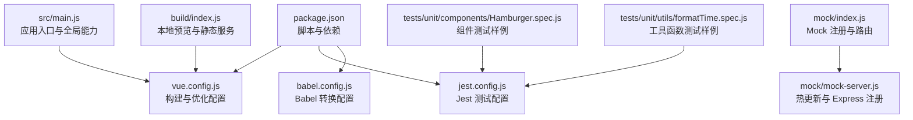
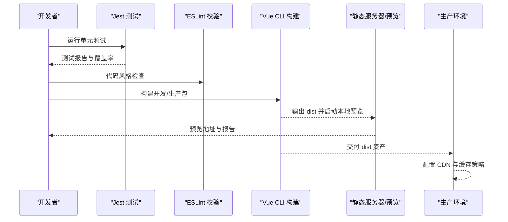
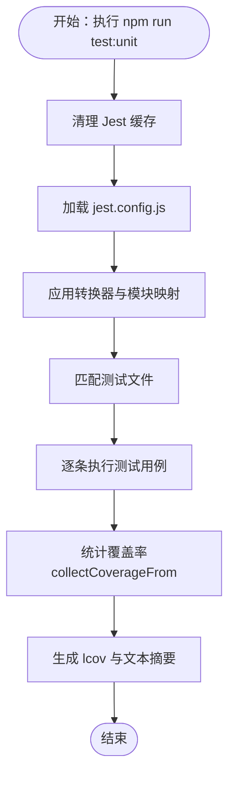
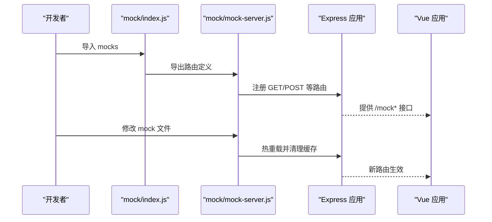
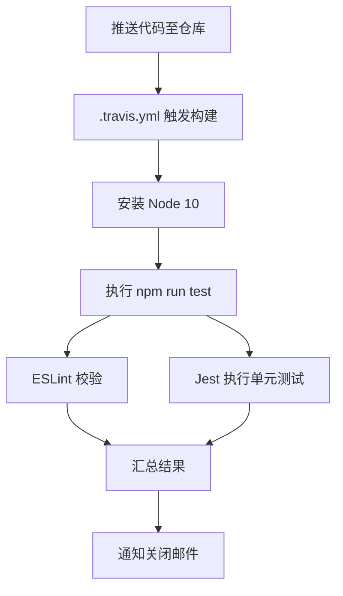
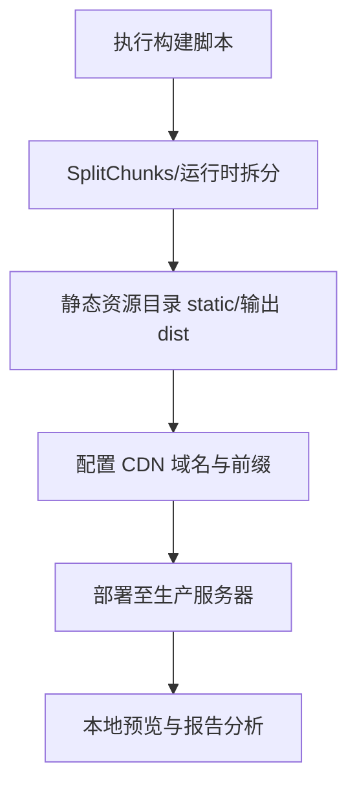
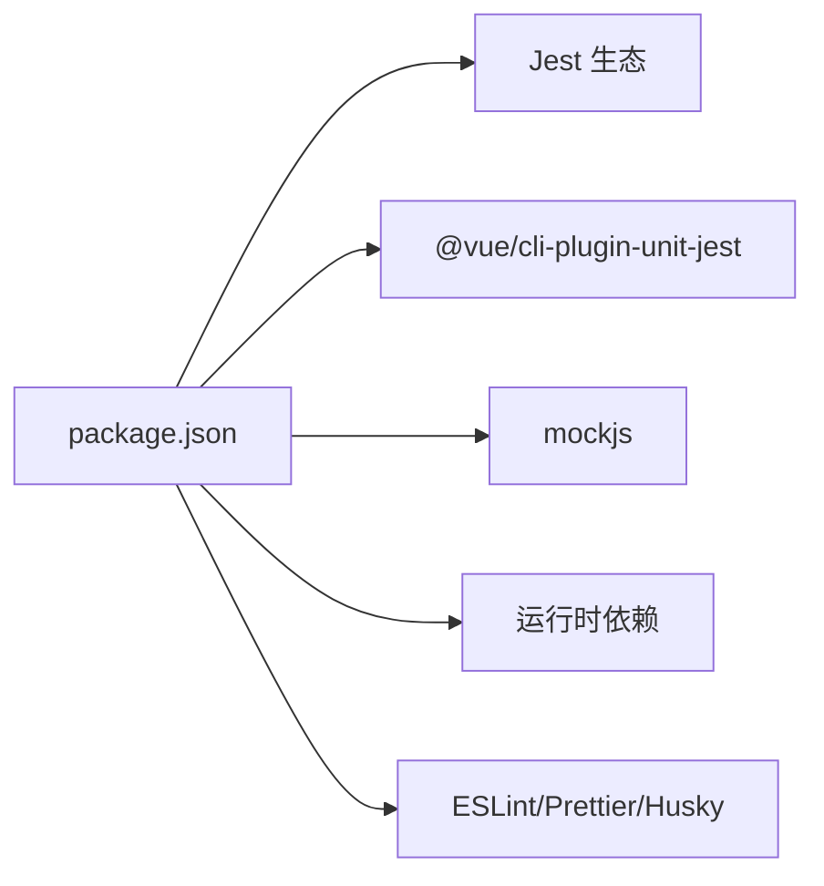

# 测试与部署

<cite>
**本文引用的文件**
- [jest.config.js](file://jest.config.js)
- [.travis.yml](file://.travis.yml)
- [package.json](file://package.json)
- [vue.config.js](file://vue.config.js)
- [babel.config.js](file://babel.config.js)
- [tests/unit/components/Hamburger.spec.js](file://tests/unit/components/Hamburger.spec.js)
- [tests/unit/utils/formatTime.spec.js](file://tests/unit/utils/formatTime.spec.js)
- [mock/index.js](file://mock/index.js)
- [mock/mock-server.js](file://mock/mock-server.js)
- [src/main.js](file://src/main.js)
- [build/index.js](file://build/index.js)
- [src/settings.js](file://src/settings.js)
- [tests/unit/.eslintrc.js](file://tests/unit/.eslintrc.js)
</cite>

## 目录
1. [引言](#引言)
2. [项目结构](#项目结构)
3. [核心组件](#核心组件)
4. [架构总览](#架构总览)
5. [详细组件分析](#详细组件分析)
6. [依赖分析](#依赖分析)
7. [性能考虑](#性能考虑)
8. [故障排查指南](#故障排查指南)
9. [结论](#结论)
10. [附录](#附录)

## 引言
本文件面向运维与开发团队，系统化梳理 Leisu Admin 项目的测试与部署体系，覆盖单元测试、集成测试与端到端测试的策略与落地；深入解析 Jest 测试框架配置与覆盖率策略；阐述基于 Travis CI 的持续集成流程与自动化测试；给出生产环境构建优化、静态资源处理与 CDN 配置建议；说明多环境配置管理与差异控制；并提供性能监控与优化、故障排查与应急回滚的运维保障方案。

## 项目结构
本项目采用 Vue CLI 3.x 生成的前端工程，遵循“按功能域/模块”组织源码与测试，测试目录 tests/unit 下包含组件与工具函数的单元测试；mock 目录提供本地开发与测试阶段的接口模拟；构建与预览通过 vue.config.js 与 build/index.js 协作完成；Jest 作为单元测试运行器，配合 Babel 转换与 Vue 组件转换器进行测试执行。

图表来源
- [package.json:1-139](file://package.json#L1-L139)
- [vue.config.js:1-155](file://vue.config.js#L1-L155)
- [jest.config.js:1-25](file://jest.config.js#L1-L25)
- [babel.config.js:1-6](file://babel.config.js#L1-L6)
- [mock/index.js:1-71](file://mock/index.js#L1-L71)
- [mock/mock-server.js:1-69](file://mock/mock-server.js#L1-L69)
- [src/main.js:1-526](file://src/main.js#L1-L526)
- [build/index.js:1-36](file://build/index.js#L1-L36)

章节来源
- [package.json:1-139](file://package.json#L1-L139)
- [vue.config.js:1-155](file://vue.config.js#L1-L155)
- [jest.config.js:1-25](file://jest.config.js#L1-L25)
- [babel.config.js:1-6](file://babel.config.js#L1-L6)
- [mock/index.js:1-71](file://mock/index.js#L1-L71)
- [mock/mock-server.js:1-69](file://mock/mock-server.js#L1-L69)
- [src/main.js:1-526](file://src/main.js#L1-L526)
- [build/index.js:1-36](file://build/index.js#L1-L36)

## 核心组件
- 测试框架与配置
  - Jest：用于单元测试与快照序列化，支持 Vue 单文件组件与静态资源 stub。
  - Babel：配合 babel-jest 转换 JS/JSX。
  - 测试脚本：通过 npm scripts 调用 vue-cli-service test:unit，并提供 CI 聚合脚本。
- Mock 与本地服务
  - mock/index.js：集中注册 Mock 路由，支持响应函数或对象。
  - mock/mock-server.js：Express 注册路由、热重载与缓存清理。
- 构建与预览
  - vue.config.js：输出目录、静态资源目录、externals、SVG Sprite、SplitChunks、Runtime Chunk、Source Map 等。
  - build/index.js：本地预览与静态服务，支持 --preview 与 --report 参数。
- 应用入口与全局能力
  - src/main.js：全局过滤器、指令、CDN 工具函数、域名与窗口跳转、生产环境日志抑制等。

章节来源
- [jest.config.js:1-25](file://jest.config.js#L1-L25)
- [babel.config.js:1-6](file://babel.config.js#L1-L6)
- [package.json:16-17](file://package.json#L16-L17)
- [mock/index.js:1-71](file://mock/index.js#L1-L71)
- [mock/mock-server.js:1-69](file://mock/mock-server.js#L1-L69)
- [vue.config.js:18-155](file://vue.config.js#L18-L155)
- [build/index.js:1-36](file://build/index.js#L1-L36)
- [src/main.js:376-441](file://src/main.js#L376-L441)

## 架构总览
下图展示从开发到生产的测试与部署关键路径：开发者在本地运行单元测试；Travis CI 执行 lint 与 Jest；构建产物经 vue.config.js 优化后由 build/index.js 提供本地预览；生产环境通过构建脚本产出 dist 并结合 CDN 与静态资源策略上线。

图表来源
- [package.json:16-17](file://package.json#L16-L17)
- [jest.config.js:1-25](file://jest.config.js#L1-L25)
- [.travis.yml:1-6](file://.travis.yml#L1-L6)
- [vue.config.js:18-155](file://vue.config.js#L18-L155)
- [build/index.js:1-36](file://build/index.js#L1-L36)

## 详细组件分析

### 单元测试策略与实现
- 测试范围与覆盖率
  - 测试匹配规则：tests/unit 下以 .spec.(js|jsx|ts|tsx) 或 __tests__/... 为后缀的文件。
  - 覆盖率收集：src/utils 与 src/components 下的 JS/Vue 文件，默认排除认证与请求相关模块。
  - 报告格式：lcov 与文本摘要。
- 测试环境与转换
  - 模块映射：@/ 映射到 src。
  - 转换器：vue-jest 处理 .vue；babel-jest 处理 JS/JSX；静态资源使用 jest-transform-stub。
  - 快照序列化：jest-serializer-vue。
- 示例测试
  - 组件测试：Hamburger 组件的点击事件与 props 激活态断言。
  - 工具函数测试：formatTime 对时间戳、相对时间、格式化模板的断言。
- ESLint 集成
  - tests/unit/.eslintrc.js 启用 jest 环境，确保测试文件语法校验一致。

图表来源
- [jest.config.js:1-25](file://jest.config.js#L1-L25)
- [tests/unit/components/Hamburger.spec.js:1-19](file://tests/unit/components/Hamburger.spec.js#L1-L19)
- [tests/unit/utils/formatTime.spec.js:1-30](file://tests/unit/utils/formatTime.spec.js#L1-L30)
- [tests/unit/.eslintrc.js:1-5](file://tests/unit/.eslintrc.js#L1-L5)

章节来源
- [jest.config.js:1-25](file://jest.config.js#L1-L25)
- [tests/unit/components/Hamburger.spec.js:1-19](file://tests/unit/components/Hamburger.spec.js#L1-L19)
- [tests/unit/utils/formatTime.spec.js:1-30](file://tests/unit/utils/formatTime.spec.js#L1-L30)
- [tests/unit/.eslintrc.js:1-5](file://tests/unit/.eslintrc.js#L1-L5)

### Mock 与本地服务（集成测试基础）
- Mock 注册
  - mock/index.js 将 user、role、article、remote-search 等模块合并为 mocks，并通过 XHR 包装与正则路由注册。
  - 支持 response 函数与对象两种形式，便于灵活构造响应。
- Mock 服务器
  - mock/mock-server.js 使用 Express 注册路由，监听 mock 目录变更，自动热重载并清理缓存。
  - 通过 chokidar 监听文件变化，动态拼接 app._router.stack，保证开发期快速迭代。
- 开发期代理与热加载
  - vue.config.js 中 devServer 可配置代理与 after 钩子，mock-server 可作为 after 的注册入口，实现本地联调。

图表来源
- [mock/index.js:1-71](file://mock/index.js#L1-L71)
- [mock/mock-server.js:1-69](file://mock/mock-server.js#L1-L69)
- [vue.config.js:37-59](file://vue.config.js#L37-L59)

章节来源
- [mock/index.js:1-71](file://mock/index.js#L1-L71)
- [mock/mock-server.js:1-69](file://mock/mock-server.js#L1-L69)
- [vue.config.js:37-59](file://vue.config.js#L37-L59)

### 持续集成（CI）与自动化测试
- Travis CI 配置
  - 语言与 Node 版本：node_js: 10。
  - 执行命令：npm run test，即运行 Jest 与 ESLint。
  - 通知：关闭邮件通知。
- 本地与 CI 的一致性
  - package.json 提供 test:ci 脚本，先执行 lint 再执行 test:unit，确保 CI 与本地一致。

图表来源
- [.travis.yml:1-6](file://.travis.yml#L1-L6)
- [package.json:16-17](file://package.json#L16-L17)

章节来源
- [.travis.yml:1-6](file://.travis.yml#L1-L6)
- [package.json:16-17](file://package.json#L16-L17)

### 生产环境部署策略
- 构建优化
  - SplitChunks：分离第三方库、Element UI、通用组件，提升缓存命中与并行加载效率。
  - Runtime Chunk：独立提取运行时，减少主包体积。
  - Source Map：生产关闭，避免泄露源码。
  - externals：对外部库（如百度地图）进行外链处理，减小打包体积。
- 静态资源与 CDN
  - publicPath：通过环境变量注入，支持子路径部署。
  - CDN 工具：src/main.js 提供 addPrefix/removePrefix，统一替换图片等资源前缀，便于接入 CDN。
- 本地预览与报告
  - build/index.js 支持 --preview 与 --report，便于上线前验证与性能分析。

图表来源
- [vue.config.js:18-155](file://vue.config.js#L18-L155)
- [src/main.js:419-441](file://src/main.js#L419-L441)
- [build/index.js:1-36](file://build/index.js#L1-L36)

章节来源
- [vue.config.js:18-155](file://vue.config.js#L18-L155)
- [src/main.js:419-441](file://src/main.js#L419-L441)
- [build/index.js:1-36](file://build/index.js#L1-L36)

### 环境配置管理（开发/测试/生产）
- 多模式构建
  - package.json 定义了 local、dev、prod、build:dev、build:prod、build:localhost 等模式，分别对应不同环境变量与配置。
- 运行时行为
  - src/main.js 依据 NODE_ENV 切换域名配置与窗口跳转目标，生产环境默认抑制日志输出。
- 设置项
  - src/settings.js 控制标题、标签页、固定头部、侧边栏 Logo 与错误日志组件启用策略。

章节来源
- [package.json:7-14](file://package.json#L7-L14)
- [src/main.js:376-417](file://src/main.js#L376-L417)
- [src/settings.js:1-36](file://src/settings.js#L1-L36)

## 依赖分析
- 测试与构建依赖
  - Jest 生态：jest、vue-jest、babel-jest、jest-transform-stub、jest-serializer-vue。
  - Vue CLI 插件：@vue/cli-plugin-unit-jest、@vue/test-utils。
  - Mock：mockjs。
- 运行时依赖
  - Vue 生态、Element UI、图表库、富文本编辑器、MQTT、OSS 等。
- 开发与质量保障
  - ESLint、Prettier、husky、lint-staged 等工具链。

图表来源
- [package.json:1-139](file://package.json#L1-L139)

章节来源
- [package.json:1-139](file://package.json#L1-L139)

## 性能考虑
- 构建期优化
  - SplitChunks 分离公共与第三方代码，降低重复与缓存失效。
  - Runtime Chunk 单独提取，提升长尾加载性能。
  - 关闭生产 Source Map，减少体积与风险。
- 运行期优化
  - CDN 前缀统一替换，结合缓存头策略提升静态资源加载速度。
  - 生产环境日志抑制，降低控制台开销。
- 质量与稳定性
  - 单测覆盖率聚焦业务逻辑与组件交互，降低回归风险。
  - CI 中 ESLint 与 Jest 并行，缩短反馈周期。

章节来源
- [vue.config.js:115-152](file://vue.config.js#L115-L152)
- [src/main.js:504-514](file://src/main.js#L504-L514)
- [jest.config.js:16-22](file://jest.config.js#L16-L22)

## 故障排查指南
- 单元测试失败
  - 检查测试文件命名与路径是否符合匹配规则；确认转换器与模块映射正确；核对覆盖率收集范围。
- Mock 不生效或热重载异常
  - 确认 mock-server 是否被正确注册；检查 chokidar 监听与缓存清理逻辑；验证路由正则与响应函数。
- 构建体积过大或缓存命中差
  - 检查 SplitChunks 配置与缓存组划分；确认 Runtime Chunk 是否独立；评估 externals 外链策略。
- 预览与生产不一致
  - 对比 publicPath、CDN 前缀与域名配置；核对生产环境日志抑制与过滤器行为。
- CI 失败
  - 查看 Travis 日志中 ESLint 与 Jest 的具体报错；确保 Node 版本与依赖安装一致。

章节来源
- [jest.config.js:13-24](file://jest.config.js#L13-L24)
- [mock/mock-server.js:45-67](file://mock/mock-server.js#L45-L67)
- [vue.config.js:127-151](file://vue.config.js#L127-L151)
- [src/main.js:376-441](file://src/main.js#L376-L441)
- [.travis.yml:1-6](file://.travis.yml#L1-L6)

## 结论
本项目已建立完善的测试与部署基线：Jest 单测、Mock 集成、Travis CI 自动化、Vue CLI 构建优化与 CDN 资源策略。建议在现有基础上进一步完善端到端测试与性能基准测试，细化多环境配置与灰度发布流程，持续提升交付质量与稳定性。

## 附录
- 常用命令
  - 本地开发：npm run dev
  - 单元测试：npm run test:unit
  - CI 聚合：npm run test:ci
  - 构建（开发/生产/本地）：npm run build:dev / build:prod / build:localhost
  - 预览：npm run preview
- 关键配置定位
  - Jest：jest.config.js
  - 构建：vue.config.js
  - Mock：mock/index.js、mock/mock-server.js
  - 入口与全局能力：src/main.js
  - 预览与静态服务：build/index.js
  - 环境与设置：package.json、src/settings.js