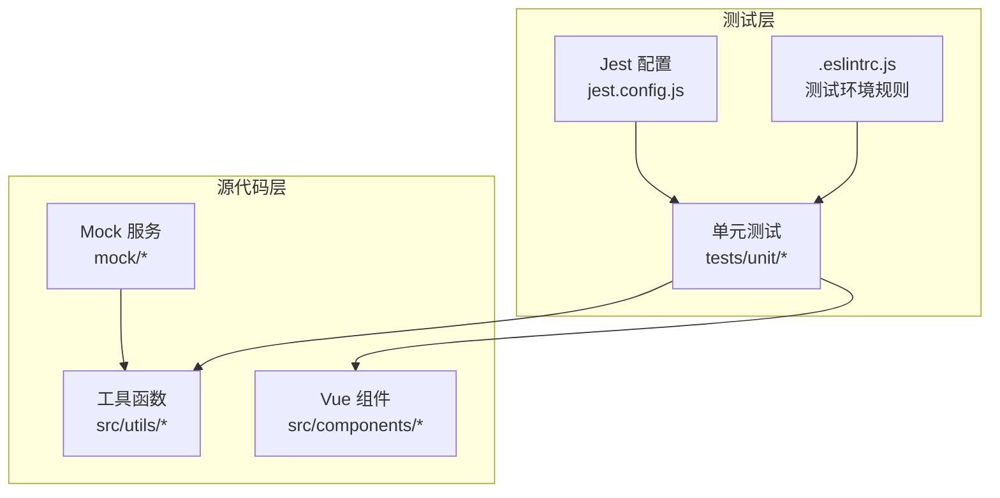
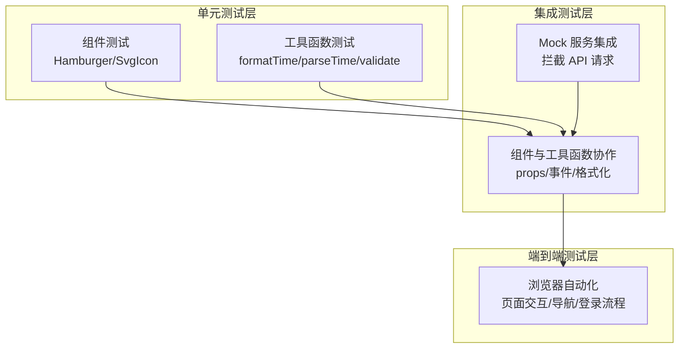
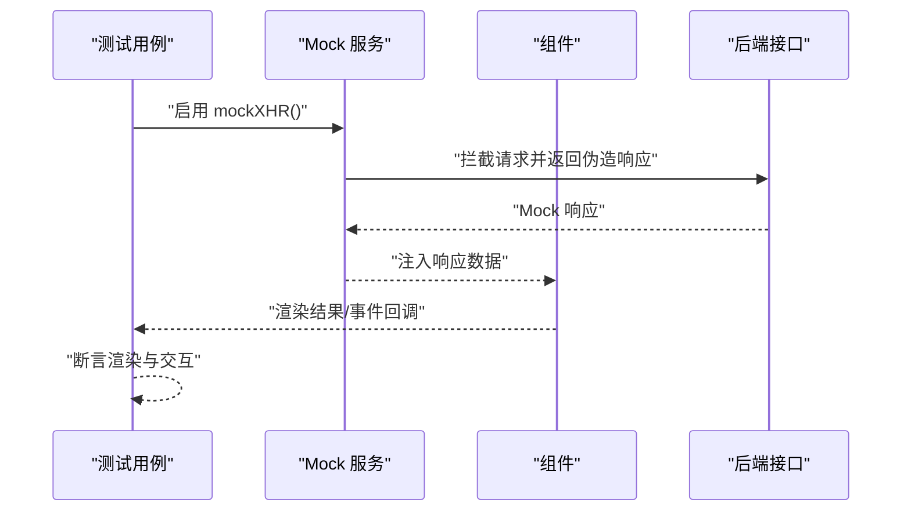
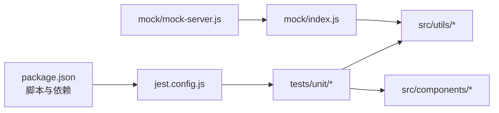

# 测试策略

<cite>
**本文引用的文件**
- [jest.config.js](file://jest.config.js)
- [package.json](file://package.json)
- [tests/unit/.eslintrc.js](file://tests/unit/.eslintrc.js)
- [tests/unit/components/Hamburger.spec.js](file://tests/unit/components/Hamburger.spec.js)
- [tests/unit/components/SvgIcon.spec.js](file://tests/unit/components/SvgIcon.spec.js)
- [tests/unit/utils/formatTime.spec.js](file://tests/unit/utils/formatTime.spec.js)
- [tests/unit/utils/parseTime.spec.js](file://tests/unit/utils/parseTime.spec.js)
- [tests/unit/utils/validate.spec.js](file://tests/unit/utils/validate.spec.js)
- [src/utils/index.js](file://src/utils/index.js)
- [src/utils/validate.js](file://src/utils/validate.js)
- [mock/index.js](file://mock/index.js)
- [mock/mock-server.js](file://mock/mock-server.js)
</cite>

## 目录
1. [引言](#引言)
2. [项目结构](#项目结构)
3. [核心组件](#核心组件)
4. [架构总览](#架构总览)
5. [详细组件分析](#详细组件分析)
6. [依赖关系分析](#依赖关系分析)
7. [性能考量](#性能考量)
8. [故障排查指南](#故障排查指南)
9. [结论](#结论)
10. [附录](#附录)

## 引言
本测试策略文档面向 Leisu Admin 项目，系统化阐述测试架构与测试金字塔（单元测试、集成测试、端到端测试）分层策略，详解 Jest 测试框架配置与使用要点（测试环境、模块映射、快照序列化、覆盖率收集、资源转换器），并总结 Vue 组件测试最佳实践（渲染、事件、props）、工具函数测试方法（数据处理、校验、格式化）、测试数据管理与异步处理、错误边界测试等高级技术。同时提供测试用例编写规范与命名约定，帮助团队建立可维护、可读性强的测试体系。

## 项目结构
- 单元测试位于 tests/unit 下，按功能域划分：components 与 utils。
- Jest 配置集中于根目录 jest.config.js，通过 moduleNameMapper 将 @/ 映射到 src，transform 定义对 .vue、JS、静态资源的处理，快照序列化器用于 Vue 组件。
- 脚本命令在 package.json 中定义，支持本地运行测试与 CI 场景下的测试与代码检查串联。
- 工具函数与校验逻辑集中在 src/utils 下，配套有对应的单元测试用例。
- Mock 机制由 mock/index.js 与 mock/mock-server.js 提供，支持前端拦截与热更新。

图表来源
- [jest.config.js:1-24](file://jest.config.js#L1-L24)
- [tests/unit/.eslintrc.js:1-6](file://tests/unit/.eslintrc.js#L1-L6)
- [src/utils/index.js:1-339](file://src/utils/index.js#L1-L339)
- [mock/index.js:1-71](file://mock/index.js#L1-L71)

章节来源
- [jest.config.js:1-24](file://jest.config.js#L1-L24)
- [package.json:16-17](file://package.json#L16-L17)
- [tests/unit/.eslintrc.js:1-6](file://tests/unit/.eslintrc.js#L1-L6)

## 核心组件
- Jest 配置与脚本
  - 模块映射：将 @/ 映射到 src，便于在测试中以相对路径导入。
  - 转换器：vue-jest 处理 .vue 文件；babel-jest 处理 JS；静态资源使用 jest-transform-stub。
  - 快照序列化：jest-serializer-vue 保证 Vue 组件快照稳定。
  - 测试匹配：自动发现 tests/unit/**/*.spec.(js|jsx|ts|tsx) 与 __tests__/*.(js|jsx|ts|tsx)。
  - 覆盖率：收集 src/utils/** 与 src/components/** 的覆盖率，排除认证与请求等外部依赖。
  - 测试 URL：统一设置为 http://localhost/。
  - 脚本：test:unit 清理缓存后执行测试；test:ci 串联 Lint 与测试。
- 工具函数与校验
  - formatTime/parseTime：时间格式化与解析，覆盖多种输入类型与格式模板。
  - validate：用户名、URL、大小写、字母、邮箱、类型判断等校验函数。
- Mock 服务
  - 前端拦截：基于 MockJS 重写 XHR 行为，拦截路由并返回伪造响应。
  - 后端热更新：监听 mock 目录变更，动态注册/卸载路由，实现热替换。

章节来源
- [jest.config.js:1-24](file://jest.config.js#L1-L24)
- [package.json:16-17](file://package.json#L16-L17)
- [src/utils/index.js:53-80](file://src/utils/index.js#L53-L80)
- [src/utils/index.js:11-46](file://src/utils/index.js#L11-L46)
- [src/utils/validate.js:17-65](file://src/utils/validate.js#L17-L65)
- [mock/index.js:19-55](file://mock/index.js#L19-L55)
- [mock/mock-server.js:30-68](file://mock/mock-server.js#L30-L68)

## 架构总览
下图展示测试金字塔在本项目中的落地方式与关键交互：

说明
- 单元测试聚焦最小可测单元（组件与工具函数），确保职责单一、边界清晰。
- 集成测试通过 Mock 服务拦截真实网络请求，模拟后端行为，验证组件与工具函数在真实场景下的协作。
- 端到端测试关注用户旅程与业务闭环，建议在独立的 e2e 层补充。

## 详细组件分析

### Jest 配置与使用
- 模块映射与别名
  - 使用 moduleNameMapper 将 @/ 映射到 src，避免硬编码相对路径，提升可移植性。
- 资源与代码转换
  - vue-jest 处理 .vue 文件，babel-jest 处理 JS/JSX，静态资源使用 jest-transform-stub，减少无关噪声。
- 快照序列化
  - jest-serializer-vue 保证 Vue 组件输出一致，降低快照漂移风险。
- 测试匹配与覆盖率
  - 自动匹配 tests/unit/**/*.spec.(js|jsx|ts|tsx)，覆盖率收集 src/utils/** 与 src/components/**，排除认证与请求等外部依赖，聚焦业务逻辑。
- 测试 URL
  - 统一设置 testURL，避免部分浏览器环境差异导致的测试不稳定。

章节来源
- [jest.config.js:1-24](file://jest.config.js#L1-L24)

### Vue 组件测试最佳实践
- 渲染测试
  - 使用 shallowMount 渲染组件，隔离子组件影响，聚焦当前组件行为。
  - 通过 propsData 或 setProps 注入 props，断言 DOM 结构与类名变化。
- 事件触发测试
  - 使用 find/select 触发原生事件（如 click），通过 mock 事件监听或 spy 断言回调是否被调用。
- 快照与结构断言
  - 在必要时生成快照，结合结构断言（contains、classes、attributes）验证渲染结果。
- 示例参考
  - Hamburger：断言 toggleClick 事件与 isActive 对类名的影响。
  - SvgIcon：断言 iconClass 与 className 的属性与类名表现。

章节来源
- [tests/unit/components/Hamburger.spec.js:1-19](file://tests/unit/components/Hamburger.spec.js#L1-L19)
- [tests/unit/components/SvgIcon.spec.js:1-23](file://tests/unit/components/SvgIcon.spec.js#L1-L23)

### 工具函数测试策略
- 数据处理函数
  - formatTime：覆盖时间戳（秒/毫秒）、当前时间、相对时间、自定义格式模板、星期几等场景。
  - parseTime：覆盖 Date 对象、十位时间戳、字符串数字、格式模板、星期几等场景。
- 校验函数
  - validUsername：白名单校验，断言合法/非法值。
  - validURL：协议/域名/端口/路径正则校验。
  - validLowerCase/validUpperCase/validAlphabets：大小写与字母组合校验。
- 编写建议
  - 边界值优先：空值、极小/极大、特殊字符、非期望类型。
  - 分组断言：同一函数的不同分支分别断言，提高可读性。
  - 可重复性：固定时间基准（如 new Date('2018-07-13 17:54:01')）确保结果可预期。

章节来源
- [tests/unit/utils/formatTime.spec.js:1-30](file://tests/unit/utils/formatTime.spec.js#L1-L30)
- [tests/unit/utils/parseTime.spec.js:1-28](file://tests/unit/utils/parseTime.spec.js#L1-L28)
- [tests/unit/utils/validate.spec.js:1-29](file://tests/unit/utils/validate.spec.js#L1-L29)
- [src/utils/index.js:53-80](file://src/utils/index.js#L53-L80)
- [src/utils/index.js:11-46](file://src/utils/index.js#L11-L46)
- [src/utils/validate.js:17-65](file://src/utils/validate.js#L17-L65)

### Mock 服务与集成测试
- 前端拦截（mockXHR）
  - 重写 XHR 发送逻辑，注入 withCredentials 与 responseType，确保第三方库兼容。
  - 将 Express 风格的响应包装为 MockJS 模板，统一返回格式。
- 后端热更新（mock-server）
  - 监听 mock 目录变更，动态卸载旧路由并重新注册，实现热替换。
  - 通过 chokidar 与内存缓存清理，保障开发体验与稳定性。
- 集成测试建议
  - 在测试中引入 mock/index.js 并调用 mockXHR，拦截目标接口，断言组件在不同响应下的渲染与交互。
  - 对异步流程（加载、错误、空状态）进行覆盖，确保边界条件正确处理。

图表来源
- [mock/index.js:19-55](file://mock/index.js#L19-L55)

章节来源
- [mock/index.js:19-55](file://mock/index.js#L19-L55)
- [mock/mock-server.js:30-68](file://mock/mock-server.js#L30-L68)

### 测试数据管理与异步处理
- 固定时间基准
  - 使用固定 Date 实例作为输入，确保 formatTime/parseTime 的断言稳定。
- 模拟异步
  - 对定时器、微任务/宏任务进行控制（如 jest.useFakeTimers），在组件中触发异步更新后再断言。
- 错误边界测试
  - 通过 Mock 返回错误状态码或异常数据，断言组件的错误提示、降级 UI 与日志上报。
- 覆盖率与排除
  - 覆盖率收集已排除认证与请求等外部依赖，聚焦业务逻辑与组件行为。

章节来源
- [jest.config.js:16-17](file://jest.config.js#L16-L17)
- [tests/unit/utils/formatTime.spec.js:3-8](file://tests/unit/utils/formatTime.spec.js#L3-L8)
- [tests/unit/utils/parseTime.spec.js:2-6](file://tests/unit/utils/parseTime.spec.js#L2-L6)

## 依赖关系分析
- 测试工具链
  - Jest + @vue/test-utils + vue-jest + babel-jest + jest-serializer-vue。
- 项目依赖
  - 工具函数与校验函数位于 src/utils，单元测试位于 tests/unit，二者一一对应。
- Mock 依赖
  - mock/index.js 与 mock/mock-server.js 依赖第三方库（如 MockJS、chokidar、body-parser），需注意版本兼容与安全更新。

图表来源
- [package.json:16-17](file://package.json#L16-L17)
- [jest.config.js:1-24](file://jest.config.js#L1-L24)
- [mock/index.js:1-71](file://mock/index.js#L1-L71)
- [mock/mock-server.js:1-69](file://mock/mock-server.js#L1-L69)

章节来源
- [package.json:16-17](file://package.json#L16-L17)
- [jest.config.js:1-24](file://jest.config.js#L1-L24)

## 性能考量
- 测试执行效率
  - 使用 shallowMount 减少子组件渲染开销；合理拆分测试文件，避免单文件过大。
  - 利用 moduleNameMapper 与 transform 配置，减少不必要的编译与资源处理。
- 覆盖率与质量
  - 覆盖率仅收集业务相关模块，避免被外部依赖拖累；定期审查低覆盖区域，补充关键路径测试。
- Mock 服务热更新
  - 开发阶段启用 mock-server 的热更新能力，减少重启成本；生产构建禁用 Mock，避免污染。

## 故障排查指南
- 测试无法匹配
  - 检查测试文件命名与扩展名是否符合 testMatch 规则；确认 jest.config.js 中的模块映射与转换器配置。
- 快照不一致
  - 更新快照或调整序列化器；确保固定时间基准与 DOM 结构稳定。
- Mock 不生效
  - 确认在测试入口处调用了 mockXHR，并在测试结束后恢复；检查拦截 URL 与方法是否匹配。
- 覆盖率异常
  - 排查 collectCoverageFrom 是否包含目标文件；确认未被忽略的文件路径与通配符。

章节来源
- [jest.config.js:13-14](file://jest.config.js#L13-L14)
- [jest.config.js:16-17](file://jest.config.js#L16-L17)
- [mock/index.js:19-55](file://mock/index.js#L19-L55)

## 结论
本测试策略以 Jest 为核心，结合 Vue 组件与工具函数的单元测试，辅以 Mock 服务的集成测试能力，形成从单元到集成的完整测试金字塔。通过规范的配置、明确的测试用例编写规范与命名约定、完善的 Mock 热更新机制，能够有效提升代码质量与交付稳定性。建议后续补充端到端测试与持续集成流水线，进一步完善测试闭环。

## 附录

### 测试用例编写规范与命名约定
- 文件命名
  - 工具函数测试：utils/<name>.spec.js
  - 组件测试：components/<Name>.spec.js
- 描述结构
  - describe('模块:功能')，it('场景描述')，断言清晰、可读性强。
- 断言风格
  - 使用 toBe、toEqual、toBeTruthy、toBeFalsy 等明确语义的断言。
- 边界与异常
  - 显式覆盖空值、非法类型、异常分支，确保错误边界测试完备。
- 时间基准
  - 使用固定 Date 实例，避免时钟抖动导致的断言失败。

### 异步测试与错误边界
- 异步测试
  - 使用 jest.useFakeTimers 控制计时器；等待微任务/宏任务完成后再断言。
- 错误边界
  - Mock 返回错误状态码或异常数据，断言错误提示与降级 UI。