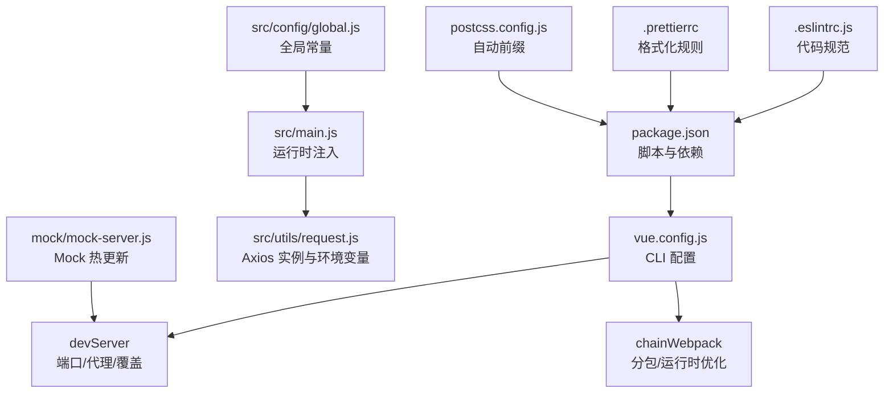
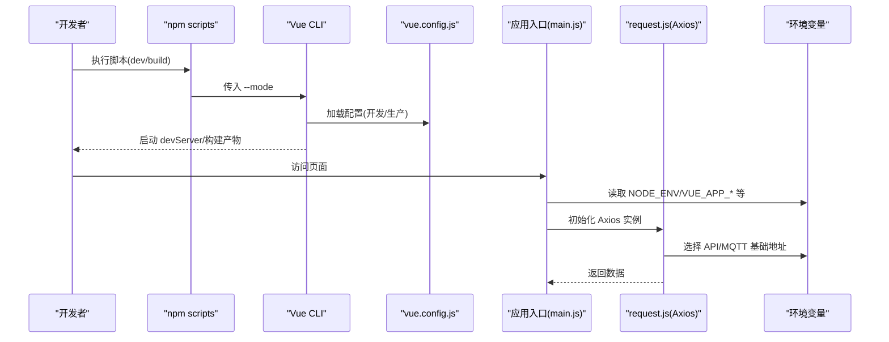
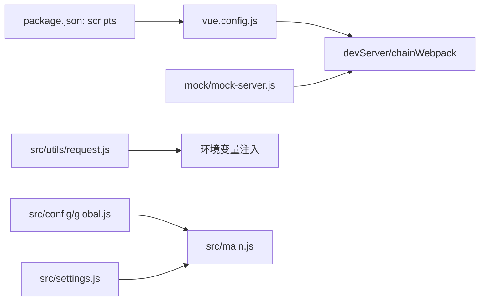

# 环境配置管理

<cite>
**本文引用的文件**
- [package.json](file://package.json)
- [vue.config.js](file://vue.config.js)
- [src/settings.js](file://src/settings.js)
- [src/config/global.js](file://src/config/global.js)
- [src/main.js](file://src/main.js)
- [src/utils/request.js](file://src/utils/request.js)
- [.eslintrc.js](file://.eslintrc.js)
- [.prettierrc](file://.prettierrc)
- [postcss.config.js](file://postcss.config.js)
- [mock/mock-server.js](file://mock/mock-server.js)
- [mock/index.js](file://mock/index.js)
</cite>

## 目录
1. [引言](#引言)
2. [项目结构](#项目结构)
3. [核心组件](#核心组件)
4. [架构总览](#架构总览)
5. [详细组件分析](#详细组件分析)
6. [依赖分析](#依赖分析)
7. [性能考量](#性能考量)
8. [故障排查指南](#故障排查指南)
9. [结论](#结论)
10. [附录](#附录)

## 引言
本文件面向 Leisu Admin 项目的运维与开发团队，系统化梳理多环境配置策略与管理方法，覆盖开发、测试、生产的差异化配置；详解 Vue CLI 配置文件的使用方式，包括开发服务器、代理、构建与插件；明确环境变量的管理与使用边界（API 端点、MQTT 地址、第三方密钥、功能开关等）；给出配置文件组织与命名规范，确保可维护性；并提供配置热更新与动态配置的可行方案，以及安全性与合规建议。

## 项目结构
围绕“配置即代码”的理念，本项目在以下层面进行配置管理：
- 构建与脚本层：通过 npm scripts 选择不同模式（本地、开发、生产），驱动 Vue CLI 的 --mode 行为
- 运行时配置层：通过环境变量注入运行时行为（API 基础地址、MQTT 地址、CDN 前缀等）
- 开发服务器与代理层：通过 vue.config.js 控制 devServer、代理与构建优化
- 全局常量与字典层：通过 src/config/global.js 维护业务级全局配置
- 规范与工具层：通过 ESLint、Prettier、PostCSS 等保障代码风格与构建一致性

图表来源
- [package.json:1-139](file://package.json#L1-L139)
- [vue.config.js:1-155](file://vue.config.js#L1-L155)
- [src/main.js:1-526](file://src/main.js#L1-L526)
- [src/utils/request.js:1-130](file://src/utils/request.js#L1-L130)
- [src/config/global.js:1-77](file://src/config/global.js#L1-L77)
- [.eslintrc.js:1-268](file://.eslintrc.js#L1-L268)
- [.prettierrc:1-13](file://.prettierrc#L1-L13)
- [postcss.config.js:1-6](file://postcss.config.js#L1-L6)
- [mock/mock-server.js:1-69](file://mock/mock-server.js#L1-L69)

章节来源
- [package.json:1-139](file://package.json#L1-L139)
- [vue.config.js:1-155](file://vue.config.js#L1-L155)
- [src/main.js:1-526](file://src/main.js#L1-L526)
- [src/utils/request.js:1-130](file://src/utils/request.js#L1-L130)
- [src/config/global.js:1-77](file://src/config/global.js#L1-L77)
- [.eslintrc.js:1-268](file://.eslintrc.js#L1-L268)
- [.prettierrc:1-13](file://.prettierrc#L1-L13)
- [postcss.config.js:1-6](file://postcss.config.js#L1-L6)
- [mock/mock-server.js:1-69](file://mock/mock-server.js#L1-L69)

## 核心组件
- 多环境脚本与模式
  - 通过 npm scripts 的 --mode 参数选择不同环境（本地、开发、生产），并在构建阶段区分开发/生产产物
- Vue CLI 配置
  - devServer：端口、覆盖警告、代理占位、Mock 注入钩子
  - configureWebpack/chainWebpack：别名、插件、SVG Sprite、分包与运行时优化
  - publicPath、输出目录与资源目录、源码映射、保存时校验开关
- 运行时配置
  - 通过环境变量注入 API 基础地址、MQTT 地址、CDN 前缀、域名映射
  - 通过 src/settings.js 控制页面标题、标签页、头部固定、错误日志显示等
- Mock 与热更新
  - 本地开发可启用 Mock 服务，并支持文件变更热重载
- 规范与工具
  - ESLint、Prettier、PostCSS 保证一致的代码质量与构建流程

章节来源
- [package.json:7-20](file://package.json#L7-L20)
- [vue.config.js:18-155](file://vue.config.js#L18-L155)
- [src/settings.js:1-36](file://src/settings.js#L1-L36)
- [src/main.js:376-445](file://src/main.js#L376-L445)
- [src/utils/request.js:10-26](file://src/utils/request.js#L10-L26)
- [mock/mock-server.js:30-68](file://mock/mock-server.js#L30-L68)

## 架构总览
下图展示从命令到运行时的关键链路，体现多环境配置如何贯穿开发与构建阶段：

图表来源
- [package.json:7-20](file://package.json#L7-L20)
- [vue.config.js:18-155](file://vue.config.js#L18-L155)
- [src/main.js:376-445](file://src/main.js#L376-L445)
- [src/utils/request.js:10-26](file://src/utils/request.js#L10-L26)

## 详细组件分析

### 多环境配置策略与管理
- 环境划分
  - 本地环境：用于本地联调与 Mock，可通过 --mode localhost 或自定义端口启动
  - 开发环境：对接开发网关与测试数据，区分开发/生产构建
  - 生产环境：上线产物，关闭源码映射，启用分包与运行时优化
- 环境变量注入
  - API 基础地址：VUE_APP_BASE_API(_OUT/_DATA)
  - MQTT 基础地址：VUE_APP_BASE_MQTT(_OUT/_DATA)
  - 基础路径：VUE_APP_BASE_PATH
  - 运行时根据部署域自动切换（admin-w.leisu.com/admin.leisudata.com/默认）
- 命名与组织
  - 使用 VUE_APP_ 前缀的变量作为前端可见的环境变量
  - 将“业务全局常量”放入 src/config/global.js，避免硬编码
  - 将“页面级配置”放入 src/settings.js，控制 UI 行为

章节来源
- [package.json:7-20](file://package.json#L7-L20)
- [src/utils/request.js:10-26](file://src/utils/request.js#L10-L26)
- [src/main.js:376-445](file://src/main.js#L376-L445)
- [src/config/global.js:1-77](file://src/config/global.js#L1-L77)
- [src/settings.js:1-36](file://src/settings.js#L1-L36)

### Vue CLI 配置文件详解
- 开发服务器与代理
  - 端口：优先 process.env.npm_config_port，其次 process.env.port，默认 80
  - 覆盖警告：仅显示错误，便于快速定位
  - 代理：预留占位注释，可按需启用
  - Mock：通过 after 钩子加载 mock-server.js
- 构建与优化
  - publicPath：由 VUE_APP_BASE_PATH 决定
  - 分包：splitChunks 缓存组（libs、elementUI、commons）
  - 运行时：runtimeChunk 单独提取
  - 插件：ProvidePlugin 注入 jQuery
  - SVG Sprite：排除 src/icons，仅对图标使用 sprite-loader
- 保存时校验
  - 开发环境开启 Lint，生产关闭

章节来源
- [vue.config.js:18-155](file://vue.config.js#L18-L155)

### 环境变量的管理与使用
- 变量来源
  - 命令行传参：--mode、--port
  - 环境变量：NODE_ENV、VUE_APP_*、process.env.*
- 使用场景
  - API/MQTT 基础地址：根据当前域自动切换
  - 页面标题与 UI 行为：settings.js
  - 全局常量：cdnPrefix、matchStatusName、videoSrcType 等
- 安全边界
  - 不在前端暴露后端密钥；如需密钥，应通过受控接口或后端代理
  - 对外公开的 CDN 前缀、静态资源路径等可放入全局常量

章节来源
- [src/utils/request.js:10-26](file://src/utils/request.js#L10-L26)
- [src/main.js:376-445](file://src/main.js#L376-L445)
- [src/config/global.js:1-77](file://src/config/global.js#L1-L77)
- [src/settings.js:1-36](file://src/settings.js#L1-L36)

### 配置文件的组织结构与命名规范
- 组织原则
  - 构建与脚本：package.json
  - CLI 配置：vue.config.js
  - 运行时配置：src/settings.js、src/config/global.js
  - 请求层：src/utils/request.js
  - 开发辅助：mock/*、mock-server.js
  - 规范工具：.eslintrc.js、.prettierrc、postcss.config.js
- 命名规范
  - 环境变量：VUE_APP_* 前缀
  - 配置文件：语义化命名，集中放置于 src/config 或根目录
  - Mock：mock/index.js 汇总导出，mock-server.js 热更新注册

章节来源
- [package.json:1-139](file://package.json#L1-L139)
- [vue.config.js:1-155](file://vue.config.js#L1-L155)
- [src/settings.js:1-36](file://src/settings.js#L1-L36)
- [src/config/global.js:1-77](file://src/config/global.js#L1-L77)
- [mock/index.js:1-71](file://mock/index.js#L1-L71)
- [mock/mock-server.js:1-69](file://mock/mock-server.js#L1-L69)
- [.eslintrc.js:1-268](file://.eslintrc.js#L1-L268)
- [.prettierrc:1-13](file://.prettierrc#L1-L13)
- [postcss.config.js:1-6](file://postcss.config.js#L1-L6)

### 配置热更新与动态配置
- Mock 热更新
  - 监听 mock 目录文件变化，自动卸载旧路由并重新注册
- 开发服务器热更新
  - devServer.open=false，overlay 仅显示错误，提升调试效率
- 动态配置建议
  - 对于非敏感的 UI/文案类配置，可在运行时拉取远程配置并合并至 settings.js
  - 对于 API 地址等，建议通过构建期注入（VUE_APP_*）以减少运行时分支

章节来源
- [mock/mock-server.js:30-68](file://mock/mock-server.js#L30-L68)
- [vue.config.js:37-59](file://vue.config.js#L37-L59)

### 配置安全性考虑
- 敏感信息保护
  - 前端不暴露数据库密码、私钥等；如需密钥，通过后端接口或代理访问
- 配置加密
  - 对外公开的静态配置（如 CDN 前缀）无需加密；若确有需要，可在后端侧做最小权限访问控制
- 访问控制
  - 严格限制环境变量注入范围，避免将生产密钥误注入到开发环境
  - 对外网关与代理仅开放必要路径，避免泄露内部服务细节

章节来源
- [src/utils/request.js:10-26](file://src/utils/request.js#L10-L26)
- [src/main.js:376-445](file://src/main.js#L376-L445)

## 依赖分析
- 脚本与模式
  - scripts 中通过 --mode 传递给 vue-cli-service，决定环境变量与构建行为
- CLI 与运行时
  - vue.config.js 影响 devServer、构建优化与插件；运行时通过环境变量与全局常量协同工作
- Mock 与开发体验
  - mock-server.js 注册路由并监听文件变化，提升本地联调效率

图表来源
- [package.json:7-20](file://package.json#L7-L20)
- [vue.config.js:18-155](file://vue.config.js#L18-L155)
- [mock/mock-server.js:30-68](file://mock/mock-server.js#L30-L68)
- [src/utils/request.js:10-26](file://src/utils/request.js#L10-L26)
- [src/config/global.js:1-77](file://src/config/global.js#L1-L77)
- [src/settings.js:1-36](file://src/settings.js#L1-L36)

章节来源
- [package.json:7-20](file://package.json#L7-L20)
- [vue.config.js:18-155](file://vue.config.js#L18-L155)
- [mock/mock-server.js:30-68](file://mock/mock-server.js#L30-L68)
- [src/utils/request.js:10-26](file://src/utils/request.js#L10-L26)
- [src/config/global.js:1-77](file://src/config/global.js#L1-L77)
- [src/settings.js:1-36](file://src/settings.js#L1-L36)

## 性能考量
- 构建优化
  - splitChunks 缓存组与 runtimeChunk 单独提取，降低重复打包与首屏体积
  - 删除 preload/prefetch 插件，按需保留
- 开发体验
  - cheap-source-map 仅在开发启用，平衡调试成本与构建时间
  - 关闭 devServer.open，避免频繁打开浏览器影响效率

章节来源
- [vue.config.js:77-155](file://vue.config.js#L77-L155)

## 故障排查指南
- 端口占用
  - 通过 --port 或 npm_config_port 指定端口，避免 80 权限问题
- 代理未生效
  - 检查 devServer.proxy 是否启用；确认 VUE_APP_BASE_API 与 pathRewrite 正确
- Mock 不生效
  - 确认 after 钩子已启用；检查 mock-server.js 注册逻辑与文件监听
- 请求失败
  - 根据 window.location 域自动切换 API/MQTT 地址；核对环境变量是否正确注入
- Lint 报错
  - 开发环境默认开启 Lint；遵循 .eslintrc.js 规则或临时关闭

章节来源
- [vue.config.js:11-59](file://vue.config.js#L11-L59)
- [mock/mock-server.js:30-68](file://mock/mock-server.js#L30-L68)
- [src/utils/request.js:10-26](file://src/utils/request.js#L10-L26)
- [.eslintrc.js:1-268](file://.eslintrc.js#L1-L268)

## 结论
本项目通过“脚本模式 + CLI 配置 + 运行时注入 + 全局常量 + 规范工具”的组合，实现了清晰、可维护且安全的多环境配置体系。建议在后续迭代中：
- 明确环境变量清单与注入流程，形成运维手册
- 对外网关与代理策略进行审计，确保最小暴露面
- 将动态配置能力与后端接口对接，实现灰度与回滚机制

## 附录
- 最佳实践清单
  - 使用 VUE_APP_* 前缀管理前端可见变量
  - 将业务全局常量收敛至 src/config/global.js
  - 通过 --mode 区分本地/开发/生产，避免混用
  - 代理与网关路径保持与后端一致，避免路径错配
  - 对外资源（CDN、图标）尽量走受控域名，减少跨域风险