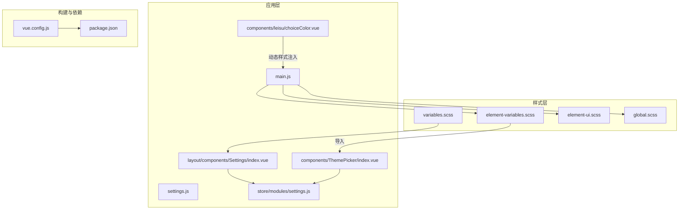
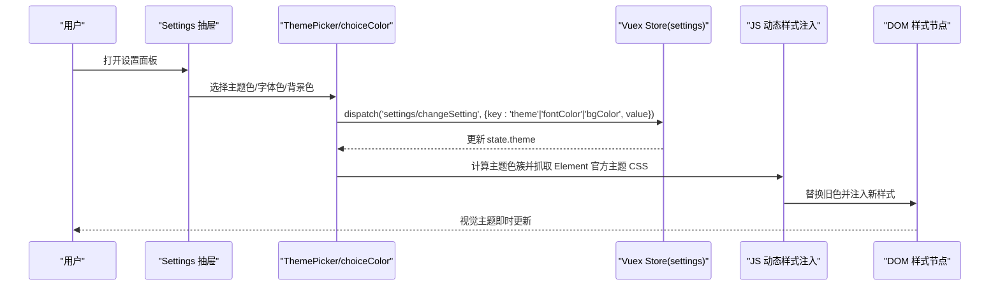
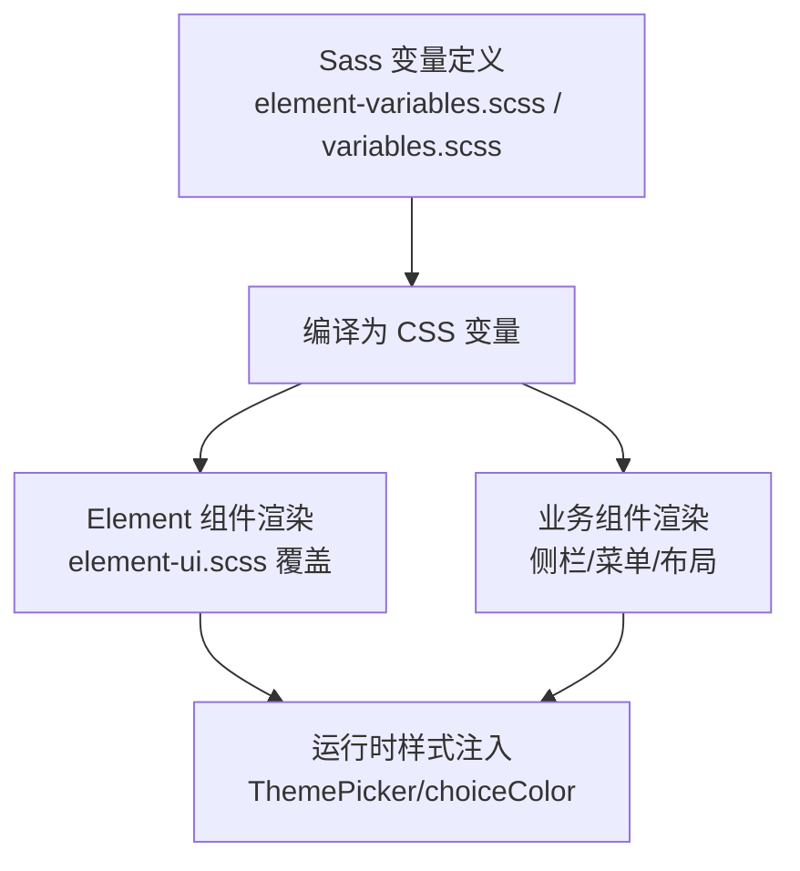
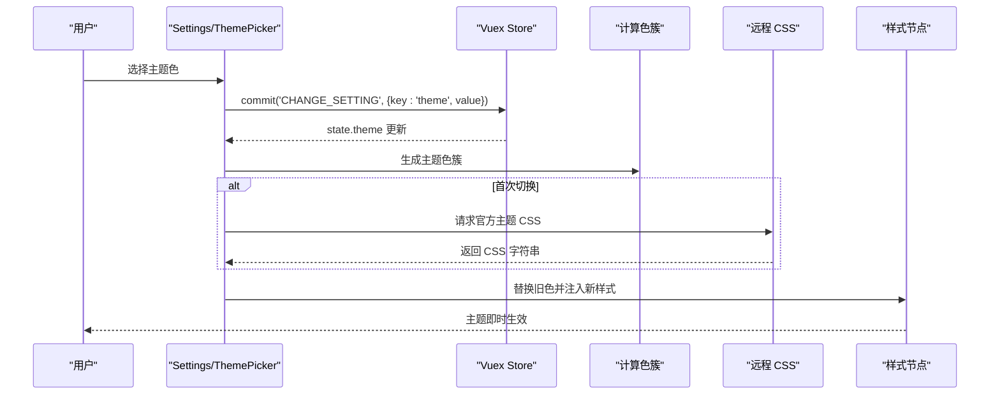
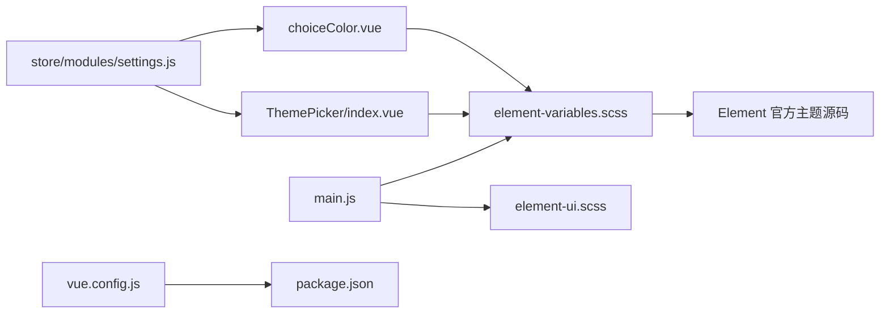

# 主题定制

<cite>
**本文引用的文件**
- [element-variables.scss](file://src/styles/element-variables.scss)
- [variables.scss](file://src/styles/variables.scss)
- [element-ui.scss](file://src/styles/element-ui.scss)
- [global.scss](file://src/assets/styles/global.scss)
- [ThemePicker/index.vue](file://src/components/ThemePicker/index.vue)
- [choiceColor.vue](file://src/components/leisu/choiceColor.vue)
- [settings.js](file://src/settings.js)
- [settings.js（store）](file://src/store/modules/settings.js)
- [Settings/index.vue](file://src/layout/components/Settings/index.vue)
- [main.js](file://src/main.js)
- [package.json](file://package.json)
- [vue.config.js](file://vue.config.js)
</cite>

## 目录
1. [简介](#简介)
2. [项目结构](#项目结构)
3. [核心组件](#核心组件)
4. [架构总览](#架构总览)
5. [详细组件分析](#详细组件分析)
6. [依赖关系分析](#依赖关系分析)
7. [性能考量](#性能考量)
8. [故障排查指南](#故障排查指南)
9. [结论](#结论)
10. [附录](#附录)

## 简介
本文件面向 Leisu Admin 的主题定制与扩展，系统性说明如何基于 Element UI 的 Sass 变量体系进行主题定制，涵盖颜色系统、尺寸与字体规格的修改；深入解析品牌主题的落地方式、主题切换机制与动态主题加载流程；梳理主题变量的层次结构（基础变量、组件变量、业务变量），并给出最佳实践与调试方法，帮助开发者在不破坏现有架构的前提下，安全、可维护地实现多主题与品牌化。

## 项目结构
围绕主题定制的关键目录与文件如下：
- 样式入口与变量
  - 样式入口：main.js 中引入全局样式与 Element 主题变量
  - Element 主题变量：element-variables.scss
  - 业务侧变量：variables.scss（含侧边栏、菜单等）
  - 全局样式增强：element-ui.scss、global.scss
- 主题切换与状态
  - 设置面板：Settings/index.vue
  - 主题选择器：ThemePicker/index.vue
  - 颜色选择器（高级版）：choiceColor.vue
  - 应用状态：store/modules/settings.js
  - 默认设置：settings.js
- 构建与外部依赖
  - 构建配置：vue.config.js
  - 依赖声明：package.json

**图表来源**
- [main.js:10-26](file://src/main.js#L10-L26)
- [element-variables.scss:1-32](file://src/styles/element-variables.scss#L1-L32)
- [element-ui.scss:1-86](file://src/styles/element-ui.scss#L1-L86)
- [global.scss:1-28](file://src/assets/styles/global.scss#L1-L28)
- [variables.scss:1-36](file://src/styles/variables.scss#L1-L36)
- [Settings/index.vue:1-109](file://src/layout/components/Settings/index.vue#L1-L109)
- [ThemePicker/index.vue:1-175](file://src/components/ThemePicker/index.vue#L1-L175)
- [choiceColor.vue:1-205](file://src/components/leisu/choiceColor.vue#L1-L205)
- [settings.js（store）:1-35](file://src/store/modules/settings.js#L1-L35)
- [settings.js:1-36](file://src/settings.js#L1-L36)
- [vue.config.js:1-155](file://vue.config.js#L1-L155)
- [package.json:1-139](file://package.json#L1-L139)

**章节来源**
- [main.js:10-26](file://src/main.js#L10-L26)
- [element-variables.scss:1-32](file://src/styles/element-variables.scss#L1-L32)
- [element-ui.scss:1-86](file://src/styles/element-ui.scss#L1-L86)
- [global.scss:1-28](file://src/assets/styles/global.scss#L1-L28)
- [variables.scss:1-36](file://src/styles/variables.scss#L1-L36)
- [Settings/index.vue:1-109](file://src/layout/components/Settings/index.vue#L1-L109)
- [ThemePicker/index.vue:1-175](file://src/components/ThemePicker/index.vue#L1-L175)
- [choiceColor.vue:1-205](file://src/components/leisu/choiceColor.vue#L1-L205)
- [settings.js（store）:1-35](file://src/store/modules/settings.js#L1-L35)
- [settings.js:1-36](file://src/settings.js#L1-L36)
- [vue.config.js:1-155](file://vue.config.js#L1-L155)
- [package.json:1-139](file://package.json#L1-L139)

## 核心组件
- Element 主题变量与样式覆盖
  - element-variables.scss：定义 Element UI 的主题色、边框、表格边框、图标字体路径，并通过 @import 引入 Element 官方主题源码，末尾导出 theme 变量供 JS 使用
  - element-ui.scss：覆盖 Element 组件的细节样式（如上传、对话框、下拉、表格等），确保在主题色基础上的视觉一致性
  - global.scss：补充全局滚动条、图表 tooltip 等通用样式
- 品牌与业务变量
  - variables.scss：定义品牌色板、侧边栏文本与背景色、悬停态、子菜单颜色、侧栏宽度等，并导出给 JS 使用
- 主题切换与动态加载
  - ThemePicker/index.vue：提供预设色板，监听主题变化，动态抓取 Element 官方主题 CSS，生成主题色簇，替换页面中旧色并注入新样式
  - choiceColor.vue：高级颜色选择器，支持同时选择字体色、背景色与 Element 主题色，并持久化到本地存储
  - Settings/index.vue：设置抽屉，绑定开关项与主题选择器，通过 Vuex 提交变更
  - store/modules/settings.js：集中管理主题与界面设置的状态、变更动作
  - settings.js：默认设置项（标题、标签页、固定头部、侧边栏 Logo 等）

**章节来源**
- [element-variables.scss:1-32](file://src/styles/element-variables.scss#L1-L32)
- [element-ui.scss:1-86](file://src/styles/element-ui.scss#L1-L86)
- [global.scss:1-28](file://src/assets/styles/global.scss#L1-L28)
- [variables.scss:1-36](file://src/styles/variables.scss#L1-L36)
- [ThemePicker/index.vue:1-175](file://src/components/ThemePicker/index.vue#L1-L175)
- [choiceColor.vue:1-205](file://src/components/leisu/choiceColor.vue#L1-L205)
- [Settings/index.vue:1-109](file://src/layout/components/Settings/index.vue#L1-L109)
- [settings.js（store）:1-35](file://src/store/modules/settings.js#L1-L35)
- [settings.js:1-36](file://src/settings.js#L1-L36)

## 架构总览
主题定制采用“变量驱动 + 动态样式注入”的架构：
- 变量层：Sass 变量定义主题色与业务色，通过 :export 导出给 JS
- 组件层：ThemePicker/choiceColor 读取当前主题，计算主题色簇，抓取 Element 官方主题 CSS，替换旧色并注入新样式
- 状态层：Vuex store 统一管理主题与界面设置，Settings 抽屉作为用户交互入口
- 构建层：vue.config.js 控制打包策略，package.json 管理依赖版本

**图表来源**
- [Settings/index.vue:74-79](file://src/layout/components/Settings/index.vue#L74-L79)
- [ThemePicker/index.vue:33-85](file://src/components/ThemePicker/index.vue#L33-L85)
- [choiceColor.vue:59-111](file://src/components/leisu/choiceColor.vue#L59-L111)
- [settings.js（store）:22-26](file://src/store/modules/settings.js#L22-L26)

## 详细组件分析

### 主题变量与层次结构
- 基础变量（Element UI）
  - 定义主色、成功/警告/危险色、按钮字重、边框色、表格边框、图标字体路径等
  - 通过 @import 引入官方主题源码，保证与 Element 组件的强耦合一致
  - 末尾 :export 导出 theme，供 JS 获取当前主题色
- 业务变量（侧边栏与布局）
  - 定义品牌色板与侧边栏文本/激活文本/子菜单文本/背景/悬停态、侧栏宽度等
  - 同样 :export 导出，便于在组件中读取并应用
- 组件变量（覆盖与增强）
  - element-ui.scss 覆盖上传、对话框、下拉、日期选择器等细节样式
  - global.scss 补充滚动条与图表 tooltip 等通用样式

**图表来源**
- [element-variables.scss:6-31](file://src/styles/element-variables.scss#L6-L31)
- [variables.scss:1-36](file://src/styles/variables.scss#L1-L36)
- [element-ui.scss:1-86](file://src/styles/element-ui.scss#L1-L86)
- [global.scss:1-28](file://src/assets/styles/global.scss#L1-L28)

**章节来源**
- [element-variables.scss:1-32](file://src/styles/element-variables.scss#L1-L32)
- [variables.scss:1-36](file://src/styles/variables.scss#L1-L36)
- [element-ui.scss:1-86](file://src/styles/element-ui.scss#L1-L86)
- [global.scss:1-28](file://src/assets/styles/global.scss#L1-L28)

### 主题切换机制与动态加载
- 用户交互
  - Settings 抽屉提供主题色选择器与界面开关
  - 选择后通过 Vuex 提交变更，触发组件 watch
- 主题色簇生成
  - 将输入色转换为 RGB，生成 10 个渐变亮色与 1 个渐暗色，形成主题色簇
- 动态样式注入
  - 首次切换时异步获取 Element 官方主题 CSS
  - 将旧色逐一替换为主题色簇对应的新色，注入或更新样式节点
- 状态持久化
  - ThemePicker 读取 store.state.settings.theme
  - choiceColor 支持将三色组合保存至 localStorage 并初始化

**图表来源**
- [Settings/index.vue:74-79](file://src/layout/components/Settings/index.vue#L74-L79)
- [ThemePicker/index.vue:33-85](file://src/components/ThemePicker/index.vue#L33-L85)
- [choiceColor.vue:59-111](file://src/components/leisu/choiceColor.vue#L59-L111)
- [settings.js（store）:14-26](file://src/store/modules/settings.js#L14-L26)

**章节来源**
- [Settings/index.vue:1-109](file://src/layout/components/Settings/index.vue#L1-L109)
- [ThemePicker/index.vue:1-175](file://src/components/ThemePicker/index.vue#L1-L175)
- [choiceColor.vue:1-205](file://src/components/leisu/choiceColor.vue#L1-L205)
- [settings.js（store）:1-35](file://src/store/modules/settings.js#L1-L35)

### 品牌色彩的应用与扩展
- 品牌色板
  - variables.scss 定义了多组品牌色，可用于业务组件、图表、徽标等
- 主题色与业务色分离
  - element-variables.scss 专注 Element 组件主题色
  - variables.scss 专注侧栏与布局业务色，避免相互干扰
- 动态联动
  - ThemePicker/choiceColor 仅替换 Element 主题色，业务色由 variables.scss 保持稳定，确保品牌一致性

**章节来源**
- [variables.scss:1-36](file://src/styles/variables.scss#L1-L36)
- [ThemePicker/index.vue:1-175](file://src/components/ThemePicker/index.vue#L1-L175)
- [choiceColor.vue:1-205](file://src/components/leisu/choiceColor.vue#L1-L205)

### 主题调试工具与可视化
- 开发者工具
  - 浏览器 Elements 面板观察样式节点是否正确注入
  - Console 查看主题切换过程中的色簇计算与替换逻辑
- 运行时验证
  - 通过 Settings 抽屉快速切换主题，观察组件渲染变化
  - 使用 localStorage 持久化测试（choiceColor）

**章节来源**
- [Settings/index.vue:1-109](file://src/layout/components/Settings/index.vue#L1-L109)
- [choiceColor.vue:112-137](file://src/components/leisu/choiceColor.vue#L112-L137)

## 依赖关系分析
- 样式依赖
  - main.js 引入 element-variables.scss 与 element-ui.scss，确保变量优先级与覆盖顺序正确
  - element-variables.scss 依赖 Element UI 官方主题源码
- 组件依赖
  - ThemePicker/choiceColor 依赖 Element UI 版本信息与官方主题 CSS
  - Settings 依赖 store 以同步主题状态
- 构建依赖
  - vue.config.js 对 Element UI 进行独立分包，提升缓存与加载效率
  - package.json 固定 Element UI 版本，避免主题变量差异导致的样式错乱

**图表来源**
- [main.js:10-26](file://src/main.js#L10-L26)
- [element-variables.scss](file://src/styles/element-variables.scss#L25)
- [ThemePicker/index.vue](file://src/components/ThemePicker/index.vue#L11)
- [choiceColor.vue](file://src/components/leisu/choiceColor.vue#L34)
- [settings.js（store）:1-35](file://src/store/modules/settings.js#L1-L35)
- [vue.config.js:136-140](file://vue.config.js#L136-L140)
- [package.json](file://package.json#L51)

**章节来源**
- [main.js:10-26](file://src/main.js#L10-L26)
- [element-variables.scss](file://src/styles/element-variables.scss#L25)
- [ThemePicker/index.vue](file://src/components/ThemePicker/index.vue#L11)
- [choiceColor.vue](file://src/components/leisu/choiceColor.vue#L34)
- [settings.js（store）:1-35](file://src/store/modules/settings.js#L1-L35)
- [vue.config.js:136-140](file://vue.config.js#L136-L140)
- [package.json](file://package.json#L51)

## 性能考量
- 分包与缓存
  - vue.config.js 将 Element UI 单独拆分为 chunk-elementUI，提升浏览器缓存命中率
- 样式注入策略
  - 仅在主题切换时注入/更新样式节点，避免全量重绘
- 变量导出与读取
  - 通过 :export 将 Sass 变量导出为 JS 可用值，减少重复计算
- 依赖版本控制
  - package.json 锁定 Element UI 版本，避免升级带来的主题变量差异

**章节来源**
- [vue.config.js:136-140](file://vue.config.js#L136-L140)
- [element-variables.scss:29-31](file://src/styles/element-variables.scss#L29-L31)
- [package.json](file://package.json#L51)

## 故障排查指南
- 主题切换无效
  - 检查 Settings 是否正确提交到 store，确认 state.theme 是否更新
  - 确认 ThemePicker/choiceColor 是否成功抓取 Element 官方主题 CSS
  - 在浏览器 Network 面板检查请求是否成功
- 样式未生效或闪烁
  - 确认样式节点是否被正确注入或更新（Elements 面板）
  - 检查 element-ui.scss 的覆盖规则是否被更高优先级样式覆盖
- 色彩不一致
  - 确认 element-variables.scss 中的主题色与业务色分离策略
  - 若使用自定义组件，请复用 variables.scss 中的品牌色常量
- 构建异常
  - 检查 vue.config.js 的分包配置与 package.json 的 Element UI 版本是否匹配

**章节来源**
- [Settings/index.vue:74-79](file://src/layout/components/Settings/index.vue#L74-L79)
- [ThemePicker/index.vue:33-85](file://src/components/ThemePicker/index.vue#L33-L85)
- [element-ui.scss:1-86](file://src/styles/element-ui.scss#L1-L86)
- [variables.scss:1-36](file://src/styles/variables.scss#L1-L36)
- [vue.config.js:136-140](file://vue.config.js#L136-L140)
- [package.json](file://package.json#L51)

## 结论
Leisu Admin 的主题定制以 Element UI 变量为核心，结合业务侧变量与动态样式注入，实现了可配置、可扩展、可维护的品牌主题体系。通过 Settings 抽屉与 ThemePicker/choiceColor 组件，用户可在运行时即时体验主题切换效果。建议在后续迭代中进一步完善主题变量命名规范、增加主题预设模板与导出能力，持续优化性能与兼容性。

## 附录

### 主题定制最佳实践
- 变量命名规范
  - 基础变量：以 $-- 前缀标识（如 $--color-primary），遵循 Element UI 命名约定
  - 业务变量：以业务语义命名（如 $menuText、$menuBg），避免与 Element 内置变量冲突
- 文件组织
  - element-variables.scss 仅存放 Element 主题变量
  - variables.scss 仅存放业务侧变量
  - element-ui.scss 仅存放覆盖样式，不混入变量
- 主题切换体验
  - 在 Settings 中提供一键恢复默认主题
  - 为高频切换提供预设色板，降低用户认知负担
- 调试与回滚
  - 保留原始主题 CSS 的备份策略，便于回滚
  - 在开发环境开启更详细的日志输出，定位替换失败原因

### 主题调试清单
- 变量导出验证：确认 :export 输出的变量在 JS 中可用
- 样式注入验证：确认样式节点已注入且无重复
- 覆盖规则验证：确认 element-ui.scss 的覆盖规则未被更高优先级样式覆盖
- 性能验证：确认 Element UI 单独分包生效，主题切换无明显卡顿