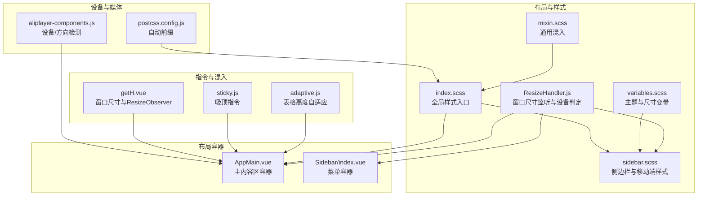
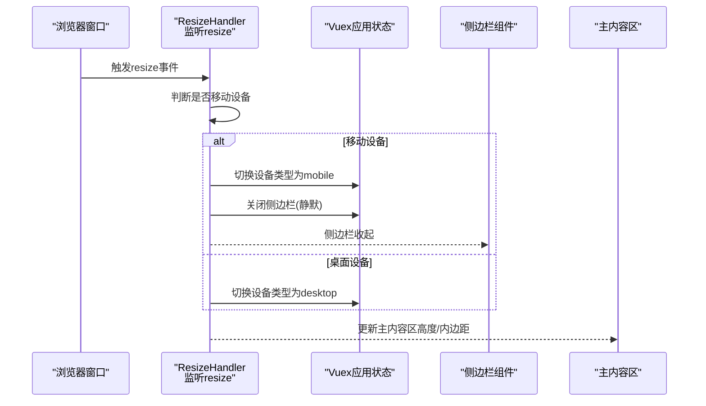
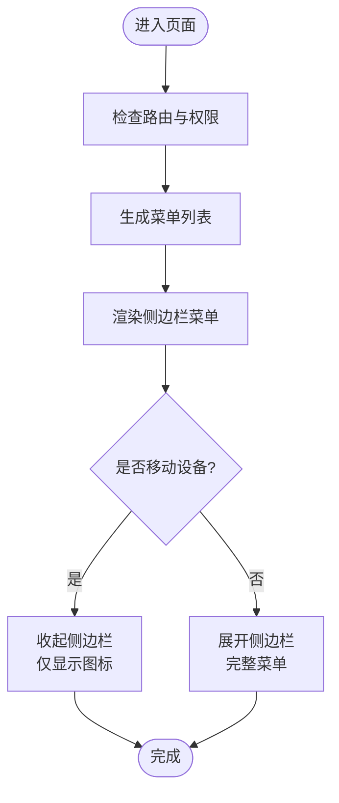
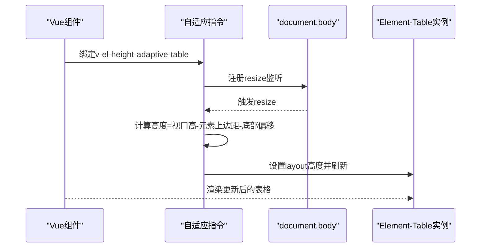
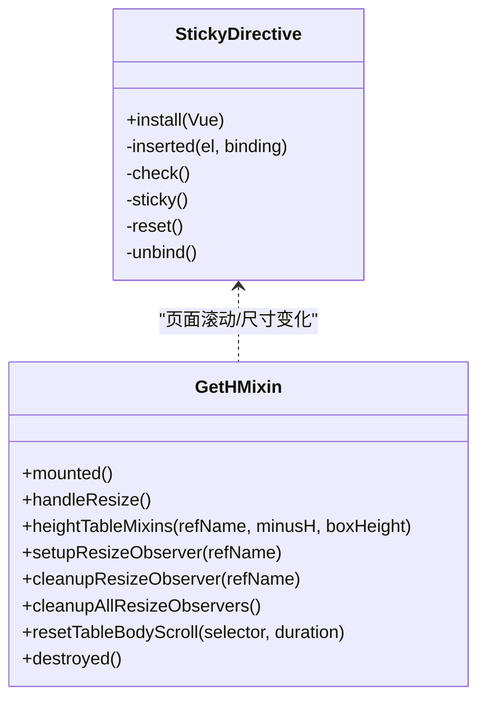
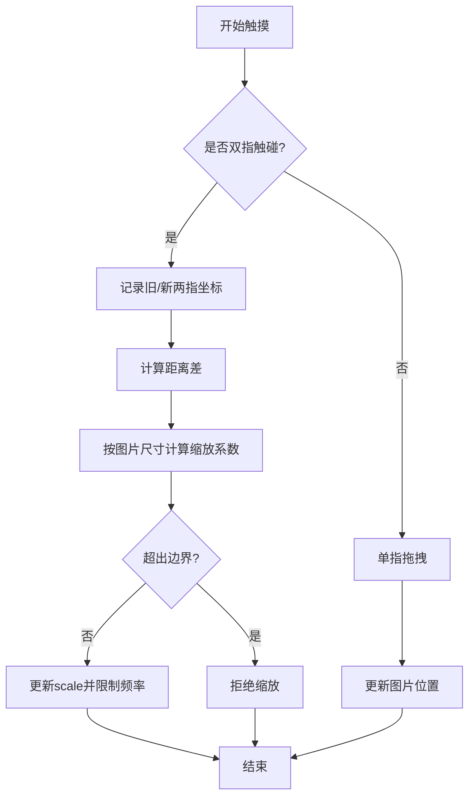
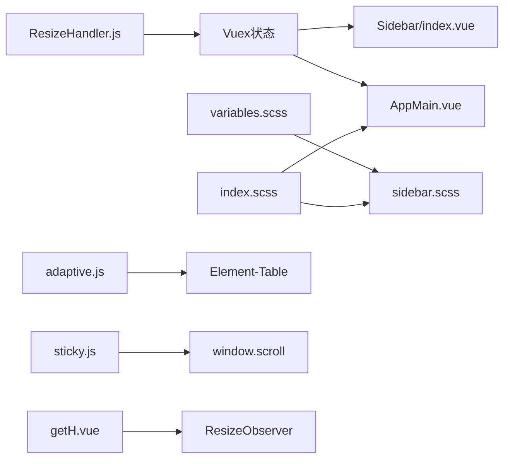

# 响应式设计

<cite>
**本文引用的文件**
- [src/layout/mixin/ResizeHandler.js](file://src/layout/mixin/ResizeHandler.js)
- [src/styles/variables.scss](file://src/styles/variables.scss)
- [src/styles/sidebar.scss](file://src/styles/sidebar.scss)
- [src/styles/index.scss](file://src/styles/index.scss)
- [src/styles/mixin.scss](file://src/styles/mixin.scss)
- [src/layout/components/AppMain.vue](file://src/layout/components/AppMain.vue)
- [src/layout/components/Sidebar/index.vue](file://src/layout/components/Sidebar/index.vue)
- [src/directive/el-table/adaptive.js](file://src/directive/el-table/adaptive.js)
- [src/directive/el-table/index.js](file://src/directive/el-table/index.js)
- [src/mixins/getH.vue](file://src/mixins/getH.vue)
- [src/directive/sticky.js](file://src/directive/sticky.js)
- [src/utils/aliplayer-components.js](file://src/utils/aliplayer-components.js)
- [postcss.config.js](file://postcss.config.js)
</cite>

## 目录
1. [简介](#简介)
2. [项目结构与响应式相关模块](#项目结构与响应式相关模块)
3. [核心组件与断点策略](#核心组件与断点策略)
4. [架构总览](#架构总览)
5. [详细组件分析](#详细组件分析)
6. [依赖关系分析](#依赖关系分析)
7. [性能考量](#性能考量)
8. [故障排查指南](#故障排查指南)
9. [结论](#结论)
10. [附录：测试方法与最佳实践](#附录测试方法与最佳实践)

## 简介
本文件面向 Leisu Admin 的响应式设计，系统梳理断点策略、弹性布局实现、移动端适配、组件设计原则，并提供测试与性能优化建议。文档以仓库实际代码为依据，结合关键文件路径进行说明，帮助开发者在桌面端、平板端与移动端获得一致且高效的体验。

## 项目结构与响应式相关模块
- 断点与设备检测：通过混入与工具对窗口尺寸与设备类型进行判断，驱动侧边栏与布局切换。
- 样式体系：变量、混入、通用样式与侧边栏样式共同构成响应式基础。
- 布局容器：主内容区与侧边栏在不同设备下的行为差异由样式与脚本协同实现。
- 指令与混入：提供表格高度自适应、滚动吸顶、窗口尺寸监听等能力，支撑复杂页面的响应式需求。
- 移动端交互：触摸缩放、方向变化监听等增强移动端可用性。

图表来源
- [src/layout/mixin/ResizeHandler.js:1-46](file://src/layout/mixin/ResizeHandler.js#L1-L46)
- [src/styles/variables.scss:1-36](file://src/styles/variables.scss#L1-L36)
- [src/styles/sidebar.scss:1-210](file://src/styles/sidebar.scss#L1-L210)
- [src/styles/index.scss:1-311](file://src/styles/index.scss#L1-L311)
- [src/styles/mixin.scss:1-88](file://src/styles/mixin.scss#L1-L88)
- [src/layout/components/AppMain.vue:1-122](file://src/layout/components/AppMain.vue#L1-L122)
- [src/layout/components/Sidebar/index.vue:1-82](file://src/layout/components/Sidebar/index.vue#L1-L82)
- [src/directive/el-table/adaptive.js:1-42](file://src/directive/el-table/adaptive.js#L1-L42)
- [src/directive/sticky.js:1-92](file://src/directive/sticky.js#L1-L92)
- [src/mixins/getH.vue:1-103](file://src/mixins/getH.vue#L1-L103)
- [src/utils/aliplayer-components.js:558-755](file://src/utils/aliplayer-components.js#L558-L755)
- [postcss.config.js:1-5](file://postcss.config.js#L1-L5)

章节来源
- [src/layout/mixin/ResizeHandler.js:1-46](file://src/layout/mixin/ResizeHandler.js#L1-L46)
- [src/styles/sidebar.scss:146-173](file://src/styles/sidebar.scss#L146-L173)
- [src/layout/components/AppMain.vue:74-122](file://src/layout/components/AppMain.vue#L74-L122)
- [src/layout/components/Sidebar/index.vue:1-82](file://src/layout/components/Sidebar/index.vue#L1-L82)
- [src/styles/index.scss:1-311](file://src/styles/index.scss#L1-L311)
- [src/styles/mixin.scss:1-88](file://src/styles/mixin.scss#L1-L88)
- [src/directive/el-table/adaptive.js:1-42](file://src/directive/el-table/adaptive.js#L1-L42)
- [src/directive/sticky.js:1-92](file://src/directive/sticky.js#L1-L92)
- [src/mixins/getH.vue:1-103](file://src/mixins/getH.vue#L1-L103)
- [src/utils/aliplayer-components.js:558-755](file://src/utils/aliplayer-components.js#L558-L755)
- [postcss.config.js:1-5](file://postcss.config.js#L1-L5)

## 核心组件与断点策略
- 断点阈值与设备判定
  - 使用固定宽度阈值区分移动与桌面：当窗口宽度小于阈值时判定为移动设备，用于控制侧边栏展开/收起与布局切换。
  - 设备类型与横竖屏检测：通过设备检测工具识别移动/平板/桌面，并支持横竖屏状态变更回调，便于动态调整布局或组件行为。
- 布局容器
  - 主内容区容器在有标签页与无标签页场景下采用不同的顶部内边距与高度计算，保证内容区域始终占满可视窗口。
  - 侧边栏在移动端默认收起并支持滑入滑出动画；折叠状态下菜单项图标与文字显示策略按样式规则自动切换。
- 样式变量与混入
  - 通过变量集中管理菜单宽度、颜色与尺寸，便于在不同断点下统一调整。
  - 提供通用混入（如滚动条、三角形、禁选等），减少重复样式定义。

章节来源
- [src/layout/mixin/ResizeHandler.js:3-4](file://src/layout/mixin/ResizeHandler.js#L3-L4)
- [src/layout/mixin/ResizeHandler.js:30-33](file://src/layout/mixin/ResizeHandler.js#L30-L33)
- [src/layout/mixin/ResizeHandler.js:34-43](file://src/layout/mixin/ResizeHandler.js#L34-L43)
- [src/utils/aliplayer-components.js:558-585](file://src/utils/aliplayer-components.js#L558-L585)
- [src/utils/aliplayer-components.js:677-715](file://src/utils/aliplayer-components.js#L677-L715)
- [src/styles/variables.scss:22-22](file://src/styles/variables.scss#L22-L22)
- [src/styles/sidebar.scss:146-173](file://src/styles/sidebar.scss#L146-L173)
- [src/layout/components/AppMain.vue:96-111](file://src/layout/components/AppMain.vue#L96-L111)
- [src/styles/mixin.scss:9-22](file://src/styles/mixin.scss#L9-L22)

## 架构总览
下图展示响应式相关模块之间的交互关系：窗口尺寸变化触发设备判定与布局切换；样式层根据设备状态应用不同规则；指令与混入为复杂页面提供自适应能力。

图表来源
- [src/layout/mixin/ResizeHandler.js:14-43](file://src/layout/mixin/ResizeHandler.js#L14-L43)
- [src/layout/components/AppMain.vue:96-111](file://src/layout/components/AppMain.vue#L96-L111)
- [src/styles/sidebar.scss:146-173](file://src/styles/sidebar.scss#L146-L173)

## 详细组件分析

### 布局容器与侧边栏响应式
- 主内容区
  - 在存在标签视图时，主容器高度采用视口单位并增加顶部内边距，确保内容不被导航遮挡。
  - 容器内部支持滚动与 iframe 场景的高度适配。
- 侧边栏
  - 移动端默认关闭并支持滑入滑出；折叠模式下仅保留图标，避免空间浪费。
  - 通过变量控制菜单宽度，配合过渡动画提升交互体验。

图表来源
- [src/layout/components/Sidebar/index.vue:55-80](file://src/layout/components/Sidebar/index.vue#L55-L80)
- [src/styles/sidebar.scss:89-140](file://src/styles/sidebar.scss#L89-L140)

章节来源
- [src/layout/components/AppMain.vue:74-122](file://src/layout/components/AppMain.vue#L74-L122)
- [src/layout/components/Sidebar/index.vue:1-82](file://src/layout/components/Sidebar/index.vue#L1-L82)
- [src/styles/sidebar.scss:1-210](file://src/styles/sidebar.scss#L1-L210)

### 表格高度自适应指令
- 功能概述
  - 基于窗口尺寸与元素相对位置动态计算表格高度，避免固定高度导致的溢出或留白。
  - 支持传入底部偏移量，适配不同页面结构。
- 使用要点
  - 必须显式设置表格高度；指令会在插入与窗口变化时执行计算并更新布局。
  - 依赖元素尺寸监听与布局刷新机制，确保渲染稳定。

图表来源
- [src/directive/el-table/adaptive.js:10-25](file://src/directive/el-table/adaptive.js#L10-L25)
- [src/directive/el-table/adaptive.js:28-41](file://src/directive/el-table/adaptive.js#L28-L41)
- [src/directive/el-table/index.js:1-13](file://src/directive/el-table/index.js#L1-L13)

章节来源
- [src/directive/el-table/adaptive.js:1-42](file://src/directive/el-table/adaptive.js#L1-L42)
- [src/directive/el-table/index.js:1-13](file://src/directive/el-table/index.js#L1-L13)

### 吸顶与窗口尺寸监听混入
- 吸顶指令
  - 当滚动超过阈值时，目标元素变为固定定位并占位，否则恢复原位。
  - 适用于操作栏、筛选器等需要常驻可视区域的 UI。
- 窗口尺寸混入
  - 提供被动事件监听与 ResizeObserver，支持按需观察子元素高度变化并计算表格等组件的自适应高度。
  - 提供重置表格滚动的方法，避免复用场景下的滚动位置错乱。

图表来源
- [src/directive/sticky.js:1-92](file://src/directive/sticky.js#L1-L92)
- [src/mixins/getH.vue:1-103](file://src/mixins/getH.vue#L1-L103)

章节来源
- [src/directive/sticky.js:1-92](file://src/directive/sticky.js#L1-L92)
- [src/mixins/getH.vue:18-100](file://src/mixins/getH.vue#L18-L100)

### 移动端适配与触摸交互
- 设备与方向检测
  - 识别移动/平板/桌面设备类型与横竖屏状态，支持注册方向变化回调，便于在页面中做布局或组件调整。
- 触摸缩放与拖拽
  - 移动端图片裁剪组件支持双指缩放与拖拽，基于两指距离差计算缩放系数，并限制缩放范围与边界校验，保证交互顺滑与安全。

图表来源
- [src/utils/aliplayer-components.js:558-585](file://src/utils/aliplayer-components.js#L558-L585)
- [src/utils/aliplayer-components.js:677-715](file://src/utils/aliplayer-components.js#L677-L715)
- [src/components/myCropper/vue-cropper.vue:591-669](file://src/components/myCropper/vue-cropper.vue#L591-L669)

章节来源
- [src/utils/aliplayer-components.js:558-755](file://src/utils/aliplayer-components.js#L558-L755)
- [src/components/myCropper/vue-cropper.vue:591-669](file://src/components/myCropper/vue-cropper.vue#L591-L669)

## 依赖关系分析
- 断点与布局
  - ResizeHandler 依赖窗口尺寸与路由变化，向 Vuex 应用状态写入设备类型与侧边栏状态，影响侧边栏与主内容区的样式表现。
- 样式与变量
  - sidebar.scss 依赖 variables.scss 中的菜单宽度与颜色变量；index.scss 统一引入混入与全局样式，形成响应式基线。
- 指令与混入
  - adaptive 指令依赖 Element-Table 的布局接口；sticky 指令依赖滚动事件与元素尺寸；getH 混入依赖 ResizeObserver 与窗口事件。

图表来源
- [src/layout/mixin/ResizeHandler.js:1-46](file://src/layout/mixin/ResizeHandler.js#L1-L46)
- [src/layout/components/Sidebar/index.vue:1-82](file://src/layout/components/Sidebar/index.vue#L1-L82)
- [src/layout/components/AppMain.vue:1-122](file://src/layout/components/AppMain.vue#L1-L122)
- [src/styles/variables.scss:1-36](file://src/styles/variables.scss#L1-L36)
- [src/styles/sidebar.scss:1-210](file://src/styles/sidebar.scss#L1-L210)
- [src/styles/index.scss:1-311](file://src/styles/index.scss#L1-L311)
- [src/directive/el-table/adaptive.js:1-42](file://src/directive/el-table/adaptive.js#L1-L42)
- [src/directive/sticky.js:1-92](file://src/directive/sticky.js#L1-L92)
- [src/mixins/getH.vue:1-103](file://src/mixins/getH.vue#L1-L103)

章节来源
- [src/layout/mixin/ResizeHandler.js:1-46](file://src/layout/mixin/ResizeHandler.js#L1-L46)
- [src/styles/sidebar.scss:1-210](file://src/styles/sidebar.scss#L1-L210)
- [src/styles/index.scss:1-311](file://src/styles/index.scss#L1-L311)
- [src/directive/el-table/adaptive.js:1-42](file://src/directive/el-table/adaptive.js#L1-L42)
- [src/directive/sticky.js:1-92](file://src/directive/sticky.js#L1-L92)
- [src/mixins/getH.vue:1-103](file://src/mixins/getH.vue#L1-L103)

## 性能考量
- 事件节流与被动监听
  - Resize 事件采用被动监听，降低主线程阻塞风险；在高频缩放与滚动场景中尤为关键。
- DOM 变更最小化
  - 通过占位元素与固定定位实现吸顶，避免频繁重排；表格高度计算仅在必要时触发。
- 观察器生命周期管理
  - ResizeObserver 在组件销毁时统一清理，防止内存泄漏与重复绑定。
- 自动前缀与兼容性
  - PostCSS 自动添加浏览器前缀，减少手动维护成本并提升跨浏览器一致性。

章节来源
- [src/mixins/getH.vue:22-22](file://src/mixins/getH.vue#L22-L22)
- [src/mixins/getH.vue:82-86](file://src/mixins/getH.vue#L82-L86)
- [src/directive/sticky.js:77-79](file://src/directive/sticky.js#L77-L79)
- [postcss.config.js:1-5](file://postcss.config.js#L1-L5)

## 故障排查指南
- 表格高度异常
  - 确认已设置表格高度；检查底部偏移量是否合理；确认指令已正确绑定并在插入后执行初始化。
- 侧边栏在移动端未收起
  - 检查断点阈值与设备判定逻辑；确认路由变化时是否触发关闭侧边栏；查看样式中移动端类名是否生效。
- 吸顶失效或跳动
  - 检查滚动容器与父级定位；确认占位元素宽度/高度计算正确；避免在吸顶状态下频繁修改样式。
- 移动端触摸缩放卡顿
  - 确认缩放系数与边界校验逻辑；避免在短时间内多次更新 scale；检查触摸事件是否被阻止冒泡。

章节来源
- [src/directive/el-table/adaptive.js:15-17](file://src/directive/el-table/adaptive.js#L15-L17)
- [src/layout/mixin/ResizeHandler.js:9-11](file://src/layout/mixin/ResizeHandler.js#L9-L11)
- [src/directive/sticky.js:42-76](file://src/directive/sticky.js#L42-L76)
- [src/components/myCropper/vue-cropper.vue:622-647](file://src/components/myCropper/vue-cropper.vue#L622-L647)

## 结论
Leisu Admin 的响应式设计以“断点阈值 + 样式变量 + 指令/混入”为核心，实现了在桌面端、平板端与移动端的一致体验。通过 ResizeHandler 控制设备状态与侧边栏行为，结合 sidebar.scss 的移动端规则与 AppMain 的容器适配，辅以表格自适应、吸顶与窗口尺寸监听等能力，满足复杂后台管理系统的多端需求。建议在后续迭代中进一步完善媒体查询与组件级断点策略，持续优化移动端交互细节与性能表现。

## 附录：测试方法与最佳实践
- 测试方法
  - 手动测试：在不同设备与浏览器中验证断点切换、侧边栏行为、表格高度与吸顶效果。
  - 自动化测试：针对 ResizeHandler 与 getH 混入的关键逻辑编写单元测试，覆盖断点判定与尺寸计算。
  - 移动端专项：验证双指缩放、方向变化回调、触摸事件防抖与边界约束。
- 最佳实践
  - 使用变量集中管理断点与尺寸，避免硬编码。
  - 对高频事件采用被动监听与节流策略。
  - 组件级响应式优先，再考虑全局样式覆盖。
  - 保持样式与逻辑解耦，指令与混入职责单一，便于复用与维护。