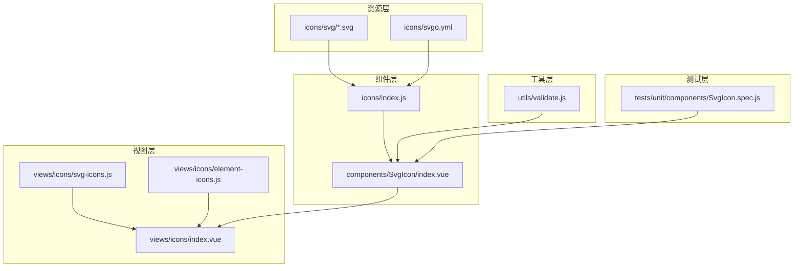
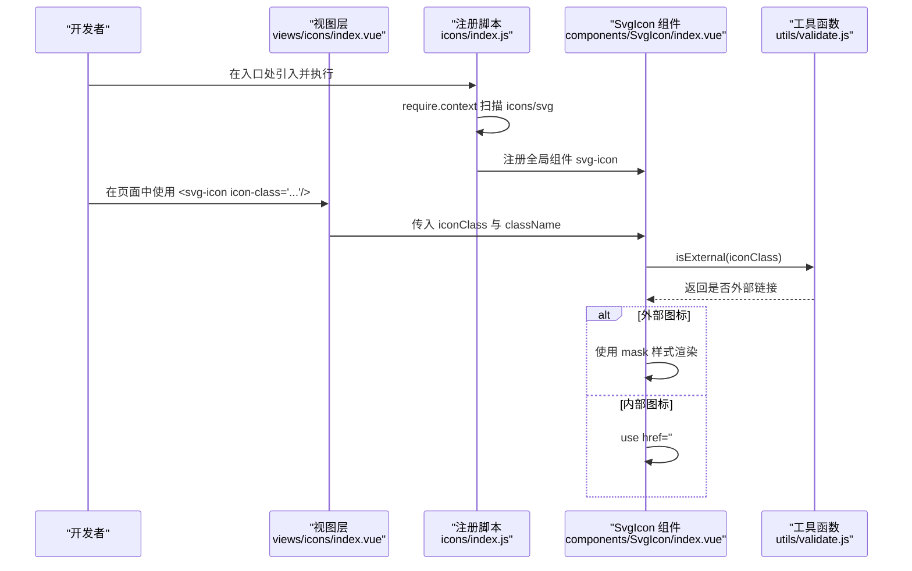
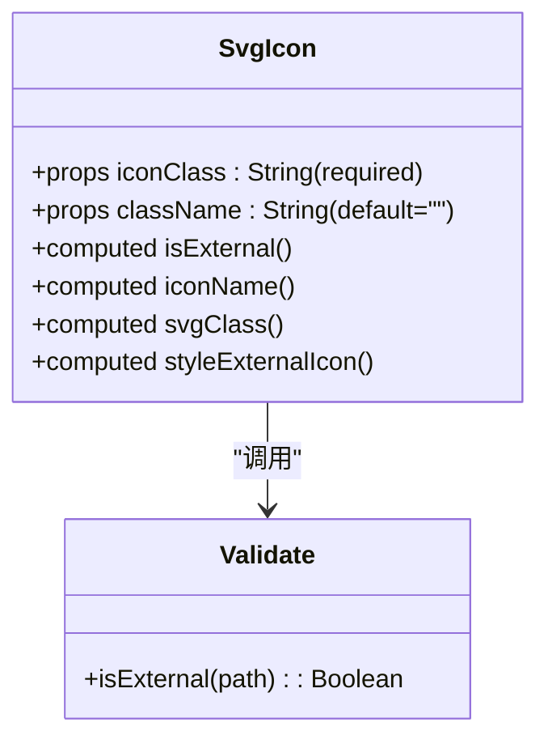
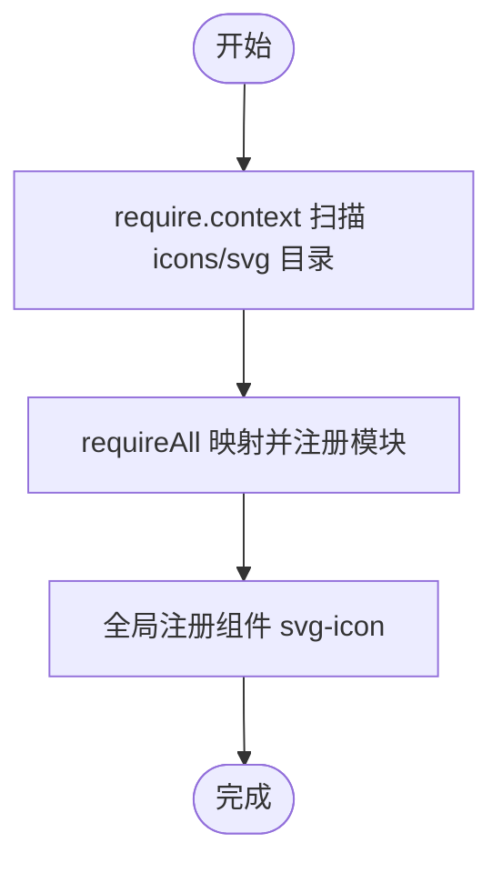
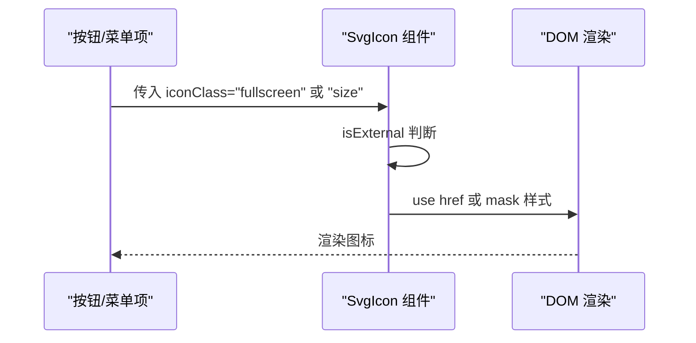
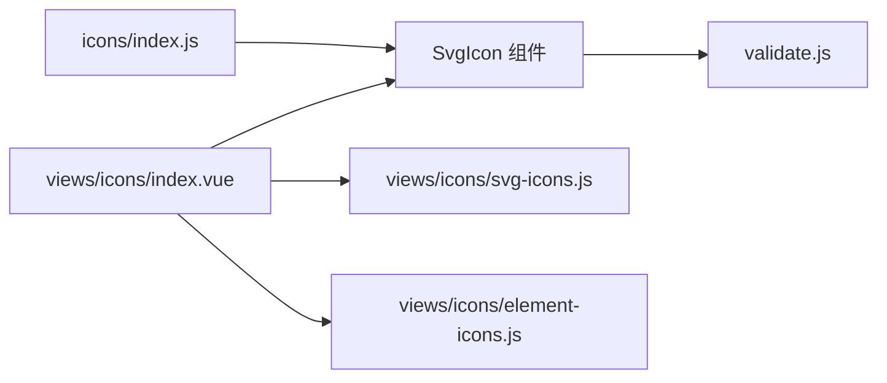

# 图标系统

<cite>
**本文引用的文件**
- [src/components/SvgIcon/index.vue](file://src/components/SvgIcon/index.vue)
- [src/icons/index.js](file://src/icons/index.js)
- [src/icons/svgo.yml](file://src/icons/svgo.yml)
- [src/utils/validate.js](file://src/utils/validate.js)
- [src/views/icons/index.vue](file://src/views/icons/index.vue)
- [src/views/icons/svg-icons.js](file://src/views/icons/svg-icons.js)
- [src/views/icons/element-icons.js](file://src/views/icons/element-icons.js)
- [src/components/Screenfull/index.vue](file://src/components/Screenfull/index.vue)
- [src/components/SizeSelect/index.vue](file://src/components/SizeSelect/index.vue)
- [src/components/HighlightBeautifyCode/index.vue](file://src/components/HighlightBeautifyCode/index.vue)
- [src/components/ErrorLog/index.vue](file://src/components/ErrorLog/index.vue)
- [tests/unit/components/SvgIcon.spec.js](file://tests/unit/components/SvgIcon.spec.js)
</cite>

## 目录
1. [简介](#简介)
2. [项目结构](#项目结构)
3. [核心组件](#核心组件)
4. [架构总览](#架构总览)
5. [详细组件分析](#详细组件分析)
6. [依赖关系分析](#依赖关系分析)
7. [性能考量](#性能考量)
8. [故障排查指南](#故障排查指南)
9. [结论](#结论)
10. [附录](#附录)

## 简介
本文件面向 Leisu Admin 项目的图标系统，聚焦 SVG 图标的集成与使用。内容涵盖：
- SVG 文件的组织结构与命名规范
- 图标文件的优化处理（SVGO 配置）
- SvgIcon 组件的实现原理（注册机制、动态加载、外部图标支持）
- 不同场景下的使用方法（按钮图标、菜单图标、状态图标、操作图标）
- 图标设计规范（尺寸、颜色、视觉一致性）
- 性能优化策略（懒加载、缓存、复用）

## 项目结构
图标系统主要由以下部分组成：
- 组件层：SvgIcon 全局组件，负责渲染内部或外部 SVG
- 资源层：icons/svg 目录存放 SVG 源文件；通过构建时自动扫描注册
- 视图层：图标展示页用于列举与演示可用图标
- 工具层：校验外部链接的工具函数
- 测试层：对 SvgIcon 的行为进行单元测试

**图表来源**
- [src/icons/index.js:1-10](file://src/icons/index.js#L1-L10)
- [src/components/SvgIcon/index.vue:1-63](file://src/components/SvgIcon/index.vue#L1-L63)
- [src/icons/svgo.yml:1-23](file://src/icons/svgo.yml#L1-L23)
- [src/views/icons/index.vue:1-92](file://src/views/icons/index.vue#L1-L92)
- [src/views/icons/svg-icons.js:1-11](file://src/views/icons/svg-icons.js#L1-L11)
- [src/views/icons/element-icons.js:1-76](file://src/views/icons/element-icons.js#L1-L76)
- [src/utils/validate.js:1-88](file://src/utils/validate.js#L1-L88)
- [tests/unit/components/SvgIcon.spec.js:1-23](file://tests/unit/components/SvgIcon.spec.js#L1-L23)

**章节来源**
- [src/icons/index.js:1-10](file://src/icons/index.js#L1-L10)
- [src/components/SvgIcon/index.vue:1-63](file://src/components/SvgIcon/index.vue#L1-L63)
- [src/views/icons/index.vue:1-92](file://src/views/icons/index.vue#L1-L92)
- [src/views/icons/svg-icons.js:1-11](file://src/views/icons/svg-icons.js#L1-L11)
- [src/views/icons/element-icons.js:1-76](file://src/views/icons/element-icons.js#L1-L76)
- [src/icons/svgo.yml:1-23](file://src/icons/svgo.yml#L1-L23)
- [src/utils/validate.js:1-88](file://src/utils/validate.js#L1-L88)
- [tests/unit/components/SvgIcon.spec.js:1-23](file://tests/unit/components/SvgIcon.spec.js#L1-L23)

## 核心组件
- SvgIcon 组件：统一的 SVG 图标渲染器，支持内部图标（基于 use href）与外部图标（CSS mask）
- 图标注册：通过 require.context 扫描 icons/svg 下的 SVG 文件并自动注册为全局组件
- 图标清单：通过 require.context 收集内部图标名称，供视图层展示与剪贴板复制

关键点：
- 属性：iconClass（必填）、className（可选）
- 计算属性：isExternal（判断是否外部链接）、iconName（内部图标 use href）、svgClass（类名拼接）、styleExternalIcon（外部图标 mask 样式）
- 外部图标支持：当 iconClass 以 http/https/mailto/tel 开头时，走 mask 渲染路径
- 内部图标支持：通过 use href 引用本地定义的 symbol

**章节来源**
- [src/components/SvgIcon/index.vue:1-63](file://src/components/SvgIcon/index.vue#L1-L63)
- [src/icons/index.js:1-10](file://src/icons/index.js#L1-L10)
- [src/utils/validate.js:1-88](file://src/utils/validate.js#L1-L88)

## 架构总览
下图展示了从资源到渲染的整体流程，以及图标在不同场景中的使用位置。

**图表来源**
- [src/icons/index.js:1-10](file://src/icons/index.js#L1-L10)
- [src/components/SvgIcon/index.vue:1-63](file://src/components/SvgIcon/index.vue#L1-L63)
- [src/utils/validate.js:1-88](file://src/utils/validate.js#L1-L88)
- [src/views/icons/index.vue:1-92](file://src/views/icons/index.vue#L1-L92)

## 详细组件分析

### SvgIcon 组件
- 功能职责
  - 内部图标：通过 use href 引用本地定义的 symbol
  - 外部图标：通过 mask 样式将任意 URL 背景作为矢量图标渲染
  - 类名扩展：支持通过 className 追加自定义样式
- 关键实现
  - isExternal：基于正则判断是否外部链接
  - iconName：内部图标 use href 的目标符号
  - svgClass/styleExternalIcon：控制类名与 mask 样式
- 样式特性
  - 默认尺寸为 1em × 1em，垂直对齐微调
  - fill 使用 currentColor，便于继承主题色
  - mask 尺寸覆盖，保证外部图标完整显示

**图表来源**
- [src/components/SvgIcon/index.vue:1-63](file://src/components/SvgIcon/index.vue#L1-L63)
- [src/utils/validate.js:1-88](file://src/utils/validate.js#L1-L88)

**章节来源**
- [src/components/SvgIcon/index.vue:1-63](file://src/components/SvgIcon/index.vue#L1-L63)
- [src/utils/validate.js:1-88](file://src/utils/validate.js#L1-L88)

### 图标注册与清单
- 注册机制
  - 通过 require.context('./svg', false, /\.svg$/) 扫描目录
  - requireAll 将所有匹配文件映射为模块，触发构建期打包
  - 全局注册组件名为 svg-icon
- 图标清单
  - views/icons/svg-icons.js 同样使用 require.context 收集图标名称
  - 正则提取文件名作为图标标识，供视图层展示与复制使用

**图表来源**
- [src/icons/index.js:1-10](file://src/icons/index.js#L1-L10)
- [src/views/icons/svg-icons.js:1-11](file://src/views/icons/svg-icons.js#L1-L11)

**章节来源**
- [src/icons/index.js:1-10](file://src/icons/index.js#L1-L10)
- [src/views/icons/svg-icons.js:1-11](file://src/views/icons/svg-icons.js#L1-L11)

### 图标优化配置（SVGO）
- 配置目的：移除 SVG 中固定的 fill 与 fill-rule 属性，使图标颜色可由外部主题控制
- 影响范围：icons/svg 下的 SVG 文件在构建阶段被 SVGO 处理
- 设计意义：确保图标与主题一致，避免硬编码颜色导致的样式冲突

**章节来源**
- [src/icons/svgo.yml:1-23](file://src/icons/svgo.yml#L1-L23)

### 使用场景与示例
- 按钮图标
  - 全屏切换：在 Screenfull 组件中使用 svg-icon 切换图标
  - 尺寸选择：SizeSelect 中使用 svg-icon 展示尺寸选择入口
- 操作图标
  - 剪贴板：HighlightBeautifyCode 中使用 svg-icon 表示复制操作
  - 错误日志：ErrorLog 中使用 svg-icon 表示错误提示
- 菜单图标
  - 侧边栏菜单项通常通过 Element UI 的 icon 属性绑定，但也可结合 SvgIcon 实现自定义图标

**图表来源**
- [src/components/Screenfull/index.vue:1-61](file://src/components/Screenfull/index.vue#L1-L61)
- [src/components/SizeSelect/index.vue:1-58](file://src/components/SizeSelect/index.vue#L1-L58)
- [src/components/SvgIcon/index.vue:1-63](file://src/components/SvgIcon/index.vue#L1-L63)

**章节来源**
- [src/components/Screenfull/index.vue:1-61](file://src/components/Screenfull/index.vue#L1-L61)
- [src/components/SizeSelect/index.vue:1-58](file://src/components/SizeSelect/index.vue#L1-L58)
- [src/components/HighlightBeautifyCode/index.vue](file://src/components/HighlightBeautifyCode/index.vue)
- [src/components/ErrorLog/index.vue](file://src/components/ErrorLog/index.vue)
- [src/components/SvgIcon/index.vue:1-63](file://src/components/SvgIcon/index.vue#L1-L63)

## 依赖关系分析
- 组件耦合
  - SvgIcon 仅依赖 utils/validate.js 的 isExternal 方法
  - 注册脚本依赖构建时 require.context 机制
- 外部依赖
  - Element UI 的图标（element-icons.js）与 SvgIcon 并行存在，用于通用 UI 场景
- 可能的循环依赖
  - 当前结构无循环依赖风险

**图表来源**
- [src/components/SvgIcon/index.vue:1-63](file://src/components/SvgIcon/index.vue#L1-L63)
- [src/icons/index.js:1-10](file://src/icons/index.js#L1-L10)
- [src/views/icons/index.vue:1-92](file://src/views/icons/index.vue#L1-L92)
- [src/views/icons/svg-icons.js:1-11](file://src/views/icons/svg-icons.js#L1-L11)
- [src/views/icons/element-icons.js:1-76](file://src/views/icons/element-icons.js#L1-L76)
- [src/utils/validate.js:1-88](file://src/utils/validate.js#L1-L88)

**章节来源**
- [src/components/SvgIcon/index.vue:1-63](file://src/components/SvgIcon/index.vue#L1-L63)
- [src/icons/index.js:1-10](file://src/icons/index.js#L1-L10)
- [src/views/icons/index.vue:1-92](file://src/views/icons/index.vue#L1-L92)
- [src/views/icons/svg-icons.js:1-11](file://src/views/icons/svg-icons.js#L1-L11)
- [src/views/icons/element-icons.js:1-76](file://src/views/icons/element-icons.js#L1-L76)
- [src/utils/validate.js:1-88](file://src/utils/validate.js#L1-L88)

## 性能考量
- 构建期注册
  - 通过 require.context 在构建阶段一次性收集并打包 SVG，减少运行时开销
- 外部图标渲染
  - 外部图标采用 mask 方案，避免额外请求与 DOM 结构复杂化
- 图标尺寸与颜色
  - 1em 尺寸与 currentColor 使图标可随主题缩放与着色，降低重复样式体积
- 优化建议
  - 使用 SVGO 移除固定填充属性，确保颜色可继承
  - 对于高频使用的图标，优先使用内部 symbol 引用，减少 mask 渲染成本
  - 在大量图标场景下，考虑按需加载或分包策略（视路由拆分情况而定）

**章节来源**
- [src/icons/index.js:1-10](file://src/icons/index.js#L1-L10)
- [src/icons/svgo.yml:1-23](file://src/icons/svgo.yml#L1-L23)
- [src/components/SvgIcon/index.vue:1-63](file://src/components/SvgIcon/index.vue#L1-L63)

## 故障排查指南
- 常见问题
  - 图标不显示
    - 检查 iconClass 是否与 icons/svg 下文件名一致（不含扩展名）
    - 若为外部图标，请确认 URL 可访问且符合 isExternal 判定
  - 颜色异常
    - 确认 SVG 中未硬编码 fill/fill-rule，SVGO 已移除
    - 检查父级容器是否正确设置 color 或主题色
  - 样式错位
    - 确保使用默认类名或在 className 中追加必要的样式
- 单元测试参考
  - 测试 use href 生成与类名拼接逻辑，可作为行为验证依据

**章节来源**
- [src/components/SvgIcon/index.vue:1-63](file://src/components/SvgIcon/index.vue#L1-L63)
- [src/utils/validate.js:1-88](file://src/utils/validate.js#L1-L88)
- [tests/unit/components/SvgIcon.spec.js:1-23](file://tests/unit/components/SvgIcon.spec.js#L1-L23)

## 结论
Leisu Admin 的图标系统以 SvgIcon 为核心，结合构建期自动注册与 SVGO 优化，实现了高内聚、低耦合、易维护的图标体系。通过统一的渲染接口与清晰的命名规范，开发者可在多种场景中快速、一致地使用图标，并获得良好的性能表现。

## 附录

### 图标文件组织与命名规范
- 存放位置：icons/svg
- 命名规则：建议使用语义化英文小写短横线分隔（如 arrow-left.svg），与 views/icons/svg-icons.js 提取的名称保持一致
- 优化策略：交由 SVGO 自动移除固定填充属性，确保颜色可继承

**章节来源**
- [src/icons/index.js:1-10](file://src/icons/index.js#L1-L10)
- [src/views/icons/svg-icons.js:1-11](file://src/views/icons/svg-icons.js#L1-L11)
- [src/icons/svgo.yml:1-23](file://src/icons/svgo.yml#L1-L23)

### 设计规范与最佳实践
- 尺寸：默认 1em，可通过 className 调整
- 颜色：使用 currentColor，确保与主题一致
- 视觉一致性：同一功能使用相同图标风格，避免混用外部与内部图标造成视觉割裂
- 可访问性：为图标添加 aria-hidden="true"，避免重复语义

**章节来源**
- [src/components/SvgIcon/index.vue:1-63](file://src/components/SvgIcon/index.vue#L1-L63)