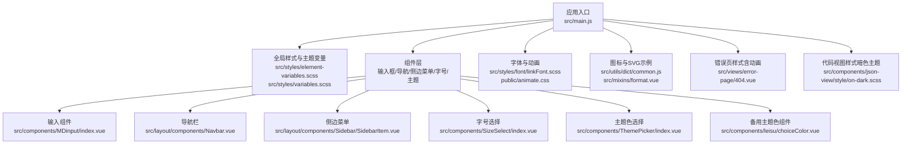
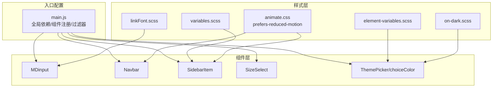
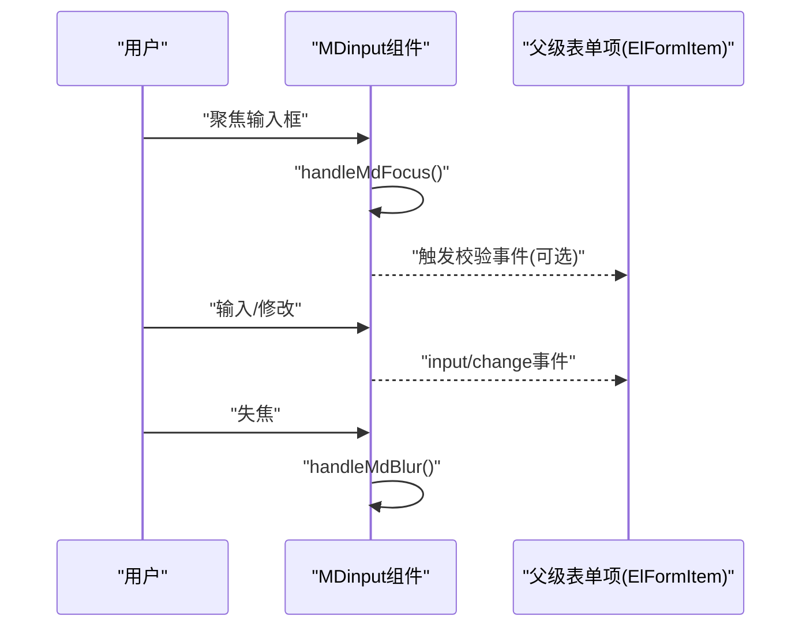
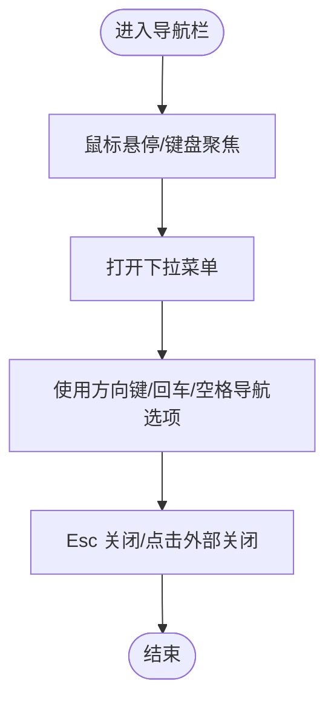
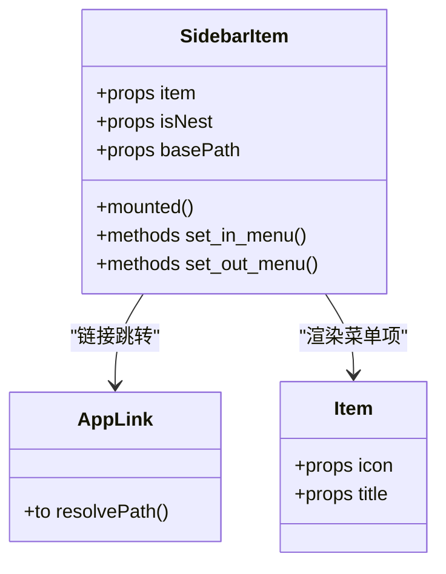
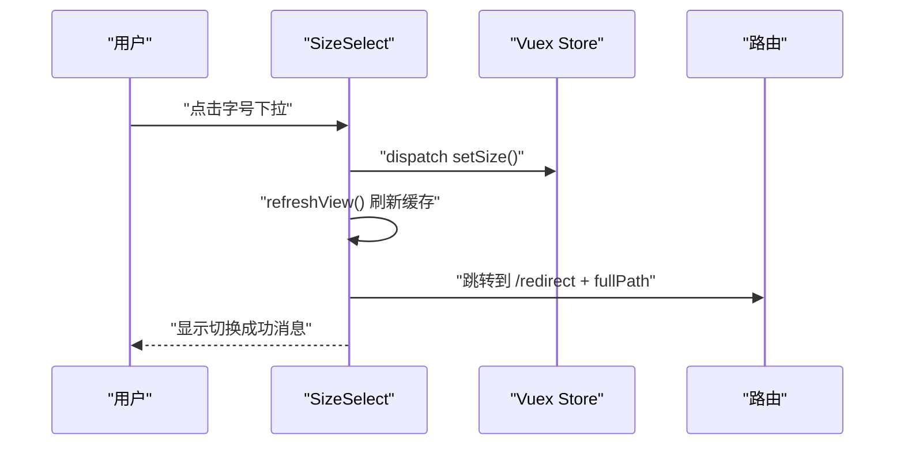
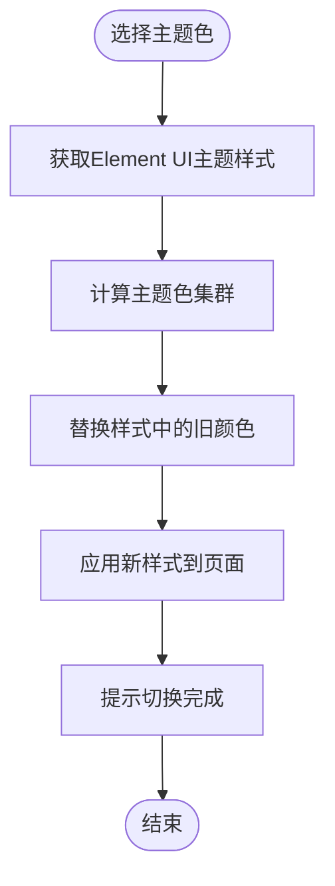
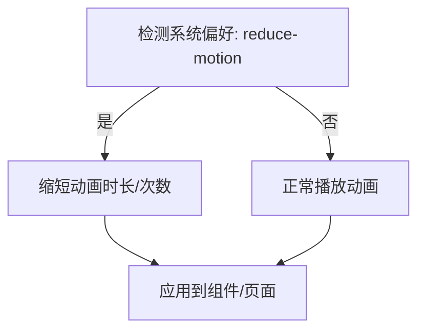
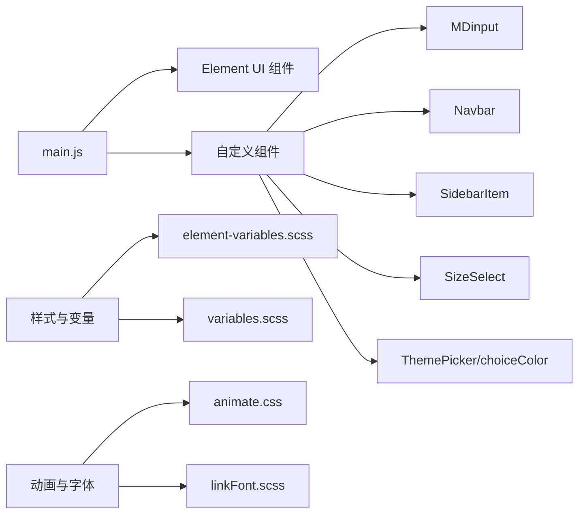

# 无障碍设计

<cite>
**本文引用的文件**
- [src/main.js](file://src/main.js)
- [src/styles/element-variables.scss](file://src/styles/element-variables.scss)
- [src/styles/variables.scss](file://src/styles/variables.scss)
- [src/components/MDinput/index.vue](file://src/components/MDinput/index.vue)
- [src/layout/components/Navbar.vue](file://src/layout/components/Navbar.vue)
- [src/layout/components/Sidebar/SidebarItem.vue](file://src/layout/components/Sidebar/SidebarItem.vue)
- [src/components/SizeSelect/index.vue](file://src/components/SizeSelect/index.vue)
- [src/components/ThemePicker/index.vue](file://src/components/ThemePicker/index.vue)
- [src/components/leisu/choiceColor.vue](file://src/components/leisu/choiceColor.vue)
- [src/styles/font/linkFont.scss](file://src/styles/font/linkFont.scss)
- [src/utils/aliplayer-components.js](file://src/utils/aliplayer-components.js)
- [public/animate.css](file://public/animate.css)
- [src/utils/dict/common.js](file://src/utils/dict/common.js)
- [src/mixins/format.vue](file://src/mixins/format.vue)
- [src/views/error-page/404.vue](file://src/views/error-page/404.vue)
- [src/components/json-view/style/on-dark.scss](file://src/components/json-view/style/on-dark.scss)
</cite>

## 目录
1. [简介](#简介)
2. [项目结构](#项目结构)
3. [核心组件](#核心组件)
4. [架构总览](#架构总览)
5. [详细组件分析](#详细组件分析)
6. [依赖分析](#依赖分析)
7. [性能考量](#性能考量)
8. [故障排查指南](#故障排查指南)
9. [结论](#结论)
10. [附录](#附录)

## 简介
本文件面向 Leisu Admin 项目的无障碍设计，系统梳理并落地 Web 内容无障碍指南（WCAG）相关要求，覆盖颜色对比度、字体大小、键盘导航、焦点管理、快捷键、屏幕阅读器兼容、高对比度模式、色盲友好设计、缩放支持、动画控制等主题，并提供可操作的测试方法与合规性检查清单，帮助团队在开发流程中持续提升可访问性质量。

## 项目结构
从可访问性视角审视，项目的关键入口与通用样式位于以下位置：
- 应用入口与全局依赖注入：[src/main.js](file://src/main.js)
- Element UI 主题变量与全局样式：[src/styles/element-variables.scss](file://src/styles/element-variables.scss)、[src/styles/variables.scss](file://src/styles/variables.scss)
- 可访问性相关组件与交互：输入框组件、导航栏、侧边菜单、字号选择、主题色选择等
- 字体与动画：字体声明、动画库与媒体查询中的“减少动画”策略
- 图标与 SVG：图标组件与 SVG 的可访问属性示例

**图表来源**
- [src/main.js:1-526](file://src/main.js#L1-L526)
- [src/styles/element-variables.scss:1-32](file://src/styles/element-variables.scss#L1-L32)
- [src/styles/variables.scss:1-36](file://src/styles/variables.scss#L1-L36)
- [src/components/MDinput/index.vue:1-179](file://src/components/MDinput/index.vue#L1-L179)
- [src/layout/components/Navbar.vue:1-148](file://src/layout/components/Navbar.vue#L1-L148)
- [src/layout/components/Sidebar/SidebarItem.vue:1-206](file://src/layout/components/Sidebar/SidebarItem.vue#L1-L206)
- [src/components/SizeSelect/index.vue:1-58](file://src/components/SizeSelect/index.vue#L1-L58)
- [src/components/ThemePicker/index.vue:1-175](file://src/components/ThemePicker/index.vue#L1-L175)
- [src/components/leisu/choiceColor.vue:1-205](file://src/components/leisu/choiceColor.vue#L1-L205)
- [src/styles/font/linkFont.scss:1-16](file://src/styles/font/linkFont.scss#L1-L16)
- [public/animate.css:3139-3700](file://public/animate.css#L3139-L3700)
- [src/utils/dict/common.js:1-11](file://src/utils/dict/common.js#L1-L11)
- [src/mixins/format.vue:93-101](file://src/mixins/format.vue#L93-L101)
- [src/views/error-page/404.vue:157-228](file://src/views/error-page/404.vue#L157-L228)
- [src/components/json-view/style/on-dark.scss:1-56](file://src/components/json-view/style/on-dark.scss#L1-L56)

**章节来源**
- [src/main.js:1-526](file://src/main.js#L1-L526)
- [src/styles/element-variables.scss:1-32](file://src/styles/element-variables.scss#L1-L32)
- [src/styles/variables.scss:1-36](file://src/styles/variables.scss#L1-L36)

## 核心组件
- 输入组件（MDinput）：提供多种输入类型与可访问属性绑定，支持聚焦/失焦回调与表单校验联动，便于键盘导航与屏幕阅读器读取。
- 导航栏（Navbar）：包含下拉菜单与用户头像区域，具备基础的键盘可达性与焦点管理。
- 侧边菜单（SidebarItem）：多级菜单结构，支持嵌套与收藏功能，需关注焦点可见性与键盘切换。
- 字号选择（SizeSelect）：通过 Element UI 下拉组件实现字号切换，配合缓存刷新确保可访问性变更生效。
- 主题色选择（ThemePicker/choiceColor）：动态生成主题色系，需注意颜色对比度与高对比度模式下的可读性。
- 动画与字体：动画库提供“减少动画”媒体查询；字体声明确保可缩放与可读性。

**章节来源**
- [src/components/MDinput/index.vue:1-179](file://src/components/MDinput/index.vue#L1-L179)
- [src/layout/components/Navbar.vue:1-148](file://src/layout/components/Navbar.vue#L1-L148)
- [src/layout/components/Sidebar/SidebarItem.vue:1-206](file://src/layout/components/Sidebar/SidebarItem.vue#L1-L206)
- [src/components/SizeSelect/index.vue:1-58](file://src/components/SizeSelect/index.vue#L1-L58)
- [src/components/ThemePicker/index.vue:1-175](file://src/components/ThemePicker/index.vue#L1-L175)
- [src/components/leisu/choiceColor.vue:1-205](file://src/components/leisu/choiceColor.vue#L1-L205)
- [public/animate.css:3618-3628](file://public/animate.css#L3618-L3628)
- [src/styles/font/linkFont.scss:1-16](file://src/styles/font/linkFont.scss#L1-L16)

## 架构总览
从可访问性角度，系统通过“入口配置 + 组件层 + 样式层”的方式实现可访问性能力：
- 入口配置：引入 Element UI、全局样式与图标，注册自定义组件，为可访问性提供基础环境。
- 组件层：围绕输入、导航、菜单、字号、主题等关键交互，落实键盘可达、焦点管理、语义化标签与对比度保障。
- 样式层：主题变量、字体声明、动画媒体查询与暗色主题样式，支撑高对比度与缩放需求。

**图表来源**
- [src/main.js:1-526](file://src/main.js#L1-L526)
- [src/styles/element-variables.scss:1-32](file://src/styles/element-variables.scss#L1-L32)
- [src/styles/variables.scss:1-36](file://src/styles/variables.scss#L1-L36)
- [src/styles/font/linkFont.scss:1-16](file://src/styles/font/linkFont.scss#L1-L16)
- [public/animate.css:3618-3628](file://public/animate.css#L3618-L3628)
- [src/components/json-view/style/on-dark.scss:1-56](file://src/components/json-view/style/on-dark.scss#L1-L56)

## 详细组件分析

### 输入组件（MDinput）可访问性要点
- 语义化输入类型与属性：支持 email/url/password/tel/text/number 等类型，绑定 required、autocomplete、min/max/maxlength 等属性，便于屏幕阅读器识别与表单校验。
- 焦点管理：提供 focus/blur 回调，结合 Element 表单项使用时，触发表单校验事件，保证键盘用户与自动朗读设备能感知状态变化。
- 标签与占位符：通过插槽作为 label，确保屏幕阅读器可读取标题文本。

**图表来源**
- [src/components/MDinput/index.vue:112-179](file://src/components/MDinput/index.vue#L112-L179)

**章节来源**
- [src/components/MDinput/index.vue:1-179](file://src/components/MDinput/index.vue#L1-L179)

### 导航栏（Navbar）可访问性要点
- 下拉菜单触发：使用 Element UI 下拉组件，具备默认键盘可达性（Enter/Space 打开、Esc 关闭、方向键导航）。
- 焦点管理：容器与图标元素具备 hover 与 focus 样式，避免仅依赖颜色指示焦点。
- 用户头像：图片资源具备替代文本语义，便于屏幕阅读器描述。

**图表来源**
- [src/layout/components/Navbar.vue:1-148](file://src/layout/components/Navbar.vue#L1-L148)

**章节来源**
- [src/layout/components/Navbar.vue:1-148](file://src/layout/components/Navbar.vue#L1-L148)

### 侧边菜单（SidebarItem）可访问性要点
- 多级菜单：使用 El Submenu 与 Item 组合，确保标题语义化与键盘可达。
- 收藏功能：星标图标具备点击行为，建议为图标添加 aria-label 或隐藏文本，明确其功能。
- iOS 适配：混入 FixiOSBug，减少触摸与点击差异带来的可访问性问题。

**图表来源**
- [src/layout/components/Sidebar/SidebarItem.vue:55-206](file://src/layout/components/Sidebar/SidebarItem.vue#L55-L206)

**章节来源**
- [src/layout/components/Sidebar/SidebarItem.vue:1-206](file://src/layout/components/Sidebar/SidebarItem.vue#L1-L206)

### 字号选择（SizeSelect）可访问性要点
- 使用 Element UI 下拉组件，提供“Default/Medium/Small/Mini”四档字号，切换后刷新缓存页面以确保可读性变更立即生效。
- 键盘可达：Tab 顺序合理，下拉菜单支持 Esc 关闭与方向键导航。

**图表来源**
- [src/components/SizeSelect/index.vue:15-58](file://src/components/SizeSelect/index.vue#L15-L58)

**章节来源**
- [src/components/SizeSelect/index.vue:1-58](file://src/components/SizeSelect/index.vue#L1-L58)

### 主题色选择（ThemePicker/choiceColor）可访问性要点
- 动态主题编译：通过请求 Element UI 主题样式并替换颜色变量，实现主题切换。
- 对比度与高对比度：建议在高对比度模式下提供额外对比度保障，避免浅色文字在深色背景上不可读。
- 颜色集群计算：通过色调与阴影函数生成主题色系，需确保关键状态（成功/警告/危险）具备足够对比度。

**图表来源**
- [src/components/ThemePicker/index.vue:14-175](file://src/components/ThemePicker/index.vue#L14-L175)
- [src/components/leisu/choiceColor.vue:34-205](file://src/components/leisu/choiceColor.vue#L34-L205)

**章节来源**
- [src/components/ThemePicker/index.vue:1-175](file://src/components/ThemePicker/index.vue#L1-L175)
- [src/components/leisu/choiceColor.vue:1-205](file://src/components/leisu/choiceColor.vue#L1-L205)

### 动画与字体（animate.css、linkFont.scss）
- 减少动画：媒体查询 prefers-reduced-motion 将动画时长与迭代次数降至最小，满足对运动敏感用户的可访问性需求。
- 字体声明：通过 @font-face 引入本地字体，确保在不同系统与缩放比例下保持可读性与稳定性。

**图表来源**
- [public/animate.css:3618-3628](file://public/animate.css#L3618-L3628)

**章节来源**
- [public/animate.css:3139-3700](file://public/animate.css#L3139-L3700)
- [src/styles/font/linkFont.scss:1-16](file://src/styles/font/linkFont.scss#L1-L16)

### 图标与 SVG（common.js、format.vue）
- SVG 可访问性：图标使用 fill="currentColor"、aria-hidden="true"、focusable="false"，避免干扰屏幕阅读器。
- 混入与字典：通过混入与字典集中管理图标字符串，便于统一维护与扩展。

**章节来源**
- [src/utils/dict/common.js:1-11](file://src/utils/dict/common.js#L1-L11)
- [src/mixins/format.vue:93-101](file://src/mixins/format.vue#L93-L101)

### 错误页样式（404.vue）
- 动画与可读性：页面包含滑入动画，建议在 reduce-motion 模式下禁用或降低动画强度，确保信息优先级。

**章节来源**
- [src/views/error-page/404.vue:157-228](file://src/views/error-page/404.vue#L157-L228)

## 依赖分析
- Element UI：提供基础 UI 组件与可访问性能力（下拉、菜单、表单等），主题变量用于统一风格与对比度。
- 自定义组件：MDinput、Navbar、SidebarItem、SizeSelect、ThemePicker/choiceColor 等围绕可访问性进行封装与增强。
- 样式与动画：主题变量、字体声明、动画媒体查询与暗色主题样式共同构成可访问性基础设施。

**图表来源**
- [src/main.js:1-526](file://src/main.js#L1-L526)
- [src/styles/element-variables.scss:1-32](file://src/styles/element-variables.scss#L1-L32)
- [src/styles/variables.scss:1-36](file://src/styles/variables.scss#L1-L36)
- [public/animate.css:3618-3628](file://public/animate.css#L3618-L3628)
- [src/styles/font/linkFont.scss:1-16](file://src/styles/font/linkFont.scss#L1-L16)

**章节来源**
- [src/main.js:1-526](file://src/main.js#L1-L526)

## 性能考量
- 主题切换性能：动态样式替换涉及大量字符串替换与 DOM 注入，建议在低性能设备上限制刷新频率与批量更新。
- 动画性能：减少动画与使用硬件加速属性（transform/opacity）可降低重排与重绘成本。
- 字体加载：本地字体可减少网络抖动对可读性的影响，但需注意首屏加载时间。

## 故障排查指南
- 焦点可见性问题：检查导航栏与菜单的 focus 样式是否生效，确保键盘用户能清晰定位当前焦点。
- 对比度不足：使用主题切换后，重点核对主/次文字与背景的对比度，必要时调整主题变量或补充高对比度模式。
- 动画干扰：若用户启用 reduce-motion，确认动画被正确降级，避免眩晕或注意力分散。
- 屏幕阅读器体验：为图标与装饰性元素添加 aria-hidden/focusable=false，确保读屏器只朗读有意义的内容。

**章节来源**
- [src/layout/components/Navbar.vue:100-120](file://src/layout/components/Navbar.vue#L100-L120)
- [src/layout/components/Sidebar/SidebarItem.vue:1-206](file://src/layout/components/Sidebar/SidebarItem.vue#L1-L206)
- [public/animate.css:3618-3628](file://public/animate.css#L3618-L3628)

## 结论
Leisu Admin 已在入口配置、组件封装与样式层面打下良好的可访问性基础。后续可在以下方面持续优化：强化键盘导航与焦点管理、完善高对比度与色盲友好设计、严格把控颜色对比度、在 reduce-motion 模式下提供更佳体验，并建立可重复的可访问性测试流程与合规性检查机制。

## 附录

### WCAG 实施要点（摘要）
- 颜色对比度：文本与背景对比度至少 4.5:1，关键状态与交互元素应高于 3:1。
- 字体大小与缩放：使用相对单位与 @font-face 字体，支持 200% 缩放不截断。
- 键盘导航：Tab 顺序符合逻辑，支持 Enter/Space/方向键操作，Esc 关闭弹窗。
- 屏幕阅读器：语义化标签与 aria 属性齐全，装饰性元素屏蔽读屏器。
- 动画控制：尊重 reduce-motion 偏好，提供关闭或减速选项。

### 无障碍测试方法与工具
- 自动化测试：使用 axe-core、Lighthouse、Pa11y 等工具扫描可访问性问题。
- 手动测试：键盘独行测试、屏幕阅读器（NVDA/JAWS/VoiceOver）测试、高对比度模式测试。
- 辅助技术测试：模拟运动敏感、色觉缺陷、认知障碍等场景，验证可用性。

### 合规性检查清单（摘录）
- [ ] 所有表单控件具备可读标签
- [ ] 所有图片具备替代文本或 aria-label
- [ ] 颜色传达的信息可通过非颜色方式表达
- [ ] 对比度满足 WCAG AA/AAA 要求
- [ ] 页面可 200% 缩放且无截断
- [ ] 键盘可完全操控所有功能
- [ ] reduce-motion 模式下动画可降级
- [ ] 下拉菜单与弹窗具备 Esc 关闭
- [ ] 焦点可见且逻辑清晰