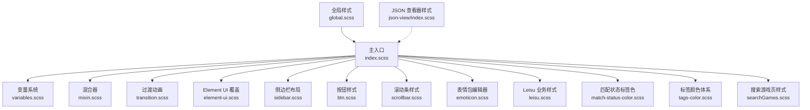
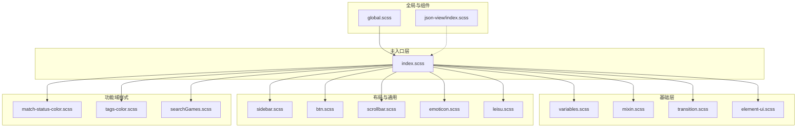
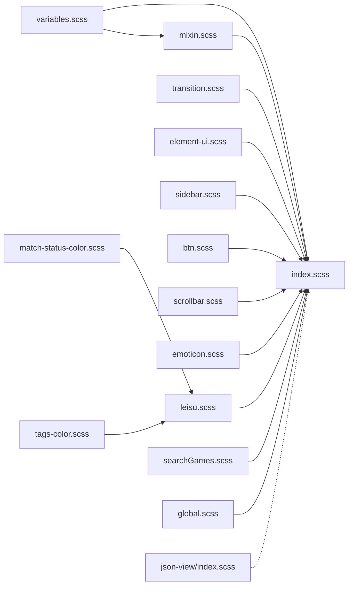

# 样式架构

<cite>
**本文引用的文件**
- [src/styles/index.scss](file://src/styles/index.scss)
- [src/styles/variables.scss](file://src/styles/variables.scss)
- [src/styles/mixin.scss](file://src/styles/mixin.scss)
- [src/styles/transition.scss](file://src/styles/transition.scss)
- [src/styles/element-ui.scss](file://src/styles/element-ui.scss)
- [src/styles/sidebar.scss](file://src/styles/sidebar.scss)
- [src/styles/btn.scss](file://src/styles/btn.scss)
- [src/styles/scrollbar.scss](file://src/styles/scrollbar.scss)
- [src/styles/emoticon.scss](file://src/styles/emoticon.scss)
- [src/styles/leisu.scss](file://src/styles/leisu.scss)
- [src/styles/match-status-color.scss](file://src/styles/match-status-color.scss)
- [src/styles/tags-color.scss](file://src/styles/tags-color.scss)
- [src/styles/searchGames.scss](file://src/styles/searchGames.scss)
- [src/assets/styles/global.scss](file://src/assets/styles/global.scss)
- [src/components/json-view/style/index.scss](file://src/components/json-view/style/index.scss)
</cite>

## 目录
1. [引言](#引言)
2. [项目结构](#项目结构)
3. [核心组件](#核心组件)
4. [架构总览](#架构总览)
5. [详细组件分析](#详细组件分析)
6. [依赖分析](#依赖分析)
7. [性能考虑](#性能考虑)
8. [故障排查指南](#故障排查指南)
9. [结论](#结论)
10. [附录](#附录)

## 引言
本文件面向 Leisu Admin 项目的样式架构，系统梳理 SCSS 模块化设计与组织原则，覆盖主入口文件的导入结构、变量系统、混合器（mixin）、样式模块职责划分（基础样式、组件样式、布局样式、工具类样式）、命名规范与 BEM 方法论应用，并提供调试技巧与性能优化建议。目标是帮助开发者快速理解与维护样式体系。

## 项目结构
样式系统采用“主入口集中导入 + 模块化拆分”的组织方式：主入口 index.scss 统一引入变量、混合器、过渡动画、第三方主题覆盖、布局与通用工具样式；各功能域通过独立 scss 文件进行模块化管理，确保职责清晰、可维护性强。

图表来源
- [src/styles/index.scss:1-311](file://src/styles/index.scss#L1-L311)
- [src/styles/variables.scss:1-36](file://src/styles/variables.scss#L1-L36)
- [src/styles/mixin.scss:1-88](file://src/styles/mixin.scss#L1-L88)
- [src/styles/transition.scss:1-49](file://src/styles/transition.scss#L1-L49)
- [src/styles/element-ui.scss:1-86](file://src/styles/element-ui.scss#L1-L86)
- [src/styles/sidebar.scss:1-210](file://src/styles/sidebar.scss#L1-L210)
- [src/styles/btn.scss:1-111](file://src/styles/btn.scss#L1-L111)
- [src/styles/scrollbar.scss:1-41](file://src/styles/scrollbar.scss#L1-L41)
- [src/styles/emoticon.scss:1-91](file://src/styles/emoticon.scss#L1-L91)
- [src/styles/leisu.scss:1-478](file://src/styles/leisu.scss#L1-L478)
- [src/styles/match-status-color.scss:1-62](file://src/styles/match-status-color.scss#L1-L62)
- [src/styles/tags-color.scss:1-76](file://src/styles/tags-color.scss#L1-L76)
- [src/styles/searchGames.scss:1-80](file://src/styles/searchGames.scss#L1-L80)
- [src/assets/styles/global.scss:1-28](file://src/assets/styles/global.scss#L1-L28)
- [src/components/json-view/style/index.scss:1-100](file://src/components/json-view/style/index.scss#L1-L100)

章节来源
- [src/styles/index.scss:1-311](file://src/styles/index.scss#L1-L311)

## 核心组件
- 主入口与导入顺序
  - 变量与混合器优先，保证后续样式复用其定义。
  - Element UI 覆盖与过渡动画紧随其后，确保全局一致性。
  - 布局与通用工具样式（侧边栏、按钮、滚动条、表情包等）随后引入，形成“基础层”。
  - 全局样式与组件级样式作为补充，避免相互覆盖冲突。
- 变量系统
  - 定义品牌色、菜单与子菜单配色、侧边栏宽度等基础变量，并通过导出机制供 JS 使用。
- 混合器系统
  - 提供清除浮动、滚动条统一、相对定位、百分比宽度、三角形、禁选文本、表格单元格高度约束等常用片段。
- 过渡动画
  - 提供淡入淡出、位移过渡、面包屑过渡等全局动画类，便于路由切换与交互过渡。
- Element UI 覆盖
  - 修复上传、对话框、下拉菜单、日期选择器等组件的显示问题，统一风格。
- 布局与工具
  - 侧边栏宽度与折叠行为、按钮色彩体系、滚动条统一、表情包编辑器样式、Leisu 业务样式、标签色与匹配状态色、搜索游戏页样式等。

章节来源
- [src/styles/index.scss:1-311](file://src/styles/index.scss#L1-L311)
- [src/styles/variables.scss:1-36](file://src/styles/variables.scss#L1-L36)
- [src/styles/mixin.scss:1-88](file://src/styles/mixin.scss#L1-L88)
- [src/styles/transition.scss:1-49](file://src/styles/transition.scss#L1-L49)
- [src/styles/element-ui.scss:1-86](file://src/styles/element-ui.scss#L1-L86)
- [src/styles/sidebar.scss:1-210](file://src/styles/sidebar.scss#L1-L210)
- [src/styles/btn.scss:1-111](file://src/styles/btn.scss#L1-L111)
- [src/styles/scrollbar.scss:1-41](file://src/styles/scrollbar.scss#L1-L41)
- [src/styles/emoticon.scss:1-91](file://src/styles/emoticon.scss#L1-L91)
- [src/styles/leisu.scss:1-478](file://src/styles/leisu.scss#L1-L478)
- [src/styles/match-status-color.scss:1-62](file://src/styles/match-status-color.scss#L1-L62)
- [src/styles/tags-color.scss:1-76](file://src/styles/tags-color.scss#L1-L76)
- [src/styles/searchGames.scss:1-80](file://src/styles/searchGames.scss#L1-L80)
- [src/assets/styles/global.scss:1-28](file://src/assets/styles/global.scss#L1-L28)
- [src/components/json-view/style/index.scss:1-100](file://src/components/json-view/style/index.scss#L1-L100)

## 架构总览
样式架构遵循“主入口集中导入 + 模块化职责分离”的设计，确保：
- 可维护性：每个模块职责单一，便于扩展与修改。
- 可复用性：变量与混合器在多处共享，减少重复代码。
- 可移植性：通过导出变量供 JS 使用，实现样式与脚本的一致性。
- 可扩展性：新增样式模块只需在主入口注册导入顺序，避免破坏既有结构。

图表来源
- [src/styles/index.scss:1-311](file://src/styles/index.scss#L1-L311)
- [src/styles/variables.scss:1-36](file://src/styles/variables.scss#L1-L36)
- [src/styles/mixin.scss:1-88](file://src/styles/mixin.scss#L1-L88)
- [src/styles/transition.scss:1-49](file://src/styles/transition.scss#L1-L49)
- [src/styles/element-ui.scss:1-86](file://src/styles/element-ui.scss#L1-L86)
- [src/styles/sidebar.scss:1-210](file://src/styles/sidebar.scss#L1-L210)
- [src/styles/btn.scss:1-111](file://src/styles/btn.scss#L1-L111)
- [src/styles/scrollbar.scss:1-41](file://src/styles/scrollbar.scss#L1-L41)
- [src/styles/emoticon.scss:1-91](file://src/styles/emoticon.scss#L1-L91)
- [src/styles/leisu.scss:1-478](file://src/styles/leisu.scss#L1-L478)
- [src/styles/match-status-color.scss:1-62](file://src/styles/match-status-color.scss#L1-L62)
- [src/styles/tags-color.scss:1-76](file://src/styles/tags-color.scss#L1-L76)
- [src/styles/searchGames.scss:1-80](file://src/styles/searchGames.scss#L1-L80)
- [src/assets/styles/global.scss:1-28](file://src/assets/styles/global.scss#L1-L28)
- [src/components/json-view/style/index.scss:1-100](file://src/components/json-view/style/index.scss#L1-L100)

## 详细组件分析

### 主入口与导入结构
- 导入顺序严格控制依赖链：先变量与混合器，再第三方覆盖与过渡动画，最后布局与通用工具样式，确保变量与混合器在使用前可用。
- 在主入口中统一声明基础排版、链接、容器、工具类与滚动条策略，形成全局一致的视觉与交互基线。
- 对 Element UI 的滚动条、对话框、下拉菜单、日期选择器等进行针对性覆盖，提升可读性与一致性。

章节来源
- [src/styles/index.scss:1-311](file://src/styles/index.scss#L1-L311)
- [src/styles/element-ui.scss:1-86](file://src/styles/element-ui.scss#L1-L86)

### 变量系统
- 颜色变量：品牌主色、辅助色、菜单与子菜单文本/背景/悬停色、侧边栏宽度等。
- 导出机制：通过特定指令将变量导出为 JS 可用，便于运行时主题切换或动态配置。
- 使用规范：所有样式应优先引用变量而非硬编码值，保证主题一致性与可维护性。

章节来源
- [src/styles/variables.scss:1-36](file://src/styles/variables.scss#L1-L36)

### 混合器（Mixin）
- 清除浮动与相对定位：提供通用布局片段，减少重复代码。
- 滚动条统一：统一滚动条尺寸、圆角、颜色，适配多容器场景。
- 百分比宽度与三角形：便捷生成常见布局与装饰元素。
- 禁选文本：跨浏览器禁用文本选择。
- 表格单元格高度约束：限制单元格最大高度并处理固定列溢出，提升表格可读性。

章节来源
- [src/styles/mixin.scss:1-88](file://src/styles/mixin.scss#L1-L88)

### 过渡动画
- 提供淡入淡出、位移过渡、面包屑过渡等动画类，配合路由切换与弹窗展示，提升用户体验。
- 动画参数（时长、缓动）集中管理，便于统一风格与性能调优。

章节来源
- [src/styles/transition.scss:1-49](file://src/styles/transition.scss#L1-L49)

### Element UI 覆盖
- 上传组件隐藏原生输入、统一拖拽区尺寸。
- 对话框居中与定位修正，避免层级与偏移问题。
- 下拉菜单项块级显示，日期选择器在筛选容器内正确渲染。
- 表格合并边框高亮、小尺寸单元格间距优化。

章节来源
- [src/styles/element-ui.scss:1-86](file://src/styles/element-ui.scss#L1-L86)

### 侧边栏布局
- 侧边栏宽度由变量控制，支持折叠与移动端收起动画。
- 菜单文本/背景/悬停色与子菜单层级配色统一，滚动条适配。
- 折叠模式下的图标与文字显示策略，保证信息密度与可读性。

章节来源
- [src/styles/sidebar.scss:1-210](file://src/styles/sidebar.scss#L1-L210)
- [src/styles/variables.scss:1-36](file://src/styles/variables.scss#L1-L36)

### 按钮样式
- 基于颜色变量的按钮 mixin，统一按钮外观与悬停效果。
- 特殊按钮（如渐变描边）提供独立样式，兼顾业务需求与一致性。

章节来源
- [src/styles/btn.scss:1-111](file://src/styles/btn.scss#L1-L111)
- [src/styles/variables.scss:1-36](file://src/styles/variables.scss#L1-L36)

### 滚动条样式
- 全局滚动条尺寸、圆角、透明度与悬停态统一，隐藏滚动按钮，减少视觉干扰。
- 针对不同容器（如对话框、下拉菜单、表格）的滚动条覆盖策略。

章节来源
- [src/styles/scrollbar.scss:1-41](file://src/styles/scrollbar.scss#L1-L41)

### 表情包编辑器样式
- 一级与二级选项卡容器、按钮与内容区域的激活态样式，统一交互反馈。
- 滚动区域与图片项布局，提升浏览体验。

章节来源
- [src/styles/emoticon.scss:1-91](file://src/styles/emoticon.scss#L1-L91)

### Leisu 业务样式
- 布局辅助类（Flex Box、相对定位、文本截断等），统一页面结构。
- 表格、对话框、上传卡片、通知等组件的尺寸与间距优化。
- 标签文本截断、多行省略、交互高亮等细节样式。

章节来源
- [src/styles/leisu.scss:1-478](file://src/styles/leisu.scss#L1-L478)

### 匹配状态标签色与标签颜色体系
- 通过 mixin 封装标签的基础样式（圆角、边框、字号、高度、行高、内边距），按状态/类型派生具体类名。
- 匹配状态（异常、未开始、进行中、结束、取消等）与标签类型（位置、天赋、赛事方式、聊天道具分类等）的颜色体系标准化。

章节来源
- [src/styles/match-status-color.scss:1-62](file://src/styles/match-status-color.scss#L1-L62)
- [src/styles/tags-color.scss:1-76](file://src/styles/tags-color.scss#L1-L76)

### 搜索游戏页样式
- 容器、提示、队伍与国家信息展示的 Flex 布局与尺寸规范。
- 表格背景标记色统一，便于识别删除/隐藏数据。

章节来源
- [src/styles/searchGames.scss:1-80](file://src/styles/searchGames.scss#L1-L80)

### 全局样式与组件级样式
- 全局样式：无图占位图、日期选择器滚动条等。
- 组件级样式：JSON 查看器容器、树状结构、缩进与展开指示等。

章节来源
- [src/assets/styles/global.scss:1-28](file://src/assets/styles/global.scss#L1-L28)
- [src/components/json-view/style/index.scss:1-100](file://src/components/json-view/style/index.scss#L1-L100)

## 依赖分析
- 主入口对变量与混合器存在直接依赖，后者被广泛复用。
- Element UI 覆盖依赖主入口中的滚动条与通用工具类。
- 业务样式与标签色体系依赖变量与混合器，形成“变量 → 混合器 → 业务样式”的依赖链。
- 组件级样式与全局样式作为补充，不改变主依赖方向。

图表来源
- [src/styles/index.scss:1-311](file://src/styles/index.scss#L1-L311)
- [src/styles/variables.scss:1-36](file://src/styles/variables.scss#L1-L36)
- [src/styles/mixin.scss:1-88](file://src/styles/mixin.scss#L1-L88)
- [src/styles/transition.scss:1-49](file://src/styles/transition.scss#L1-L49)
- [src/styles/element-ui.scss:1-86](file://src/styles/element-ui.scss#L1-L86)
- [src/styles/sidebar.scss:1-210](file://src/styles/sidebar.scss#L1-L210)
- [src/styles/btn.scss:1-111](file://src/styles/btn.scss#L1-L111)
- [src/styles/scrollbar.scss:1-41](file://src/styles/scrollbar.scss#L1-L41)
- [src/styles/emoticon.scss:1-91](file://src/styles/emoticon.scss#L1-L91)
- [src/styles/leisu.scss:1-478](file://src/styles/leisu.scss#L1-L478)
- [src/styles/match-status-color.scss:1-62](file://src/styles/match-status-color.scss#L1-L62)
- [src/styles/tags-color.scss:1-76](file://src/styles/tags-color.scss#L1-L76)
- [src/styles/searchGames.scss:1-80](file://src/styles/searchGames.scss#L1-L80)
- [src/assets/styles/global.scss:1-28](file://src/assets/styles/global.scss#L1-L28)
- [src/components/json-view/style/index.scss:1-100](file://src/components/json-view/style/index.scss#L1-L100)

## 性能考虑
- 减少重复计算：优先使用变量与混合器，避免在多处重复定义相同规则。
- 控制选择器复杂度：尽量扁平化选择器，减少深层嵌套带来的重绘成本。
- 合理使用伪类与过渡：过渡动画参数集中管理，避免过度动画影响首屏性能。
- 滚动条统一：全局滚动条样式减少多容器差异化导致的额外计算。
- 按需加载：组件级样式与功能域样式按需引入，避免全量打包造成体积膨胀。

## 故障排查指南
- 样式覆盖失效
  - 检查主入口导入顺序，确保覆盖样式在被覆盖样式之后引入。
  - 确认第三方组件样式是否被正确作用域隔离或使用深度选择器。
- 滚动条不一致
  - 检查全局滚动条样式与容器局部滚动条覆盖是否冲突。
  - 确认是否遗漏了针对特定容器的滚动条覆盖。
- Element UI 组件显示异常
  - 核对 element-ui.scss 中的覆盖项是否与当前版本 Element UI 兼容。
  - 关注对话框、下拉菜单、日期选择器等关键组件的覆盖范围。
- 响应式与布局问题
  - 检查侧边栏折叠与移动端收起逻辑，确认变量与媒体查询是否生效。
  - 核对 Flex 布局与表格固定列的适配情况。

章节来源
- [src/styles/element-ui.scss:1-86](file://src/styles/element-ui.scss#L1-L86)
- [src/styles/sidebar.scss:1-210](file://src/styles/sidebar.scss#L1-L210)
- [src/styles/scrollbar.scss:1-41](file://src/styles/scrollbar.scss#L1-L41)

## 结论
Leisu Admin 的样式架构以主入口集中导入为核心，结合变量与混合器实现高复用与强一致性，通过模块化职责划分保障可维护性与可扩展性。遵循本文档的命名规范与最佳实践，可在保证开发效率的同时，持续提升样式系统的稳定性与性能表现。

## 附录

### 命名规范与 BEM 应用
- 命名建议
  - 采用语义化类名，如 .app-container、.filter-container、.emoticon-editor-*。
  - 功能性类名以工具类为主，如 .text-center、.clearfix、.block。
  - 业务类名体现上下文，如 .el-table .cell、.el-dialog__body。
- BEM 方法论应用
  - 块（Block）：.emoticon-editor-tab-container
  - 元素（Element）：.emoticon-editor-tab-container .emoticon-editor-first-tab-buttons
  - 修饰符（Modifier）：.emoticon-editor-active
  - 通过组合块-元素-修饰符，降低选择器耦合，提升可维护性。

章节来源
- [src/styles/emoticon.scss:1-91](file://src/styles/emoticon.scss#L1-L91)
- [src/styles/leisu.scss:1-478](file://src/styles/leisu.scss#L1-L478)