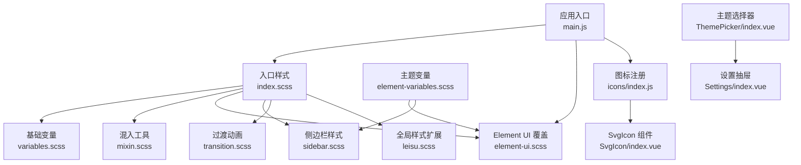
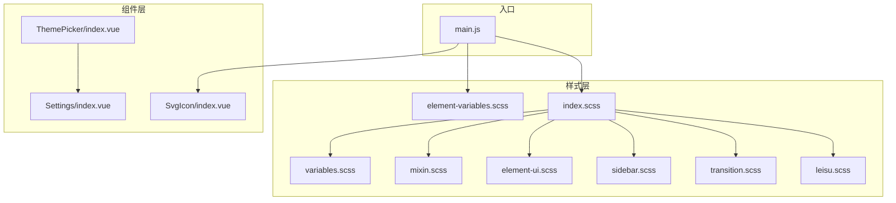
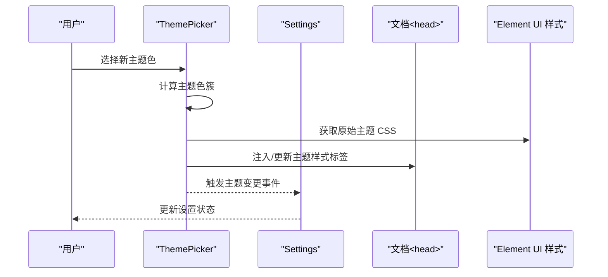
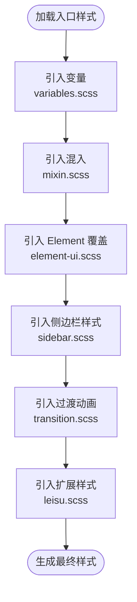
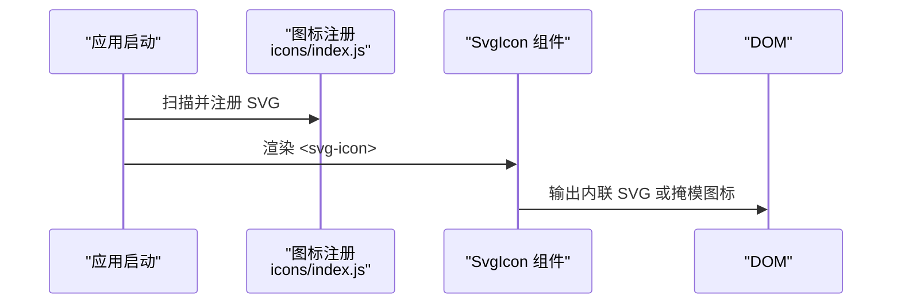
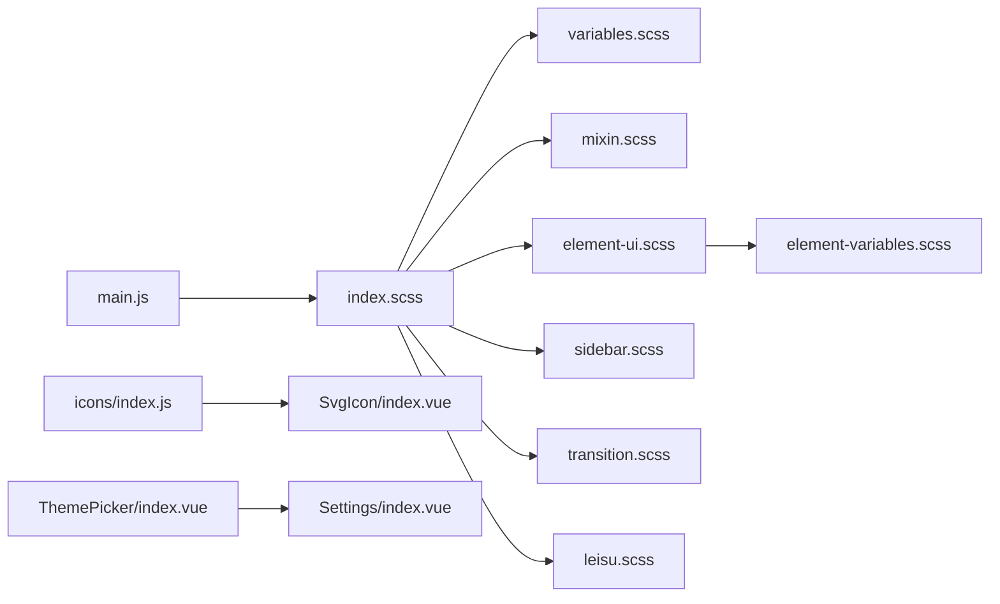

# 界面设计

<cite>
**本文引用的文件**
- [src/styles/element-variables.scss](file://src/styles/element-variables.scss)
- [src/styles/variables.scss](file://src/styles/variables.scss)
- [src/styles/mixin.scss](file://src/styles/mixin.scss)
- [src/styles/index.scss](file://src/styles/index.scss)
- [src/styles/leisu.scss](file://src/styles/leisu.scss)
- [src/styles/element-ui.scss](file://src/styles/element-ui.scss)
- [src/styles/sidebar.scss](file://src/styles/sidebar.scss)
- [src/styles/transition.scss](file://src/styles/transition.scss)
- [src/components/SvgIcon/index.vue](file://src/components/SvgIcon/index.vue)
- [src/icons/index.js](file://src/icons/index.js)
- [src/components/ThemePicker/index.vue](file://src/components/ThemePicker/index.vue)
- [src/layout/components/Settings/index.vue](file://src/layout/components/Settings/index.vue)
- [src/main.js](file://src/main.js)
</cite>

## 目录
1. [引言](#引言)
2. [项目结构](#项目结构)
3. [核心组件](#核心组件)
4. [架构总览](#架构总览)
5. [详细组件分析](#详细组件分析)
6. [依赖分析](#依赖分析)
7. [性能考量](#性能考量)
8. [故障排查指南](#故障排查指南)
9. [结论](#结论)
10. [附录](#附录)

## 引言
本文件面向设计师与前端开发者，系统化梳理 Leisu Admin 的界面设计体系，重点覆盖以下方面：
- 基于 Element UI 的主题定制与动态换肤机制
- SCSS 样式架构：模块化组织、变量系统、混合器、响应式策略
- 图标系统：SVG 图标的集成与使用规范
- 组件样式规范：样式隔离、继承与覆盖的最佳实践
- 响应式设计：断点、弹性布局与移动端适配
- 视觉设计指南：色彩、字体、间距、阴影等
- 无障碍设计：键盘导航、屏幕阅读器支持、颜色对比度
- 设计与开发协作流程与规范

## 项目结构
Leisu Admin 的界面层以 SCSS 模块化组织为核心，配合 Element UI 主题变量与自定义组件，形成统一的设计语言与交互体验。

**图表来源**
- [src/styles/index.scss:1-311](file://src/styles/index.scss#L1-L311)
- [src/styles/variables.scss:1-36](file://src/styles/variables.scss#L1-L36)
- [src/styles/mixin.scss:1-88](file://src/styles/mixin.scss#L1-L88)
- [src/styles/element-ui.scss:1-86](file://src/styles/element-ui.scss#L1-L86)
- [src/styles/sidebar.scss:1-210](file://src/styles/sidebar.scss#L1-L210)
- [src/styles/transition.scss:1-49](file://src/styles/transition.scss#L1-L49)
- [src/styles/leisu.scss:1-478](file://src/styles/leisu.scss#L1-L478)
- [src/styles/element-variables.scss:1-32](file://src/styles/element-variables.scss#L1-L32)
- [src/icons/index.js:1-10](file://src/icons/index.js#L1-L10)
- [src/components/SvgIcon/index.vue:1-63](file://src/components/SvgIcon/index.vue#L1-L63)
- [src/components/ThemePicker/index.vue:1-175](file://src/components/ThemePicker/index.vue#L1-L175)
- [src/layout/components/Settings/index.vue:1-109](file://src/layout/components/Settings/index.vue#L1-L109)
- [src/main.js:1-526](file://src/main.js#L1-L526)

**章节来源**
- [src/styles/index.scss:1-311](file://src/styles/index.scss#L1-L311)
- [src/main.js:10-26](file://src/main.js#L10-L26)

## 核心组件
- 主题变量与 Element UI 覆盖：通过主题变量文件集中管理 Element UI 的主色、辅助色、边框与字体路径，并引入 Element UI 的主题构建入口，实现主题编译与导出。
- SCSS 变量与混入：定义菜单、侧边栏、基础色板等变量；提供清除浮动、滚动条、三角形、禁选文字等混入，提升样式复用与一致性。
- 全局样式与扩展：在全局样式中统一字体、链接、滚动条、弹窗、表格等通用样式，并扩展 Leisu 特有样式类与布局。
- SVG 图标系统：通过图标注册脚本批量导入 SVG 文件，封装 SvgIcon 组件，支持内联 SVG 与外部图标掩模渲染。
- 主题选择器与设置抽屉：提供预设主题色选择、固定头部、标签页视图、侧边栏 Logo 开关等运行时样式控制。

**章节来源**
- [src/styles/element-variables.scss:1-32](file://src/styles/element-variables.scss#L1-L32)
- [src/styles/variables.scss:1-36](file://src/styles/variables.scss#L1-L36)
- [src/styles/mixin.scss:1-88](file://src/styles/mixin.scss#L1-L88)
- [src/styles/leisu.scss:1-478](file://src/styles/leisu.scss#L1-L478)
- [src/components/SvgIcon/index.vue:1-63](file://src/components/SvgIcon/index.vue#L1-L63)
- [src/icons/index.js:1-10](file://src/icons/index.js#L1-L10)
- [src/components/ThemePicker/index.vue:1-175](file://src/components/ThemePicker/index.vue#L1-L175)
- [src/layout/components/Settings/index.vue:1-109](file://src/layout/components/Settings/index.vue#L1-L109)

## 架构总览
下图展示从入口到主题与样式的整体关系，以及图标与设置面板的接入点。

**图表来源**
- [src/main.js:10-26](file://src/main.js#L10-L26)
- [src/styles/index.scss:1-10](file://src/styles/index.scss#L1-L10)
- [src/styles/element-variables.scss:22-25](file://src/styles/element-variables.scss#L22-L25)
- [src/styles/element-ui.scss:1-86](file://src/styles/element-ui.scss#L1-L86)
- [src/styles/sidebar.scss:1-210](file://src/styles/sidebar.scss#L1-L210)
- [src/styles/transition.scss:1-49](file://src/styles/transition.scss#L1-L49)
- [src/styles/leisu.scss:1-478](file://src/styles/leisu.scss#L1-L478)
- [src/components/ThemePicker/index.vue:1-175](file://src/components/ThemePicker/index.vue#L1-L175)
- [src/layout/components/Settings/index.vue:1-109](file://src/layout/components/Settings/index.vue#L1-L109)
- [src/components/SvgIcon/index.vue:1-63](file://src/components/SvgIcon/index.vue#L1-L63)

## 详细组件分析

### 主题定制与动态换肤
- 主题变量：集中定义 Element UI 的主色、状态色、边框与字体路径，并导出主题变量供 JS 使用。
- 动态换肤：主题选择器通过抓取 Element UI 主题 CSS，计算主题色簇，替换页面中已存在的颜色值，实现无刷新主题切换；同时更新 Element UI 内联样式与现有 style 标签。

**图表来源**
- [src/components/ThemePicker/index.vue:33-85](file://src/components/ThemePicker/index.vue#L33-L85)
- [src/layout/components/Settings/index.vue:74-79](file://src/layout/components/Settings/index.vue#L74-L79)

**章节来源**
- [src/styles/element-variables.scss:6-31](file://src/styles/element-variables.scss#L6-L31)
- [src/components/ThemePicker/index.vue:1-175](file://src/components/ThemePicker/index.vue#L1-L175)
- [src/layout/components/Settings/index.vue:1-109](file://src/layout/components/Settings/index.vue#L1-L109)

### SCSS 样式架构
- 模块化组织：入口样式按功能拆分为变量、混入、Element UI 覆盖、侧边栏、过渡、全局扩展等模块，便于维护与复用。
- 变量系统：定义品牌色、菜单色、侧边栏尺寸等变量，并通过导出机制供 JS 读取，实现样式与逻辑的一致性。
- 混合器：提供常用布局与交互的混入，如清除浮动、滚动条、三角形、禁选文字、表格单元格高度等。
- 全局样式扩展：统一字体、链接、滚动条、弹窗、表格等通用样式，并扩展 Leisu 特有布局与视觉类。

**图表来源**
- [src/styles/index.scss:1-10](file://src/styles/index.scss#L1-L10)
- [src/styles/variables.scss:1-36](file://src/styles/variables.scss#L1-L36)
- [src/styles/mixin.scss:1-88](file://src/styles/mixin.scss#L1-L88)
- [src/styles/element-ui.scss:1-86](file://src/styles/element-ui.scss#L1-L86)
- [src/styles/sidebar.scss:1-210](file://src/styles/sidebar.scss#L1-L210)
- [src/styles/transition.scss:1-49](file://src/styles/transition.scss#L1-L49)
- [src/styles/leisu.scss:1-478](file://src/styles/leisu.scss#L1-L478)

**章节来源**
- [src/styles/index.scss:1-311](file://src/styles/index.scss#L1-L311)
- [src/styles/variables.scss:1-36](file://src/styles/variables.scss#L1-L36)
- [src/styles/mixin.scss:1-88](file://src/styles/mixin.scss#L1-L88)
- [src/styles/leisu.scss:1-478](file://src/styles/leisu.scss#L1-L478)

### 图标系统
- 图标注册：通过上下文批量导入 SVG 文件，自动注册为全局组件，便于在任意位置使用。
- SvgIcon 组件：支持内联 SVG 与外部图标掩模渲染，提供 iconClass 与 className 属性，满足不同场景下的图标使用需求。

**图表来源**
- [src/icons/index.js:1-10](file://src/icons/index.js#L1-L10)
- [src/components/SvgIcon/index.vue:1-63](file://src/components/SvgIcon/index.vue#L1-L63)

**章节来源**
- [src/icons/index.js:1-10](file://src/icons/index.js#L1-L10)
- [src/components/SvgIcon/index.vue:1-63](file://src/components/SvgIcon/index.vue#L1-L63)

### 组件样式规范
- 样式隔离：通过局部作用域样式与深度选择器限定组件内部样式影响范围，避免全局污染。
- 样式继承：利用 SCSS 变量与混入，确保组件共享统一的设计令牌与行为。
- 样式覆盖：在 Element UI 覆盖样式中进行细粒度调整，保证与第三方库的兼容性与一致性。

**章节来源**
- [src/styles/element-ui.scss:1-86](file://src/styles/element-ui.scss#L1-L86)
- [src/styles/leisu.scss:1-478](file://src/styles/leisu.scss#L1-L478)

### 响应式设计
- 断点与布局：侧边栏样式中包含移动端响应式规则，支持折叠与滑动展示，结合过渡动画提升交互体验。
- 弹性布局：通过 Flexbox 与盒模型混入，实现灵活的布局与对齐方式。
- 移动端适配：在移动端场景下，侧边栏宽度与定位策略进行调整，保证在窄屏设备上的可用性。

**章节来源**
- [src/styles/sidebar.scss:146-173](file://src/styles/sidebar.scss#L146-L173)
- [src/styles/mixin.scss:24-34](file://src/styles/mixin.scss#L24-L34)

### 视觉设计指南
- 色彩系统：定义品牌主色与辅助色，菜单与侧边栏背景色，确保在不同状态下的可识别性与层次感。
- 字体规范：统一页面字体族，提升可读性与一致性。
- 间距规则：提供常用的内外边距类，便于快速排版。
- 阴影效果：通过过渡与弹窗样式，营造层级与聚焦感。

**章节来源**
- [src/styles/variables.scss:1-36](file://src/styles/variables.scss#L1-L36)
- [src/styles/index.scss:11-17](file://src/styles/index.scss#L11-L17)
- [src/styles/leisu.scss:117-153](file://src/styles/leisu.scss#L117-L153)

### 无障碍设计
- 键盘导航：确保可交互元素具备焦点可见性与键盘可达性，避免仅依赖鼠标的操作。
- 屏幕阅读器支持：为图标与不可见元素提供语义化标签或替代文本，保证信息传达。
- 颜色对比度：遵循 WCAG 对比度标准，确保关键信息与背景的可辨识度。

[本节为通用指导，无需特定文件引用]

## 依赖分析
- 样式依赖：入口样式依赖变量、混入、Element UI 覆盖、侧边栏、过渡与扩展样式模块。
- 组件依赖：主题选择器依赖 Element UI 版本与主题 CSS；设置抽屉依赖主题选择器；图标系统依赖注册脚本与组件。
- 入口依赖：应用入口引入全局样式、主题变量与图标注册，确保运行时样式与交互初始化。

**图表来源**
- [src/main.js:10-26](file://src/main.js#L10-L26)
- [src/styles/index.scss:1-10](file://src/styles/index.scss#L1-L10)
- [src/styles/element-variables.scss:22-25](file://src/styles/element-variables.scss#L22-L25)
- [src/icons/index.js:1-10](file://src/icons/index.js#L1-L10)
- [src/components/SvgIcon/index.vue:1-63](file://src/components/SvgIcon/index.vue#L1-L63)
- [src/components/ThemePicker/index.vue:1-175](file://src/components/ThemePicker/index.vue#L1-L175)
- [src/layout/components/Settings/index.vue:1-109](file://src/layout/components/Settings/index.vue#L1-L109)

**章节来源**
- [src/main.js:10-26](file://src/main.js#L10-L26)
- [src/styles/index.scss:1-10](file://src/styles/index.scss#L1-L10)

## 性能考量
- 样式体积控制：通过模块化与按需引入，减少无关样式；避免深层嵌套与重复选择器。
- 主题切换性能：动态换肤采用一次性注入与批量替换策略，尽量减少重绘与回流。
- 图标优化：SVG 内联与掩模渲染均具备良好性能表现，建议优先使用内联 SVG 以减少请求。

[本节为通用指导，无需特定文件引用]

## 故障排查指南
- 主题色不生效：检查主题变量是否正确导入与导出，确认动态换肤逻辑是否成功注入样式标签。
- 图标显示异常：确认图标注册是否执行，SvgIcon 组件的 iconClass 是否与 SVG 文件名一致。
- 侧边栏布局错乱：检查移动端响应式规则与过渡动画配置，确保在不同窗口尺寸下的表现一致。
- Element UI 样式冲突：核对 Element UI 覆盖样式与混入使用，避免选择器权重过高导致的覆盖失败。

**章节来源**
- [src/components/ThemePicker/index.vue:62-85](file://src/components/ThemePicker/index.vue#L62-L85)
- [src/components/SvgIcon/index.vue:24-44](file://src/components/SvgIcon/index.vue#L24-L44)
- [src/styles/sidebar.scss:146-173](file://src/styles/sidebar.scss#L146-L173)
- [src/styles/element-ui.scss:1-86](file://src/styles/element-ui.scss#L1-L86)

## 结论
Leisu Admin 的界面设计体系以 SCSS 模块化为基础，结合 Element UI 主题变量与动态换肤能力，形成了可维护、可扩展且一致的视觉语言。通过统一的变量、混入与组件规范，以及完善的图标与响应式策略，能够高效支撑多端产品迭代与设计协作。

[本节为总结，无需特定文件引用]

## 附录
- 设计与开发协作建议
  - 设计师提供设计令牌（色板、字号、间距、阴影），前端映射为 SCSS 变量与混入。
  - 组件开发遵循“最小可用”原则，优先使用混入与通用类，避免过度定制。
  - 主题切换需同步测试深浅色模式与高对比度场景，确保可访问性。
  - 图标命名与分类规范化，统一 SVG 尺寸与描边，减少渲染差异。

[本节为通用指导，无需特定文件引用]