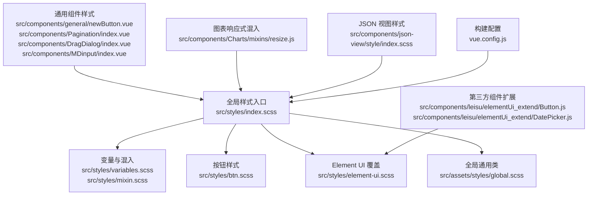
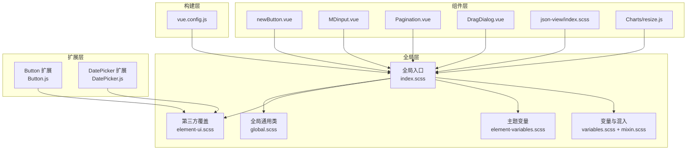
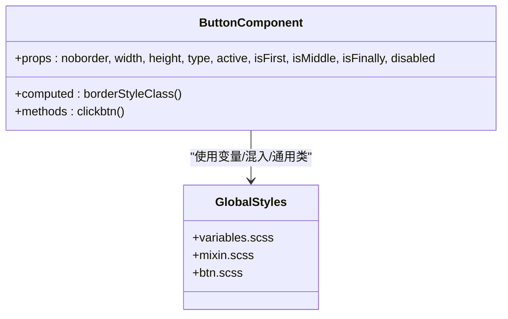
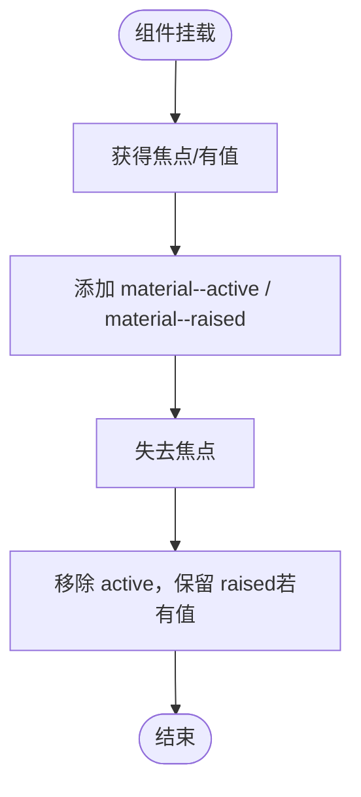
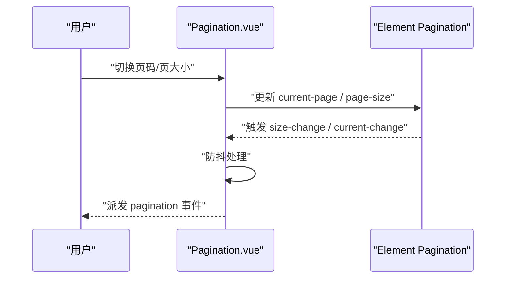
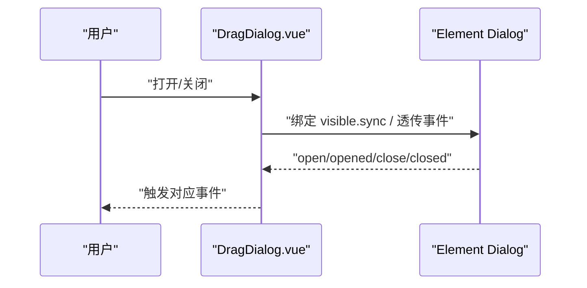
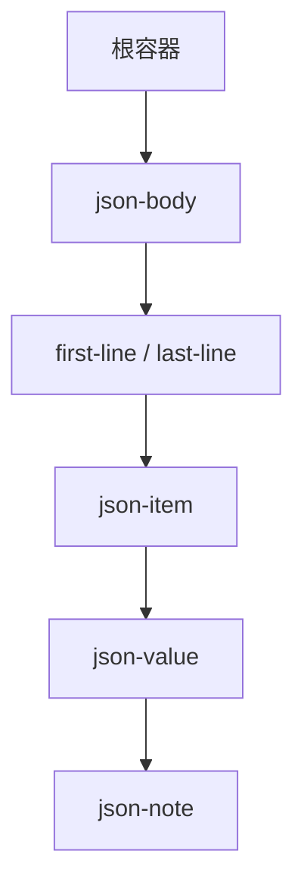
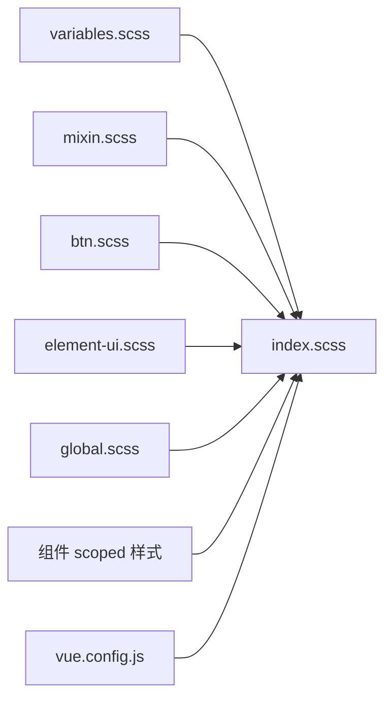

# 组件样式规范

<cite>
**本文引用的文件**
- [src/styles/index.scss](file://src/styles/index.scss)
- [src/styles/mixin.scss](file://src/styles/mixin.scss)
- [src/styles/variables.scss](file://src/styles/variables.scss)
- [src/styles/btn.scss](file://src/styles/btn.scss)
- [src/styles/element-ui.scss](file://src/styles/element-ui.scss)
- [src/styles/element-variables.scss](file://src/styles/element-variables.scss)
- [src/assets/styles/global.scss](file://src/assets/styles/global.scss)
- [src/components/general/newButton.vue](file://src/components/general/newButton.vue)
- [src/components/Pagination/index.vue](file://src/components/Pagination/index.vue)
- [src/components/DragDialog/index.vue](file://src/components/DragDialog/index.vue)
- [src/components/MDinput/index.vue](file://src/components/MDinput/index.vue)
- [src/components/json-view/style/index.scss](file://src/components/json-view/style/index.scss)
- [src/components/leisu/elementUi_extend/Button.js](file://src/components/leisu/elementUi_extend/Button.js)
- [src/components/leisu/elementUi_extend/DatePicker.js](file://src/components/leisu/elementUi_extend/DatePicker.js)
- [src/components/Charts/mixins/resize.js](file://src/components/Charts/mixins/resize.js)
- [vue.config.js](file://vue.config.js)
</cite>

## 目录
1. [引言](#引言)
2. [项目结构](#项目结构)
3. [核心组件](#核心组件)
4. [架构总览](#架构总览)
5. [详细组件分析](#详细组件分析)
6. [依赖分析](#依赖分析)
7. [性能考量](#性能考量)
8. [故障排查指南](#故障排查指南)
9. [结论](#结论)
10. [附录](#附录)

## 引言
本规范面向 Leisu Admin 项目的组件样式体系，系统性阐述样式隔离策略（CSS Modules 使用建议、BEM 命名约定、作用域管理）、通用组件样式设计标准（按钮、表单、表格、对话框等）、样式继承与覆盖规则（父传子、子重写、优先级计算）、样式调试方法与工具、以及样式维护最佳实践（重构、版本管理、文档维护）。目标是帮助开发者在保证一致性的前提下，提升可维护性与可扩展性。

## 项目结构
样式体系由全局样式入口、主题变量与混入、通用组件样式、第三方组件覆盖样式、以及按需引入的业务样式构成。整体采用“全局样式 + 组件局部样式”的分层组织方式，配合 Element UI 样式覆盖与自定义混入，形成统一而灵活的视觉与交互体验。

**图示来源**
- [src/styles/index.scss:1-311](file://src/styles/index.scss#L1-L311)
- [src/styles/variables.scss:1-36](file://src/styles/variables.scss#L1-L36)
- [src/styles/mixin.scss:1-88](file://src/styles/mixin.scss#L1-L88)
- [src/styles/btn.scss:1-111](file://src/styles/btn.scss#L1-L111)
- [src/styles/element-ui.scss:1-86](file://src/styles/element-ui.scss#L1-L86)
- [src/assets/styles/global.scss:1-28](file://src/assets/styles/global.scss#L1-L28)
- [src/components/general/newButton.vue:64-114](file://src/components/general/newButton.vue#L64-L114)
- [src/components/Pagination/index.vue:104-113](file://src/components/Pagination/index.vue#L104-L113)
- [src/components/DragDialog/index.vue:1-47](file://src/components/DragDialog/index.vue#L1-L47)
- [src/components/MDinput/index.vue:200-361](file://src/components/MDinput/index.vue#L200-L361)
- [src/components/json-view/style/index.scss:1-100](file://src/components/json-view/style/index.scss#L1-L100)
- [src/components/leisu/elementUi_extend/Button.js:1-27](file://src/components/leisu/elementUi_extend/Button.js#L1-L27)
- [src/components/leisu/elementUi_extend/DatePicker.js:1-55](file://src/components/leisu/elementUi_extend/DatePicker.js#L1-L55)
- [src/components/Charts/mixins/resize.js:1-35](file://src/components/Charts/mixins/resize.js#L1-L35)
- [vue.config.js:1-155](file://vue.config.js#L1-L155)

**章节来源**
- [src/styles/index.scss:1-311](file://src/styles/index.scss#L1-L311)
- [vue.config.js:1-155](file://vue.config.js#L1-L155)

## 核心组件
本节聚焦通用组件的样式设计与规范，涵盖按钮、表单输入、分页、拖拽对话框与 JSON 视图等。

- 按钮组件
  - 设计要点：支持尺寸、状态（禁用、激活）、边框组合（首/中/尾）等；通过 scoped 样式确保作用域隔离；提供语义化颜色类与过渡动画。
  - 参考路径：[按钮组件样式:64-114](file://src/components/general/newButton.vue#L64-L114)，[按钮通用样式:1-111](file://src/styles/btn.scss#L1-L111)

- 表单输入组件（Material 风格）
  - 设计要点：标签上浮、底部光条高亮、图标集成、禁用态与错误态；通过 scoped + 深度选择器适配 Element UI 子树。
  - 参考路径：[MDinput 组件样式:200-361](file://src/components/MDinput/index.vue#L200-L361)

- 分页组件
  - 设计要点：Element Pagination 包装，居中布局与背景容器，支持自动滚动与隐藏控制。
  - 参考路径：[分页组件样式:104-113](file://src/components/Pagination/index.vue#L104-L113)，[Element UI 覆盖:1-86](file://src/styles/element-ui.scss#L1-L86)

- 拖拽对话框
  - 设计要点：基于 Element Dialog，通过指令实现拖拽与事件透传，保持 scoped 样式最小化。
  - 参考路径：[拖拽对话框:1-47](file://src/components/DragDialog/index.vue#L1-L47)

- JSON 视图
  - 设计要点：层级缩进、连接线、折叠指示、只读展示；适合调试与日志查看。
  - 参考路径：[JSON 视图样式:1-100](file://src/components/json-view/style/index.scss#L1-L100)

**章节来源**
- [src/components/general/newButton.vue:1-114](file://src/components/general/newButton.vue#L1-L114)
- [src/styles/btn.scss:1-111](file://src/styles/btn.scss#L1-L111)
- [src/components/MDinput/index.vue:1-361](file://src/components/MDinput/index.vue#L1-L361)
- [src/components/Pagination/index.vue:1-113](file://src/components/Pagination/index.vue#L1-L113)
- [src/styles/element-ui.scss:1-86](file://src/styles/element-ui.scss#L1-L86)
- [src/components/DragDialog/index.vue:1-47](file://src/components/DragDialog/index.vue#L1-L47)
- [src/components/json-view/style/index.scss:1-100](file://src/components/json-view/style/index.scss#L1-L100)

## 架构总览
样式架构围绕“全局入口 + 主题变量 + 混入 + 组件局部样式 + 第三方覆盖”展开，辅以构建期优化与运行时响应式处理。

**图示来源**
- [src/styles/index.scss:1-311](file://src/styles/index.scss#L1-L311)
- [src/styles/variables.scss:1-36](file://src/styles/variables.scss#L1-L36)
- [src/styles/mixin.scss:1-88](file://src/styles/mixin.scss#L1-L88)
- [src/styles/element-variables.scss:1-32](file://src/styles/element-variables.scss#L1-L32)
- [src/styles/element-ui.scss:1-86](file://src/styles/element-ui.scss#L1-L86)
- [src/assets/styles/global.scss:1-28](file://src/assets/styles/global.scss#L1-L28)
- [src/components/general/newButton.vue:64-114](file://src/components/general/newButton.vue#L64-L114)
- [src/components/MDinput/index.vue:200-361](file://src/components/MDinput/index.vue#L200-L361)
- [src/components/Pagination/index.vue:104-113](file://src/components/Pagination/index.vue#L104-L113)
- [src/components/DragDialog/index.vue:1-47](file://src/components/DragDialog/index.vue#L1-L47)
- [src/components/json-view/style/index.scss:1-100](file://src/components/json-view/style/index.scss#L1-L100)
- [src/components/Charts/mixins/resize.js:1-35](file://src/components/Charts/mixins/resize.js#L1-L35)
- [src/components/leisu/elementUi_extend/Button.js:1-27](file://src/components/leisu/elementUi_extend/Button.js#L1-L27)
- [src/components/leisu/elementUi_extend/DatePicker.js:1-55](file://src/components/leisu/elementUi_extend/DatePicker.js#L1-L55)
- [vue.config.js:1-155](file://vue.config.js#L1-L155)

## 详细组件分析

### 按钮组件样式规范
- 命名与结构
  - 使用 BEM 风格类名，如 buttonStyle、active、disabled、noborder、no-right-border 等，避免全局污染。
  - 通过 props 控制组合态（首/中/尾），生成对应圆角与边框类，保证连续按钮组的视觉一致性。
- 颜色与主题
  - 通过变量与混入统一颜色体系，支持 hover、active 状态下的色彩过渡与边框强调。
- 交互与状态
  - 禁用态使用 !important 提升优先级，确保覆盖默认样式；hover 状态提供反馈。
- 作用域与隔离
  - 使用 scoped 样式限定作用域；必要时通过深度选择器与第三方组件协作。

**图示来源**
- [src/components/general/newButton.vue:1-114](file://src/components/general/newButton.vue#L1-L114)
- [src/styles/variables.scss:1-36](file://src/styles/variables.scss#L1-L36)
- [src/styles/mixin.scss:1-88](file://src/styles/mixin.scss#L1-L88)
- [src/styles/btn.scss:1-111](file://src/styles/btn.scss#L1-L111)

**章节来源**
- [src/components/general/newButton.vue:64-114](file://src/components/general/newButton.vue#L64-L114)
- [src/styles/btn.scss:1-111](file://src/styles/btn.scss#L1-L111)
- [src/styles/variables.scss:1-36](file://src/styles/variables.scss#L1-L36)
- [src/styles/mixin.scss:1-88](file://src/styles/mixin.scss#L1-L88)

### 表单输入组件（Material 风格）
- 标签与光条
  - 标签上浮与底部光条高亮，增强可用性；图标集成时调整内间距与定位。
- 状态管理
  - 通过计算类名切换 active、raised、disabled 等状态，驱动样式变化。
- 与第三方组件协作
  - 使用深度选择器适配 Element UI 输入框结构，避免破坏其内部样式。

**图示来源**
- [src/components/MDinput/index.vue:147-196](file://src/components/MDinput/index.vue#L147-L196)

**章节来源**
- [src/components/MDinput/index.vue:200-361](file://src/components/MDinput/index.vue#L200-L361)

### 分页组件样式规范
- 容器与布局
  - 外层容器提供背景与内边距，支持隐藏与自动滚动控制。
- 与第三方组件
  - 包装 Element Pagination，保持布局与交互一致；通过混入统一滚动条样式。

**图示来源**
- [src/components/Pagination/index.vue:87-99](file://src/components/Pagination/index.vue#L87-L99)
- [src/styles/element-ui.scss:1-86](file://src/styles/element-ui.scss#L1-L86)

**章节来源**
- [src/components/Pagination/index.vue:104-113](file://src/components/Pagination/index.vue#L104-L113)
- [src/styles/element-ui.scss:1-86](file://src/styles/element-ui.scss#L1-L86)

### 拖拽对话框样式规范
- 结构与事件
  - 基于 Element Dialog，通过指令实现拖拽与事件透传；计算属性桥接 .sync。
- 样式策略
  - 采用最小化 scoped 样式，仅在必要处覆盖默认外观。

**图示来源**
- [src/components/DragDialog/index.vue:1-47](file://src/components/DragDialog/index.vue#L1-L47)

**章节来源**
- [src/components/DragDialog/index.vue:1-47](file://src/components/DragDialog/index.vue#L1-L47)

### JSON 视图样式规范
- 层级与连接
  - 通过绝对定位绘制连接线，支持嵌套层级的可视化展示。
- 可读性
  - 采用等宽字体与换行策略，提升大对象可读性；提供折叠指示与点击交互。

**图示来源**
- [src/components/json-view/style/index.scss:1-100](file://src/components/json-view/style/index.scss#L1-L100)

**章节来源**
- [src/components/json-view/style/index.scss:1-100](file://src/components/json-view/style/index.scss#L1-L100)

## 依赖分析
- 全局入口依赖
  - 全局入口按顺序引入变量、混入、过渡、第三方覆盖、侧边栏、按钮、滚动条、表情包等样式，形成统一基线。
- 组件局部样式依赖
  - 通用组件通过 scoped 样式与全局变量/混入耦合；部分组件通过深度选择器与第三方组件协作。
- 构建期优化
  - 通过拆包策略将 Element UI 与公共组件独立打包，减少重复与体积。

**图示来源**
- [src/styles/index.scss:1-311](file://src/styles/index.scss#L1-L311)
- [src/styles/variables.scss:1-36](file://src/styles/variables.scss#L1-L36)
- [src/styles/mixin.scss:1-88](file://src/styles/mixin.scss#L1-L88)
- [src/styles/btn.scss:1-111](file://src/styles/btn.scss#L1-L111)
- [src/styles/element-ui.scss:1-86](file://src/styles/element-ui.scss#L1-L86)
- [src/assets/styles/global.scss:1-28](file://src/assets/styles/global.scss#L1-L28)
- [vue.config.js:127-151](file://vue.config.js#L127-L151)

**章节来源**
- [src/styles/index.scss:1-311](file://src/styles/index.scss#L1-L311)
- [vue.config.js:127-151](file://vue.config.js#L127-L151)

## 性能考量
- 样式体积
  - 通过拆包策略将 Element UI 与公共组件独立打包，降低初始加载体积。
- 动画与过渡
  - 合理使用过渡时间与缓动函数，避免过度动画导致卡顿。
- 响应式与滚动条
  - 图表组件通过混入统一滚动条样式，减少重复定义；监听窗口与侧边栏过渡事件，动态调整图表尺寸。

**章节来源**
- [src/components/Charts/mixins/resize.js:1-35](file://src/components/Charts/mixins/resize.js#L1-L35)
- [vue.config.js:127-151](file://vue.config.js#L127-L151)

## 故障排查指南
- 浏览器开发者工具
  - 使用 Elements 面板检查元素是否应用了预期类名；利用伪类状态（:hover/:active）验证交互效果。
  - 在 Console 中观察是否有第三方组件事件未正确透传或样式覆盖冲突。
- 样式冲突排查
  - 优先检查组件 scoped 样式是否被 !important 或深度选择器覆盖；确认全局入口引入顺序与变量覆盖关系。
- 性能分析
  - 使用 Performance 面板记录滚动条交互与窗口 resize 事件，评估防抖与监听器数量。
- 常见问题定位
  - 按钮禁用态无效：检查是否被更高优先级样式覆盖；确认 !important 使用是否合理。
  - 表单标签未上浮：检查计算类名逻辑与焦点事件绑定；确认与第三方表单项联动事件是否触发。

**章节来源**
- [src/components/general/newButton.vue:64-114](file://src/components/general/newButton.vue#L64-L114)
- [src/components/MDinput/index.vue:147-196](file://src/components/MDinput/index.vue#L147-L196)
- [src/components/Pagination/index.vue:87-99](file://src/components/Pagination/index.vue#L87-L99)
- [src/styles/element-ui.scss:1-86](file://src/styles/element-ui.scss#L1-L86)

## 结论
本规范建立了以全局入口为核心、以变量与混入为支撑、以组件局部样式为载体的样式体系，并通过第三方覆盖与构建期优化保障一致性与性能。遵循 BEM 命名、作用域隔离与优先级规则，可有效降低样式冲突风险；结合调试工具与性能分析，能够快速定位并解决问题。建议在团队内推广该规范，持续完善样式文档与最佳实践。

## 附录
- 样式命名约定（建议）
  - 基础类：.block、.text-center、.clearfix
  - 组件类：.pagination-container、.material-input__component
  - 状态类：.active、.disabled、.hidden
  - 组合类：.no-right-border、.no-lr-border
- 样式继承与覆盖规则（建议）
  - 父组件向子组件传递类名或样式变量；子组件通过 scoped 与深度选择器进行局部覆盖；!important 仅在必要时使用并标注原因。
- 样式调试清单
  - 检查类名拼接逻辑、事件绑定与透传、第三方组件联动、全局入口引入顺序与变量覆盖链路。
- 样式维护最佳实践
  - 重构：合并重复样式、收敛变量、统一混入；版本管理：通过 Git 记录样式变更与影响范围；文档维护：在组件注释中补充样式关键点与注意事项。