# Element UI扩展组件

<cite>
**本文档引用的文件**
- [src/components/leisu/elementUi_extend/Button.js](file://src/components/leisu/elementUi_extend/Button.js)
- [src/components/leisu/elementUi_extend/DatePicker.js](file://src/components/leisu/elementUi_extend/DatePicker.js)
- [src/components/general/newButton.vue](file://src/components/general/newButton.vue)
- [src/components/general/date-picker.vue](file://src/components/general/date-picker.vue)
- [src/components/general/new-date-picker.vue](file://src/components/general/new-date-picker.vue)
- [src/components/general/index.js](file://src/components/general/index.js)
- [src/main.js](file://src/main.js)
- [src/utils/tool.js](file://src/utils/tool.js)
- [src/utils/dict/common.js](file://src/utils/dict/common.js)
- [README.md](file://README.md)
</cite>

## 目录
1. [简介](#简介)
2. [项目结构](#项目结构)
3. [核心组件](#核心组件)
4. [架构概览](#架构概览)
5. [详细组件分析](#详细组件分析)
6. [依赖关系分析](#依赖关系分析)
7. [性能考虑](#性能考虑)
8. [故障排除指南](#故障排除指南)
9. [结论](#结论)
10. [附录](#附录)

## 简介

Element UI扩展组件是基于Element UI框架开发的一套二次定制组件库，主要包含Button扩展和DatePicker扩展两大核心功能模块。这些组件在保持Element UI原有功能的基础上，增加了更多的交互体验和业务定制能力。

本项目采用Vue.js + Element UI技术栈，通过组件扩展的方式为开发者提供了更加丰富和实用的UI组件选择。扩展组件不仅保持了与Element UI的完全兼容性，还在用户体验、功能增强和样式定制方面进行了深度优化。

## 项目结构

项目采用模块化的组织方式，核心扩展组件位于`src/components/leisu/elementUi_extend/`目录下，通用组件位于`src/components/general/`目录下。

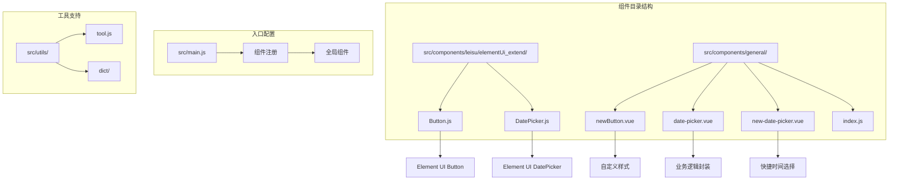

**图表来源**
- [src/components/leisu/elementUi_extend/Button.js:1-27](file://src/components/leisu/elementUi_extend/Button.js#L1-L27)
- [src/components/leisu/elementUi_extend/DatePicker.js:1-55](file://src/components/leisu/elementUi_extend/DatePicker.js#L1-L55)
- [src/components/general/index.js:1-41](file://src/components/general/index.js#L1-L41)

**章节来源**
- [src/components/leisu/elementUi_extend/Button.js:1-27](file://src/components/leisu/elementUi_extend/Button.js#L1-L27)
- [src/components/leisu/elementUi_extend/DatePicker.js:1-55](file://src/components/leisu/elementUi_extend/DatePicker.js#L1-L55)
- [src/components/general/index.js:1-41](file://src/components/general/index.js#L1-L41)

## 核心组件

### Button扩展组件

Button扩展组件在原生Element UI Button的基础上增加了防重复点击的功能，通过禁用状态和样式变化来提升用户体验。

**主要特性：**
- 自动防重复点击机制
- 禁用状态下的视觉反馈
- 1秒自动恢复可用状态
- 与原生Button完全兼容

### DatePicker扩展组件

DatePicker扩展组件提供了丰富的快捷时间选择功能，包含"昨天、今天、明天"等常用时间段的选择。

**主要特性：**
- 内置快捷时间选择器
- 支持单日期和日期范围选择
- 自动时间格式化处理
- 与Element UI DatePicker完全兼容

### 自定义Button组件

自定义Button组件提供了更加灵活的样式控制和布局选项，支持按钮组的组合使用。

**主要特性：**
- 支持按钮组组合（首、中、尾按钮）
- 自定义宽高和样式
- 状态管理（激活、禁用）
- 响应式设计

**章节来源**
- [src/components/leisu/elementUi_extend/Button.js:6-22](file://src/components/leisu/elementUi_extend/Button.js#L6-L22)
- [src/components/leisu/elementUi_extend/DatePicker.js:3-51](file://src/components/leisu/elementUi_extend/DatePicker.js#L3-L51)
- [src/components/general/newButton.vue:8-62](file://src/components/general/newButton.vue#L8-L62)

## 架构概览

扩展组件的整体架构采用了"继承+扩展"的设计模式，既保持了与Element UI的兼容性，又增加了业务特定的功能。

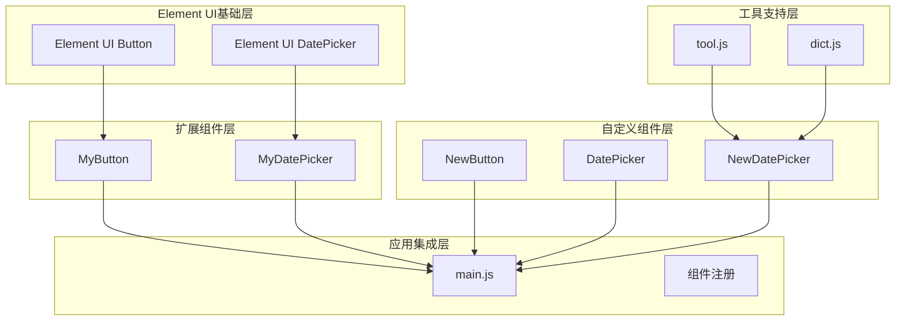

**图表来源**
- [src/main.js:65-72](file://src/main.js#L65-L72)
- [src/components/leisu/elementUi_extend/Button.js:23](file://src/components/leisu/elementUi_extend/Button.js#L23)
- [src/components/leisu/elementUi_extend/DatePicker.js:3](file://src/components/leisu/elementUi_extend/DatePicker.js#L3)

**章节来源**
- [src/main.js:65-72](file://src/main.js#L65-L72)
- [src/utils/tool.js:22-23](file://src/utils/tool.js#L22-L23)

## 详细组件分析

### Button扩展组件详细分析

Button扩展组件通过Vue.extend的方式继承了Element UI的Button组件，并在created生命周期钩子中添加了防重复点击的逻辑。

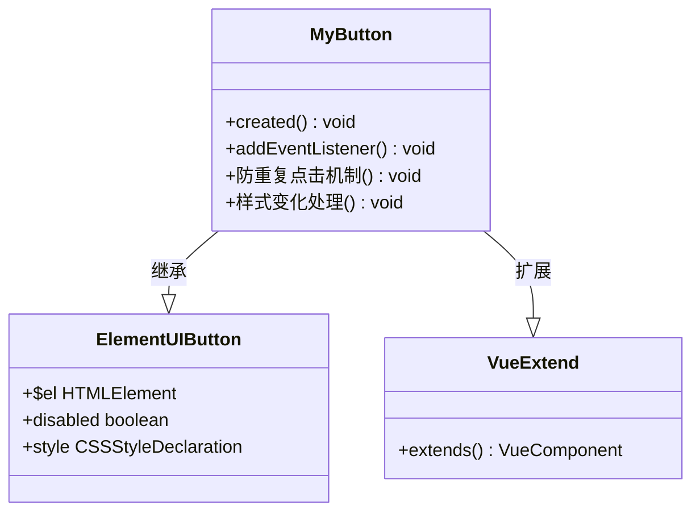

**图表来源**
- [src/components/leisu/elementUi_extend/Button.js:6-23](file://src/components/leisu/elementUi_extend/Button.js#L6-L23)

**实现流程：**

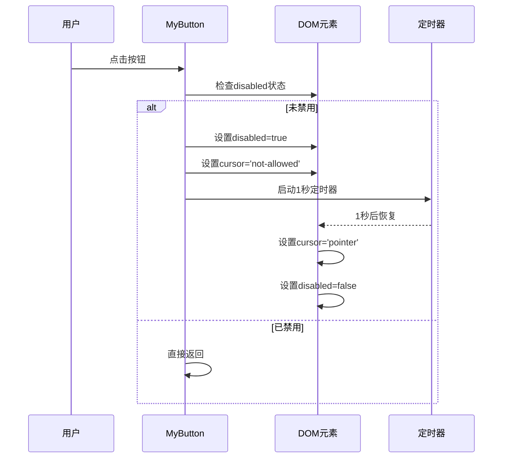

**图表来源**
- [src/components/leisu/elementUi_extend/Button.js:8-20](file://src/components/leisu/elementUi_extend/Button.js#L8-L20)

**章节来源**
- [src/components/leisu/elementUi_extend/Button.js:1-27](file://src/components/leisu/elementUi_extend/Button.js#L1-L27)

### DatePicker扩展组件详细分析

DatePicker扩展组件通过props配置的方式增加了自定义的pickerOptions，提供了丰富的快捷时间选择功能。

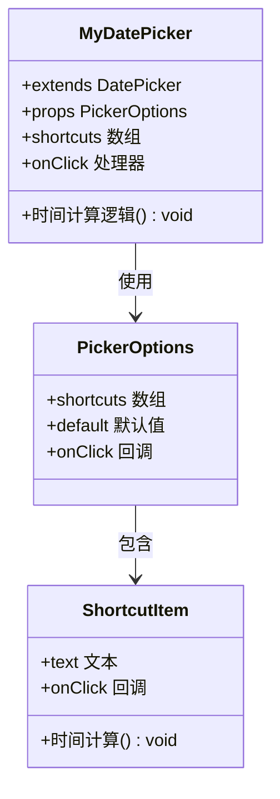

**图表来源**
- [src/components/leisu/elementUi_extend/DatePicker.js:3-51](file://src/components/leisu/elementUi_extend/DatePicker.js#L3-L51)

**快捷时间选择实现：**

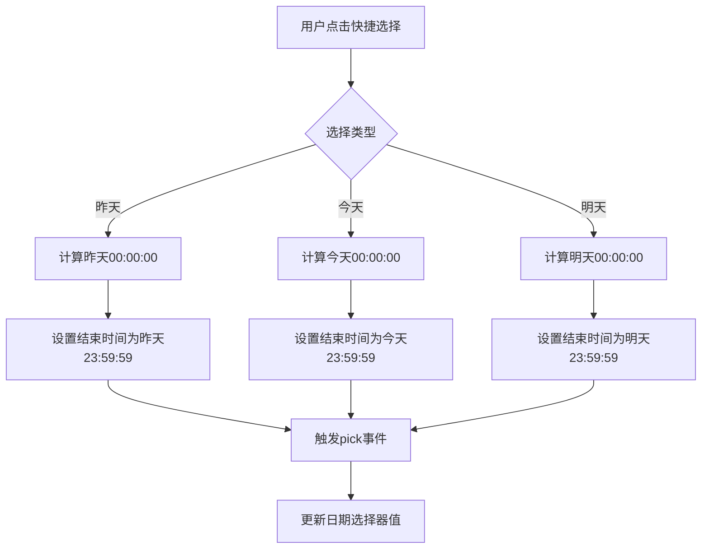

**图表来源**
- [src/components/leisu/elementUi_extend/DatePicker.js:8-47](file://src/components/leisu/elementUi_extend/DatePicker.js#L8-L47)

**章节来源**
- [src/components/leisu/elementUi_extend/DatePicker.js:1-55](file://src/components/leisu/elementUi_extend/DatePicker.js#L1-L55)

### 自定义Button组件详细分析

自定义Button组件提供了更加灵活的样式控制和布局选项，支持复杂的按钮组合场景。

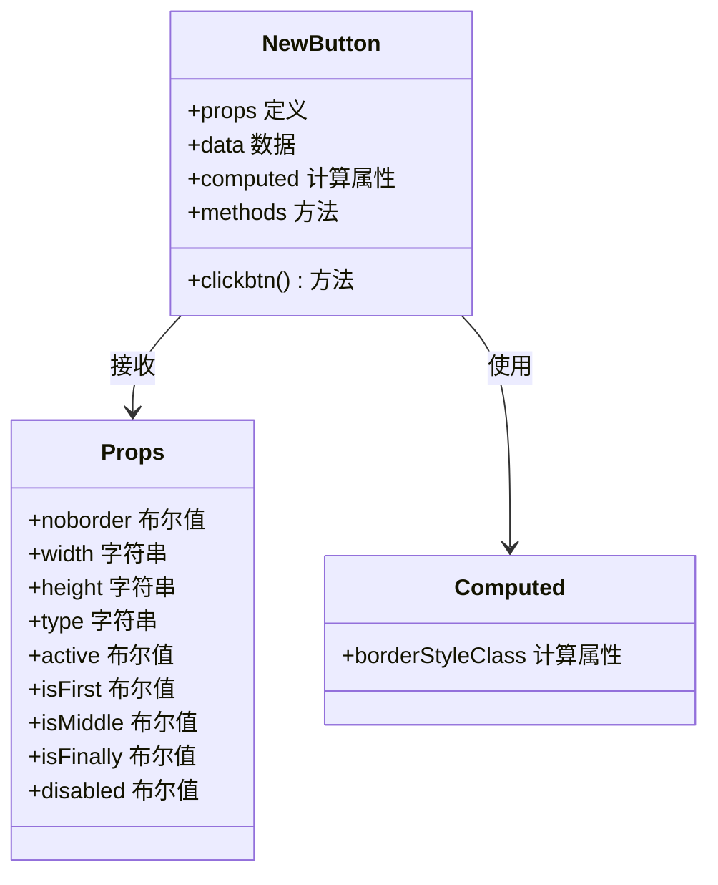

**图表来源**
- [src/components/general/newButton.vue:9-62](file://src/components/general/newButton.vue#L9-L62)

**按钮样式计算逻辑：**

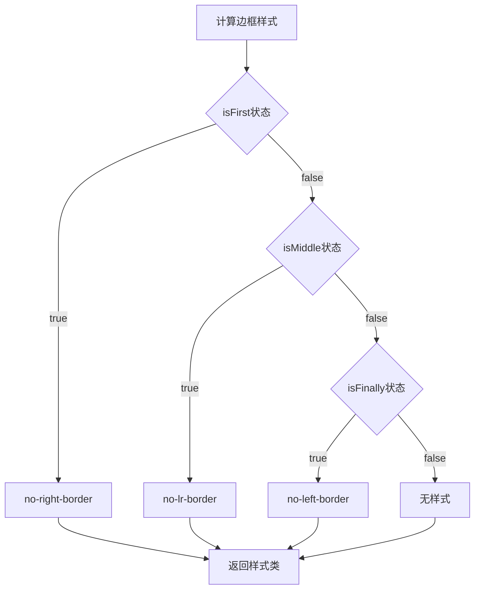

**图表来源**
- [src/components/general/newButton.vue:42-51](file://src/components/general/newButton.vue#L42-L51)

**章节来源**
- [src/components/general/newButton.vue:1-114](file://src/components/general/newButton.vue#L1-L114)

### 通用DatePicker组件详细分析

通用DatePicker组件提供了更加完善的业务逻辑封装，支持多种时间选择模式和格式化处理。

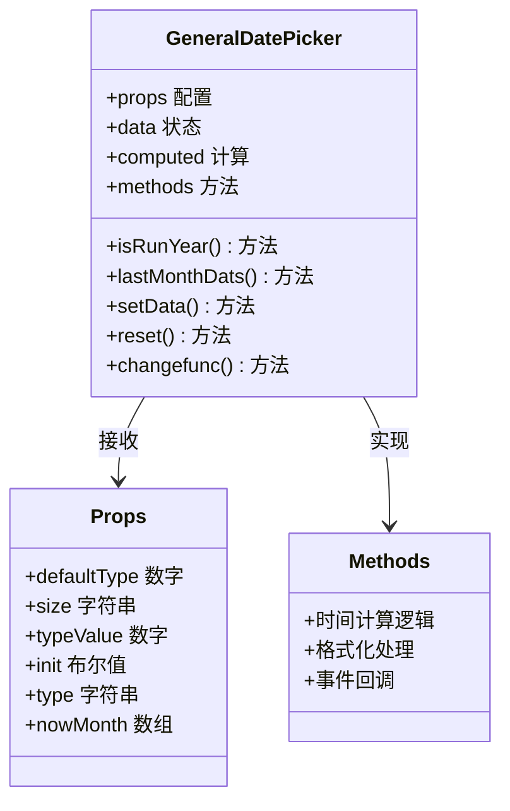

**图表来源**
- [src/components/general/date-picker.vue:18-325](file://src/components/general/date-picker.vue#L18-L325)

**章节来源**
- [src/components/general/date-picker.vue:1-338](file://src/components/general/date-picker.vue#L1-L338)

### 新版DatePicker组件详细分析

新版DatePicker组件进一步增强了功能，集成了工具函数和字典配置，提供了更加灵活的时间选择能力。

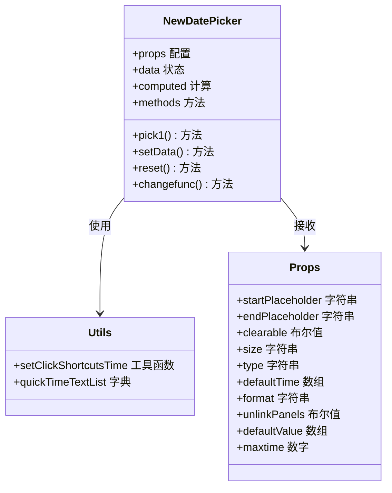

**图表来源**
- [src/components/general/new-date-picker.vue:25-173](file://src/components/general/new-date-picker.vue#L25-L173)

**章节来源**
- [src/components/general/new-date-picker.vue:1-191](file://src/components/general/new-date-picker.vue#L1-L191)

## 依赖关系分析

扩展组件的依赖关系体现了清晰的层次结构和模块化设计。

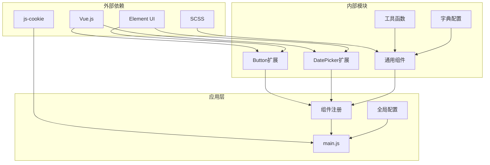

**图表来源**
- [src/main.js:1-526](file://src/main.js#L1-L526)
- [src/utils/tool.js:1-800](file://src/utils/tool.js#L1-L800)

**章节来源**
- [src/main.js:65-72](file://src/main.js#L65-L72)
- [src/utils/dict/common.js:229](file://src/utils/dict/common.js#L229)

## 性能考虑

扩展组件在设计时充分考虑了性能优化：

1. **防重复点击机制**：通过禁用状态避免重复提交
2. **懒加载策略**：组件按需加载，减少初始包体积
3. **事件委托**：合理使用事件监听器，避免内存泄漏
4. **样式优化**：使用SCSS预处理器，支持样式复用和编译优化

## 故障排除指南

### 常见问题及解决方案

**问题1：组件无法正常工作**
- 检查Element UI是否正确安装
- 确认组件注册是否在main.js中完成
- 验证CSS样式是否正确加载

**问题2：防重复点击失效**
- 检查created生命周期钩子是否执行
- 确认DOM元素是否存在
- 验证定时器是否正常启动

**问题3：时间选择器显示异常**
- 检查pickerOptions配置
- 确认快捷时间计算逻辑
- 验证事件回调函数

**章节来源**
- [src/main.js:65-72](file://src/main.js#L65-L72)
- [src/components/leisu/elementUi_extend/Button.js:6-22](file://src/components/leisu/elementUi_extend/Button.js#L6-L22)

## 结论

Element UI扩展组件库通过精心设计的架构和实现，成功地在保持与Element UI完全兼容的前提下，为开发者提供了更加丰富和实用的UI组件选择。这些组件不仅提升了用户体验，还增强了系统的业务处理能力。

扩展组件的主要优势包括：
- 完全兼容Element UI生态
- 功能增强且易于使用
- 良好的性能表现
- 清晰的代码结构和文档

## 附录

### 组件使用示例

**Button扩展组件使用：**
```javascript
// 直接使用el-button即可获得防重复点击功能
<el-button @click="handleSubmit">提交</el-button>
```

**DatePicker扩展组件使用：**
```javascript
// 使用扩展的DatePicker组件
<el-date-picker
  v-model="dateValue"
  type="daterange"
  placeholder="选择日期范围"
  :picker-options="pickerOptions">
</el-date-picker>
```

**自定义Button组件使用：**
```javascript
// 按钮组组合使用
<newButton :isFirst="true">首页</newButton>
<newButton :isMiddle="true">中间</newButton>
<newButton :isFinally="true">末页</newButton>
```

### 开发建议

1. **遵循组件设计原则**：保持组件的单一职责和可复用性
2. **注重性能优化**：合理使用计算属性和事件处理
3. **完善文档说明**：为每个组件提供详细的使用说明
4. **测试覆盖**：确保组件在各种场景下的稳定性
5. **向后兼容**：在升级时保持与现有代码的兼容性

**章节来源**
- [README.md:29-50](file://README.md#L29-L50)