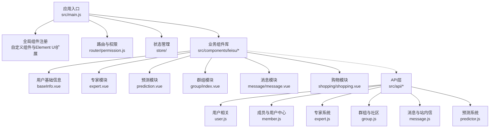
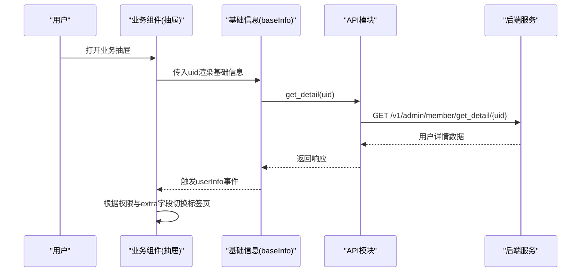
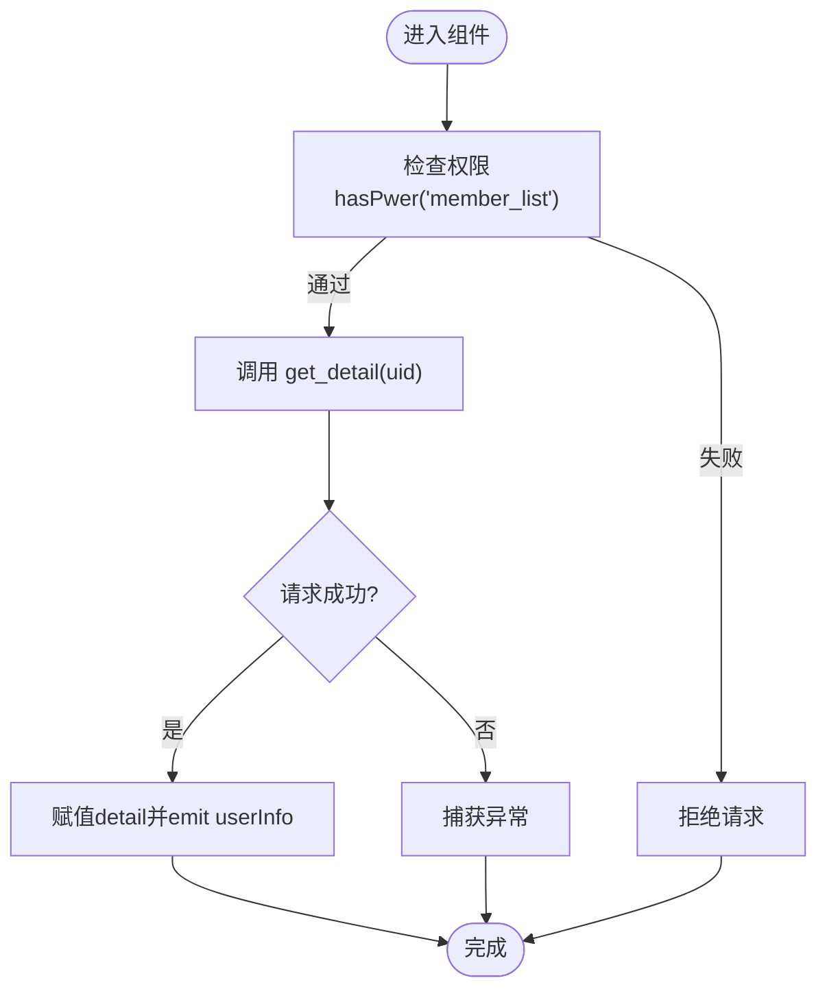
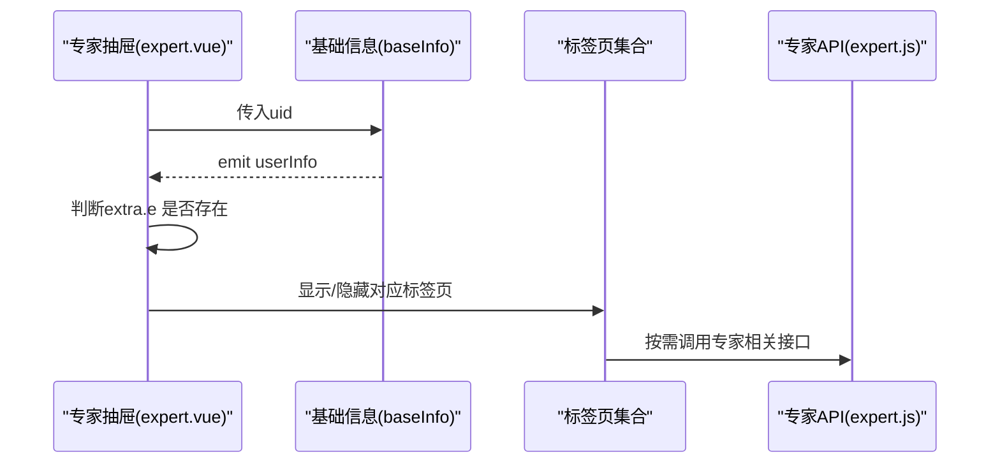
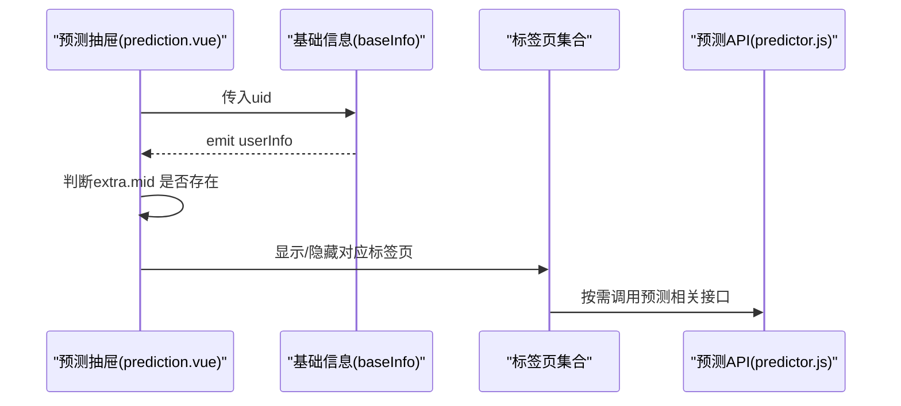
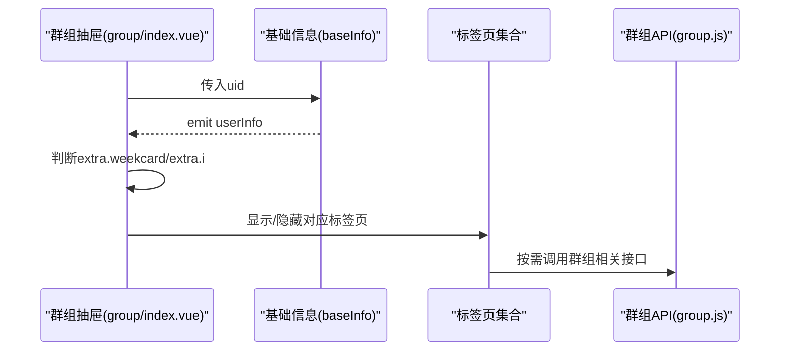
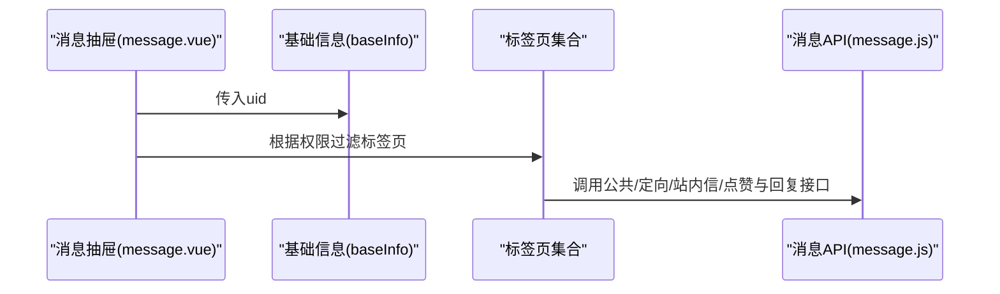
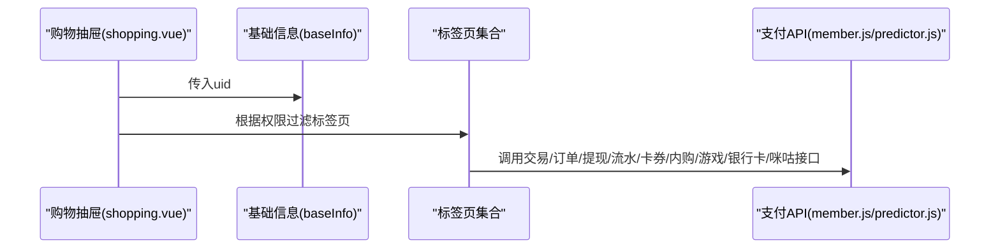
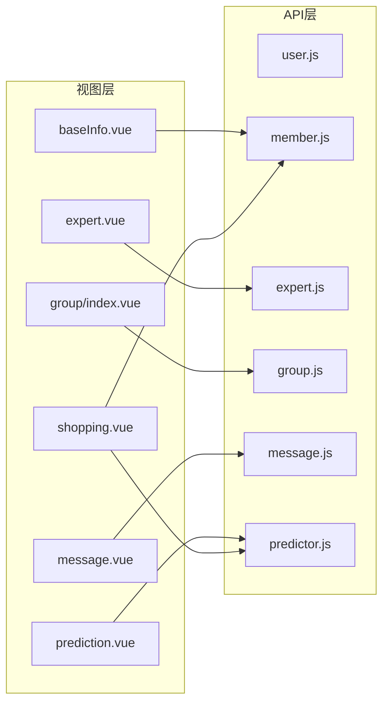

# Leisu业务组件群

<cite>
**本文引用的文件**
- [README.md](file://README.md)
- [package.json](file://package.json)
- [src/main.js](file://src/main.js)
- [src/components/leisu/peopleInfo/baseInfo.vue](file://src/components/leisu/peopleInfo/baseInfo.vue)
- [src/components/leisu/peopleInfo/expert/expert.vue](file://src/components/leisu/peopleInfo/expert/expert.vue)
- [src/components/leisu/peopleInfo/group/index.vue](file://src/components/leisu/peopleInfo/group/index.vue)
- [src/components/leisu/peopleInfo/message/message.vue](file://src/components/leisu/peopleInfo/message/message.vue)
- [src/components/leisu/peopleInfo/prediction/prediction.vue](file://src/components/leisu/peopleInfo/prediction/prediction.vue)
- [src/components/leisu/peopleInfo/shopping/shopping.vue](file://src/components/leisu/peopleInfo/shopping/shopping.vue)
- [src/api/user.js](file://src/api/user.js)
- [src/api/member.js](file://src/api/member.js)
- [src/api/expert.js](file://src/api/expert.js)
- [src/api/group.js](file://src/api/group.js)
- [src/api/message.js](file://src/api/message.js)
- [src/api/predictor.js](file://src/api/predictor.js)
</cite>

## 目录
1. [简介](#简介)
2. [项目结构](#项目结构)
3. [核心组件](#核心组件)
4. [架构总览](#架构总览)
5. [详细组件分析](#详细组件分析)
6. [依赖关系分析](#依赖关系分析)
7. [性能考量](#性能考量)
8. [故障排查指南](#故障排查指南)
9. [结论](#结论)
10. [附录](#附录)

## 简介
本文件面向Leisu业务组件群，系统性梳理并解析平台专用业务组件的设计架构与实现细节，覆盖用户信息组件、专家系统组件、群组管理组件、消息系统组件、预测系统组件、购物系统组件等核心模块。文档从数据流向、状态管理、事件处理机制入手，阐述组件间的协作模式与集成方案，并给出配置参数、API接口、事件回调等技术规范，辅以实际业务场景的使用案例与最佳实践，帮助开发者快速理解与高效扩展。

## 项目结构
Leisu Admin采用Vue 2 + Element UI的后台前端解决方案，结合Vuex进行状态管理、Vue Router进行路由控制、Axios封装HTTP请求。业务组件主要集中在src/components/leisu目录下，围绕“人员信息”展开，形成以用户为中心的业务视图：专家、预测、群组、消息、购物等子模块均通过抽屉式布局在“基础信息”之上组织多标签页，实现权限控制与功能聚合。

图表来源
- [src/main.js:1-526](file://src/main.js#L1-L526)
- [src/components/leisu/peopleInfo/baseInfo.vue:1-199](file://src/components/leisu/peopleInfo/baseInfo.vue#L1-L199)
- [src/components/leisu/peopleInfo/expert/expert.vue:1-150](file://src/components/leisu/peopleInfo/expert/expert.vue#L1-L150)
- [src/components/leisu/peopleInfo/prediction/prediction.vue:1-139](file://src/components/leisu/peopleInfo/prediction/prediction.vue#L1-L139)
- [src/components/leisu/peopleInfo/group/index.vue:1-140](file://src/components/leisu/peopleInfo/group/index.vue#L1-L140)
- [src/components/leisu/peopleInfo/message/message.vue:1-82](file://src/components/leisu/peopleInfo/message/message.vue#L1-L82)
- [src/components/leisu/peopleInfo/shopping/shopping.vue:1-83](file://src/components/leisu/peopleInfo/shopping/shopping.vue#L1-L83)
- [src/api/user.js:1-37](file://src/api/user.js#L1-L37)
- [src/api/member.js:1-814](file://src/api/member.js#L1-L814)
- [src/api/expert.js:1-677](file://src/api/expert.js#L1-L677)
- [src/api/group.js:1-642](file://src/api/group.js#L1-L642)
- [src/api/message.js:1-96](file://src/api/message.js#L1-L96)
- [src/api/predictor.js:1-1024](file://src/api/predictor.js#L1-L1024)

章节来源
- [README.md:1-177](file://README.md#L1-L177)
- [package.json:1-139](file://package.json#L1-L139)
- [src/main.js:1-526](file://src/main.js#L1-L526)

## 核心组件
- 用户基础信息组件：负责展示用户头像、UID、昵称、VIP状态、徽章、等级、挂件、粉丝与关注数等基础数据，并通过API拉取详情，触发父组件事件传递。
- 专家模块：围绕专家身份的全生命周期管理，包含基础信息、关注/粉丝、文章、申请、封禁记录、资料变更、消费与收益等标签页，依据权限动态显隐。
- 预测模块：围绕预测号身份，提供单关/串关/足彩文章、命中率、申请、封禁记录、资料变更、消费与收益等标签页，依据权限动态显隐。
- 群组模块：围绕社区互动，提供帖子/评论/屏蔽/打赏/周卡/举报/禁言/权限/操作记录/收益/消费/兴趣标签等标签页，依据权限动态显隐。
- 消息模块：围绕用户消息，提供会员/钱包/系统/投票/站内信/赞与回复等标签页，依据权限动态显隐。
- 购物模块：围绕支付与交易，提供交易记录、苹果订单、手动订单、提现、流水、卡券、内购、游戏、银行卡、咪咕订单等标签页，依据权限动态显隐。

章节来源
- [src/components/leisu/peopleInfo/baseInfo.vue:1-199](file://src/components/leisu/peopleInfo/baseInfo.vue#L1-L199)
- [src/components/leisu/peopleInfo/expert/expert.vue:1-150](file://src/components/leisu/peopleInfo/expert/expert.vue#L1-L150)
- [src/components/leisu/peopleInfo/prediction/prediction.vue:1-139](file://src/components/leisu/peopleInfo/prediction/prediction.vue#L1-L139)
- [src/components/leisu/peopleInfo/group/index.vue:1-140](file://src/components/leisu/peopleInfo/group/index.vue#L1-L140)
- [src/components/leisu/peopleInfo/message/message.vue:1-82](file://src/components/leisu/peopleInfo/message/message.vue#L1-L82)
- [src/components/leisu/peopleInfo/shopping/shopping.vue:1-83](file://src/components/leisu/peopleInfo/shopping/shopping.vue#L1-L83)

## 架构总览
Leisu业务组件群遵循“视图-状态-数据”的分层设计：
- 视图层：各业务组件以抽屉容器承载，内部使用Element UI Tabs组织多标签页，每个标签页对应一个功能子模块。
- 状态层：通过Vue实例上的全局方法与工具函数（如hasPwer、$eventBus、跳转方法）实现跨组件通信与权限控制。
- 数据层：通过API模块统一发起HTTP请求，封装权限校验与错误处理，返回Promise供组件消费。

图表来源
- [src/components/leisu/peopleInfo/baseInfo.vue:171-196](file://src/components/leisu/peopleInfo/baseInfo.vue#L171-L196)
- [src/api/member.js:11-21](file://src/api/member.js#L11-L21)

章节来源
- [src/main.js:515-519](file://src/main.js#L515-L519)
- [src/api/member.js:1-814](file://src/api/member.js#L1-L814)

## 详细组件分析

### 用户基础信息组件
- 职责：加载并展示用户基础资料，触发userInfo事件供上层组件使用。
- 数据流：props接收uid → 调用get_detail → 成功后赋值detail并emit事件 → 上层组件据此决定标签页与权限显隐。
- 权限与安全：在API层对“member_list”权限进行前置校验，避免越权访问。
- 性能与体验：加载态与图片CDN前缀处理，提升首屏与资源加载体验。

图表来源
- [src/components/leisu/peopleInfo/baseInfo.vue:171-196](file://src/components/leisu/peopleInfo/baseInfo.vue#L171-L196)
- [src/api/member.js:14-21](file://src/api/member.js#L14-L21)

章节来源
- [src/components/leisu/peopleInfo/baseInfo.vue:1-199](file://src/components/leisu/peopleInfo/baseInfo.vue#L1-L199)
- [src/api/member.js:1-814](file://src/api/member.js#L1-L814)

### 专家系统组件
- 职责：专家身份的全生命周期管理，按权限动态展示基础、关注、粉丝、文章、申请、封禁记录、资料变更、消费与收益等标签页。
- 数据流：基础信息组件提供uid与userInfo事件；组件内部根据extra字段判断是否具备专家身份，进而决定“铁粉/分析/分布/收益/消费”等标签页的可用性。
- 事件与协作：通过$eventBus进行跨组件事件通信，配合权限过滤指令实现UI一致性。

图表来源
- [src/components/leisu/peopleInfo/expert/expert.vue:132-146](file://src/components/leisu/peopleInfo/expert/expert.vue#L132-L146)
- [src/api/expert.js:1-677](file://src/api/expert.js#L1-L677)

章节来源
- [src/components/leisu/peopleInfo/expert/expert.vue:1-150](file://src/components/leisu/peopleInfo/expert/expert.vue#L1-L150)
- [src/api/expert.js:1-677](file://src/api/expert.js#L1-L677)

### 预测系统组件
- 职责：预测号身份的全生命周期管理，按权限动态展示基础、关注、粉丝、单关/串关/足彩文章、命中、申请、封禁记录、资料变更、消费与收益等标签页。
- 数据流：与专家模块类似，通过userInfo事件与extra字段判断是否具备预测号身份，进而决定相应标签页的可用性。

图表来源
- [src/components/leisu/peopleInfo/prediction/prediction.vue:121-135](file://src/components/leisu/peopleInfo/prediction/prediction.vue#L121-L135)
- [src/api/predictor.js:1-1024](file://src/api/predictor.js#L1-L1024)

章节来源
- [src/components/leisu/peopleInfo/prediction/prediction.vue:1-139](file://src/components/leisu/peopleInfo/prediction/prediction.vue#L1-L139)
- [src/api/predictor.js:1-1024](file://src/api/predictor.js#L1-L1024)

### 群组管理组件
- 职责：围绕社区互动，提供帖子/评论/屏蔽/打赏/周卡/举报/禁言/权限/操作记录/收益/消费/兴趣标签等标签页，依据权限动态显隐。
- 数据流：基础信息组件提供uid；组件内部根据extra字段判断周卡与直播权限，进而决定周卡与直播相关标签页的可用性。

图表来源
- [src/components/leisu/peopleInfo/group/index.vue:119-136](file://src/components/leisu/peopleInfo/group/index.vue#L119-L136)
- [src/api/group.js:1-642](file://src/api/group.js#L1-L642)

章节来源
- [src/components/leisu/peopleInfo/group/index.vue:1-140](file://src/components/leisu/peopleInfo/group/index.vue#L1-L140)
- [src/api/group.js:1-642](file://src/api/group.js#L1-L642)

### 消息系统组件
- 职责：围绕用户消息，提供会员/钱包/系统/投票/站内信/赞与回复等标签页，依据权限动态显隐。
- 数据流：基础信息组件提供uid；组件内部根据权限过滤标签页，分别调用公共消息、定向消息、站内信、点赞与回复等接口。

图表来源
- [src/components/leisu/peopleInfo/message/message.vue:1-82](file://src/components/leisu/peopleInfo/message/message.vue#L1-L82)
- [src/api/message.js:1-96](file://src/api/message.js#L1-L96)

章节来源
- [src/components/leisu/peopleInfo/message/message.vue:1-82](file://src/components/leisu/peopleInfo/message/message.vue#L1-L82)
- [src/api/message.js:1-96](file://src/api/message.js#L1-L96)

### 购物系统组件
- 职责：围绕支付与交易，提供交易记录、苹果订单、手动订单、提现、流水、卡券、内购、游戏、银行卡、咪咕订单等标签页，依据权限动态显隐。
- 数据流：基础信息组件提供uid；组件内部根据权限过滤标签页，分别调用交易、订单、提现、流水、卡券、内购、游戏、银行卡、咪咕等接口。

图表来源
- [src/components/leisu/peopleInfo/shopping/shopping.vue:1-83](file://src/components/leisu/peopleInfo/shopping/shopping.vue#L1-L83)
- [src/api/member.js:1-814](file://src/api/member.js#L1-L814)
- [src/api/predictor.js:1-1024](file://src/api/predictor.js#L1-L1024)

章节来源
- [src/components/leisu/peopleInfo/shopping/shopping.vue:1-83](file://src/components/leisu/peopleInfo/shopping/shopping.vue#L1-L83)
- [src/api/member.js:1-814](file://src/api/member.js#L1-L814)
- [src/api/predictor.js:1-1024](file://src/api/predictor.js#L1-L1024)

## 依赖关系分析
- 组件耦合：各业务抽屉组件均依赖基础信息组件，通过userInfo事件与权限判断实现松耦合。
- 外部依赖：Axios封装请求、Element UI组件库、全局过滤器与指令、事件总线、CDN前缀工具等。
- 权限体系：通过hasPwer指令与API层权限校验双重保障，确保界面与数据访问的安全性。

图表来源
- [src/components/leisu/peopleInfo/baseInfo.vue:1-199](file://src/components/leisu/peopleInfo/baseInfo.vue#L1-L199)
- [src/components/leisu/peopleInfo/expert/expert.vue:1-150](file://src/components/leisu/peopleInfo/expert/expert.vue#L1-L150)
- [src/components/leisu/peopleInfo/prediction/prediction.vue:1-139](file://src/components/leisu/peopleInfo/prediction/prediction.vue#L1-L139)
- [src/components/leisu/peopleInfo/group/index.vue:1-140](file://src/components/leisu/peopleInfo/group/index.vue#L1-L140)
- [src/components/leisu/peopleInfo/message/message.vue:1-82](file://src/components/leisu/peopleInfo/message/message.vue#L1-L82)
- [src/components/leisu/peopleInfo/shopping/shopping.vue:1-83](file://src/components/leisu/peopleInfo/shopping/shopping.vue#L1-L83)
- [src/api/user.js:1-37](file://src/api/user.js#L1-L37)
- [src/api/member.js:1-814](file://src/api/member.js#L1-L814)
- [src/api/expert.js:1-677](file://src/api/expert.js#L1-L677)
- [src/api/group.js:1-642](file://src/api/group.js#L1-L642)
- [src/api/message.js:1-96](file://src/api/message.js#L1-L96)
- [src/api/predictor.js:1-1024](file://src/api/predictor.js#L1-L1024)

章节来源
- [src/main.js:1-526](file://src/main.js#L1-L526)
- [package.json:1-139](file://package.json#L1-L139)

## 性能考量
- 资源加载：通过CDN前缀工具统一处理图片与静态资源，减少域名解析与请求开销。
- 组件懒加载：建议对大体量标签页组件采用异步加载策略，降低首屏体积。
- 请求合并：对高频查询（如粉丝/关注数、等级/挂件）可考虑缓存与批量查询，减少重复请求。
- 渲染优化：Tabs按需渲染，避免一次性渲染过多子组件；对长列表采用虚拟滚动或分页加载。

## 故障排查指南
- 权限不足：当API返回权限校验失败时，组件应提示并隐藏相关标签页；检查hasPwer指令与后端权限配置。
- 网络异常：统一在API层捕获异常并提示；对关键接口增加重试与降级策略。
- 数据不一致：通过事件总线在关键操作后触发刷新；对重要状态变更采用乐观更新与回滚机制。
- 资源加载失败：对图片与CDN资源增加兜底与重试逻辑，避免阻塞主流程。

章节来源
- [src/api/member.js:14-21](file://src/api/member.js#L14-L21)
- [src/main.js:515-519](file://src/main.js#L515-L519)

## 结论
Leisu业务组件群以“用户为中心”的设计理念，通过抽屉式布局与多标签页组织，实现了专家、预测、群组、消息、购物等业务域的统一接入。组件间通过基础信息组件与权限体系实现松耦合，API层提供统一的请求封装与权限校验，整体架构清晰、扩展性强。建议在后续迭代中进一步完善异步加载、缓存策略与错误恢复机制，持续提升用户体验与系统稳定性。

## 附录

### 技术规范与配置参数
- 权限指令：hasPwer用于控制DOM节点显示，结合store.state.user.roles实现细粒度权限控制。
- 事件总线：$eventBus用于跨组件事件通信，建议统一命名空间与事件生命周期管理。
- CDN前缀：addPrefix/removePrefix用于统一资源路径，确保在不同环境下资源正确加载。
- 跳转方法：jump_M_window/get_small_window/get_pc_window用于移动端与PC端跳转，结合域名配置实现多环境适配。

章节来源
- [src/main.js:492-519](file://src/main.js#L492-L519)
- [src/main.js:375-441](file://src/main.js#L375-L441)

### API接口清单（节选）
- 用户相关：登录、钉钉登录、获取用户信息、验证码、退出登录。
- 成员与用户中心：成员列表、详情、电话、头像/昵称修改、封禁/解封、实名认证、分组、设备登录/注册、申诉、反馈、挂件、报表等。
- 专家系统：专家列表、详情、头像/昵称违规、价格、封禁记录、关注/粉丝、文章、申请、资料变更、消费与收益、AI分析、分布等。
- 群组与社区：群组封禁/解封、互动历史、直播消息、审核、收费帖、周卡、举报、权限、消费与收益、报表等。
- 消息与站内信：公共消息、定向消息、站内信、点赞与回复。
- 预测系统：预测号列表、详情、头像/昵称违规、价格、封禁记录、关注/粉丝、文章、申请、资料变更、消费与收益、榜单、敏感词、战绩统计与趋势图等。

章节来源
- [src/api/user.js:1-37](file://src/api/user.js#L1-L37)
- [src/api/member.js:1-814](file://src/api/member.js#L1-L814)
- [src/api/expert.js:1-677](file://src/api/expert.js#L1-L677)
- [src/api/group.js:1-642](file://src/api/group.js#L1-L642)
- [src/api/message.js:1-96](file://src/api/message.js#L1-L96)
- [src/api/predictor.js:1-1024](file://src/api/predictor.js#L1-L1024)