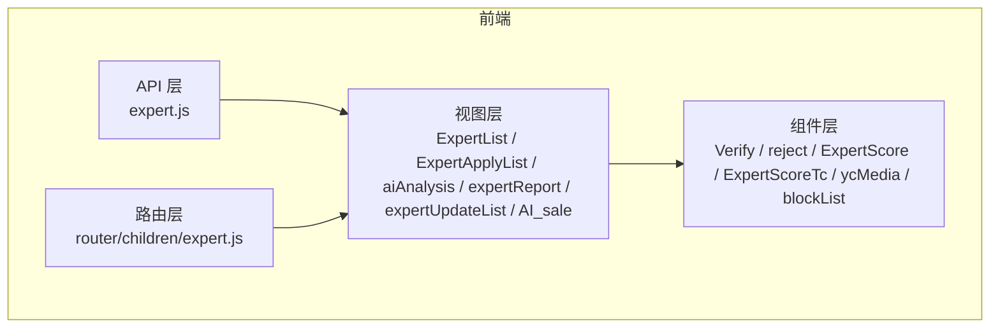
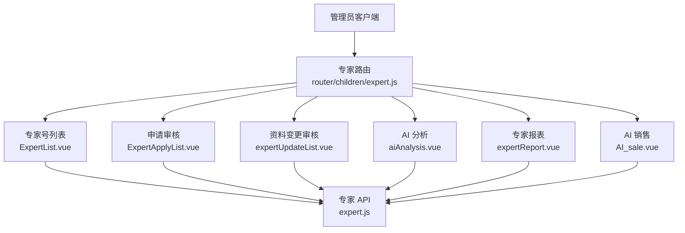
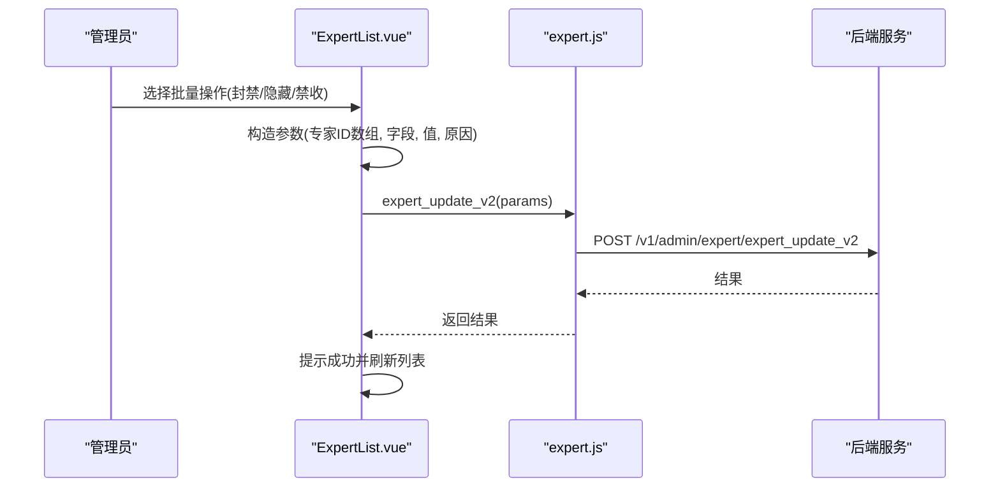
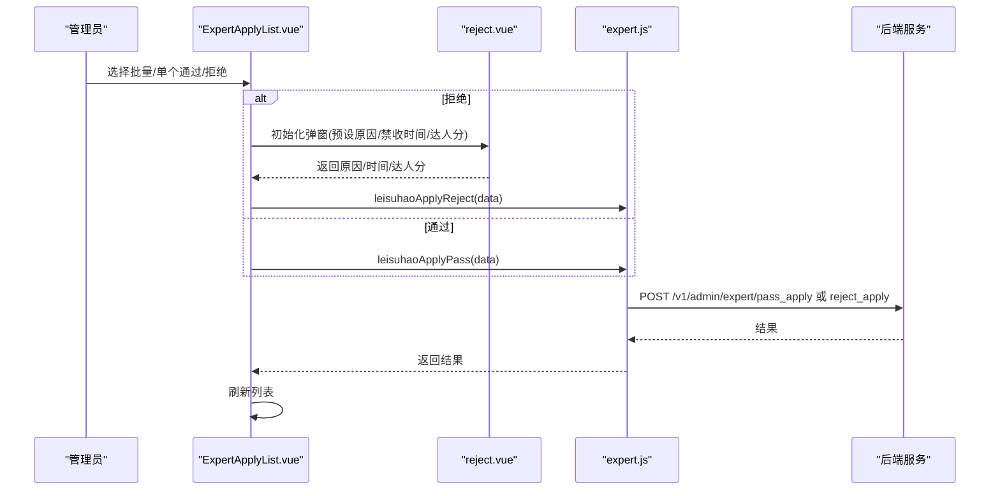
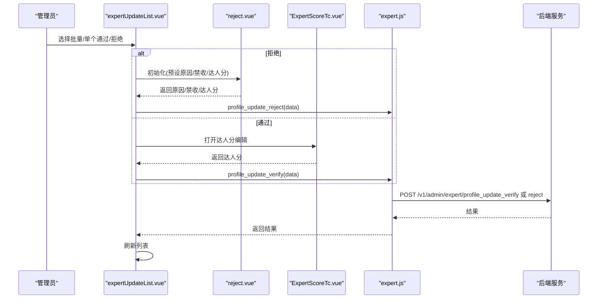
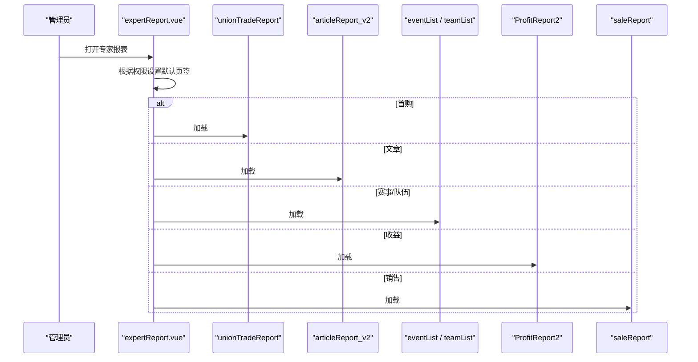
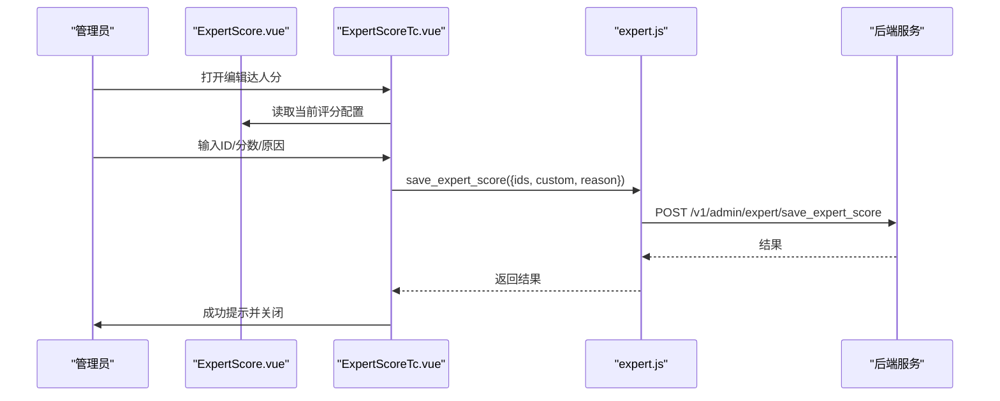
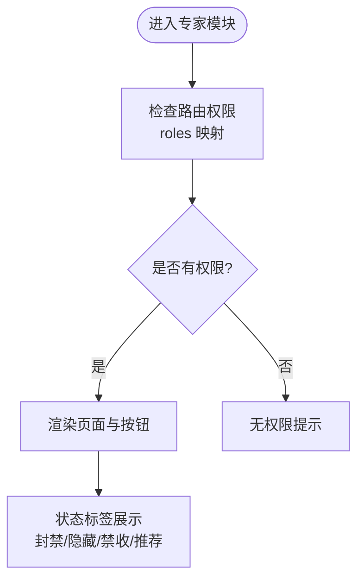
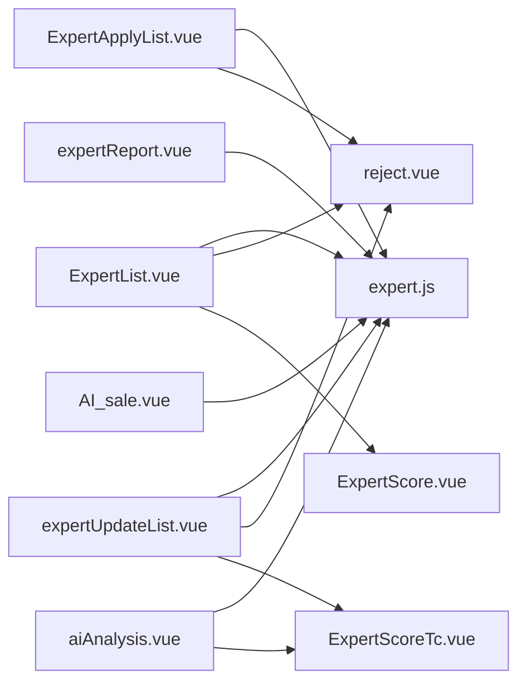

# 专家系统组件

<cite>
**本文引用的文件**
- [expert.js](file://src/api/expert.js)
- [expert.js(路由)](file://src/router/children/expert.js)
- [ExpertList.vue](file://src/views/expert/ExpertList.vue)
- [ExpertApplyList.vue](file://src/views/expert/ExpertApplyList.vue)
- [expertReport.vue](file://src/views/expert/expertReport.vue)
- [ExpertScore.vue](file://src/components/leisu/ExpertScore.vue)
- [ExpertScoreTc.vue](file://src/components/leisu/ExpertScoreTc.vue)
- [aiAnalysis.vue](file://src/views/expert/aiAnalysis.vue)
- [AI_sale.vue](file://src/views/expert/AI_sale.vue)
- [expertUpdateList.vue](file://src/views/expert/expertUpdateList.vue)
- [Verify.vue](file://src/views/expert/components/Verify.vue)
- [reject.vue](file://src/views/expert/components/reject.vue)
- [ycMedia.vue](file://src/views/expert/components/ycMedia.vue)
- [blockList.vue](file://src/views/expert/components/blockList.vue)
</cite>

## 目录
1. [引言](#引言)
2. [项目结构](#项目结构)
3. [核心组件](#核心组件)
4. [架构总览](#架构总览)
5. [详细组件分析](#详细组件分析)
6. [依赖关系分析](#依赖关系分析)
7. [性能考虑](#性能考虑)
8. [故障排查指南](#故障排查指南)
9. [结论](#结论)
10. [附录](#附录)

## 引言
本技术文档围绕“专家系统组件”展开，聚焦于专家号管理、预测者管理、专家评分、专家申请审核、专家资料管理、专家文章管理、专家收益统计、预测者等级管理、预测战绩统计、推荐算法、权限控制、数据安全与性能优化等方面。文档以代码级可视化方式呈现系统架构与关键流程，并结合体育内容生态场景给出使用建议与最佳实践。

## 项目结构
专家系统组件主要由以下层次构成：
- API 层：封装专家相关接口，统一对外暴露 REST 风格调用。
- 视图层：专家号列表、申请审核、资料变更、AI 分析、报表、销售等页面。
- 组件层：复用的通用组件，如状态标签、拒绝弹窗、达人分编辑器、媒体信息卡片等。
- 路由层：专家模块的菜单与权限角色映射。

图表来源
- [expert.js:1-677](file://src/api/expert.js#L1-L677)
- [expert.js(路由):1-123](file://src/router/children/expert.js#L1-L123)
- [ExpertList.vue:1-412](file://src/views/expert/ExpertList.vue#L1-L412)
- [ExpertApplyList.vue:1-487](file://src/views/expert/ExpertApplyList.vue#L1-L487)
- [aiAnalysis.vue:1-440](file://src/views/expert/aiAnalysis.vue#L1-L440)
- [expertReport.vue:1-103](file://src/views/expert/expertReport.vue#L1-L103)
- [expertUpdateList.vue:1-460](file://src/views/expert/expertUpdateList.vue#L1-L460)
- [AI_sale.vue:1-41](file://src/views/expert/AI_sale.vue#L1-L41)
- [Verify.vue:1-18](file://src/views/expert/components/Verify.vue#L1-L18)
- [reject.vue:1-191](file://src/views/expert/components/reject.vue#L1-L191)
- [ExpertScore.vue:1-116](file://src/components/leisu/ExpertScore.vue#L1-L116)
- [ExpertScoreTc.vue:1-110](file://src/components/leisu/ExpertScoreTc.vue#L1-L110)
- [ycMedia.vue:1-129](file://src/views/expert/components/ycMedia.vue#L1-L129)
- [blockList.vue:1-120](file://src/views/expert/components/blockList.vue#L1-L120)

章节来源
- [expert.js:1-677](file://src/api/expert.js#L1-L677)
- [expert.js(路由):1-123](file://src/router/children/expert.js#L1-L123)

## 核心组件
- 专家号列表与批量操作：支持筛选、排序、封禁/解封、隐藏/取消隐藏、禁收/取消禁收、批量操作与快速编辑。
- 专家申请审核：支持按状态筛选、图片查看、敏感词高亮、批量通过/拒绝、拒绝原因与达人分联动。
- 专家资料变更审核：支持变更项预览、批量/单个通过/拒绝、达人分调整。
- 专家文章与 AI 分析：支持文章列表、创建、删除、报表、购买记录与周卡销售。
- 专家报表：首购报表、文章报表、赛事/队伍报表、消费对比、销售报表、收益报表。
- 权限与状态：基于角色的菜单与按钮级权限；状态标签（封禁、隐藏、禁收）直观展示。

章节来源
- [ExpertList.vue:1-412](file://src/views/expert/ExpertList.vue#L1-L412)
- [ExpertApplyList.vue:1-487](file://src/views/expert/ExpertApplyList.vue#L1-L487)
- [expertUpdateList.vue:1-460](file://src/views/expert/expertUpdateList.vue#L1-L460)
- [aiAnalysis.vue:1-440](file://src/views/expert/aiAnalysis.vue#L1-L440)
- [expertReport.vue:1-103](file://src/views/expert/expertReport.vue#L1-L103)
- [Verify.vue:1-18](file://src/views/expert/components/Verify.vue#L1-L18)
- [reject.vue:1-191](file://src/views/expert/components/reject.vue#L1-L191)
- [ExpertScore.vue:1-116](file://src/components/leisu/ExpertScore.vue#L1-L116)
- [ExpertScoreTc.vue:1-110](file://src/components/leisu/ExpertScoreTc.vue#L1-L110)
- [ycMedia.vue:1-129](file://src/views/expert/components/ycMedia.vue#L1-L129)
- [blockList.vue:1-120](file://src/views/expert/components/blockList.vue#L1-L120)

## 架构总览
专家系统采用“路由驱动 + 页面组件 + 业务 API + 可复用组件”的分层架构。页面通过 API 层访问后端接口，组件层负责交互与状态展示，路由层控制菜单与权限。

图表来源
- [expert.js(路由):1-123](file://src/router/children/expert.js#L1-L123)
- [ExpertList.vue:1-412](file://src/views/expert/ExpertList.vue#L1-L412)
- [ExpertApplyList.vue:1-487](file://src/views/expert/ExpertApplyList.vue#L1-L487)
- [expertUpdateList.vue:1-460](file://src/views/expert/expertUpdateList.vue#L1-L460)
- [aiAnalysis.vue:1-440](file://src/views/expert/aiAnalysis.vue#L1-L440)
- [expertReport.vue:1-103](file://src/views/expert/expertReport.vue#L1-L103)
- [AI_sale.vue:1-41](file://src/views/expert/AI_sale.vue#L1-L41)
- [expert.js:1-677](file://src/api/expert.js#L1-L677)

## 详细组件分析

### 专家号管理与批量操作
- 功能点
  - 列表查询：支持按名称、分组、用户 ID、粉丝数、专家号 ID、创建时间等条件筛选；支持排序。
  - 状态管理：封禁/解封、隐藏/取消隐藏、禁收/取消禁收；支持批量操作。
  - 快速编辑：通过统一接口对多个字段进行批量修改，附带原因与禁收截止时间。
  - 禁收列表：集中查看与批量取消禁收。
- 数据流
  - 页面发起查询 → API 返回数据 → 表格渲染 → 用户操作 → 调用快速编辑接口 → 成功提示与刷新列表。

图表来源
- [ExpertList.vue:264-401](file://src/views/expert/ExpertList.vue#L264-L401)
- [expert.js:644-650](file://src/api/expert.js#L644-L650)

章节来源
- [ExpertList.vue:1-412](file://src/views/expert/ExpertList.vue#L1-L412)
- [blockList.vue:1-120](file://src/views/expert/components/blockList.vue#L1-L120)
- [expert.js:644-650](file://src/api/expert.js#L644-L650)

### 专家申请审核
- 功能点
  - 申请列表：支持按状态筛选、图片缩略图/大图切换、敏感词高亮、UID 查询。
  - 审核操作：单个/批量通过与拒绝；拒绝弹窗支持预设原因、禁收时间选择、达人分调整。
  - 侧边栏用户信息：点击用户可查看详细资料。
- 流程
  - 加载列表 → 筛选/搜索 → 选择行 → 通过/拒绝弹窗 → 提交 → 成功提示与刷新。

图表来源
- [ExpertApplyList.vue:410-468](file://src/views/expert/ExpertApplyList.vue#L410-L468)
- [reject.vue:123-187](file://src/views/expert/components/reject.vue#L123-L187)
- [expert.js:11-25](file://src/api/expert.js#L11-L25)

章节来源
- [ExpertApplyList.vue:1-487](file://src/views/expert/ExpertApplyList.vue#L1-L487)
- [reject.vue:1-191](file://src/views/expert/components/reject.vue#L1-L191)
- [Verify.vue:1-18](file://src/views/expert/components/Verify.vue#L1-L18)

### 专家资料变更审核
- 功能点
  - 变更列表：展示 UID、用户、预测号、简介、新头像/名称、状态、操作者、拒绝原因。
  - 审核：支持批量/单个通过/拒绝；通过时可联动达人分调整。
- 流程
  - 列表加载 → 选择行 → 通过/拒绝弹窗 → 提交达人分与拒绝原因 → 成功提示与刷新。

图表来源
- [expertUpdateList.vue:365-441](file://src/views/expert/expertUpdateList.vue#L365-L441)
- [reject.vue:123-187](file://src/views/expert/components/reject.vue#L123-L187)
- [ExpertScoreTc.vue:1-110](file://src/components/leisu/ExpertScoreTc.vue#L1-L110)
- [expert.js:243-265](file://src/api/expert.js#L243-L265)

章节来源
- [expertUpdateList.vue:1-460](file://src/views/expert/expertUpdateList.vue#L1-L460)
- [reject.vue:1-191](file://src/views/expert/components/reject.vue#L1-L191)
- [ExpertScoreTc.vue:1-110](file://src/components/leisu/ExpertScoreTc.vue#L1-L110)

### 专家文章与 AI 分析
- 功能点
  - AI 分析列表：支持按创建时间、文章/比赛/作者/赛事 ID 等筛选；支持删除/恢复删除标记。
  - 创建 AI 分析：打开创建弹窗，提交后刷新列表。
  - 销售与报表：AI 分析购买记录、周卡购买记录、AI 分析报表。
- 流程
  - 列表查询 → 选择操作 → 删除/报表 → 成功提示与刷新。

```mermaid
sequenceDiagram
participant U as "管理员"
participant V as "aiAnalysis.vue"
participant A as "expert.js"
participant S as "后端服务"
U->>V : 点击“创建AI分析”
V->>V : 打开创建弹窗
U->>V : 提交创建
V->>A : create_ai_scheme(data)
A->>S : POST /v1/admin/expert/create_ai_scheme
S-->>A : 结果
A-->>V : 返回结果
V->>V : 刷新列表
U->>V : 选择删除/恢复
V->>A : ai_delete_ai({deleted,id})
A->>S : POST /v1/admin/expert/delete_ai
S-->>A : 结果
A-->>V : 返回结果
V->>V : 刷新列表
```

图表来源
- [aiAnalysis.vue:290-345](file://src/views/expert/aiAnalysis.vue#L290-L345)
- [expert.js:521-546](file://src/api/expert.js#L521-L546)

章节来源
- [aiAnalysis.vue:1-440](file://src/views/expert/aiAnalysis.vue#L1-L440)
- [AI_sale.vue:1-41](file://src/views/expert/AI_sale.vue#L1-L41)
- [expert.js:496-579](file://src/api/expert.js#L496-L579)

### 专家报表与收益统计
- 功能点
  - 首购报表、文章报表、赛事/队伍报表、消费对比、销售报表、收益报表。
  - 报表组件按权限动态选择默认页签。
- 流程
  - 选择页签 → 加载对应报表组件 → 渲染数据。

图表来源
- [expertReport.vue:1-103](file://src/views/expert/expertReport.vue#L1-L103)

章节来源
- [expertReport.vue:1-103](file://src/views/expert/expertReport.vue#L1-L103)

### 专家评分与达人分管理
- 功能点
  - 达人分编辑器：勾选不同维度加分，实时计算总分；支持保存。
  - 编辑弹窗：输入 ID、加减分数、原因、触发保存接口。
- 流程
  - 打开弹窗 → 勾选/调整 → 保存 → 成功提示与刷新。

图表来源
- [ExpertScore.vue:1-116](file://src/components/leisu/ExpertScore.vue#L1-L116)
- [ExpertScoreTc.vue:1-110](file://src/components/leisu/ExpertScoreTc.vue#L1-L110)
- [expert.js:651-658](file://src/api/expert.js#L651-L658)

章节来源
- [ExpertScore.vue:1-116](file://src/components/leisu/ExpertScore.vue#L1-L116)
- [ExpertScoreTc.vue:1-110](file://src/components/leisu/ExpertScoreTc.vue#L1-L110)
- [expert.js:651-658](file://src/api/expert.js#L651-L658)

### 权限控制与状态展示
- 权限控制
  - 路由 meta.roles 定义专家模块可用权限集合；页面通过 hasPwer 判断按钮级权限。
- 状态展示
  - 封禁、隐藏、禁收、推荐等状态通过标签与图标直观呈现；用户卡片集成状态组件。

图表来源
- [expert.js(路由):100-120](file://src/router/children/expert.js#L100-L120)
- [ycMedia.vue:80-81](file://src/views/expert/components/ycMedia.vue#L80-L81)

章节来源
- [expert.js(路由):1-123](file://src/router/children/expert.js#L1-L123)
- [ycMedia.vue:1-129](file://src/views/expert/components/ycMedia.vue#L1-L129)

## 依赖关系分析
- 组件耦合
  - 页面组件依赖 API 层与通用组件；通用组件之间低耦合，职责单一。
- 外部依赖
  - 请求库：统一通过 request 封装；错误处理集中在页面层。
- 潜在风险
  - 批量操作参数构造需严格校验；拒绝弹窗与达人分编辑器需保证数据一致性。

图表来源
- [ExpertList.vue:1-412](file://src/views/expert/ExpertList.vue#L1-L412)
- [ExpertApplyList.vue:1-487](file://src/views/expert/ExpertApplyList.vue#L1-L487)
- [expertUpdateList.vue:1-460](file://src/views/expert/expertUpdateList.vue#L1-L460)
- [aiAnalysis.vue:1-440](file://src/views/expert/aiAnalysis.vue#L1-L440)
- [expertReport.vue:1-103](file://src/views/expert/expertReport.vue#L1-L103)
- [AI_sale.vue:1-41](file://src/views/expert/AI_sale.vue#L1-L41)
- [reject.vue:1-191](file://src/views/expert/components/reject.vue#L1-L191)
- [ExpertScore.vue:1-116](file://src/components/leisu/ExpertScore.vue#L1-L116)
- [ExpertScoreTc.vue:1-110](file://src/components/leisu/ExpertScoreTc.vue#L1-L110)
- [expert.js:1-677](file://src/api/expert.js#L1-L677)

章节来源
- [expert.js:1-677](file://src/api/expert.js#L1-L677)

## 性能考虑
- 列表分页与懒加载：使用分页组件与高度固定，减少 DOM 重排。
- 图片懒加载与缩略图：支持大图/小图切换，降低首屏压力。
- 批量操作：合并请求参数，避免多次网络往返。
- 状态缓存：弹窗与评分编辑器在可见时才初始化，减少内存占用。
- 事件节流：搜索与筛选建议在输入框增加防抖，避免频繁请求。

## 故障排查指南
- 常见问题
  - 拒绝原因为空：弹窗确认逻辑会校验原因是否填写，确保必填。
  - 禁收时间未选择：禁收场景需选择截止时间，否则提示错误。
  - 批量操作失败：检查专家 ID 数组与字段映射是否正确。
- 排查步骤
  - 查看网络面板请求与响应码。
  - 检查弹窗组件是否正确传递参数。
  - 校验权限是否满足路由与按钮级权限要求。
  - 若涉及达人分调整，确认保存接口返回码与消息。

章节来源
- [reject.vue:134-187](file://src/views/expert/components/reject.vue#L134-L187)
- [ExpertList.vue:264-401](file://src/views/expert/ExpertList.vue#L264-L401)

## 结论
专家系统组件通过清晰的分层设计与可复用组件，实现了专家号全生命周期管理与运营分析能力。结合权限控制与状态可视化，能够高效支撑体育内容生态中的专家内容生产与分发。建议在后续迭代中进一步完善推荐算法与预测战绩统计的可视化与自动化能力，持续优化性能与用户体验。

## 附录
- 术语
  - 专家号：平台认证的专家身份，具备发布文章与内容生产的权限。
  - 达人分：用于衡量专家贡献度与信誉的指标，可由管理员调整。
  - 封禁/隐藏/禁收：三种内容治理手段，分别影响可见性与发布能力。
- 使用场景
  - 内容审核与风控：申请审核、资料变更审核、文章删除与禁收。
  - 运营分析：报表与销售统计，辅助决策与激励策略。
  - 用户互动：通过状态标签与评分体系提升专家活跃度与质量。