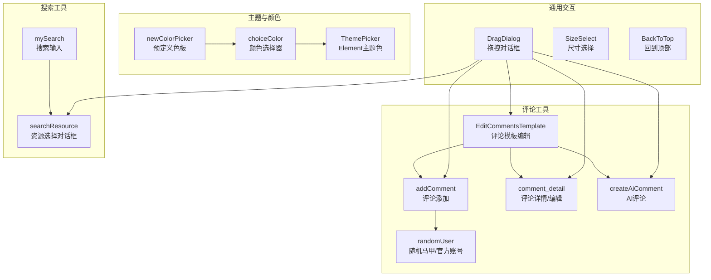
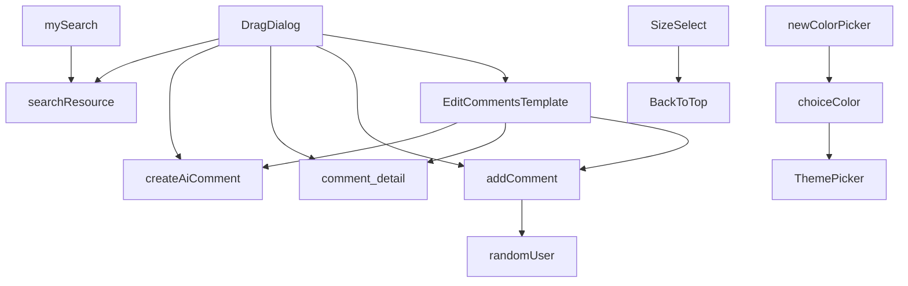
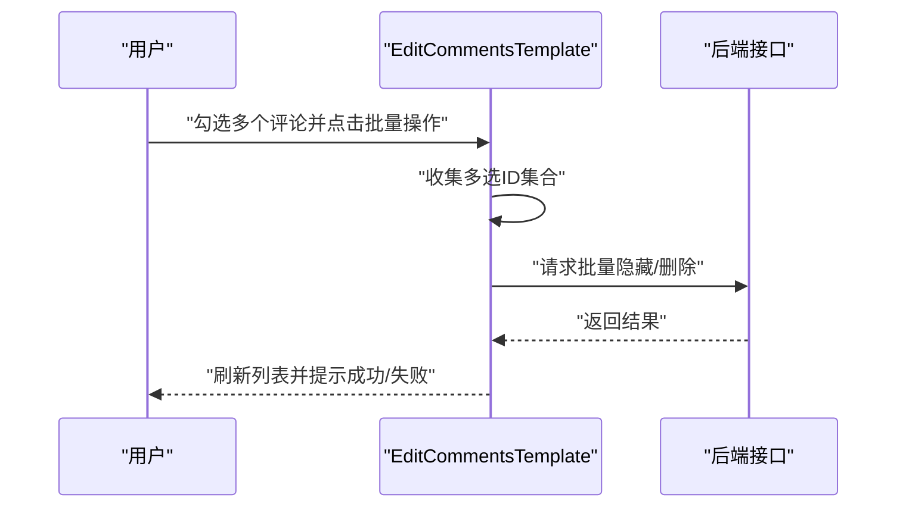
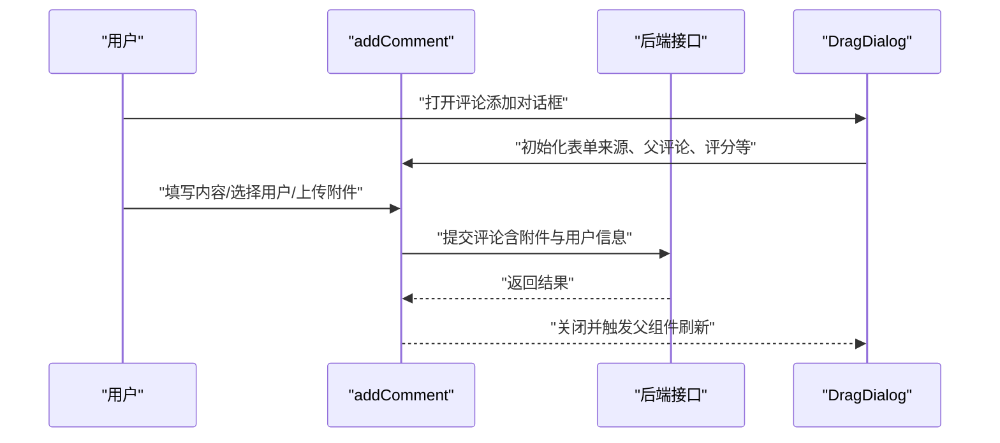
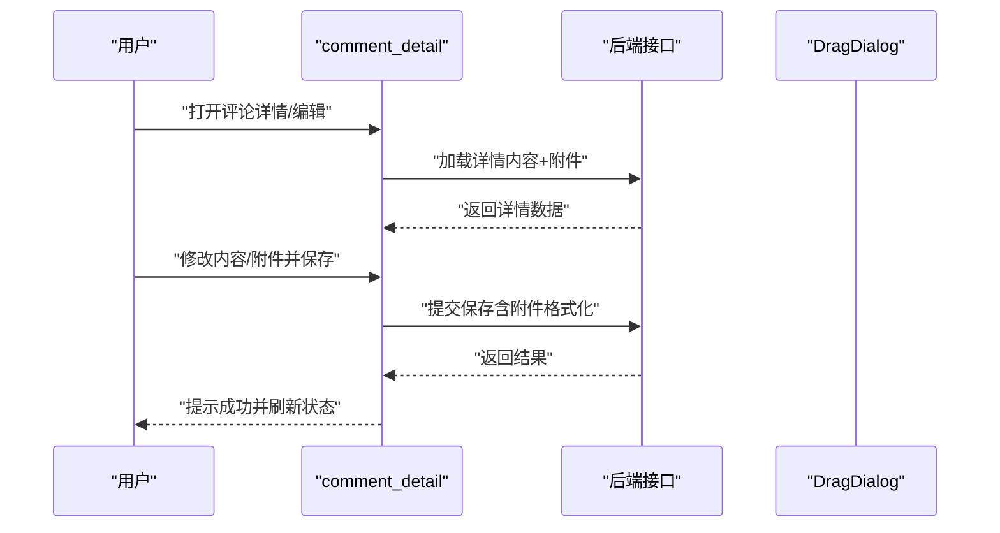
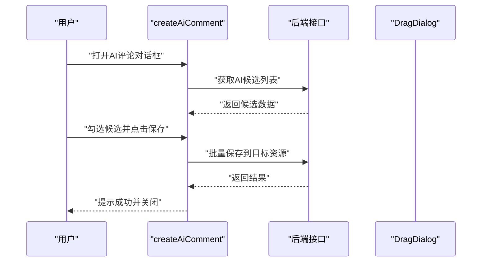
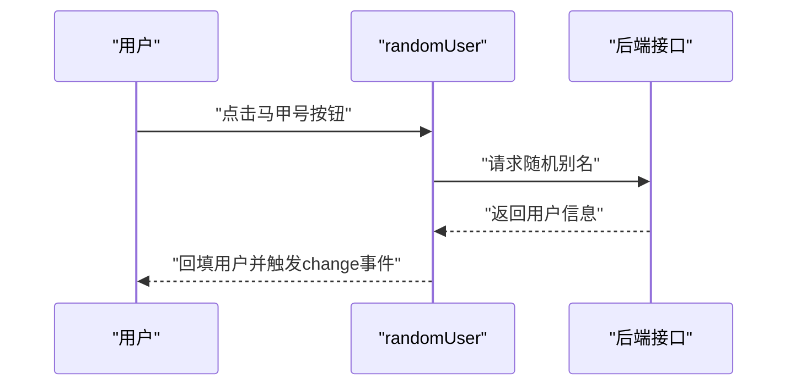
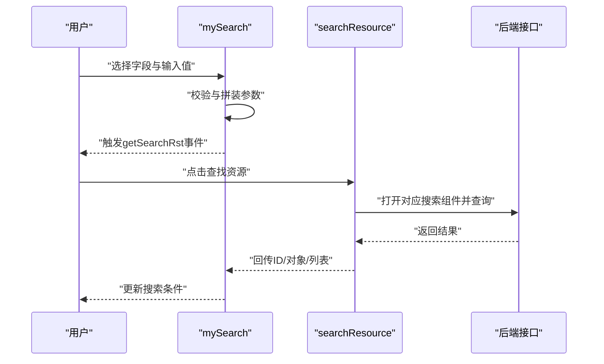
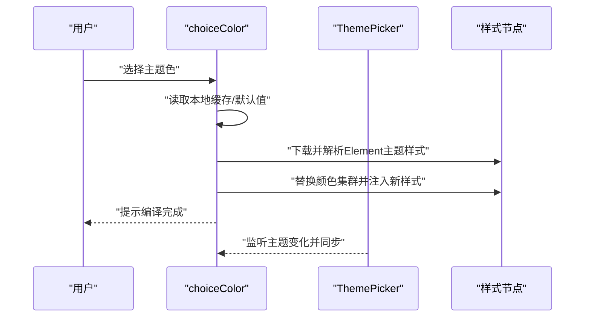
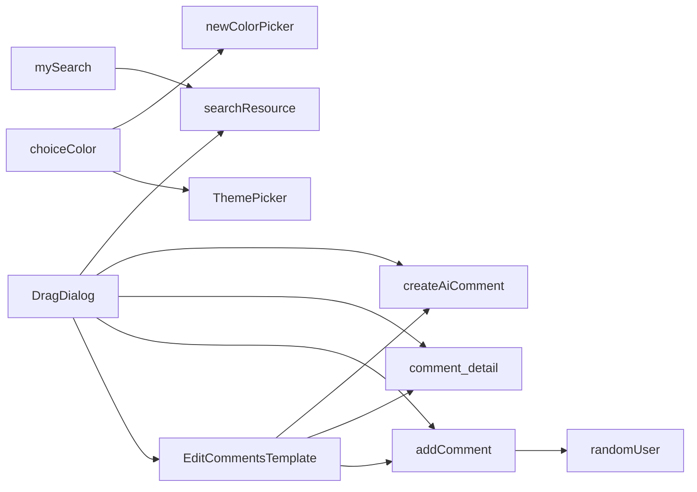

# 实用工具组件

<cite>
**本文档引用的文件**
- [EditCommentsTemplate.vue](file://src/components/leisu/EditCommentsTemplate.vue)
- [addComment.vue](file://src/components/leisu/addComment.vue)
- [mySearch.vue](file://src/components/leisu/mySearch.vue)
- [searchResource.vue](file://src/components/leisu/searchResource/searchResource.vue)
- [createAiComment.vue](file://src/components/leisu/createAiComment.vue)
- [comment_detail.vue](file://src/components/leisu/comment_detail.vue)
- [randomUser.vue](file://src/components/leisu/randomUser.vue)
- [choiceColor.vue](file://src/components/leisu/choiceColor.vue)
- [newColorPicker.vue](file://src/components/leisu/newColorPicker.vue)
- [dict.js](file://src/utils/dict.js)
- [DragDialog/index.vue](file://src/components/DragDialog/index.vue)
- [ThemePicker/index.vue](file://src/components/ThemePicker/index.vue)
- [SizeSelect/index.vue](file://src/components/SizeSelect/index.vue)
- [BackToTop/index.vue](file://src/components/BackToTop/index.vue)
</cite>

## 目录
1. [简介](#简介)
2. [项目结构](#项目结构)
3. [核心组件](#核心组件)
4. [架构总览](#架构总览)
5. [详细组件分析](#详细组件分析)
6. [依赖关系分析](#依赖关系分析)
7. [性能考量](#性能考量)
8. [故障排查指南](#故障排查指南)
9. [结论](#结论)
10. [附录](#附录)

## 简介
本文件聚焦于“实用工具组件”的技术文档，围绕评论模板编辑、评论添加、搜索功能、颜色选择等辅助能力展开，系统性阐述其架构设计、数据流与处理逻辑，并给出可视化图示与优化建议。这些组件广泛应用于内容运营、社区治理、搜索体验与主题定制等场景，显著提升开发效率与用户体验。

## 项目结构
实用工具组件主要分布在 src/components/leisu 与 src/components/leisu/searchResource 下，配合通用组件与工具字典，形成统一的交互与数据层：

- 评论相关：EditCommentsTemplate、addComment、comment_detail、createAiComment、randomUser
- 搜索相关：mySearch、searchResource
- 主题与颜色：choiceColor、newColorPicker、ThemePicker
- 通用交互：DragDialog、SizeSelect、BackToTop

图表来源
- [EditCommentsTemplate.vue:199-720](file://src/components/leisu/EditCommentsTemplate.vue#L199-L720)
- [addComment.vue:1-209](file://src/components/leisu/addComment.vue#L1-L209)
- [comment_detail.vue:134-195](file://src/components/leisu/comment_detail.vue#L134-L195)
- [createAiComment.vue:1-170](file://src/components/leisu/createAiComment.vue#L1-L170)
- [randomUser.vue:1-248](file://src/components/leisu/randomUser.vue#L1-L248)
- [mySearch.vue:100-159](file://src/components/leisu/mySearch.vue#L100-L159)
- [searchResource.vue:12-257](file://src/components/leisu/searchResource/searchResource.vue#L12-L257)
- [choiceColor.vue:12-31](file://src/components/leisu/choiceColor.vue#L12-L31)
- [newColorPicker.vue:6-11](file://src/components/leisu/newColorPicker.vue#L6-L11)
- [DragDialog/index.vue:3-12](file://src/components/DragDialog/index.vue#L3-L12)
- [ThemePicker/index.vue:1-175](file://src/components/ThemePicker/index.vue#L1-L175)
- [SizeSelect/index.vue:1-58](file://src/components/SizeSelect/index.vue#L1-L58)
- [BackToTop/index.vue:1-112](file://src/components/BackToTop/index.vue#L1-L112)

章节来源
- [EditCommentsTemplate.vue:199-720](file://src/components/leisu/EditCommentsTemplate.vue#L199-L720)
- [mySearch.vue:100-159](file://src/components/leisu/mySearch.vue#L100-L159)
- [searchResource.vue:12-257](file://src/components/leisu/searchResource/searchResource.vue#L12-L257)
- [choiceColor.vue:12-31](file://src/components/leisu/choiceColor.vue#L12-L31)
- [newColorPicker.vue:6-11](file://src/components/leisu/newColorPicker.vue#L6-L11)
- [DragDialog/index.vue:3-12](file://src/components/DragDialog/index.vue#L3-L12)
- [ThemePicker/index.vue:1-175](file://src/components/ThemePicker/index.vue#L1-L175)
- [SizeSelect/index.vue:1-58](file://src/components/SizeSelect/index.vue#L1-L58)
- [BackToTop/index.vue:1-112](file://src/components/BackToTop/index.vue#L1-L112)

## 核心组件
- 评论模板编辑（EditCommentsTemplate）：提供评论列表、热门评论、排序筛选、批量操作、附件展示、点赞详情、AI评论入口等能力，覆盖社区、资讯、评分等多个来源。
- 评论添加（addComment）：支持富文本编辑、快捷回复、附件上传、随机马甲/官方账号选择，按来源路由不同接口。
- 评论详情/编辑（comment_detail）：统一的评论编辑与状态变更（隐藏/删除）流程，兼容多来源接口。
- AI评论（createAiComment）：从AI生成候选中批量勾选并保存到目标资源。
- 随机马甲（randomUser）：提供官方账号下拉与随机马甲号生成，支持过滤与默认填充。
- 搜索（mySearch + searchResource）：多形态输入（下拉、输入、级联、日期、滑块、单选）、参数拼装与资源选择对话框联动。
- 颜色选择（choiceColor + newColorPicker + ThemePicker）：主题色动态编译、本地持久化、预定义色板与Element主题切换。

章节来源
- [EditCommentsTemplate.vue:748-808](file://src/components/leisu/EditCommentsTemplate.vue#L748-L808)
- [addComment.vue:68-206](file://src/components/leisu/addComment.vue#L68-L206)
- [comment_detail.vue:196-477](file://src/components/leisu/comment_detail.vue#L196-L477)
- [createAiComment.vue:22-95](file://src/components/leisu/createAiComment.vue#L22-L95)
- [randomUser.vue:36-225](file://src/components/leisu/randomUser.vue#L36-L225)
- [mySearch.vue:161-408](file://src/components/leisu/mySearch.vue#L161-L408)
- [searchResource.vue:347-495](file://src/components/leisu/searchResource/searchResource.vue#L347-L495)
- [choiceColor.vue:32-204](file://src/components/leisu/choiceColor.vue#L32-L204)
- [newColorPicker.vue:12-42](file://src/components/leisu/newColorPicker.vue#L12-L42)
- [ThemePicker/index.vue:10-156](file://src/components/ThemePicker/index.vue#L10-L156)

## 架构总览
整体采用“容器组件 + 业务子组件 + 通用交互组件”分层模式：
- 容器组件：EditCommentsTemplate、mySearch、searchResource
- 业务子组件：addComment、comment_detail、createAiComment、randomUser
- 通用交互组件：DragDialog、ThemePicker、SizeSelect、BackToTop

图表来源
- [EditCommentsTemplate.vue:748-752](file://src/components/leisu/EditCommentsTemplate.vue#L748-L752)
- [addComment.vue:68-71](file://src/components/leisu/addComment.vue#L68-L71)
- [comment_detail.vue:214-218](file://src/components/leisu/comment_detail.vue#L214-L218)
- [createAiComment.vue:4-6](file://src/components/leisu/createAiComment.vue#L4-L6)
- [randomUser.vue:36-38](file://src/components/leisu/randomUser.vue#L36-L38)
- [mySearch.vue:161-164](file://src/components/leisu/mySearch.vue#L161-L164)
- [searchResource.vue:347-349](file://src/components/leisu/searchResource/searchResource.vue#L347-L349)
- [DragDialog/index.vue:15-46](file://src/components/DragDialog/index.vue#L15-L46)
- [choiceColor.vue:32-48](file://src/components/leisu/choiceColor.vue#L32-L48)
- [ThemePicker/index.vue:14-20](file://src/components/ThemePicker/index.vue#L14-L20)
- [newColorPicker.vue:12-18](file://src/components/leisu/newColorPicker.vue#L12-L18)
- [SizeSelect/index.vue:15-35](file://src/components/SizeSelect/index.vue#L15-L35)
- [BackToTop/index.vue:9-45](file://src/components/BackToTop/index.vue#L9-L45)

## 详细组件分析

### 评论模板编辑（EditCommentsTemplate）
- 功能要点
  - 列表渲染：支持热门评论与普通评论，含楼层、用户、时间、IP、点赞数、附件、回复等。
  - 排序与筛选：按“全部/楼主”、“最新/最早/精选”切换。
  - 批量操作：批量隐藏/删除/取消隐藏/取消删除，支持多选。
  - 互动能力：点赞、回复、编辑、隐藏/删除、设置神评、转为帖子等。
  - AI评论：一键生成候选并批量保存。
  - 内容格式化：富文本内容安全渲染。
- 关键流程（批量操作）

图表来源
- [EditCommentsTemplate.vue:208-226](file://src/components/leisu/EditCommentsTemplate.vue#L208-L226)
- [EditCommentsTemplate.vue:782-808](file://src/components/leisu/EditCommentsTemplate.vue#L782-L808)

章节来源
- [EditCommentsTemplate.vue:199-720](file://src/components/leisu/EditCommentsTemplate.vue#L199-L720)
- [EditCommentsTemplate.vue:722-752](file://src/components/leisu/EditCommentsTemplate.vue#L722-L752)

### 评论添加（addComment）
- 功能要点
  - 富文本编辑器集成，支持表情/动图插入。
  - 快捷回复列表（本地持久化）。
  - 附件上传（图片，支持裁剪开关、数量与尺寸配置）。
  - 随机马甲/官方账号选择（权限控制）。
  - 按来源路由不同接口（社区、资讯、评分、视频）。
- 关键流程（保存评论）

图表来源
- [addComment.vue:126-157](file://src/components/leisu/addComment.vue#L126-L157)
- [addComment.vue:172-205](file://src/components/leisu/addComment.vue#L172-L205)
- [DragDialog/index.vue:3-12](file://src/components/DragDialog/index.vue#L3-L12)

章节来源
- [addComment.vue:68-206](file://src/components/leisu/addComment.vue#L68-L206)

### 评论详情/编辑（comment_detail）
- 功能要点
  - 统一编辑界面，支持内容与附件修改。
  - 支持隐藏/删除评论，带原因弹窗确认。
  - 多来源接口适配（社区、资讯、评分、视频）。
- 关键流程（编辑并保存）

图表来源
- [comment_detail.vue:249-311](file://src/components/leisu/comment_detail.vue#L249-L311)
- [comment_detail.vue:312-350](file://src/components/leisu/comment_detail.vue#L312-L350)

章节来源
- [comment_detail.vue:196-477](file://src/components/leisu/comment_detail.vue#L196-L477)

### AI评论（createAiComment）
- 功能要点
  - 从AI生成候选中批量勾选，支持全选/反选/刷新。
  - 按来源保存到对应资源（资讯/帖子）。
- 关键流程（保存AI评论）

图表来源
- [createAiComment.vue:30-49](file://src/components/leisu/createAiComment.vue#L30-L49)
- [createAiComment.vue:67-94](file://src/components/leisu/createAiComment.vue#L67-L94)

章节来源
- [createAiComment.vue:1-170](file://src/components/leisu/createAiComment.vue#L1-L170)

### 随机马甲（randomUser）
- 功能要点
  - 官方账号下拉选择（支持过滤与团队标识）。
  - 随机马甲号生成（从别名池抽取）。
  - 默认官方账号策略（帖子场景优先第二项）。
- 关键流程（随机马甲）

图表来源
- [randomUser.vue:169-176](file://src/components/leisu/randomUser.vue#L169-L176)
- [randomUser.vue:208-223](file://src/components/leisu/randomUser.vue#L208-L223)

章节来源
- [randomUser.vue:36-225](file://src/components/leisu/randomUser.vue#L36-L225)

### 搜索（mySearch + searchResource）
- 功能要点
  - 多输入形态：下拉、输入、级联、日期范围、滑块区间、单选。
  - 参数拼装与校验：空值允许策略、日期/区间拼接。
  - 资源选择对话框：按来源映射到具体搜索组件（比赛、帖子、用户、资讯等）。
- 关键流程（搜索与资源选择）

图表来源
- [mySearch.vue:311-341](file://src/components/leisu/mySearch.vue#L311-L341)
- [mySearch.vue:389-401](file://src/components/leisu/mySearch.vue#L389-L401)
- [searchResource.vue:434-468](file://src/components/leisu/searchResource/searchResource.vue#L434-L468)

章节来源
- [mySearch.vue:161-408](file://src/components/leisu/mySearch.vue#L161-L408)
- [searchResource.vue:347-495](file://src/components/leisu/searchResource/searchResource.vue#L347-L495)
- [dict.js:1-11](file://src/utils/dict.js#L1-L11)

### 颜色选择（choiceColor + newColorPicker + ThemePicker）
- 功能要点
  - choiceColor：字体色、背景色、主题色三通道，本地持久化，动态编译Element主题。
  - newColorPicker：预定义色板，双向绑定。
  - ThemePicker：Element主题色选择器，内置集群计算与样式注入。
- 关键流程（主题色动态编译）

图表来源
- [choiceColor.vue:59-111](file://src/components/leisu/choiceColor.vue#L59-L111)
- [choiceColor.vue:138-144](file://src/components/leisu/choiceColor.vue#L138-L144)
- [ThemePicker/index.vue:33-85](file://src/components/ThemePicker/index.vue#L33-L85)

章节来源
- [choiceColor.vue:32-204](file://src/components/leisu/choiceColor.vue#L32-L204)
- [newColorPicker.vue:12-42](file://src/components/leisu/newColorPicker.vue#L12-L42)
- [ThemePicker/index.vue:10-156](file://src/components/ThemePicker/index.vue#L10-L156)

## 依赖关系分析
- 组件耦合
  - EditCommentsTemplate 依赖 addComment、comment_detail、createAiComment、DragDialog、Pagination 等。
  - addComment 依赖 randomUser、DragDialog、RichEditor、UploadPhoto。
  - mySearch 依赖 searchResource、newDatePicker、各种选择器组件。
  - choiceColor 依赖 newColorPicker、ThemePicker、Element UI 主题样式。
- 外部依赖
  - API 层：community、info、match、group、member 等模块接口。
  - 工具字典：fromCompUserObj、resourceTextJump 等映射。

图表来源
- [EditCommentsTemplate.vue:748-752](file://src/components/leisu/EditCommentsTemplate.vue#L748-L752)
- [addComment.vue:68-71](file://src/components/leisu/addComment.vue#L68-L71)
- [comment_detail.vue:214-218](file://src/components/leisu/comment_detail.vue#L214-L218)
- [createAiComment.vue:4-6](file://src/components/leisu/createAiComment.vue#L4-L6)
- [randomUser.vue:36-38](file://src/components/leisu/randomUser.vue#L36-L38)
- [mySearch.vue:161-164](file://src/components/leisu/mySearch.vue#L161-L164)
- [searchResource.vue:347-349](file://src/components/leisu/searchResource/searchResource.vue#L347-L349)
- [choiceColor.vue:32-48](file://src/components/leisu/choiceColor.vue#L32-L48)
- [ThemePicker/index.vue:14-20](file://src/components/ThemePicker/index.vue#L14-L20)
- [newColorPicker.vue:12-18](file://src/components/leisu/newColorPicker.vue#L12-L18)
- [DragDialog/index.vue:15-46](file://src/components/DragDialog/index.vue#L15-L46)

章节来源
- [EditCommentsTemplate.vue:722-752](file://src/components/leisu/EditCommentsTemplate.vue#L722-L752)
- [addComment.vue:63-68](file://src/components/leisu/addComment.vue#L63-L68)
- [mySearch.vue:184-222](file://src/components/leisu/mySearch.vue#L184-L222)
- [searchResource.vue:326-347](file://src/components/leisu/searchResource/searchResource.vue#L326-L347)
- [dict.js:1-11](file://src/utils/dict.js#L1-L11)

## 性能考量
- 列表渲染
  - 使用虚拟滚动或分页（评论列表已引入分页组件）降低DOM压力。
  - 内容渲染采用 v-html 时注意安全过滤与懒加载图片。
- 搜索输入
  - 输入防抖与空值校验，避免无效请求。
  - 级联/日期/滑块等复杂输入建议延迟计算与缓存中间态。
- 主题切换
  - 动态样式注入应限制频率，合并多次变更，避免频繁重绘。
- 附件上传
  - 控制并发与大小阈值，启用进度反馈与失败重试。

## 故障排查指南
- 评论保存失败
  - 检查用户选择（必须）与附件格式化（key/name/尺寸）。
  - 核对来源路由与接口映射（社区/资讯/评分/视频）。
- 批量操作异常
  - 确认多选集合非空，核对权限与来源接口。
- 搜索无结果
  - 校验字段映射与 allowEmpty 策略，确认资源选择对话框已正确回传。
- 主题切换无效
  - 检查 Element 版本与样式注入节点是否存在，确认颜色集群计算与替换逻辑。

章节来源
- [addComment.vue:172-205](file://src/components/leisu/addComment.vue#L172-L205)
- [EditCommentsTemplate.vue:208-226](file://src/components/leisu/EditCommentsTemplate.vue#L208-L226)
- [mySearch.vue:311-341](file://src/components/leisu/mySearch.vue#L311-L341)
- [choiceColor.vue:59-111](file://src/components/leisu/choiceColor.vue#L59-L111)

## 结论
实用工具组件通过清晰的职责划分与通用交互封装，实现了评论治理、搜索体验与主题定制的高效协同。容器组件承载业务编排，子组件专注单一能力，通用组件提供一致的交互体验。建议在后续迭代中进一步增强错误恢复、性能监控与可访问性，持续提升稳定性与可维护性。

## 附录
- 通用组件补充
  - DragDialog：统一的可拖拽对话框，简化弹窗生命周期管理。
  - SizeSelect：全局尺寸切换，结合缓存刷新保障一致性。
  - BackToTop：平滑回到顶部，改善长列表体验。

章节来源
- [DragDialog/index.vue:15-46](file://src/components/DragDialog/index.vue#L15-L46)
- [SizeSelect/index.vue:15-54](file://src/components/SizeSelect/index.vue#L15-L54)
- [BackToTop/index.vue:9-81](file://src/components/BackToTop/index.vue#L9-L81)