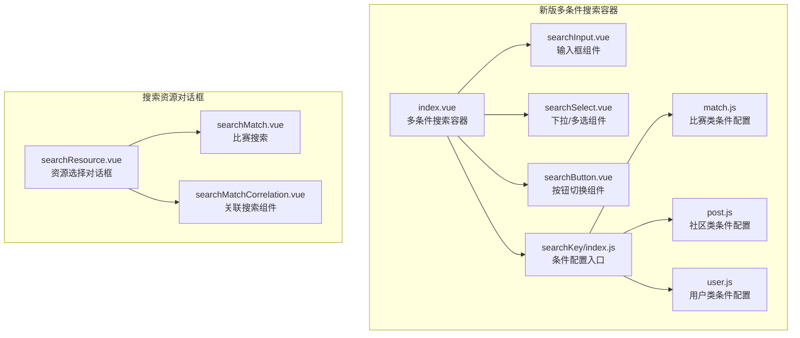
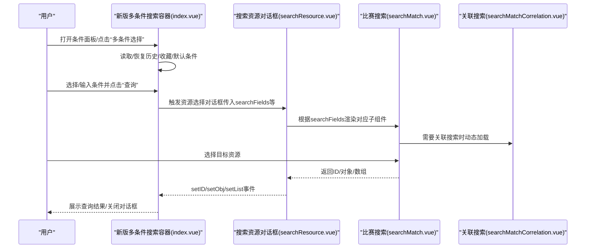
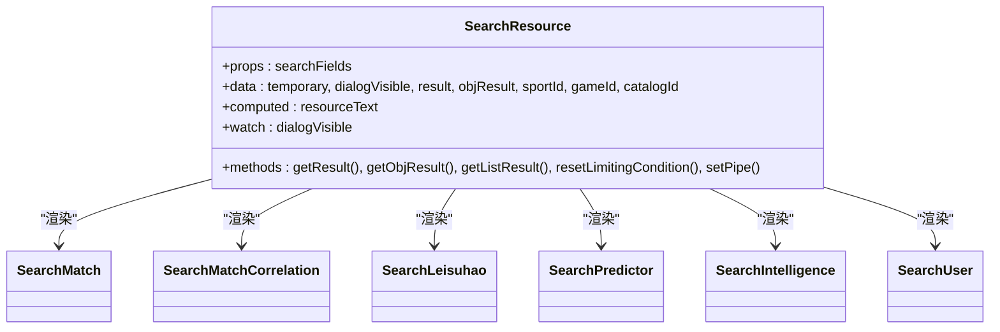
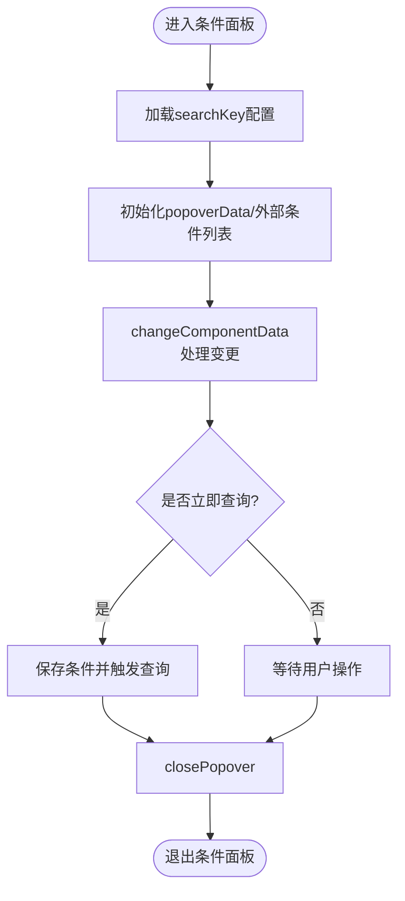
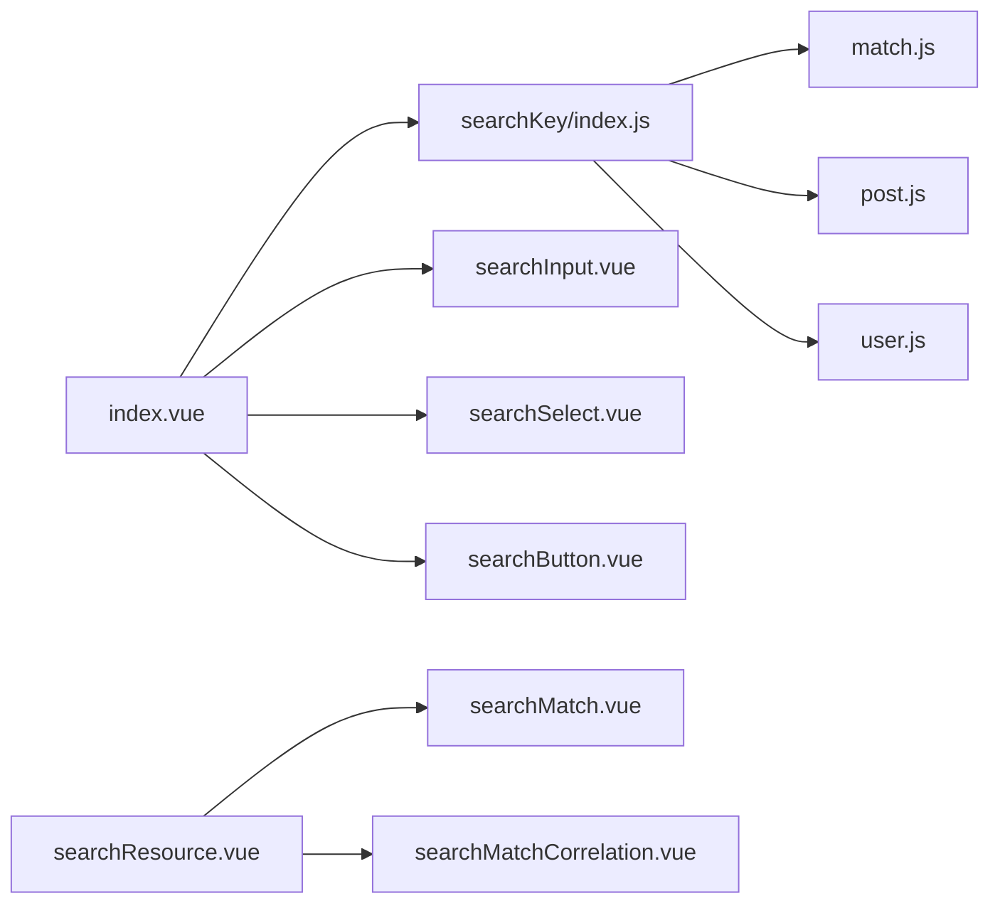

# 搜索资源组件

<cite>
**本文档引用的文件**
- [searchResource.vue](file://src/components/leisu/searchResource/searchResource.vue)
- [read.md](file://src/components/leisu/searchResource/read.md)
- [index.vue](file://src/components/newMySearch/index.vue)
- [searchInput.vue](file://src/components/newMySearch/components/searchInput.vue)
- [searchButton.vue](file://src/components/newMySearch/components/searchButton.vue)
- [searchSelect.vue](file://src/components/newMySearch/components/searchSelect.vue)
- [searchKey/index.js](file://src/components/newMySearch/components/searchKey/index.js)
- [match.js](file://src/components/newMySearch/components/searchKey/compKey/match.js)
- [post.js](file://src/components/newMySearch/components/searchKey/compKey/post.js)
- [user.js](file://src/components/newMySearch/components/searchKey/compKey/user.js)
- [searchMatch.vue](file://src/components/leisu/searchResource/searchDependence/searchMatch.vue)
- [searchMatchCorrelation.vue](file://src/components/leisu/searchResource/searchDependence/searchMatchCorrelation.vue)
</cite>

## 目录
1. [简介](#简介)
2. [项目结构](#项目结构)
3. [核心组件](#核心组件)
4. [架构总览](#架构总览)
5. [详细组件分析](#详细组件分析)
6. [依赖关系分析](#依赖关系分析)
7. [性能考虑](#性能考虑)
8. [故障排查指南](#故障排查指南)
9. [结论](#结论)
10. [附录](#附录)

## 简介
本技术文档围绕“搜索资源组件”展开，系统化梳理多维度搜索、资源依赖、搜索建议、搜索框组件、搜索历史、热门搜索、搜索结果展示等核心能力。文档重点阐述搜索资源组件在内容发现与用户体验优化中的作用，并提供搜索依赖项管理、搜索算法优化与性能提升的技术方案，涵盖分类管理、权重调整与结果排序等业务逻辑。

## 项目结构
搜索资源组件由两大部分构成：
- 新版多条件搜索容器：负责条件面板、历史/收藏、快捷条件、查询触发与结果回传。
- 搜索资源对话框：按资源类型动态加载对应搜索子组件，统一接收与回传搜索结果。

**图表来源**
- [index.vue:140-308](file://src/components/newMySearch/index.vue#L140-L308)
- [searchInput.vue:1-255](file://src/components/newMySearch/components/searchInput.vue#L1-L255)
- [searchSelect.vue:1-342](file://src/components/newMySearch/components/searchSelect.vue#L1-L342)
- [searchButton.vue:1-112](file://src/components/newMySearch/components/searchButton.vue#L1-L112)
- [searchKey/index.js:43-56](file://src/components/newMySearch/components/searchKey/index.js#L43-L56)
- [match.js:17-642](file://src/components/newMySearch/components/searchKey/compKey/match.js#L17-L642)
- [post.js:28-632](file://src/components/newMySearch/components/searchKey/compKey/post.js#L28-L632)
- [user.js:22-334](file://src/components/newMySearch/components/searchKey/compKey/user.js#L22-L334)
- [searchResource.vue:12-258](file://src/components/leisu/searchResource/searchResource.vue#L12-L258)
- [searchMatch.vue:67-159](file://src/components/leisu/searchResource/searchDependence/searchMatch.vue#L67-L159)
- [searchMatchCorrelation.vue:2-29](file://src/components/leisu/searchResource/searchDependence/searchMatchCorrelation.vue#L2-L29)

**章节来源**
- [searchResource.vue:12-258](file://src/components/leisu/searchResource/searchResource.vue#L12-L258)
- [index.vue:140-308](file://src/components/newMySearch/index.vue#L140-L308)

## 核心组件
- 搜索资源对话框（searchResource.vue）
  - 动态路由资源类型，按 sportId/gameId/catalogId 等上下文参数渲染对应搜索子组件。
  - 统一接收子组件返回的 ID/对象/数组，触发 setID/setObj/setList 事件，关闭对话框。
  - 提供 resetLimitingCondition 在对话框关闭时重置约束参数，避免污染后续搜索。
- 新版多条件搜索容器（index.vue）
  - 弹出式条件面板，支持历史/收藏、快捷条件拖拽排序、一键查询、清空等。
  - 通过 $attrs/$listeners 透传给内部搜索子组件，支持 canMoreChose 等细粒度控制。
  - 本地持久化条件，支持默认条件、收藏条件与历史条件的读写与排序。
- 搜索输入/下拉/按钮组件
  - 输入组件：支持模糊/精确模式切换、输入校验、清空与回车查询。
  - 下拉组件：支持多选、分组、本地过滤、精确/模糊模式切换与数值校验。
  - 按钮组件：支持互斥按钮组、必填/非必填、一键清空。
- 搜索条件配置（searchKey/index.js + 各业务模块）
  - 以模块化方式定义各业务的搜索条件键、类型、默认值、互斥关系、参数拼接规则等。
  - 支持 parameterSuffix/parameterValue/parameterKey 等高级参数映射，适配复杂后端接口。

**章节来源**
- [searchResource.vue:347-496](file://src/components/leisu/searchResource/searchResource.vue#L347-L496)
- [index.vue:322-461](file://src/components/newMySearch/index.vue#L322-L461)
- [searchInput.vue:22-111](file://src/components/newMySearch/components/searchInput.vue#L22-L111)
- [searchSelect.vue:70-194](file://src/components/newMySearch/components/searchSelect.vue#L70-L194)
- [searchButton.vue:30-46](file://src/components/newMySearch/components/searchButton.vue#L30-L46)
- [searchKey/index.js:43-56](file://src/components/newMySearch/components/searchKey/index.js#L43-L56)

## 架构总览
搜索资源组件采用“容器 + 动态子组件 + 条件配置”的分层设计：
- 容器层：index.vue 负责条件面板与历史/收藏管理；searchResource.vue 负责资源选择对话框。
- 组件层：searchInput/searchSelect/searchButton 提供通用输入能力；searchMatch/searchMatchCorrelation 等提供业务搜索能力。
- 配置层：searchKey/index.js 与各业务模块（match/post/user）定义搜索条件与参数映射。

**图表来源**
- [index.vue:140-308](file://src/components/newMySearch/index.vue#L140-L308)
- [searchResource.vue:12-258](file://src/components/leisu/searchResource/searchResource.vue#L12-L258)
- [searchMatch.vue:67-159](file://src/components/leisu/searchResource/searchDependence/searchMatch.vue#L67-L159)
- [searchMatchCorrelation.vue:2-29](file://src/components/leisu/searchResource/searchDependence/searchMatchCorrelation.vue#L2-L29)

## 详细组件分析

### 搜索资源对话框（searchResource.vue）
- 功能要点
  - 多资源类型路由：根据 searchFields 渲染不同子组件（比赛、帖子、用户、专家号、资讯专题等）。
  - 上下文参数：sportId/gameId/catalogId 用于限定搜索范围与接口选择。
  - 结果回传：统一通过 getResult/getObjResult/getListResult 事件回传，触发 setID/setObj/setList 并关闭对话框。
  - 限制条件重置：watch(dialogVisible) 在关闭时重置 sportId/catalogId，避免跨次搜索污染。
- 依赖关系
  - 动态导入大量搜索子组件，形成“资源类型 → 子组件”的映射。
  - 通过 $attrs/$listeners 透传给子组件，保证灵活性与一致性。

**图表来源**
- [searchResource.vue:347-496](file://src/components/leisu/searchResource/searchResource.vue#L347-L496)
- [searchMatch.vue:183-186](file://src/components/leisu/searchResource/searchDependence/searchMatch.vue#L183-L186)
- [searchMatchCorrelation.vue:39-48](file://src/components/leisu/searchResource/searchDependence/searchMatchCorrelation.vue#L39-L48)

**章节来源**
- [searchResource.vue:12-258](file://src/components/leisu/searchResource/searchResource.vue#L12-L258)
- [searchResource.vue:347-496](file://src/components/leisu/searchResource/searchResource.vue#L347-L496)

### 新版多条件搜索容器（index.vue）
- 功能要点
  - 条件面板：基于 searchKey/index.js 的配置生成组件树，支持输入、下拉、日期、范围、按钮等。
  - 历史/收藏/默认：本地存储条件，支持收藏、默认、历史标签页与排序。
  - 快捷条件：支持外部显示条件拖拽排序与增删。
  - 查询触发：changeData 事件驱动，支持立即查询与延迟查询。
  - 参数透传：$attrs/$listeners 透传给子组件，支持 canMoreChose 等细粒度控制。
- 交互流程
  - changeComponentData：处理输入/下拉/日期等变更，同步 popoverData 并触发保存或立即查询。
  - resetPopover：重置默认值、恢复历史/默认、应用父组件参数。
  - saveData/closePopover：保存条件、关闭面板、触发查询。

**图表来源**
- [index.vue:460-618](file://src/components/newMySearch/index.vue#L460-L618)

**章节来源**
- [index.vue:322-461](file://src/components/newMySearch/index.vue#L322-L461)
- [index.vue:631-783](file://src/components/newMySearch/index.vue#L631-L783)

### 搜索输入组件（searchInput.vue）
- 功能要点
  - 模糊/精确切换：通过 precise 控制，支持精确/模糊两种匹配策略。
  - 输入校验：支持整数校验等规则，不符合则提示并清空。
  - 清空与回车：支持清空按钮点击阻止失焦、回车触发查询。
  - 外部图标：支持外部显示时的关闭/互斥图标。
- 性能与体验
  - 使用 lodash 深拷贝 configData，避免响应式副作用。
  - 通过 styleWidth 动态计算宽度，适配不同布局。

**章节来源**
- [searchInput.vue:22-111](file://src/components/newMySearch/components/searchInput.vue#L22-L111)

### 搜索下拉组件（searchSelect.vue）
- 功能要点
  - 多选/分组/本地过滤：支持多选、分组选项、本地过滤与折叠标签。
  - 数值校验：支持整数校验，非整数自动过滤。
  - 组合筛选：selectGroupType 支持价格/圈子/渠道等组合筛选逻辑。
  - 精确/模糊：通过 precise 控制精确/模糊模式，同步 value 类型。
- 性能与体验
  - 通过 collapse-tags 与宽度自适应，优化长列表展示。
  - visibleChange 与 focus 状态联动，提升交互感知。

**章节来源**
- [searchSelect.vue:70-194](file://src/components/newMySearch/components/searchSelect.vue#L70-L194)

### 搜索按钮组件（searchButton.vue）
- 功能要点
  - 互斥按钮组：支持必填/非必填，非必填时点击可一键清空。
  - 外部显示：支持外部显示与激活态样式。
- 适用场景
  - 状态筛选、类型切换等互斥条件。

**章节来源**
- [searchButton.vue:30-46](file://src/components/newMySearch/components/searchButton.vue#L30-L46)

### 搜索条件配置（searchKey/index.js + 业务模块）
- 功能要点
  - 条件元数据：label/key/compType/more/opts/precise/showPrecise/rules/keyJoinType/defaultValue/parameterSuffix/parameterValue/parameterKey/isBtnRequired/maxCount/minCount/selectGroup/selectGroupType/filterable 等。
  - 业务模块：match/post/user 等模块按业务拆分，统一导出。
  - 互斥与拼接：keyJoinType 支持互斥字段拼接与特定场景的参数拼接方式。
- 价值
  - 一套配置即可驱动多处 UI 与查询逻辑，降低重复开发成本。

**章节来源**
- [searchKey/index.js:43-56](file://src/components/newMySearch/components/searchKey/index.js#L43-L56)
- [match.js:17-642](file://src/components/newMySearch/components/searchKey/compKey/match.js#L17-L642)
- [post.js:28-632](file://src/components/newMySearch/components/searchKey/compKey/post.js#L28-L632)
- [user.js:22-334](file://src/components/newMySearch/components/searchKey/compKey/user.js#L22-L334)

### 关联搜索组件（searchMatchCorrelation.vue）
- 功能要点
  - 根据 matchCompType（Match/Season/Comp/Team/Stage）与 sportId 动态选择对应业务组件。
  - 支持外部传入 sportList/sportId，适配多运动场景。
- 适用场景
  - 斯诺克等特定运动的关联搜索（如赛季/赛事/队伍/阶段）。

**章节来源**
- [searchMatchCorrelation.vue:39-75](file://src/components/leisu/searchResource/searchDependence/searchMatchCorrelation.vue#L39-L75)

## 依赖关系分析
- 组件耦合
  - searchResource.vue 与众多搜索子组件松耦合，通过 props 与事件通信。
  - index.vue 与 searchKey/index.js 强耦合，通过配置驱动 UI 与查询。
- 数据流
  - 输入组件通过 changeData 事件向 index.vue 汇总，index.vue 决策是否立即查询与保存。
  - searchResource.vue 通过 setID/setObj/setList 事件回传结果，index.vue 接收并处理。
- 外部依赖
  - 通过 $attrs/$listeners 与外部组件解耦，支持 canMoreChose 等细粒度控制。
  - read.md 提示 batch_add_from_jumpto_comp 已废弃，改用 $attrs 逐实例控制。

**图表来源**
- [searchKey/index.js:43-56](file://src/components/newMySearch/components/searchKey/index.js#L43-L56)
- [match.js:17-642](file://src/components/newMySearch/components/searchKey/compKey/match.js#L17-L642)
- [post.js:28-632](file://src/components/newMySearch/components/searchKey/compKey/post.js#L28-L632)
- [user.js:22-334](file://src/components/newMySearch/components/searchKey/compKey/user.js#L22-L334)
- [index.vue:322-378](file://src/components/newMySearch/index.vue#L322-L378)
- [searchResource.vue:260-409](file://src/components/leisu/searchResource/searchResource.vue#L260-L409)

**章节来源**
- [read.md:1-4](file://src/components/leisu/searchResource/read.md#L1-L4)
- [index.vue:322-378](file://src/components/newMySearch/index.vue#L322-L378)
- [searchResource.vue:260-409](file://src/components/leisu/searchResource/searchResource.vue#L260-L409)

## 性能考虑
- 组件渲染优化
  - searchResource.vue 使用 v-if 按需渲染子组件，减少初始渲染压力。
  - index.vue 通过 popoverData 的深拷贝与响应式更新，避免不必要的重渲染。
- 交互体验优化
  - 输入/下拉组件支持清空阻止失焦、回车查询、折叠标签等，提升输入效率。
  - 外部快捷条件支持拖拽排序，减少重复输入。
- 数据持久化
  - 本地存储历史/收藏/默认条件，减少重复配置成本。
- 参数透传
  - $attrs/$listeners 降低耦合，避免全局状态污染，提升可维护性。

[本节为通用指导，无需列出具体文件来源]

## 故障排查指南
- 问题：搜索结果为空
  - 检查 searchResource.vue 的 getResult/getObjResult/getListResult 是否正确触发 setID/setObj/setList。
  - 检查子组件是否正确返回值，必要时在子组件中增加错误提示。
- 问题：条件面板不显示历史/收藏
  - 检查 displayHistory 与本地存储是否存在数据。
  - 确认 localStorageData 是否被正确读取与排序。
- 问题：外部传参无效
  - 确认是否使用 $attrs/$listeners 透传，而非 batch_add_from_jumpto_comp 注入方式。
  - 检查 outParameterFormat 是否正确解析并应用参数。
- 问题：互斥条件冲突
  - 检查 keyJoinType 与互斥列表是否正确配置，确保同一时间仅有一个条件生效。

**章节来源**
- [searchResource.vue:433-468](file://src/components/leisu/searchResource/searchResource.vue#L433-L468)
- [index.vue:396-408](file://src/components/newMySearch/index.vue#L396-L408)
- [read.md:1-4](file://src/components/leisu/searchResource/read.md#L1-L4)

## 结论
搜索资源组件通过“容器 + 动态子组件 + 条件配置”的架构，实现了多维度搜索、资源依赖管理与灵活的结果回传。新版多条件搜索容器提供了强大的历史/收藏/快捷条件能力，结合搜索资源对话框的动态路由与上下文参数，显著提升了内容发现效率与用户体验。通过合理的参数透传与配置化设计，组件具备良好的扩展性与可维护性，适合在复杂业务场景中持续演进。

[本节为总结性内容，无需列出具体文件来源]

## 附录
- 术语
  - 模糊/精确：通过 precise 控制，模糊使用包含匹配，精确使用等值匹配。
  - 互斥条件：通过 keyJoinType 或互斥列表确保同一时间仅有一个条件生效。
  - 参数映射：通过 parameterSuffix/parameterValue/parameterKey 将前端键映射到后端参数。
- 最佳实践
  - 使用 $attrs/$listeners 替代全局注入，逐实例控制 canMoreChose 等特性。
  - 为复杂查询场景提供默认条件与收藏条件，提升复用率。
  - 对输入/下拉组件增加必要的校验与提示，提升输入质量。

[本节为补充说明，无需列出具体文件来源]