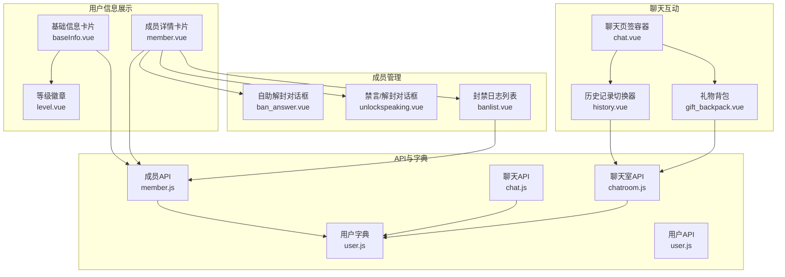
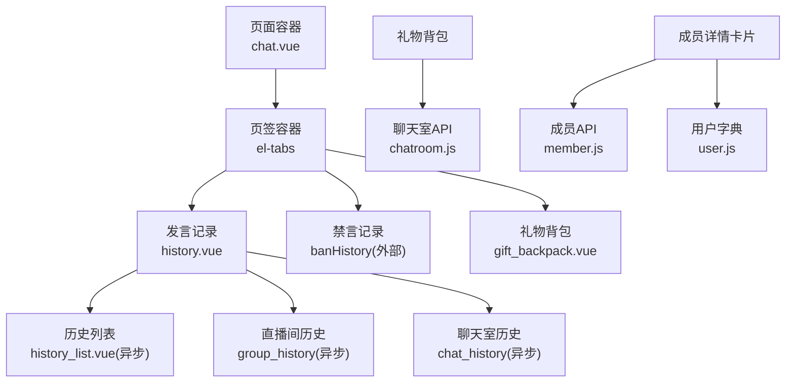
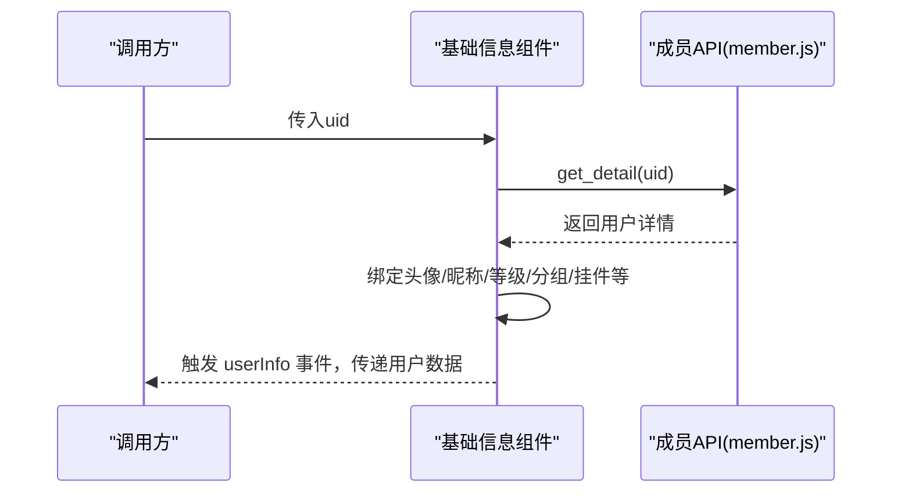
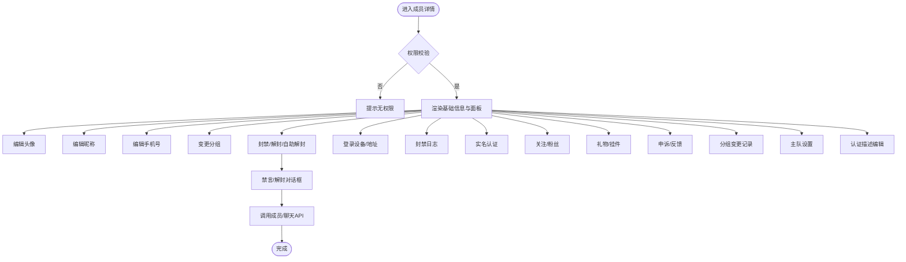
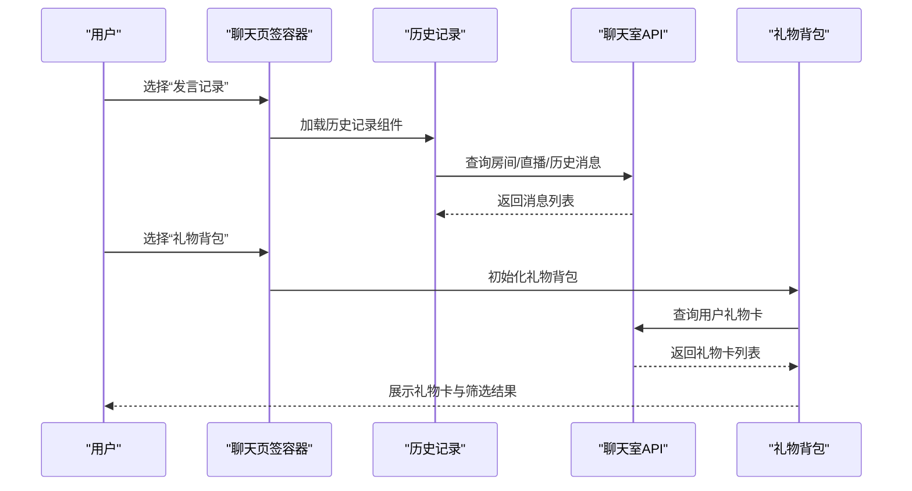
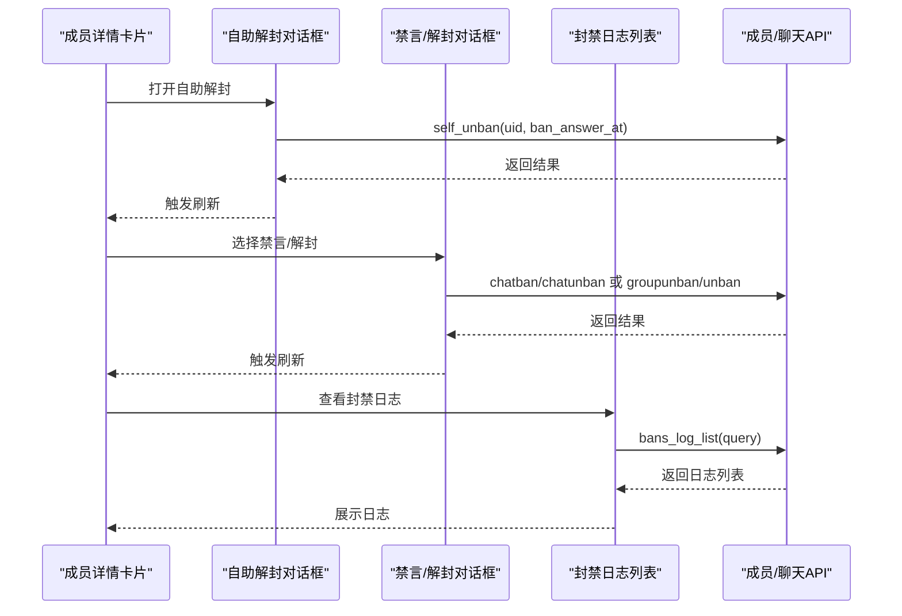
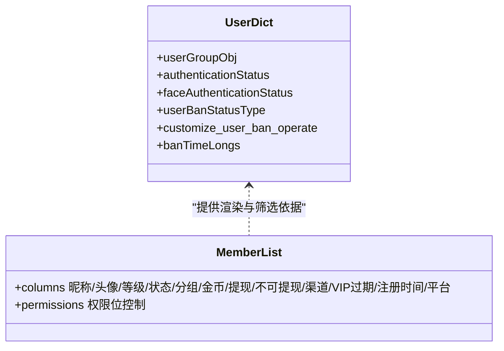
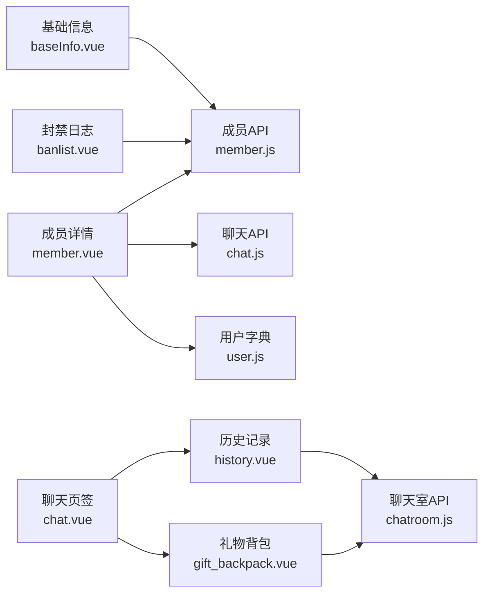

# 用户信息组件

<cite>
**本文引用的文件**
- [baseInfo.vue](file://src/components/leisu/peopleInfo/baseInfo.vue)
- [member.vue](file://src/components/leisu/peopleInfo/member/member.vue)
- [chat.vue](file://src/components/leisu/peopleInfo/chat/chat.vue)
- [history.vue](file://src/components/leisu/peopleInfo/chat/components/history.vue)
- [gift_backpack.vue](file://src/components/leisu/peopleInfo/chat/components/gift_backpack.vue)
- [user.js](file://src/utils/dict/user.js)
- [user.js](file://src/api/user.js)
- [member.js](file://src/api/member.js)
- [chat.js](file://src/api/chat.js)
- [chatroom.js](file://src/api/chatroom.js)
- [ban_answer.vue](file://src/components/leisu/peopleInfo/member/component/ban_answer.vue)
- [unlockspeaking.vue](file://src/components/leisu/peopleInfo/member/component/unlockspeaking.vue)
- [banlist.vue](file://src/views/member/banlist.vue)
- [level.vue](file://src/components/leisu/level.vue)
- [list.vue](file://src/views/member/list.vue)
</cite>

## 目录
1. [引言](#引言)
2. [项目结构](#项目结构)
3. [核心组件](#核心组件)
4. [架构总览](#架构总览)
5. [详细组件分析](#详细组件分析)
6. [依赖关系分析](#依赖关系分析)
7. [性能考量](#性能考量)
8. [故障排查指南](#故障排查指南)
9. [结论](#结论)
10. [附录](#附录)

## 引言
本技术文档围绕用户信息组件展开，覆盖用户信息展示、聊天互动、成员管理、个人信息等核心功能。重点说明用户数据的获取、展示与更新机制，包括头像、等级、状态等字段的处理；同时提供聊天组件的消息发送、历史记录、禁言管理的技术实现；并梳理成员管理的权限控制、分组管理、状态变更等业务逻辑。文档面向不同技术背景的读者，既提供代码级细节，也给出可视化图表与最佳实践建议。

## 项目结构
用户信息组件主要分布在以下模块：
- 人员信息展示：基础信息卡片、等级徽章、头像与分组标签
- 聊天互动：聊天室发言记录、禁言记录、礼物背包
- 成员管理：封禁/解封、自助解封、分组变更、登录设备/地址查询、封禁日志
- 权限与字典：用户分组、封禁类型、快捷封禁时长等

**图表来源**
- [baseInfo.vue:1-199](file://src/components/leisu/peopleInfo/baseInfo.vue#L1-L199)
- [member.vue:1-800](file://src/components/leisu/peopleInfo/member/member.vue#L1-L800)
- [chat.vue:1-41](file://src/components/leisu/peopleInfo/chat/chat.vue#L1-L41)
- [history.vue:1-83](file://src/components/leisu/peopleInfo/chat/components/history.vue#L1-L83)
- [gift_backpack.vue:1-152](file://src/components/leisu/peopleInfo/chat/components/gift_backpack.vue#L1-L152)
- [ban_answer.vue:1-114](file://src/components/leisu/peopleInfo/member/component/ban_answer.vue#L1-L114)
- [unlockspeaking.vue:1-115](file://src/components/leisu/peopleInfo/member/component/unlockspeaking.vue#L1-L115)
- [banlist.vue:1-304](file://src/views/member/banlist.vue#L1-L304)
- [user.js:1-245](file://src/utils/dict/user.js#L1-L245)
- [member.js:1-814](file://src/api/member.js#L1-L814)
- [chat.js:1-72](file://src/api/chat.js#L1-L72)
- [chatroom.js:1-351](file://src/api/chatroom.js#L1-L351)
- [user.js:1-37](file://src/api/user.js#L1-L37)

**章节来源**
- [baseInfo.vue:1-199](file://src/components/leisu/peopleInfo/baseInfo.vue#L1-L199)
- [member.vue:1-800](file://src/components/leisu/peopleInfo/member/member.vue#L1-L800)
- [chat.vue:1-41](file://src/components/leisu/peopleInfo/chat/chat.vue#L1-L41)
- [history.vue:1-83](file://src/components/leisu/peopleInfo/chat/components/history.vue#L1-L83)
- [gift_backpack.vue:1-152](file://src/components/leisu/peopleInfo/chat/components/gift_backpack.vue#L1-L152)
- [ban_answer.vue:1-114](file://src/components/leisu/peopleInfo/member/component/ban_answer.vue#L1-L114)
- [unlockspeaking.vue:1-115](file://src/components/leisu/peopleInfo/member/component/unlockspeaking.vue#L1-L115)
- [banlist.vue:1-304](file://src/views/member/banlist.vue#L1-L304)
- [user.js:1-245](file://src/utils/dict/user.js#L1-L245)
- [member.js:1-814](file://src/api/member.js#L1-L814)
- [chat.js:1-72](file://src/api/chat.js#L1-L72)
- [chatroom.js:1-351](file://src/api/chatroom.js#L1-L351)
- [user.js:1-37](file://src/api/user.js#L1-L37)

## 核心组件
- 基础信息卡片：负责加载并渲染用户头像、昵称、UID、VIP标识、分组标签、粉丝/关注数、等级徽章、挂件、单价等信息，并通过事件向上抛出用户数据供父组件使用。
- 成员详情卡片：在基础信息之上，提供更丰富的用户属性面板，支持昵称/头像/手机号/分组等字段的编辑与保存；集成封禁/解封/自助解封、分组变更、登录设备/地址查询、封禁日志、实名认证、关注/粉丝、礼物/挂件、申诉/反馈、分组变更记录等子模块。
- 聊天页签容器：整合“发言记录”“禁言记录”“礼物背包”三大板块，按权限显示对应内容。
- 聊天历史记录：支持聊天室、直播间、历史记录三类视图切换，并提供时间范围选择与刷新提示。
- 礼物背包：按体育分类筛选用户拥有的礼物卡，展示名称、数量及关联赛事/队伍信息。
- 禁言/解封组件：统一处理群组、聊天室、资讯等维度的禁言与解封操作，支持批量与单个用户操作。
- 封禁日志：以表格形式展示封禁记录，支持排序、导出、来源与类型标注、额外信息查看等。

**章节来源**
- [baseInfo.vue:161-199](file://src/components/leisu/peopleInfo/baseInfo.vue#L161-L199)
- [member.vue:267-764](file://src/components/leisu/peopleInfo/member/member.vue#L267-L764)
- [chat.vue:10-41](file://src/components/leisu/peopleInfo/chat/chat.vue#L10-L41)
- [history.vue:29-83](file://src/components/leisu/peopleInfo/chat/components/history.vue#L29-L83)
- [gift_backpack.vue:83-152](file://src/components/leisu/peopleInfo/chat/components/gift_backpack.vue#L83-L152)
- [unlockspeaking.vue:26-115](file://src/components/leisu/peopleInfo/member/component/unlockspeaking.vue#L26-L115)
- [banlist.vue:149-304](file://src/views/member/banlist.vue#L149-L304)

## 架构总览
用户信息组件采用“页面容器 + 子模块组合”的设计，通过API层与工具字典完成数据与配置的解耦。权限控制贯穿各模块，确保仅在具备相应权限时显示与可用。

**图表来源**
- [chat.vue:14-34](file://src/components/leisu/peopleInfo/chat/chat.vue#L14-L34)
- [history.vue:30-37](file://src/components/leisu/peopleInfo/chat/components/history.vue#L30-L37)
- [gift_backpack.vue:84-85](file://src/components/leisu/peopleInfo/chat/components/gift_backpack.vue#L84-L85)
- [member.vue:766-799](file://src/components/leisu/peopleInfo/member/member.vue#L766-L799)
- [user.js:1-245](file://src/utils/dict/user.js#L1-L245)
- [chatroom.js:1-351](file://src/api/chatroom.js#L1-L351)
- [member.js:1-814](file://src/api/member.js#L1-L814)

## 详细组件分析

### 基础信息展示（baseInfo.vue）
- 数据来源：通过成员API获取用户详情，包含头像、昵称、UID、VIP状态、分组、粉丝/关注、等级、挂件、额外信息等。
- 渲染策略：根据权限决定是否展示；头像使用缩略图；VIP图标按有效期显示；分组标签从字典映射；等级通过独立组件渲染；挂件以图片形式展示。
- 事件通信：加载完成后向父组件抛出用户数据，便于上层联动。

**图表来源**
- [baseInfo.vue:181-195](file://src/components/leisu/peopleInfo/baseInfo.vue#L181-L195)
- [member.js:11-21](file://src/api/member.js#L11-L21)

**章节来源**
- [baseInfo.vue:1-199](file://src/components/leisu/peopleInfo/baseInfo.vue#L1-L199)
- [member.js:11-21](file://src/api/member.js#L11-L21)

### 成员详情与权限控制（member.vue）
- 功能矩阵：头像/昵称/手机号/分组编辑；封禁/解封/自助解封；分组变更；登录设备/地址；封禁日志；实名认证；关注/粉丝；礼物/挂件；申诉/反馈；分组变更记录；主队设置；认证描述编辑。
- 权限控制：每个操作按钮均受权限位校验，未授权则不显示。
- 禁言管理：支持群组、聊天室、资讯三个维度的禁言与解封，统一通过对话框组件执行。

**图表来源**
- [member.vue:269-764](file://src/components/leisu/peopleInfo/member/member.vue#L269-L764)
- [unlockspeaking.vue:26-115](file://src/components/leisu/peopleInfo/member/component/unlockspeaking.vue#L26-L115)
- [ban_answer.vue:58-114](file://src/components/leisu/peopleInfo/member/component/ban_answer.vue#L58-L114)
- [member.js:61-101](file://src/api/member.js#L61-L101)
- [chat.js:3-17](file://src/api/chat.js#L3-L17)

**章节来源**
- [member.vue:1-800](file://src/components/leisu/peopleInfo/member/member.vue#L1-L800)
- [unlockspeaking.vue:1-115](file://src/components/leisu/peopleInfo/member/component/unlockspeaking.vue#L1-L115)
- [ban_answer.vue:1-114](file://src/components/leisu/peopleInfo/member/component/ban_answer.vue#L1-L114)
- [member.js:1-814](file://src/api/member.js#L1-L814)
- [chat.js:1-72](file://src/api/chat.js#L1-L72)

### 聊天互动（chat.vue + history.vue + gift_backpack.vue）
- 聊天页签容器：根据权限显示“发言记录”“禁言记录”“礼物背包”，并嵌套对应子组件。
- 历史记录：支持聊天室、直播间、历史记录三种视图切换；提供时间范围选择与刷新提示；历史记录存在延迟与存储周期限制。
- 礼物背包：按体育分类筛选用户拥有的礼物卡，展示名称、数量与关联赛事/队伍信息，支持弹窗查看详情。

**图表来源**
- [chat.vue:14-34](file://src/components/leisu/peopleInfo/chat/chat.vue#L14-L34)
- [history.vue:29-83](file://src/components/leisu/peopleInfo/chat/components/history.vue#L29-L83)
- [chatroom.js:41-61](file://src/api/chatroom.js#L41-L61)
- [chatroom.js:190-197](file://src/api/chatroom.js#L190-L197)
- [gift_backpack.vue:83-152](file://src/components/leisu/peopleInfo/chat/components/gift_backpack.vue#L83-L152)

**章节来源**
- [chat.vue:1-41](file://src/components/leisu/peopleInfo/chat/chat.vue#L1-L41)
- [history.vue:1-83](file://src/components/leisu/peopleInfo/chat/components/history.vue#L1-L83)
- [gift_backpack.vue:1-152](file://src/components/leisu/peopleInfo/chat/components/gift_backpack.vue#L1-L152)
- [chatroom.js:1-351](file://src/api/chatroom.js#L1-L351)

### 成员管理与权限控制（ban_answer.vue + unlockspeaking.vue + banlist.vue）
- 自助解封：将长期封禁改为短期封禁，支持选择自助答题解封时间点，调用自助解封接口。
- 禁言/解封：统一入口，支持群组、聊天室、资讯等维度的禁言与解封，需填写解封原因。
- 封禁日志：以表格形式展示封禁记录，支持排序、导出、来源与类型标注、额外信息查看等。

**图表来源**
- [ban_answer.vue:58-114](file://src/components/leisu/peopleInfo/member/component/ban_answer.vue#L58-L114)
- [unlockspeaking.vue:26-115](file://src/components/leisu/peopleInfo/member/component/unlockspeaking.vue#L26-L115)
- [banlist.vue:149-304](file://src/views/member/banlist.vue#L149-L304)
- [member.js:77-84](file://src/api/member.js#L77-L84)
- [chat.js:3-17](file://src/api/chat.js#L3-L17)

**章节来源**
- [ban_answer.vue:1-114](file://src/components/leisu/peopleInfo/member/component/ban_answer.vue#L1-L114)
- [unlockspeaking.vue:1-115](file://src/components/leisu/peopleInfo/member/component/unlockspeaking.vue#L1-L115)
- [banlist.vue:1-304](file://src/views/member/banlist.vue#L1-L304)
- [member.js:1-814](file://src/api/member.js#L1-L814)
- [chat.js:1-72](file://src/api/chat.js#L1-L72)

### 字典与权限（user.js + list.vue）
- 用户分组与状态：提供分组枚举、封禁状态、快捷封禁时长等字典，用于界面渲染与操作选择。
- 页面权限：成员列表页根据权限位控制列与按钮显示，如金币、提现金额、第三方绑定、分组等。

**图表来源**
- [user.js:1-245](file://src/utils/dict/user.js#L1-L245)
- [list.vue:48-200](file://src/views/member/list.vue#L48-L200)

**章节来源**
- [user.js:1-245](file://src/utils/dict/user.js#L1-L245)
- [list.vue:1-200](file://src/views/member/list.vue#L1-L200)

## 依赖关系分析
- 组件间依赖：基础信息组件依赖成员API与字典；成员详情卡片依赖成员API、聊天API与多个子模块；聊天页签容器依赖历史记录与礼物背包；封禁日志依赖成员API。
- 权限耦合：各组件均通过权限位判断是否渲染或可用，避免越权访问。
- 数据一致性：等级徽章与用户详情中的等级字段保持一致；VIP图标与有效期字段联动；分组标签与字典映射一致。

**图表来源**
- [baseInfo.vue:161-199](file://src/components/leisu/peopleInfo/baseInfo.vue#L161-L199)
- [member.vue:766-799](file://src/components/leisu/peopleInfo/member/member.vue#L766-L799)
- [chat.vue:14-34](file://src/components/leisu/peopleInfo/chat/chat.vue#L14-L34)
- [history.vue:30-37](file://src/components/leisu/peopleInfo/chat/components/history.vue#L30-L37)
- [gift_backpack.vue:84-85](file://src/components/leisu/peopleInfo/chat/components/gift_backpack.vue#L84-L85)
- [banlist.vue:149-150](file://src/views/member/banlist.vue#L149-L150)
- [member.js:1-814](file://src/api/member.js#L1-L814)
- [chat.js:1-72](file://src/api/chat.js#L1-L72)
- [chatroom.js:1-351](file://src/api/chatroom.js#L1-L351)
- [user.js:1-245](file://src/utils/dict/user.js#L1-L245)

**章节来源**
- [member.js:1-814](file://src/api/member.js#L1-L814)
- [chat.js:1-72](file://src/api/chat.js#L1-L72)
- [chatroom.js:1-351](file://src/api/chatroom.js#L1-L351)
- [user.js:1-245](file://src/utils/dict/user.js#L1-L245)

## 性能考量
- 懒加载与异步组件：历史记录的三个视图通过异步组件按需加载，减少初始包体与首屏压力。
- 分页与排序：封禁日志列表采用分页与排序，避免一次性渲染大量数据。
- 图片与挂件：头像与挂件采用缩略图与懒加载策略，降低带宽与渲染成本。
- 权限前置：在渲染前进行权限判断，避免无效DOM与请求。

[本节为通用指导，无需特定文件来源]

## 故障排查指南
- 无法查看用户详情：检查权限位是否具备“member_list”，否则基础信息组件不会渲染。
- 头像/挂件显示异常：确认头像URL与挂件URL前缀正确，以及图片资源可访问。
- 禁言/解封失败：核对操作原因是否填写、接口返回码与消息提示；自助解封需提供有效的时间点。
- 历史记录不准确：按提示刷新，注意历史记录存在上传延迟与存储周期。
- 封禁日志为空：检查查询条件与排序字段，确认接口返回数据结构与键名一致。

**章节来源**
- [baseInfo.vue:92-159](file://src/components/leisu/peopleInfo/baseInfo.vue#L92-L159)
- [unlockspeaking.vue:42-115](file://src/components/leisu/peopleInfo/member/component/unlockspeaking.vue#L42-L115)
- [ban_answer.vue:84-114](file://src/components/leisu/peopleInfo/member/component/ban_answer.vue#L84-L114)
- [history.vue:6-13](file://src/components/leisu/peopleInfo/chat/components/history.vue#L6-L13)
- [banlist.vue:207-282](file://src/views/member/banlist.vue#L207-L282)

## 结论
用户信息组件通过清晰的职责划分与权限控制，实现了用户信息展示、聊天互动、成员管理与数据联动。基础信息与成员详情卡片承担数据聚合与交互入口，聊天与封禁模块通过API与字典实现灵活扩展。建议在实际使用中遵循权限前置、懒加载与分页策略，确保在复杂业务场景下的稳定性与性能表现。

[本节为总结性内容，无需特定文件来源]

## 附录
- 最佳实践
  - 在调用成员API前进行权限校验，避免无效请求。
  - 使用懒加载组件与分页列表，提升大列表渲染性能。
  - 对于历史记录与礼物背包，提供明确的刷新与筛选入口。
  - 统一管理禁言/解封原因与时间点，确保审计可追溯。
- 常见问题
  - 头像/挂件加载失败：检查URL前缀与CDN可用性。
  - VIP图标不显示：确认有效期字段与当前时间比较逻辑。
  - 封禁日志缺失：确认查询时间范围与来源类型。

[本节为补充性内容，无需特定文件来源]