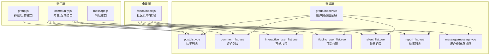
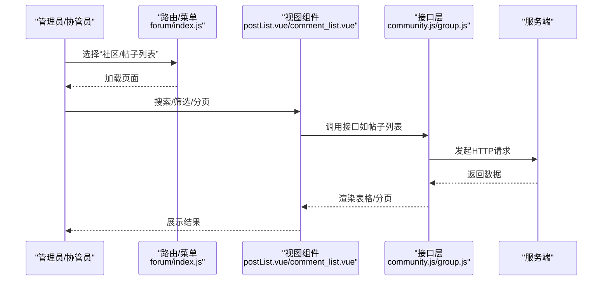
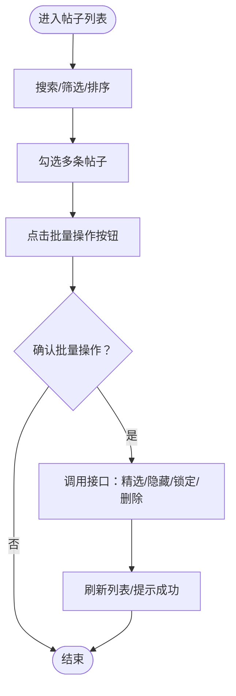
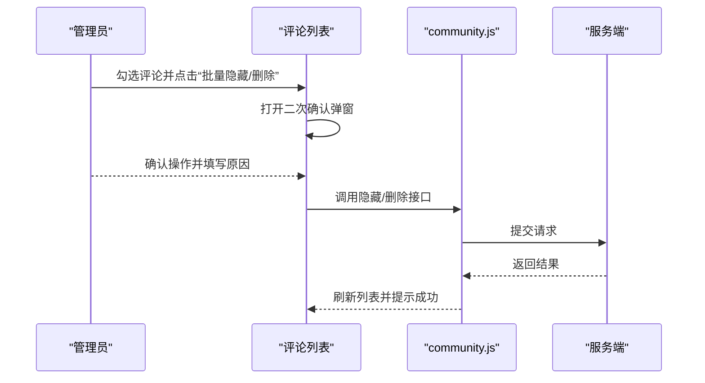
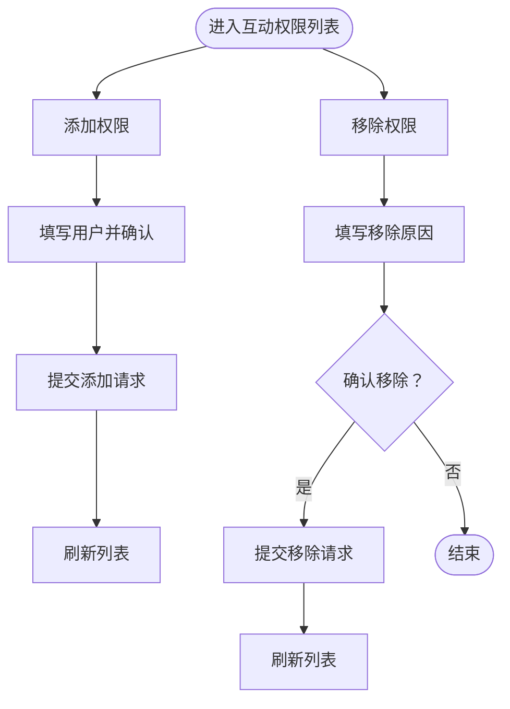
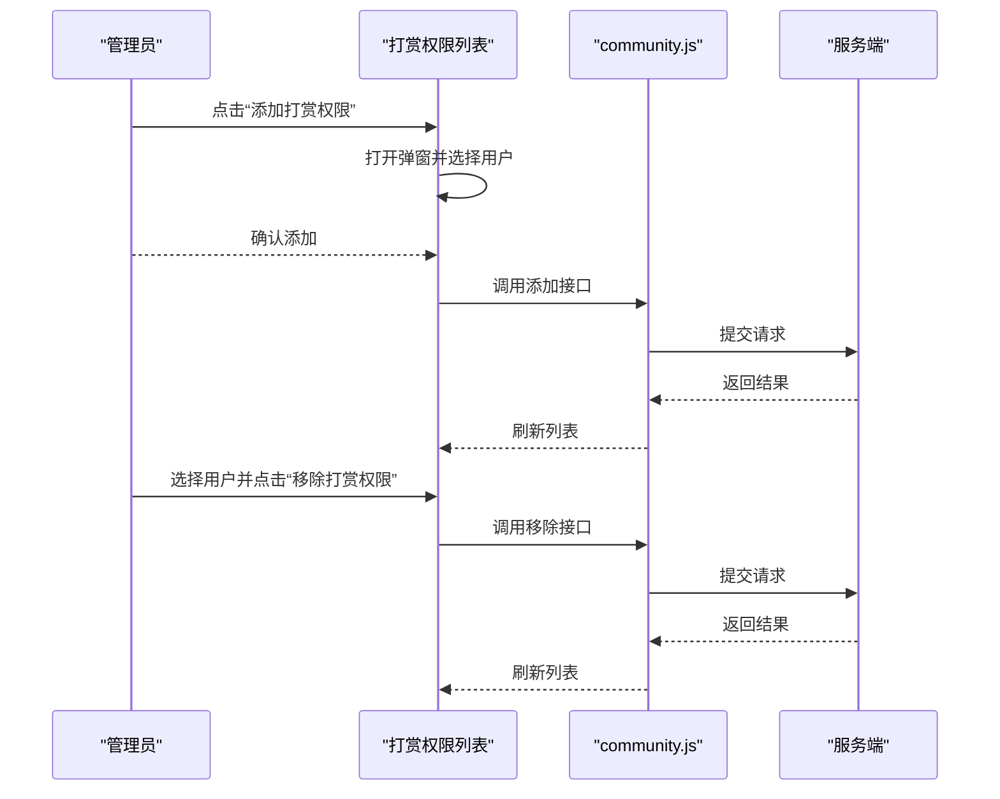
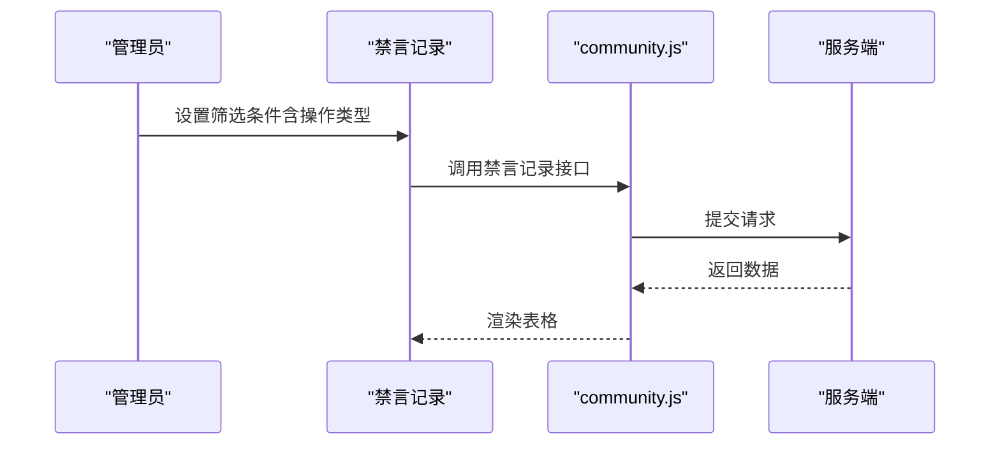
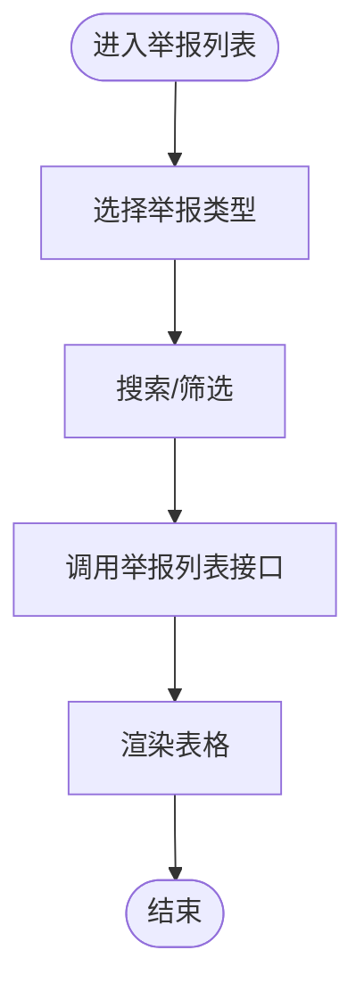
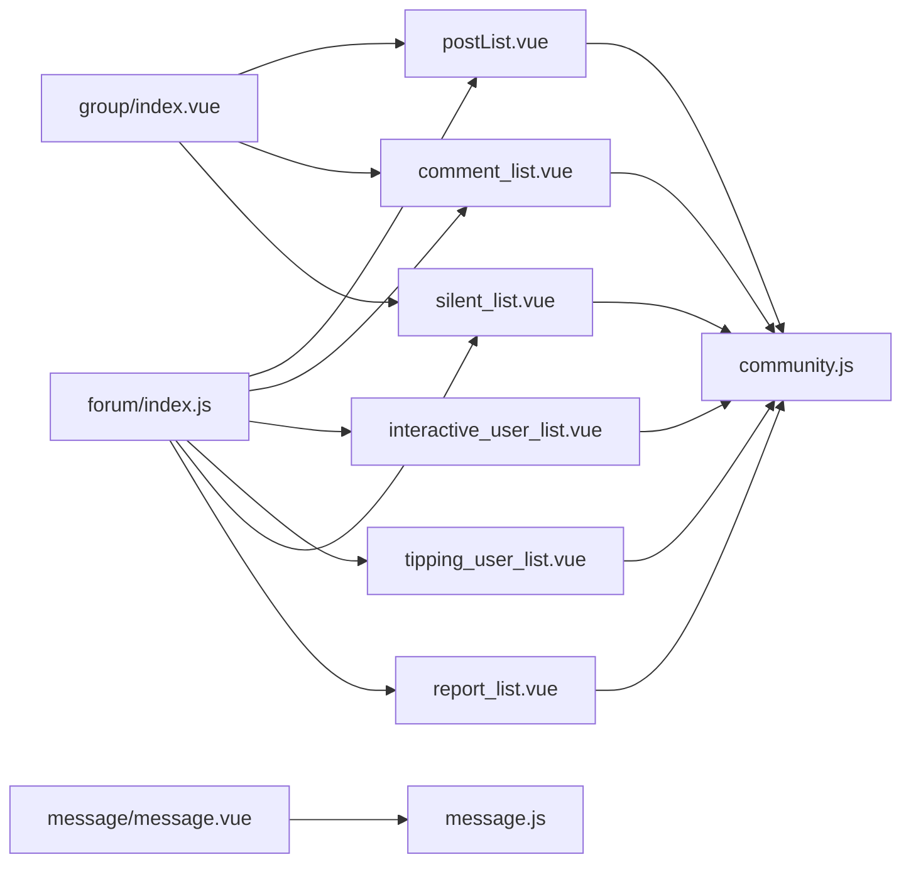

# 群组社区组件

<cite>
**本文引用的文件**
- [group.js](file://src/api/group.js)
- [community.js](file://src/api/community.js)
- [message.js](file://src/api/message.js)
- [forum/index.js](file://src/router/children/forum/index.js)
- [postList.vue](file://src/views/forum/postList.vue)
- [comment_list.vue](file://src/views/forum/comment_list.vue)
- [interactive_user_list.vue](file://src/views/forum/interactive_user_list.vue)
- [tipping_user_list.vue](file://src/views/forum/tipping_user_list.vue)
- [silent_list.vue](file://src/views/forum/silent_list.vue)
- [report_list.vue](file://src/views/forum/report_list.vue)
- [group/index.vue](file://src/components/leisu/peopleInfo/group/index.vue)
- [message/message.vue](file://src/components/leisu/peopleInfo/message/message.vue)
</cite>

## 目录
1. [简介](#简介)
2. [项目结构](#项目结构)
3. [核心组件](#核心组件)
4. [架构总览](#架构总览)
5. [详细组件分析](#详细组件分析)
6. [依赖关系分析](#依赖关系分析)
7. [性能考量](#性能考量)
8. [故障排查指南](#故障排查指南)
9. [结论](#结论)
10. [附录](#附录)

## 简介
本技术文档聚焦于群组社区组件，系统梳理其在用户社交生态中的定位与能力边界，覆盖群组管理、互动功能、消息系统三大模块。重点包括：
- 群组管理：帖子/评论/圈子/权限/周卡/黑名单/报表等
- 互动功能：直播互动权限、打赏、举报、禁言记录、权限日志等
- 消息系统：公共消息、定向消息、站内信、点赞/回复提醒等

通过接口层、视图层与路由层的协同，形成从“内容生产—互动—运营治理—消息触达”的闭环。

## 项目结构
围绕群组社区的核心文件分布如下：
- 接口层：统一在 api 目录下，按领域拆分 group.js（群组/运营）、community.js（内容/互动）、message.js（消息）
- 视图层：forum 下的各功能页面（帖子、评论、权限、打赏、举报、禁言、报表等）
- 路由层：forum/index.js 定义社区相关菜单、权限角色与页面入口
- 抽屉/消息面板：peopleInfo 下的 group/message 抽屉组件，承载用户侧的社区信息与消息入口

图表来源
- [group.js:1-642](file://src/api/group.js#L1-L642)
- [community.js:1-676](file://src/api/community.js#L1-L676)
- [message.js:1-96](file://src/api/message.js#L1-L96)
- [forum/index.js:1-230](file://src/router/children/forum/index.js#L1-L230)
- [postList.vue:1-800](file://src/views/forum/postList.vue#L1-L800)
- [comment_list.vue:1-466](file://src/views/forum/comment_list.vue#L1-L466)
- [interactive_user_list.vue:1-559](file://src/views/forum/interactive_user_list.vue#L1-L559)
- [tipping_user_list.vue:1-270](file://src/views/forum/tipping_user_list.vue#L1-L270)
- [silent_list.vue:1-158](file://src/views/forum/silent_list.vue#L1-L158)
- [report_list.vue:1-208](file://src/views/forum/report_list.vue#L1-L208)
- [group/index.vue:1-140](file://src/components/leisu/peopleInfo/group/index.vue#L1-L140)
- [message/message.vue:1-82](file://src/components/leisu/peopleInfo/message/message.vue#L1-L82)

章节来源
- [forum/index.js:1-230](file://src/router/children/forum/index.js#L1-L230)

## 核心组件
- 群组/运营接口（group.js）
  - 负责圈子/权限/周卡/报表/敏感词/热门话题/视频帖/消费/收益等后台运营能力
  - 示例：禁言/解封、帖子/评论审核、收费贴/互动贴报表、周卡交易报表、敏感词高亮、热门话题维护等
- 内容/互动接口（community.js）
  - 负责帖子/评论/点赞/举报/禁言记录/权限日志/打赏/投票/红包等互动与内容治理
  - 示例：帖子列表/详情、评论列表/点赞/删除/隐藏、直播互动用户/权限、举报列表、打赏记录等
- 消息接口（message.js）
  - 负责公共消息/定向消息/站内信/点赞/回复提醒等消息触达
  - 示例：公共消息增删改查、定向消息增删改查、站内信对话/房间/删除、点赞/回复列表

章节来源
- [group.js:1-642](file://src/api/group.js#L1-L642)
- [community.js:1-676](file://src/api/community.js#L1-L676)
- [message.js:1-96](file://src/api/message.js#L1-L96)

## 架构总览
群组社区组件采用“接口层-视图层-路由层-抽屉组件”的分层设计：
- 接口层：统一封装 HTTP 请求，按领域拆分，便于维护与扩展
- 视图层：每个页面负责单一职责，复用通用组件（分页、搜索、用户卡片等）
- 路由层：集中定义社区菜单、权限角色与页面入口，确保访问控制一致
- 抽屉组件：在用户详情页内以抽屉形式展示群组与消息相关内容，提升交互效率

图表来源
- [forum/index.js:1-230](file://src/router/children/forum/index.js#L1-L230)
- [postList.vue:1-800](file://src/views/forum/postList.vue#L1-L800)
- [community.js:1-676](file://src/api/community.js#L1-L676)
- [group.js:1-642](file://src/api/group.js#L1-L642)

## 详细组件分析

### 帖子管理（列表/详情/操作）
- 功能要点
  - 多场景复用：普通检索、抽屉、搜索组件、帖子池、热门推荐、推荐黑名单、球队关联帖
  - 服务端分页：postListV2；本地全量场景通过本地数组与 mixin 实现
  - 丰富列展示：标题、内容、图片/视频、评论数、浏览/曝光、点赞、归属地、渠道、操作时间等
  - 批量操作：精选/隐藏/锁定/删除、批量退款、换圈、加入话题、推荐黑名单
- 关键流程（批量精选/隐藏/锁定/删除）

图表来源
- [postList.vue:155-175](file://src/views/forum/postList.vue#L155-L175)
- [community.js:10-44](file://src/api/community.js#L10-L44)

章节来源
- [postList.vue:1-800](file://src/views/forum/postList.vue#L1-L800)
- [community.js:10-44](file://src/api/community.js#L10-L44)

### 评论管理（列表/点赞/删除/隐藏）
- 功能要点
  - 评论列表支持批量隐藏/删除/取消隐藏/取消删除
  - 快捷操作下拉菜单：隐藏/取消隐藏、删除/取消删除、关联到帖子
  - 导出 Excel、查看评论弹窗、二次确认弹窗
- 关键流程（批量隐藏/删除）

图表来源
- [comment_list.vue:78-83](file://src/views/forum/comment_list.vue#L78-L83)
- [comment_list.vue:381-447](file://src/views/forum/comment_list.vue#L381-L447)
- [community.js:90-133](file://src/api/community.js#L90-L133)

章节来源
- [comment_list.vue:1-466](file://src/views/forum/comment_list.vue#L1-L466)
- [community.js:90-133](file://src/api/community.js#L90-L133)

### 互动权限与直播权限
- 功能要点
  - 互动权限列表：展示用户ID、注册时间、权限获得时间、粉丝数、可发布价格/次数、运动类型、分成比例、周卡价格/提示/描述等
  - 批量设置：发布数、价格、球类、周卡等
  - 发道具卡：支持批量发放
  - 权限移除：需填写原因并二次确认
- 关键流程（添加/移除互动权限）

图表来源
- [interactive_user_list.vue:476-501](file://src/views/forum/interactive_user_list.vue#L476-L501)
- [interactive_user_list.vue:507-523](file://src/views/forum/interactive_user_list.vue#L507-L523)
- [community.js:198-237](file://src/api/community.js#L198-L237)

章节来源
- [interactive_user_list.vue:1-559](file://src/views/forum/interactive_user_list.vue#L1-L559)
- [community.js:198-237](file://src/api/community.js#L198-L237)

### 打赏权限
- 功能要点
  - 支持添加/移除打赏权限
  - UID 搜索、重置、分页展示
- 关键流程（添加/移除打赏权限）

图表来源
- [tipping_user_list.vue:233-249](file://src/views/forum/tipping_user_list.vue#L233-L249)
- [tipping_user_list.vue:250-262](file://src/views/forum/tipping_user_list.vue#L250-L262)
- [community.js:239-262](file://src/api/community.js#L239-L262)

章节来源
- [tipping_user_list.vue:1-270](file://src/views/forum/tipping_user_list.vue#L1-L270)
- [community.js:239-262](file://src/api/community.js#L239-L262)

### 禁言记录
- 功能要点
  - 展示操作人、操作时间、解禁时间、备注等
  - 支持按操作类型过滤（管理员/协管员/系统）
- 关键流程（查询禁言记录）

图表来源
- [silent_list.vue:102-154](file://src/views/forum/silent_list.vue#L102-L154)
- [community.js:361-375](file://src/api/community.js#L361-L375)

章节来源
- [silent_list.vue:1-158](file://src/views/forum/silent_list.vue#L1-L158)
- [community.js:361-375](file://src/api/community.js#L361-L375)

### 举报列表
- 功能要点
  - 支持按举报对象类型切换（帖子/评论/互动直播/资讯评论）
  - 展示举报人、被举报人、提交时间、标题/内容、附件、额外信息（如单价/时间区间）
- 关键流程（切换举报类型并查询）

图表来源
- [report_list.vue:142-190](file://src/views/forum/report_list.vue#L142-L190)
- [community.js:353-360](file://src/api/community.js#L353-L360)

章节来源
- [report_list.vue:1-208](file://src/views/forum/report_list.vue#L1-L208)
- [community.js:353-360](file://src/api/community.js#L353-L360)

### 用户侧群组抽屉与消息抽屉
- 群组抽屉（group/index.vue）
  - 展示帖子/评论/屏蔽/打赏/收赏/铁粉/周卡/举报/禁言/权限/操作/收益/消费/标签等
  - 根据用户权限动态显示标签页
- 消息抽屉（message/message.vue）
  - 展示会员/钱包/系统/投票/站内信/赞我的/收到回复等
  - 通过 msg_type 区分不同消息类型

章节来源
- [group/index.vue:1-140](file://src/components/leisu/peopleInfo/group/index.vue#L1-L140)
- [message/message.vue:1-82](file://src/components/leisu/peopleInfo/message/message.vue#L1-L82)

## 依赖关系分析
- 路由到视图：forum/index.js 将社区菜单与具体页面绑定，统一声明角色权限
- 视图到接口：各页面通过 community.js/group.js/message.js 调用后端接口
- 抽屉到视图：用户详情页内的抽屉组件加载对应功能视图，减少页面跳转成本

图表来源
- [forum/index.js:1-230](file://src/router/children/forum/index.js#L1-L230)
- [postList.vue:1-800](file://src/views/forum/postList.vue#L1-L800)
- [comment_list.vue:1-466](file://src/views/forum/comment_list.vue#L1-L466)
- [interactive_user_list.vue:1-559](file://src/views/forum/interactive_user_list.vue#L1-L559)
- [tipping_user_list.vue:1-270](file://src/views/forum/tipping_user_list.vue#L1-L270)
- [silent_list.vue:1-158](file://src/views/forum/silent_list.vue#L1-L158)
- [report_list.vue:1-208](file://src/views/forum/report_list.vue#L1-L208)
- [group/index.vue:1-140](file://src/components/leisu/peopleInfo/group/index.vue#L1-L140)
- [message/message.vue:1-82](file://src/components/leisu/peopleInfo/message/message.vue#L1-L82)
- [community.js:1-676](file://src/api/community.js#L1-L676)
- [message.js:1-96](file://src/api/message.js#L1-L96)

## 性能考量
- 列表分页与排序
  - 服务端分页：postListV2 支持排序与分页，避免一次性传输大量数据
  - 本地全量：帖子池/热门/黑名单/球队帖等场景通过本地数组与 mixin 实现，注意内存占用与渲染性能
- 图片/视频预览
  - 使用缩略图与懒加载策略，避免阻塞首屏渲染
- 搜索与筛选
  - 使用防抖与去重策略，避免频繁请求
- 抽屉组件
  - 按需渲染，减少 DOM 树深度，提升交互流畅度

## 故障排查指南
- 帖子列表无数据
  - 检查接口返回码与 total 字段，确认分页参数是否正确
  - 若为本地全量场景，检查 tablePoolList 与 formatPool 的配合
- 评论批量操作失败
  - 确认二次确认弹窗是否正确传递原因字段
  - 检查接口返回码与提示信息
- 权限变更无效
  - 确认角色权限是否包含对应操作按钮
  - 检查接口调用链路与返回状态
- 禁言记录筛选异常
  - 检查 operate_customize 的转换逻辑与 search_cond 的构造
- 消息抽屉无法显示
  - 确认用户权限与 msg_type 的匹配关系
  - 检查接口返回的数据结构与渲染逻辑

章节来源
- [postList.vue:748-752](file://src/views/forum/postList.vue#L748-L752)
- [comment_list.vue:381-447](file://src/views/forum/comment_list.vue#L381-L447)
- [silent_list.vue:102-154](file://src/views/forum/silent_list.vue#L102-L154)
- [message/message.vue:1-82](file://src/components/leisu/peopleInfo/message/message.vue#L1-L82)

## 结论
群组社区组件通过清晰的分层设计与完善的接口封装，实现了从内容生产到互动治理再到消息触达的全链路能力。依托路由层的角色权限控制与视图层的模块化实现，既保证了运营效率，也兼顾了用户体验。建议在后续迭代中持续优化本地全量场景的性能与交互体验，并完善消息推送与权限变更的审计日志。

## 附录
- 路由与权限对照
  - 社区菜单与角色权限在 forum/index.js 中集中定义，便于统一管控与扩展
- 常用接口清单
  - 帖子：postListV2、pick_post、hide_post、locked_post、delete_post
  - 评论：comment_list、likeComment、deleteComment、hideComment
  - 权限：interactive_user_list、tipping_user_list、bans_log_list
  - 消息：inbox_messages、send_inbox_msg、my_received_like、my_received_reply

章节来源
- [forum/index.js:165-229](file://src/router/children/forum/index.js#L165-L229)
- [community.js:10-88](file://src/api/community.js#L10-L88)
- [message.js:1-96](file://src/api/message.js#L1-L96)