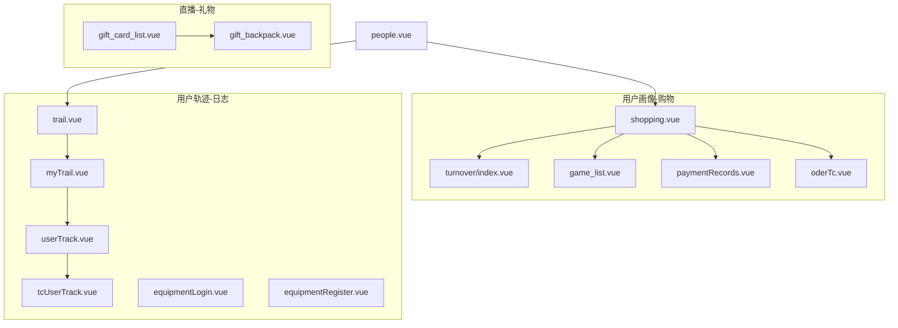
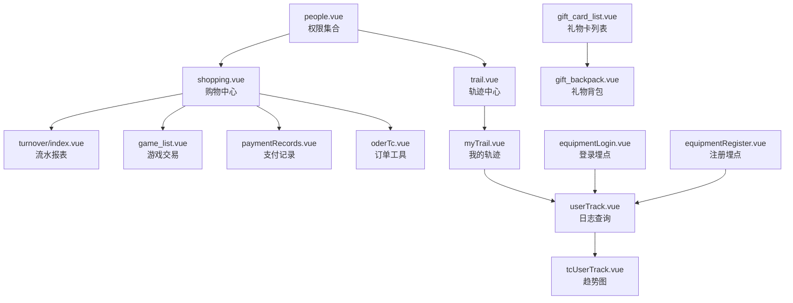
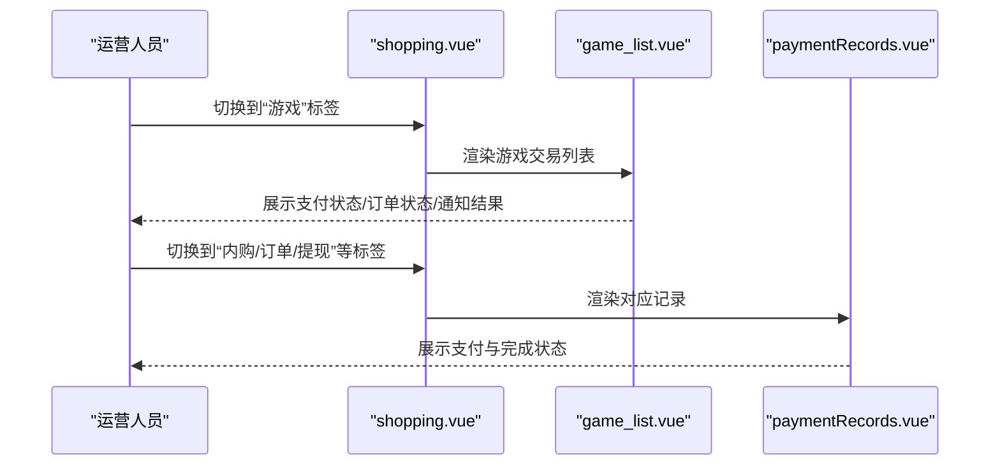
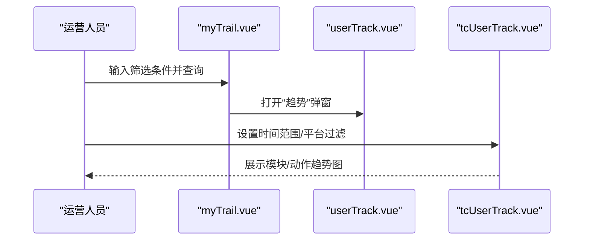
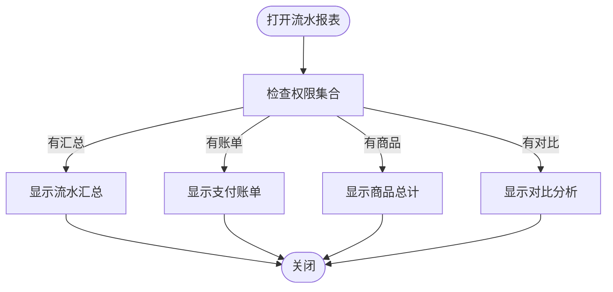
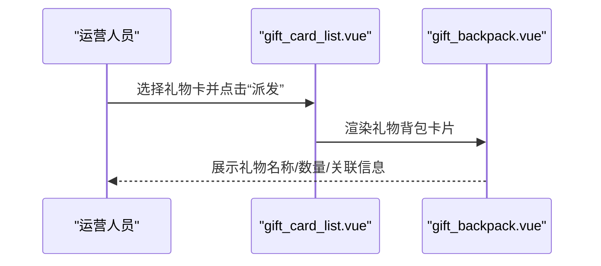
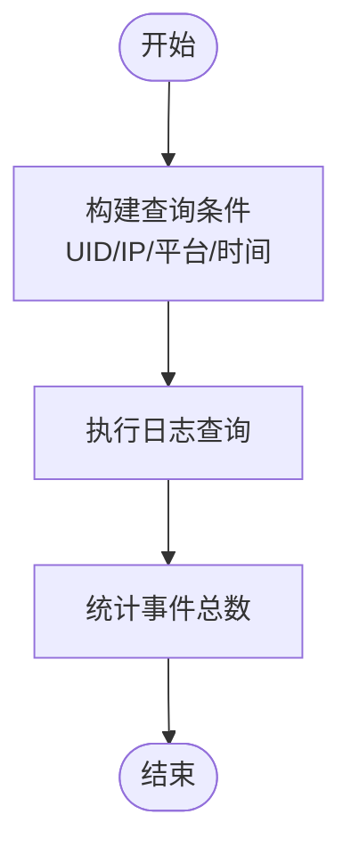
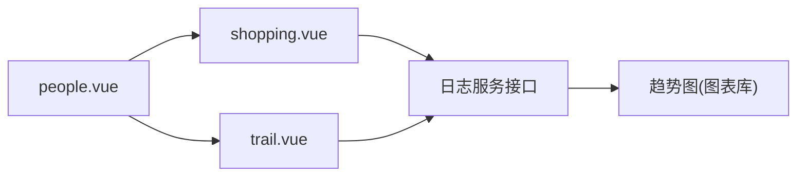

# 购物追踪组件

<cite>
**本文引用的文件**
- [shopping.vue](file://src/components/leisu/peopleInfo/shopping/shopping.vue)
- [turnover/index.vue](file://src/components/leisu/peopleInfo/shopping/components/turnover/index.vue)
- [myTrail.vue](file://src/components/leisu/peopleInfo/trail/components/myTrail.vue)
- [userTrack.vue](file://src/views/ops_tools/userTrack.vue)
- [tcUserTrack.vue](file://src/views/ops_tools/tcUserTrack.vue)
- [trail.vue](file://src/components/leisu/peopleInfo/trail/trail.vue)
- [people.vue](file://src/components/leisu/people.vue)
- [equipmentLogin.vue](file://src/views/member/equipmentLogin.vue)
- [equipmentRegister.vue](file://src/views/member/equipmentRegister.vue)
- [game_list.vue](file://src/components/leisu/peopleInfo/shopping/components/game_list.vue)
- [paymentRecords.vue](file://src/views/gameCenter/paymentRecords.vue)
- [oderTc.vue](file://src/components/leisu/peopleInfo/shopping/components/oderTc.vue)
- [gift_card_list.vue](file://src/views/chat_room/gift_card_list.vue)
- [gift_backpack.vue](file://src/components/leisu/peopleInfo/chat/components/gift_backpack.vue)
</cite>

## 目录
1. [简介](#简介)
2. [项目结构](#项目结构)
3. [核心组件](#核心组件)
4. [架构总览](#架构总览)
5. [详细组件分析](#详细组件分析)
6. [依赖关系分析](#依赖关系分析)
7. [性能考量](#性能考量)
8. [故障排查指南](#故障排查指南)
9. [结论](#结论)
10. [附录](#附录)

## 简介
本技术文档聚焦“购物追踪组件”，系统性解析以下能力与实现：
- 购物系统与用户轨迹：以用户为中心的支付、订单、流水、游戏交易与银行信息管理。
- 用户行为追踪与分析：基于日志服务的用户行为采集、筛选、聚合与可视化。
- 直播与互动：聊天室礼物卡体系、派发与展示，支撑直播场景下的打赏与互动。
- 数据分析与运营：趋势图、分组统计、IP/设备识别、登录注册埋点统计。

该组件通过模块化设计与权限控制，将支付、订单、流水、直播互动等业务解耦，便于在后台管理系统中进行精细化运营与审计。

## 项目结构
购物追踪相关代码主要分布在如下位置：
- 用户画像与购物：components/leisu/peopleInfo/shopping
- 用户轨迹与日志：components/leisu/peopleInfo/trail 及 views/ops_tools
- 直播与礼物：views/chat_room 与 components/leisu/peopleInfo/chat
- 权限与入口：components/leisu/people.vue

图表来源
- [shopping.vue:1-83](file://src/components/leisu/peopleInfo/shopping/shopping.vue#L1-L83)
- [turnover/index.vue:1-62](file://src/components/leisu/peopleInfo/shopping/components/turnover/index.vue#L1-L62)
- [myTrail.vue:1-263](file://src/components/leisu/peopleInfo/trail/components/myTrail.vue#L1-L263)
- [userTrack.vue:1-257](file://src/views/ops_tools/userTrack.vue#L1-L257)
- [tcUserTrack.vue:1-334](file://src/views/ops_tools/tcUserTrack.vue#L1-L334)
- [trail.vue:1-76](file://src/components/leisu/peopleInfo/trail/trail.vue#L1-L76)
- [people.vue:229-255](file://src/components/leisu/people.vue#L229-L255)
- [equipmentLogin.vue:323-357](file://src/views/member/equipmentLogin.vue#L323-L357)
- [equipmentRegister.vue:322-356](file://src/views/member/equipmentRegister.vue#L322-L356)
- [game_list.vue:110-136](file://src/components/leisu/peopleInfo/shopping/components/game_list.vue#L110-L136)
- [paymentRecords.vue:119-146](file://src/views/gameCenter/paymentRecords.vue#L119-L146)
- [oderTc.vue:26-51](file://src/components/leisu/peopleInfo/shopping/components/oderTc.vue#L26-L51)
- [gift_card_list.vue:139-200](file://src/views/chat_room/gift_card_list.vue#L139-L200)
- [gift_backpack.vue:1-81](file://src/components/leisu/peopleInfo/chat/components/gift_backpack.vue#L1-L81)

章节来源
- [shopping.vue:1-83](file://src/components/leisu/peopleInfo/shopping/shopping.vue#L1-L83)
- [trail.vue:1-76](file://src/components/leisu/peopleInfo/trail/trail.vue#L1-L76)
- [people.vue:229-255](file://src/components/leisu/people.vue#L229-L255)

## 核心组件
- 购物中心（shopping.vue）：聚合支付、订单、提现、流水、卡券、内购、游戏交易、银行卡、咪咕订单等子面板，按权限动态显示。
- 流水报表（turnover/index.vue）：弹窗式多标签页，支持流水汇总、支付账单、商品总计与对比分析。
- 用户轨迹（myTrail.vue）：按用户维度检索与展示行为日志，支持筛选、排序与趋势图联动。
- 运营日志（userTrack.vue、tcUserTrack.vue）：通用日志查询与趋势图，支持按模块/动作聚合与平台过滤。
- 权限入口（people.vue）：定义购物与轨迹相关权限集合，作为路由与组件渲染依据。
- 设备登录/注册埋点（equipmentLogin.vue、equipmentRegister.vue）：基于日志服务构建查询，统计登录/注册事件。
- 游戏交易与支付记录（game_list.vue、paymentRecords.vue）：展示支付状态、订单状态与通知结果。
- 订单工具（oderTc.vue）：封装异常充值、历史退款、IAP通知等工具面板。
- 直播礼物（gift_card_list.vue、gift_backpack.vue）：礼物卡列表与背包展示，支持派发与动画效果。

章节来源
- [shopping.vue:10-42](file://src/components/leisu/peopleInfo/shopping/shopping.vue#L10-L42)
- [turnover/index.vue:4-18](file://src/components/leisu/peopleInfo/shopping/components/turnover/index.vue#L4-L18)
- [myTrail.vue:98-126](file://src/components/leisu/peopleInfo/trail/components/myTrail.vue#L98-L126)
- [userTrack.vue:98-126](file://src/views/ops_tools/userTrack.vue#L98-L126)
- [tcUserTrack.vue:129-165](file://src/views/ops_tools/tcUserTrack.vue#L129-L165)
- [people.vue:239-251](file://src/components/leisu/people.vue#L239-L251)
- [equipmentLogin.vue:326-356](file://src/views/member/equipmentLogin.vue#L326-L356)
- [equipmentRegister.vue:325-355](file://src/views/member/equipmentRegister.vue#L325-L355)
- [game_list.vue:119-136](file://src/components/leisu/peopleInfo/shopping/components/game_list.vue#L119-L136)
- [paymentRecords.vue:125-143](file://src/views/gameCenter/paymentRecords.vue#L125-L143)
- [oderTc.vue:32-48](file://src/components/leisu/peopleInfo/shopping/components/oderTc.vue#L32-L48)
- [gift_card_list.vue:169-200](file://src/views/chat_room/gift_card_list.vue#L169-L200)
- [gift_backpack.vue:40-81](file://src/components/leisu/peopleInfo/chat/components/gift_backpack.vue#L40-L81)

## 架构总览
购物追踪组件采用“权限驱动 + 模块化 + 日志服务”的架构：
- 权限控制：通过权限集合决定页面与面板可见性，避免越权访问。
- 组件解耦：购物、轨迹、礼物分别独立，通过父组件或弹窗组合使用。
- 数据来源：统一对接日志服务接口，实现日志检索、聚合与可视化。
- 可视化：趋势图与表格结合，支持时间粒度自适应与平台过滤。

图表来源
- [people.vue:239-251](file://src/components/leisu/people.vue#L239-L251)
- [shopping.vue:59-61](file://src/components/leisu/peopleInfo/shopping/shopping.vue#L59-L61)
- [trail.vue:53-53](file://src/components/leisu/peopleInfo/trail/trail.vue#L53-L53)
- [turnover/index.vue:29-29](file://src/components/leisu/peopleInfo/shopping/components/turnover/index.vue#L29-L29)
- [myTrail.vue:94-94](file://src/components/leisu/peopleInfo/trail/components/myTrail.vue#L94-L94)
- [userTrack.vue:94-94](file://src/views/ops_tools/userTrack.vue#L94-L94)
- [tcUserTrack.vue:128-128](file://src/views/ops_tools/tcUserTrack.vue#L128-L128)
- [equipmentLogin.vue:326-356](file://src/views/member/equipmentLogin.vue#L326-L356)
- [equipmentRegister.vue:325-355](file://src/views/member/equipmentRegister.vue#L325-L355)
- [game_list.vue:119-136](file://src/components/leisu/peopleInfo/shopping/components/game_list.vue#L119-L136)
- [paymentRecords.vue:125-143](file://src/views/gameCenter/paymentRecords.vue#L125-L143)
- [oderTc.vue:35-35](file://src/components/leisu/peopleInfo/shopping/components/oderTc.vue#L35-L35)
- [gift_card_list.vue:171-171](file://src/views/chat_room/gift_card_list.vue#L171-L171)
- [gift_backpack.vue:70-70](file://src/components/leisu/peopleInfo/chat/components/gift_backpack.vue#L70-L70)

## 详细组件分析

### 购物系统与订单处理
- 支付与订单：购物中心提供支付、手动订单、提现、卡券、内购、游戏交易、银行卡、咪咕订单等子面板，按权限启用。
- 订单状态：订单表包含支付状态、完成状态与通知结果字段，便于快速定位异常。
- 工具面板：订单工具封装异常充值、历史退款、IAP通知等，统一入口管理。

图表来源
- [shopping.vue:13-41](file://src/components/leisu/peopleInfo/shopping/shopping.vue#L13-L41)
- [game_list.vue:119-136](file://src/components/leisu/peopleInfo/shopping/components/game_list.vue#L119-L136)
- [paymentRecords.vue:125-143](file://src/views/gameCenter/paymentRecords.vue#L125-L143)

章节来源
- [shopping.vue:10-42](file://src/components/leisu/peopleInfo/shopping/shopping.vue#L10-L42)
- [game_list.vue:119-136](file://src/components/leisu/peopleInfo/shopping/components/game_list.vue#L119-L136)
- [paymentRecords.vue:125-143](file://src/views/gameCenter/paymentRecords.vue#L125-L143)
- [oderTc.vue:32-48](file://src/components/leisu/peopleInfo/shopping/components/oderTc.vue#L32-L48)

### 用户轨迹与行为分析
- 我的轨迹：按用户UID检索行为日志，支持模块/动作/IP/设备等筛选，排序与分页。
- 运营日志：通用查询界面，支持时间范围、排序与总数统计；点击“趋势”打开趋势图弹窗。
- 趋势图：按模块/动作聚合，支持分钟/小时/天粒度自适应与平台过滤（Android/iOS）。

图表来源
- [myTrail.vue:139-253](file://src/components/leisu/peopleInfo/trail/components/myTrail.vue#L139-L253)
- [userTrack.vue:136-247](file://src/views/ops_tools/userTrack.vue#L136-L247)
- [tcUserTrack.vue:171-330](file://src/views/ops_tools/tcUserTrack.vue#L171-L330)

章节来源
- [myTrail.vue:96-253](file://src/components/leisu/peopleInfo/trail/components/myTrail.vue#L96-L253)
- [userTrack.vue:96-247](file://src/views/ops_tools/userTrack.vue#L96-L247)
- [tcUserTrack.vue:129-330](file://src/views/ops_tools/tcUserTrack.vue#L129-L330)

### 流水报表与对账
- 弹窗式多标签：支持流水汇总、支付账单、商品总计与对比分析。
- 权限控制：根据权限自动选择默认标签并显示对应内容。

图表来源
- [turnover/index.vue:45-57](file://src/components/leisu/peopleInfo/shopping/components/turnover/index.vue#L45-L57)

章节来源
- [turnover/index.vue:4-18](file://src/components/leisu/peopleInfo/shopping/components/turnover/index.vue#L4-L18)

### 直播与礼物打赏
- 礼物卡管理：支持查看、编辑、派发礼物卡，并触发动画与视频播放组件。
- 背包展示：展示礼物卡名称、数量及关联队伍/赛事等信息。

图表来源
- [gift_card_list.vue:146-152](file://src/views/chat_room/gift_card_list.vue#L146-L152)
- [gift_backpack.vue:40-81](file://src/components/leisu/peopleInfo/chat/components/gift_backpack.vue#L40-L81)

章节来源
- [gift_card_list.vue:139-200](file://src/views/chat_room/gift_card_list.vue#L139-L200)
- [gift_backpack.vue:1-81](file://src/components/leisu/peopleInfo/chat/components/gift_backpack.vue#L1-L81)

### 设备识别与登录注册埋点
- 登录/注册事件：通过日志服务查询“登录/注册”动作，结合UID、IP、平台等条件统计。
- 埋点口径：使用统一日志存储与查询接口，确保事件可追溯与可统计。

图表来源
- [equipmentLogin.vue:326-356](file://src/views/member/equipmentLogin.vue#L326-L356)
- [equipmentRegister.vue:325-355](file://src/views/member/equipmentRegister.vue#L325-L355)

章节来源
- [equipmentLogin.vue:323-357](file://src/views/member/equipmentLogin.vue#L323-L357)
- [equipmentRegister.vue:322-356](file://src/views/member/equipmentRegister.vue#L322-L356)

## 依赖关系分析
- 权限依赖：所有子组件均依赖权限集合进行渲染控制，避免无权限面板暴露。
- 数据依赖：日志查询统一走日志服务接口，保证跨模块数据一致性。
- 可视化依赖：趋势图依赖图表库，按时间粒度与平台过滤动态组装SQL。

图表来源
- [people.vue:239-251](file://src/components/leisu/people.vue#L239-L251)
- [shopping.vue:59-61](file://src/components/leisu/peopleInfo/shopping/shopping.vue#L59-L61)
- [trail.vue:53-53](file://src/components/leisu/peopleInfo/trail/trail.vue#L53-L53)
- [tcUserTrack.vue:235-261](file://src/views/ops_tools/tcUserTrack.vue#L235-L261)

章节来源
- [people.vue:229-255](file://src/components/leisu/people.vue#L229-L255)
- [userTrack.vue:88-88](file://src/views/ops_tools/userTrack.vue#L88-L88)
- [tcUserTrack.vue:122-122](file://src/views/ops_tools/tcUserTrack.vue#L122-L122)

## 性能考量
- 查询优化：日志查询统一使用“先查明细再查总数”的双请求模式，减少一次性大结果集压力。
- 时间粒度：趋势图根据时间跨度自动选择分钟/小时/天粒度，避免过大数据量渲染。
- 分页与排序：表格支持分页与排序，避免一次性加载过多数据。
- 组件懒加载：弹窗与工具面板按需渲染，降低初始渲染成本。

## 故障排查指南
- 日志查询无结果
  - 检查时间范围是否正确，确认秒级时间戳转换。
  - 确认筛选条件拼接是否包含UID/IP/平台等关键字段。
- 趋势图空白
  - 检查时间跨度与粒度设置，确保SQL聚合条件有效。
  - 确认平台过滤开关是否导致数据为空。
- 订单状态异常
  - 对照支付状态、完成状态与通知结果字段，定位IAP或回调问题。
  - 使用订单工具面板查看历史退款与异常充值记录。

章节来源
- [userTrack.vue:151-207](file://src/views/ops_tools/userTrack.vue#L151-L207)
- [tcUserTrack.vue:171-261](file://src/views/ops_tools/tcUserTrack.vue#L171-L261)
- [game_list.vue:119-136](file://src/components/leisu/peopleInfo/shopping/components/game_list.vue#L119-L136)
- [oderTc.vue:32-48](file://src/components/leisu/peopleInfo/shopping/components/oderTc.vue#L32-L48)

## 结论
购物追踪组件通过“权限驱动 + 模块化 + 日志服务”的设计，实现了从用户行为追踪到购物交易管理的全链路能力。其优势在于：
- 权限细粒度控制，保障安全与合规；
- 组件高内聚低耦合，便于扩展与维护；
- 日志服务统一接入，提升可观测性与可审计性；
- 可视化与工具面板协同，满足运营日常需求。

## 附录
- 关键文件路径与职责
  - 购物中心：聚合支付、订单、流水、卡券、内购、游戏交易、银行卡、咪咕订单。
  - 用户轨迹：我的轨迹、运营日志、趋势图弹窗。
  - 权限入口：定义购物与轨迹相关权限集合。
  - 设备埋点：登录/注册事件统计。
  - 直播礼物：礼物卡列表与背包展示。