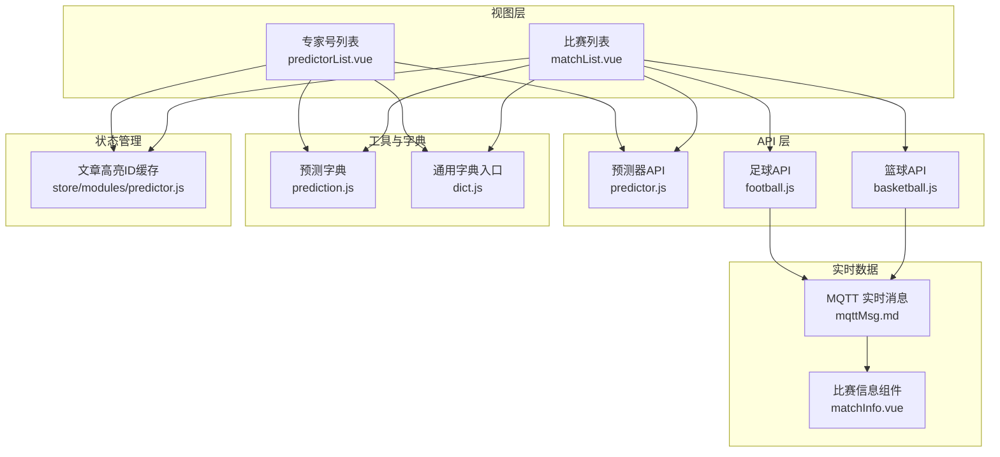
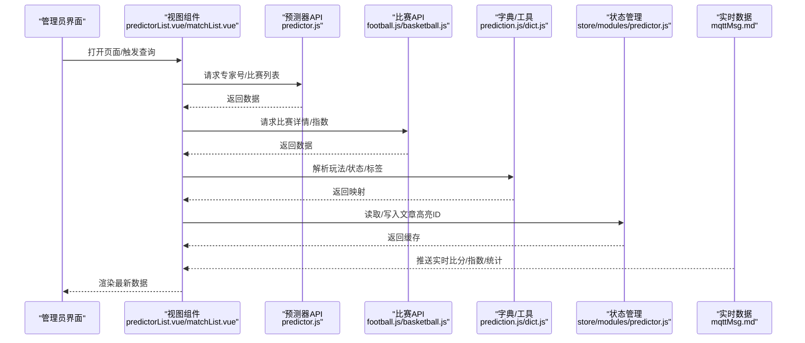
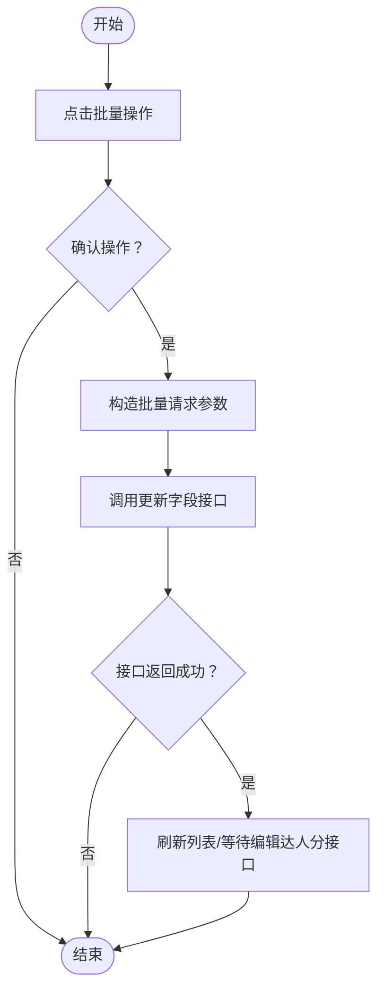
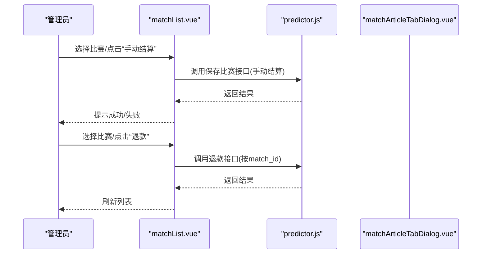
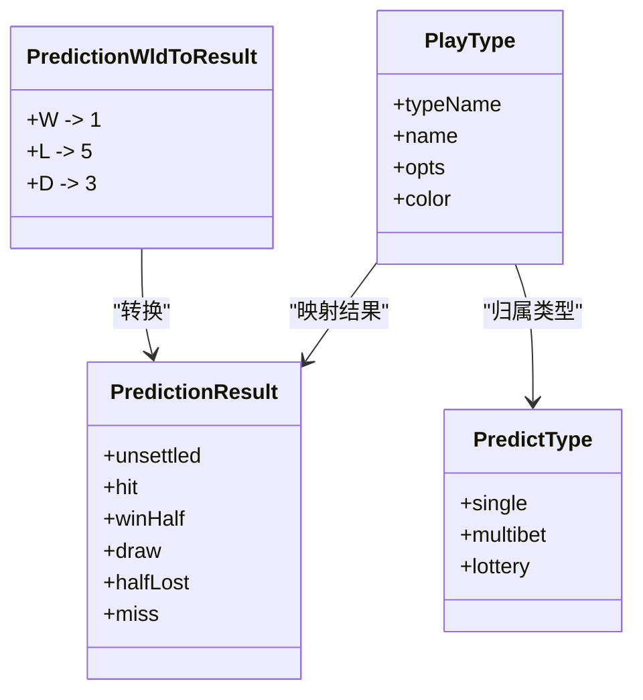
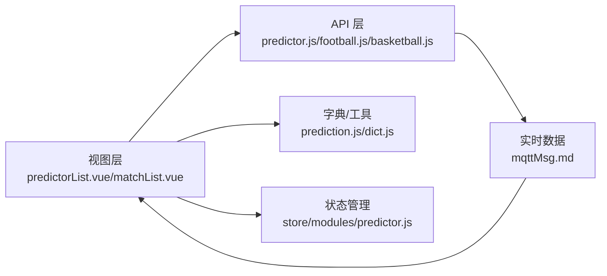

# 赛事预测组件

<cite>
**本文引用的文件**
- [predictor.js](file://src/api/predictor.js)
- [prediction.js](file://src/utils/dict/prediction.js)
- [predictorList.vue](file://src/views/predictor/predictorList.vue)
- [matchList.vue](file://src/views/predictor/matchList.vue)
- [football.js](file://src/api/matchapi/ball/football.js)
- [basketball.js](file://src/api/matchapi/ball/basketball.js)
- [matchInfo.vue](file://src/components/leisu/matchInfo.vue)
- [mqttMsg.md](file://public/mqttMsg.md)
- [dict.js](file://src/utils/dict.js)
- [predictor.js](file://src/store/modules/predictor.js)
</cite>

## 目录
1. [引言](#引言)
2. [项目结构](#项目结构)
3. [核心组件](#核心组件)
4. [架构总览](#架构总览)
5. [详细组件分析](#详细组件分析)
6. [依赖关系分析](#依赖关系分析)
7. [性能考量](#性能考量)
8. [故障排查指南](#故障排查指南)
9. [结论](#结论)
10. [附录](#附录)

## 引言
本技术文档围绕“赛事预测组件”展开，系统性阐述其在体育博彩生态中的定位与作用，重点覆盖以下方面：
- 赛事管理：比赛数据获取、展示与更新机制（实时比分、赛程安排、球队信息等）
- 预测功能：投注管理、赔率计算、收益统计等业务逻辑
- 赛事状态管理：状态流转、结算与退款流程
- 预测结果展示与数据分析：榜单、趋势、报表等
- 组件在体育博彩生态中的关键价值：提升内容质量、保障交易安全、优化用户体验与运营效率

## 项目结构
预测组件由“视图层（Views）+ API 层（API）+ 工具与字典（Utils/Dictionaries）+ 状态管理（Store）”构成，围绕专家号、预测文章、比赛与赔率数据形成闭环。

图表来源
- [predictorList.vue](file://src/views/predictor/predictorList.vue)
- [matchList.vue](file://src/views/predictor/matchList.vue)
- [predictor.js](file://src/api/predictor.js)
- [football.js](file://src/api/matchapi/ball/football.js)
- [basketball.js](file://src/api/matchapi/ball/basketball.js)
- [prediction.js](file://src/utils/dict/prediction.js)
- [dict.js](file://src/utils/dict.js)
- [predictor.js](file://src/store/modules/predictor.js)
- [mqttMsg.md](file://public/mqttMsg.md)
- [matchInfo.vue](file://src/components/leisu/matchInfo.vue)

章节来源
- [predictorList.vue](file://src/views/predictor/predictorList.vue)
- [matchList.vue](file://src/views/predictor/matchList.vue)
- [predictor.js](file://src/api/predictor.js)
- [prediction.js](file://src/utils/dict/prediction.js)
- [dict.js](file://src/utils/dict.js)
- [predictor.js](file://src/store/modules/predictor.js)
- [mqttMsg.md](file://public/mqttMsg.md)
- [matchInfo.vue](file://src/components/leisu/matchInfo.vue)

## 核心组件
- 专家号管理：专家号列表、封禁/限流/禁收/禁发操作、违规处理、榜单与推荐配置
- 比赛管理：比赛列表、状态编辑、手动结算、批量退款
- 预测文章管理：单关/串关/足彩文章列表与详情、文章购买与分布、排行榜与趋势
- 数据字典：玩法类型、结果状态、标签与报表类型等
- 实时数据：MQTT 主题映射与解析，驱动比分、指数、技术统计等页面更新

章节来源
- [predictorList.vue](file://src/views/predictor/predictorList.vue)
- [matchList.vue](file://src/views/predictor/matchList.vue)
- [predictor.js](file://src/api/predictor.js)
- [prediction.js](file://src/utils/dict/prediction.js)

## 架构总览
预测组件采用前后端分离模式，前端通过统一请求封装调用后端预测器与比赛 API，结合实时 MQTT 数据，实现预测内容与比赛数据的联动展示与更新。

图表来源
- [predictorList.vue](file://src/views/predictor/predictorList.vue)
- [matchList.vue](file://src/views/predictor/matchList.vue)
- [predictor.js](file://src/api/predictor.js)
- [football.js](file://src/api/matchapi/ball/football.js)
- [basketball.js](file://src/api/matchapi/ball/basketball.js)
- [prediction.js](file://src/utils/dict/prediction.js)
- [dict.js](file://src/utils/dict.js)
- [predictor.js](file://src/store/modules/predictor.js)
- [mqttMsg.md](file://public/mqttMsg.md)

## 详细组件分析

### 专家号管理模块
- 功能要点
  - 专家号列表：支持排序、筛选、批量操作（封禁/解封、限流/解限、禁收/可收、禁发/可发、违规）
  - 禁收禁发列表：按类型切换展示，支持关联查询专家号基础信息
  - 违规处理：统一弹窗输入原因与时间，调用更新字段接口并刷新列表
  - 榜单与推荐：资深专家、主页/比赛详情置顶、订阅推荐等配置
- 关键流程（批量封禁/解封）

图表来源
- [predictorList.vue](file://src/views/predictor/predictorList.vue)
- [predictor.js](file://src/api/predictor.js)

章节来源
- [predictorList.vue](file://src/views/predictor/predictorList.vue)
- [predictor.js](file://src/api/predictor.js)

### 比赛管理模块
- 功能要点
  - 比赛列表：支持按状态、时间、是否包含预测等条件筛选，支持排序与批量退款
  - 状态编辑：手动结算（按赔率1结算为命中），退款（删除文章并退单关）
  - 与预测文章联动：进入“查看预测文章”对话框，展示该场比赛的预测方案
- 关键流程（手动结算/退款）

图表来源
- [matchList.vue](file://src/views/predictor/matchList.vue)
- [predictor.js](file://src/api/predictor.js)

章节来源
- [matchList.vue](file://src/views/predictor/matchList.vue)
- [predictor.js](file://src/api/predictor.js)

### 预测文章与赔率管理
- 功能要点
  - 文章类型：单关、串关、足彩；玩法类型丰富，涵盖胜平负、比分、总进球、半全场、让球/大小/奇偶等
  - 赔率与结果：根据玩法类型映射赔率与结果（命中/未中/和/半赢/半输），支持W/L/D到结果码的转换
  - 收益统计：命中榜、连中榜、返还榜、赛事/玩法/历史趋势图
- 数据字典（玩法/结果/标签）

图表来源
- [prediction.js](file://src/utils/dict/prediction.js)

章节来源
- [prediction.js](file://src/utils/dict/prediction.js)

### 实时数据与比分展示
- 实时数据来源：MQTT 主题，覆盖足球、篮球、网球、排球、橄榄球、冰球、乒乓球、羽毛球、板球、棒球、电竞（LOL、DOTA、CSGO、KOG）等
- 数据更新：比分页、指数页、技术统计、阵容、评分等
- 展示组件：matchInfo.vue 根据 sport_id 与 match_status 渲染比分与状态
- 公共主题说明：见 mqttMsg.md

章节来源
- [mqttMsg.md](file://public/mqttMsg.md)
- [matchInfo.vue](file://src/components/leisu/matchInfo.vue)

### 文章高亮与本地缓存
- 目标：在不同文章类型（单关/串关/足彩）下，维护本地高亮ID集合，避免重复存储与溢出
- 行为：最多保留固定数量，超出则移除最早项；支持加载与保存至 localStorage

章节来源
- [predictor.js](file://src/store/modules/predictor.js)

## 依赖关系分析
- 视图层依赖 API 层与字典/工具层，通过统一请求封装与数据映射实现解耦
- 实时数据通过 MQTT 与比赛 API 协同，驱动前端组件更新
- 状态管理模块提供轻量本地缓存，减少重复请求与跨页面状态丢失

图表来源
- [predictorList.vue](file://src/views/predictor/predictorList.vue)
- [matchList.vue](file://src/views/predictor/matchList.vue)
- [predictor.js](file://src/api/predictor.js)
- [football.js](file://src/api/matchapi/ball/football.js)
- [basketball.js](file://src/api/matchapi/ball/basketball.js)
- [prediction.js](file://src/utils/dict/prediction.js)
- [dict.js](file://src/utils/dict.js)
- [predictor.js](file://src/store/modules/predictor.js)
- [mqttMsg.md](file://public/mqttMsg.md)

## 性能考量
- 列表分页与排序：通过后端分页与排序参数控制，避免一次性加载过多数据
- 本地缓存：文章高亮ID采用本地存储，降低重复请求与跨页面状态丢失
- 实时数据：MQTT 按主题推送，前端按需渲染，避免轮询带来的资源浪费
- 字典映射：集中式字典减少重复计算，提高渲染效率

## 故障排查指南
- 专家号批量操作失败
  - 检查请求参数（member_ids、modify_field、modify_keyword）是否正确
  - 查看接口返回码与提示，确认权限与状态
- 比赛手动结算无效
  - 确认比赛状态允许手动结算（异常状态白名单）
  - 检查接口返回与提示信息
- 退款失败
  - 确认所选比赛的 match_id 正确
  - 检查是否存在未结算的预测文章
- 实时数据不更新
  - 检查 MQTT 订阅主题与 sport_id 是否匹配
  - 核对 match_id 与状态映射

章节来源
- [predictorList.vue](file://src/views/predictor/predictorList.vue)
- [matchList.vue](file://src/views/predictor/matchList.vue)
- [predictor.js](file://src/api/predictor.js)
- [mqttMsg.md](file://public/mqttMsg.md)

## 结论
赛事预测组件以“专家号管理—比赛管理—预测文章—实时数据—报表分析”为主线，构建了完整的预测生态闭环。通过清晰的模块划分、稳定的 API 接口、丰富的数据字典与本地缓存策略，组件在体育博彩场景中实现了高效的内容生产、精准的预测展示与可靠的交易结算，为平台运营与用户体验提供了坚实支撑。

## 附录
- 常用接口与主题参考
  - 专家号列表与操作：见预测器 API
  - 比赛列表与状态编辑：见预测器 API 与比赛 API
  - 实时主题：见 MQTT 文档
  - 玩法与结果映射：见预测字典

章节来源
- [predictor.js](file://src/api/predictor.js)
- [football.js](file://src/api/matchapi/ball/football.js)
- [basketball.js](file://src/api/matchapi/ball/basketball.js)
- [prediction.js](file://src/utils/dict/prediction.js)
- [mqttMsg.md](file://public/mqttMsg.md)