# 业务组件

<cite>
**本文引用的文件**   
- [src/components/general/richEditor.vue](file://src/components/general/richEditor.vue)
- [src/components/general/index.js](file://src/components/general/index.js)
- [src/components/matchRating/matchRatingDialog.vue](file://src/components/matchRating/matchRatingDialog.vue)
- [src/components/jumpTo/jumpTo.vue](file://src/components/jumpTo/jumpTo.vue)
- [src/components/leisu/ExpertScore.vue](file://src/components/leisu/ExpertScore.vue)
- [src/components/leisu/mySearch.vue](file://src/components/leisu/mySearch.vue)
- [src/components/wangEditor/index.vue](file://src/components/wangEditor/index.vue)
- [src/components/leisu/matchInfo.vue](file://src/components/leisu/matchInfo.vue)
- [src/components/leisu/people.vue](file://src/components/leisu/people.vue)
- [src/components/leisu/tableStatus.vue](file://src/components/leisu/tableStatus.vue)
- [src/components/leisu/mystatus.vue](file://src/components/leisu/mystatus.vue)
</cite>

## 目录
1. [引言](#引言)
2. [项目结构](#项目结构)
3. [核心组件](#核心组件)
4. [架构总览](#架构总览)
5. [详细组件分析](#详细组件分析)
6. [依赖关系分析](#依赖关系分析)
7. [性能考量](#性能考量)
8. [故障排查指南](#故障排查指南)
9. [结论](#结论)
10. [附录](#附录)

## 引言
本文件面向 Leisu Admin 项目的业务组件体系，系统梳理并解析以下关键组件：富文本编辑器、比赛评分弹窗、跳转配置组件、达人评分组件、通用搜索组件、专家号评分组件、人员侧滑面板、状态标签等。文档从设计模式、实现策略、数据绑定与状态管理、事件处理、配置扩展、实际应用与组合方式、以及开发规范与维护建议等方面进行全面阐述，帮助开发者高效理解与复用这些业务组件。

## 项目结构
Leisu Admin 的业务组件主要集中在 src/components 目录下，按功能域划分：
- general：通用 UI 与输入类组件集合
- matchRating：比赛评分相关弹窗与对话框
- jumpTo：跳转配置与资源检索组件
- leisu：业务域专用组件（如评分、搜索、人员面板、状态标签等）
- wangEditor：基于富文本编辑器的增强组件

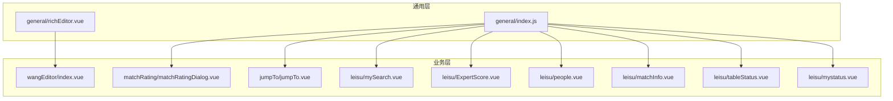

图表来源
- [src/components/general/richEditor.vue:1-220](file://src/components/general/richEditor.vue#L1-L220)
- [src/components/general/index.js:1-41](file://src/components/general/index.js#L1-L41)
- [src/components/matchRating/matchRatingDialog.vue:1-800](file://src/components/matchRating/matchRatingDialog.vue#L1-L800)
- [src/components/jumpTo/jumpTo.vue:1-800](file://src/components/jumpTo/jumpTo.vue#L1-L800)
- [src/components/wangEditor/index.vue:1-800](file://src/components/wangEditor/index.vue#L1-L800)
- [src/components/leisu/mySearch.vue:1-410](file://src/components/leisu/mySearch.vue#L1-L410)
- [src/components/leisu/ExpertScore.vue:1-116](file://src/components/leisu/ExpertScore.vue#L1-L116)
- [src/components/leisu/people.vue:1-334](file://src/components/leisu/people.vue#L1-L334)
- [src/components/leisu/matchInfo.vue:1-800](file://src/components/leisu/matchInfo.vue#L1-L800)
- [src/components/leisu/tableStatus.vue:1-73](file://src/components/leisu/tableStatus.vue#L1-L73)
- [src/components/leisu/mystatus.vue:1-89](file://src/components/leisu/mystatus.vue#L1-L89)

章节来源
- [src/components/general/index.js:1-41](file://src/components/general/index.js#L1-L41)

## 核心组件
- 富文本编辑器组件：提供表情包、图片/视频插入、跳转链接、评分图、事件图等业务能力，支持源码模式与模板快捷插入。
- 比赛评分弹窗：统一展示与管理比赛评分数据，支持筛选、标签、删除、创建评分项等。
- 跳转配置组件：集中式跳转配置，支持多种资源类型与参数映射，联动资源检索。
- 达人评分组件：以可视化卡片形式展示与统计达人评分项。
- 通用搜索组件：封装多种搜索输入形态（输入、选择、日期、区间、滑块、单选），统一输出查询对象。
- 专家号评分组件：基于专家维度的评分统计与保存。
- 人员侧滑面板：按模块化区域展开用户/聊天/社区/比赛/资讯/预测/专家/消息/钱包/轨迹等。
- 状态标签组件：以图标化标签展示用户状态、权限与能力。

章节来源
- [src/components/wangEditor/index.vue:1-800](file://src/components/wangEditor/index.vue#L1-L800)
- [src/components/matchRating/matchRatingDialog.vue:1-800](file://src/components/matchRating/matchRatingDialog.vue#L1-L800)
- [src/components/jumpTo/jumpTo.vue:1-800](file://src/components/jumpTo/jumpTo.vue#L1-L800)
- [src/components/leisu/ExpertScore.vue:1-116](file://src/components/leisu/ExpertScore.vue#L1-L116)
- [src/components/leisu/mySearch.vue:1-410](file://src/components/leisu/mySearch.vue#L1-L410)
- [src/components/leisu/people.vue:1-334](file://src/components/leisu/people.vue#L1-L334)
- [src/components/leisu/tableStatus.vue:1-73](file://src/components/leisu/tableStatus.vue#L1-L73)
- [src/components/leisu/mystatus.vue:1-89](file://src/components/leisu/mystatus.vue#L1-L89)

## 架构总览
业务组件围绕“数据驱动 + 事件驱动”的模式组织，通过 props 输入、$emit 输出、Vuex/Store 注入表情包与字典数据，配合 Element UI 组件实现交互与状态管理。

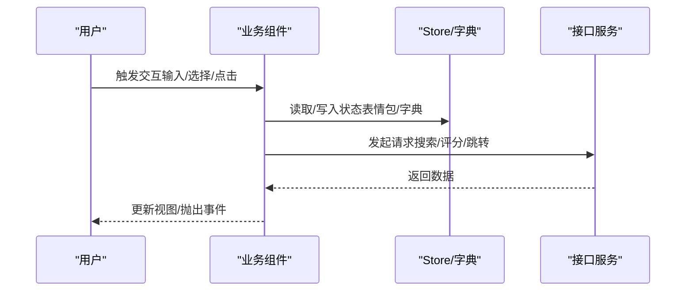

图表来源
- [src/components/wangEditor/index.vue:286-455](file://src/components/wangEditor/index.vue#L286-L455)
- [src/components/general/richEditor.vue:43-60](file://src/components/general/richEditor.vue#L43-L60)
- [src/components/jumpTo/jumpTo.vue:728-795](file://src/components/jumpTo/jumpTo.vue#L728-L795)

## 详细组件分析

### 富文本编辑器组件（wangEditor）
- 设计模式：组合 + 插件化。通过 Boot.registerModule 注册自定义菜单与渲染元素，实现“表情包面板、跳转链接、评分图、事件图、视频/图片上传”等能力。
- 数据绑定与状态管理：通过 v-model 绑定 HTML 内容；初始化时兼容旧版数据结构；支持按 source 动态隐藏/显示菜单。
- 事件处理：提供 onCreated/onDestroyed/onFocus/onBlur/onChange 等生命周期事件；支持源码模式、模板插入、批量插入跳转。
- 配置扩展：通过 props 控制是否启用视频/图片/跳转/评分/链接搜索/全屏等功能；支持目录名与水印等上传参数。

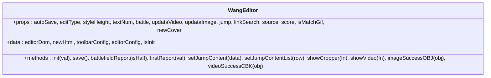

图表来源
- [src/components/wangEditor/index.vue:95-285](file://src/components/wangEditor/index.vue#L95-L285)

章节来源
- [src/components/wangEditor/index.vue:1-800](file://src/components/wangEditor/index.vue#L1-L800)

### 富文本编辑器（通用富文本 RichEditor）
- 设计模式：内容可编辑区域 + 表情选择器 + 文本与 HTML 转换。
- 数据绑定：value 双向绑定；watch 同步回显；getPlainText 提交纯文本。
- 事件处理：input/blur/focus/keyup 保存光标；插入表情时恢复光标并更新值。
- 性能与体验：异步加载表情包，确保渲染顺序；支持 GIF 表情特殊处理。

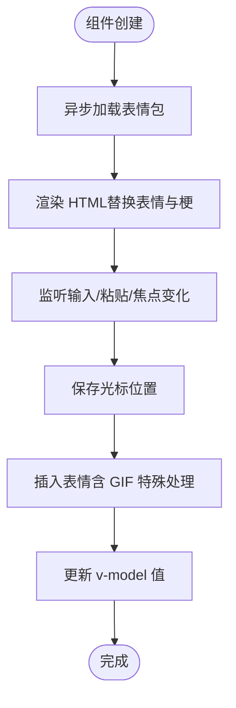

图表来源
- [src/components/general/richEditor.vue:43-176](file://src/components/general/richEditor.vue#L43-L176)

章节来源
- [src/components/general/richEditor.vue:1-220](file://src/components/general/richEditor.vue#L1-L220)

### 比赛评分弹窗（matchRatingDialog）
- 设计模式：对话框 + Tab 切换 + 卡片列表 + 评分统计。
- 数据绑定：props 接收 source/sourceSub；data 维护评分数据、比赛信息、标签与筛选状态。
- 事件处理：添加评分项、创建自定义评分、删除评分、编辑标签、选择选手、打开详情对话框。
- 业务流程：根据 sport_id/game_id 决定展示结构与统计方式；支持网球双打/电竞轮次/替补等差异化展示。

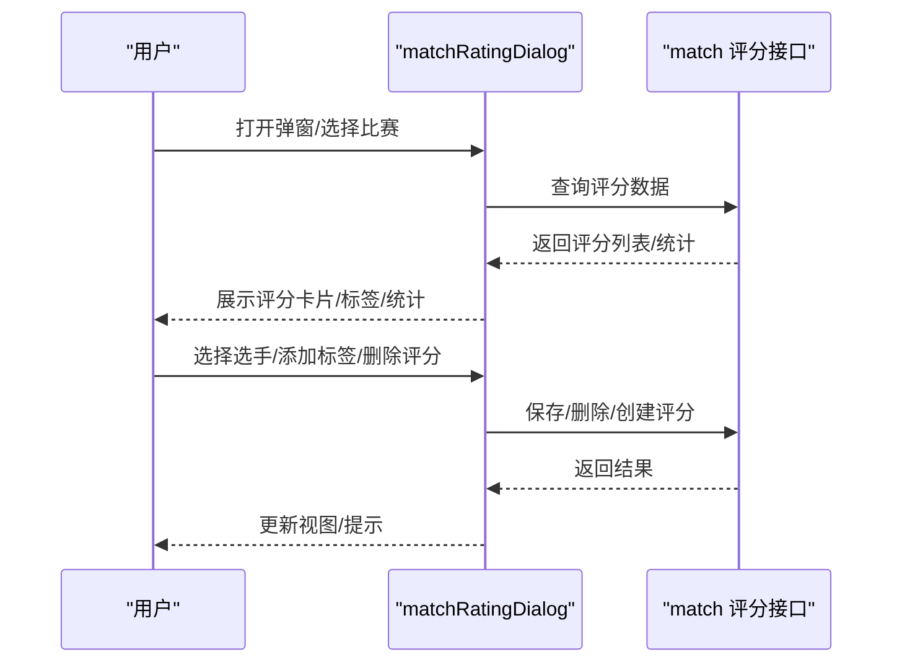

图表来源
- [src/components/matchRating/matchRatingDialog.vue:706-797](file://src/components/matchRating/matchRatingDialog.vue#L706-L797)

章节来源
- [src/components/matchRating/matchRatingDialog.vue:1-800](file://src/components/matchRating/matchRatingDialog.vue#L1-L800)

### 跳转配置组件（jumpTo）
- 设计模式：表单 + 条件渲染 + 资源检索联动。
- 数据绑定：emitData.type + emitData.params 统一承载跳转类型与参数；根据类型动态显示运动/游戏/资源选择。
- 事件处理：类型变更、运动/游戏选择、资源检索回调、颜色选择器回调、视频分析导入 URL。
- 扩展能力：支持批量跳转标记、透传参数、不同来源（资讯/帖子）目录名切换。

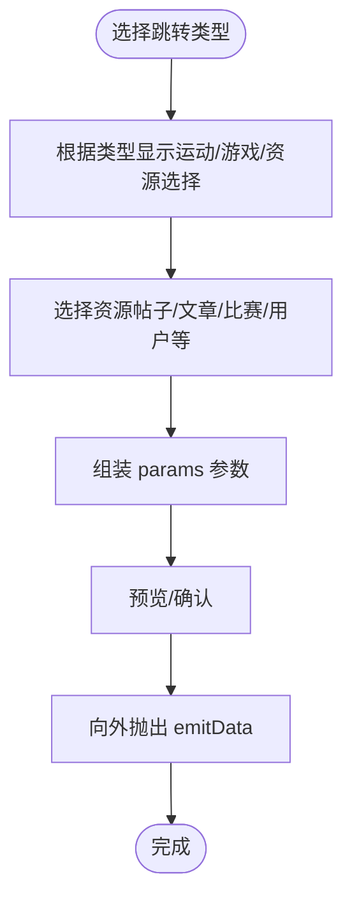

图表来源
- [src/components/jumpTo/jumpTo.vue:1-800](file://src/components/jumpTo/jumpTo.vue#L1-L800)

章节来源
- [src/components/jumpTo/jumpTo.vue:1-800](file://src/components/jumpTo/jumpTo.vue#L1-L800)

### 达人评分组件（ExpertScore）
- 设计模式：卡片式评分项 + 计算属性统计。
- 数据绑定：pscore 输入；内部维护 scoreList；computed 计算激活项与总分。
- 事件处理：点击切换激活状态；save 返回激活状态对象。

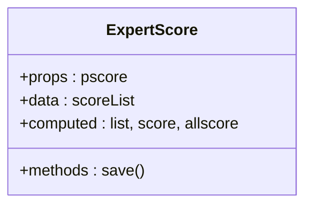

图表来源
- [src/components/leisu/ExpertScore.vue:1-52](file://src/components/leisu/ExpertScore.vue#L1-L52)

章节来源
- [src/components/leisu/ExpertScore.vue:1-116](file://src/components/leisu/ExpertScore.vue#L1-L116)

### 通用搜索组件（mySearch）
- 设计模式：多形态输入 + 统一输出 + 资源检索联动。
- 数据绑定：demoData/options 决定输入类型；searchResourceFields 映射资源类型；allowEmpty 控制空值搜索。
- 事件处理：askData 统一输出查询对象；reset 重置；showSearch 打开资源检索对话框；radioChange 通知单选变化。

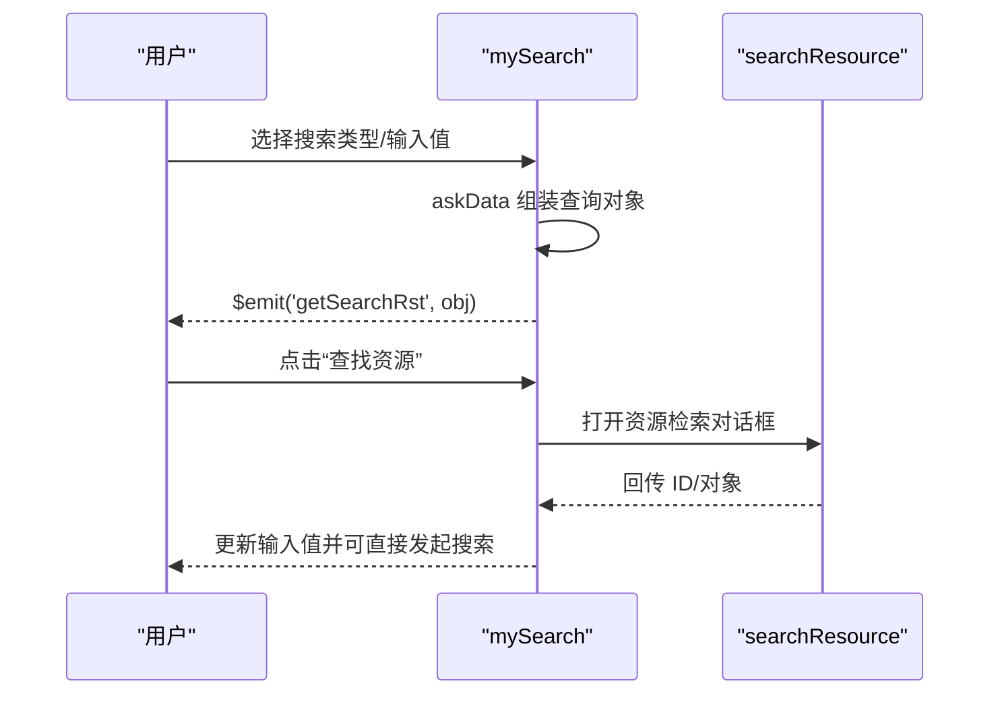

图表来源
- [src/components/leisu/mySearch.vue:311-341](file://src/components/leisu/mySearch.vue#L311-L341)
- [src/components/leisu/mySearch.vue:398-401](file://src/components/leisu/mySearch.vue#L398-L401)

章节来源
- [src/components/leisu/mySearch.vue:1-410](file://src/components/leisu/mySearch.vue#L1-L410)

### 人员侧滑面板（people）
- 设计模式：侧滑容器 + 动态组件切换。
- 数据绑定：actived 当前模块；xxkname 子标签；detail 用户详情；zIndex 层级控制。
- 权限控制：hasPwerObj 按模块聚合权限键，运行时判断显示。
- 事件处理：changeDetails 更新详情；init 打开面板并加载用户信息。

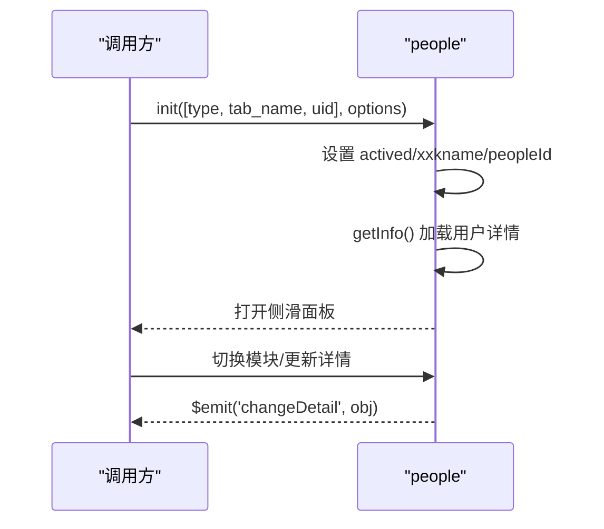

图表来源
- [src/components/leisu/people.vue:316-322](file://src/components/leisu/people.vue#L316-L322)
- [src/components/leisu/people.vue:281-303](file://src/components/leisu/people.vue#L281-L303)

章节来源
- [src/components/leisu/people.vue:1-334](file://src/components/leisu/people.vue#L1-L334)

### 状态标签组件（tableStatus + mystatus）
- 设计模式：图标化标签 + Tooltip 提示。
- 数据绑定：row 输入行数据；根据状态/权限生成多个状态标签。
- 样式：mystatus 提供 success/danger/warning/disabel 等类型样式。

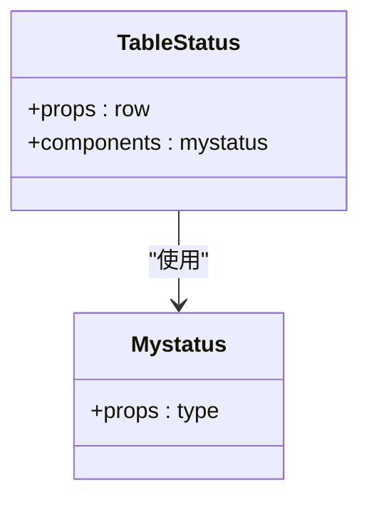

图表来源
- [src/components/leisu/tableStatus.vue:67-71](file://src/components/leisu/tableStatus.vue#L67-L71)
- [src/components/leisu/mystatus.vue:77-87](file://src/components/leisu/mystatus.vue#L77-L87)

章节来源
- [src/components/leisu/tableStatus.vue:1-73](file://src/components/leisu/tableStatus.vue#L1-L73)
- [src/components/leisu/mystatus.vue:1-89](file://src/components/leisu/mystatus.vue#L1-L89)

## 依赖关系分析
- 组件耦合：wangEditor 与 general/richEditor 在富文本能力上互补；matchRatingDialog 与 jumpTo 在业务流程上互补（评分与跳转）。
- 外部依赖：Element UI、@wangeditor/editor-for-vue、Store 中的表情包与字典数据。
- 数据流：props 输入 -> computed/watch -> methods 处理 -> $emit 输出 -> 上层视图更新。

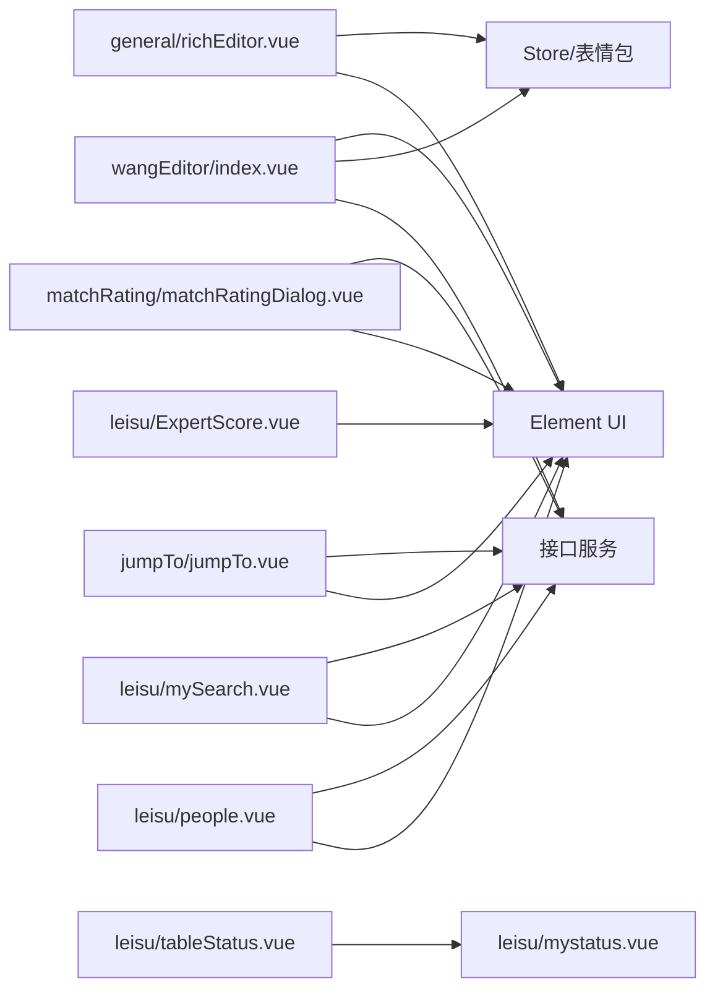

图表来源
- [src/components/wangEditor/index.vue:85-98](file://src/components/wangEditor/index.vue#L85-L98)
- [src/components/general/richEditor.vue:12-21](file://src/components/general/richEditor.vue#L12-L21)
- [src/components/matchRating/matchRatingDialog.vue:696-708](file://src/components/matchRating/matchRatingDialog.vue#L696-L708)
- [src/components/jumpTo/jumpTo.vue:608-636](file://src/components/jumpTo/jumpTo.vue#L608-L636)
- [src/components/leisu/mySearch.vue:162-164](file://src/components/leisu/mySearch.vue#L162-L164)
- [src/components/leisu/people.vue:85-97](file://src/components/leisu/people.vue#L85-L97)
- [src/components/leisu/ExpertScore.vue:1-12](file://src/components/leisu/ExpertScore.vue#L1-L12)
- [src/components/leisu/tableStatus.vue:67-71](file://src/components/leisu/tableStatus.vue#L67-L71)

## 性能考量
- 富文本初始化：wangEditor 与 richEditor 均采用异步加载表情包并在完成后初始化，避免空白与闪烁。
- DOM 操作：wangEditor 使用 dangerouslyInsertHtml/insertNode 等原生插入方式，减少不必要的响应式更新。
- 事件节流：wangEditor 通过延时器与计数器控制自动保存频率，降低频繁写入。
- 渲染优化：matchRatingDialog 使用 v-loading 与分页/懒加载思路（滚动容器）提升长列表性能。
- 图片/视频上传：通过裁剪与水印参数控制尺寸与质量，减少带宽与存储压力。

## 故障排查指南
- 富文本表情包为空：检查 Store 中表情包是否加载成功；确认 isInit 标志位与初始化顺序。
- 跳转参数缺失：核对 jumpTo 的 type 与 params 映射；确认资源检索回调是否正确写入。
- 评分弹窗数据异常：检查 matchData/sport_id/game_id 与评分接口返回结构一致性；确认过滤与统计逻辑。
- 搜索组件空值：allowEmpty 为真时需显式处理空查询；否则提示“搜索内容不能为空”。

章节来源
- [src/components/wangEditor/index.vue:286-455](file://src/components/wangEditor/index.vue#L286-L455)
- [src/components/general/richEditor.vue:43-60](file://src/components/general/richEditor.vue#L43-L60)
- [src/components/jumpTo/jumpTo.vue:311-341](file://src/components/jumpTo/jumpTo.vue#L311-L341)
- [src/components/matchRating/matchRatingDialog.vue:740-797](file://src/components/matchRating/matchRatingDialog.vue#L740-L797)

## 结论
Leisu Admin 的业务组件以“可配置 + 可扩展 + 可组合”为核心设计理念，通过统一的数据绑定、事件处理与状态管理，实现了富文本、评分、跳转、搜索、人员面板等复杂业务场景的高复用与易维护性。建议在后续迭代中持续完善组件文档与单元测试，强化错误边界与性能监控，进一步提升可维护性与可扩展性。

## 附录
- 开发规范与最佳实践
  - 组件命名：语义化、领域化（如 leisu、matchRating、jumpTo）。
  - Props 设计：明确必填/可选、默认值与类型约束；尽量扁平化。
  - 事件命名：遵循 onXxx/$emit('xxx') 规范；避免跨层级事件风暴。
  - 状态管理：局部状态为主，共享状态通过 Store 注入；避免过度响应式。
  - 性能优化：长列表虚拟化/分页；异步加载与缓存；防抖/节流。
  - 可测试性：拆分纯函数与副作用；提供最小可测试单元。
  - 文档与注释：每个组件提供用途、参数、事件、插槽说明；复杂流程补充时序图。