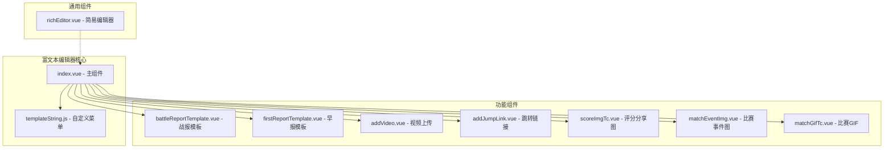
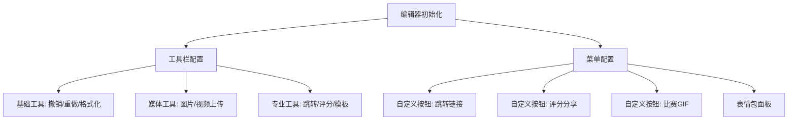
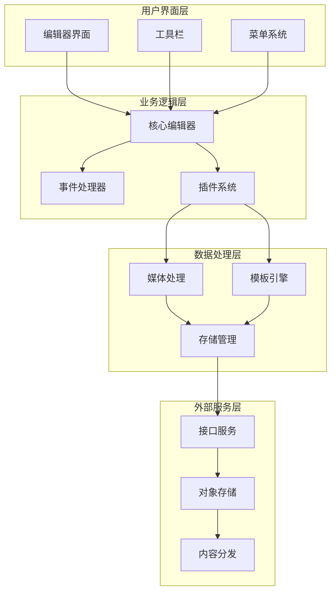
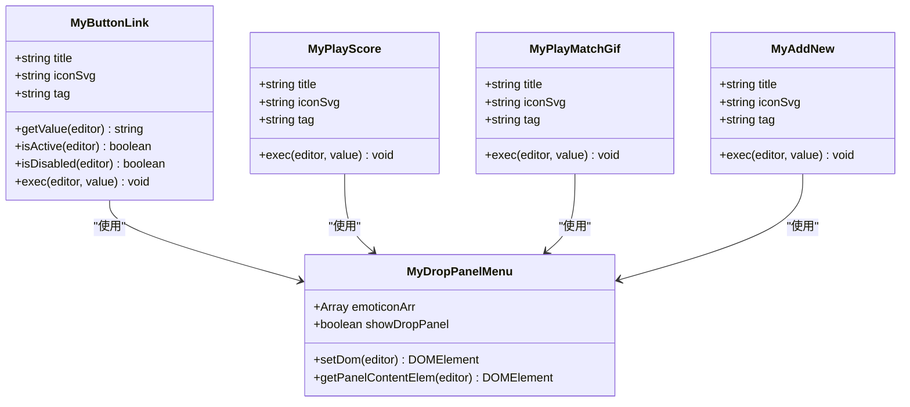
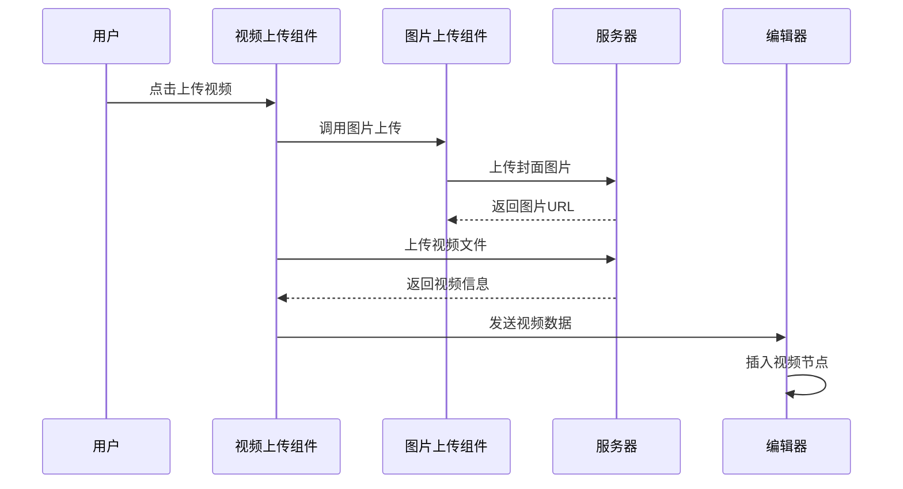
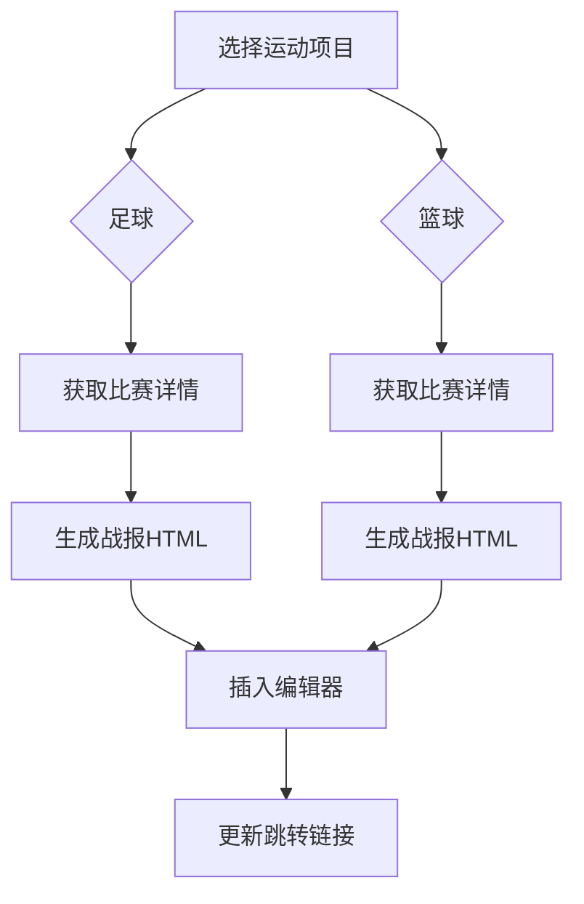
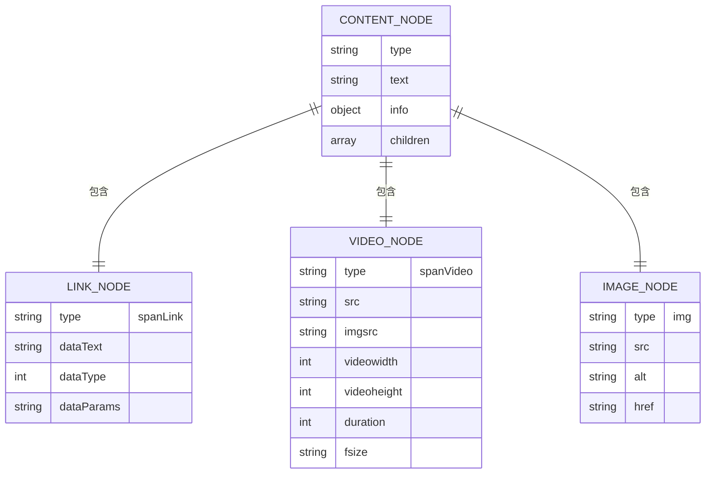

# 富文本编辑器组件

<cite>
**本文档引用的文件**
- [index.vue](file://src/components/wangEditor/index.vue)
- [templateString.js](file://src/components/wangEditor/components/templateString.js)
- [addVideo.vue](file://src/components/wangEditor/components/addVideo.vue)
- [addJumpLink.vue](file://src/components/wangEditor/components/addJumpLink.vue)
- [scoreImgTc.vue](file://src/components/wangEditor/components/scoreImgTc.vue)
- [matchEventImg.vue](file://src/components/wangEditor/components/matchEventImg.vue)
- [matchGifTc.vue](file://src/components/wangEditor/components/matchGifTc.vue)
- [battleReportTemplate.vue](file://src/components/wangEditor/components/battleReportTemplate.vue)
- [firstReportTemplate.vue](file://src/components/wangEditor/components/firstReportTemplate.vue)
- [richEditor.vue](file://src/components/general/richEditor.vue)
- [package.json](file://package.json)
</cite>

## 目录
1. [简介](#简介)
2. [项目结构](#项目结构)
3. [核心组件](#核心组件)
4. [架构概览](#架构概览)
5. [详细组件分析](#详细组件分析)
6. [依赖关系分析](#依赖关系分析)
7. [性能考虑](#性能考虑)
8. [故障排除指南](#故障排除指南)
9. [结论](#结论)

## 简介

富文本编辑器组件是基于 WangEditor 5.x 架构开发的企业级富文本编辑解决方案。该组件提供了完整的文本编辑、媒体插入、链接管理、模板应用等功能，特别针对体育资讯场景进行了深度定制，支持比赛事件、评分分享、战报模板等专业功能。

该编辑器采用模块化设计，集成了图片裁剪、视频上传、表情包、跳转链接等多种媒体处理能力，同时保持了良好的可扩展性和定制性。

## 项目结构

富文本编辑器组件位于 `src/components/wangEditor/` 目录下，采用分层架构设计：



**图表来源**
- [index.vue:1-100](file://src/components/wangEditor/index.vue#L1-L100)
- [templateString.js:1-50](file://src/components/wangEditor/components/templateString.js#L1-L50)

**章节来源**
- [index.vue:1-100](file://src/components/wangEditor/index.vue#L1-L100)
- [package.json:37-96](file://package.json#L37-L96)

## 核心组件

### 主编辑器组件 (index.vue)

主编辑器组件是整个富文本编辑器的核心，负责协调各个功能模块的工作。它基于 WangEditor 5.x 的 Editor 和 Toolbar 组件构建，实现了高度定制化的编辑体验。

#### 核心特性

1. **响应式工具栏配置** - 支持根据不同的使用场景动态调整工具栏显示
2. **自定义菜单系统** - 集成了跳转链接、评分分享、比赛GIF等专业功能
3. **媒体处理集成** - 内置图片裁剪、视频上传、表情包等功能
4. **模板应用系统** - 支战报模板和早报模板的快速应用

#### 关键配置

编辑器的核心配置包括工具栏配置和菜单配置两个主要部分：



**图表来源**
- [index.vue:189-275](file://src/components/wangEditor/index.vue#L189-L275)

**章节来源**
- [index.vue:172-285](file://src/components/wangEditor/index.vue#L172-L285)

## 架构概览

富文本编辑器采用了模块化的架构设计，将不同的功能模块独立封装，通过事件驱动的方式进行通信。



**图表来源**
- [index.vue:291-448](file://src/components/wangEditor/index.vue#L291-L448)
- [templateString.js:1-490](file://src/components/wangEditor/components/templateString.js#L1-L490)

## 详细组件分析

### 自定义菜单系统

编辑器实现了高度定制化的菜单系统，通过工厂模式创建各种功能按钮：

#### 菜单类结构



**图表来源**
- [templateString.js:1-490](file://src/components/wangEditor/components/templateString.js#L1-L490)

#### 菜单功能详解

1. **跳转链接菜单** - 支持创建可点击的跳转链接，包含类型和参数配置
2. **评分分享菜单** - 生成比赛评分分享图片，支持多种运动项目
3. **比赛GIF菜单** - 集成比赛事件GIF和视频资源
4. **表情包菜单** - 提供多层级的表情包选择面板
5. **快讯菜单** - 快速插入新闻快讯内容

**章节来源**
- [templateString.js:1-490](file://src/components/wangEditor/components/templateString.js#L1-L490)

### 媒体处理组件

编辑器集成了完整的媒体处理能力，包括图片、视频、音频等多媒体内容的处理。

#### 视频上传组件

视频上传组件提供了完整的视频处理流程：



**图表来源**
- [addVideo.vue:206-264](file://src/components/wangEditor/components/addVideo.vue#L206-L264)

#### 图片处理流程

图片处理组件支持裁剪、压缩、水印等多种功能：

1. **图片裁剪** - 基于 vue-cropper 实现专业级图片裁剪
2. **格式转换** - 支持多种图片格式的自动转换
3. **尺寸适配** - 自动适配不同显示场景的图片尺寸
4. **水印功能** - 支持自定义水印效果

**章节来源**
- [addVideo.vue:142-268](file://src/components/wangEditor/components/addVideo.vue#L142-L268)

### 模板应用系统

编辑器提供了强大的模板应用功能，支持战报模板和早报模板的快速应用。

#### 战报模板系统

战报模板系统支持不同运动项目的战报生成：



**图表来源**
- [battleReportTemplate.vue:111-130](file://src/components/wangEditor/components/battleReportTemplate.vue#L111-L130)

#### 早报模板系统

早报模板系统提供了智能化的内容组合功能：

1. **内容筛选** - 基于时间、类型等条件筛选合适的内容
2. **格式化处理** - 自动处理图片、标题等元素的格式
3. **批量应用** - 支持多条内容的批量应用
4. **预览功能** - 提供实时预览效果

**章节来源**
- [battleReportTemplate.vue:48-139](file://src/components/wangEditor/components/battleReportTemplate.vue#L48-L139)
- [firstReportTemplate.vue:90-186](file://src/components/wangEditor/components/firstReportTemplate.vue#L90-L186)

### 数据模型和格式化

编辑器实现了复杂的数据模型来处理不同类型的内容：

#### 内容节点结构



**图表来源**
- [index.vue:549-578](file://src/components/wangEditor/index.vue#L549-L578)

#### 数据格式化

编辑器支持多种数据格式的输入输出：

1. **HTML格式** - 标准HTML结构，便于SEO和分享
2. **JSON格式** - 结构化数据，便于程序处理
3. **纯文本** - 简化格式，便于导出和备份
4. **富文本格式** - 保留格式的富文本内容

**章节来源**
- [index.vue:679-797](file://src/components/wangEditor/index.vue#L679-L797)

## 依赖关系分析

富文本编辑器组件依赖于多个第三方库和服务：

```mermaid
graph TB
subgraph "核心依赖"
WE[@wangeditor/editor]
WEFV[@wangeditor/editor-for-vue]
SNABBDOM[snabbdom]
end
subgraph "UI框架"
ELEMENT[element-ui]
VUE[vue 2.6.10]
end
subgraph "媒体处理"
HTML2CANVAS[html2canvas]
VVIEWER[v-viewer]
VUE_CROPPER[vue-cropper]
end
subgraph "工具库"
AXIOS[axios]
Lodash[lodash]
Moment[moment]
end
subgraph "存储服务"
ALIOSS[ali-oss]
QINIU[qiniu-js]
end
WE --> WEFV
WEFV --> VUE
SNABBDOM --> WE
ELEMENT --> VUE
HTML2CANVAS --> VUE
VVIEWER --> VUE
VUE_CROPPER --> VUE
AXIOS --> VUE
Lodash --> VUE
Moment --> VUE
ALIOSS --> VUE
QINIU --> VUE
```

**图表来源**
- [package.json:37-96](file://package.json#L37-L96)

### 关键依赖说明

1. **WangEditor 5.x** - 核心富文本编辑器框架
2. **Element UI** - 企业级UI组件库
3. **html2canvas** - HTML内容截图功能
4. **vue-cropper** - 图片裁剪功能
5. **ali-oss** - 阿里云对象存储
6. **qiniu-js** - 七牛云存储SDK

**章节来源**
- [package.json:37-96](file://package.json#L37-L96)

## 性能考虑

富文本编辑器在设计时充分考虑了性能优化：

### 内存管理

1. **组件懒加载** - 媒体组件按需加载，减少初始内存占用
2. **事件监听清理** - 及时清理不再使用的事件监听器
3. **DOM节点复用** - 通过虚拟DOM提高渲染效率

### 网络优化

1. **图片懒加载** - 媒体资源按需加载
2. **CDN加速** - 使用CDN分发静态资源
3. **缓存策略** - 合理的缓存策略减少重复请求

### 渲染优化

1. **防抖处理** - 输入事件的防抖处理
2. **虚拟滚动** - 大量数据的虚拟滚动支持
3. **增量更新** - 只更新变化的部分

## 故障排除指南

### 常见问题及解决方案

#### 编辑器初始化失败

**问题描述**: 编辑器无法正常初始化

**可能原因**:
1. WangEditor依赖未正确安装
2. 组件注册顺序错误
3. 样式文件加载失败

**解决方案**:
1. 检查package.json中的依赖版本
2. 确保Boot.registerModule在编辑器创建前调用
3. 验证CSS文件的正确加载

#### 媒体上传失败

**问题描述**: 图片或视频上传过程中出现错误

**可能原因**:
1. 存储服务配置错误
2. 网络连接问题
3. 文件格式不支持

**解决方案**:
1. 检查OSS或七牛云的配置信息
2. 验证网络连接状态
3. 确认文件格式和大小限制

#### 表情包显示异常

**问题描述**: 表情包无法正常显示或加载

**可能原因**:
1. 表情包数据加载失败
2. DOM结构不正确
3. CSS样式冲突

**解决方案**:
1. 检查表情包API的响应
2. 验证DOM结构的完整性
3. 检查样式冲突问题

**章节来源**
- [index.vue:449-455](file://src/components/wangEditor/index.vue#L449-L455)

## 结论

富文本编辑器组件是一个功能完整、架构清晰的企业级解决方案。它不仅提供了标准的富文本编辑功能，还针对体育资讯场景进行了深度定制，包括比赛事件处理、评分分享、模板应用等专业功能。

### 主要优势

1. **高度可定制** - 通过模块化设计支持灵活的功能扩展
2. **专业性强** - 针对体育资讯场景的专门优化
3. **性能优秀** - 采用多种优化策略确保流畅的用户体验
4. **易于维护** - 清晰的代码结构和完善的文档

### 技术特色

1. **事件驱动架构** - 通过事件系统实现组件间的松耦合通信
2. **插件化设计** - 支持第三方插件的集成和扩展
3. **多平台支持** - 兼容PC端和移动端的使用场景
4. **国际化支持** - 支持多语言环境下的使用

该组件为开发者提供了一个强大而灵活的富文本编辑解决方案，可以满足各种复杂的文本编辑需求。