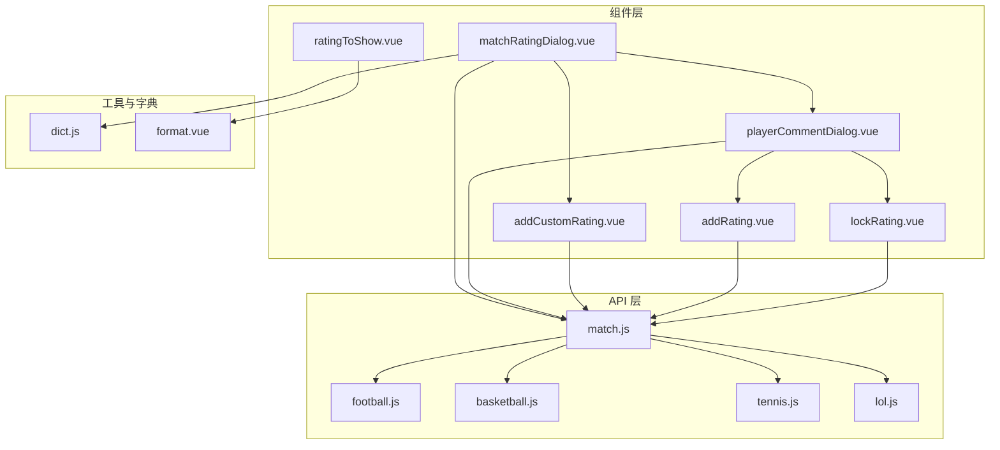
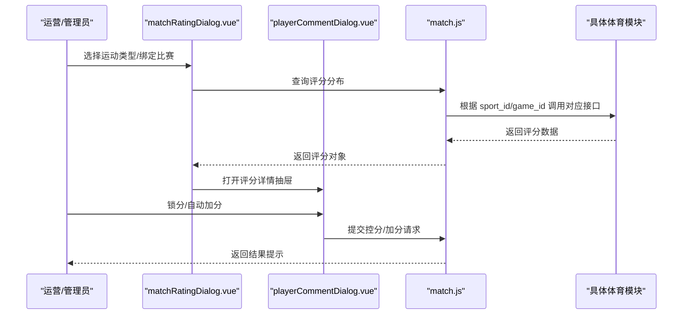
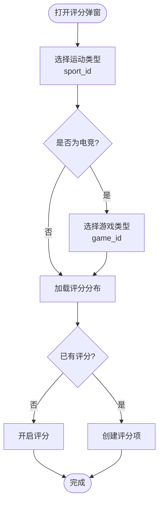
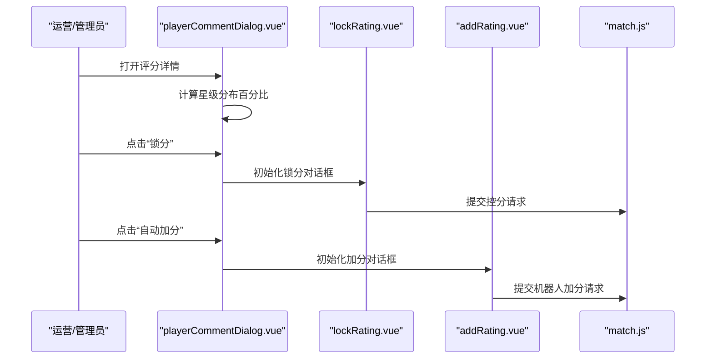
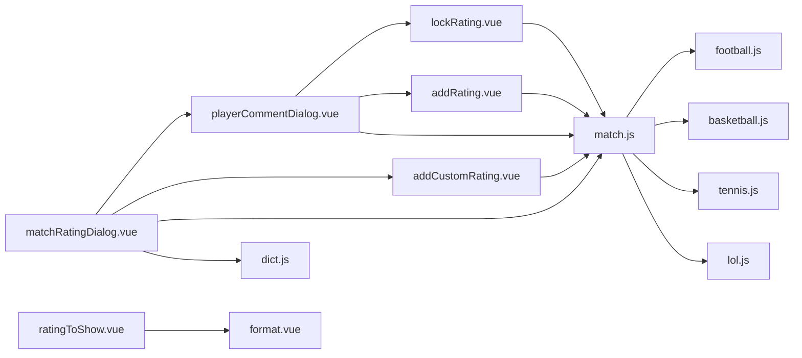

# 比赛评分系统组件

<cite>
**本文档引用的文件**
- [matchRatingDialog.vue](file://src/components/matchRating/matchRatingDialog.vue)
- [playerCommentDialog.vue](file://src/components/matchRating/playerCommentDialog.vue)
- [addRating.vue](file://src/components/matchRating/addRating.vue)
- [lockRating.vue](file://src/components/matchRating/lockRating.vue)
- [addCustomRating.vue](file://src/components/matchRating/addCustomRating.vue)
- [ratingToShow.vue](file://src/components/matchRating/ratingToShow.vue)
- [match.js](file://src/api/match.js)
- [football.js](file://src/api/matchapi/ball/football.js)
- [basketball.js](file://src/api/matchapi/ball/basketball.js)
- [tennis.js](file://src/api/matchapi/ball/tennis.js)
- [lol.js](file://src/api/matchapi/game/lol.js)
- [dict.js](file://src/utils/dict.js)
- [format.vue](file://src/mixins/format.vue)
</cite>

## 目录
1. [引言](#引言)
2. [项目结构](#项目结构)
3. [核心组件](#核心组件)
4. [架构总览](#架构总览)
5. [详细组件分析](#详细组件分析)
6. [依赖关系分析](#依赖关系分析)
7. [性能考虑](#性能考虑)
8. [故障排查指南](#故障排查指南)
9. [结论](#结论)
10. [附录](#附录)

## 引言
本技术文档面向“比赛评分系统组件”，系统化阐述其设计理念、架构实现与交互流程，覆盖评分添加、评分管理、评分展示等核心功能；深入解析数据模型、评分规则与权限控制机制；并提供配置选项、扩展能力与多业务场景的应用指南，帮助开发者与运营人员高效理解与使用该组件。

## 项目结构
比赛评分系统组件位于前端组件目录中，围绕“对话框 + 表单 + API 调用”的模式构建，主要文件如下：
- 组件层：matchRatingDialog、playerCommentDialog、addRating、lockRating、addCustomRating、ratingToShow
- API 层：match.js 统一封装通用评分接口；各体育类型子模块按 sport_id/game_id 分发具体接口
- 工具与字典：dict.js、format.vue 提供枚举映射与格式化能力

图表来源
- [matchRatingDialog.vue](file://src/components/matchRating/matchRatingDialog.vue)
- [playerCommentDialog.vue](file://src/components/matchRating/playerCommentDialog.vue)
- [addRating.vue](file://src/components/matchRating/addRating.vue)
- [lockRating.vue](file://src/components/matchRating/lockRating.vue)
- [addCustomRating.vue](file://src/components/matchRating/addCustomRating.vue)
- [ratingToShow.vue](file://src/components/matchRating/ratingToShow.vue)
- [match.js](file://src/api/match.js)
- [football.js](file://src/api/matchapi/ball/football.js)
- [basketball.js](file://src/api/matchapi/ball/basketball.js)
- [tennis.js](file://src/api/matchapi/ball/tennis.js)
- [lol.js](file://src/api/matchapi/game/lol.js)
- [dict.js](file://src/utils/dict.js)
- [format.vue](file://src/mixins/format.vue)

章节来源
- [matchRatingDialog.vue](file://src/components/matchRating/matchRatingDialog.vue)
- [match.js](file://src/api/match.js)

## 核心组件
- 评分弹窗容器：matchRatingDialog.vue
  - 负责选择运动类型、绑定比赛、加载评分分布、触发评分项创建与编辑
- 评分详情抽屉：playerCommentDialog.vue
  - 展示评分分布与星级进度、支持锁分与自动加分
- 自动加分：addRating.vue
  - 配置星级、数量、起止时间，提交机器人加分
- 锁定评分：lockRating.vue
  - 按星级分配百分比，形成“控分”策略
- 自定义评分项：addCustomRating.vue
  - 支持为特定比赛创建自定义评分项（含头像、位置、小局等）
- 评分列表展示：ratingToShow.vue
  - 展示评分ID、比赛链接、时间与操作按钮

章节来源
- [matchRatingDialog.vue](file://src/components/matchRating/matchRatingDialog.vue)
- [playerCommentDialog.vue](file://src/components/matchRating/playerCommentDialog.vue)
- [addRating.vue](file://src/components/matchRating/addRating.vue)
- [lockRating.vue](file://src/components/matchRating/lockRating.vue)
- [addCustomRating.vue](file://src/components/matchRating/addCustomRating.vue)
- [ratingToShow.vue](file://src/components/matchRating/ratingToShow.vue)

## 架构总览
评分系统采用“组件 + API + 业务模块”的分层架构：
- 组件层：负责用户交互与状态管理
- API 层：统一暴露评分相关接口，按 sport_id/game_id 分发至具体模块
- 业务模块：各体育类型（足球、篮球、网球、电竞）提供评分查询与操作

图表来源
- [matchRatingDialog.vue](file://src/components/matchRating/matchRatingDialog.vue)
- [playerCommentDialog.vue](file://src/components/matchRating/playerCommentDialog.vue)
- [match.js](file://src/api/match.js)
- [football.js](file://src/api/matchapi/ball/football.js)
- [basketball.js](file://src/api/matchapi/ball/basketball.js)
- [tennis.js](file://src/api/matchapi/ball/tennis.js)
- [lol.js](file://src/api/matchapi/game/lol.js)

## 详细组件分析

### 评分弹窗容器（matchRatingDialog.vue）
- 功能职责
  - 选择运动类型与游戏类型（电竞）
  - 绑定比赛并加载评分分布
  - 提供“开启评分”“创建评分项”入口
  - 处理不同运动类型的评分数据差异（如网球可直接绑定整场评分）
- 关键流程
  - 根据 sport_id 选择对应评分接口（足球/篮球/网球/电竞）
  - 初始化评分状态与评分项列表
  - 与搜索资源联动，支持快速定位比赛
- 交互要点
  - 不同 sport_id 的 UI 与字段存在差异
  - 电竞 game_id 决定具体评分接口

图表来源
- [matchRatingDialog.vue](file://src/components/matchRating/matchRatingDialog.vue)

章节来源
- [matchRatingDialog.vue](file://src/components/matchRating/matchRatingDialog.vue)

### 评分详情抽屉（playerCommentDialog.vue）
- 功能职责
  - 展示平均分、评分总数与星级分布
  - 提供“锁分”“自动加分”入口
  - 嵌套评论模板，支持评分评论管理
- 关键流程
  - 计算星级分布百分比
  - 锁分时初始化星级分配
  - 加分时选择星级并配置数量与时间窗口
- 权限与安全
  - 仅对具备权限的用户开放“锁分/加分”操作
  - 时间范围限制（最多7天）

图表来源
- [playerCommentDialog.vue](file://src/components/matchRating/playerCommentDialog.vue)
- [lockRating.vue](file://src/components/matchRating/lockRating.vue)
- [addRating.vue](file://src/components/matchRating/addRating.vue)
- [match.js](file://src/api/match.js)

章节来源
- [playerCommentDialog.vue](file://src/components/matchRating/playerCommentDialog.vue)
- [lockRating.vue](file://src/components/matchRating/lockRating.vue)
- [addRating.vue](file://src/components/matchRating/addRating.vue)

### 自动加分（addRating.vue）
- 功能职责
  - 配置星级、数量、起止时间
  - 校验时间范围与数量合法性
  - 调用机器人加分接口
- 规则约束
  - 数量≥0
  - 开始时间≤结束时间
  - 时间跨度≤7天
  - 结束时间与开始时间差值转换为秒级时间戳

章节来源
- [addRating.vue](file://src/components/matchRating/addRating.vue)
- [match.js](file://src/api/match.js)

### 锁定评分（lockRating.vue）
- 功能职责
  - 按星级分配百分比，形成控分策略
  - 实时计算总分占比
- 设计要点
  - 五星至一星五档分配，每档基础分权重一致
  - 进度条直观展示各星级占比

章节来源
- [lockRating.vue](file://src/components/matchRating/lockRating.vue)
- [match.js](file://src/api/match.js)

### 自定义评分项（addCustomRating.vue）
- 功能职责
  - 为特定比赛创建自定义评分项
  - 支持设置位置（主场/客场/场外）、小局（网球/电竞）
  - 上传头像、填写名称与备注
- 字段说明
  - comp_id、match_id、sport_id、season_id、game_id、locate、box_num、custom_name、custom_icon、summary
- 业务差异
  - 网球/电竞可能需要 box_num（小局）与 game_id

章节来源
- [addCustomRating.vue](file://src/components/matchRating/addCustomRating.vue)
- [match.js](file://src/api/match.js)

### 评分列表展示（ratingToShow.vue）
- 功能职责
  - 展示评分ID、比赛链接、时间与操作按钮
  - 使用 mixin 格式化时间与运动类型显示
- 交互行为
  - 支持编辑与删除操作回调

章节来源
- [ratingToShow.vue](file://src/components/matchRating/ratingToShow.vue)
- [format.vue](file://src/mixins/format.vue)

## 依赖关系分析
- 组件间依赖
  - matchRatingDialog.vue 作为入口，依赖 playerCommentDialog.vue、addCustomRating.vue
  - playerCommentDialog.vue 依赖 lockRating.vue、addRating.vue
- API 依赖
  - match.js 统一导出评分相关接口，内部按 sport_id/game_id 分发至具体模块
  - 各体育模块提供评分查询与操作接口
- 工具与字典
  - dict.js 提供运动类型枚举映射
  - format.vue 提供时间与运动类型格式化

图表来源
- [matchRatingDialog.vue](file://src/components/matchRating/matchRatingDialog.vue)
- [playerCommentDialog.vue](file://src/components/matchRating/playerCommentDialog.vue)
- [addRating.vue](file://src/components/matchRating/addRating.vue)
- [lockRating.vue](file://src/components/matchRating/lockRating.vue)
- [addCustomRating.vue](file://src/components/matchRating/addCustomRating.vue)
- [ratingToShow.vue](file://src/components/matchRating/ratingToShow.vue)
- [match.js](file://src/api/match.js)
- [football.js](file://src/api/matchapi/ball/football.js)
- [basketball.js](file://src/api/matchapi/ball/basketball.js)
- [tennis.js](file://src/api/matchapi/ball/tennis.js)
- [lol.js](file://src/api/matchapi/game/lol.js)
- [dict.js](file://src/utils/dict.js)
- [format.vue](file://src/mixins/format.vue)

章节来源
- [match.js](file://src/api/match.js)
- [dict.js](file://src/utils/dict.js)
- [format.vue](file://src/mixins/format.vue)

## 性能考虑
- 接口调用优化
  - 评分查询按 sport_id/game_id 分发，避免全量扫描
  - 控分/加分请求需严格校验时间范围，减少无效请求
- 渲染优化
  - 星级分布计算在组件内完成，建议缓存中间结果
  - 大列表展示使用虚拟滚动或分页（如后续扩展）
- 网络与并发
  - 批量操作时合并请求，避免频繁短连接
  - 对失败请求进行重试与降级提示

## 故障排查指南
- 常见问题
  - “请先设置运动类型”：确保在弹窗中正确选择 sport_id
  - “开始时间不能大于结束时间”：检查时间选择器输入
  - “开始时间和结束时间间隔不超过7天”：调整时间范围
  - “数量应不小于0”：检查加分数量输入
- 排查步骤
  - 检查 sport_id/game_id 是否匹配实际比赛
  - 核对评分接口返回的数据结构与字段
  - 查看浏览器网络面板确认接口响应状态
- 日志与反馈
  - 组件内统一使用消息提示反馈错误
  - 建议在 API 层增加统一错误处理与埋点

章节来源
- [addRating.vue](file://src/components/matchRating/addRating.vue)
- [matchRatingDialog.vue](file://src/components/matchRating/matchRatingDialog.vue)

## 结论
比赛评分系统组件以清晰的分层架构与模块化设计，实现了从评分添加、控分、加分到评分展示的完整闭环。通过 sport_id/game_id 的灵活分发与统一 API 封装，系统具备良好的扩展性与可维护性。建议在生产环境中结合权限控制与审计日志，进一步完善安全性与可观测性。

## 附录

### 数据模型与字段说明
- 评分分布对象（示例字段）
  - avg_rating：平均分
  - rating_count：评分人数
  - rating_dist：星级分布（如 {5: 30, 4: 45, ...}）
- 自定义评分项（示例字段）
  - comp_id、match_id、sport_id、season_id、game_id、locate、box_num、custom_name、custom_icon、summary

章节来源
- [playerCommentDialog.vue](file://src/components/matchRating/playerCommentDialog.vue)
- [addCustomRating.vue](file://src/components/matchRating/addCustomRating.vue)

### 评分规则与权限控制
- 评分规则
  - 锁分：按星级分配百分比，形成控分策略
  - 自动加分：限定时间窗口与数量，防止滥用
- 权限控制
  - 仅授权用户可见并操作“锁分/加分”
  - 接口层面需配合后端鉴权与审计

章节来源
- [lockRating.vue](file://src/components/matchRating/lockRating.vue)
- [addRating.vue](file://src/components/matchRating/addRating.vue)

### 配置选项与扩展能力
- 配置项
  - 运动类型映射：dict.js
  - 时间格式化：format.vue
- 扩展能力
  - 新增体育类型：在 match.js 中新增接口导出，在对应模块补充评分接口
  - 新增评分维度：在 addCustomRating.vue 中扩展字段与校验逻辑

章节来源
- [dict.js](file://src/utils/dict.js)
- [format.vue](file://src/mixins/format.vue)
- [match.js](file://src/api/match.js)

### 应用场景与使用指南
- 场景一：足球/篮球常规评分
  - 步骤：选择 sport_id → 绑定比赛 → 查看评分分布 → 必要时控分/加分
- 场景二：网球整场评分
  - 步骤：选择 sport_id=3 → 若为资讯来源且已绑定，则直接绑定整场评分
- 场景三：电竞小局评分
  - 步骤：选择 sport_id=4 → 选择 game_id → 选择 box_num → 创建评分项

章节来源
- [matchRatingDialog.vue](file://src/components/matchRating/matchRatingDialog.vue)
- [addCustomRating.vue](file://src/components/matchRating/addCustomRating.vue)